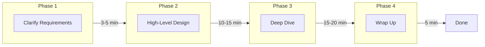
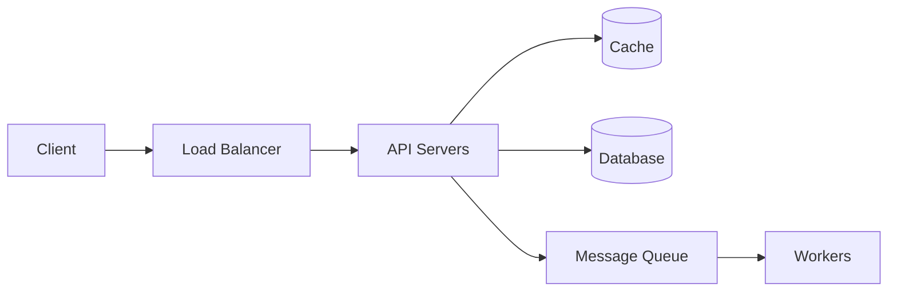
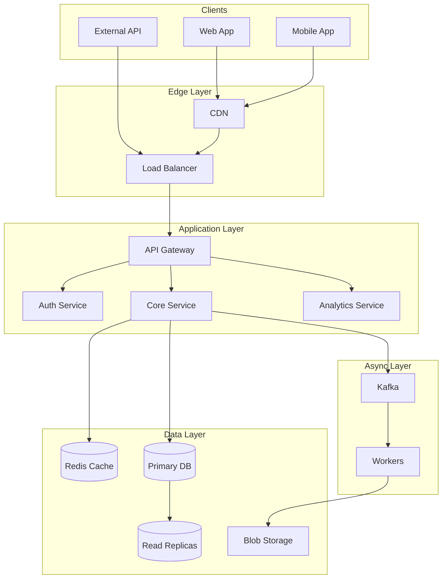
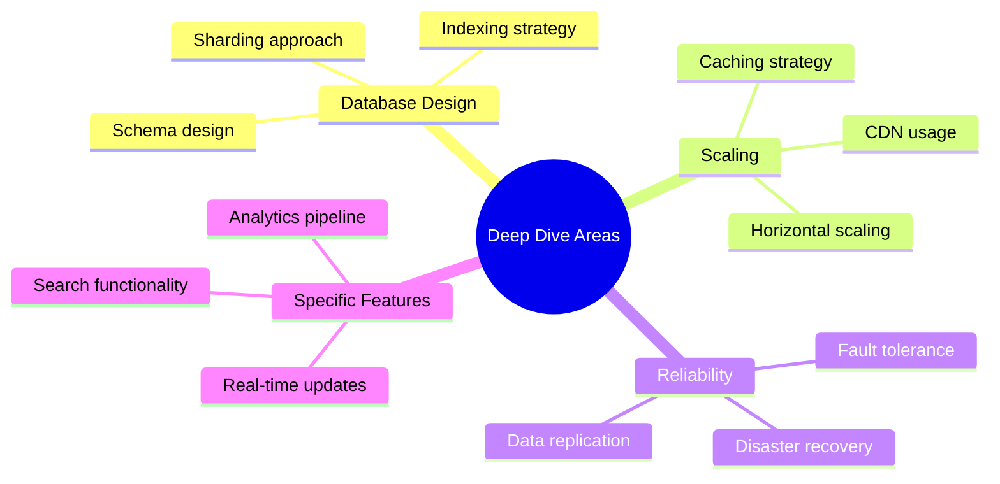
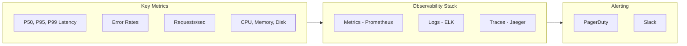

# The System Design Interview Framework

A structured, battle-tested approach to navigate any system design interview with confidence. This framework helps you organize your thoughts, communicate effectively, and demonstrate senior-level thinking.

## The 4-Phase Approach



---

## Phase 1: Clarify Requirements (3-5 minutes)

**Goal**: Understand what you're building and at what scale. Never start designing without clarity.

### Functional Requirements

Ask questions to understand the core features:

```
"What are the main use cases we need to support?"
"Who are the primary users?"
"What actions can users perform?"
"Are there any features that are explicitly out of scope?"
```

**Example for a URL Shortener:**
- Users can create short URLs from long URLs
- Users can access the original URL via the short URL
- Optional: Custom aliases, analytics, expiration

### Non-Functional Requirements

These often differentiate good designs from great ones:

| Category | Questions to Ask |
|----------|------------------|
| **Scale** | How many users? How many requests per second? |
| **Latency** | What's acceptable response time? Real-time? |
| **Availability** | What's the uptime requirement? 99.9%? 99.99%? |
| **Consistency** | Is eventual consistency acceptable? |
| **Durability** | Can we afford to lose data? How critical? |

### Scale Estimation

Do quick back-of-envelope calculations:

```
"If we have 100M DAU with each user making 5 requests/day..."
"That's 500M requests/day ≈ 6000 QPS average"
"Peak might be 3x, so ~18000 QPS"
```

### Requirements Template

```markdown
## Functional Requirements
1. [Core feature 1]
2. [Core feature 2]
3. [Core feature 3]

## Non-Functional Requirements
- Scale: X DAU, Y QPS
- Latency: < Z ms for 99th percentile
- Availability: 99.9%
- Consistency: [Strong/Eventual]

## Out of Scope
- [Feature explicitly excluded]
```

### Pro Tips for Phase 1

✅ **Do:**
- Take notes (virtual whiteboard or shared doc)
- Repeat back your understanding
- Prioritize requirements if too many

❌ **Don't:**
- Spend more than 5 minutes here
- Make assumptions without asking
- Skip non-functional requirements

---

## Phase 2: High-Level Design (10-15 minutes)

**Goal**: Draw the big picture. Show how components interact without getting into implementation details.

### Start with the Data Flow



### Component Selection Framework

For each component, briefly justify your choice:

| Component | Options | Selection Criteria |
|-----------|---------|-------------------|
| **Load Balancer** | Nginx, HAProxy, Cloud LB | L4 vs L7, SSL termination |
| **API Layer** | REST, GraphQL, gRPC | Client needs, latency requirements |
| **Database** | SQL, NoSQL, NewSQL | Data model, consistency needs |
| **Cache** | Redis, Memcached | Data structures needed |
| **Queue** | Kafka, RabbitMQ, SQS | Throughput, ordering guarantees |

### API Design (High-Level)

Define the main endpoints:

```
POST /api/v1/urls
  - Creates a short URL
  - Request: { "long_url": "https://...", "custom_alias": "optional" }
  - Response: { "short_url": "https://short.ly/abc123" }

GET /{short_code}
  - Redirects to original URL
  - Response: 301/302 Redirect
```

### Database Schema (High-Level)

Sketch the main entities:

```sql
-- Core table
urls (
    id BIGINT PRIMARY KEY,
    short_code VARCHAR(10) UNIQUE,
    long_url TEXT,
    user_id BIGINT,
    created_at TIMESTAMP,
    expires_at TIMESTAMP
)
```

### The Architecture Diagram

Always draw a clear diagram showing:

1. **Client Layer** - Web, Mobile, API clients
2. **Edge Layer** - CDN, Load Balancer
3. **Application Layer** - API Gateway, Services
4. **Data Layer** - Databases, Caches, Storage
5. **Async Layer** - Queues, Workers



### Pro Tips for Phase 2

✅ **Do:**
- Draw boxes and arrows clearly
- Label data flows with operations (read/write)
- Mention redundancy for critical components

❌ **Don't:**
- Get into implementation details yet
- Over-complicate the initial design
- Forget to show data flow direction

---

## Phase 3: Deep Dive (15-20 minutes)

**Goal**: Demonstrate depth of knowledge. Address scaling challenges, trade-offs, and edge cases.

### Areas to Deep Dive

Choose 2-3 areas based on the problem:



### Database Deep Dive Template

```markdown
## Schema Design
- Table structure with indexes
- Denormalization decisions
- Data types and constraints

## Scaling Strategy
- Read replicas for read-heavy workloads
- Sharding key selection (e.g., user_id)
- Consistent hashing for distribution

## Indexing
- Primary key: Clustered index
- Secondary indexes for common queries
- Composite indexes for range queries
```

### Scaling Deep Dive Template

```markdown
## Current Bottleneck
- Identify: "The database will become a bottleneck at X QPS"

## Scaling Solution
- Add read replicas for read-heavy workloads
- Implement caching layer (hit rate: 80%)
- Shard by [key] using consistent hashing

## Trade-offs
- Increased complexity in queries
- Eventual consistency in some scenarios
- Higher operational overhead
```

### Common Deep Dive Topics

| Topic | Key Points to Discuss |
|-------|----------------------|
| **Sharding** | Sharding key, hot spots, rebalancing |
| **Caching** | Cache strategy, invalidation, consistency |
| **Consistency** | Strong vs eventual, conflict resolution |
| **Rate Limiting** | Algorithm choice, distributed coordination |
| **Search** | Inverted index, ranking, updates |
| **Real-time** | WebSockets, long polling, SSE |

### Handling Trade-offs

Always articulate trade-offs explicitly:

```
"We could use synchronous replication for strong consistency,
but that would increase write latency by ~50ms. Given our
requirement for fast writes, I'd recommend async replication
with eventual consistency, accepting a window where reads
might be slightly stale."
```

### Pro Tips for Phase 3

✅ **Do:**
- Ask the interviewer which area to dive into
- Use specific numbers (latency, throughput)
- Acknowledge limitations of your approach

❌ **Don't:**
- Try to cover everything superficially
- Ignore the interviewer's hints
- Present only one option without alternatives

---

## Phase 4: Wrap Up (5 minutes)

**Goal**: Demonstrate operational thinking and forward planning.

### Identify Bottlenecks

```markdown
## Current Bottlenecks
1. Database writes at scale (solution: sharding)
2. Cache stampede on popular items (solution: request coalescing)
3. Single region latency (solution: multi-region deployment)
```

### Monitoring & Alerting



### Future Improvements

Mention what you'd add with more time:

1. **Multi-region deployment** for global users
2. **ML-based recommendations** for personalization
3. **Advanced analytics** pipeline
4. **A/B testing** infrastructure

### Pro Tips for Phase 4

✅ **Do:**
- Show you think about production systems
- Mention SLIs/SLOs if relevant
- Leave time for interviewer questions

❌ **Don't:**
- Rush through this section
- Ignore operational concerns
- Forget to mention monitoring

---

## Communication Best Practices

### The STAR Method for Trade-offs

- **S**ituation: What's the problem?
- **T**ask: What options do we have?
- **A**ction: What did we choose and why?
- **R**esult: What are the consequences?

### Phrases That Impress

```
"Given our consistency requirements, I'd recommend..."
"The trade-off here is between X and Y..."
"At this scale, we'll need to consider..."
"One potential issue is... and we can mitigate it by..."
"Let me validate this with some numbers..."
```

### Handling Uncertainty

```
"I'm not 100% sure about the exact implementation, but
my understanding is... Does that align with your experience?"

"I haven't worked with this specific technology, but based
on similar systems, I would approach it by..."
```

---

## Common Pitfalls and How to Avoid Them

| Pitfall | Impact | Solution |
|---------|--------|----------|
| **Starting without requirements** | Wrong direction | Always clarify first |
| **Over-engineering** | Wastes time | Start simple, scale when needed |
| **Ignoring constraints** | Impractical design | Keep scale and latency in mind |
| **Not drawing diagrams** | Hard to follow | Always visualize |
| **Talking without listening** | Missing hints | Pause and check for feedback |
| **Focusing only on happy path** | Incomplete design | Discuss failures and edge cases |
| **No numbers** | Vague reasoning | Back decisions with calculations |

---

## Interview Checklist

Use this before your interview:

- [ ] Understood the problem clearly
- [ ] Asked about scale and requirements
- [ ] Drew a high-level architecture diagram
- [ ] Discussed database choices with reasoning
- [ ] Covered caching strategy
- [ ] Addressed scaling approach
- [ ] Mentioned trade-offs for key decisions
- [ ] Discussed monitoring and reliability
- [ ] Identified bottlenecks and improvements
- [ ] Left time for questions

---

## Practice Template

Use this template when practicing:

```markdown
# [System Name] Design

## 1. Requirements (5 min)
### Functional
-
### Non-Functional
-
### Estimation
- DAU:
- QPS:
- Storage:

## 2. High-Level Design (15 min)
### Architecture Diagram
[Draw here]

### API Design
-

### Data Model
-

## 3. Deep Dive (20 min)
### Scaling Strategy
-
### Key Trade-offs
-

## 4. Wrap Up (5 min)
### Bottlenecks
-
### Monitoring
-
### Future Work
-
```

---

**Next**: [Requirements & Estimation →](02-requirements-estimation.md)
