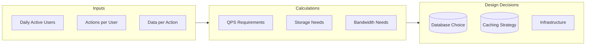
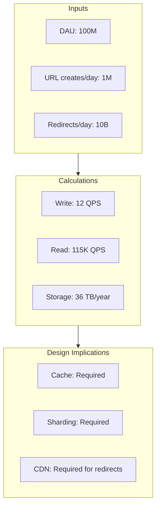
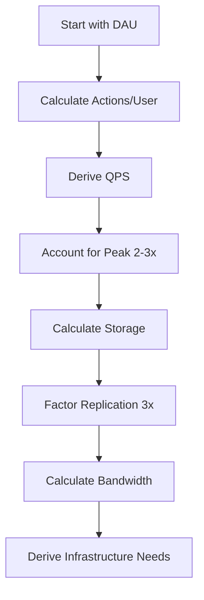

# Requirements & Back-of-Envelope Estimation

Capacity planning and estimation are crucial skills for system design interviews. This guide provides the formulas, common numbers, and templates you need to make quick, accurate calculations.

> **📚 For a detailed deep-dive with step-by-step walkthroughs, mental math tricks, and practice problems, see [Back-of-Envelope: Detailed Guide](02a-back-of-envelope-detailed.md)**

## Why Estimation Matters



Your estimation drives architecture decisions:
- **1K QPS** → Single database might work
- **100K QPS** → Need caching, read replicas
- **1M QPS** → Need sharding, CDN, aggressive caching

---

## Numbers Every Engineer Should Know

### Latency Numbers (2024)

| Operation | Latency |
|-----------|---------|
| L1 cache reference | 1 ns |
| L2 cache reference | 4 ns |
| Main memory reference | 100 ns |
| SSD random read | 16 μs |
| HDD seek | 2 ms |
| Round trip within datacenter | 500 μs |
| Round trip CA to Netherlands | 150 ms |

### Data Size References

| Unit | Size | Example |
|------|------|---------|
| 1 Byte | 8 bits | Single ASCII character |
| 1 KB | 1,024 bytes | Small text file |
| 1 MB | 1,024 KB | High-res photo |
| 1 GB | 1,024 MB | 1 hour HD video |
| 1 TB | 1,024 GB | 500 hours HD video |
| 1 PB | 1,024 TB | Large enterprise data |

### Quick Conversions

```
1 day = 86,400 seconds ≈ 100,000 seconds (for estimation)
1 month = 2.5 million seconds
1 year = 30 million seconds

1 million = 10^6
1 billion = 10^9
1 trillion = 10^12
```

### Common Scale Numbers

| Metric | Small | Medium | Large | Massive |
|--------|-------|--------|-------|---------|
| DAU | 10K | 1M | 100M | 1B |
| QPS | 100 | 10K | 100K | 1M+ |
| Storage | GB | TB | PB | EB |
| Servers | 1-10 | 10-100 | 100-1000 | 1000+ |

---

## The Estimation Framework

### Step 1: Clarify the Numbers

Always ask or estimate these:
- **DAU** (Daily Active Users)
- **MAU** (Monthly Active Users) - typically 2-3x DAU
- **Read:Write ratio** - Most systems are read-heavy (10:1 to 100:1)
- **Data retention** - How long do we keep data?

### Step 2: Calculate QPS

```
QPS Formula:
QPS = (DAU × Actions per User per Day) / 86,400

Peak QPS:
Peak QPS = Average QPS × 2 to 3 (for peak hours)

Write QPS:
Write QPS = Total QPS / (1 + Read:Write ratio)

Read QPS:
Read QPS = Total QPS - Write QPS
```

**Example: Twitter-like Service**
```
DAU: 200 million
Tweets per user per day: 0.1 (most users just read)
Tweet reads per user per day: 100

Write QPS = (200M × 0.1) / 86,400 = 230 QPS
Read QPS = (200M × 100) / 86,400 = 230,000 QPS
Peak Read QPS = 230,000 × 3 = ~700,000 QPS
```

### Step 3: Calculate Storage

```
Storage Formula:
Daily Storage = Write QPS × 86,400 × Average Data Size
Yearly Storage = Daily Storage × 365
Total Storage = Yearly Storage × Retention Years × Replication Factor
```

**Example: URL Shortener**
```
Write QPS: 1,000
Average URL record size: 500 bytes (short_code + long_url + metadata)

Daily: 1,000 × 86,400 × 500 bytes = 43.2 GB/day
Yearly: 43.2 × 365 = 15.77 TB/year
5 years with 3x replication: 15.77 × 5 × 3 = 236 TB
```

### Step 4: Calculate Bandwidth

```
Bandwidth Formula:
Ingress = Write QPS × Average Request Size
Egress = Read QPS × Average Response Size

Total Bandwidth = Ingress + Egress
```

**Example: Image Hosting Service**
```
Write QPS: 100 (uploads)
Read QPS: 10,000 (downloads)
Average image size: 1 MB

Ingress: 100 × 1 MB = 100 MB/s = 800 Mbps
Egress: 10,000 × 1 MB = 10 GB/s = 80 Gbps
```

---

## Estimation Templates

### Template 1: Read-Heavy System (e.g., News Feed)

```markdown
## Scale Assumptions
- DAU: 100M
- Actions per user: 50 reads, 2 posts/day
- Average post size: 1 KB
- Average feed response: 10 KB

## QPS Calculation
- Read QPS: (100M × 50) / 86,400 = 57,870 QPS ≈ 60K QPS
- Write QPS: (100M × 2) / 86,400 = 2,315 QPS ≈ 2.5K QPS
- Peak Read QPS: 60K × 3 = 180K QPS

## Storage Calculation
- Daily writes: 2.5K × 86,400 × 1 KB = 216 GB/day
- Yearly: 216 GB × 365 = 78.84 TB/year

## Bandwidth Calculation
- Read bandwidth: 60K × 10 KB = 600 MB/s
- Write bandwidth: 2.5K × 1 KB = 2.5 MB/s
```

### Template 2: Write-Heavy System (e.g., Logging/Analytics)

```markdown
## Scale Assumptions
- Servers: 10,000
- Logs per server per second: 100
- Average log size: 500 bytes
- Retention: 30 days

## QPS Calculation
- Write QPS: 10,000 × 100 = 1,000,000 QPS
- Read QPS: ~1,000 QPS (mostly for debugging)

## Storage Calculation
- Per second: 1M × 500 bytes = 500 MB/s
- Daily: 500 MB × 86,400 = 43.2 TB/day
- 30 days retention: 43.2 × 30 = 1.3 PB

## Bandwidth Calculation
- Write bandwidth: 500 MB/s = 4 Gbps
- Read bandwidth: 1K × 1 KB = 1 MB/s (negligible)
```

### Template 3: Media-Heavy System (e.g., Video Streaming)

```markdown
## Scale Assumptions
- DAU: 50M
- Videos watched per user: 5
- Average video duration: 5 minutes
- Video bitrate: 5 Mbps (HD)
- Upload ratio: 1 upload per 1000 views

## Viewing Bandwidth
- Concurrent viewers (10% of DAU): 5M
- Egress: 5M × 5 Mbps = 25 Tbps

## Storage Calculation
- New videos per day: (50M × 5) / 1000 = 250K videos
- Average video size: 5 min × 5 Mbps = 187.5 MB
- Daily storage: 250K × 187.5 MB = 46.875 TB/day
- Multiple resolutions (3x): 46.875 × 3 = 140 TB/day

## CDN Requirements
- Cache 20% of videos (popular content)
- Cache size per edge: 10 TB
- Edge locations: 100
- Total CDN storage: 1 PB
```

---

## Common System Estimations

### URL Shortener at Scale



```
DAU: 100M
New URLs per day: 1M
Redirects per day: 10B (10 redirects per URL)

Write QPS: 1M / 86,400 = 12 QPS (low, single DB works)
Read QPS: 10B / 86,400 = 115,000 QPS (need caching!)

Storage per URL: 100 bytes (short_code) + 2 KB (long_url + metadata) = 2.1 KB
Daily: 1M × 2.1 KB = 2.1 GB
Yearly: 2.1 GB × 365 = 766 GB ≈ 1 TB
5 years: 5 TB

Cache hit rate needed: With 115K QPS and cache hit of 90%
DB QPS: 115K × 0.1 = 11,500 QPS (manageable with replicas)
```

### Chat Application (WhatsApp-like)

```
DAU: 500M
Messages per user per day: 50
Average message size: 200 bytes

Write QPS: (500M × 50) / 86,400 = 290,000 QPS
Peak Write QPS: 290K × 3 = ~900K QPS

Storage:
- Daily: 290K × 86,400 × 200 bytes = 5 TB/day
- Yearly: 5 TB × 365 = 1.8 PB
- With media (10x text): 18 PB/year

Connections:
- Concurrent users (20% of DAU): 100M
- WebSocket connections: 100M persistent connections
- Servers needed (50K connections per server): 2,000 servers
```

### Social Network Feed

```
DAU: 300M
Feed requests per user: 10/day
Posts per user: 1/day
Average feed size: 50 posts

Read QPS: (300M × 10) / 86,400 = 35,000 QPS
Write QPS: 300M / 86,400 = 3,500 QPS

Fan-out consideration:
- Average followers: 200
- Fan-out writes: 3,500 × 200 = 700,000 QPS (if push model)

Storage:
- Post size: 1 KB
- Daily posts: 300M × 1 KB = 300 GB
- Yearly: 300 GB × 365 = 110 TB
- With media: 1.1 PB/year
```

---

## Estimation Cheat Sheet

### Quick Reference Table

| System Type | Key Metrics | Typical Scale |
|-------------|-------------|---------------|
| **URL Shortener** | Redirects/sec, Storage | 100K read QPS, 1 TB/year |
| **Twitter** | Tweets/sec, Feed reads | 5K write QPS, 500K read QPS |
| **WhatsApp** | Messages/sec, Connections | 500K write QPS, 100M connections |
| **YouTube** | Concurrent streams, Storage | 1M concurrent, 500 PB total |
| **Uber** | Ride requests, Location updates | 1M rides/day, 10M location updates/min |
| **Search** | Queries/sec, Index size | 100K QPS, PB-scale index |

### Server Capacity Rules of Thumb

| Resource | Typical Limit per Server |
|----------|--------------------------|
| QPS (simple operations) | 10K-100K |
| QPS (complex operations) | 1K-10K |
| WebSocket connections | 50K-100K |
| Memory | 128-512 GB |
| Storage (SSD) | 1-10 TB |
| Network | 10-25 Gbps |

### Database Capacity Rules of Thumb

| Database Type | Write QPS | Read QPS | Storage |
|---------------|-----------|----------|---------|
| Single PostgreSQL | 10K | 50K | 5 TB |
| PostgreSQL + Replicas | 10K | 200K | 5 TB |
| Cassandra (3 nodes) | 50K | 100K | 10 TB |
| Redis (single) | 100K | 200K | 100 GB |
| Redis Cluster (6 nodes) | 500K | 1M | 500 GB |

---

## Common Estimation Mistakes

| Mistake | Why It's Wrong | Correct Approach |
|---------|----------------|------------------|
| Ignoring peak traffic | Systems fail at peak | Multiply average by 2-3x |
| Forgetting replication | Underestimating storage | Factor in 3x for reliability |
| Only counting data size | Missing indexes, logs | Add 20-50% overhead |
| Assuming linear scaling | Coordination overhead | Account for diminishing returns |
| Ignoring data growth | Systems grow over time | Project 3-5 years ahead |

---

## Practice Problems

### Problem 1: Design Instagram

Calculate the requirements for an Instagram-like service:
- 500M DAU
- 50M photos uploaded daily
- Average photo size: 500 KB
- Each user views 100 photos/day

<details>
<summary>Solution</summary>

```
Read QPS: (500M × 100) / 86,400 = 578,000 QPS
Write QPS: 50M / 86,400 = 578 QPS

Storage:
- Daily: 50M × 500 KB = 25 TB/day
- With 3 sizes (thumbnail, medium, full): 25 × 3 = 75 TB/day
- Yearly: 75 TB × 365 = 27.4 PB/year

Bandwidth:
- Read: 578K × 500 KB = 289 GB/s = 2.3 Tbps
- Write: 578 × 500 KB = 289 MB/s = 2.3 Gbps

CDN is absolutely required to handle this read bandwidth.
```
</details>

### Problem 2: Design a Rate Limiter

Calculate requirements for a rate limiter protecting an API:
- 10,000 API clients
- Each client allowed 1000 requests/minute
- Need to track per-client rate

<details>
<summary>Solution</summary>

```
Max QPS: (10,000 × 1000) / 60 = 166,667 QPS

Storage per client (sliding window):
- 60 timestamps per minute window: 60 × 8 bytes = 480 bytes
- Total: 10,000 × 480 bytes = 4.8 MB

Redis can easily handle this:
- 166K reads + 166K writes = 330K operations/sec
- Single Redis handles 100K+ ops/sec
- Use 4-6 Redis nodes for safety

Memory: 4.8 MB fits entirely in RAM
```
</details>

---

## Summary

### The Estimation Flow



### Key Formulas to Remember

```
QPS = (DAU × Actions) / 86,400
Peak QPS = QPS × 3
Storage = QPS × 86,400 × Data_Size × Retention_Days
Bandwidth = QPS × Data_Size
Servers = Peak_QPS / QPS_per_Server
```

### Final Tips

1. **Round generously** - Use powers of 10 for mental math
2. **Show your work** - Interviewers want to see your reasoning
3. **Sanity check** - Does the number feel right for the scale?
4. **Remember constraints** - Single server limits, network limits
5. **Consider growth** - 2-3 years is typical planning horizon

---

**Previous**: [← Interview Framework](01-interview-framework.md) | **Next**: [Core Building Blocks →](03-core-building-blocks.md)
