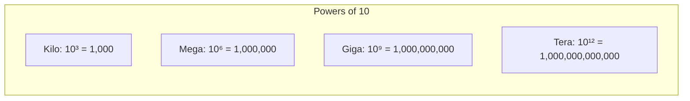

# Back-of-Envelope Calculations: Detailed Guide

A comprehensive guide to performing quick, accurate calculations during system design interviews. Master these techniques to estimate scale, storage, and infrastructure needs in minutes.

## Table of Contents

1. [Mental Math Fundamentals](#mental-math-fundamentals)
2. [The 5-Step Estimation Process](#the-5-step-estimation-process)
3. [Quick Calculation Tricks](#quick-calculation-tricks)
4. [Detailed Examples with Walkthroughs](#detailed-examples-with-walkthroughs)
5. [Common Patterns and Formulas](#common-patterns-and-formulas)
6. [Practice Problems](#practice-problems)

---

## Mental Math Fundamentals

### Powers of 10 (The Foundation)



**Memorize these:**
```
10³  = 1,000      (thousand)
10⁶  = 1,000,000  (million)
10⁹  = 1,000,000,000 (billion)
10¹² = 1,000,000,000,000 (trillion)
```

**Quick conversions:**
- 1 million = 10⁶
- 1 billion = 10⁹
- 1 trillion = 10¹²

### Time Conversions (Critical for QPS)

| Unit | Seconds | Approximation |
|------|---------|--------------|
| 1 second | 1 | 1 |
| 1 minute | 60 | 60 |
| 1 hour | 3,600 | 3,600 |
| 1 day | 86,400 | **100,000** (round up!) |
| 1 week | 604,800 | 600,000 |
| 1 month | 2,592,000 | **2.5 million** |
| 1 year | 31,536,000 | **30 million** |

**Why round up?** It's safer to overestimate in interviews. Plus, 100,000 is easier to work with mentally.

### Data Size Conversions

| Unit | Bytes | Approximation |
|------|-------|---------------|
| 1 KB | 1,024 | **1,000** (for estimation) |
| 1 MB | 1,024 KB | **1 million bytes** |
| 1 GB | 1,024 MB | **1 billion bytes** |
| 1 TB | 1,024 GB | **1 trillion bytes** |
| 1 PB | 1,024 TB | **1,000 TB** |

**Key insight:** For back-of-envelope, use 1,000 instead of 1,024. The error is only 2.4%, which is acceptable.

---

## The 5-Step Estimation Process

### Step 1: Gather Inputs (30 seconds)

**Always ask or estimate:**
1. **DAU** (Daily Active Users) - or total users if not specified
2. **Actions per user per day** - what do users do?
3. **Data size per action** - bytes/request
4. **Read:Write ratio** - typically 10:1 to 100:1
5. **Retention period** - how long to keep data?

**Example:**
```
DAU: 100 million
Actions: 10 reads, 1 write per user per day
Data size: 1 KB per read, 500 bytes per write
Read:Write ratio: 10:1
Retention: 5 years
```

### Step 2: Calculate QPS (1 minute)

**Formula:**
```
Total QPS = (DAU × Total Actions per User) / 86,400

Breakdown:
Read QPS = (DAU × Reads per User) / 86,400
Write QPS = (DAU × Writes per User) / 86,400

Peak QPS = Average QPS × 2 to 3
```

**Mental math trick:**
```
86,400 ≈ 100,000 (round up for safety)

So: QPS ≈ (DAU × Actions) / 100,000

Example:
100M × 11 actions = 1.1 billion actions/day
1.1B / 100,000 = 11,000 QPS average
Peak: 11,000 × 3 = 33,000 QPS
```

**Quick sanity check:**
- 1M DAU with 10 actions = 100 QPS
- 100M DAU with 10 actions = 10,000 QPS
- 1B DAU with 10 actions = 100,000 QPS

### Step 3: Calculate Storage (2 minutes)

**Formula:**
```
Daily Storage = Write QPS × 86,400 × Average Data Size
Yearly Storage = Daily Storage × 365
Total Storage = Yearly Storage × Retention Years × Replication Factor
```

**Mental math breakdown:**
```
Step 1: Daily writes
  = Write QPS × 100,000 × data_size

Step 2: Yearly
  = Daily × 400 (round 365 to 400 for easy math)

Step 3: Total with replication
  = Yearly × years × 3 (typical replication)
```

**Example walkthrough:**
```
Write QPS: 1,000
Data size: 500 bytes

Daily: 1,000 × 100,000 × 500 bytes
     = 1,000 × 100,000 × 0.5 KB
     = 50,000,000 KB
     = 50,000 MB
     = 50 GB/day

Yearly: 50 GB × 400 = 20,000 GB = 20 TB/year

5 years with 3x replication:
  20 TB × 5 × 3 = 300 TB
```

### Step 4: Calculate Bandwidth (1 minute)

**Formula:**
```
Ingress = Write QPS × Request Size
Egress = Read QPS × Response Size
Total = Ingress + Egress
```

**Unit conversions:**
```
1 byte = 8 bits
1 KB = 8 Kb (kilobits)
1 MB = 8 Mb (megabits)
1 GB = 8 Gb (gigabits)

For bandwidth, usually measured in:
- Mbps (megabits per second)
- Gbps (gigabits per second)
```

**Example:**
```
Read QPS: 10,000
Response size: 10 KB

Egress = 10,000 × 10 KB
       = 100,000 KB/s
       = 100 MB/s
       = 100 × 8 = 800 Mbps
       = 0.8 Gbps
```

### Step 5: Derive Infrastructure Needs (1 minute)

**Servers:**
```
Servers needed = Peak QPS / QPS per server

Typical server capacity:
- Simple operations: 10K-100K QPS
- Complex operations: 1K-10K QPS
- Database queries: 1K-5K QPS
```

**Database:**
```
Single DB capacity:
- PostgreSQL: 10K writes, 50K reads
- With replicas: 10K writes, 200K reads
- Need sharding when: > 10K writes or > 200K reads
```

**Cache:**
```
Cache size = 20% of hot data (Pareto principle)
Cache hit rate target: 80-95%
```

---

## Quick Calculation Tricks

### Trick 1: Round to Powers of 10

**Instead of:** 86,400 seconds/day
**Use:** 100,000 seconds/day

**Instead of:** 1,024 bytes/KB
**Use:** 1,000 bytes/KB

**Why?** Easier mental math, error is small (< 5%), safer to overestimate.

### Trick 2: Break Down Large Numbers

**Problem:** Calculate 200M × 100 / 100,000

**Step-by-step:**
```
200M × 100 = 20,000M = 20 billion
20B / 100,000 = 20B / 10⁵ = 20 × 10⁹ / 10⁵ = 20 × 10⁴ = 200,000
```

**Or faster:**
```
200M / 1,000 = 200K
200K × 100 = 20M
20M / 100 = 200K
```

### Trick 3: Use Approximations for Multiplication

**Example:** 365 × 50

**Method 1:** Round to easy numbers
```
365 ≈ 400
400 × 50 = 20,000
Actual: 18,250 (error: 9.6%, acceptable)
```

**Method 2:** Break it down
```
365 × 50 = 365 × 100 / 2 = 36,500 / 2 = 18,250
```

### Trick 4: Percentage Calculations

**Quick percentages:**
```
10% = divide by 10
20% = divide by 5
25% = divide by 4
50% = divide by 2
```

**Example:** 80% hit rate means 20% miss rate
```
Cache hit: 80% of 100K QPS = 80K QPS
Cache miss: 20% of 100K QPS = 20K QPS to database
```

### Trick 5: Scientific Notation for Very Large Numbers

**Example:** 1.5 billion × 500 bytes

**Convert to scientific:**
```
1.5 billion = 1.5 × 10⁹
500 bytes = 5 × 10²

Result: 1.5 × 10⁹ × 5 × 10² = 7.5 × 10¹¹ bytes
       = 750 GB
```

### Trick 6: Unit Conversion Shortcuts

**Bytes to KB:** Divide by 1,000
**KB to MB:** Divide by 1,000
**MB to GB:** Divide by 1,000
**GB to TB:** Divide by 1,000

**For bandwidth (bits):**
```
Bytes to bits: Multiply by 8
KB/s to Mbps: Multiply by 8
MB/s to Gbps: Multiply by 8
```

---

## Detailed Examples with Walkthroughs

### Example 1: Twitter-like Service (Step-by-Step)

**Given:**
- 200M DAU
- 0.1 tweets per user per day (most users just read)
- 100 feed reads per user per day
- Tweet size: 280 characters = ~500 bytes
- Feed response: 50 tweets = 25 KB

**Step 1: Calculate QPS**

```
Writes (tweets):
  200M × 0.1 = 20M tweets/day
  20M / 100,000 = 200 QPS

Reads (feeds):
  200M × 100 = 20B reads/day
  20B / 100,000 = 200,000 QPS

Peak (3x):
  Write peak: 200 × 3 = 600 QPS
  Read peak: 200K × 3 = 600K QPS
```

**Step 2: Calculate Storage**

```
Daily writes:
  200 QPS × 100,000 × 500 bytes
  = 200 × 100,000 × 0.5 KB
  = 10,000,000 KB
  = 10,000 MB
  = 10 GB/day

Yearly:
  10 GB × 400 = 4,000 GB = 4 TB/year

5 years with 3x replication:
  4 TB × 5 × 3 = 60 TB
```

**Step 3: Calculate Bandwidth**

```
Write bandwidth:
  200 QPS × 500 bytes = 100,000 bytes/s = 100 KB/s (negligible)

Read bandwidth:
  200,000 QPS × 25 KB = 5,000,000 KB/s
  = 5,000 MB/s
  = 5 GB/s
  = 5 × 8 = 40 Gbps

Peak read bandwidth:
  40 Gbps × 3 = 120 Gbps
```

**Step 4: Infrastructure Needs**

```
Read QPS: 600K peak
- Need caching! (target 90% hit rate)
- Cache miss: 600K × 10% = 60K QPS to DB
- With read replicas: 60K / 4 replicas = 15K QPS per replica (manageable)

Write QPS: 600 peak
- Single DB can handle (10K capacity)
- No sharding needed for writes
```

### Example 2: WhatsApp-like Messaging (Step-by-Step)

**Given:**
- 500M DAU
- 50 messages per user per day
- Average message: 200 bytes
- 20% concurrent users
- Need to store messages for 1 year

**Step 1: Calculate QPS**

```
Total messages/day:
  500M × 50 = 25 billion messages/day

QPS:
  25B / 100,000 = 250,000 QPS

Peak (3x):
  250K × 3 = 750K QPS
```

**Step 2: Calculate Storage**

```
Daily storage:
  250K QPS × 100,000 × 200 bytes
  = 250,000 × 100,000 × 0.2 KB
  = 5,000,000,000 KB
  = 5,000,000 MB
  = 5,000 GB
  = 5 TB/day

Yearly:
  5 TB × 400 = 2,000 TB = 2 PB/year

With 3x replication:
  2 PB × 3 = 6 PB/year
```

**Step 3: Calculate Connections**

```
Concurrent users:
  500M × 20% = 100M concurrent connections

WebSocket connections per server: 50K
Servers needed:
  100M / 50K = 2,000 servers
```

**Step 4: Message Delivery**

```
Messages per second: 250K
Average delivery time: < 100ms
Need message queue with:
  - High throughput (Kafka)
  - Multiple consumers for fan-out
```

### Example 3: Instagram-like Photo Sharing (Step-by-Step)

**Given:**
- 500M DAU
- 50M photos uploaded daily
- Average photo: 500 KB
- Each user views 100 photos/day
- Multiple resolutions: thumbnail (50KB), medium (200KB), full (500KB)

**Step 1: Calculate QPS**

```
Write QPS (uploads):
  50M / 100,000 = 500 QPS

Read QPS (views):
  500M × 100 = 50B views/day
  50B / 100,000 = 500,000 QPS

Peak:
  Write: 500 × 3 = 1,500 QPS
  Read: 500K × 3 = 1.5M QPS
```

**Step 2: Calculate Storage**

```
Per photo storage (3 resolutions):
  500 KB + 200 KB + 50 KB = 750 KB per photo

Daily storage:
  50M × 750 KB = 37,500,000 MB
  = 37,500 GB
  = 37.5 TB/day

Yearly:
  37.5 TB × 400 = 15,000 TB = 15 PB/year

5 years with 3x replication:
  15 PB × 5 × 3 = 225 PB
```

**Step 3: Calculate Bandwidth**

```
Write bandwidth:
  500 QPS × 500 KB = 250,000 KB/s = 250 MB/s = 2 Gbps

Read bandwidth (average size: 200KB):
  500K QPS × 200 KB = 100,000,000 KB/s
  = 100,000 MB/s
  = 100 GB/s
  = 800 Gbps

Peak read bandwidth:
  800 Gbps × 3 = 2.4 Tbps

CDN absolutely required!
```

**Step 4: CDN Requirements**

```
With 80% CDN hit rate:
  Origin bandwidth: 800 Gbps × 20% = 160 Gbps (manageable)

CDN cache size (20% popular content):
  15 PB × 20% = 3 PB
```

---

## Common Patterns and Formulas

### Pattern 1: Read-Heavy System

**Characteristics:**
- Read:Write ratio > 10:1
- Examples: News feed, product catalog, search

**Formula:**
```
Read QPS = (DAU × Reads per User) / 100,000
Write QPS = (DAU × Writes per User) / 100,000

Key insight: Caching is critical!
Target: 80-95% cache hit rate
```

### Pattern 2: Write-Heavy System

**Characteristics:**
- Write:Read ratio > 1:1
- Examples: Logging, analytics, IoT sensors

**Formula:**
```
Write QPS = (Devices × Writes per Device) / 100,000

Key insight: Need high-write database (Cassandra, ScyllaDB)
Storage grows very fast!
```

### Pattern 3: Media-Heavy System

**Characteristics:**
- Large file sizes (images, videos)
- High bandwidth requirements
- Examples: YouTube, Instagram, Dropbox

**Formula:**
```
Storage = (Uploads × File Size × Resolutions) × Retention
Bandwidth = Views × Average File Size

Key insight: CDN is mandatory!
```

### Pattern 4: Real-Time System

**Characteristics:**
- Low latency requirements (< 100ms)
- Persistent connections
- Examples: Chat, gaming, ride-sharing

**Formula:**
```
Concurrent Connections = DAU × Concurrent Percentage
Servers = Connections / Connections per Server

Key insight: WebSocket servers, connection pooling
```

### Pattern 5: Search System

**Characteristics:**
- Large index size
- Query-heavy
- Examples: Google, Elasticsearch

**Formula:**
```
Index Size = Documents × Average Document Size × Index Overhead (2-3x)
Query QPS = (DAU × Queries per User) / 100,000

Key insight: Inverted index, distributed search
```

---

## Practice Problems

### Problem 1: Design a URL Shortener

**Requirements:**
- 100M DAU
- 1M new URLs created per day
- 10 redirects per URL on average
- Store for 5 years

**Calculate:**
1. Write QPS
2. Read QPS
3. Storage requirements
4. Cache requirements

<details>
<summary>Solution (Click to expand)</summary>

**Step 1: QPS**

```
Write QPS:
  1M / 100,000 = 10 QPS
  Peak: 10 × 3 = 30 QPS (very low, single DB works)

Read QPS:
  1M × 10 = 10M redirects/day
  10M / 100,000 = 100 QPS
  Peak: 100 × 3 = 300 QPS
```

**Step 2: Storage**

```
Per URL record:
  - Short code: 7 bytes
  - Long URL: 200 bytes average
  - Metadata: 100 bytes
  Total: ~300 bytes

Daily storage:
  1M × 300 bytes = 300,000,000 bytes
  = 300 MB/day

Yearly:
  300 MB × 400 = 120,000 MB = 120 GB/year

5 years:
  120 GB × 5 = 600 GB
  With 3x replication: 600 GB × 3 = 1.8 TB
```

**Step 3: Cache**

```
Read QPS: 300 peak
Target: 90% cache hit rate

Cache miss: 300 × 10% = 30 QPS to DB (very manageable)

Cache size (hot URLs):
  20% of URLs are 80% of traffic
  Cache: 1M × 20% × 300 bytes = 60 MB
  Round up: 100 MB cache (fits in Redis easily)
```
</details>

### Problem 2: Design a Rate Limiter

**Requirements:**
- 10,000 API clients
- Each client: 1,000 requests/minute
- Track per-client rate
- Sliding window algorithm

**Calculate:**
1. Maximum QPS
2. Storage per client
3. Total storage
4. Redis capacity needed

<details>
<summary>Solution (Click to expand)</summary>

**Step 1: Maximum QPS**

```
Per client: 1,000 requests/minute
1,000 / 60 = 16.67 requests/second per client

Maximum (all clients at once):
  10,000 × 16.67 = 166,670 QPS
  Round to: 170K QPS
```

**Step 2: Storage per Client**

```
Sliding window: Track last 60 seconds
Assume: 1 timestamp per request (8 bytes)

Worst case: 1,000 requests in 60 seconds
Storage: 1,000 × 8 bytes = 8 KB per client

With metadata: ~10 KB per client
```

**Step 3: Total Storage**

```
10,000 clients × 10 KB = 100,000 KB
= 100 MB

Fits easily in Redis!
```

**Step 4: Redis Capacity**

```
Operations per second:
  Reads: 170K QPS
  Writes: 170K QPS
  Total: 340K ops/sec

Single Redis: ~100K ops/sec
Need: 340K / 100K = 4 nodes minimum
Use: 6 nodes for safety
```
</details>

### Problem 3: Design a News Feed

**Requirements:**
- 300M DAU
- 10 feed reads per user per day
- 1 post per user per day
- Average feed: 50 posts, 10 KB per post = 500 KB
- Average post: 1 KB

**Calculate:**
1. Read and write QPS
2. Storage requirements
3. Fan-out considerations (200 followers average)
4. Bandwidth requirements

<details>
<summary>Solution (Click to expand)</summary>

**Step 1: QPS**

```
Read QPS:
  300M × 10 = 3B reads/day
  3B / 100,000 = 30,000 QPS
  Peak: 30K × 3 = 90K QPS

Write QPS:
  300M × 1 = 300M posts/day
  300M / 100,000 = 3,000 QPS
  Peak: 3K × 3 = 9K QPS
```

**Step 2: Storage**

```
Daily posts:
  3,000 QPS × 100,000 × 1 KB
  = 300,000,000 KB
  = 300,000 MB
  = 300 GB/day

Yearly:
  300 GB × 400 = 120,000 GB = 120 TB/year

5 years:
  120 TB × 5 = 600 TB
  With 3x replication: 600 TB × 3 = 1.8 PB
```

**Step 3: Fan-Out**

```
If push model (write to all follower feeds):
  Fan-out writes: 3,000 × 200 = 600,000 QPS
  Peak: 600K × 3 = 1.8M QPS

Storage for feeds:
  600K QPS × 100,000 × 500 KB = 30 TB/day
  Yearly: 30 TB × 400 = 12,000 TB = 12 PB/year
  With replication: 12 PB × 3 = 36 PB/year

Too expensive! Use hybrid:
  - Push for regular users
  - Pull for celebrities (> 1M followers)
```

**Step 4: Bandwidth**

```
Read bandwidth:
  30K QPS × 500 KB = 15,000,000 KB/s
  = 15,000 MB/s
  = 15 GB/s
  = 120 Gbps

Peak: 120 Gbps × 3 = 360 Gbps

Need CDN and aggressive caching!
```
</details>

---

## Common Mistakes and How to Avoid Them

### Mistake 1: Forgetting Peak Traffic

**Wrong:**
```
Average QPS: 10,000
Design for: 10,000 QPS
```

**Right:**
```
Average QPS: 10,000
Peak QPS: 10,000 × 3 = 30,000
Design for: 30,000 QPS
```

### Mistake 2: Ignoring Replication

**Wrong:**
```
Storage: 100 TB
```

**Right:**
```
Storage: 100 TB
With 3x replication: 100 TB × 3 = 300 TB
```

### Mistake 3: Not Accounting for Overhead

**Wrong:**
```
Data size: 1 KB per record
Storage: 1M records × 1 KB = 1 GB
```

**Right:**
```
Data size: 1 KB per record
Indexes: +20% = 1.2 KB
Logs: +10% = 1.32 KB
Storage: 1M × 1.32 KB = 1.32 GB
```

### Mistake 4: Wrong Time Conversions

**Wrong:**
```
QPS = (DAU × Actions) / 24 × 60 × 60
```

**Right:**
```
QPS = (DAU × Actions) / 100,000  (rounded up from 86,400)
```

### Mistake 5: Unit Confusion (Bytes vs Bits)

**Wrong:**
```
Bandwidth: 1 GB/s = 1 Gbps
```

**Right:**
```
Bandwidth: 1 GB/s = 8 Gbps
(1 byte = 8 bits)
```

---

## Quick Reference Card

### Essential Formulas

```
QPS = (DAU × Actions) / 100,000
Peak QPS = QPS × 3
Storage = Write_QPS × 100,000 × Data_Size × Days × Replication
Bandwidth = QPS × Data_Size × 8 (for bits)
Servers = Peak_QPS / QPS_per_Server
```

### Quick Conversions

```
1 day = 100,000 seconds
1 year = 30 million seconds
1 KB = 1,000 bytes
1 MB = 1 million bytes
1 GB = 1 billion bytes
1 TB = 1 trillion bytes
1 byte = 8 bits
```

### Capacity Rules of Thumb

```
Single DB: 10K writes, 50K reads
With replicas: 10K writes, 200K reads
Redis: 100K ops/sec per node
Server: 10K-100K QPS (simple ops)
WebSocket: 50K connections per server
```

### Mental Math Shortcuts

```
10% = divide by 10
20% = divide by 5
25% = divide by 4
50% = divide by 2

Round 86,400 → 100,000
Round 365 → 400
Round 1,024 → 1,000
```

---

## Final Tips for Interviews

1. **Always round up** - Better to overestimate than underestimate
2. **Show your work** - Explain each step, even if approximate
3. **Use powers of 10** - Makes mental math easier
4. **Sanity check** - Does the number make sense?
5. **State assumptions** - "I'm assuming X, is that correct?"
6. **Break it down** - Large numbers into smaller chunks
7. **Use approximations** - 2-5% error is acceptable
8. **Think out loud** - Interviewers want to see your process

---

**Related:** [Requirements & Estimation →](02-requirements-estimation.md)
