# Core Building Blocks of Distributed Systems

Every large-scale system is composed of fundamental building blocks. Understanding these components, when to use them, and how they interact is essential for system design interviews.

## System Architecture Overview

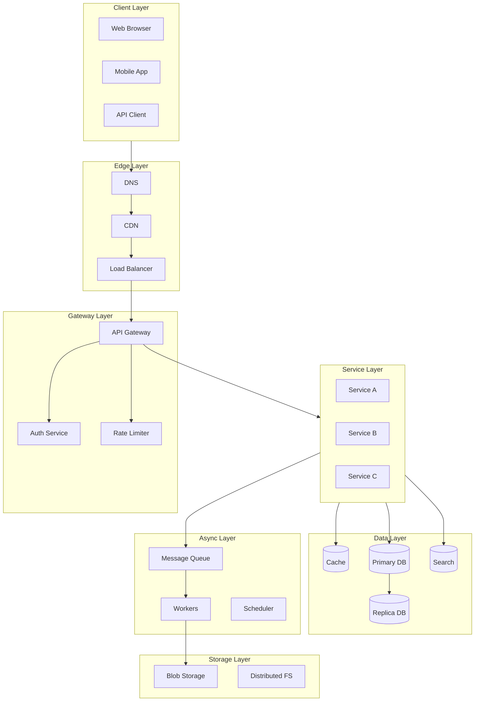

---

## 1. DNS (Domain Name System)

### What It Does
Translates domain names to IP addresses. The first step in any web request.

### How It Works

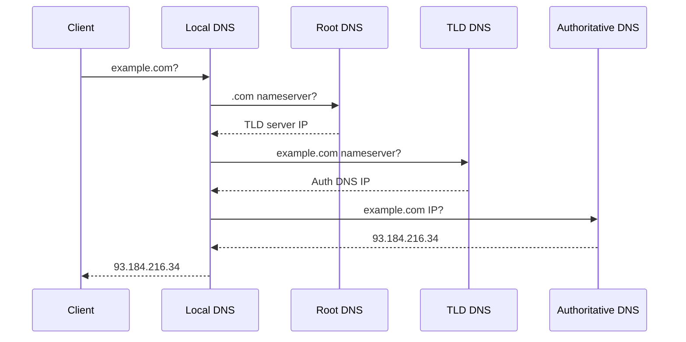

### Key Concepts

| Concept | Description |
|---------|-------------|
| **A Record** | Maps domain to IPv4 address |
| **AAAA Record** | Maps domain to IPv6 address |
| **CNAME** | Alias to another domain |
| **TTL** | How long to cache the result |
| **DNS Load Balancing** | Return multiple IPs, round-robin |

### Use Cases in System Design
- **Geographic routing**: Route users to nearest datacenter
- **Failover**: Change DNS to backup when primary fails
- **Load distribution**: Spread traffic across multiple IPs

### Limitations
- DNS propagation can take time (TTL-dependent)
- Not suitable for real-time failover
- Limited load balancing intelligence

---

## 2. CDN (Content Delivery Network)

### What It Does
Caches static content at edge locations close to users, reducing latency and origin server load.

### How It Works

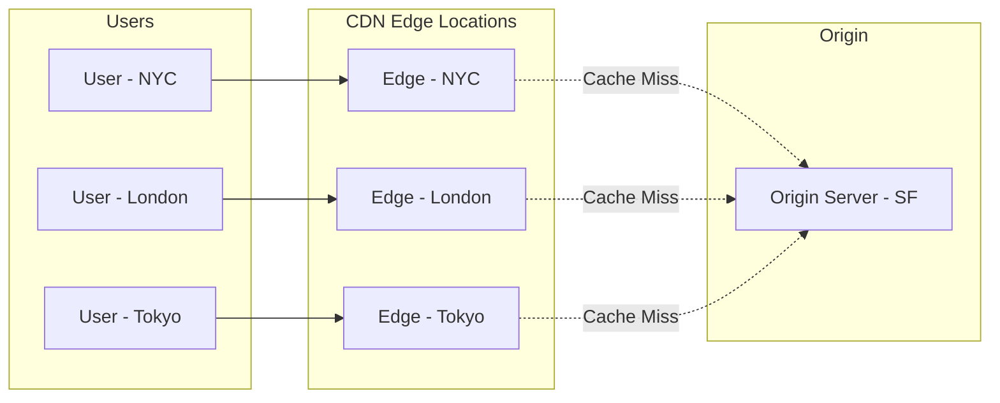

### Key Concepts

| Concept | Description |
|---------|-------------|
| **Edge Location** | Server close to users (PoP) |
| **Origin** | Source of truth for content |
| **Cache Hit/Miss** | Whether content is in edge cache |
| **TTL** | How long content is cached |
| **Invalidation** | Forcing cache refresh |
| **Pull vs Push** | On-demand vs pre-populated cache |

### What to Cache

| Content Type | Cache Duration | Example |
|--------------|----------------|---------|
| Static assets | Days to weeks | JS, CSS, images |
| Media files | Days | Videos, audio |
| API responses | Minutes to hours | User profiles, feeds |
| Dynamic HTML | Seconds | Personalized pages |

### Use Cases
- **Static content delivery**: Images, videos, JS, CSS
- **API acceleration**: Cache API responses at edge
- **DDoS protection**: Absorb attack traffic at edge
- **SSL termination**: Offload HTTPS at edge

### Popular CDNs
- Cloudflare, AWS CloudFront, Akamai, Fastly

---

## 3. Load Balancer

### What It Does
Distributes incoming traffic across multiple servers to ensure reliability and performance.

### Types of Load Balancers

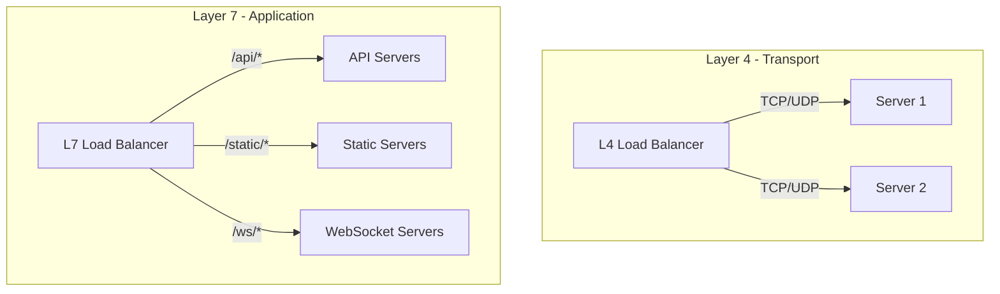

| Type | Layer | Decisions Based On | Use Case |
|------|-------|-------------------|----------|
| **L4** | Transport | IP, Port | High throughput, simple routing |
| **L7** | Application | URL, Headers, Cookies | Content-based routing, SSL termination |

### Load Balancing Algorithms

| Algorithm | Description | Best For |
|-----------|-------------|----------|
| **Round Robin** | Sequential distribution | Equal capacity servers |
| **Weighted Round Robin** | Based on server capacity | Mixed capacity |
| **Least Connections** | Route to least busy | Varying request duration |
| **IP Hash** | Consistent server per client | Session affinity |
| **Random** | Random selection | Simple, effective |

### Health Checks

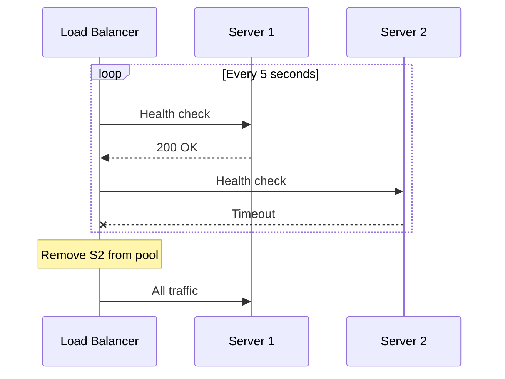

### Use Cases
- **High availability**: Failover when servers die
- **Horizontal scaling**: Add servers transparently
- **SSL termination**: Offload encryption
- **Session management**: Sticky sessions

---

## 4. API Gateway

### What It Does
Single entry point for all client requests. Handles cross-cutting concerns.

### Responsibilities

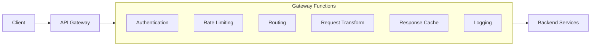

| Function | Description |
|----------|-------------|
| **Authentication** | Validate tokens, API keys |
| **Authorization** | Check permissions |
| **Rate Limiting** | Protect against abuse |
| **Request Routing** | Route to appropriate service |
| **Protocol Translation** | REST to gRPC, etc. |
| **Response Caching** | Cache common responses |
| **Request/Response Transformation** | Modify payloads |
| **Logging & Monitoring** | Centralized observability |

### Patterns

**Backend for Frontend (BFF)**
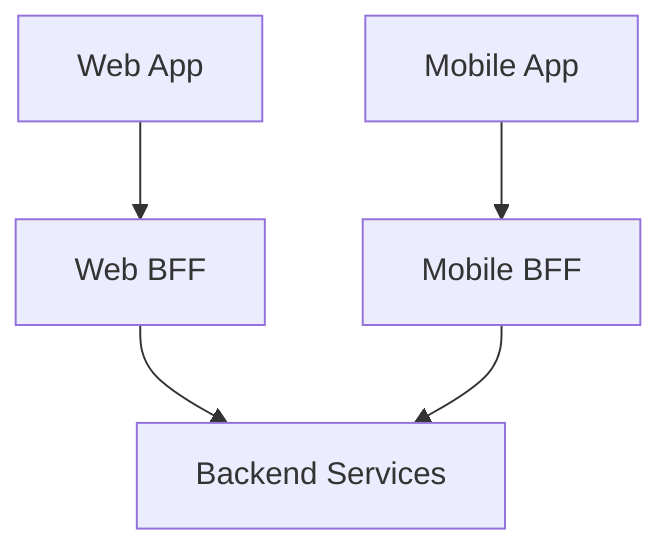

### Use Cases
- **Microservices**: Single entry point for many services
- **Mobile apps**: Aggregate multiple API calls
- **Third-party APIs**: Expose controlled interface

### Popular Options
- Kong, AWS API Gateway, Nginx, Envoy

---

## 5. Databases

### SQL vs NoSQL Decision Tree

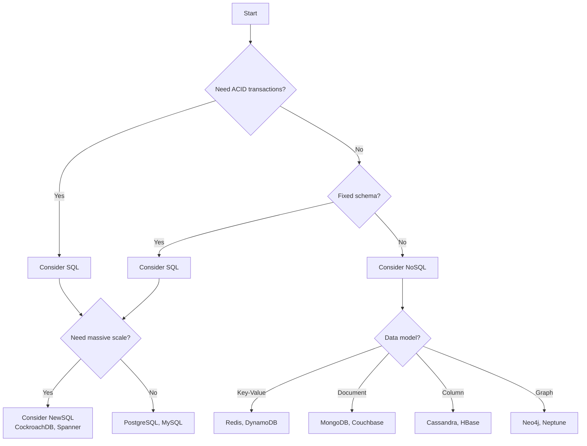

### Database Types

| Type | Data Model | Use Cases | Examples |
|------|------------|-----------|----------|
| **Relational** | Tables, rows | Transactions, complex queries | PostgreSQL, MySQL |
| **Key-Value** | Key → Value | Caching, sessions | Redis, DynamoDB |
| **Document** | JSON documents | Content management, catalogs | MongoDB, Couchbase |
| **Column-Family** | Columns grouped | Time-series, analytics | Cassandra, HBase |
| **Graph** | Nodes, edges | Social networks, recommendations | Neo4j, Neptune |
| **Time-Series** | Timestamp → values | Metrics, IoT | InfluxDB, TimescaleDB |

### When to Use What

| Requirement | Database Choice |
|-------------|-----------------|
| ACID transactions | PostgreSQL, MySQL |
| High write throughput | Cassandra, ScyllaDB |
| Flexible schema | MongoDB |
| Caching | Redis, Memcached |
| Full-text search | Elasticsearch |
| Graph relationships | Neo4j |
| Time-series data | InfluxDB, TimescaleDB |

---

## 6. Cache

### What It Does
Stores frequently accessed data in memory for fast retrieval.

### Caching Layers

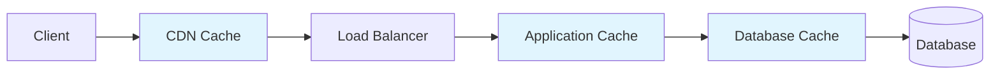

| Layer | Location | What's Cached |
|-------|----------|---------------|
| **Browser** | Client | Static assets, API responses |
| **CDN** | Edge | Static content, some API |
| **Application** | Server memory | Computed results, sessions |
| **Distributed Cache** | Redis/Memcached | Shared data across servers |
| **Database** | DB buffer pool | Query results, indexes |

### Cache Strategies

| Strategy | How It Works | Use Case |
|----------|--------------|----------|
| **Cache-Aside** | App manages cache manually | General purpose |
| **Read-Through** | Cache loads on miss | Simplicity |
| **Write-Through** | Write to cache and DB | Consistency |
| **Write-Behind** | Write to cache, async to DB | Performance |
| **Refresh-Ahead** | Proactive refresh | Predictable access |

### Cache Eviction Policies

| Policy | Description | Use Case |
|--------|-------------|----------|
| **LRU** | Least Recently Used | General purpose |
| **LFU** | Least Frequently Used | Stable popularity |
| **FIFO** | First In First Out | Simple, time-based |
| **TTL** | Time To Live | Data freshness |

### Redis vs Memcached

| Feature | Redis | Memcached |
|---------|-------|-----------|
| Data Structures | Rich (lists, sets, hashes) | Simple strings |
| Persistence | Yes | No |
| Replication | Yes | No |
| Clustering | Yes | Client-side |
| Memory Efficiency | Lower | Higher |

---

## 7. Message Queue

### What It Does
Enables asynchronous communication between services. Decouples producers and consumers.

### How It Works

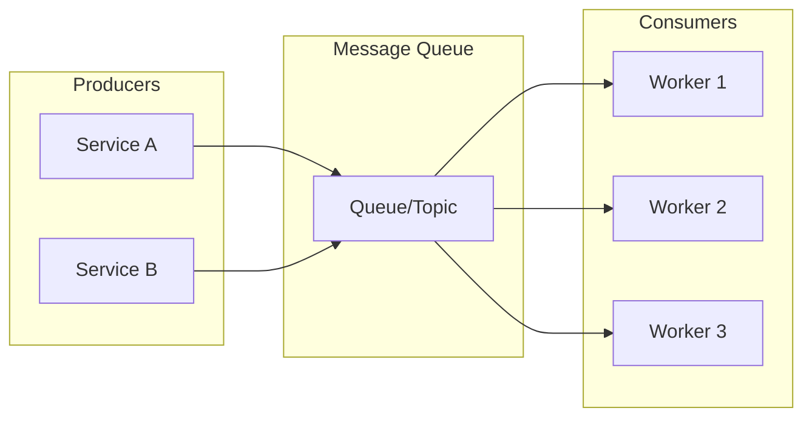

### Queue vs Topic (Pub/Sub)

| Aspect | Queue | Topic (Pub/Sub) |
|--------|-------|-----------------|
| Consumers | One consumer per message | All subscribers get message |
| Use Case | Task distribution | Event broadcasting |
| Example | Order processing | Price updates |

### Delivery Guarantees

| Guarantee | Description | Trade-off |
|-----------|-------------|-----------|
| **At-most-once** | Message may be lost | Fast, no duplicates |
| **At-least-once** | Message may be duplicated | Safe, needs idempotency |
| **Exactly-once** | Message delivered once | Slow, complex |

### Popular Options

| System | Best For | Key Feature |
|--------|----------|-------------|
| **Kafka** | High throughput streaming | Partitioned log, replay |
| **RabbitMQ** | Complex routing | Flexible exchanges |
| **AWS SQS** | Managed simplicity | Serverless, auto-scaling |
| **Redis Pub/Sub** | Real-time, simple | Low latency |

### Use Cases
- **Order processing**: Decouple order creation from fulfillment
- **Notifications**: Send emails, push notifications async
- **Data pipelines**: Stream processing, ETL
- **Event sourcing**: Store events as source of truth

---

## 8. Search Engine

### What It Does
Enables fast full-text search over large datasets.

### How It Works

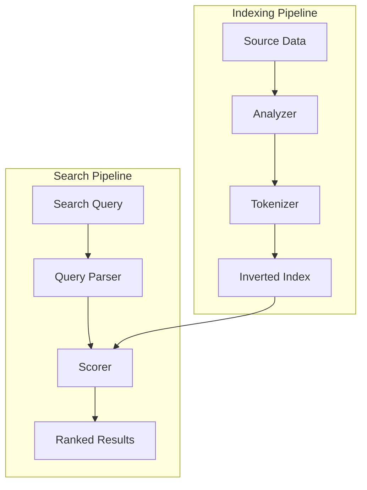

### Key Concepts

| Concept | Description |
|---------|-------------|
| **Inverted Index** | Word → Document IDs mapping |
| **Tokenization** | Breaking text into searchable tokens |
| **Analyzers** | Language-specific text processing |
| **Relevance Scoring** | TF-IDF, BM25 algorithms |
| **Facets** | Aggregations for filtering |

### Elasticsearch Architecture

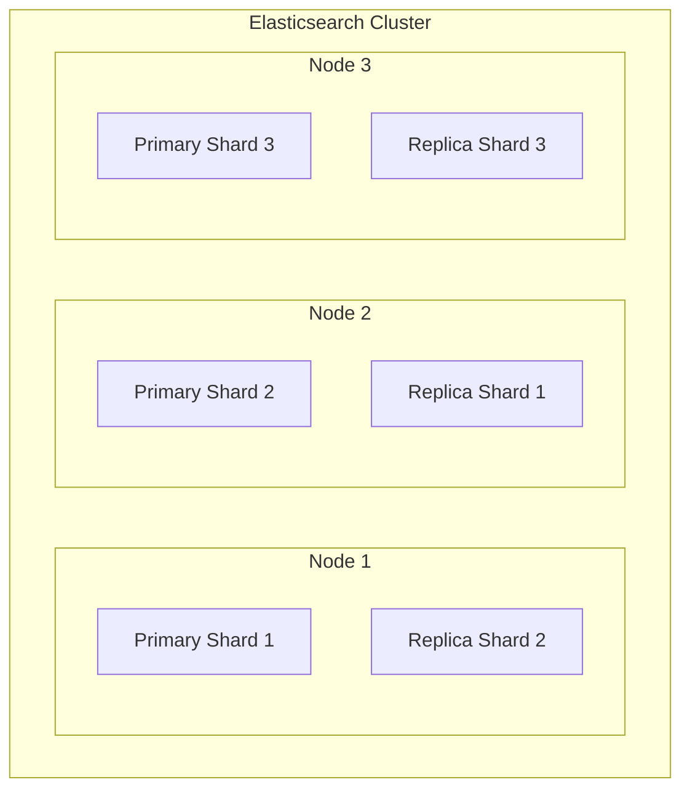

### Use Cases
- **Product search**: E-commerce catalog
- **Log analysis**: ELK stack
- **Autocomplete**: Type-ahead suggestions
- **Geospatial search**: Location-based queries

---

## 9. Blob Storage

### What It Does
Stores unstructured data (images, videos, files) at massive scale.

### Key Features

| Feature | Description |
|---------|-------------|
| **Durability** | 99.999999999% (11 9s) |
| **Scalability** | Petabytes of data |
| **Cost-effective** | Tiered storage (hot/cold) |
| **CDN Integration** | Direct edge delivery |

### Storage Tiers

| Tier | Access Pattern | Cost | Use Case |
|------|----------------|------|----------|
| **Hot** | Frequent access | $$$ | Active data |
| **Warm** | Occasional access | $$ | 30-day retention |
| **Cold** | Rare access | $ | Archives |
| **Archive** | Near-zero access | ¢ | Compliance |

### Popular Options
- AWS S3, Google Cloud Storage, Azure Blob Storage

### Use Cases
- **Media storage**: Images, videos, audio
- **Backups**: Database dumps, snapshots
- **Static hosting**: Websites, documentation
- **Data lakes**: Raw data for analytics

---

## 10. Coordination Service

### What It Does
Provides distributed synchronization, configuration, and leader election.

### Key Features

| Feature | Description |
|---------|-------------|
| **Distributed Locks** | Prevent concurrent access |
| **Leader Election** | Choose a single leader |
| **Configuration** | Centralized config storage |
| **Service Registry** | Track available services |

### ZooKeeper Use Cases

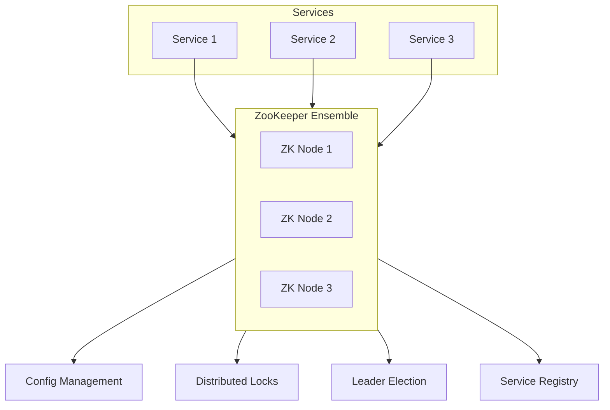

### Popular Options
- ZooKeeper, etcd, Consul

---

## Component Selection Cheat Sheet

### By Use Case

| Use Case | Primary Choice | Alternative |
|----------|----------------|-------------|
| **Caching** | Redis | Memcached |
| **Primary Database** | PostgreSQL | MySQL |
| **Document Store** | MongoDB | Couchbase |
| **High Write Throughput** | Cassandra | ScyllaDB |
| **Message Queue** | Kafka | RabbitMQ |
| **Search** | Elasticsearch | Solr |
| **Blob Storage** | S3 | GCS |
| **Coordination** | ZooKeeper | etcd |
| **API Gateway** | Kong | AWS API Gateway |

### By Scale

| Scale | Infrastructure Approach |
|-------|------------------------|
| **MVP** | Monolith, single DB, no cache |
| **Growth** | Add cache, read replicas |
| **Scale** | Microservices, sharding, CDN |
| **Massive** | Multi-region, custom solutions |

---

## Summary

Understanding these building blocks is fundamental to system design:

1. **DNS & CDN**: First line of defense, reduce latency
2. **Load Balancer**: Distribute traffic, enable scaling
3. **API Gateway**: Centralize cross-cutting concerns
4. **Databases**: Choose based on data model and scale
5. **Cache**: Speed up reads, reduce DB load
6. **Message Queue**: Decouple services, enable async
7. **Search Engine**: Fast full-text queries
8. **Blob Storage**: Store unstructured data at scale
9. **Coordination Service**: Distributed synchronization

---

**Previous**: [← Requirements & Estimation](02-requirements-estimation.md) | **Next**: [Scalability Patterns →](04-scalability-patterns.md)
