# Scalability Patterns

Scalability is the ability of a system to handle increased load by adding resources. This guide covers the fundamental patterns for scaling systems horizontally and vertically.

## Scaling Fundamentals

### Vertical vs Horizontal Scaling

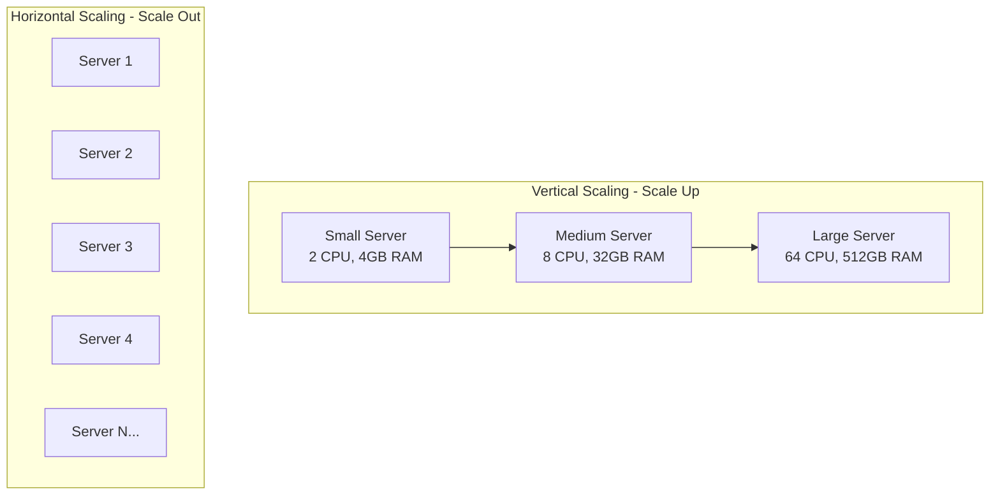

| Aspect | Vertical Scaling | Horizontal Scaling |
|--------|-----------------|-------------------|
| **Approach** | Bigger machine | More machines |
| **Limit** | Hardware ceiling | Theoretically unlimited |
| **Downtime** | Required for upgrade | Zero downtime |
| **Cost** | Expensive at scale | Cost-effective |
| **Complexity** | Simple | Complex (distributed) |
| **Failure** | Single point of failure | Fault tolerant |

### When to Use Which

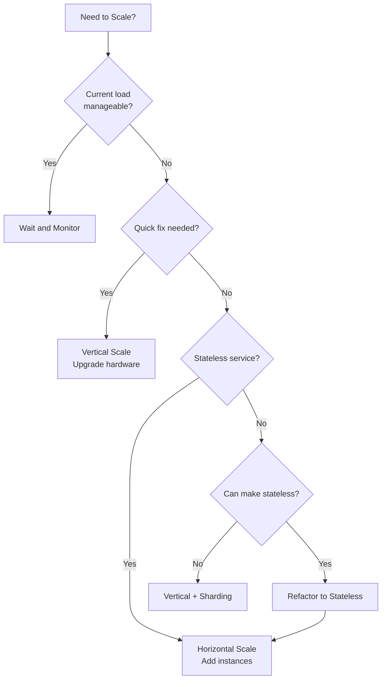

---

## Database Scaling Patterns

### 1. Read Replicas

Distribute read traffic across multiple database copies.

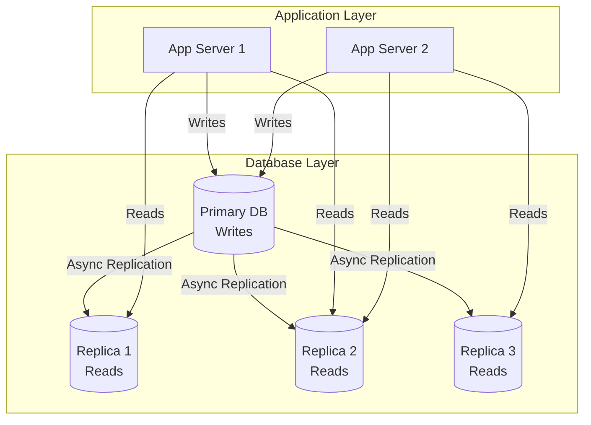

**When to Use:**
- Read-heavy workloads (10:1 or higher read:write ratio)
- Geographic distribution needed
- Reporting queries that shouldn't impact production

**Trade-offs:**
- Replication lag (eventual consistency)
- Added complexity
- Doesn't help with write scaling

### 2. Database Sharding

Partition data across multiple database instances.

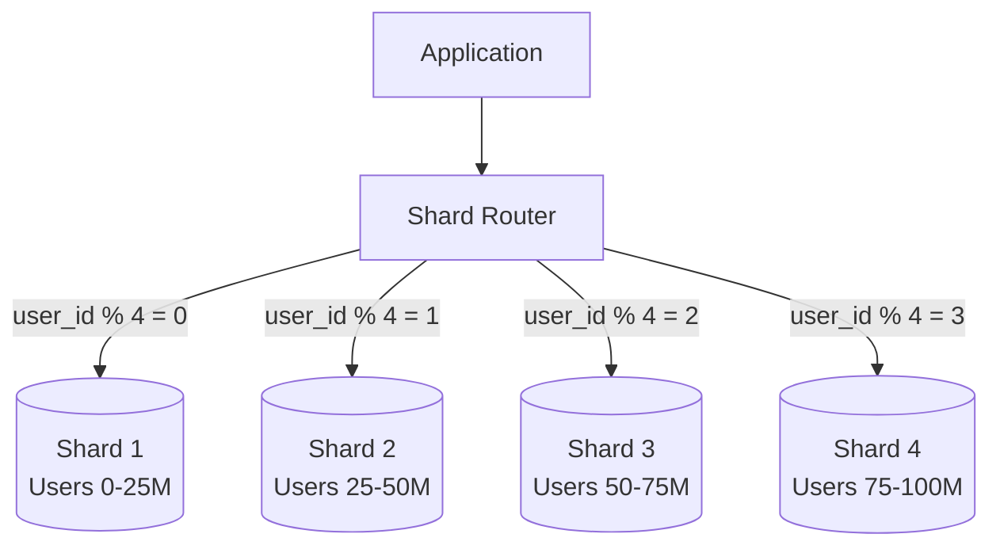

#### Sharding Strategies

| Strategy | How It Works | Pros | Cons |
|----------|--------------|------|------|
| **Hash-based** | `shard = hash(key) % n` | Even distribution | Resharding is hard |
| **Range-based** | `shard = key_range` | Easy range queries | Hot spots possible |
| **Directory-based** | Lookup table | Flexible | Single point of failure |
| **Geographic** | By region/location | Data locality | Cross-region queries hard |

#### Choosing a Shard Key

| Good Shard Key | Bad Shard Key |
|----------------|---------------|
| `user_id` (even distribution) | `created_at` (time-based hot spot) |
| `customer_id` (for B2B) | `country` (uneven distribution) |
| `order_id` (hash-based) | `status` (few values) |

#### Shard Key Selection Decision Tree

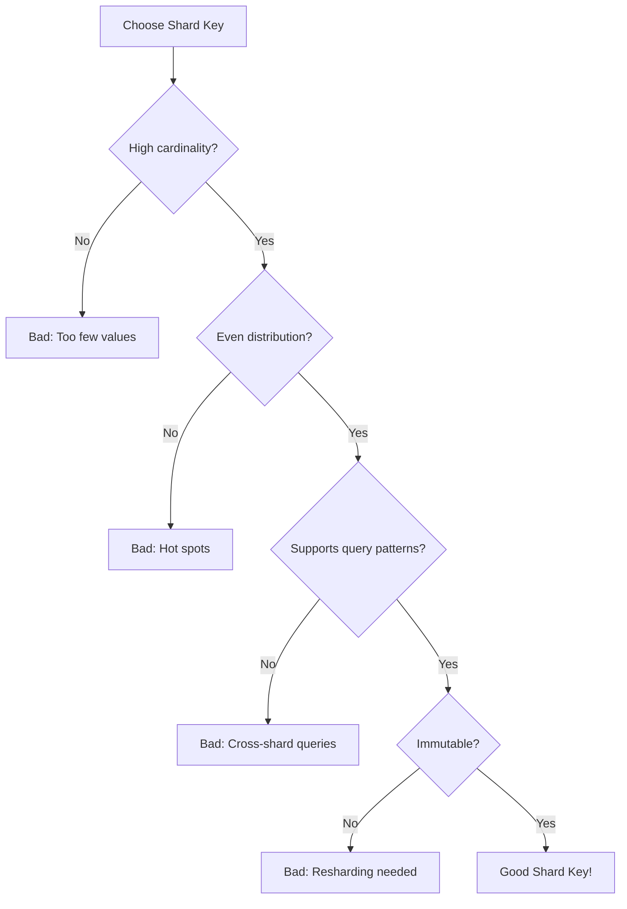

### 3. Consistent Hashing

Minimizes data movement when adding/removing nodes.

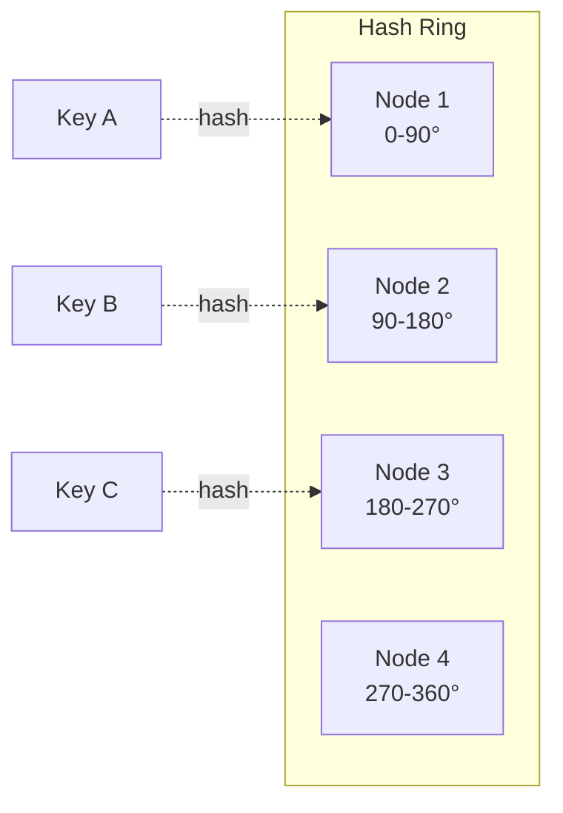

**How It Works:**
1. Hash both nodes and keys to positions on a ring
2. Each key is assigned to the first node clockwise from its position
3. When a node is added/removed, only keys in that segment move

**Benefits:**
- Adding a node: Only `1/n` keys need to move
- Removing a node: Only that node's keys redistribute
- Virtual nodes prevent uneven distribution

**Use Cases:**
- Distributed caches (Memcached, Redis Cluster)
- Load balancers
- CDN edge selection

---

## Application Scaling Patterns

### 1. Stateless Services

Services that don't store session state locally.

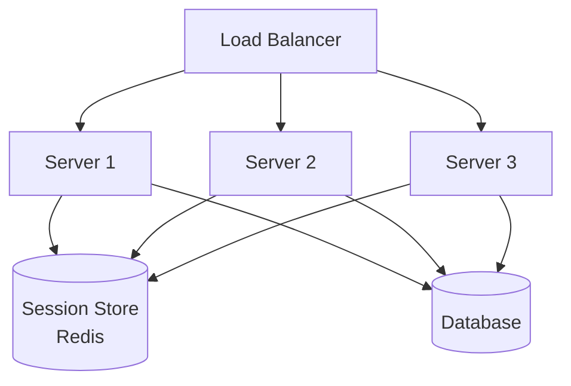

**How to Achieve:**
- Store session in external store (Redis, database)
- Use JWT tokens for authentication (stateless)
- Cache results in distributed cache

**Benefits:**
- Any server can handle any request
- Easy horizontal scaling
- Simple deployment (rolling updates)

### 2. Stateful Services

When state must be maintained (e.g., WebSocket connections, game servers).

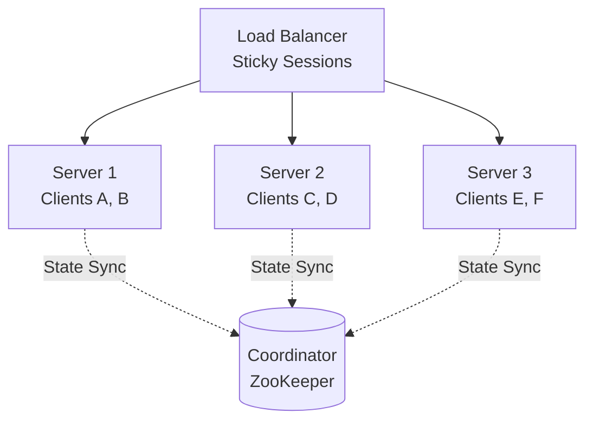

**Approaches:**
- Sticky sessions (route same client to same server)
- State synchronization between servers
- Partitioned state (each server owns certain data)

**Use Cases:**
- Real-time collaboration (Google Docs)
- Multiplayer games
- WebSocket connections

### 3. Service Decomposition

Break monolith into independent, scalable services.

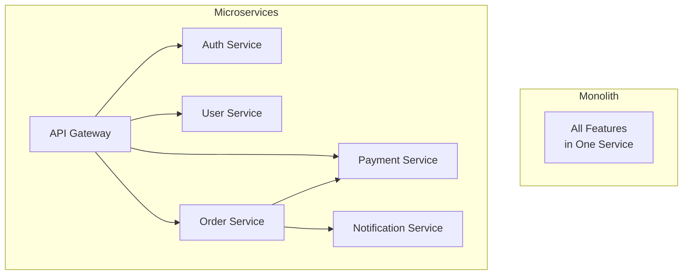

**Benefits:**
- Scale services independently
- Different tech stacks per service
- Independent deployments
- Fault isolation

**When to Decompose:**
- Different scaling needs (CPU vs I/O)
- Different team ownership
- Different release cycles

---

## Caching for Scale

### Multi-Layer Caching

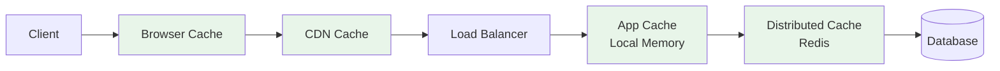

### Cache Sizing

```
Cache Hit Rate Formula:
Hit Rate = (Total Requests - Cache Misses) / Total Requests

Cache Size Estimation:
If 20% of data serves 80% of requests (Pareto):
Cache Size = 0.2 × Total Data Size

Example:
Total data: 100 GB
Cache needed: 20 GB for ~80% hit rate
```

### Write Scaling with Caching

| Pattern | Write Path | Read Path | Use Case |
|---------|------------|-----------|----------|
| **Cache-Aside** | DB only | Cache then DB | General purpose |
| **Write-Through** | Cache + DB sync | Cache only | Consistency needed |
| **Write-Behind** | Cache, async DB | Cache only | High write throughput |

---

## Async Processing

### Queue-Based Load Leveling

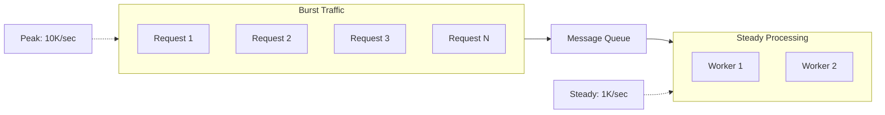

**Benefits:**
- Absorb traffic spikes
- Workers process at sustainable rate
- Prevents system overload

### Event-Driven Architecture

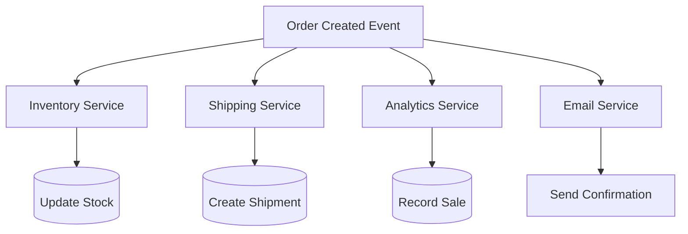

**Benefits:**
- Services scale independently
- Loose coupling
- Natural event logging
- Easy to add new consumers

---

## Data Partitioning Patterns

### Functional Partitioning

Split by function/domain, not by data.

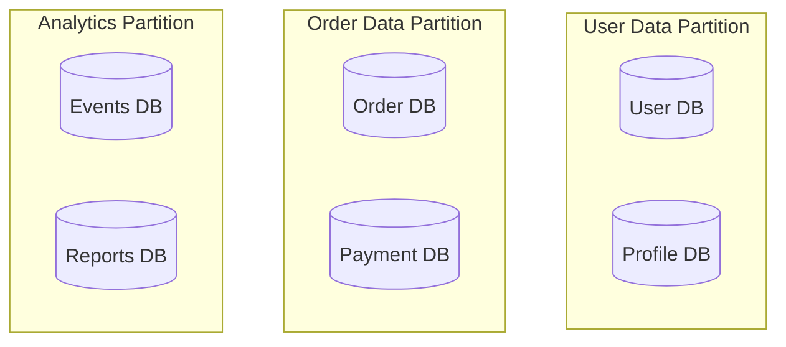

### Geographic Partitioning

Route users to nearest data center.

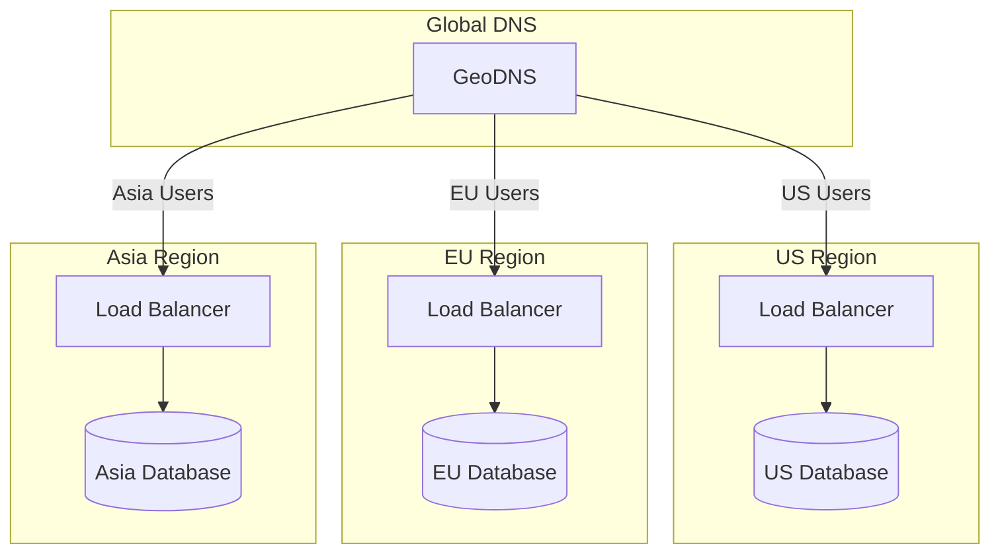

**Considerations:**
- Data sovereignty (GDPR)
- Cross-region queries
- Replication strategy

---

## Auto-Scaling

### Metrics-Based Scaling

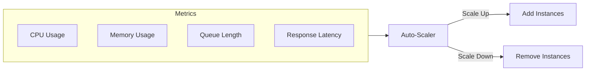

### Scaling Policies

| Metric | Scale Up When | Scale Down When |
|--------|---------------|-----------------|
| CPU | > 70% for 3 min | < 30% for 10 min |
| Memory | > 80% | < 40% for 10 min |
| Queue Length | > 1000 messages | < 100 messages |
| Latency | P99 > 500ms | P99 < 100ms |

### Predictive Scaling

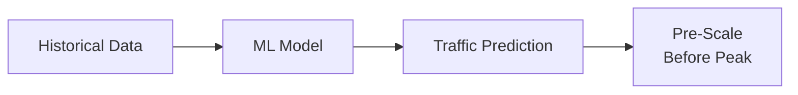

---

## Anti-Patterns to Avoid

### 1. Premature Scaling

```
❌ Wrong: "Let's shard from day one for future scale"
✅ Right: "Let's design for sharding but implement when needed"
```

### 2. Ignoring Data Locality

```
❌ Wrong: Separate user data across random shards
✅ Right: Co-locate related data (user + user's orders)
```

### 3. Cross-Shard Transactions

```
❌ Wrong: Transaction spanning multiple shards
✅ Right: Design to avoid cross-shard transactions
```

### 4. No Circuit Breakers

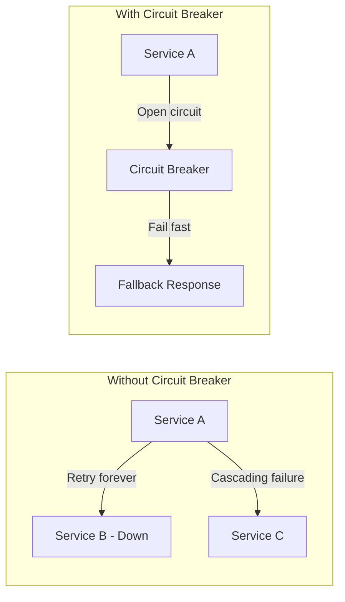

---

## Scaling Checklist

### Before You Scale

- [ ] Profile and identify actual bottlenecks
- [ ] Measure current performance baseline
- [ ] Determine scaling targets (2x? 10x? 100x?)
- [ ] Consider cost implications

### Application Layer

- [ ] Stateless service design
- [ ] Horizontal scaling capability
- [ ] Health checks implemented
- [ ] Graceful shutdown handling

### Data Layer

- [ ] Read replicas for read scaling
- [ ] Caching layer implemented
- [ ] Sharding strategy defined
- [ ] Connection pooling configured

### Infrastructure

- [ ] Load balancer configured
- [ ] Auto-scaling policies set
- [ ] CDN for static content
- [ ] Monitoring and alerting

---

## Use Case: Scaling a Read-Heavy Application

**Scenario**: E-commerce product catalog with 100K QPS reads, 100 QPS writes

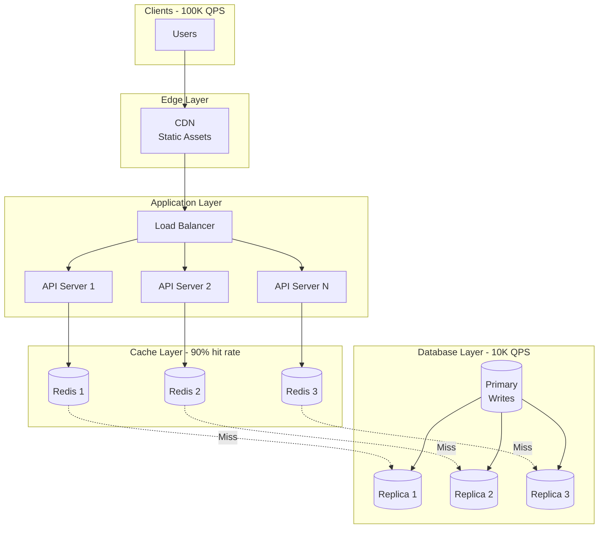

**Key Decisions:**
1. **CDN**: Cache product images, reduce origin traffic
2. **Distributed Cache**: 90% hit rate means only 10K QPS to DB
3. **Read Replicas**: Distribute 10K read QPS across replicas
4. **Stateless APIs**: Scale horizontally as needed

---

## Summary

| Pattern | When to Use | Key Benefit |
|---------|-------------|-------------|
| **Vertical Scaling** | Quick fix, small scale | Simple |
| **Horizontal Scaling** | Sustainable growth | No ceiling |
| **Read Replicas** | Read-heavy workloads | Easy read scaling |
| **Sharding** | Write scaling needed | Unlimited data |
| **Consistent Hashing** | Dynamic cluster | Minimal resharding |
| **Stateless Services** | Any web service | Easy scaling |
| **Caching** | Repeat reads | Reduce DB load |
| **Async Processing** | Spiky traffic | Level load |

---

**Previous**: [← Core Building Blocks](03-core-building-blocks.md) | **Next**: [Distributed System Concepts →](05-distributed-system-concepts.md)
