# Distributed System Concepts

Understanding distributed systems theory is crucial for designing reliable, scalable systems. This guide covers the fundamental concepts that underpin all distributed architectures.

## The Challenges of Distribution

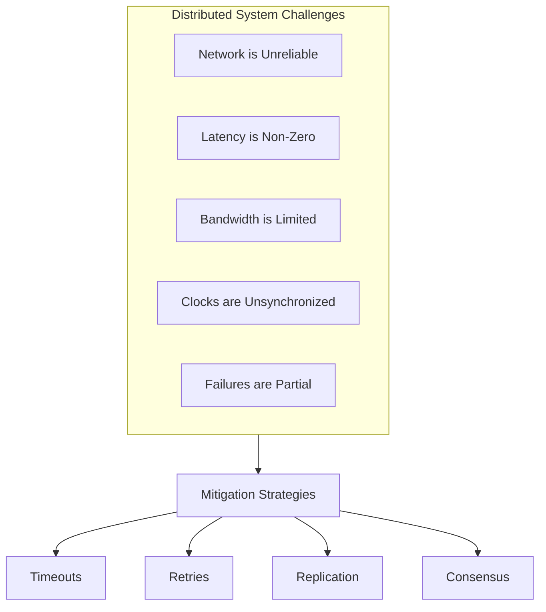
```mermaid
flowchart TB
    subgraph challenges [Distributed System Challenges]
        Network[Network is Unreliable]
        Latency[Latency is Non-Zero]
        Bandwidth[Bandwidth is Limited]
        Clocks[Clocks are Unsynchronized]
        Failures[Failures are Partial]
    end

    challenges --> Solutions[Mitigation Strategies]

    Solutions --> Timeouts[Timeouts]
    Solutions --> Retries[Retries]
    Solutions --> Replication[Replication]
    Solutions --> Consensus[Consensus]
```

### The Fallacies of Distributed Computing

1. The network is reliable
2. Latency is zero
3. Bandwidth is infinite
4. The network is secure
5. Topology doesn't change
6. There is one administrator
7. Transport cost is zero
8. The network is homogeneous

---

## CAP Theorem

### The Three Properties

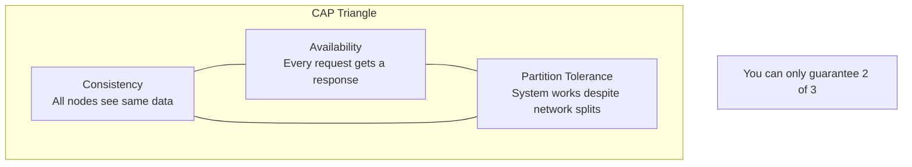
```mermaid
flowchart TB
    subgraph cap [CAP Triangle]
        C[Consistency<br/>All nodes see same data]
        A[Availability<br/>Every request gets a response]
        P[Partition Tolerance<br/>System works despite network splits]
    end

    C --- A
    A --- P
    P --- C

    Note[You can only guarantee 2 of 3]
```

| Property | Definition | Example |
|----------|------------|---------|
| **Consistency** | All reads return the most recent write | Bank balance always accurate |
| **Availability** | Every request receives a response | Website always loads |
| **Partition Tolerance** | System continues despite network failures | Works even if datacenter link breaks |

### CAP Trade-offs in Practice

Since network partitions **will happen**, you're really choosing between:

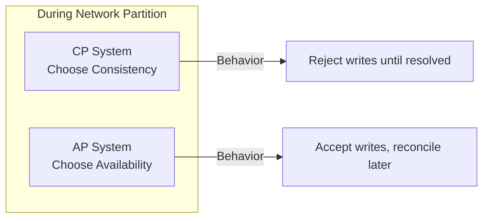
```mermaid
flowchart LR
    subgraph partition [During Network Partition]
        CP[CP System<br/>Choose Consistency]
        AP[AP System<br/>Choose Availability]
    end

    CP -->|Behavior| Reject[Reject writes until resolved]
    AP -->|Behavior| Accept[Accept writes, reconcile later]
```

| System Type | During Partition | Example Systems |
|-------------|------------------|-----------------|
| **CP** | Reject requests, maintain consistency | ZooKeeper, HBase, MongoDB (strong) |
| **AP** | Accept requests, allow inconsistency | Cassandra, DynamoDB, CouchDB |

### Real-World Examples

**Banking System (CP)**
```
Scenario: Transfer $100 from Account A to Account B
Requirement: Must never show incorrect balance
Choice: Consistency over Availability

During partition:
- Reject the transfer request
- User sees error
- Money is never lost or duplicated
```

**Social Media Feed (AP)**
```
Scenario: User posts a photo
Requirement: Must always be able to post
Choice: Availability over Consistency

During partition:
- Accept the post
- Some followers may not see it immediately
- Eventually all see the post
```

---

## ACID vs BASE

### ACID (Traditional Databases)

| Property | Meaning | Guarantee |
|----------|---------|-----------|
| **Atomicity** | All or nothing | Transaction completes fully or not at all |
| **Consistency** | Valid state transitions | Database always valid |
| **Isolation** | Concurrent transactions don't interfere | Appears sequential |
| **Durability** | Committed data persists | Survives crashes |

### BASE (NoSQL Databases)

| Property | Meaning | Trade-off |
|----------|---------|-----------|
| **Basically Available** | System always responds | May return stale data |
| **Soft state** | State may change over time | Without input, due to eventual consistency |
| **Eventually consistent** | Will become consistent | Given enough time |

### When to Choose

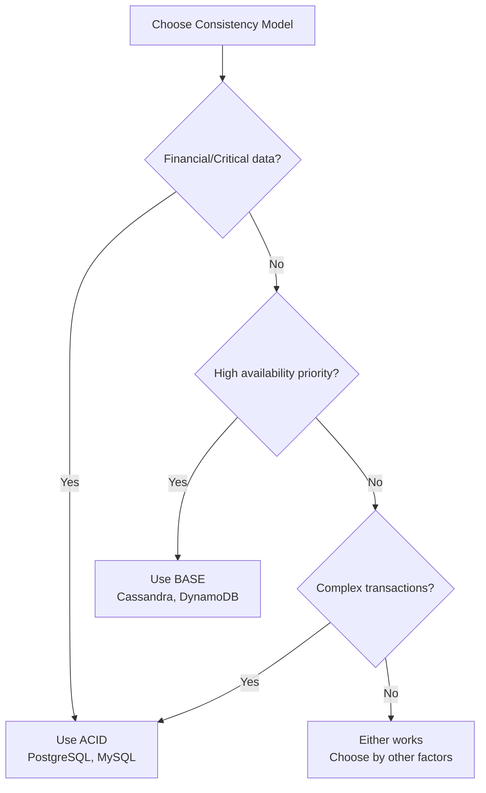
```mermaid
flowchart TB
    Start[Choose Consistency Model] --> Q1{Financial/Critical data?}
    Q1 -->|Yes| ACID[Use ACID<br/>PostgreSQL, MySQL]
    Q1 -->|No| Q2{High availability priority?}

    Q2 -->|Yes| BASE[Use BASE<br/>Cassandra, DynamoDB]
    Q2 -->|No| Q3{Complex transactions?}

    Q3 -->|Yes| ACID
    Q3 -->|No| Either[Either works<br/>Choose by other factors]
```

---

## Consistency Models

### Spectrum of Consistency

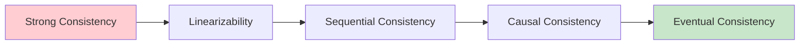
```mermaid
flowchart LR
    Strong[Strong Consistency] --> Linear[Linearizability]
    Linear --> Sequential[Sequential Consistency]
    Sequential --> Causal[Causal Consistency]
    Causal --> Eventual[Eventual Consistency]

    style Strong fill:#ffcdd2
    style Eventual fill:#c8e6c9
```

### Strong Consistency (Linearizability)

- All operations appear to execute atomically, in real-time order
- Reads always return the most recent write
- Simplest to reason about, hardest to implement at scale

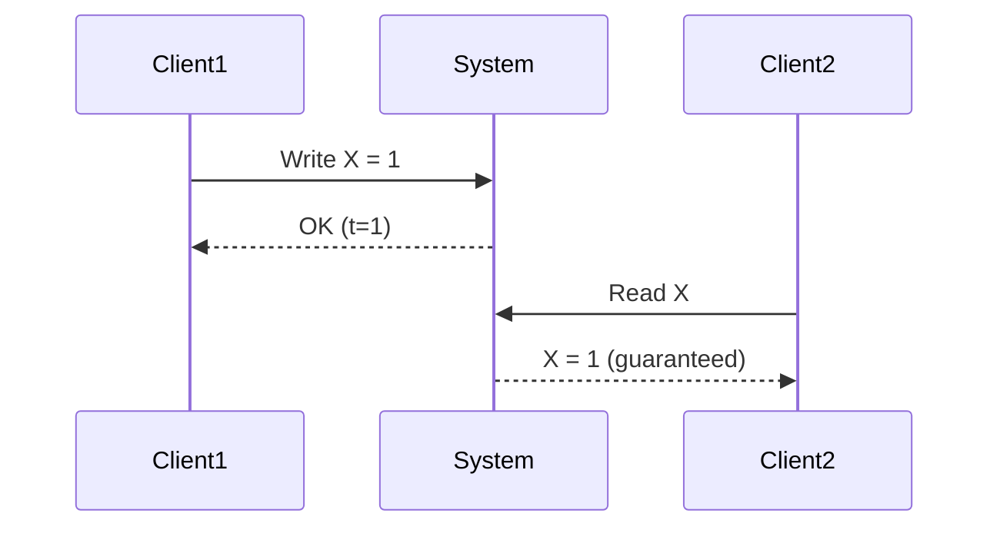
```mermaid
sequenceDiagram
    participant Client1
    participant System
    participant Client2

    Client1->>System: Write X = 1
    System-->>Client1: OK (t=1)
    Client2->>System: Read X
    System-->>Client2: X = 1 (guaranteed)
```

### Eventual Consistency

- Updates propagate eventually to all replicas
- Reads may return stale data
- Highest availability and performance

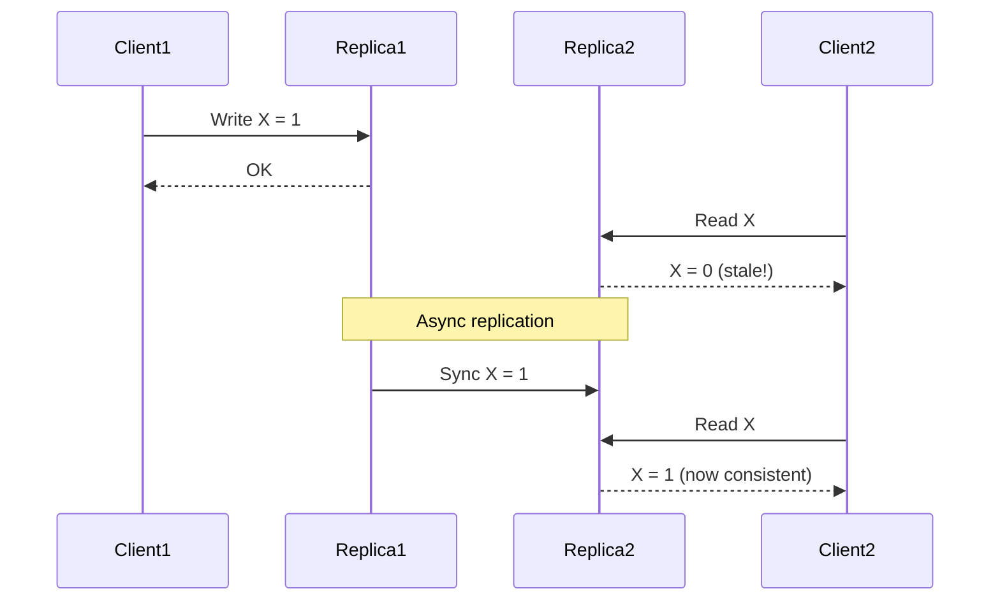
```mermaid
sequenceDiagram
    participant Client1
    participant Replica1
    participant Replica2
    participant Client2

    Client1->>Replica1: Write X = 1
    Replica1-->>Client1: OK
    Client2->>Replica2: Read X
    Replica2-->>Client2: X = 0 (stale!)
    Note over Replica1,Replica2: Async replication
    Replica1->>Replica2: Sync X = 1
    Client2->>Replica2: Read X
    Replica2-->>Client2: X = 1 (now consistent)
```

### Causal Consistency

- Preserves cause-and-effect relationships
- If A causes B, everyone sees A before B
- Doesn't order unrelated events

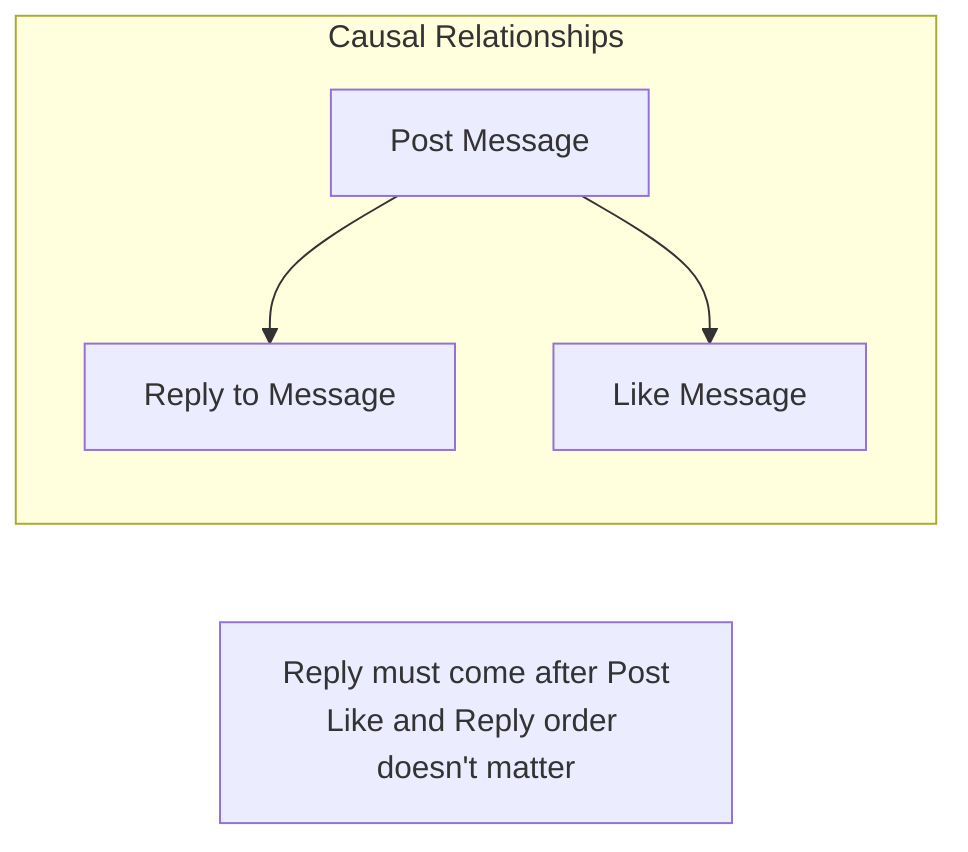
```mermaid
flowchart LR
    subgraph causal [Causal Relationships]
        Post[Post Message] --> Reply[Reply to Message]
        Post --> Like[Like Message]
    end

    Note[Reply must come after Post<br/>Like and Reply order doesn't matter]
```

### Read-Your-Writes Consistency

- User always sees their own updates
- Others may see stale data
- Good middle ground

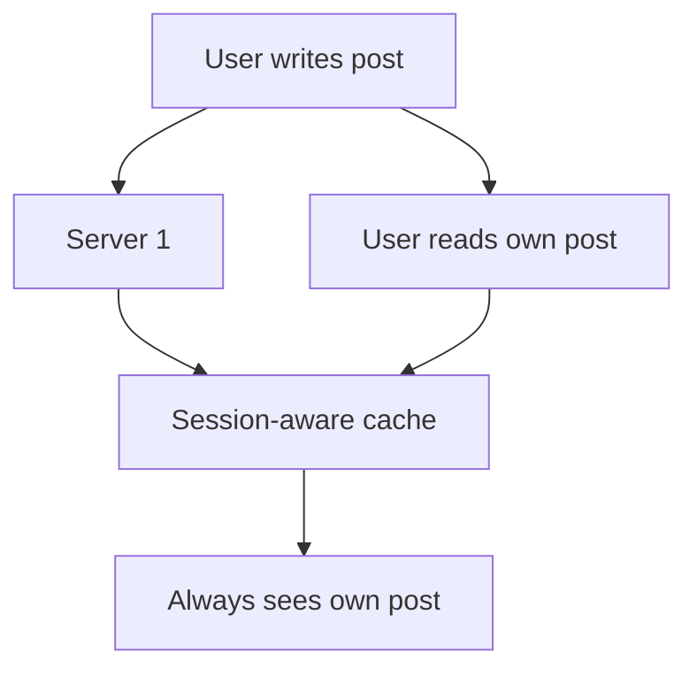
```mermaid
flowchart TB
    User1[User writes post] --> Server1[Server 1]
    Server1 --> Cache[Session-aware cache]
    User1 --> Read1[User reads own post]
    Read1 --> Cache
    Cache --> Success[Always sees own post]
```

---

## Consensus Algorithms

### Why Consensus Matters

In distributed systems, nodes must agree on:
- Who is the leader
- What is the current state
- What order did events happen

### The Consensus Problem

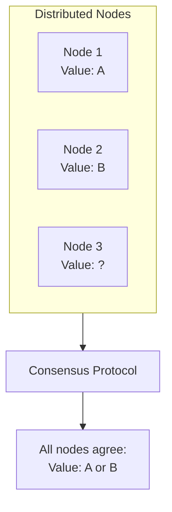
```mermaid
flowchart TB
    subgraph nodes [Distributed Nodes]
        N1[Node 1<br/>Value: A]
        N2[Node 2<br/>Value: B]
        N3[Node 3<br/>Value: ?]
    end

    nodes --> Consensus[Consensus Protocol]
    Consensus --> Agreed[All nodes agree:<br/>Value: A or B]
```

### Raft Consensus (Simplified)

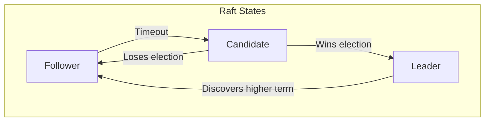
```mermaid
flowchart TB
    subgraph raft [Raft States]
        Follower[Follower] -->|Timeout| Candidate[Candidate]
        Candidate -->|Wins election| Leader[Leader]
        Candidate -->|Loses election| Follower
        Leader -->|Discovers higher term| Follower
    end
```

**Key Concepts:**
1. **Leader Election**: One node elected as leader
2. **Log Replication**: Leader replicates log entries to followers
3. **Safety**: Committed entries are never lost

### Paxos vs Raft

| Aspect | Paxos | Raft |
|--------|-------|------|
| **Understandability** | Complex | Designed for clarity |
| **Leader** | Multiple proposers | Single leader |
| **Implementation** | Many variants | Consistent design |
| **Use Cases** | Google Spanner | etcd, Consul |

---

## Replication Strategies

### Single-Leader Replication

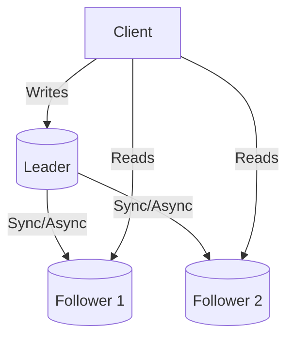
```mermaid
flowchart TB
    Client[Client] -->|Writes| Leader[(Leader)]
    Leader -->|Sync/Async| Follower1[(Follower 1)]
    Leader -->|Sync/Async| Follower2[(Follower 2)]

    Client -->|Reads| Follower1
    Client -->|Reads| Follower2
```

**Pros:**
- Simple, well-understood
- Strong consistency possible

**Cons:**
- Leader is bottleneck
- Failover complexity

### Multi-Leader Replication

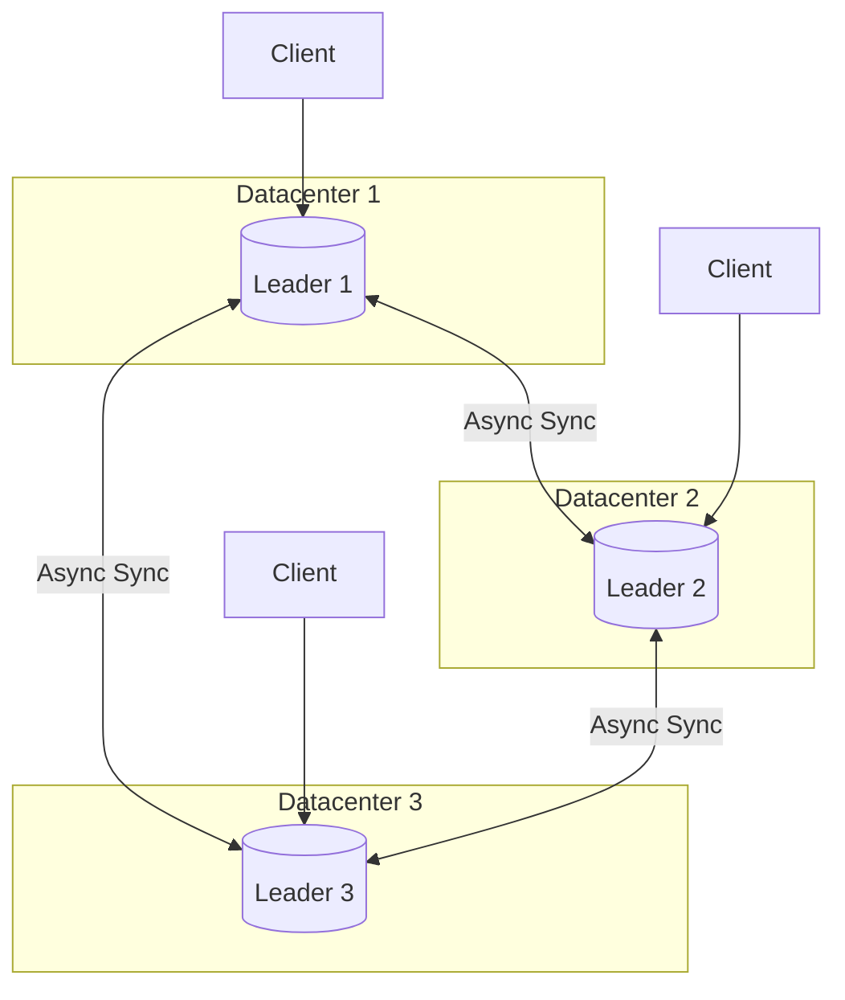
```mermaid
flowchart TB
    subgraph dc1 [Datacenter 1]
        Leader1[(Leader 1)]
    end

    subgraph dc2 [Datacenter 2]
        Leader2[(Leader 2)]
    end

    subgraph dc3 [Datacenter 3]
        Leader3[(Leader 3)]
    end

    Leader1 <-->|Async Sync| Leader2
    Leader2 <-->|Async Sync| Leader3
    Leader3 <-->|Async Sync| Leader1

    Client1[Client] --> Leader1
    Client2[Client] --> Leader2
    Client3[Client] --> Leader3
```

**Pros:**
- Better write performance
- Datacenter failure tolerance

**Cons:**
- Conflict resolution needed
- Complex

### Leaderless Replication

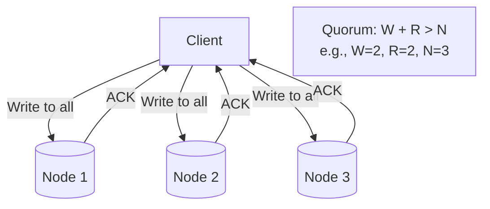
```mermaid
flowchart TB
    Client[Client] -->|Write to all| N1[(Node 1)]
    Client -->|Write to all| N2[(Node 2)]
    Client -->|Write to all| N3[(Node 3)]

    N1 -->|ACK| Client
    N2 -->|ACK| Client
    N3 -->|ACK| Client

    Note[Quorum: W + R > N<br/>e.g., W=2, R=2, N=3]
```

**Quorum Writes and Reads:**
- N = total nodes
- W = write quorum (nodes that must confirm write)
- R = read quorum (nodes to read from)
- If W + R > N, reads are guaranteed to see latest write

---

## Conflict Resolution

### Write Conflicts in Multi-Leader/Leaderless

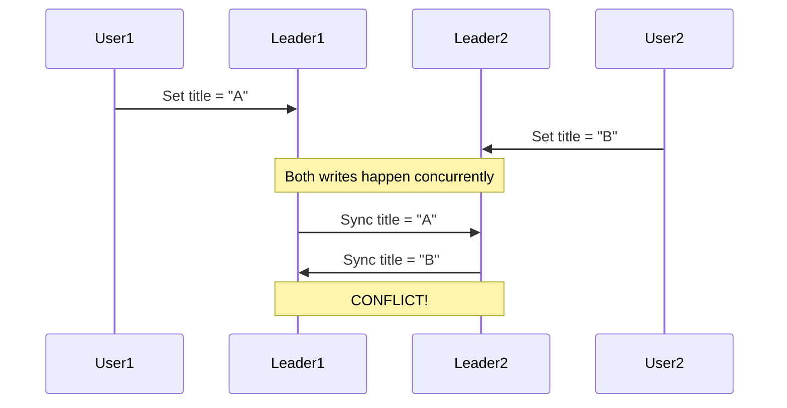
```mermaid
sequenceDiagram
    participant User1
    participant Leader1
    participant Leader2
    participant User2

    User1->>Leader1: Set title = "A"
    User2->>Leader2: Set title = "B"
    Note over Leader1,Leader2: Both writes happen concurrently
    Leader1->>Leader2: Sync title = "A"
    Leader2->>Leader1: Sync title = "B"
    Note over Leader1,Leader2: CONFLICT!
```

### Resolution Strategies

| Strategy | How It Works | Use Case |
|----------|--------------|----------|
| **Last Write Wins (LWW)** | Timestamp-based, latest wins | Simple, acceptable data loss |
| **First Write Wins** | First writer wins | Rare |
| **Custom Merge** | Application logic merges | Shopping cart, text editing |
| **Version Vectors** | Track causality, detect conflicts | CRDTs |
| **User Resolution** | Present conflict to user | Git merge conflicts |

### CRDTs (Conflict-free Replicated Data Types)

Data structures that can be replicated across nodes, updated independently, and always converge to a consistent state.

**Examples:**
- **G-Counter**: Grow-only counter
- **PN-Counter**: Counter that can increment and decrement
- **LWW-Register**: Last-write-wins register
- **OR-Set**: Observed-remove set

---

## Idempotency

### Why It Matters

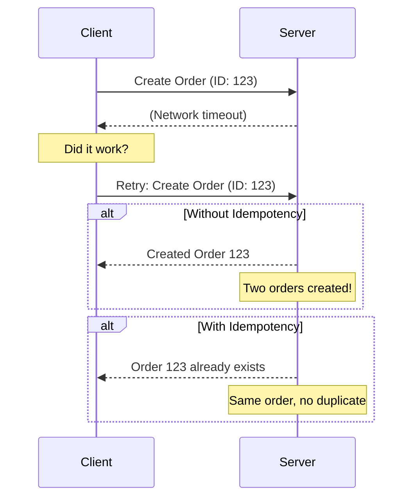
```mermaid
sequenceDiagram
    participant Client
    participant Server

    Client->>Server: Create Order (ID: 123)
    Server-->>Client: (Network timeout)
    Note over Client: Did it work?
    Client->>Server: Retry: Create Order (ID: 123)

    alt Without Idempotency
        Server-->>Client: Created Order 123
        Note over Server: Two orders created!
    end

    alt With Idempotency
        Server-->>Client: Order 123 already exists
        Note over Server: Same order, no duplicate
    end
```

### Implementing Idempotency

**1. Idempotency Keys**
```
POST /orders
Idempotency-Key: abc-123-unique-key

Server checks: Have I seen this key before?
- Yes: Return cached response
- No: Process and cache response
```

**2. Natural Idempotency**
```
PUT /users/123
{
  "name": "John"
}

Same request always produces same result
```

**3. Database Constraints**
```sql
-- Use unique constraints to prevent duplicates
INSERT INTO orders (id, user_id, amount)
VALUES (123, 456, 100.00)
ON CONFLICT (id) DO NOTHING;
```

---

## Distributed Transactions

### Two-Phase Commit (2PC)

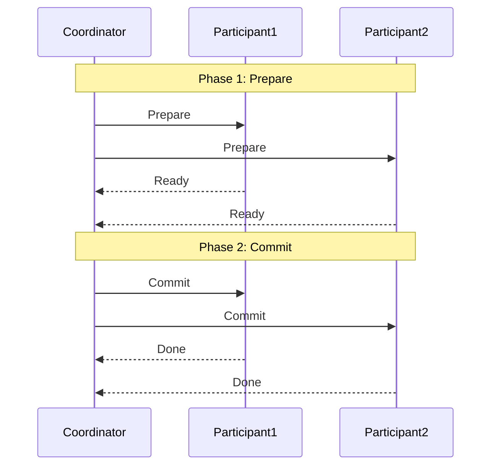
```mermaid
sequenceDiagram
    participant Coordinator
    participant Participant1
    participant Participant2

    Note over Coordinator,Participant2: Phase 1: Prepare
    Coordinator->>Participant1: Prepare
    Coordinator->>Participant2: Prepare
    Participant1-->>Coordinator: Ready
    Participant2-->>Coordinator: Ready

    Note over Coordinator,Participant2: Phase 2: Commit
    Coordinator->>Participant1: Commit
    Coordinator->>Participant2: Commit
    Participant1-->>Coordinator: Done
    Participant2-->>Coordinator: Done
```

**Problems:**
- Coordinator is single point of failure
- Blocking: participants wait for coordinator
- Not partition tolerant

### Saga Pattern

Break transaction into local transactions with compensating actions.

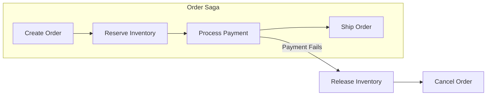
```mermaid
flowchart LR
    subgraph saga [Order Saga]
        T1[Create Order] --> T2[Reserve Inventory]
        T2 --> T3[Process Payment]
        T3 --> T4[Ship Order]
    end

    T3 -->|Payment Fails| C2[Release Inventory]
    C2 --> C1[Cancel Order]
```

**Choreography vs Orchestration:**

| Aspect | Choreography | Orchestration |
|--------|--------------|---------------|
| **Control** | Decentralized | Central orchestrator |
| **Coupling** | Loose | Tighter to orchestrator |
| **Visibility** | Harder to track | Clear flow |
| **Complexity** | Grows with services | Managed centrally |

---

## Time in Distributed Systems

### The Clock Problem

- Physical clocks can drift
- NTP can only sync within milliseconds
- Wall clock time is unreliable for ordering

### Logical Clocks

**Lamport Clocks:**
- Increment on local event
- On send: attach timestamp
- On receive: max(local, received) + 1

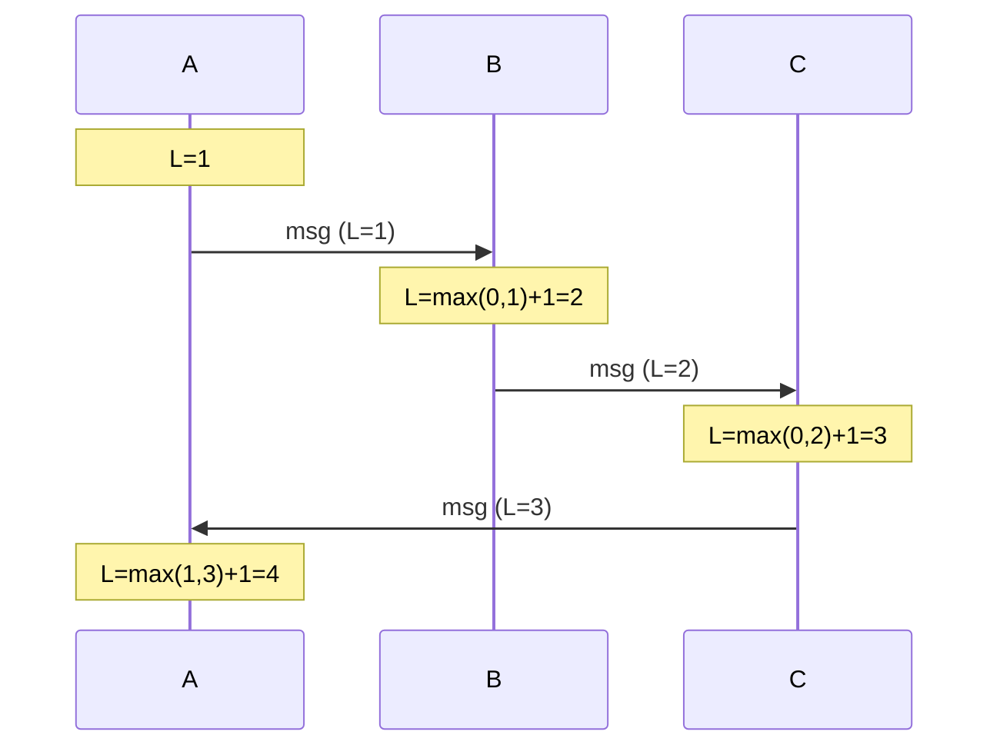
```mermaid
sequenceDiagram
    participant A
    participant B
    participant C

    Note over A: L=1
    A->>B: msg (L=1)
    Note over B: L=max(0,1)+1=2
    B->>C: msg (L=2)
    Note over C: L=max(0,2)+1=3
    C->>A: msg (L=3)
    Note over A: L=max(1,3)+1=4
```

**Vector Clocks:**
- Track causality across nodes
- Each node maintains vector of timestamps
- Can detect concurrent events

---

## Failure Detection

### Heartbeat-Based Detection

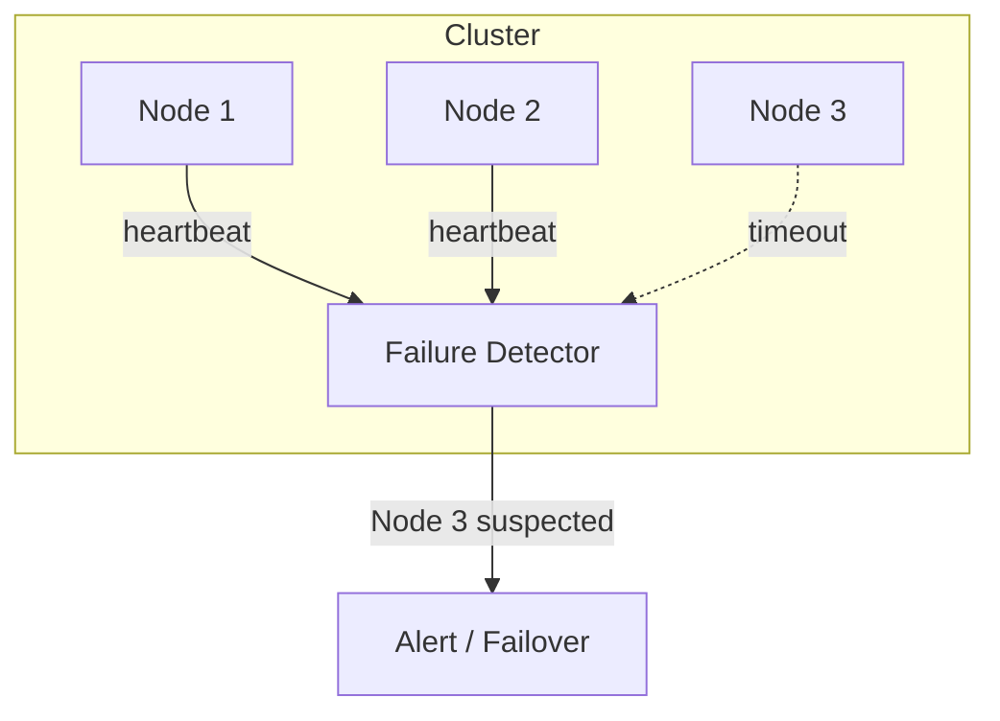
```mermaid
flowchart TB
    subgraph cluster [Cluster]
        N1[Node 1] -->|heartbeat| Monitor[Failure Detector]
        N2[Node 2] -->|heartbeat| Monitor
        N3[Node 3] -.->|timeout| Monitor
    end

    Monitor -->|Node 3 suspected| Alert[Alert / Failover]
```

### Phi Accrual Failure Detector

- Instead of binary alive/dead
- Outputs suspicion level (0 to 1)
- Based on heartbeat history
- Used by Cassandra, Akka

### Split Brain

When network partition causes nodes to believe others are dead:

```mermaid
flowchart TB
    subgraph partition1 [Partition 1]
        N1[Node 1 - thinks it is leader]
        N2[Node 2]
    end

    subgraph partition2 [Partition 2]
        N3[Node 3 - thinks it is leader]
        N4[Node 4]
    end

    partition1 -.->|Network partition| partition2

    Note[Two leaders = data corruption!]
```

**Prevention:**
- Quorum-based decisions (majority required)
- Fencing tokens (outdated leaders rejected)
- External arbitrator

---

## Summary Table

| Concept | Key Point | When to Use |
|---------|-----------|-------------|
| **CAP Theorem** | Can't have all three | Understand trade-offs |
| **ACID** | Strong consistency | Financial, critical data |
| **BASE** | Eventual consistency | High availability systems |
| **Strong Consistency** | Latest write always visible | Banking, inventory |
| **Eventual Consistency** | Will converge eventually | Social media, analytics |
| **Raft/Paxos** | Distributed consensus | Leader election, config |
| **Quorum** | W + R > N | Leaderless replication |
| **Idempotency** | Same result on retry | Any distributed system |
| **Saga** | Distributed transactions | Microservices |

---

## Key Takeaways

1. **Network failures are normal** - Design for them
2. **CAP is about partitions** - Choose CP or AP based on requirements
3. **Consistency is a spectrum** - Pick the right level
4. **Idempotency is essential** - Make operations safe to retry
5. **Clocks are unreliable** - Use logical clocks for ordering
6. **Consensus is expensive** - Use only when necessary

---

**Previous**: [← Scalability Patterns](04-scalability-patterns.md) | **Next**: [Data Storage Strategies →](06-data-storage-strategies.md)
