# Data Storage Strategies

Choosing the right database and storage strategy is one of the most critical decisions in system design. This guide covers database types, indexing strategies, partitioning, and when to use each.

## Database Selection Framework

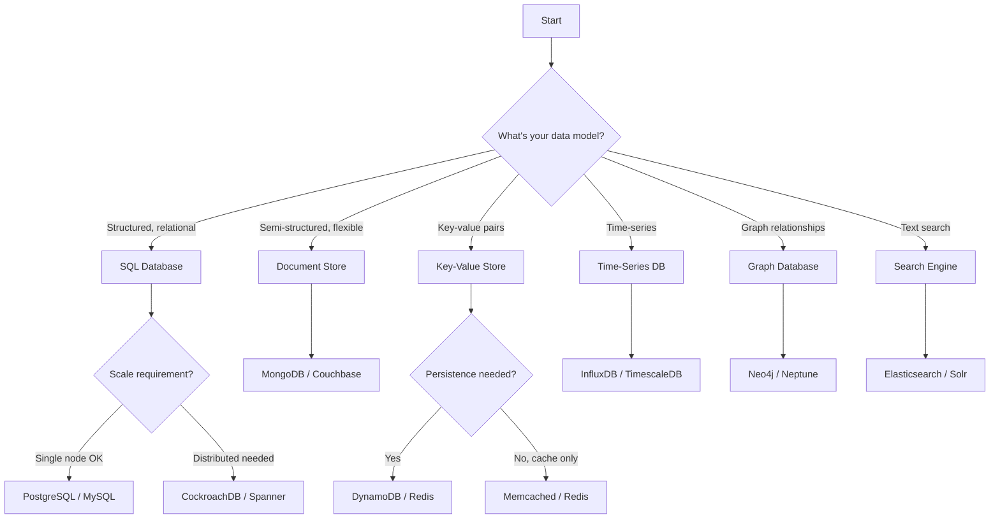

---

## SQL vs NoSQL

### Comparison Table

| Aspect | SQL | NoSQL |
|--------|-----|-------|
| **Data Model** | Tables with rows | Varies (document, key-value, etc.) |
| **Schema** | Fixed, predefined | Flexible, dynamic |
| **Transactions** | ACID | Usually BASE |
| **Scaling** | Vertical (traditionally) | Horizontal (designed for) |
| **Joins** | Native support | Limited or none |
| **Query Language** | Standardized SQL | Varies by database |
| **Best For** | Complex queries, transactions | Scale, flexibility, specific access patterns |

### When to Choose SQL

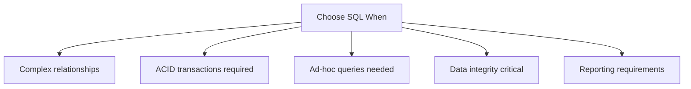

**Examples:**
- Banking systems (transactions)
- E-commerce orders (relationships)
- ERP systems (complex queries)
- Inventory management (consistency)

### When to Choose NoSQL

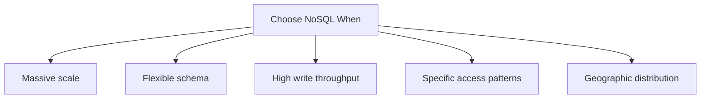

**Examples:**
- Social media feeds (scale)
- Product catalogs (flexible schema)
- IoT sensor data (high write volume)
- Session storage (key-value access)

---

## Database Types Deep Dive

### 1. Relational Databases (SQL)

**Architecture:**

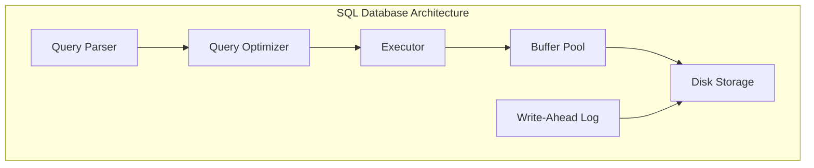

**Key Features:**
- ACID transactions
- Rich query language (SQL)
- Indexes (B-tree, hash)
- Foreign key constraints
- Views, stored procedures

**Popular Options:**

| Database | Best For | Key Feature |
|----------|----------|-------------|
| **PostgreSQL** | General purpose, complex queries | Extensions, JSON support |
| **MySQL** | Web applications | Replication, InnoDB |
| **SQL Server** | Enterprise, Windows | Integration with Microsoft |
| **Oracle** | Enterprise, mission-critical | Advanced features |

### 2. Document Databases

Store data as JSON-like documents.

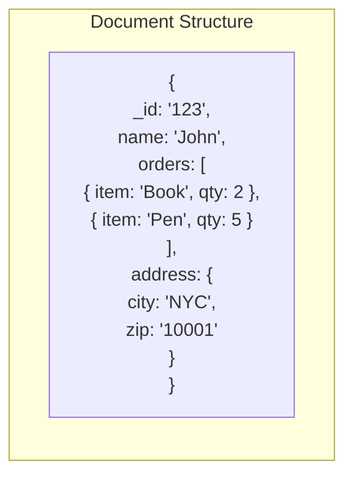

**When to Use:**
- Variable schemas
- Hierarchical data
- Content management
- Catalogs with varying attributes

**Popular Options:**

| Database | Best For | Key Feature |
|----------|----------|-------------|
| **MongoDB** | General document storage | Flexible queries, aggregation |
| **Couchbase** | High performance | Memory-first, mobile sync |
| **CouchDB** | Offline-first apps | Master-master replication |

### 3. Key-Value Stores

Simplest model: key → value.

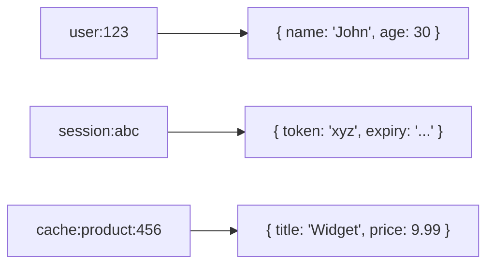

**When to Use:**
- Caching
- Session storage
- Shopping carts
- Real-time data

**Popular Options:**

| Database | Best For | Key Feature |
|----------|----------|-------------|
| **Redis** | Caching, real-time | Data structures, pub/sub |
| **Memcached** | Simple caching | Multi-threaded |
| **DynamoDB** | Serverless, scalable | Managed, predictable performance |

### 4. Column-Family Databases

Optimized for writes and column-based access.

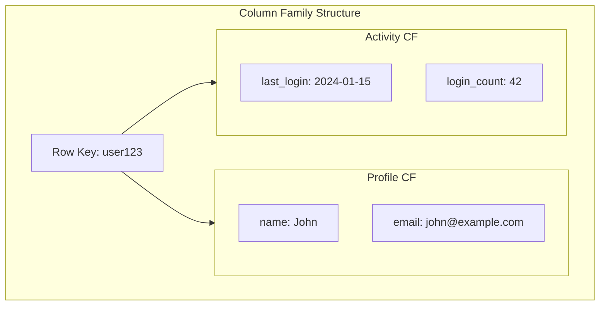

**When to Use:**
- Time-series data
- High write throughput
- Data that's rarely updated
- Analytics workloads

**Popular Options:**

| Database | Best For | Key Feature |
|----------|----------|-------------|
| **Cassandra** | High availability, writes | Tunable consistency |
| **HBase** | Hadoop integration | Strong consistency |
| **ScyllaDB** | Cassandra-compatible, faster | C++ implementation |

### 5. Graph Databases

Nodes and relationships as first-class citizens.

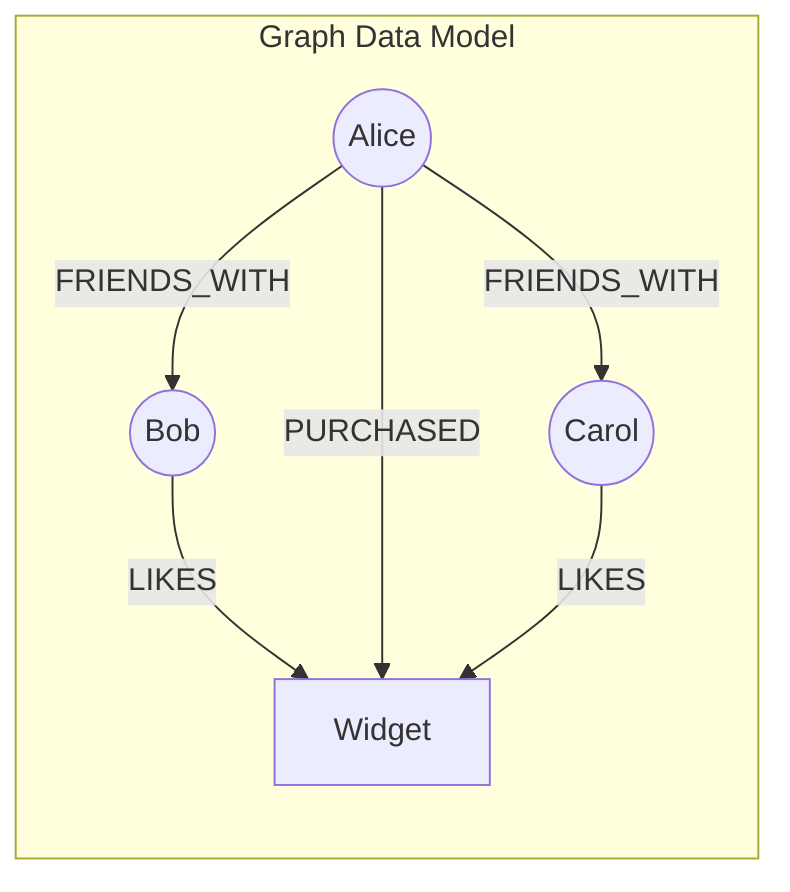

**When to Use:**
- Social networks
- Recommendation engines
- Fraud detection
- Knowledge graphs

**Popular Options:**

| Database | Best For | Key Feature |
|----------|----------|-------------|
| **Neo4j** | General graph workloads | Cypher query language |
| **Amazon Neptune** | Managed, multi-model | Gremlin, SPARQL |
| **TigerGraph** | Real-time analytics | Parallel processing |

### 6. Time-Series Databases

Optimized for timestamped data.

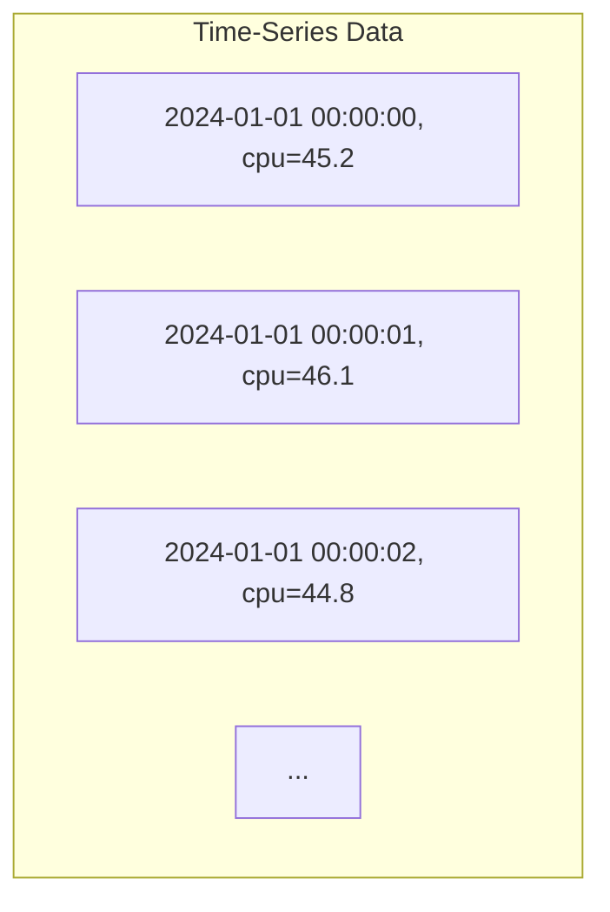

**When to Use:**
- Metrics and monitoring
- IoT sensor data
- Financial tick data
- Application logs

**Popular Options:**

| Database | Best For | Key Feature |
|----------|----------|-------------|
| **InfluxDB** | General time-series | Flux query language |
| **TimescaleDB** | PostgreSQL compatibility | SQL interface |
| **Prometheus** | Metrics | Pull-based collection |

---

## Indexing Strategies

### Index Types

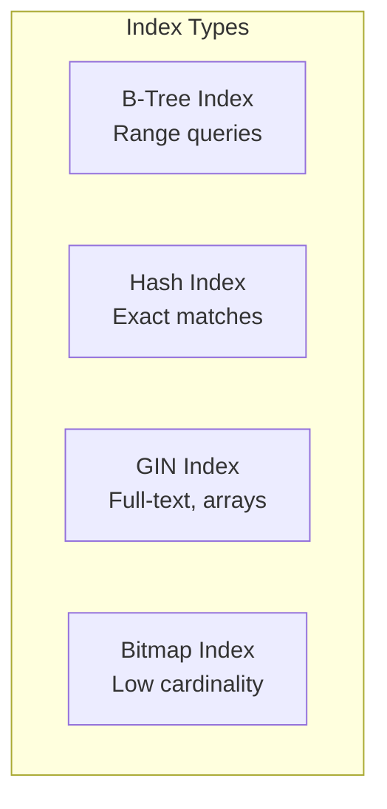

| Index Type | Best For | Example Query |
|------------|----------|---------------|
| **B-Tree** | Range queries, ordering | `WHERE age > 25 ORDER BY age` |
| **Hash** | Exact equality | `WHERE id = 123` |
| **GIN** | Full-text search, JSON | `WHERE tags @> '["tech"]'` |
| **GiST** | Geometric, full-text | `WHERE location <@ box` |
| **BRIN** | Large sequential data | `WHERE created_at > '2024-01-01'` |

### B-Tree vs LSM-Tree

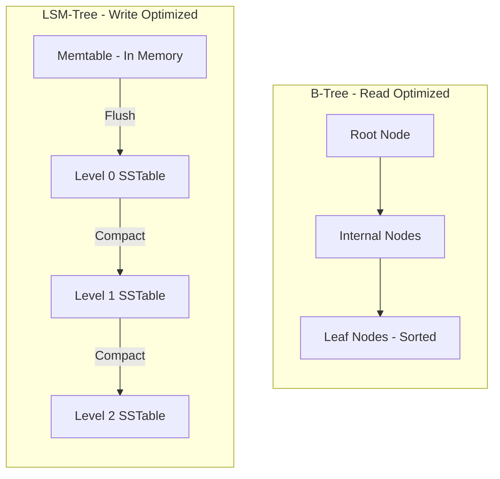

| Aspect | B-Tree | LSM-Tree |
|--------|--------|----------|
| **Writes** | Slower (in-place update) | Faster (append-only) |
| **Reads** | Faster (single lookup) | Slower (multiple levels) |
| **Space** | More efficient | Write amplification |
| **Use Case** | OLTP, reads | High write throughput |
| **Examples** | PostgreSQL, MySQL | Cassandra, RocksDB, LevelDB |

### Indexing Best Practices

```sql
-- 1. Index columns used in WHERE, JOIN, ORDER BY
CREATE INDEX idx_users_email ON users(email);

-- 2. Composite indexes for multi-column queries
CREATE INDEX idx_orders_user_date ON orders(user_id, created_at DESC);

-- 3. Partial indexes for specific conditions
CREATE INDEX idx_active_users ON users(email) WHERE status = 'active';

-- 4. Covering indexes to avoid table lookups
CREATE INDEX idx_orders_cover ON orders(user_id) INCLUDE (total, status);
```

**Common Mistakes:**
- Over-indexing (slows writes)
- Wrong column order in composite index
- Not considering query patterns
- Ignoring index maintenance

---

## Data Partitioning

### Horizontal Partitioning (Sharding)

Split data across multiple databases by rows.

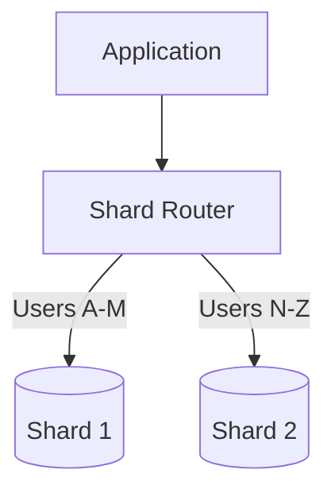

#### Partitioning Strategies

| Strategy | How It Works | Pros | Cons |
|----------|--------------|------|------|
| **Range** | By value range (A-M, N-Z) | Easy range queries | Hot spots |
| **Hash** | hash(key) % shards | Even distribution | No range queries |
| **List** | By explicit values | Predictable | Manual management |
| **Composite** | Combination | Flexible | Complex |

### Vertical Partitioning

Split data by columns into different tables/databases.

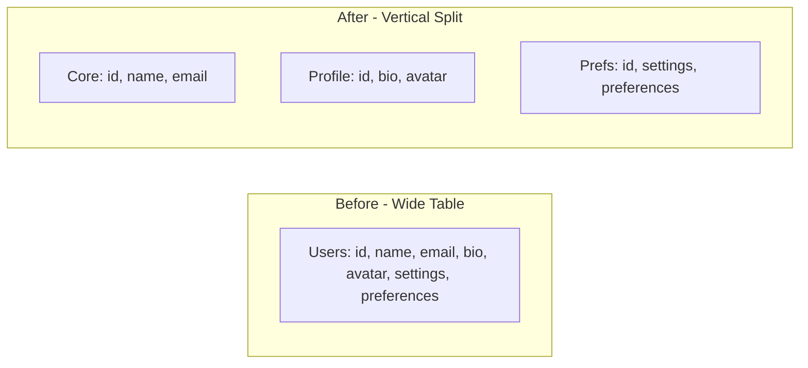

**When to Use:**
- Different access patterns
- Large columns rarely accessed
- Different storage requirements

### Partitioning in PostgreSQL

```sql
-- Range partitioning by date
CREATE TABLE orders (
    id BIGINT,
    created_at TIMESTAMP,
    amount DECIMAL
) PARTITION BY RANGE (created_at);

CREATE TABLE orders_2024_q1 PARTITION OF orders
    FOR VALUES FROM ('2024-01-01') TO ('2024-04-01');

CREATE TABLE orders_2024_q2 PARTITION OF orders
    FOR VALUES FROM ('2024-04-01') TO ('2024-07-01');

-- Hash partitioning
CREATE TABLE users (
    id BIGINT,
    email TEXT
) PARTITION BY HASH (id);

CREATE TABLE users_p0 PARTITION OF users
    FOR VALUES WITH (MODULUS 4, REMAINDER 0);
CREATE TABLE users_p1 PARTITION OF users
    FOR VALUES WITH (MODULUS 4, REMAINDER 1);
```

---

## Replication Strategies

### Synchronous vs Asynchronous

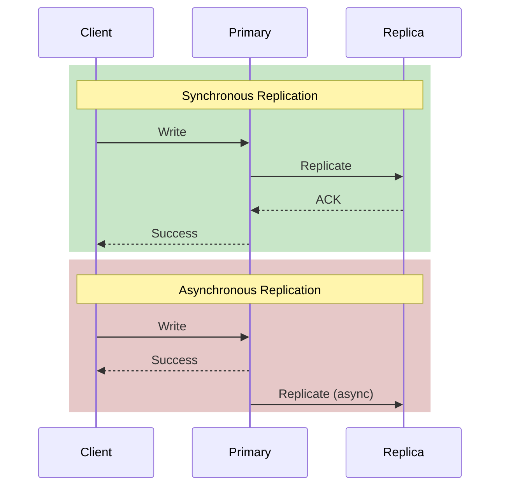

| Aspect | Synchronous | Asynchronous |
|--------|-------------|--------------|
| **Latency** | Higher (wait for replica) | Lower |
| **Durability** | Guaranteed | Risk of data loss |
| **Availability** | Lower (replica failure blocks) | Higher |
| **Use Case** | Financial data | General use |

### Replication Topologies

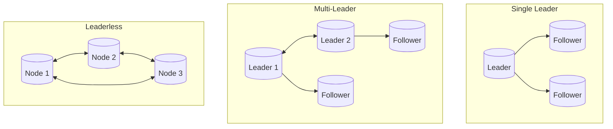

---

## Storage Engine Internals

### Write Path (LSM-Based)

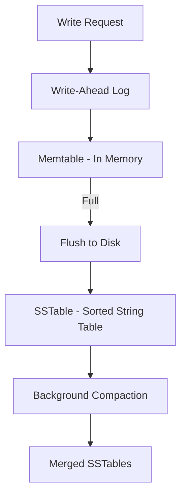

### Read Path

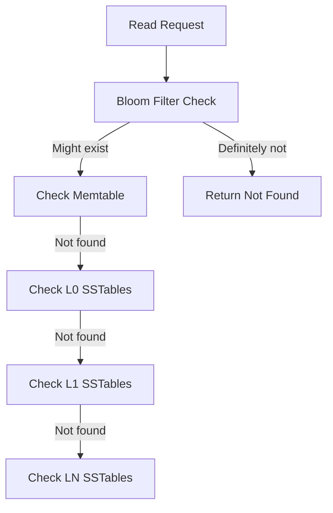

### Write-Ahead Logging (WAL)

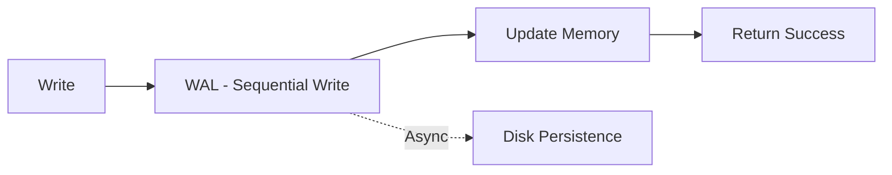

**Purpose:**
- Durability before data reaches main storage
- Crash recovery
- Replication log

---

## Polyglot Persistence

Use different databases for different needs.

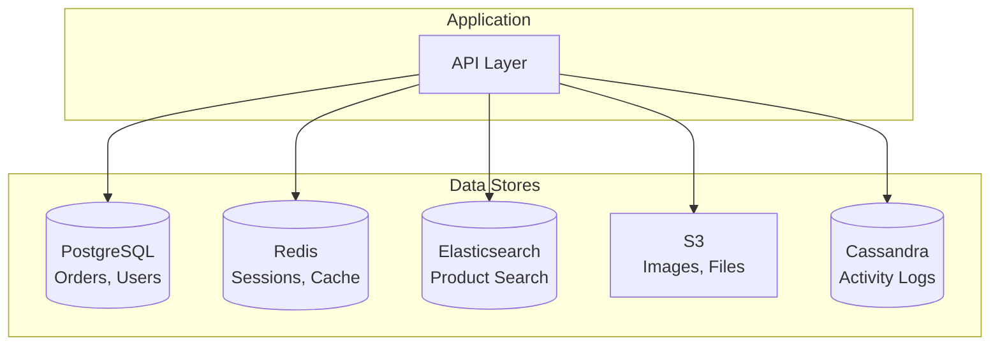

### Example: E-commerce Platform

| Data Type | Database | Reason |
|-----------|----------|--------|
| **Users, Orders** | PostgreSQL | ACID transactions |
| **Product Catalog** | MongoDB | Flexible schema |
| **Product Search** | Elasticsearch | Full-text search |
| **Sessions** | Redis | Fast access |
| **Activity Stream** | Cassandra | High write volume |
| **Product Images** | S3 | Blob storage |

---

## Schema Design Patterns

### 1. Normalization vs Denormalization

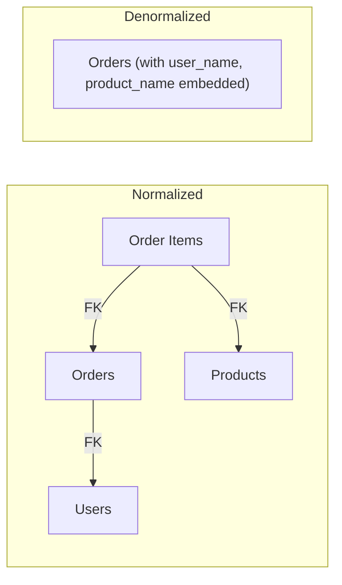

| Approach | Pros | Cons |
|----------|------|------|
| **Normalized** | No redundancy, data integrity | More joins, slower reads |
| **Denormalized** | Faster reads, simpler queries | Data duplication, update anomalies |

### 2. Soft Deletes

```sql
-- Instead of DELETE
ALTER TABLE users ADD COLUMN deleted_at TIMESTAMP;
ALTER TABLE users ADD COLUMN is_deleted BOOLEAN DEFAULT false;

-- "Delete" by marking
UPDATE users SET is_deleted = true, deleted_at = NOW() WHERE id = 123;

-- Query active users
SELECT * FROM users WHERE is_deleted = false;
```

### 3. Audit Trail

```sql
CREATE TABLE user_audit (
    id BIGSERIAL PRIMARY KEY,
    user_id BIGINT,
    action VARCHAR(20),  -- INSERT, UPDATE, DELETE
    old_data JSONB,
    new_data JSONB,
    changed_by BIGINT,
    changed_at TIMESTAMP DEFAULT NOW()
);
```

---

## Database Selection Cheat Sheet

### By Use Case

| Use Case | Primary Choice | Alternatives |
|----------|----------------|--------------|
| **General Web App** | PostgreSQL | MySQL |
| **High Traffic Caching** | Redis | Memcached |
| **Document Storage** | MongoDB | Couchbase |
| **Analytics** | ClickHouse | BigQuery |
| **Time-Series** | TimescaleDB | InfluxDB |
| **Search** | Elasticsearch | Solr, Meilisearch |
| **Graph Data** | Neo4j | Neptune |
| **High Write Volume** | Cassandra | ScyllaDB |

### By Scale

| Scale | Recommendation |
|-------|----------------|
| **MVP/Startup** | PostgreSQL for everything |
| **Growing** | PostgreSQL + Redis cache |
| **Scale** | Sharded PostgreSQL + Redis Cluster + Elasticsearch |
| **Massive** | Polyglot with specialized DBs per workload |

---

## Summary

1. **Choose based on access patterns** - Not just data model
2. **Start simple** - PostgreSQL handles most use cases
3. **Add specialized DBs as needed** - Polyglot persistence
4. **Index wisely** - Understand B-tree vs LSM trade-offs
5. **Plan for scale** - Design partitioning early
6. **Consider operational complexity** - Each DB adds overhead

---

**Previous**: [← Distributed System Concepts](05-distributed-system-concepts.md) | **Next**: [Caching Strategies →](07-caching-strategies.md)
