# Caching Strategies

Caching is one of the most effective ways to improve system performance and reduce database load. This guide covers caching patterns, invalidation strategies, and real-world use cases.

## Why Caching Matters

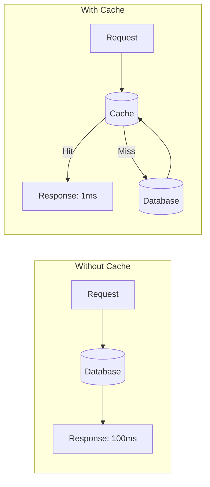

**Performance Impact:**
| Scenario | Latency | Database Load |
|----------|---------|---------------|
| No cache | 50-100ms | 100% |
| 80% hit rate | 10-20ms avg | 20% |
| 95% hit rate | 2-5ms avg | 5% |
| 99% hit rate | ~1ms avg | 1% |

---

## Cache Layers

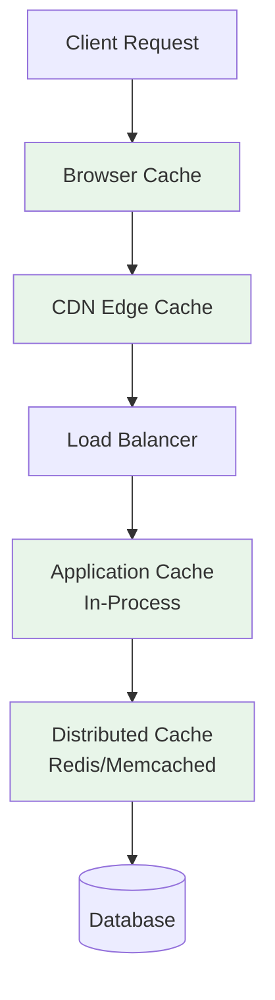

| Layer | Location | Latency | Scope |
|-------|----------|---------|-------|
| **Browser** | Client | 0ms | Single user |
| **CDN** | Edge | 10-50ms | All users in region |
| **Application** | Server memory | <1ms | Single server |
| **Distributed** | Redis/Memcached | 1-5ms | All servers |
| **Database** | DB buffer pool | 5-10ms | All queries |

---

## Caching Patterns

### 1. Cache-Aside (Lazy Loading)

Application manages cache explicitly.

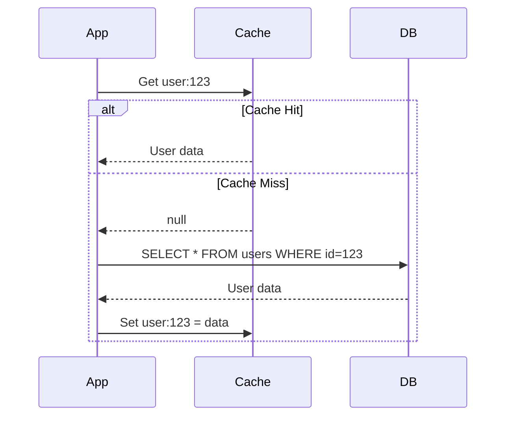

```python
def get_user(user_id):
    # Try cache first
    cached = cache.get(f"user:{user_id}")
    if cached:
        return cached

    # Cache miss - fetch from DB
    user = db.query("SELECT * FROM users WHERE id = ?", user_id)

    # Store in cache for next time
    cache.set(f"user:{user_id}", user, ttl=3600)

    return user
```

**Pros:**
- Simple to implement
- Cache only what's needed
- Resilient to cache failures

**Cons:**
- Cache miss = slow first request
- Stale data possible
- Application complexity

**Best For:**
- Read-heavy workloads
- Infrequently updated data
- General purpose caching

### 2. Read-Through Cache

Cache loads data on miss automatically.

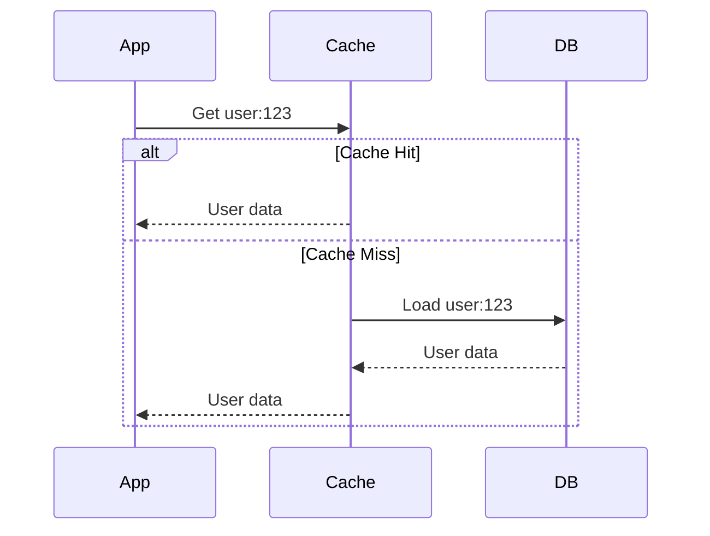

**Pros:**
- Simpler application code
- Consistent cache loading logic

**Cons:**
- Requires cache that supports read-through
- Less flexibility

**Best For:**
- When cache provider supports it
- Consistent data loading patterns

### 3. Write-Through Cache

Write to cache and database synchronously.

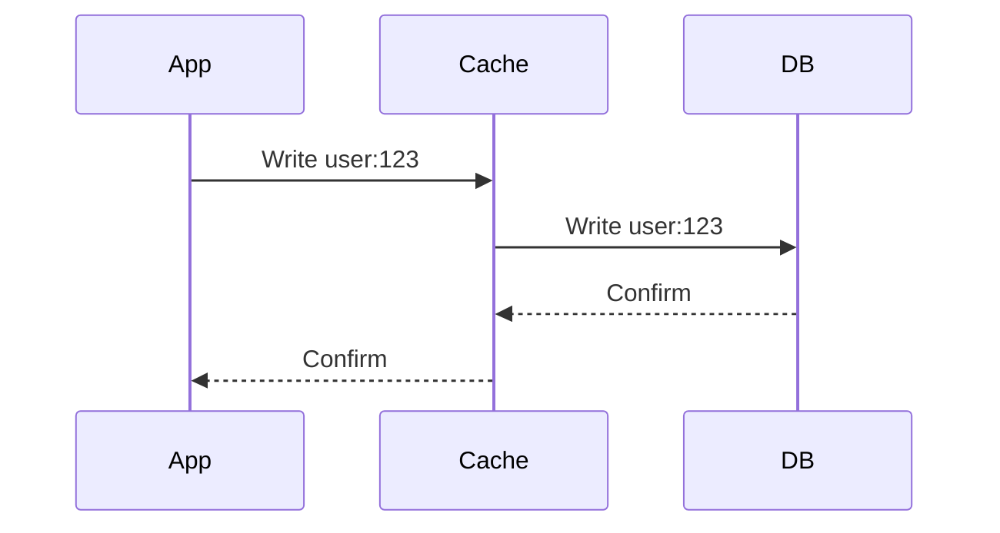

```python
def update_user(user_id, data):
    # Write to cache (which writes to DB)
    cache.set(f"user:{user_id}", data)  # Cache handles DB write
    return data
```

**Pros:**
- Cache always consistent with DB
- Simple mental model

**Cons:**
- Higher write latency
- Cache must be available for writes

**Best For:**
- Read-heavy, consistency-critical
- When cache availability is high

### 4. Write-Behind (Write-Back) Cache

Write to cache immediately, DB asynchronously.

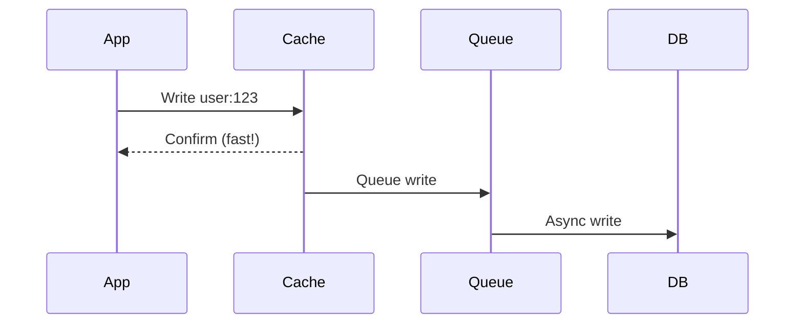

**Pros:**
- Very fast writes
- Batching reduces DB load

**Cons:**
- Risk of data loss if cache fails
- Complexity

**Best For:**
- Write-heavy workloads
- Can tolerate some data loss
- Analytics, logging

### 5. Refresh-Ahead Cache

Proactively refresh before expiration.

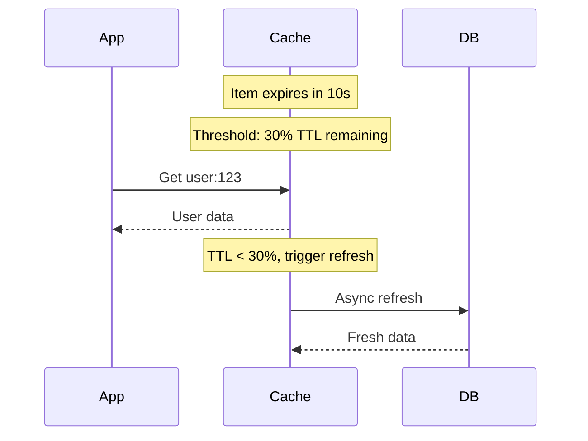

**Pros:**
- Fewer cache misses
- Consistent performance

**Cons:**
- Wasted refreshes for unused data
- Implementation complexity

**Best For:**
- Predictable access patterns
- Data that's always needed

---

## Pattern Comparison

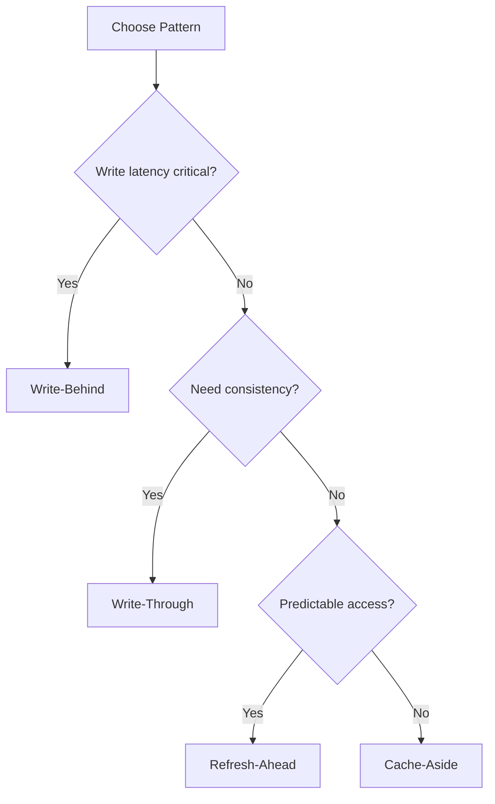

| Pattern | Write Latency | Consistency | Complexity |
|---------|---------------|-------------|------------|
| Cache-Aside | Normal | Eventually | Low |
| Read-Through | Normal | Eventually | Medium |
| Write-Through | Higher | Strong | Medium |
| Write-Behind | Very Low | Eventually | High |
| Refresh-Ahead | Normal | Eventually | High |

---

## Cache Eviction Policies

### Common Policies

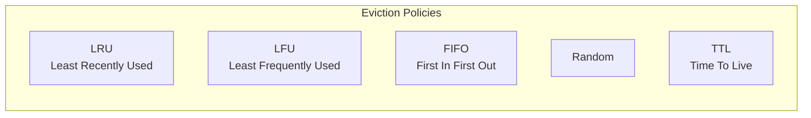

| Policy | Description | Use Case |
|--------|-------------|----------|
| **LRU** | Evict least recently accessed | General purpose, recency matters |
| **LFU** | Evict least frequently accessed | Stable popularity patterns |
| **FIFO** | Evict oldest items first | Simple, time-based |
| **Random** | Random eviction | When access is random |
| **TTL** | Expire after time limit | Data freshness requirements |

### LRU Implementation

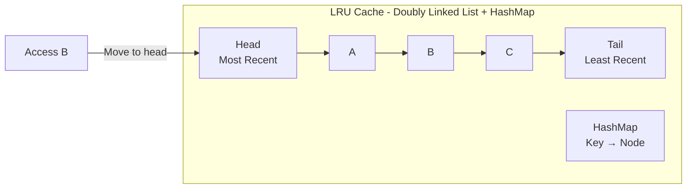

```python
from collections import OrderedDict

class LRUCache:
    def __init__(self, capacity):
        self.cache = OrderedDict()
        self.capacity = capacity

    def get(self, key):
        if key not in self.cache:
            return None
        # Move to end (most recent)
        self.cache.move_to_end(key)
        return self.cache[key]

    def put(self, key, value):
        if key in self.cache:
            self.cache.move_to_end(key)
        self.cache[key] = value
        if len(self.cache) > self.capacity:
            # Remove oldest
            self.cache.popitem(last=False)
```

---

## Cache Invalidation

> "There are only two hard things in Computer Science: cache invalidation and naming things." - Phil Karlton

### Invalidation Strategies

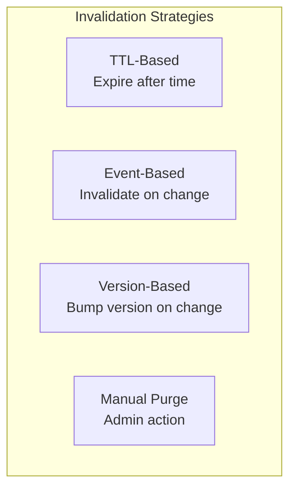

### 1. TTL-Based Invalidation

```python
# Set with expiration
cache.set("user:123", user_data, ttl=3600)  # 1 hour

# Data becomes stale but eventually consistent
```

**Pros:** Simple, automatic cleanup
**Cons:** Stale data during TTL window

### 2. Event-Based Invalidation

```python
def update_user(user_id, data):
    # Update database
    db.update_user(user_id, data)

    # Invalidate cache
    cache.delete(f"user:{user_id}")

    # Publish event for distributed systems
    event_bus.publish("user.updated", {"user_id": user_id})
```

**Pros:** Immediate consistency
**Cons:** Need to track all cache keys

### 3. Version-Based Invalidation

```python
# Store with version
cache.set(f"user:{user_id}:v{version}", data)

# On update, increment version
new_version = db.increment_user_version(user_id)
cache.set(f"user:{user_id}:v{new_version}", new_data)

# Old version naturally unused and expires
```

**Pros:** No delete needed, immutable entries
**Cons:** More storage, version management

### 4. Cache Tags

Group related cache entries for bulk invalidation.

```python
# Store with tags
cache.set("product:123", product_data, tags=["products", "category:electronics"])
cache.set("product:456", product_data, tags=["products", "category:electronics"])

# Invalidate all products
cache.invalidate_by_tag("products")

# Invalidate specific category
cache.invalidate_by_tag("category:electronics")
```

---

## Cache Stampede Prevention

### The Problem

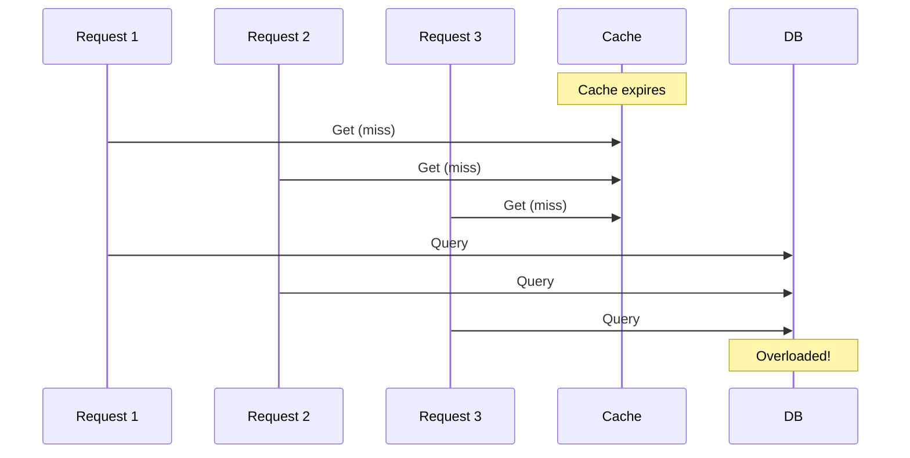

### Solutions

#### 1. Locking

```python
def get_with_lock(key):
    value = cache.get(key)
    if value:
        return value

    lock_key = f"lock:{key}"
    if cache.set(lock_key, "1", nx=True, ex=10):  # Acquire lock
        try:
            value = db.query(...)
            cache.set(key, value, ex=3600)
        finally:
            cache.delete(lock_key)
    else:
        # Wait and retry
        time.sleep(0.1)
        return get_with_lock(key)

    return value
```

#### 2. Probabilistic Early Expiration

```python
def get_with_early_recompute(key, ttl, beta=1):
    value, expiry = cache.get_with_expiry(key)

    if value is None:
        return recompute_and_cache(key, ttl)

    # Probabilistically recompute before expiry
    time_remaining = expiry - time.now()
    random_threshold = time_remaining - beta * random.random()

    if random_threshold <= 0:
        # Background recompute
        background_task(recompute_and_cache, key, ttl)

    return value
```

#### 3. Request Coalescing

```python
from threading import Lock
from collections import defaultdict

pending_requests = defaultdict(list)
locks = defaultdict(Lock)

def get_coalesced(key):
    value = cache.get(key)
    if value:
        return value

    with locks[key]:
        # Check again after acquiring lock
        value = cache.get(key)
        if value:
            return value

        # Only one request fetches from DB
        value = db.query(...)
        cache.set(key, value)
        return value
```

---

## Distributed Caching

### Redis Cluster

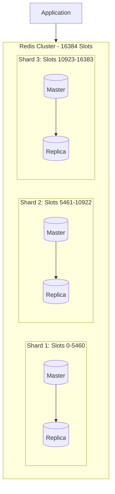

**Key Assignment:**
```
slot = CRC16(key) % 16384
```

### Cache Consistency in Distributed Systems

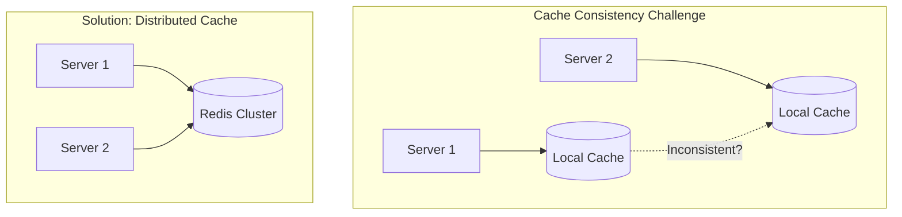

---

## CDN Caching

### How CDN Caching Works

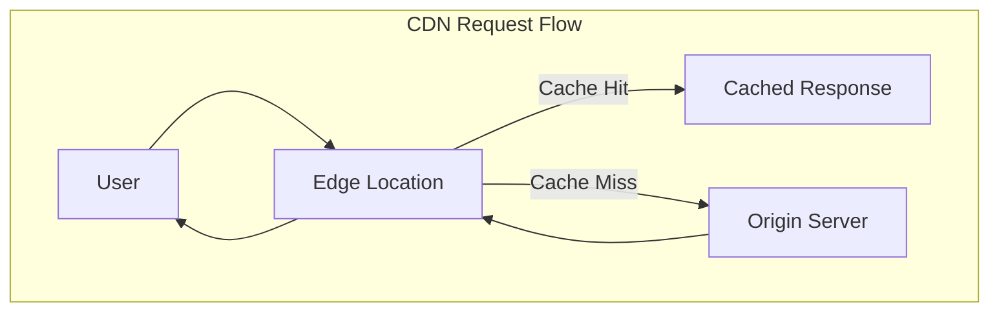

### Cache-Control Headers

```http
# Cache for 1 year (static assets)
Cache-Control: public, max-age=31536000, immutable

# Cache for 5 minutes, revalidate when stale
Cache-Control: public, max-age=300, stale-while-revalidate=60

# Private, no shared caching
Cache-Control: private, max-age=0

# No caching
Cache-Control: no-store
```

### CDN Invalidation

| Method | Speed | Use Case |
|--------|-------|----------|
| **TTL Expiration** | Slow | Normal content updates |
| **Purge by URL** | Fast | Specific content changes |
| **Purge by Tag** | Fast | Bulk invalidation |
| **Version in URL** | Instant | Static assets with hashes |

```
# Versioned URLs - instant invalidation
/static/app.abc123.js    → New deploy: /static/app.def456.js
/images/logo.v2.png      → Update: /images/logo.v3.png
```

---

## Caching Best Practices

### What to Cache

| Good Candidates | Bad Candidates |
|-----------------|----------------|
| Database query results | Frequently changing data |
| Computed/aggregated data | User-specific sensitive data |
| API responses | One-time reads |
| Static assets | Very large objects |
| Session data | Data requiring strong consistency |

### Cache Key Design

```python
# Bad: Not specific enough
cache.get("user")

# Bad: Too specific
cache.get("user_john_smith_email_john@example.com_age_30")

# Good: Clear namespace and identifier
cache.get("user:123")
cache.get("user:123:profile")
cache.get("product:456:price:usd")

# Good: Include version or timestamp
cache.get("config:v2.1")
cache.get("feed:user:123:2024-01-15")
```

### TTL Guidelines

| Data Type | Suggested TTL | Reason |
|-----------|---------------|--------|
| Static config | 1 hour - 1 day | Rarely changes |
| User profile | 5-15 minutes | Moderate changes |
| Feed/timeline | 1-5 minutes | Frequent updates |
| Session data | 30 minutes | Security |
| Real-time data | 1-30 seconds | Freshness critical |

---

## Use Case: E-commerce Product Cache

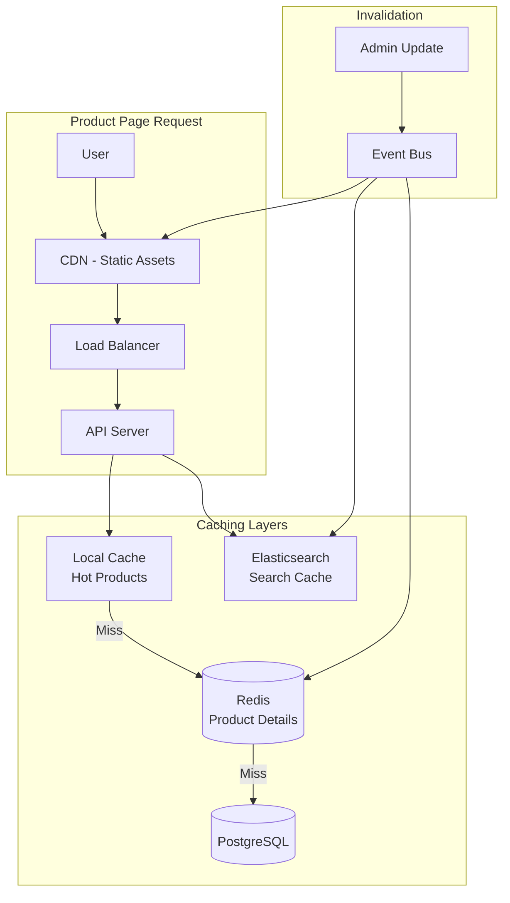

**Strategy:**
1. **CDN**: Static assets (images, CSS, JS) - 1 year TTL
2. **Local Cache**: Top 1000 products - 5 minute TTL
3. **Redis**: All products - 1 hour TTL, event-based invalidation
4. **Elasticsearch**: Search results - 5 minute TTL

**Invalidation:**
- Product update → Publish event
- Event triggers: Redis delete, CDN purge, ES reindex

---

## Redis vs Memcached

| Feature | Redis | Memcached |
|---------|-------|-----------|
| **Data Structures** | Rich (strings, lists, sets, sorted sets, hashes) | Strings only |
| **Persistence** | RDB, AOF | None |
| **Replication** | Built-in | External |
| **Clustering** | Redis Cluster | Client-side |
| **Pub/Sub** | Yes | No |
| **Lua Scripting** | Yes | No |
| **Memory Efficiency** | Lower | Higher |
| **Multi-threaded** | Single (6.0+ has I/O threads) | Yes |

**Choose Redis when:**
- Need data structures beyond strings
- Need persistence
- Need pub/sub
- Need atomic operations (Lua scripts)

**Choose Memcached when:**
- Simple key-value caching
- Maximum memory efficiency
- Multi-threaded performance

---

## Summary

| Concept | Key Takeaway |
|---------|--------------|
| **Cache-Aside** | Simple, flexible, good default choice |
| **Write-Through** | Strong consistency, higher write latency |
| **Write-Behind** | Fast writes, risk of data loss |
| **LRU Eviction** | Best general-purpose eviction policy |
| **TTL** | Simple invalidation, eventual consistency |
| **Event-Based** | Immediate invalidation, more complex |
| **Cache Stampede** | Use locking or probabilistic early refresh |
| **CDN** | Cache static content at edge |

---

**Previous**: [← Data Storage Strategies](06-data-storage-strategies.md) | **Next**: [Messaging & Async Patterns →](08-messaging-async-patterns.md)
