# Messaging and Async Patterns

Asynchronous communication is fundamental to building scalable, resilient distributed systems. This guide covers message queues, event-driven architecture, and common async patterns.

## Why Async Communication?

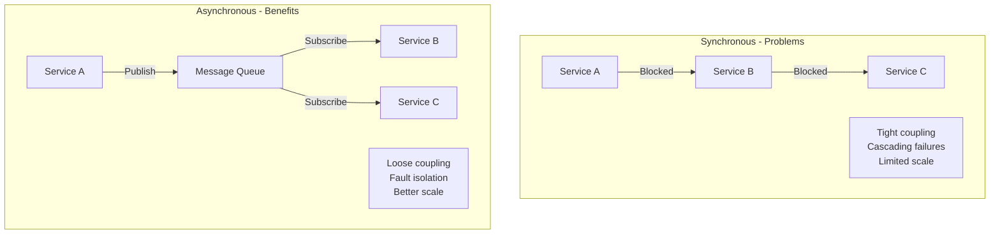

| Aspect | Synchronous | Asynchronous |
|--------|-------------|--------------|
| **Coupling** | Tight | Loose |
| **Response Time** | Wait for completion | Immediate acknowledgment |
| **Scaling** | Both must scale together | Independent scaling |
| **Failure Handling** | Cascading failures | Isolated failures |
| **Load Handling** | Overflow = failure | Queue absorbs spikes |

---

## Message Queue Fundamentals

### Core Concepts

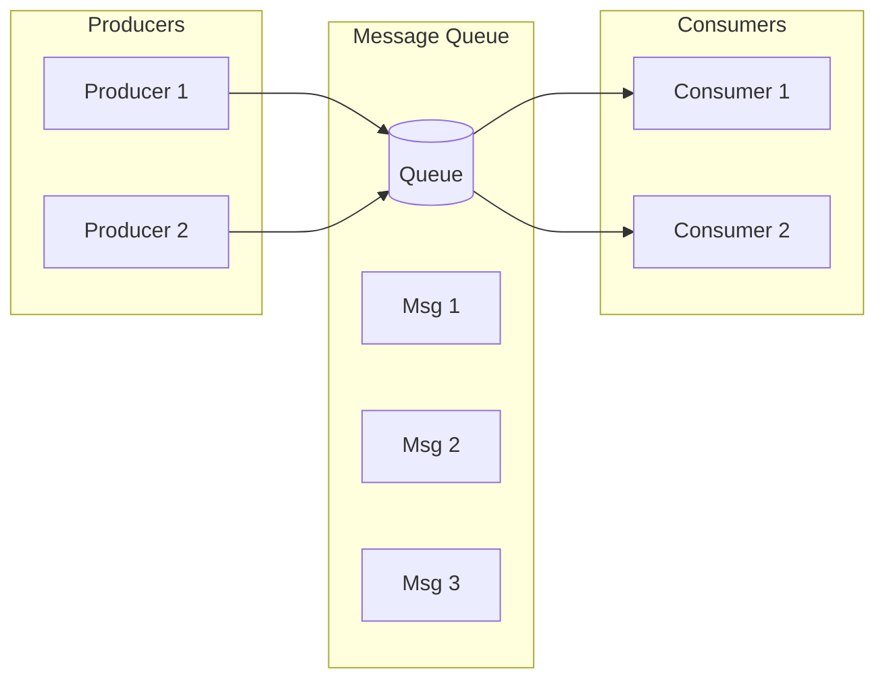

| Term | Definition |
|------|------------|
| **Producer** | Sends messages to queue |
| **Consumer** | Receives messages from queue |
| **Message** | Data packet with payload and metadata |
| **Topic** | Named channel for messages |
| **Partition** | Ordered subset of topic (for parallelism) |
| **Offset** | Position of message in partition |
| **Consumer Group** | Set of consumers sharing work |

### Queue vs Topic (Pub/Sub)

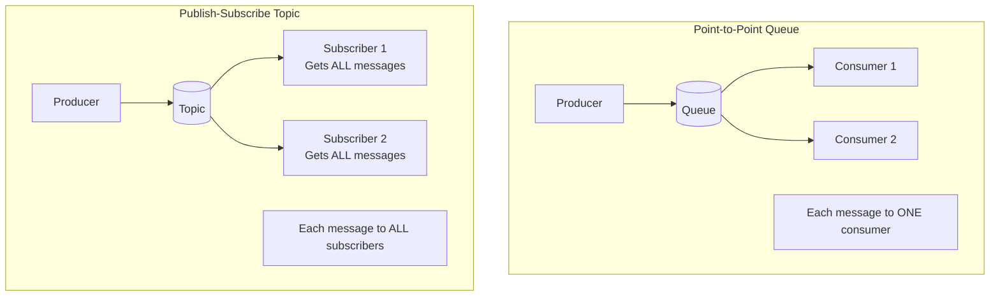

| Model | Behavior | Use Case |
|-------|----------|----------|
| **Queue** | One consumer per message | Task distribution, work queues |
| **Topic** | All subscribers get all messages | Event broadcasting, notifications |

---

## Delivery Guarantees

### The Three Guarantees

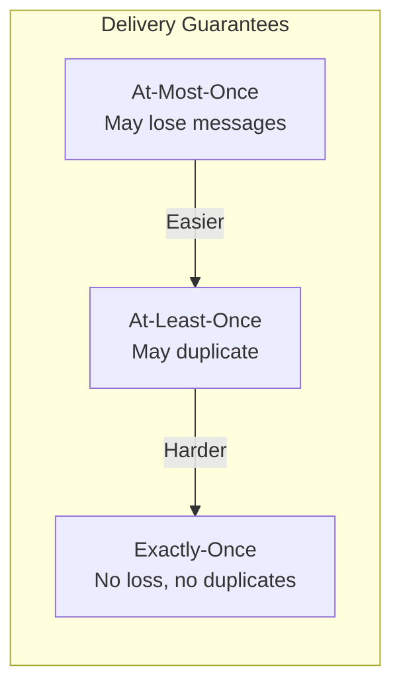

| Guarantee | Behavior | Trade-off | Use Case |
|-----------|----------|-----------|----------|
| **At-most-once** | Fire and forget | Fast, may lose | Metrics, logs |
| **At-least-once** | Retry until ACK | Safe, may duplicate | Most systems |
| **Exactly-once** | Deduplicate + ACK | Slow, complex | Financial transactions |

### Achieving At-Least-Once

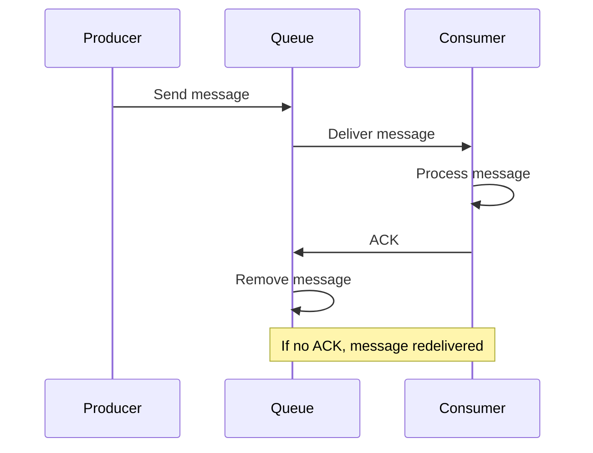

### Achieving Exactly-Once

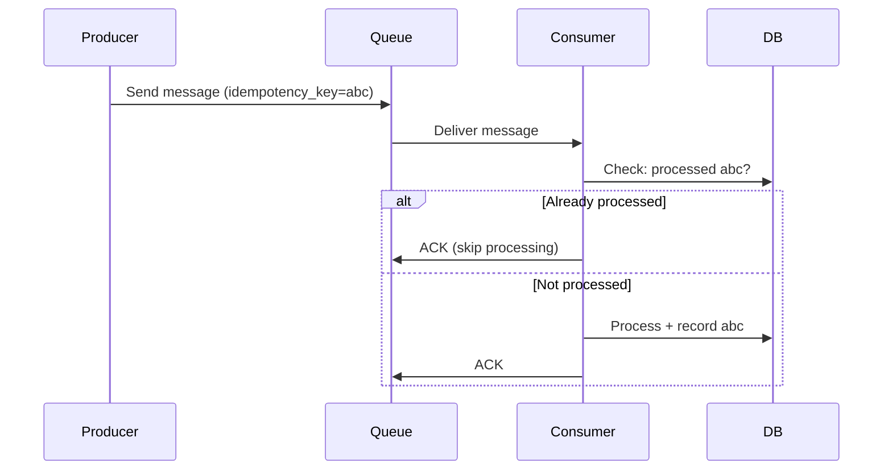

**Key Technique: Idempotent Consumers**
```python
def process_message(message):
    idempotency_key = message.headers['idempotency_key']

    # Check if already processed
    if db.exists(f"processed:{idempotency_key}"):
        return  # Already done

    # Process the message
    result = do_business_logic(message.body)

    # Record completion (atomically with processing if possible)
    db.set(f"processed:{idempotency_key}", result)
```

---

## Message Queue Comparison

### Kafka

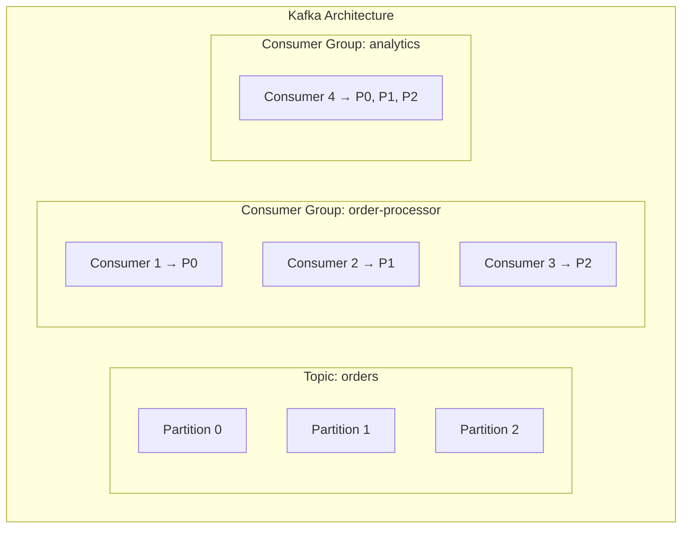

**Key Features:**
- Distributed commit log
- High throughput (millions/sec)
- Message retention (replay capability)
- Partitions for parallelism
- Consumer groups for scaling

**Best For:**
- Event streaming
- Log aggregation
- High-throughput pipelines
- Event sourcing

### RabbitMQ

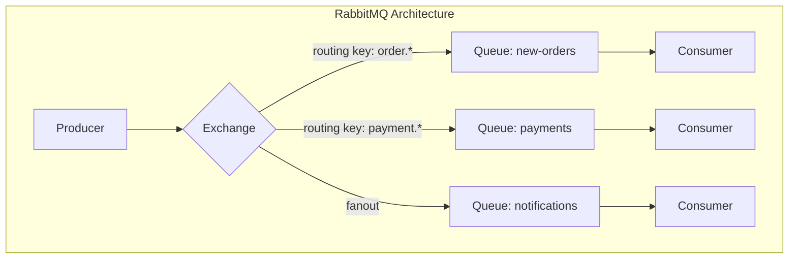

**Exchange Types:**
| Type | Routing |
|------|---------|
| **Direct** | Exact routing key match |
| **Topic** | Pattern matching (*.order.#) |
| **Fanout** | Broadcast to all queues |
| **Headers** | Match on headers |

**Best For:**
- Complex routing
- Traditional message queuing
- Request-reply patterns
- Smaller scale

### AWS SQS

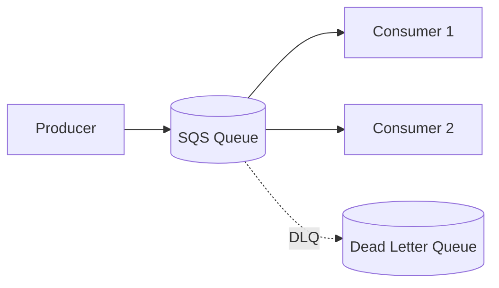

**Key Features:**
- Fully managed
- Automatic scaling
- No infrastructure to manage
- Standard and FIFO queues

**Best For:**
- AWS-native applications
- Serverless (Lambda integration)
- Simple queue needs

### Comparison Table

| Feature | Kafka | RabbitMQ | SQS |
|---------|-------|----------|-----|
| **Throughput** | Very High | Medium | Medium |
| **Latency** | Low | Very Low | Medium |
| **Ordering** | Per partition | Per queue | FIFO only |
| **Retention** | Configurable (days) | Until consumed | 14 days max |
| **Replay** | Yes | No | No |
| **Complexity** | High | Medium | Low |
| **Managed Option** | Confluent, MSK | CloudAMQP | Native AWS |

---

## Event-Driven Architecture

### Event Types

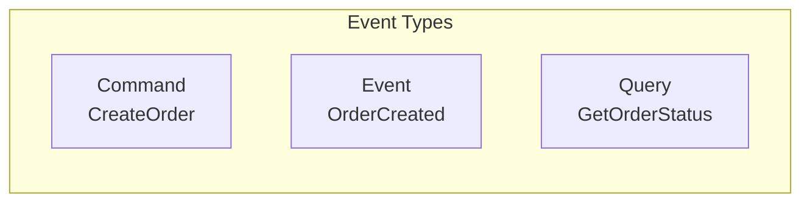

| Type | Purpose | Naming | Example |
|------|---------|--------|---------|
| **Command** | Request action | Imperative verb | CreateOrder, SendEmail |
| **Event** | Notify what happened | Past tense | OrderCreated, PaymentReceived |
| **Query** | Request information | Question-like | GetOrderStatus |

### Event Structure

```json
{
  "event_id": "evt_abc123",
  "event_type": "order.created",
  "timestamp": "2024-01-15T10:30:00Z",
  "source": "order-service",
  "correlation_id": "req_xyz789",
  "data": {
    "order_id": "ord_456",
    "customer_id": "cust_789",
    "total": 99.99,
    "items": [...]
  },
  "metadata": {
    "version": "1.0",
    "trace_id": "trace_abc"
  }
}
```

### Choreography vs Orchestration

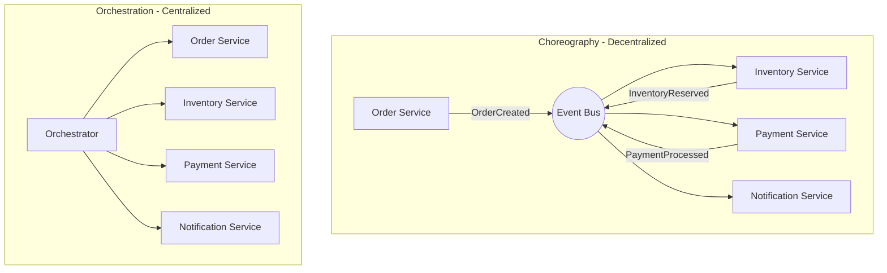

| Aspect | Choreography | Orchestration |
|--------|--------------|---------------|
| **Control** | Decentralized | Central orchestrator |
| **Coupling** | Very loose | Tighter to orchestrator |
| **Visibility** | Harder to trace | Clear workflow |
| **Failure Handling** | Distributed | Centralized |
| **Complexity Growth** | Exponential | Linear |

---

## Event Sourcing

Store events as the source of truth, derive state from events.

### Traditional vs Event Sourcing

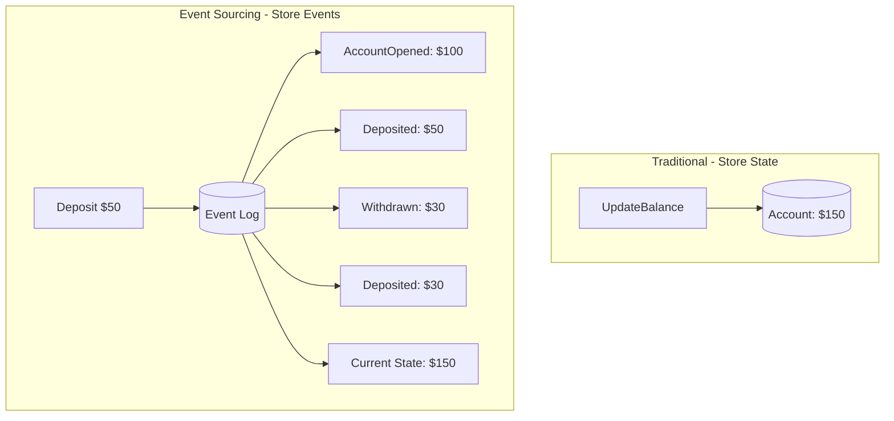

**Benefits:**
- Complete audit trail
- Can reconstruct any past state
- Natural fit for event-driven systems
- Supports temporal queries

**Challenges:**
- More complex queries
- Event schema evolution
- Eventual consistency

### CQRS (Command Query Responsibility Segregation)

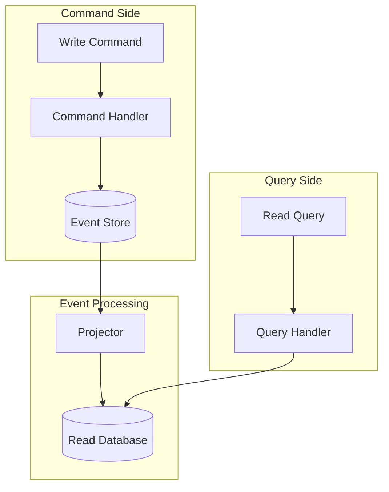

**When to Use:**
- Different read/write patterns
- Complex domain logic
- Event sourcing systems
- Different scaling needs for reads/writes

---

## Saga Pattern

Manage distributed transactions through a sequence of local transactions.

### Choreography-Based Saga

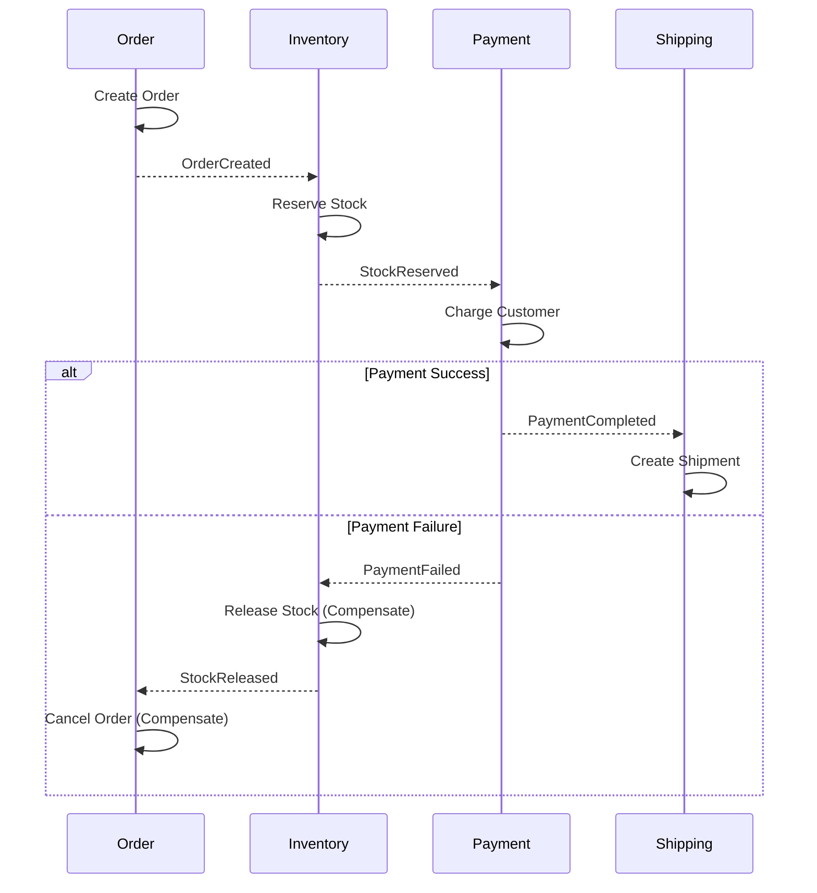

### Orchestration-Based Saga

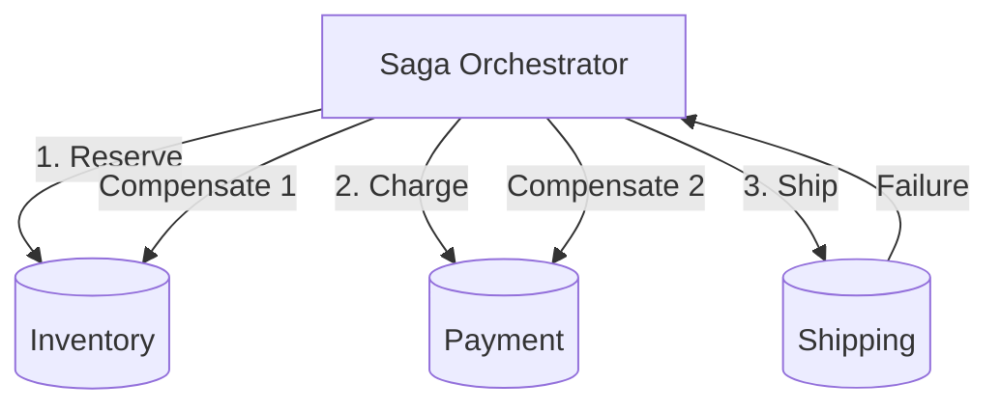

### Compensating Transactions

| Action | Compensation |
|--------|--------------|
| Reserve inventory | Release inventory |
| Create order | Cancel order |
| Charge payment | Refund payment |
| Create shipment | Cancel shipment |

---

## Dead Letter Queues

Handle messages that can't be processed.

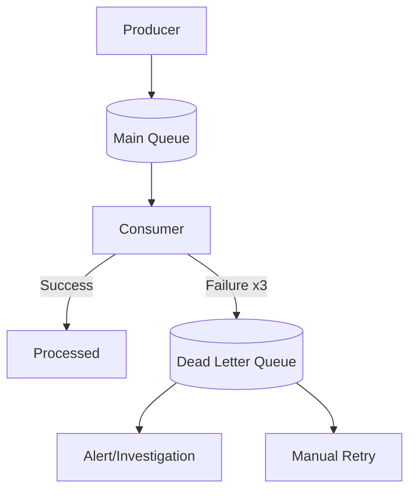

**DLQ Best Practices:**
1. Set max retry attempts before DLQ
2. Include original message + error details
3. Monitor DLQ depth
4. Have process for investigation
5. Implement replay mechanism

```python
def process_with_dlq(message):
    try:
        process_message(message)
        return True
    except TransientError:
        # Retry later
        raise
    except PermanentError as e:
        # Send to DLQ
        dlq.send({
            "original_message": message,
            "error": str(e),
            "failed_at": datetime.now(),
            "retry_count": message.retry_count
        })
        return True  # ACK to remove from main queue
```

---

## Backpressure Handling

Prevent overwhelmed consumers from crashing.

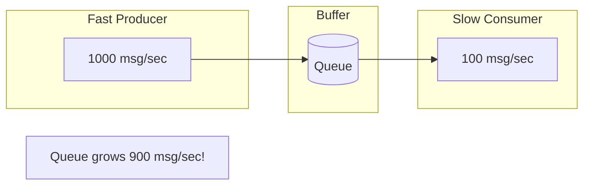

### Backpressure Strategies

| Strategy | How It Works | Trade-off |
|----------|--------------|-----------|
| **Drop Messages** | Discard when queue full | Data loss |
| **Block Producer** | Producer waits | Cascading delays |
| **Buffering** | Queue absorbs spike | Memory/disk limits |
| **Rate Limiting** | Limit producer rate | Slower ingestion |
| **Scaling Consumers** | Add more consumers | Cost, delay |
| **Sampling** | Process subset | Incomplete data |

### Implementation Example

```python
# Rate limiting producer
from ratelimit import limits, sleep_and_retry

@sleep_and_retry
@limits(calls=100, period=1)  # 100 msg/sec
def produce_message(message):
    queue.send(message)

# Scaling consumers (Kubernetes HPA example)
# When queue depth > 1000, scale up
apiVersion: autoscaling/v2
kind: HorizontalPodAutoscaler
spec:
  metrics:
  - type: External
    external:
      metric:
        name: queue_messages_ready
      target:
        type: AverageValue
        averageValue: 1000
```

---

## Message Ordering

### Partition-Based Ordering (Kafka)

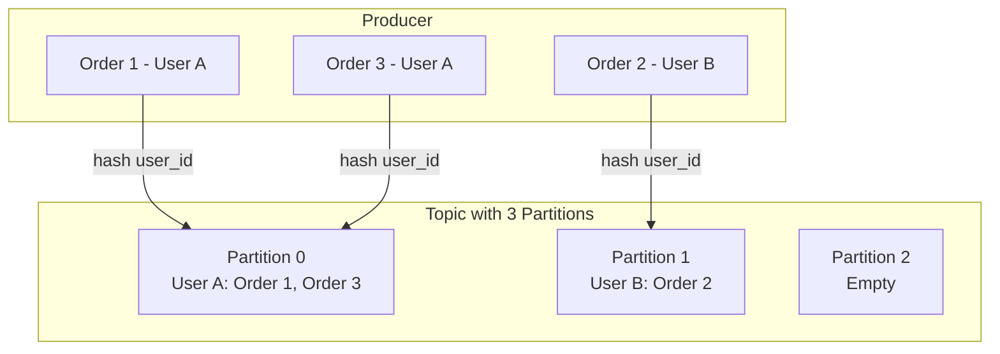

**Ordering Rule:**
- Order guaranteed **within a partition**
- No ordering across partitions
- Use partition key for related messages

```python
# Kafka producer with ordering
producer.send(
    topic='orders',
    key=user_id.encode(),  # Same user → same partition
    value=order_data
)
```

### FIFO Queues (SQS FIFO)

```python
# SQS FIFO with message group
sqs.send_message(
    QueueUrl='https://sqs.../MyQueue.fifo',
    MessageBody=json.dumps(order),
    MessageGroupId=user_id,  # Orders for same user in order
    MessageDeduplicationId=order_id
)
```

---

## Real-World Use Case: Order Processing

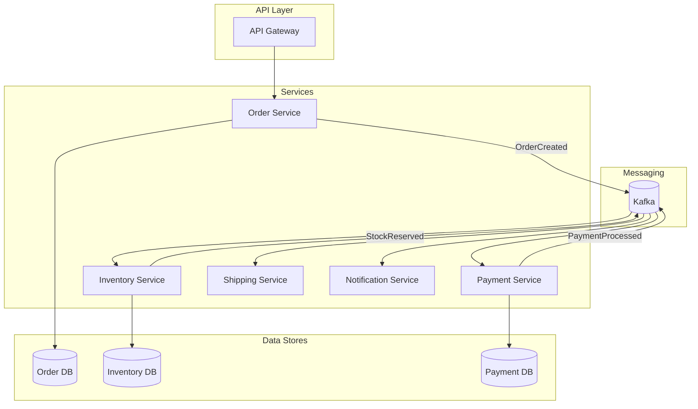

**Event Flow:**
1. `OrderCreated` → Inventory reserves stock, Notification sends confirmation
2. `StockReserved` → Payment processes charge
3. `PaymentProcessed` → Shipping creates shipment
4. `ShipmentCreated` → Notification sends tracking

**Error Handling:**
- `PaymentFailed` → Inventory releases stock, Order marked failed
- `ShipmentFailed` → Retry or manual intervention
- All failures → Logged to DLQ for investigation

---

## Best Practices

### Message Design

```json
// Good: Self-contained, versioned
{
  "event_type": "order.created.v2",
  "event_id": "evt_unique_123",
  "timestamp": "2024-01-15T10:30:00Z",
  "correlation_id": "req_xyz",
  "data": {
    "order_id": "ord_456",
    // Include necessary data, not just IDs
    "customer_email": "john@example.com",
    "items": [...]
  }
}

// Bad: Missing metadata, requires lookups
{
  "order_id": "ord_456"
}
```

### Consumer Best Practices

1. **Make consumers idempotent**
2. **Process in batches when possible**
3. **Implement proper error handling**
4. **Use dead letter queues**
5. **Monitor consumer lag**
6. **Handle poison messages**

### Producer Best Practices

1. **Include correlation IDs for tracing**
2. **Use proper serialization (Avro, Protobuf)**
3. **Handle send failures gracefully**
4. **Consider message size limits**
5. **Version your events**

---

## Summary

| Pattern | Use Case | Complexity |
|---------|----------|------------|
| **Simple Queue** | Task distribution | Low |
| **Pub/Sub** | Event broadcasting | Low |
| **Event Sourcing** | Audit trail, temporal queries | High |
| **CQRS** | Separate read/write models | Medium |
| **Saga** | Distributed transactions | High |
| **DLQ** | Error handling | Low |

---

**Previous**: [← Caching Strategies](07-caching-strategies.md) | **Next**: [API Design & Gateway →](09-api-design-gateway.md)
