# API Design and Gateway Patterns

Well-designed APIs are the foundation of scalable systems. This guide covers API design principles, communication protocols, API gateway patterns, and rate limiting strategies.

## API Design Principles

### RESTful Design

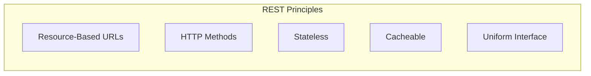

### Resource Naming Conventions

| Good | Bad | Why |
|------|-----|-----|
| `/users` | `/getUsers` | Use nouns, not verbs |
| `/users/123` | `/user?id=123` | Use path for resources |
| `/users/123/orders` | `/getUserOrders` | Hierarchical relationships |
| `/orders?status=pending` | `/pendingOrders` | Use query params for filtering |

### HTTP Methods

| Method | Purpose | Idempotent | Safe |
|--------|---------|------------|------|
| **GET** | Read resource | Yes | Yes |
| **POST** | Create resource | No | No |
| **PUT** | Replace resource | Yes | No |
| **PATCH** | Partial update | No* | No |
| **DELETE** | Remove resource | Yes | No |

```http
# Create user
POST /users
Content-Type: application/json
{"name": "John", "email": "john@example.com"}

# Get user
GET /users/123

# Update user (full replacement)
PUT /users/123
{"name": "John Doe", "email": "john.doe@example.com"}

# Partial update
PATCH /users/123
{"email": "new.email@example.com"}

# Delete user
DELETE /users/123
```

### Status Codes

| Range | Category | Common Codes |
|-------|----------|--------------|
| **2xx** | Success | 200 OK, 201 Created, 204 No Content |
| **3xx** | Redirection | 301 Moved, 304 Not Modified |
| **4xx** | Client Error | 400 Bad Request, 401 Unauthorized, 403 Forbidden, 404 Not Found, 429 Too Many Requests |
| **5xx** | Server Error | 500 Internal Error, 502 Bad Gateway, 503 Service Unavailable |

### Response Structure

```json
// Success response
{
  "data": {
    "id": "123",
    "name": "John",
    "email": "john@example.com"
  },
  "meta": {
    "request_id": "req_abc123",
    "timestamp": "2024-01-15T10:30:00Z"
  }
}

// Error response
{
  "error": {
    "code": "VALIDATION_ERROR",
    "message": "Invalid email format",
    "details": [
      {
        "field": "email",
        "message": "Must be a valid email address"
      }
    ]
  },
  "meta": {
    "request_id": "req_abc123"
  }
}
```

---

## API Communication Styles

### REST vs GraphQL vs gRPC

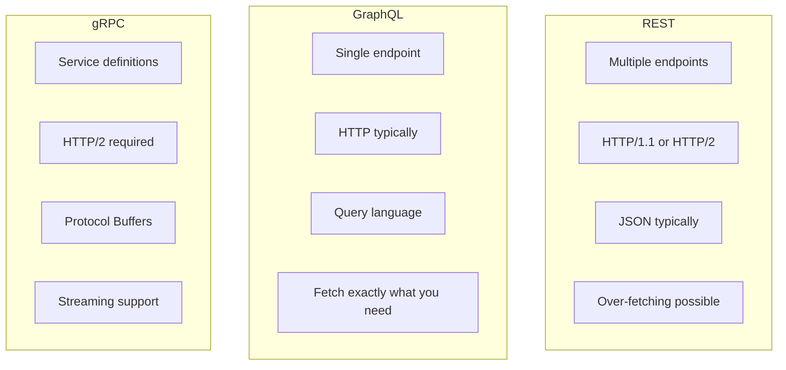

### Comparison

| Aspect | REST | GraphQL | gRPC |
|--------|------|---------|------|
| **Protocol** | HTTP | HTTP | HTTP/2 |
| **Format** | JSON, XML | JSON | Protocol Buffers |
| **Type System** | OpenAPI (optional) | Strong | Strong |
| **Endpoints** | Multiple | Single | Service methods |
| **Caching** | HTTP caching | Custom | Custom |
| **Streaming** | Limited | Subscriptions | Bidirectional |
| **Best For** | Public APIs, web | Mobile, complex queries | Microservices, performance |

### REST

```http
# Get user with orders - requires 2 requests
GET /users/123
GET /users/123/orders
```

**Pros:**
- Simple, widely understood
- HTTP caching
- Stateless
- Browser-friendly

**Cons:**
- Over-fetching / under-fetching
- Multiple round trips
- No built-in type safety

### GraphQL

```graphql
# Single request, get exactly what you need
query {
  user(id: "123") {
    name
    email
    orders(last: 5) {
      id
      total
      status
    }
  }
}
```

**Pros:**
- Flexible queries
- No over-fetching
- Strong typing
- Single endpoint

**Cons:**
- Complex caching
- N+1 query problems
- Learning curve
- Security (complex queries)

### gRPC

```protobuf
// user.proto
service UserService {
  rpc GetUser(GetUserRequest) returns (User);
  rpc StreamUpdates(StreamRequest) returns (stream UserUpdate);
}

message User {
  string id = 1;
  string name = 2;
  string email = 3;
}
```

**Pros:**
- High performance (binary, HTTP/2)
- Strong typing
- Code generation
- Bidirectional streaming

**Cons:**
- Not browser-friendly
- Less human-readable
- HTTP/2 required
- More complex setup

---

## Pagination

### Offset-Based Pagination

```http
GET /users?limit=20&offset=40

Response:
{
  "data": [...],
  "pagination": {
    "total": 1000,
    "limit": 20,
    "offset": 40,
    "has_more": true
  }
}
```

**Pros:** Simple, random access
**Cons:** Inconsistent with updates, slow for large offsets

### Cursor-Based Pagination

```http
GET /users?limit=20&cursor=eyJpZCI6MTIzfQ

Response:
{
  "data": [...],
  "pagination": {
    "next_cursor": "eyJpZCI6MTQzfQ",
    "has_more": true
  }
}
```

**Pros:** Consistent, efficient for large datasets
**Cons:** No random access, more complex

### Comparison

| Aspect | Offset | Cursor |
|--------|--------|--------|
| **Performance** | Degrades with offset | Consistent |
| **Consistency** | May miss/duplicate | Stable |
| **Random Access** | Yes | No |
| **Implementation** | Simple | More complex |
| **Use Case** | Small datasets, random access | Large datasets, feeds |

---

## Versioning

### URL Versioning

```http
GET /v1/users/123
GET /v2/users/123
```

**Pros:** Clear, easy to implement
**Cons:** URL changes, breaks caching

### Header Versioning

```http
GET /users/123
Accept: application/vnd.api+json; version=2
```

**Pros:** Clean URLs
**Cons:** Harder to test, less visible

### Query Parameter Versioning

```http
GET /users/123?version=2
```

**Pros:** Optional, backwards compatible
**Cons:** Can be forgotten

### Recommendation

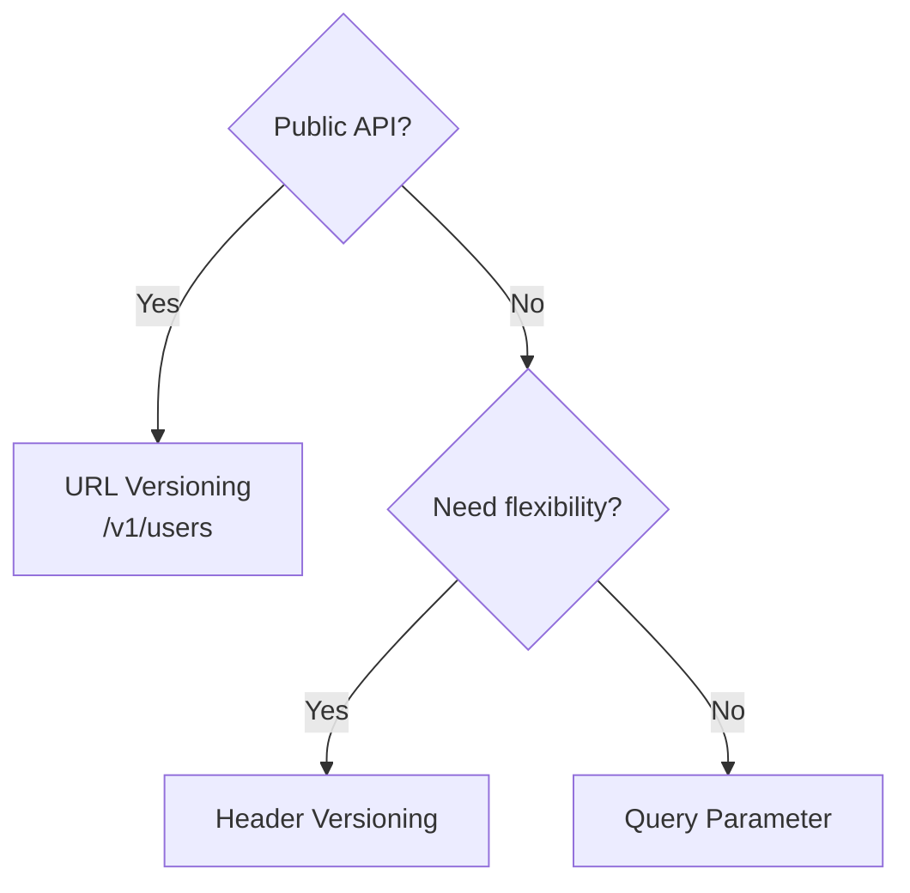

---

## API Gateway

### Gateway Responsibilities

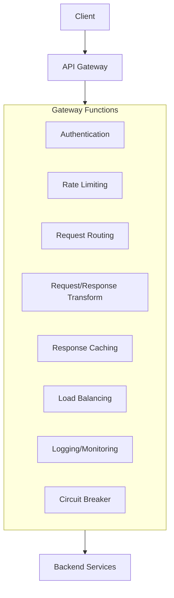

| Function | Description |
|----------|-------------|
| **Authentication** | Validate tokens, API keys |
| **Authorization** | Check permissions, scopes |
| **Rate Limiting** | Protect against abuse |
| **Request Routing** | Route to appropriate service |
| **Load Balancing** | Distribute traffic |
| **Caching** | Cache responses |
| **Transformation** | Modify requests/responses |
| **Monitoring** | Logs, metrics, traces |

### Gateway Patterns

#### 1. Single Gateway

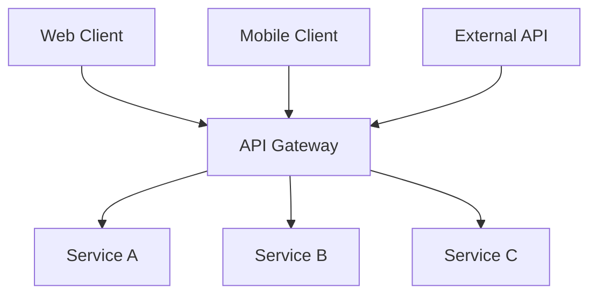

**Pros:** Simple, centralized
**Cons:** Single point of failure, one-size-fits-all

#### 2. Backend for Frontend (BFF)

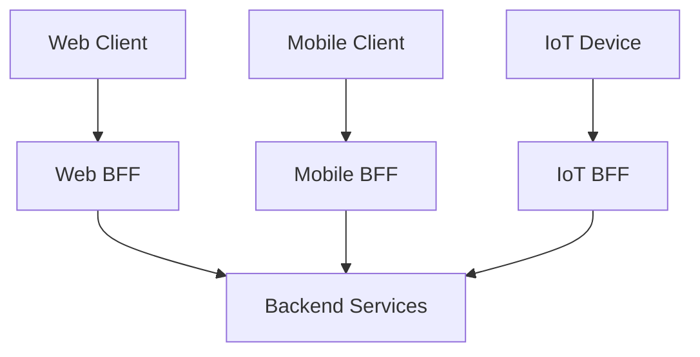

**Pros:** Optimized per client, independent evolution
**Cons:** More gateways to maintain

#### 3. Multi-Tier Gateway

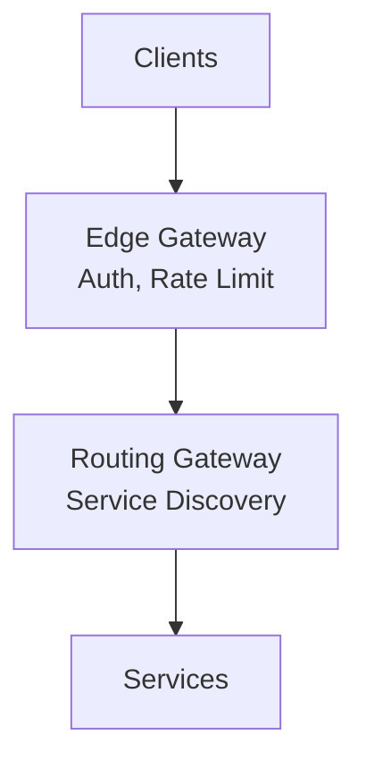

---

## Rate Limiting

### Why Rate Limit?

- Prevent abuse and DDoS
- Ensure fair usage
- Protect backend resources
- Meet SLA commitments

### Rate Limiting Algorithms

#### 1. Token Bucket

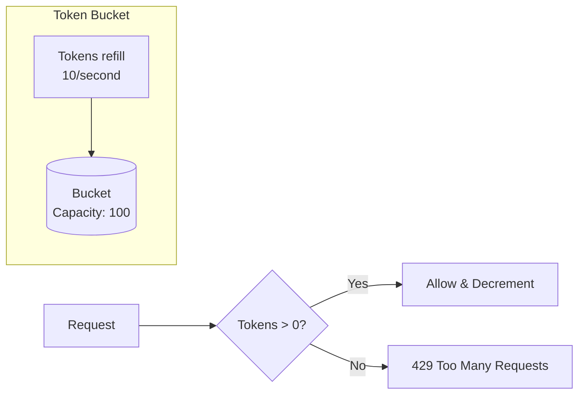

**How it works:**
- Bucket holds up to N tokens
- Tokens added at rate R per second
- Request consumes 1 token
- If no tokens, request rejected

**Pros:** Allows bursts, simple
**Cons:** Memory per client

#### 2. Leaky Bucket

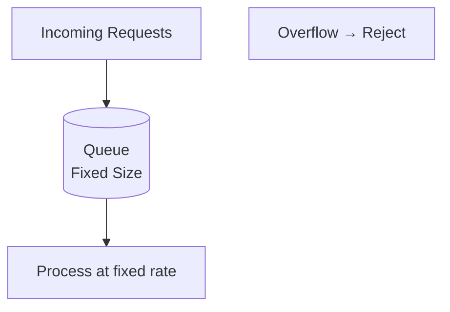

**How it works:**
- Requests queue in bucket
- Processed at fixed rate
- Overflow rejected

**Pros:** Smooth output rate
**Cons:** No bursts allowed

#### 3. Fixed Window

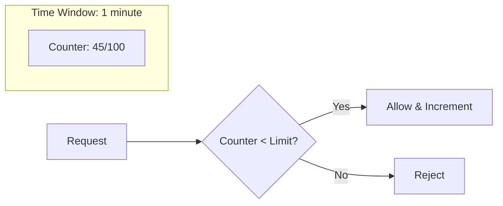

**Pros:** Simple, low memory
**Cons:** Boundary problem (2x burst at window edges)

#### 4. Sliding Window Log

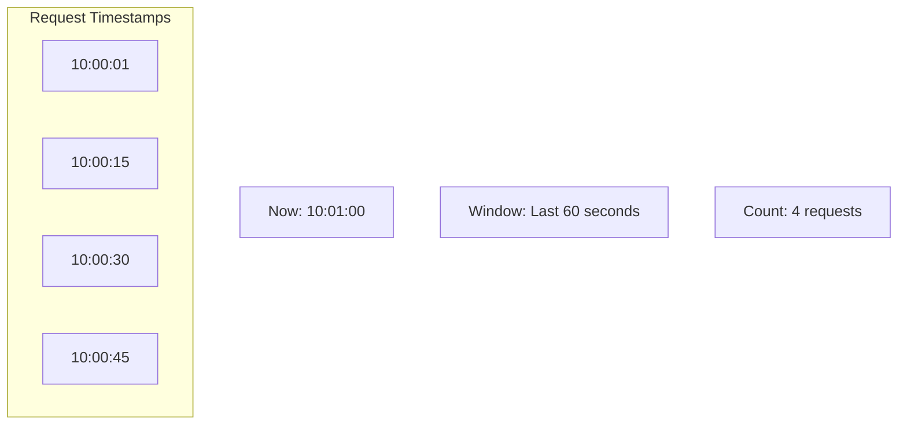

**How it works:**
- Store timestamp of each request
- Count requests in sliding window
- Remove expired timestamps

**Pros:** Accurate
**Cons:** Memory-intensive

#### 5. Sliding Window Counter

Hybrid of fixed window and sliding window.

```python
# Weighted count from current and previous window
current_window_count = 5
previous_window_count = 10
window_size = 60  # seconds
time_into_current_window = 20  # seconds

weight = (window_size - time_into_current_window) / window_size  # 0.67
weighted_count = current_window_count + (previous_window_count * weight)
# 5 + (10 * 0.67) = 11.7
```

**Pros:** Memory efficient, more accurate than fixed window
**Cons:** Approximate

### Algorithm Comparison

| Algorithm | Memory | Accuracy | Burst |
|-----------|--------|----------|-------|
| Token Bucket | O(1) | Exact | Allowed |
| Leaky Bucket | O(n) queue | Exact | Smoothed |
| Fixed Window | O(1) | Approximate | Edge burst |
| Sliding Log | O(n) | Exact | Accurate |
| Sliding Counter | O(1) | Approximate | Accurate |

### Distributed Rate Limiting

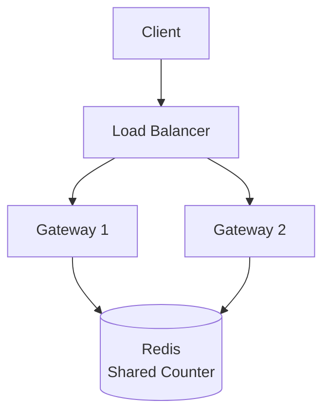

**Redis Lua Script for Atomic Rate Limiting:**
```lua
-- Token bucket in Redis
local key = KEYS[1]
local rate = tonumber(ARGV[1])
local capacity = tonumber(ARGV[2])
local now = tonumber(ARGV[3])
local requested = tonumber(ARGV[4])

local tokens = tonumber(redis.call('hget', key, 'tokens') or capacity)
local last_time = tonumber(redis.call('hget', key, 'timestamp') or now)

-- Add tokens based on time elapsed
local elapsed = now - last_time
local new_tokens = math.min(capacity, tokens + (elapsed * rate))

if new_tokens >= requested then
    new_tokens = new_tokens - requested
    redis.call('hset', key, 'tokens', new_tokens, 'timestamp', now)
    redis.call('expire', key, 60)
    return 1  -- Allowed
else
    return 0  -- Rejected
end
```

### Rate Limit Headers

```http
HTTP/1.1 200 OK
X-RateLimit-Limit: 100
X-RateLimit-Remaining: 45
X-RateLimit-Reset: 1640000000
Retry-After: 30  # When rate limited
```

---

## Authentication & Authorization

### Authentication Patterns

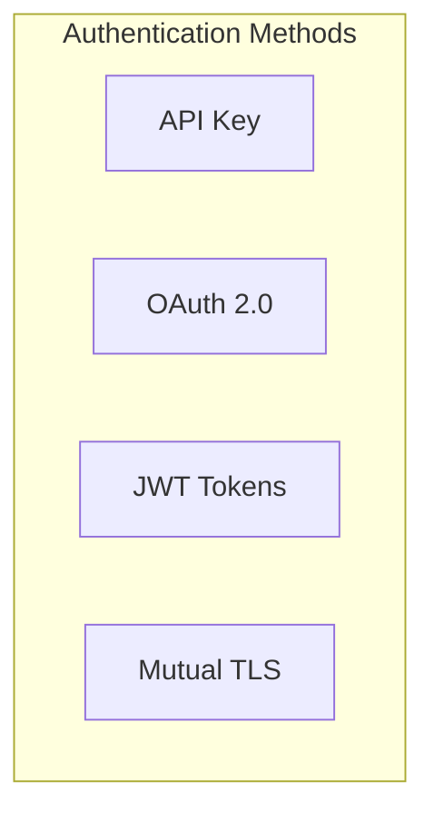

#### API Keys

```http
GET /api/users
X-API-Key: sk_live_abc123
```

**Use Case:** Simple service-to-service, public APIs

#### JWT (JSON Web Tokens)

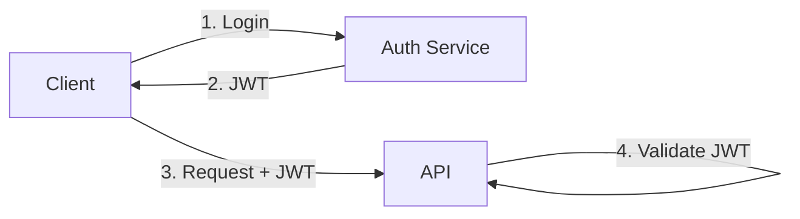

```javascript
// JWT Structure
{
  "header": {
    "alg": "RS256",
    "typ": "JWT"
  },
  "payload": {
    "sub": "user_123",
    "name": "John Doe",
    "role": "admin",
    "exp": 1640000000
  },
  "signature": "..."
}
```

#### OAuth 2.0

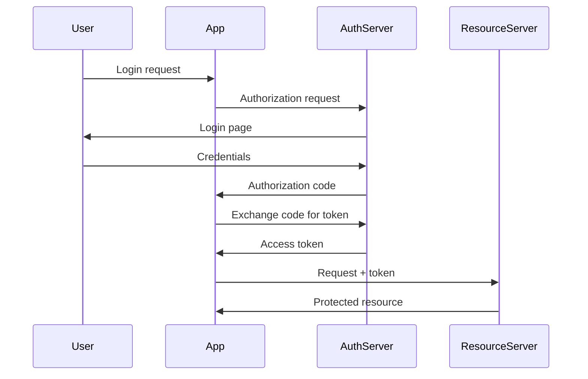

### Authorization

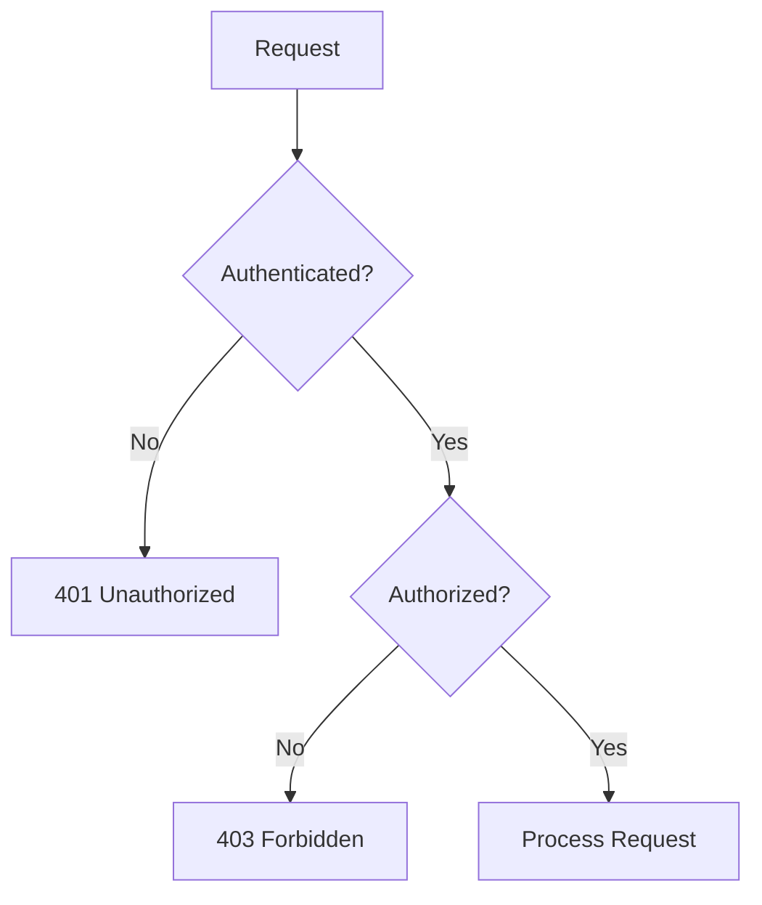

#### RBAC (Role-Based Access Control)

```yaml
roles:
  admin:
    - users:read
    - users:write
    - users:delete
  user:
    - users:read
    - profile:write
```

#### ABAC (Attribute-Based Access Control)

```json
{
  "rule": "resource.owner == user.id OR user.role == 'admin'",
  "effect": "allow"
}
```

---

## API Security Best Practices

### Security Checklist

| Category | Best Practice |
|----------|---------------|
| **Transport** | Use HTTPS only |
| **Authentication** | Use OAuth 2.0 or JWT |
| **Authorization** | Implement proper access control |
| **Input Validation** | Validate all inputs |
| **Rate Limiting** | Implement per-client limits |
| **Logging** | Log security events |
| **Headers** | Set security headers |

### Security Headers

```http
# Prevent XSS
Content-Security-Policy: default-src 'self'

# Prevent clickjacking
X-Frame-Options: DENY

# Prevent MIME sniffing
X-Content-Type-Options: nosniff

# HSTS
Strict-Transport-Security: max-age=31536000; includeSubDomains
```

### Input Validation

```python
from pydantic import BaseModel, EmailStr, Field

class CreateUserRequest(BaseModel):
    name: str = Field(..., min_length=1, max_length=100)
    email: EmailStr
    age: int = Field(..., ge=0, le=150)

    class Config:
        extra = 'forbid'  # Reject unknown fields
```

---

## API Documentation

### OpenAPI (Swagger)

```yaml
openapi: 3.0.0
info:
  title: User API
  version: 1.0.0
paths:
  /users:
    get:
      summary: List users
      parameters:
        - name: limit
          in: query
          schema:
            type: integer
            default: 20
      responses:
        '200':
          description: Success
          content:
            application/json:
              schema:
                type: array
                items:
                  $ref: '#/components/schemas/User'
components:
  schemas:
    User:
      type: object
      properties:
        id:
          type: string
        name:
          type: string
        email:
          type: string
```

---

## Summary

| Topic | Key Points |
|-------|------------|
| **REST** | Resource-based URLs, HTTP methods, status codes |
| **GraphQL** | Single endpoint, flexible queries, strong typing |
| **gRPC** | High performance, streaming, service-to-service |
| **Pagination** | Cursor-based for large datasets |
| **Versioning** | URL versioning for public APIs |
| **API Gateway** | Auth, rate limiting, routing |
| **Rate Limiting** | Token bucket or sliding window |
| **Auth** | OAuth 2.0 for user auth, JWT for stateless |

---

**Previous**: [← Messaging & Async Patterns](08-messaging-async-patterns.md) | **Next**: [Observability & Reliability →](10-observability-reliability.md)
