# Observability and Reliability

Building systems that you can understand and trust is crucial. This guide covers the three pillars of observability, SLOs/SLIs, fault tolerance patterns, and disaster recovery strategies.

## The Three Pillars of Observability

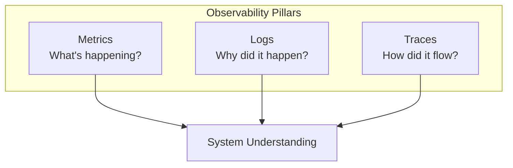

| Pillar | Purpose | Example |
|--------|---------|---------|
| **Metrics** | Quantify system behavior | Request rate: 1000/s, Error rate: 0.1% |
| **Logs** | Record discrete events | "User 123 login failed: invalid password" |
| **Traces** | Track request flow | Request → API → DB → Cache → Response |

---

## Metrics

### Types of Metrics

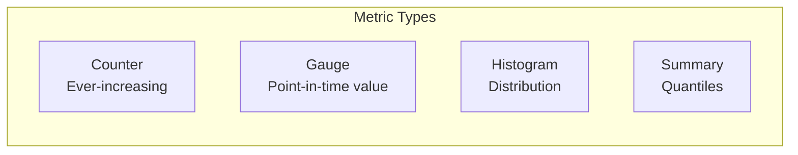

| Type | Description | Example |
|------|-------------|---------|
| **Counter** | Cumulative, only increases | Total requests, errors |
| **Gauge** | Current value, can go up/down | CPU usage, queue depth |
| **Histogram** | Distribution of values | Request latency buckets |
| **Summary** | Pre-calculated quantiles | P50, P95, P99 latency |

### Key Metrics (RED Method)

| Metric | What It Measures | Why It Matters |
|--------|------------------|----------------|
| **Rate** | Requests per second | Traffic volume |
| **Errors** | Failed requests | User impact |
| **Duration** | Request latency | User experience |

### Key Metrics (USE Method - for resources)

| Metric | What It Measures | Example |
|--------|------------------|---------|
| **Utilization** | % resource busy | 80% CPU usage |
| **Saturation** | Work queued | 50 pending requests |
| **Errors** | Error events | Disk I/O errors |

### Prometheus Example

```yaml
# prometheus.yml
scrape_configs:
  - job_name: 'api-service'
    static_configs:
      - targets: ['api:8080']
    metrics_path: /metrics
```

```python
# Python application metrics
from prometheus_client import Counter, Histogram

REQUEST_COUNT = Counter(
    'http_requests_total',
    'Total HTTP requests',
    ['method', 'endpoint', 'status']
)

REQUEST_LATENCY = Histogram(
    'http_request_duration_seconds',
    'HTTP request latency',
    ['endpoint'],
    buckets=[0.01, 0.05, 0.1, 0.5, 1.0, 5.0]
)

@app.route('/api/users')
def get_users():
    with REQUEST_LATENCY.labels(endpoint='/api/users').time():
        result = fetch_users()
        REQUEST_COUNT.labels(
            method='GET',
            endpoint='/api/users',
            status=200
        ).inc()
        return result
```

---

## Logging

### Log Levels

| Level | When to Use | Example |
|-------|-------------|---------|
| **DEBUG** | Detailed troubleshooting | "Parsed request body: {...}" |
| **INFO** | Normal operations | "User logged in successfully" |
| **WARN** | Potential issues | "Rate limit approaching" |
| **ERROR** | Failures, recoverable | "Database query failed, retrying" |
| **FATAL** | Critical, system unusable | "Cannot connect to database" |

### Structured Logging

```json
// Bad: Unstructured
"User 123 placed order 456 for $99.99 at 2024-01-15T10:30:00Z"

// Good: Structured
{
  "timestamp": "2024-01-15T10:30:00Z",
  "level": "INFO",
  "message": "Order placed",
  "user_id": "123",
  "order_id": "456",
  "amount": 99.99,
  "trace_id": "abc123",
  "service": "order-service"
}
```

### Log Aggregation Stack (ELK)

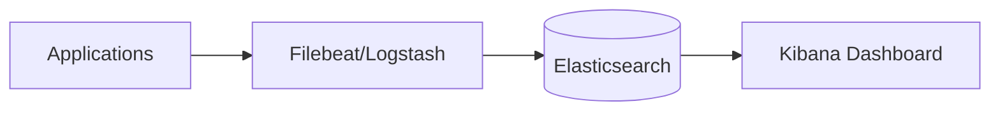

### Logging Best Practices

| Do | Don't |
|----|-------|
| Use structured JSON | Log unstructured text |
| Include correlation IDs | Log sensitive data (PII, passwords) |
| Log actionable information | Log excessive debug info in production |
| Set appropriate log levels | Use only ERROR level |

---

## Distributed Tracing

### How Tracing Works

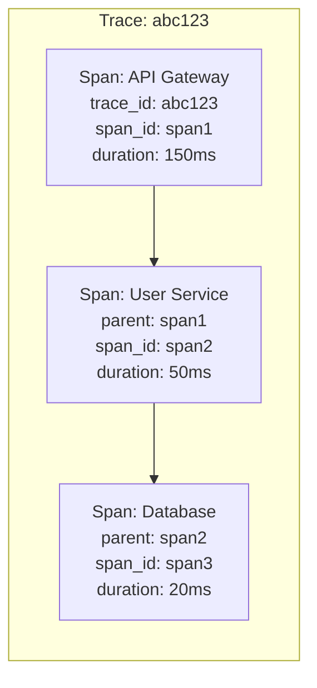

### Context Propagation

```http
# HTTP Headers for trace propagation
GET /api/orders HTTP/1.1
X-Trace-ID: abc123
X-Span-ID: span456
X-Parent-Span-ID: span123
```

### Tracing Tools

| Tool | Type | Key Feature |
|------|------|-------------|
| **Jaeger** | Open source | Uber's distributed tracing |
| **Zipkin** | Open source | Twitter's distributed tracing |
| **Datadog APM** | Commercial | Full observability platform |
| **AWS X-Ray** | AWS-native | AWS service integration |

### OpenTelemetry Example

```python
from opentelemetry import trace
from opentelemetry.sdk.trace import TracerProvider

trace.set_tracer_provider(TracerProvider())
tracer = trace.get_tracer(__name__)

def process_order(order_id):
    with tracer.start_as_current_span("process_order") as span:
        span.set_attribute("order.id", order_id)

        with tracer.start_as_current_span("validate_order"):
            validate(order_id)

        with tracer.start_as_current_span("charge_payment"):
            charge(order_id)

        with tracer.start_as_current_span("create_shipment"):
            ship(order_id)
```

---

## SLIs, SLOs, and SLAs

### Definitions

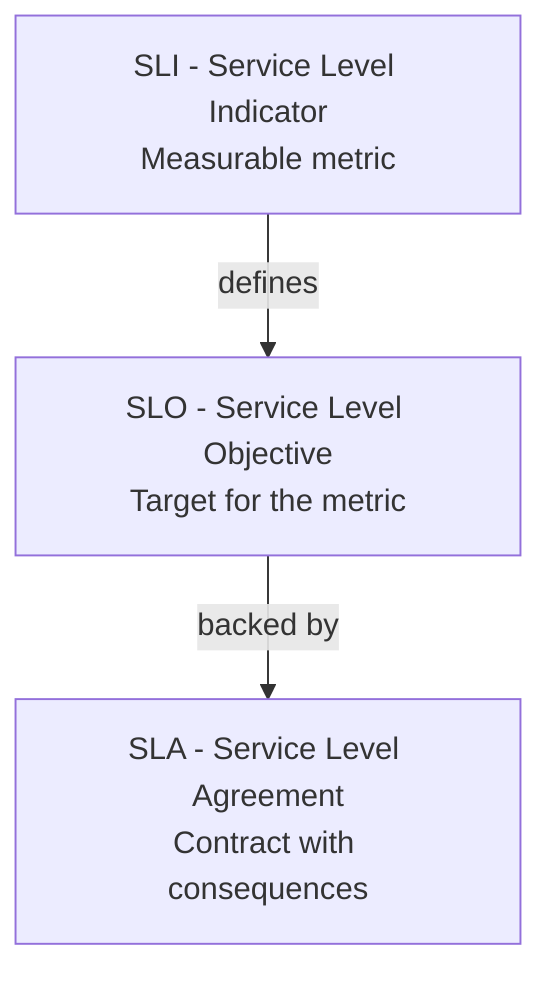

| Term | Definition | Example |
|------|------------|---------|
| **SLI** | Metric that measures service behavior | Request latency P99 |
| **SLO** | Target value for the SLI | P99 latency < 200ms |
| **SLA** | Contractual commitment | 99.9% uptime or refund |

### Common SLIs

| Category | SLI | Formula |
|----------|-----|---------|
| **Availability** | Successful requests | (200s) / (total) × 100 |
| **Latency** | Request duration | P50, P95, P99 |
| **Throughput** | Request rate | Requests per second |
| **Error Rate** | Failed requests | (5xx) / (total) × 100 |
| **Saturation** | Resource usage | Queue depth, CPU % |

### Error Budget

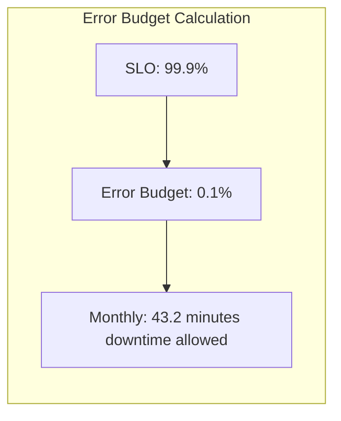

| SLO | Allowed Downtime/Month | Allowed Downtime/Year |
|-----|------------------------|----------------------|
| 99% | 7.3 hours | 3.65 days |
| 99.9% | 43.2 minutes | 8.76 hours |
| 99.99% | 4.3 minutes | 52.6 minutes |
| 99.999% | 26 seconds | 5.26 minutes |

### Using Error Budgets

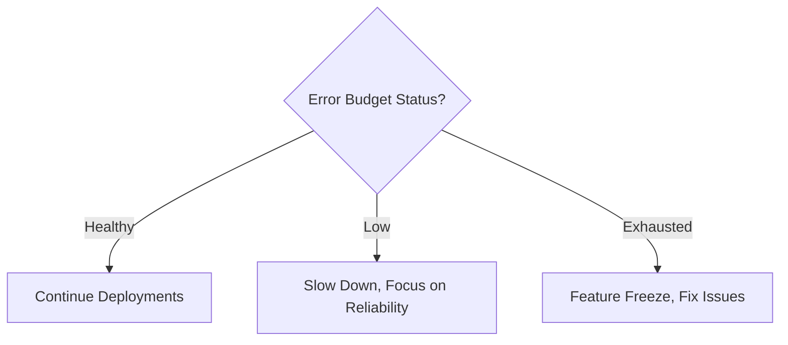

---

## Alerting

### Alert Design

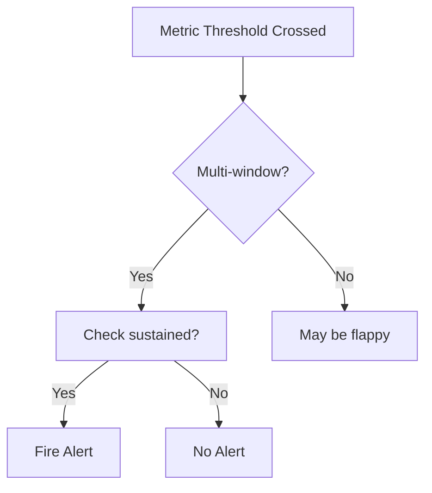

### Alert Best Practices

| Do | Don't |
|----|-------|
| Alert on symptoms (user impact) | Alert on causes only |
| Use multi-window alerts | Single-point alerts |
| Include runbook links | Vague alert messages |
| Set appropriate severity | Everything as critical |
| Group related alerts | Alert fatigue |

### Alert Example

```yaml
# Prometheus AlertManager rule
groups:
  - name: api-alerts
    rules:
      - alert: HighErrorRate
        expr: |
          sum(rate(http_requests_total{status=~"5.."}[5m]))
          /
          sum(rate(http_requests_total[5m]))
          > 0.01
        for: 5m
        labels:
          severity: critical
        annotations:
          summary: "High error rate detected"
          description: "Error rate is {{ $value | humanizePercentage }}"
          runbook_url: "https://wiki/runbooks/high-error-rate"
```

---

## Fault Tolerance Patterns

### Circuit Breaker

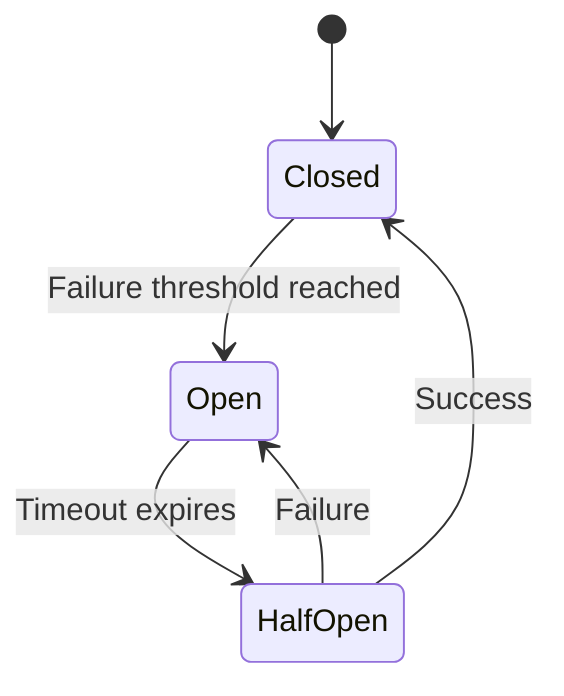

| State | Behavior |
|-------|----------|
| **Closed** | Requests flow normally |
| **Open** | Requests fail fast |
| **Half-Open** | Limited requests to test recovery |

```python
from circuitbreaker import circuit

@circuit(failure_threshold=5, recovery_timeout=30)
def call_external_service():
    response = requests.get('https://external-api.com/data')
    return response.json()

try:
    data = call_external_service()
except CircuitBreakerError:
    # Use fallback
    data = get_cached_data()
```

### Retry with Exponential Backoff

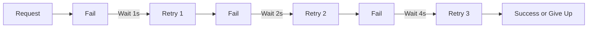

```python
import time
import random

def retry_with_backoff(func, max_retries=3, base_delay=1):
    for attempt in range(max_retries):
        try:
            return func()
        except TransientError:
            if attempt == max_retries - 1:
                raise

            # Exponential backoff with jitter
            delay = base_delay * (2 ** attempt)
            jitter = random.uniform(0, delay * 0.1)
            time.sleep(delay + jitter)
```

### Bulkhead

Isolate components to prevent cascading failures.

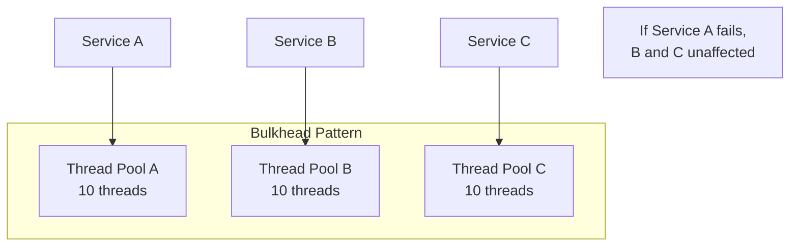

### Timeout

```python
import requests

# Always set timeouts!
response = requests.get(
    'https://api.example.com/data',
    timeout=(3.05, 27)  # (connect timeout, read timeout)
)
```

| Component | Recommended Timeout |
|-----------|---------------------|
| DNS lookup | 1-2 seconds |
| Connection | 3-5 seconds |
| Read | 10-30 seconds |
| Total request | 30-60 seconds |

### Fallback

```python
def get_user_recommendations(user_id):
    try:
        # Primary: Personalized recommendations
        return recommendation_service.get(user_id)
    except ServiceUnavailable:
        try:
            # Fallback 1: Cached recommendations
            return cache.get(f"recommendations:{user_id}")
        except CacheMiss:
            # Fallback 2: Popular items
            return get_popular_items()
```

### Load Shedding

Drop lower-priority requests when overloaded.

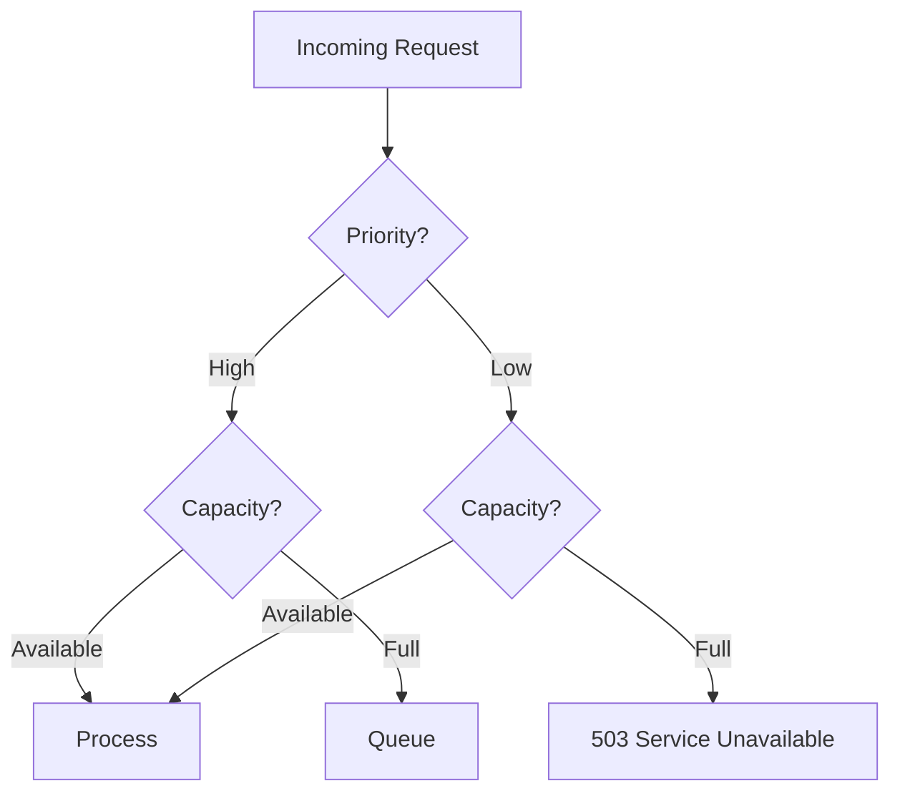

---

## Health Checks

### Types of Health Checks

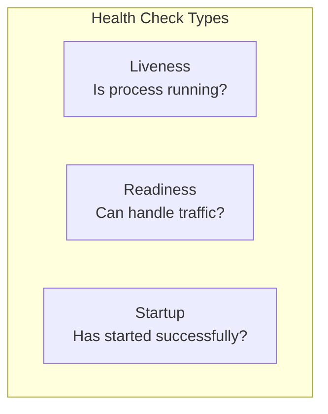

| Type | Purpose | Failure Action |
|------|---------|----------------|
| **Liveness** | Is the process alive? | Restart container |
| **Readiness** | Can it serve traffic? | Remove from load balancer |
| **Startup** | Has it started? | Wait, then check liveness |

### Kubernetes Health Checks

```yaml
apiVersion: v1
kind: Pod
spec:
  containers:
    - name: api
      livenessProbe:
        httpGet:
          path: /health/live
          port: 8080
        initialDelaySeconds: 10
        periodSeconds: 5
        failureThreshold: 3

      readinessProbe:
        httpGet:
          path: /health/ready
          port: 8080
        initialDelaySeconds: 5
        periodSeconds: 3
        failureThreshold: 2
```

### Health Check Implementation

```python
@app.route('/health/live')
def liveness():
    return {'status': 'alive'}, 200

@app.route('/health/ready')
def readiness():
    checks = {
        'database': check_database(),
        'cache': check_cache(),
        'external_api': check_external_api()
    }

    all_healthy = all(checks.values())
    status_code = 200 if all_healthy else 503

    return {'status': 'ready' if all_healthy else 'not_ready', 'checks': checks}, status_code
```

---

## Disaster Recovery

### RTO and RPO

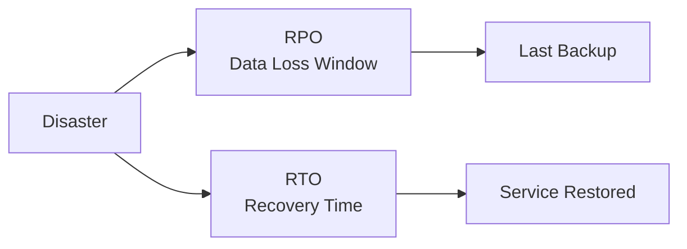

| Metric | Definition | Example |
|--------|------------|---------|
| **RTO** | Recovery Time Objective - Max acceptable downtime | 4 hours |
| **RPO** | Recovery Point Objective - Max acceptable data loss | 1 hour |

### DR Strategies

| Strategy | RTO | RPO | Cost |
|----------|-----|-----|------|
| **Backup & Restore** | Hours | Hours | $ |
| **Pilot Light** | Minutes-Hours | Minutes | $$ |
| **Warm Standby** | Minutes | Minutes | $$$ |
| **Multi-Region Active-Active** | Seconds | Near-zero | $$$$ |

### Multi-Region Architecture

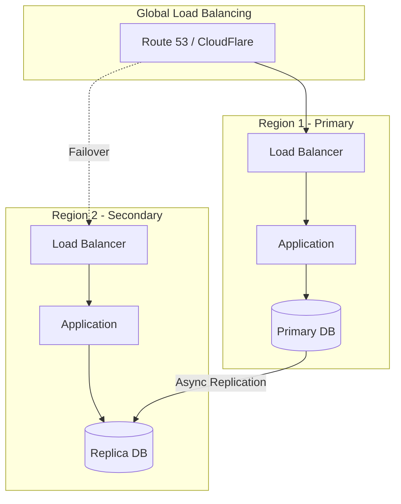

### Backup Strategy

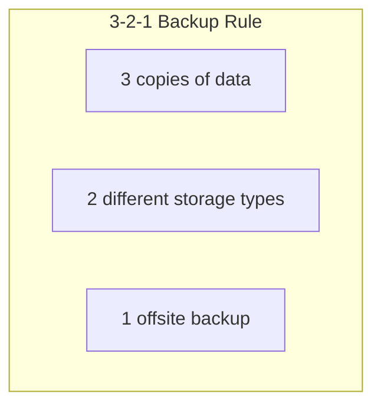

| Backup Type | Frequency | Retention |
|-------------|-----------|-----------|
| **Transaction logs** | Continuous | 7 days |
| **Daily snapshots** | Daily | 30 days |
| **Weekly full** | Weekly | 90 days |
| **Monthly archive** | Monthly | 1 year |

---

## Chaos Engineering

### Principles

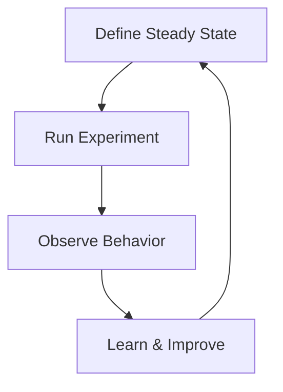

### Types of Chaos Experiments

| Category | Experiment |
|----------|------------|
| **Network** | Latency injection, packet loss, partition |
| **Compute** | CPU stress, memory pressure, process kill |
| **Application** | Exception injection, response delays |
| **Dependencies** | Service unavailable, slow responses |

### Tools

| Tool | Type | Use Case |
|------|------|----------|
| **Chaos Monkey** | Netflix | Random instance termination |
| **Gremlin** | Commercial | Comprehensive chaos platform |
| **Litmus** | Open source | Kubernetes chaos |
| **Toxiproxy** | Open source | Network chaos |

---

## Observability Stack Example

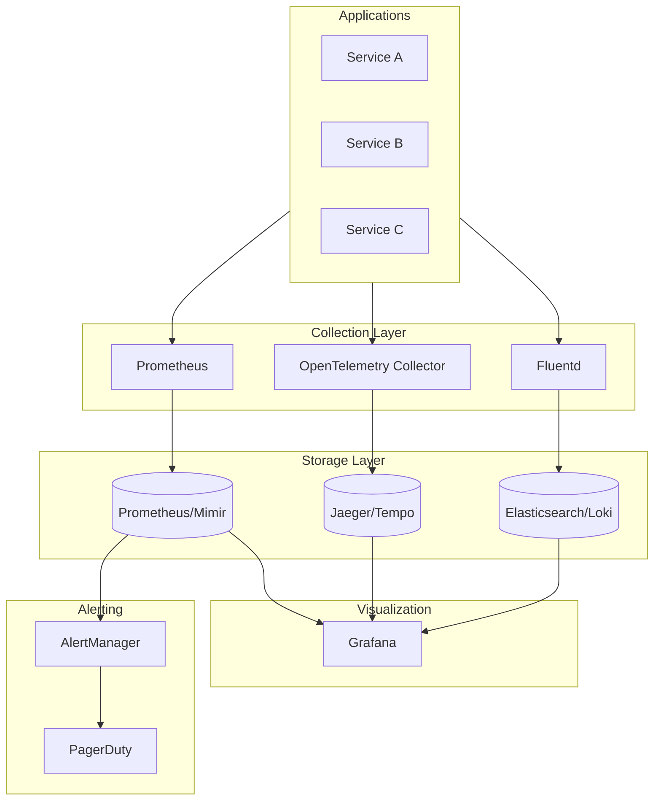

---

## Summary

| Topic | Key Points |
|-------|------------|
| **Metrics** | RED method, Prometheus, quantitative |
| **Logs** | Structured, aggregated, correlation IDs |
| **Traces** | Distributed context, OpenTelemetry |
| **SLOs** | Target + error budget, drive decisions |
| **Circuit Breaker** | Fail fast, prevent cascade |
| **Retry** | Exponential backoff, jitter |
| **Bulkhead** | Isolate failures |
| **Health Checks** | Liveness vs Readiness |
| **DR** | RTO/RPO, multi-region |

---

**Previous**: [← API Design & Gateway](09-api-design-gateway.md) | **Next**: [Common Interview Problems →](11-common-interview-problems.md)
