# Common System Design Interview Problems

This guide provides templates and key considerations for the most frequently asked system design problems. Use these as starting points and adapt based on specific requirements.

## Problem Matrix

| Problem | Key Components | Main Challenges | Difficulty |
|---------|----------------|-----------------|------------|
| [URL Shortener](#url-shortener) | Base62 encoding, distributed ID | Collision handling, analytics | Medium |
| [Rate Limiter](#rate-limiter) | Token bucket, Redis | Distributed coordination | Medium |
| [Chat/Messaging](#chat-messaging-system) | WebSockets, message queue | Delivery guarantees, presence | Hard |
| [News Feed](#news-feed) | Fan-out, ranking | Real-time updates, personalization | Hard |
| [Search Autocomplete](#search-autocomplete) | Trie, Elasticsearch | Latency, relevance | Medium |
| [Notification System](#notification-system) | Multi-channel, queue | Delivery, deduplication | Medium |
| [File Storage](#distributed-file-storage) | Chunk storage, metadata | Consistency, sync | Hard |
| [Video Streaming](#video-streaming-platform) | CDN, adaptive bitrate | Encoding, storage costs | Hard |
| [Ride Sharing](#ride-sharing-uber) | Geospatial, matching | Real-time location, surge | Hard |
| [E-commerce](#e-commerce-platform) | Inventory, payments | Consistency, flash sales | Hard |

---

## URL Shortener

### Requirements

**Functional:**
- Shorten long URL → short URL
- Redirect short URL → original URL
- Optional: custom aliases, expiration, analytics

**Non-Functional:**
- 100M URLs created/day, 10:1 read:write ratio
- P99 latency < 100ms
- High availability

### Estimation

```
Write: 100M/day ≈ 1,200 QPS
Read: 1B/day ≈ 12,000 QPS
Storage: 100M × 500 bytes × 365 days × 5 years = 90 TB
```

### High-Level Design

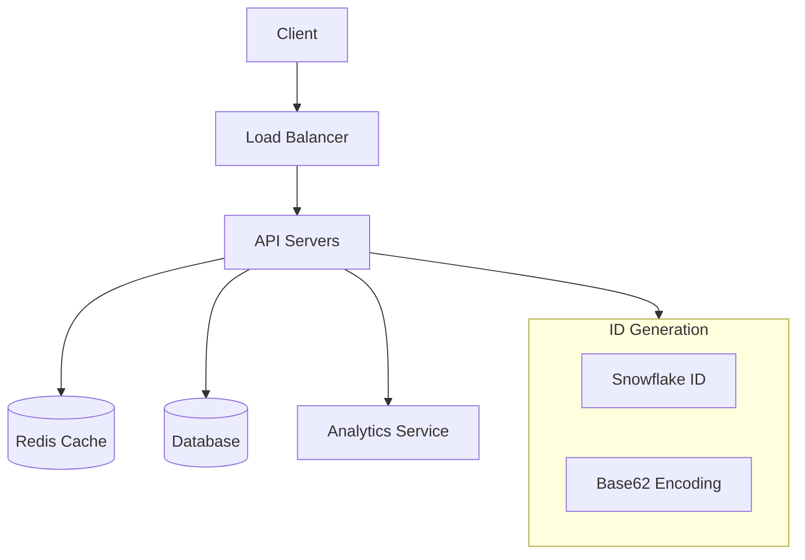
```mermaid
flowchart TB
    Client[Client] --> LB[Load Balancer]
    LB --> API[API Servers]
    API --> Cache[(Redis Cache)]
    API --> DB[(Database)]
    API --> Analytics[Analytics Service]

    subgraph id_gen [ID Generation]
        Snowflake[Snowflake ID]
        Base62[Base62 Encoding]
    end

    API --> id_gen
```

### Key Components

**Short Code Generation:**
```python
# Option 1: Counter-based with Base62
def encode_base62(num):
    chars = "0123456789abcdefghijklmnopqrstuvwxyzABCDEFGHIJKLMNOPQRSTUVWXYZ"
    result = ""
    while num > 0:
        result = chars[num % 62] + result
        num //= 62
    return result

# 7-character code: 62^7 = 3.5 trillion combinations

# Option 2: Hash-based
def generate_short_code(long_url):
    hash = md5(long_url + salt)
    return base62(hash[:7])
```

**Database Schema:**
```sql
CREATE TABLE urls (
    id BIGINT PRIMARY KEY,
    short_code VARCHAR(10) UNIQUE,
    long_url TEXT NOT NULL,
    user_id BIGINT,
    created_at TIMESTAMP DEFAULT NOW(),
    expires_at TIMESTAMP,
    click_count BIGINT DEFAULT 0
);

CREATE INDEX idx_short_code ON urls(short_code);
```

### Deep Dive Topics

1. **Collision Handling**: Hash collision → append counter, retry
2. **Caching**: 80% hit rate, LRU eviction
3. **Analytics**: Async processing via Kafka
4. **Scaling**: Partition by short_code hash

---

## Rate Limiter

### Requirements

**Functional:**
- Limit requests per client/IP/API key
- Support multiple rate limit rules
- Return appropriate error when limited

**Non-Functional:**
- Low latency (< 1ms overhead)
- Distributed across multiple servers
- Accurate limiting

### High-Level Design

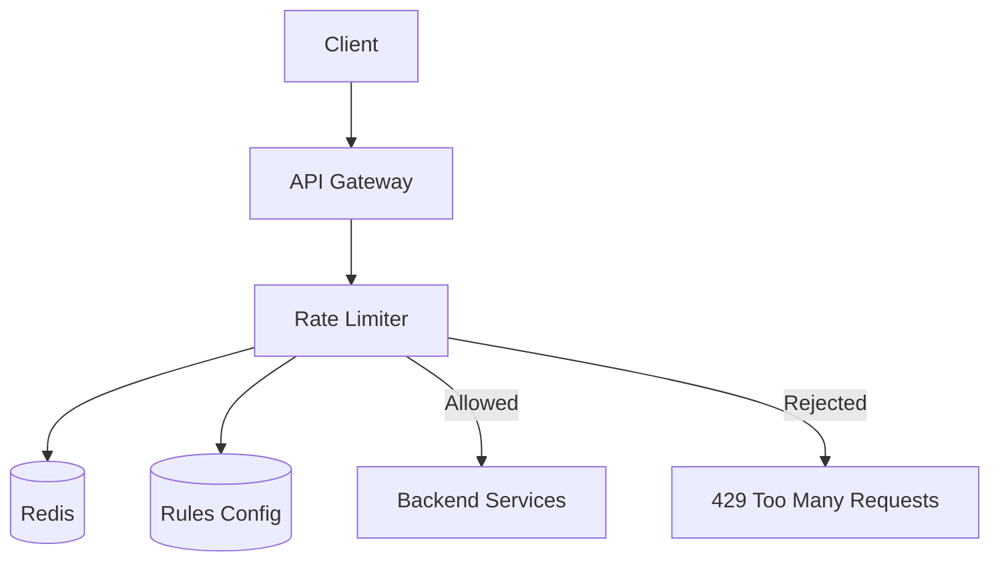
```mermaid
flowchart TB
    Client[Client] --> Gateway[API Gateway]
    Gateway --> RateLimiter[Rate Limiter]
    RateLimiter --> Redis[(Redis)]
    RateLimiter --> RulesDB[(Rules Config)]

    RateLimiter -->|Allowed| Backend[Backend Services]
    RateLimiter -->|Rejected| Error[429 Too Many Requests]
```

### Algorithm: Sliding Window Counter

```python
def is_allowed(client_id, limit, window_seconds):
    now = int(time.time())
    current_window = now // window_seconds
    previous_window = current_window - 1

    current_key = f"rate:{client_id}:{current_window}"
    previous_key = f"rate:{client_id}:{previous_window}"

    # Get counts
    current_count = redis.get(current_key) or 0
    previous_count = redis.get(previous_key) or 0

    # Calculate weighted count
    elapsed = now % window_seconds
    weight = (window_seconds - elapsed) / window_seconds
    weighted_count = current_count + (previous_count * weight)

    if weighted_count >= limit:
        return False

    # Increment current window
    redis.incr(current_key)
    redis.expire(current_key, window_seconds * 2)
    return True
```

### Redis Lua Script (Atomic)

```lua
local key = KEYS[1]
local limit = tonumber(ARGV[1])
local window = tonumber(ARGV[2])

local current = redis.call('GET', key)
if current and tonumber(current) >= limit then
    return 0
end

current = redis.call('INCR', key)
if current == 1 then
    redis.call('EXPIRE', key, window)
end
return 1
```

### Deep Dive Topics

1. **Distributed Sync**: Use Redis for shared state
2. **Rule Configuration**: Dynamic rules from config service
3. **Client Identification**: API key > User ID > IP
4. **Graceful Degradation**: Local rate limiting if Redis down

---

## Chat/Messaging System

### Requirements

**Functional:**
- 1:1 and group messaging
- Online/offline status
- Read receipts, typing indicators
- Message history

**Non-Functional:**
- 500M DAU, 50 messages/user/day
- Real-time delivery (< 100ms)
- Message ordering guaranteed

### Estimation

```
Messages/day: 500M × 50 = 25B
QPS: 25B / 86400 ≈ 290K QPS
Storage: 25B × 200 bytes = 5 TB/day
Connections: 500M × 0.2 (concurrent) = 100M WebSocket connections
```

### High-Level Design

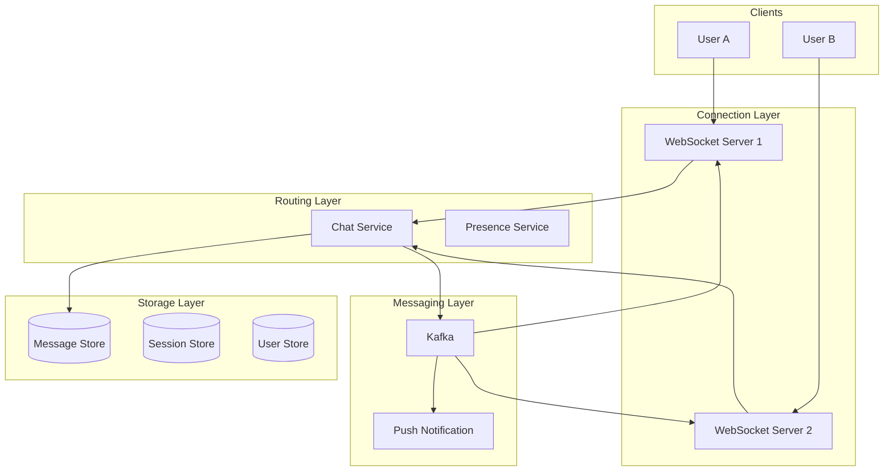
```mermaid
flowchart TB
    subgraph clients [Clients]
        Client1[User A]
        Client2[User B]
    end

    subgraph edge [Connection Layer]
        WSS1[WebSocket Server 1]
        WSS2[WebSocket Server 2]
    end

    subgraph routing [Routing Layer]
        ChatService[Chat Service]
        PresenceService[Presence Service]
    end

    subgraph messaging [Messaging Layer]
        Kafka[Kafka]
        Push[Push Notification]
    end

    subgraph storage [Storage Layer]
        MessageDB[(Message Store)]
        SessionDB[(Session Store)]
        UserDB[(User Store)]
    end

    Client1 --> WSS1
    Client2 --> WSS2
    WSS1 --> ChatService
    WSS2 --> ChatService
    ChatService --> Kafka
    Kafka --> WSS1
    Kafka --> WSS2
    Kafka --> Push
    ChatService --> MessageDB
```

### Message Flow

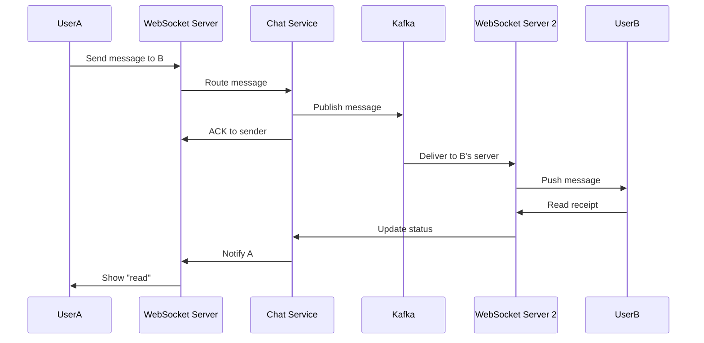
```mermaid
sequenceDiagram
    participant UserA
    participant WSS1 as WebSocket Server
    participant Chat as Chat Service
    participant Kafka
    participant WSS2 as WebSocket Server 2
    participant UserB

    UserA->>WSS1: Send message to B
    WSS1->>Chat: Route message
    Chat->>Kafka: Publish message
    Chat->>WSS1: ACK to sender

    Kafka->>WSS2: Deliver to B's server
    WSS2->>UserB: Push message

    UserB->>WSS2: Read receipt
    WSS2->>Chat: Update status
    Chat->>WSS1: Notify A
    WSS1->>UserA: Show "read"
```

### Deep Dive Topics

1. **WebSocket Management**: Connection registry, heartbeat
2. **Message Ordering**: Per-conversation sequence numbers
3. **Offline Delivery**: Store and forward, push notifications
4. **Group Messages**: Fan-out to members

---

## News Feed

### Requirements

**Functional:**
- Users can post content
- Users see feed from people they follow
- Ranking and personalization

**Non-Functional:**
- 300M DAU, 100 feed views/user/day
- Feed latency < 200ms
- Real-time updates for new posts

### Estimation

```
Feed reads: 300M × 100 = 30B/day ≈ 350K QPS
Posts: 300M × 1 = 300M/day ≈ 3.5K QPS
Average following: 200 users
```

### Fan-Out Strategies

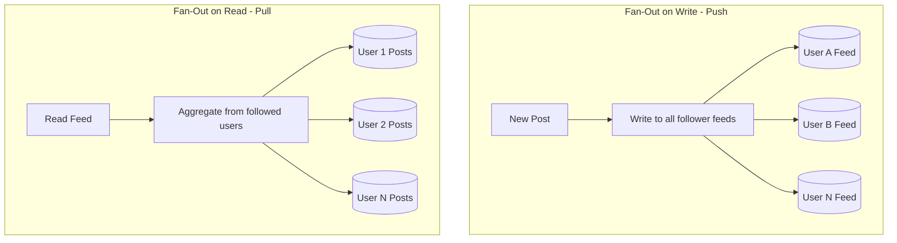
```mermaid
flowchart TB
    subgraph push [Fan-Out on Write - Push]
        PostP[New Post] --> WriteFeed[Write to all follower feeds]
        WriteFeed --> Feed1[(User A Feed)]
        WriteFeed --> Feed2[(User B Feed)]
        WriteFeed --> Feed3[(User N Feed)]
    end

    subgraph pull [Fan-Out on Read - Pull]
        ReadR[Read Feed] --> Aggregate[Aggregate from followed users]
        Aggregate --> User1Posts[(User 1 Posts)]
        Aggregate --> User2Posts[(User 2 Posts)]
        Aggregate --> User3Posts[(User N Posts)]
    end
```

| Strategy | Pros | Cons | Use When |
|----------|------|------|----------|
| **Push** | Fast reads | Slow writes, storage | Most users |
| **Pull** | Fast writes | Slow reads | Celebrities |
| **Hybrid** | Balanced | Complex | Best practice |

### High-Level Design

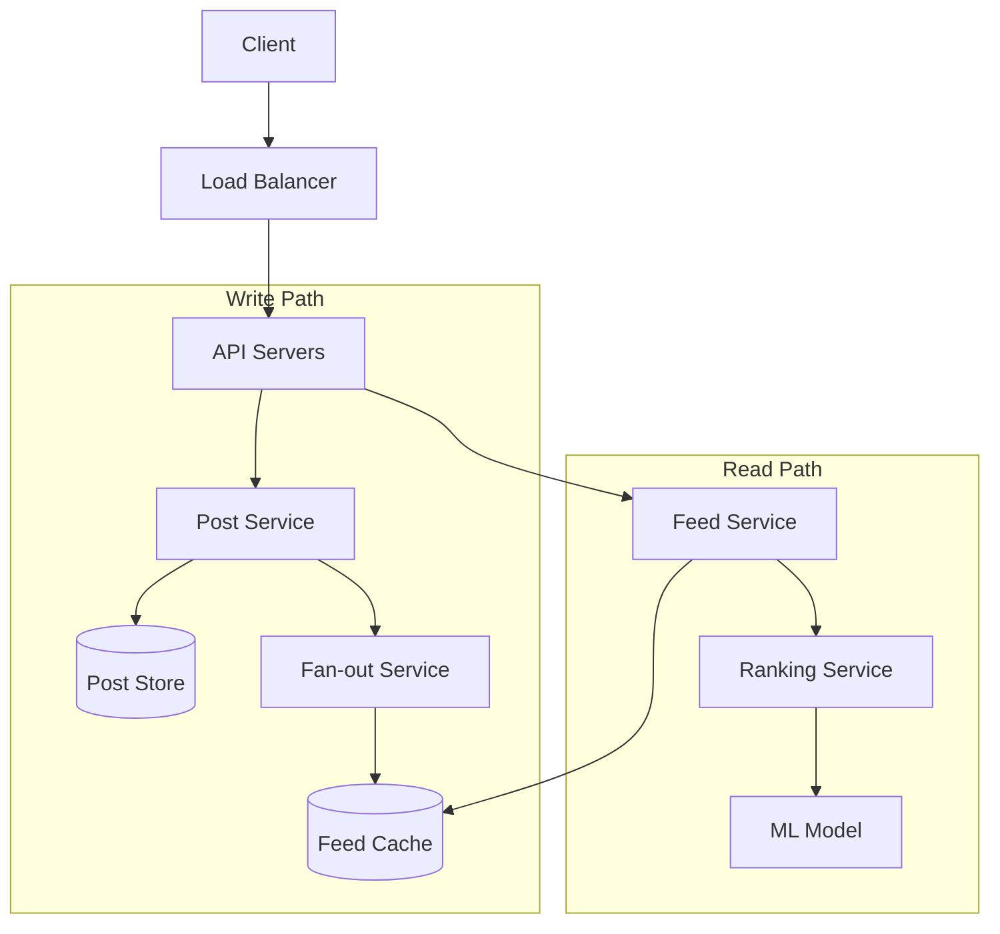
```mermaid
flowchart TB
    Client[Client] --> LB[Load Balancer]
    LB --> API[API Servers]

    subgraph write [Write Path]
        API --> PostService[Post Service]
        PostService --> PostDB[(Post Store)]
        PostService --> Fanout[Fan-out Service]
        Fanout --> FeedCache[(Feed Cache)]
    end

    subgraph read [Read Path]
        API --> FeedService[Feed Service]
        FeedService --> FeedCache
        FeedService --> Ranker[Ranking Service]
        Ranker --> ML[ML Model]
    end
```

### Feed Ranking

```python
def calculate_feed_score(post, user):
    # Base score from engagement
    engagement = (
        post.likes * 1.0 +
        post.comments * 2.0 +
        post.shares * 3.0
    )

    # Time decay
    age_hours = (now - post.created_at).hours
    time_decay = 1 / (1 + age_hours * 0.1)

    # Affinity with author
    affinity = get_affinity_score(user, post.author)

    # Content type boost
    type_boost = 1.5 if post.has_media else 1.0

    return engagement * time_decay * affinity * type_boost
```

---

## Search Autocomplete

### Requirements

**Functional:**
- Return suggestions as user types
- Rank by popularity/relevance
- Support typo tolerance

**Non-Functional:**
- 100K QPS
- P99 latency < 100ms
- Update with new trends

### High-Level Design

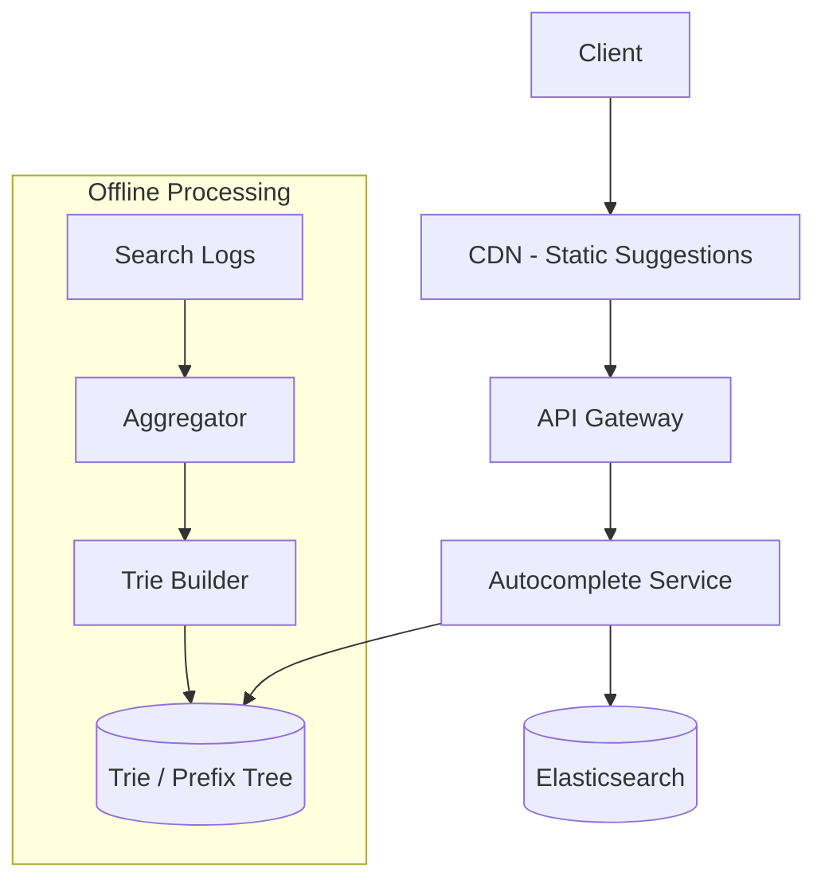
```mermaid
flowchart TB
    Client[Client] --> CDN[CDN - Static Suggestions]
    CDN --> API[API Gateway]
    API --> Autocomplete[Autocomplete Service]

    Autocomplete --> Trie[(Trie / Prefix Tree)]
    Autocomplete --> ES[(Elasticsearch)]

    subgraph offline [Offline Processing]
        Logs[Search Logs] --> Aggregator[Aggregator]
        Aggregator --> TrieBuilder[Trie Builder]
        TrieBuilder --> Trie
    end
```

### Trie Implementation

```python
class TrieNode:
    def __init__(self):
        self.children = {}
        self.suggestions = []  # Top K suggestions at this prefix
        self.is_word = False

class AutocompleteTrie:
    def __init__(self, k=10):
        self.root = TrieNode()
        self.k = k

    def insert(self, word, score):
        node = self.root
        for char in word.lower():
            if char not in node.children:
                node.children[char] = TrieNode()
            node = node.children[char]

            # Update suggestions at each prefix
            self._update_suggestions(node, word, score)

        node.is_word = True

    def search(self, prefix):
        node = self.root
        for char in prefix.lower():
            if char not in node.children:
                return []
            node = node.children[char]
        return node.suggestions
```

### Deep Dive Topics

1. **Sharding**: By first 2 characters of prefix
2. **Caching**: CDN for popular prefixes
3. **Personalization**: User-specific suggestions
4. **Fresh Data**: Near real-time trend updates

---

## Notification System

### Requirements

**Functional:**
- Multiple channels: Push, SMS, Email
- User preferences
- Rate limiting per user

**Non-Functional:**
- 10M notifications/day
- High deliverability
- Handle failures gracefully

### High-Level Design

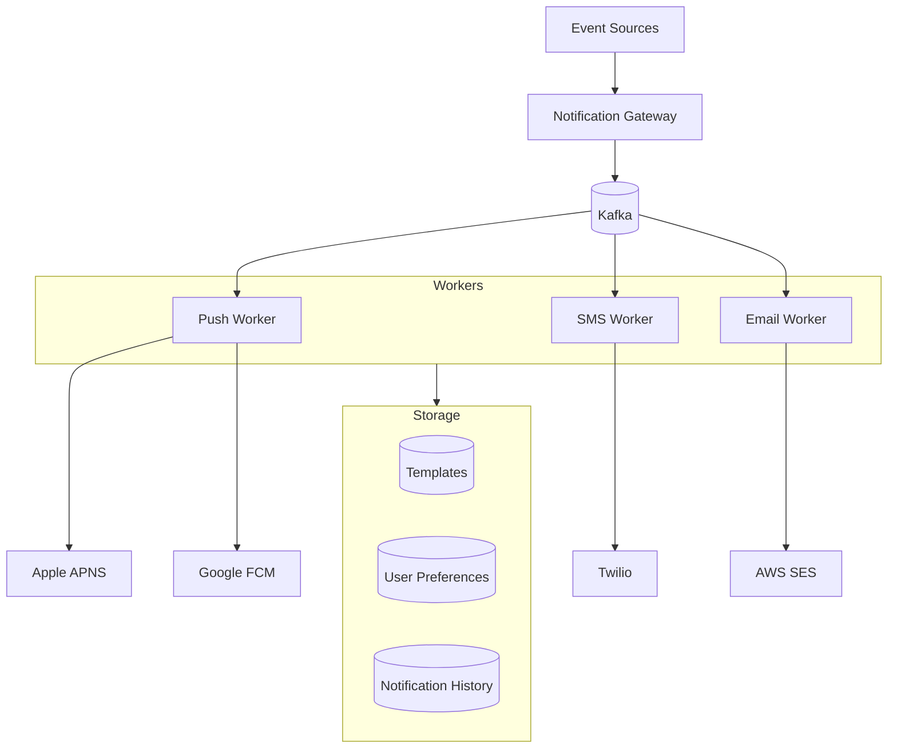
```mermaid
flowchart TB
    Sources[Event Sources] --> Gateway[Notification Gateway]
    Gateway --> Queue[(Kafka)]

    subgraph workers [Workers]
        Push[Push Worker]
        SMS[SMS Worker]
        Email[Email Worker]
    end

    Queue --> Push
    Queue --> SMS
    Queue --> Email

    Push --> APNS[Apple APNS]
    Push --> FCM[Google FCM]
    SMS --> Twilio[Twilio]
    Email --> SES[AWS SES]

    subgraph storage [Storage]
        Templates[(Templates)]
        Preferences[(User Preferences)]
        History[(Notification History)]
    end

    workers --> storage
```

### Notification Flow

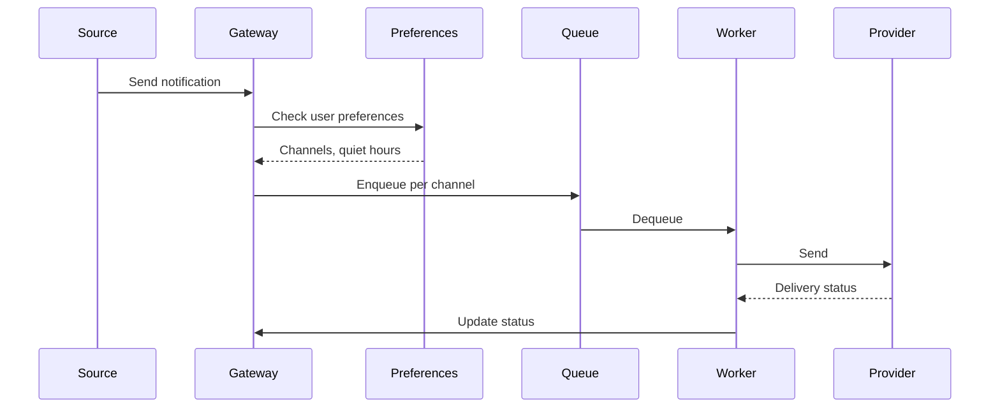
```mermaid
sequenceDiagram
    participant Source
    participant Gateway
    participant Preferences
    participant Queue
    participant Worker
    participant Provider

    Source->>Gateway: Send notification
    Gateway->>Preferences: Check user preferences
    Preferences-->>Gateway: Channels, quiet hours
    Gateway->>Queue: Enqueue per channel
    Queue->>Worker: Dequeue
    Worker->>Provider: Send
    Provider-->>Worker: Delivery status
    Worker->>Gateway: Update status
```

### Deep Dive Topics

1. **Deduplication**: Idempotency key per notification
2. **Rate Limiting**: Per-user limits to avoid spam
3. **Retry Logic**: Exponential backoff, DLQ
4. **Analytics**: Track delivery, open rates

---

## Distributed File Storage

### Requirements

**Functional:**
- Upload/download files
- Sync across devices
- Share files, version history

**Non-Functional:**
- 50M users, 100GB average storage
- High durability (11 9s)
- Eventual consistency acceptable

### High-Level Design

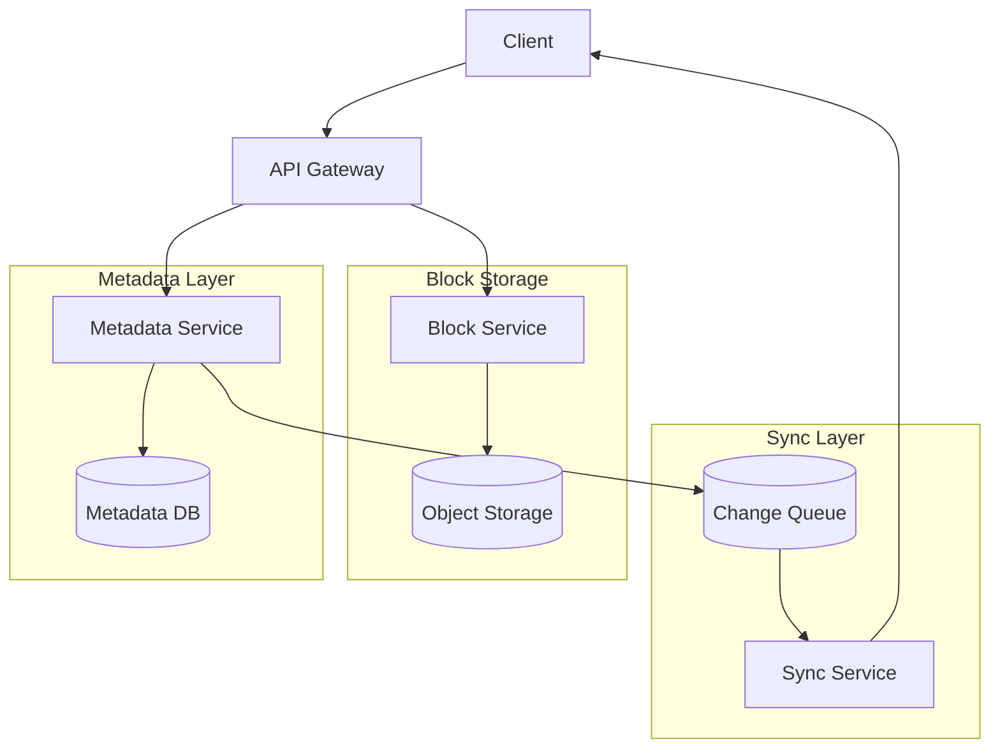
```mermaid
flowchart TB
    Client[Client] --> API[API Gateway]

    subgraph metadata [Metadata Layer]
        MetaService[Metadata Service]
        MetaDB[(Metadata DB)]
    end

    subgraph storage [Block Storage]
        ChunkService[Block Service]
        S3[(Object Storage)]
    end

    subgraph sync [Sync Layer]
        SyncService[Sync Service]
        Queue[(Change Queue)]
    end

    API --> MetaService
    API --> ChunkService
    MetaService --> MetaDB
    ChunkService --> S3

    MetaService --> Queue
    Queue --> SyncService
    SyncService --> Client
```

### Chunking Strategy

```python
def upload_file(file):
    # Split file into chunks
    chunks = split_into_chunks(file, chunk_size=4*1024*1024)  # 4MB chunks

    uploaded_chunks = []
    for chunk in chunks:
        # Hash for deduplication
        chunk_hash = sha256(chunk)

        # Check if chunk exists
        if not storage.exists(chunk_hash):
            storage.upload(chunk_hash, chunk)

        uploaded_chunks.append(chunk_hash)

    # Create file metadata
    metadata = {
        'name': file.name,
        'size': file.size,
        'chunks': uploaded_chunks,
        'version': next_version()
    }

    return metadata_db.save(metadata)
```

---

## Video Streaming Platform

### Requirements

**Functional:**
- Upload and transcode videos
- Stream with adaptive bitrate
- Recommendations

**Non-Functional:**
- 50M DAU, 5 videos/user/day
- Support 4K streaming
- Global delivery

### High-Level Design

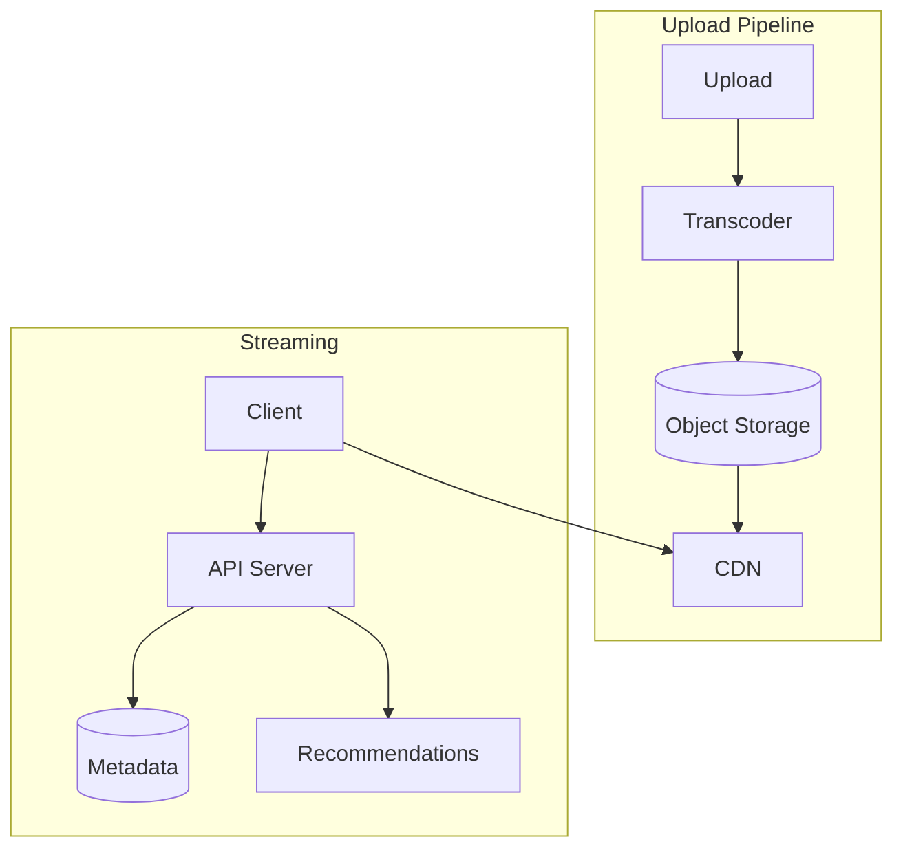
```mermaid
flowchart TB
    subgraph upload [Upload Pipeline]
        Upload[Upload] --> Transcode[Transcoder]
        Transcode --> Storage[(Object Storage)]
        Storage --> CDN[CDN]
    end

    subgraph stream [Streaming]
        Client[Client] --> CDN
        Client --> API[API Server]
        API --> Metadata[(Metadata)]
        API --> Recommendations[Recommendations]
    end
```

### Video Transcoding

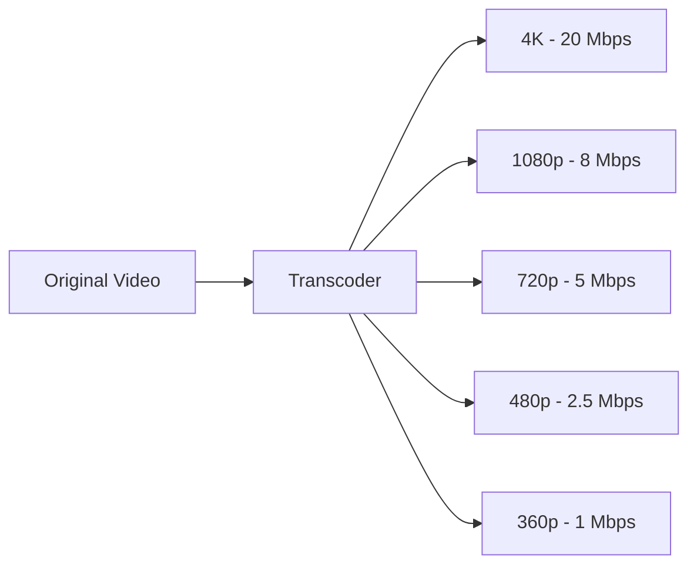
```mermaid
flowchart LR
    Original[Original Video] --> Transcoder[Transcoder]

    Transcoder --> R1[4K - 20 Mbps]
    Transcoder --> R2[1080p - 8 Mbps]
    Transcoder --> R3[720p - 5 Mbps]
    Transcoder --> R4[480p - 2.5 Mbps]
    Transcoder --> R5[360p - 1 Mbps]
```

### Adaptive Bitrate Streaming

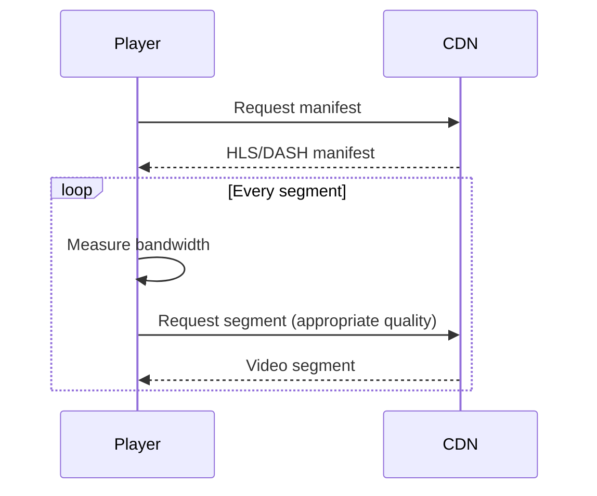
```mermaid
sequenceDiagram
    participant Player
    participant CDN

    Player->>CDN: Request manifest
    CDN-->>Player: HLS/DASH manifest

    loop Every segment
        Player->>Player: Measure bandwidth
        Player->>CDN: Request segment (appropriate quality)
        CDN-->>Player: Video segment
    end
```

---

## Ride Sharing (Uber)

### Requirements

**Functional:**
- Request ride, driver matching
- Real-time location tracking
- Fare calculation

**Non-Functional:**
- 1M rides/day
- Match within 30 seconds
- 10M location updates/minute

### High-Level Design

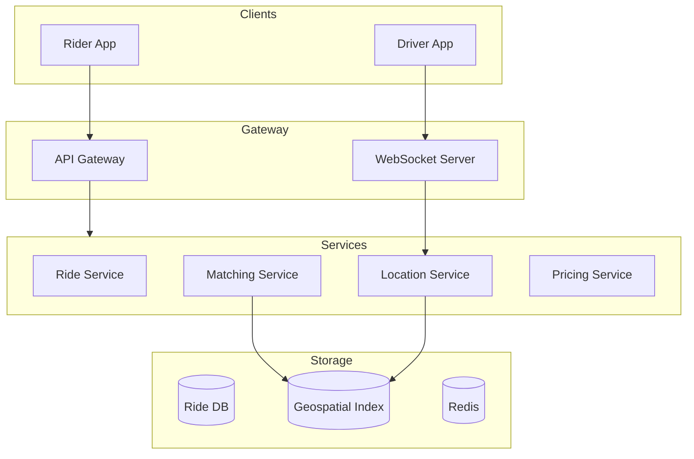
```mermaid
flowchart TB
    subgraph clients [Clients]
        Rider[Rider App]
        Driver[Driver App]
    end

    subgraph gateway [Gateway]
        API[API Gateway]
        WS[WebSocket Server]
    end

    subgraph services [Services]
        RideService[Ride Service]
        MatchService[Matching Service]
        LocationService[Location Service]
        PricingService[Pricing Service]
    end

    subgraph storage [Storage]
        RideDB[(Ride DB)]
        GeoIndex[(Geospatial Index)]
        Cache[(Redis)]
    end

    Rider --> API
    Driver --> WS
    API --> services
    WS --> LocationService
    MatchService --> GeoIndex
    LocationService --> GeoIndex
```

### Geospatial Matching

```python
import h3

def find_nearby_drivers(rider_lat, rider_lng, radius_km=5):
    # Use H3 for geospatial indexing
    rider_cell = h3.geo_to_h3(rider_lat, rider_lng, resolution=9)

    # Get neighboring cells
    nearby_cells = h3.k_ring(rider_cell, k=2)

    # Query drivers in cells
    drivers = []
    for cell in nearby_cells:
        cell_drivers = redis.smembers(f"drivers:{cell}")
        drivers.extend(cell_drivers)

    # Filter by actual distance and availability
    available = [d for d in drivers
                 if d.status == 'available'
                 and haversine_distance(rider_lat, rider_lng, d.lat, d.lng) < radius_km]

    return sorted(available, key=lambda d: d.distance)[:10]
```

---

## E-commerce Platform

### Requirements

**Functional:**
- Product catalog, search
- Shopping cart, checkout
- Order management

**Non-Functional:**
- Handle flash sales (100K orders/minute)
- Inventory consistency
- Payment reliability

### High-Level Design

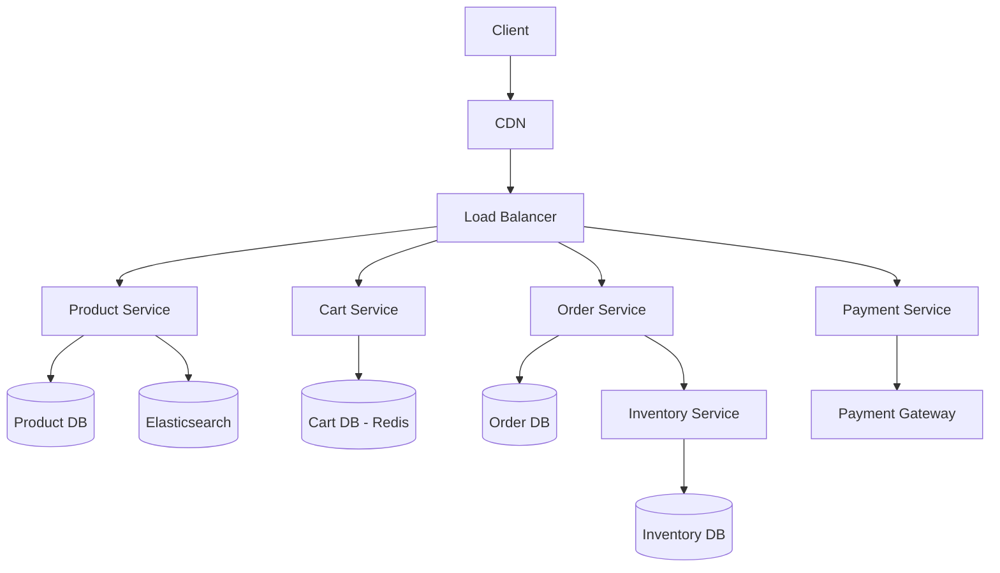
```mermaid
flowchart TB
    Client[Client] --> CDN[CDN]
    CDN --> LB[Load Balancer]

    LB --> ProductService[Product Service]
    LB --> CartService[Cart Service]
    LB --> OrderService[Order Service]
    LB --> PaymentService[Payment Service]

    ProductService --> ProductDB[(Product DB)]
    ProductService --> Search[(Elasticsearch)]
    CartService --> CartDB[(Cart DB - Redis)]
    OrderService --> OrderDB[(Order DB)]
    PaymentService --> PaymentGateway[Payment Gateway]

    OrderService --> InventoryService[Inventory Service]
    InventoryService --> InventoryDB[(Inventory DB)]
```

### Inventory Management

```python
def reserve_inventory(order_items):
    with db.transaction():
        for item in order_items:
            result = db.execute("""
                UPDATE inventory
                SET reserved = reserved + :qty
                WHERE product_id = :pid
                AND (available - reserved) >= :qty
            """, {'pid': item.product_id, 'qty': item.quantity})

            if result.rowcount == 0:
                raise InsufficientInventory(item.product_id)

        return create_reservation(order_items, expires_in=15*60)  # 15 min hold
```

### Flash Sale Architecture

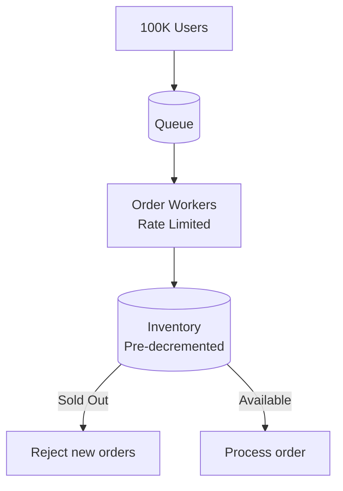
```mermaid
flowchart TB
    Users[100K Users] --> Queue[(Queue)]
    Queue --> OrderWorkers[Order Workers<br/>Rate Limited]
    OrderWorkers --> Inventory[(Inventory<br/>Pre-decremented)]

    Inventory -->|Sold Out| Reject[Reject new orders]
    Inventory -->|Available| Process[Process order]
```

---

## Interview Tips for Each Problem

| Problem | Focus On | Common Follow-ups |
|---------|----------|-------------------|
| URL Shortener | ID generation, caching | Analytics, custom aliases |
| Rate Limiter | Algorithm trade-offs, distribution | Multiple limits, quotas |
| Chat | WebSocket scaling, delivery guarantees | E2E encryption, reactions |
| News Feed | Fan-out strategy, ranking | Real-time, personalization |
| Autocomplete | Trie optimization, freshness | Typo tolerance, personalization |
| Notifications | Multi-channel, reliability | Quiet hours, aggregation |
| File Storage | Chunking, sync conflicts | Sharing, versioning |
| Video | Transcoding, CDN | Live streaming, DRM |
| Ride Sharing | Geospatial, matching | Surge pricing, pools |
| E-commerce | Inventory, payments | Flash sales, recommendations |

---

## Summary

For each problem, remember to:

1. **Clarify requirements** - Functional and non-functional
2. **Estimate scale** - QPS, storage, bandwidth
3. **Design high-level** - Core components, data flow
4. **Deep dive** - Database, scaling, trade-offs
5. **Discuss trade-offs** - Every decision has pros/cons

---

**Previous**: [← Observability & Reliability](10-observability-reliability.md) | **Next**: [Quick Reference Cheatsheet →](12-quick-reference-cheatsheet.md)
