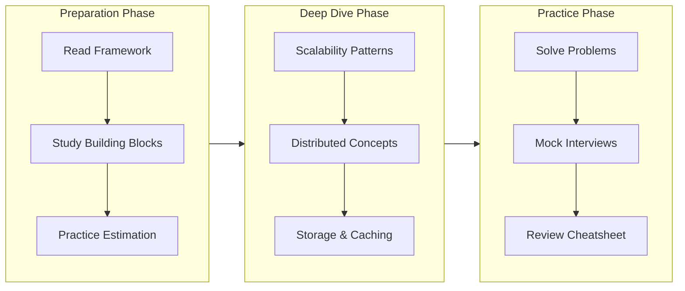
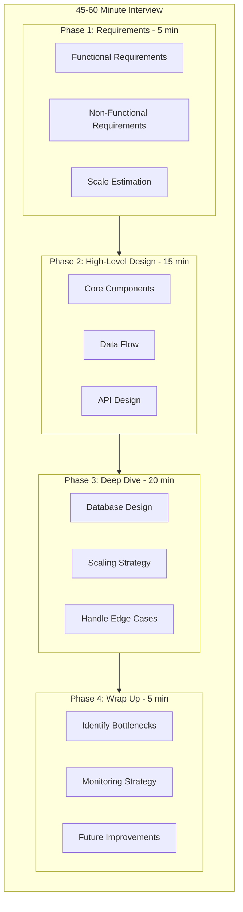

# System Design Interview Guide

A comprehensive, in-depth guide for mastering system design interviews at scale. This guide covers everything from the interview framework to core building blocks, scalability patterns, and real-world use cases.

## Table of Contents

| # | Topic | Description |
|---|-------|-------------|
| 01 | [Interview Framework](01-interview-framework.md) | Step-by-step approach to ace any system design interview |
| 02 | [Requirements & Estimation](02-requirements-estimation.md) | Back-of-envelope calculations and capacity planning |
| 03 | [Core Building Blocks](03-core-building-blocks.md) | Databases, caching, load balancers, and fundamental components |
| 04 | [Scalability Patterns](04-scalability-patterns.md) | Horizontal/vertical scaling, sharding, replication |
| 05 | [Distributed System Concepts](05-distributed-system-concepts.md) | CAP theorem, consistency models, consensus |
| 06 | [Data Storage Strategies](06-data-storage-strategies.md) | SQL vs NoSQL, partitioning, indexing |
| 07 | [Caching Strategies](07-caching-strategies.md) | Cache patterns, invalidation, CDNs |
| 08 | [Messaging & Async Patterns](08-messaging-async-patterns.md) | Message queues, event-driven architecture |
| 09 | [API Design & Gateway](09-api-design-gateway.md) | REST, GraphQL, gRPC, rate limiting |
| 10 | [Observability & Reliability](10-observability-reliability.md) | Monitoring, fault tolerance, disaster recovery |
| 11 | [Common Interview Problems](11-common-interview-problems.md) | URL shortener, chat, feed, and more |
| 12 | [Quick Reference Cheatsheet](12-quick-reference-cheatsheet.md) | One-page summary for quick review |

## How to Use This Guide

### For Beginners (2-4 weeks)
1. Start with [Interview Framework](01-interview-framework.md) to understand the structure
2. Study [Core Building Blocks](03-core-building-blocks.md) thoroughly
3. Practice [Requirements & Estimation](02-requirements-estimation.md)
4. Work through 3-4 problems in [Common Interview Problems](11-common-interview-problems.md)

### For Intermediate (1-2 weeks)
1. Review the framework and ensure you can articulate trade-offs
2. Focus on [Scalability Patterns](04-scalability-patterns.md) and [Distributed Concepts](05-distributed-system-concepts.md)
3. Deep dive into [Caching](07-caching-strategies.md) and [Messaging](08-messaging-async-patterns.md)
4. Practice all problems with time constraints

### For Quick Review (1-3 days)
1. Use the [Quick Reference Cheatsheet](12-quick-reference-cheatsheet.md)
2. Review key diagrams in each section
3. Practice verbal explanations

## Key Principles for Success

### The Golden Rules

1. **Always clarify before designing** - Never assume, always ask
2. **Start broad, then go deep** - High-level first, then zoom in
3. **Trade-offs over perfection** - There's no perfect solution
4. **Numbers matter** - Back your decisions with calculations
5. **Communicate continuously** - Think out loud

### Common Pitfalls to Avoid

| Pitfall | Why It's Bad | What to Do Instead |
|---------|--------------|-------------------|
| Jumping into solution | Shows lack of structure | Spend 3-5 min on requirements |
| Over-engineering | Wastes time, shows poor judgment | Start simple, scale when needed |
| Ignoring non-functional requirements | Misses critical constraints | Always ask about scale, latency, availability |
| Single point of failure | Shows inexperience | Always think redundancy |
| Not discussing trade-offs | Misses the point of the interview | Every decision should have a "because" |

## Related Resources in This Repository

This guide references real implementations you can explore:

| Implementation | Concepts Demonstrated |
|---------------|----------------------|
| [rate-limiter/](../rate-limiter/) | Token bucket, sliding window, Redis Lua scripts |
| [leaderboard/](../leaderboard/) | Redis sorted sets, real-time ranking |
| [url-shortener/](../url-shortener/) | Distributed ID generation, base62 encoding |
| [url-shortener-java/](../url-shortener-java/) | Same concepts in Java with Spring Boot |
| [uber-eats-feed-design/](../uber-eats-feed-design/) | Feed ranking, geospatial indexing |
| [distributed-system-architectural-patterns/](../distributed-system-architectural-patterns/) | Comprehensive pattern catalog |
| [jwt-auth/](../jwt-auth/) | Authentication, token management |

## The System Design Interview at a Glance

## Contributing

Feel free to add more examples, improve explanations, or add new sections. System design is a vast field, and this guide aims to be a living document.

---

**Pro Tip**: The best way to learn system design is to practice explaining designs out loud. Record yourself, identify gaps, and iterate.
