# Circuit Breaker — Deep Dive

In distributed systems, **cascading failures are the number one threat to availability.** A single slow or failing downstream service can exhaust thread pools, saturate connection queues, and bring down every service in the call chain — turning a localized issue into a system-wide outage. The circuit breaker pattern is the primary defense: it detects failures, short-circuits requests to unhealthy dependencies, and gives failing services time to recover — trading a small amount of availability for the survival of the entire system.

---

## The Cascading Failure Problem

When Service A calls Service B, and Service B calls Service C, a failure in C doesn't stay in C. Service B's threads block waiting for C's responses. Service B's thread pool fills up. Service A's requests to B start timing out. Service A's threads block. Within seconds, a single slow database or crashed downstream service can take down your entire microservices fleet.

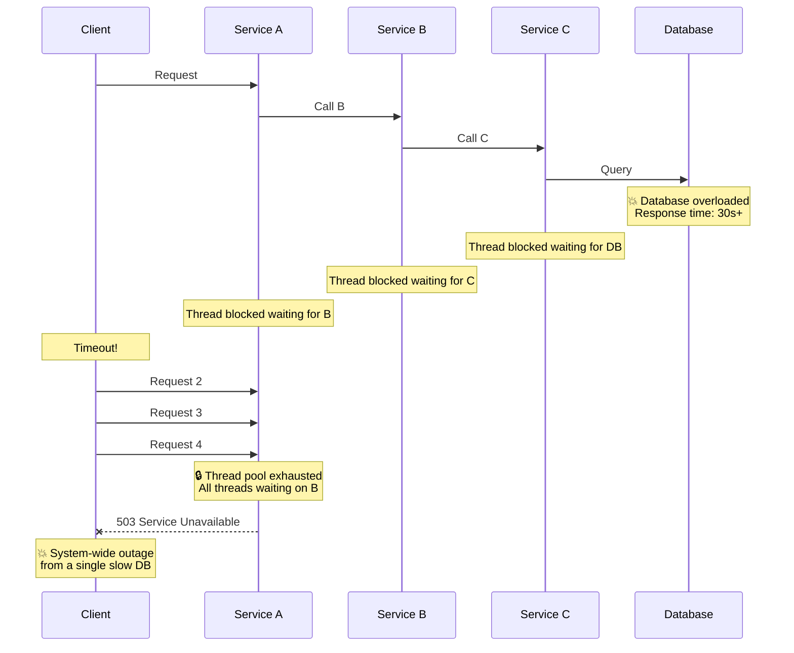

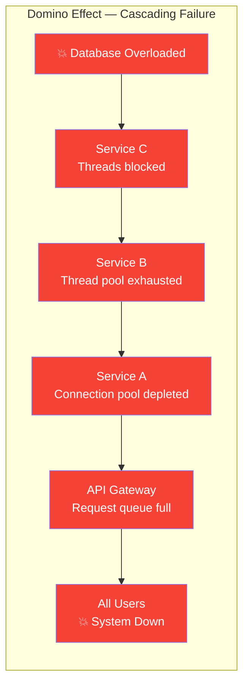

### Failure Propagation Mechanisms

| Mechanism | How It Kills Upstream | Time to Impact |
|-----------|----------------------|----------------|
| **Thread exhaustion** | Calling threads block on slow responses, consuming the entire thread pool | Seconds |
| **Connection pool depletion** | TCP connections to the failing service are held open, starving the pool | Seconds |
| **Memory pressure** | Queued requests and pending responses accumulate in memory | Seconds to minutes |
| **Retry storms** | Failed requests trigger retries, multiplying load on the already-failing service | Immediate |
| **Timeout accumulation** | Default or misconfigured timeouts (30s+) hold resources far longer than necessary | 10-60 seconds |
| **Health check failure** | Overwhelmed service fails health checks, triggering restarts and further instability | Minutes |

**The core problem:** failing slow is worse than failing fast. A service that returns errors in 2ms is far less dangerous than one that hangs for 30 seconds, because the fast failure releases resources immediately.

---

## What is a Circuit Breaker?

The circuit breaker pattern borrows directly from electrical engineering. A household circuit breaker monitors current flow — when it detects dangerous overcurrent (a short circuit), it **trips open**, breaking the circuit to prevent a fire. You fix the problem, then manually reset the breaker.

A software circuit breaker does the same thing for service-to-service calls: it monitors failure rates, and when failures exceed a threshold, it **trips open** — immediately rejecting all requests to the failing service instead of waiting for timeouts. After a cooldown period, it cautiously allows a few test requests through. If they succeed, the circuit closes and normal traffic resumes.

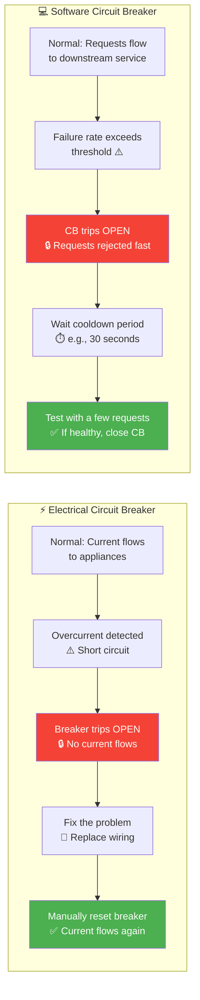

**Core principle:** Fail **fast** instead of fail **slow**. A rejected request in 1ms is infinitely better than a timed-out request in 30 seconds — it frees threads, connections, and memory immediately.

---

## The Three States

A circuit breaker is a state machine with three states: **CLOSED**, **OPEN**, and **HALF_OPEN**.

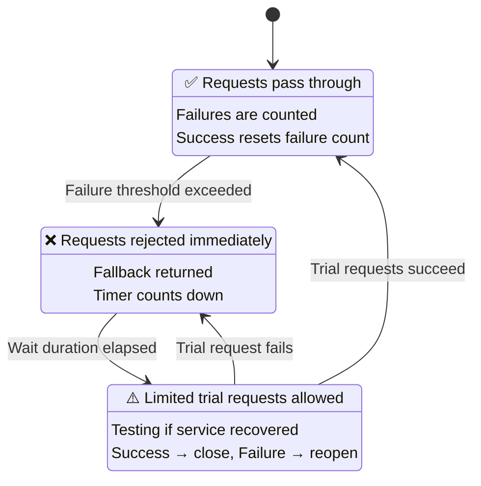

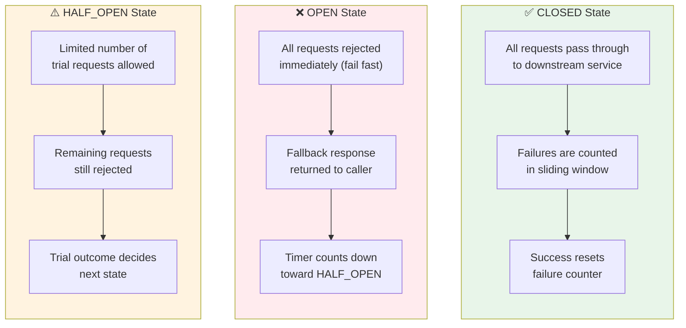

### State Comparison

| Aspect | CLOSED | OPEN | HALF_OPEN |
|--------|--------|------|-----------|
| **Requests allowed** | All | None | Limited trial count |
| **Calls downstream** | ✅ Yes | ❌ No | ⚠️ Trial requests only |
| **Metrics tracked** | Failure rate, slow call rate | Time since open | Trial success/failure |
| **On success** | Reset failure count | N/A | Transition to CLOSED |
| **On failure** | Increment failure count | N/A | Transition back to OPEN |
| **Transition condition** | Failure rate > threshold | Wait duration elapsed | Trial outcome |
| **Thread impact** | Normal | Zero (instant rejection) | Minimal |

---

## How It Works — Step by Step

### 1. Normal Operation (CLOSED)

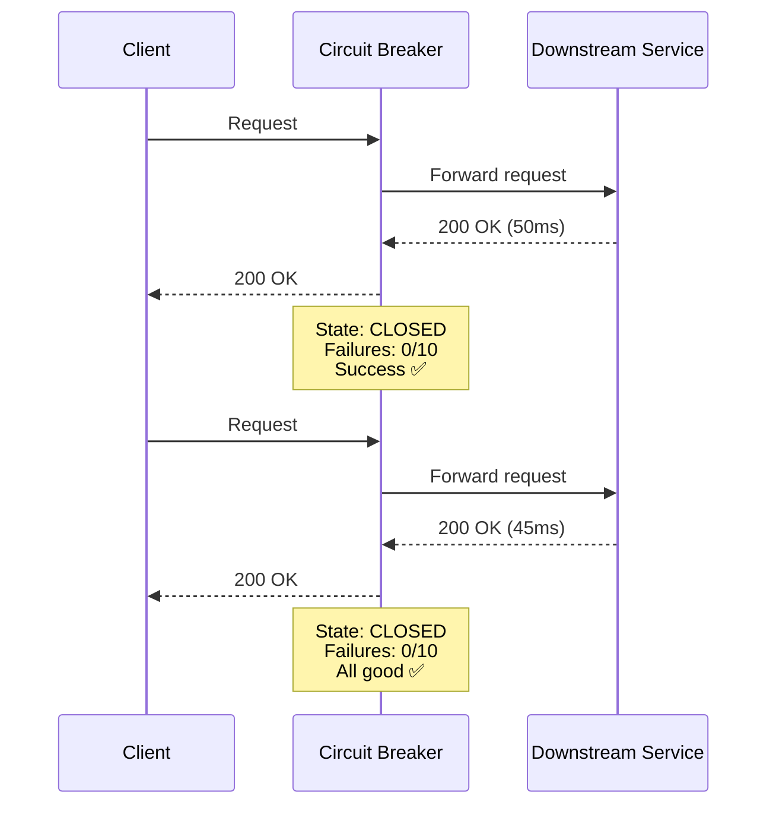

### 2. Failure Accumulation — Circuit Trips to OPEN

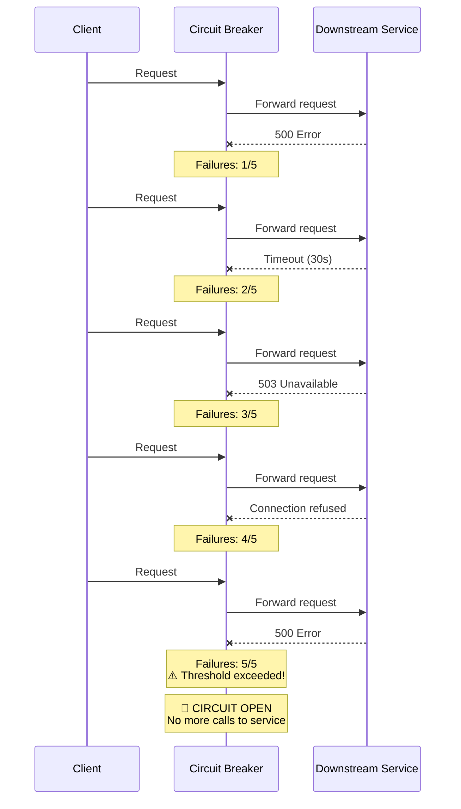

### 3. OPEN State — Fast Rejection

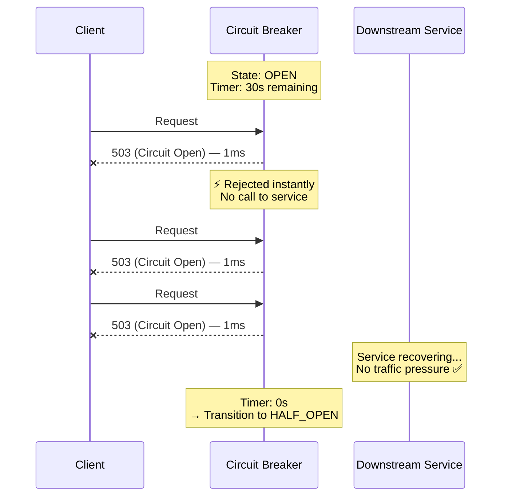

### 4. HALF_OPEN — Recovery Probe

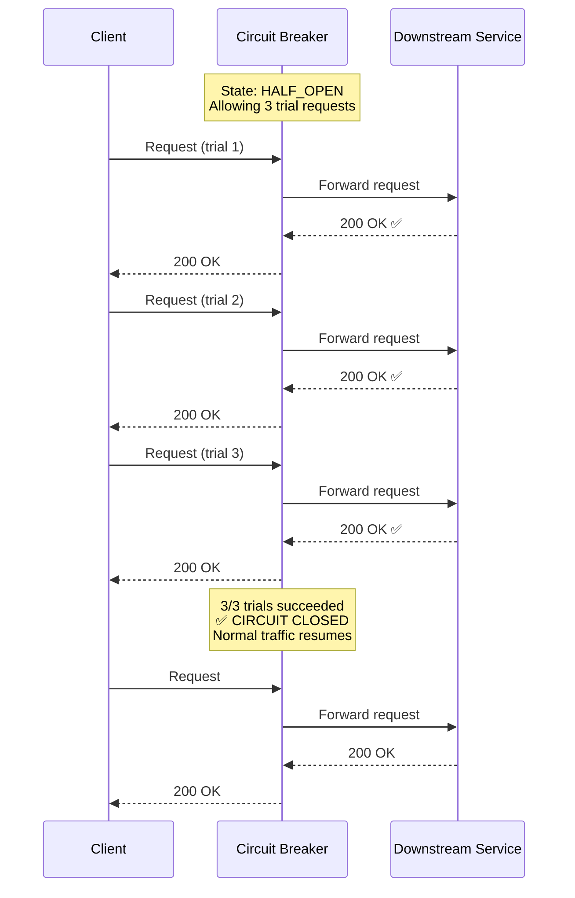

---

## Failure Detection Strategies

Not all failure detection is equal. The right strategy depends on your service's traffic patterns and failure modes.

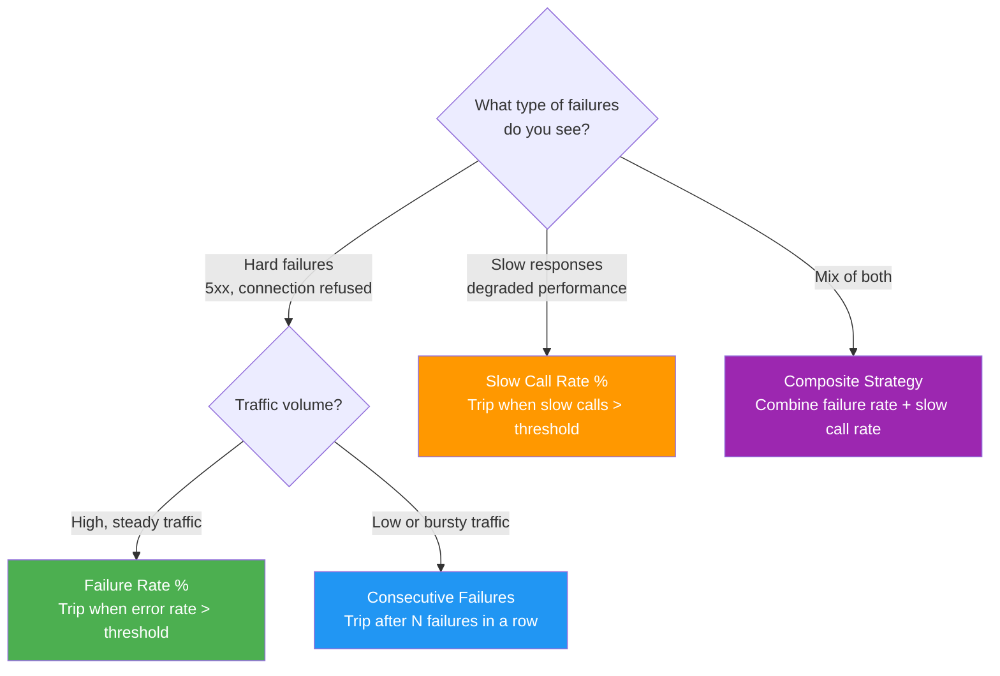

### Strategy Comparison

| Strategy | How It Works | Pros | Cons | Best For |
|----------|-------------|------|------|----------|
| **Consecutive failures** | Trip after N failures in a row | Simple, intuitive | Single success resets counter, slow to trip under mixed traffic | Low-traffic services, simple setups |
| **Failure rate %** | Trip when failure rate exceeds threshold in sliding window | Statistically robust, handles mixed results | Needs minimum call volume to avoid noise | High-traffic services, production systems |
| **Slow call rate %** | Trip when % of calls exceeding duration threshold is too high | Catches degradation before hard failures | Must tune duration threshold carefully | Latency-sensitive services |
| **Composite** | Combine failure rate + slow call rate | Catches both hard failures and degradation | More configuration, harder to reason about | Critical services needing comprehensive protection |

---

## Configuration Parameters

Getting the configuration right is critical. Too sensitive and the circuit breaker trips on transient blips (false positives). Too lenient and it doesn't trip until the damage is done.

### Key Parameters

| Parameter | Description | Typical Value | Impact of Too Low | Impact of Too High |
|-----------|-------------|---------------|--------------------|--------------------|
| **failureRateThreshold** | % of failures that trips the circuit | 50% | False positives on transient errors | Trips too late, damage already done |
| **slowCallDurationThreshold** | Duration above which a call is "slow" | 2-5 seconds | Normal calls counted as slow | Truly slow calls aren't detected |
| **slowCallRateThreshold** | % of slow calls that trips the circuit | 80-100% | Trips on occasional slow calls | Ignores sustained degradation |
| **waitDurationInOpenState** | How long to stay OPEN before testing | 30-60 seconds | Hammers recovering service too soon | Unnecessarily long outage window |
| **slidingWindowSize** | Number of calls (or seconds) in the window | 10-100 calls | Not enough data, noisy | Slow to react to recent failures |
| **slidingWindowType** | COUNT_BASED or TIME_BASED | COUNT_BASED | — | — |
| **minimumNumberOfCalls** | Minimum calls before failure rate is calculated | 10-20 | Trips on first few failures | Slow to detect problems |
| **permittedNumberOfCallsInHalfOpenState** | Trial requests allowed in HALF_OPEN | 3-10 | Single request decides fate | Too much trial traffic to a fragile service |

### Sliding Window Types

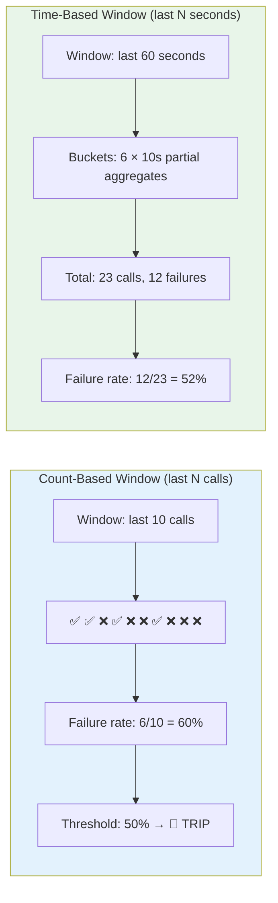

| Aspect | Count-Based | Time-Based |
|--------|-------------|------------|
| **Window unit** | Last N calls | Last N seconds |
| **Memory** | Fixed array of N results | N partial aggregation buckets |
| **Low traffic** | Window spans long time periods | Window always covers N seconds |
| **High traffic** | Window refreshes quickly | May aggregate many calls per bucket |
| **Best for** | Consistent traffic volumes | Variable or bursty traffic |

---

## Implementation Patterns

Circuit breakers can be implemented at different layers of your architecture, each with different trade-offs.

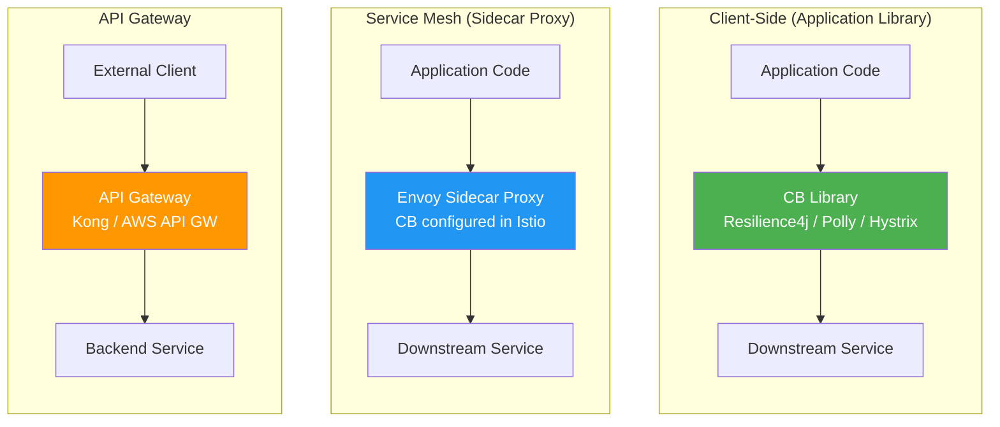

### Pattern Comparison

| Aspect | Client-Side Library | Service Mesh | API Gateway |
|--------|-------------------|--------------|-------------|
| **Examples** | Resilience4j, Polly, Hystrix | Envoy/Istio, Linkerd | Kong, AWS API Gateway |
| **Granularity** | Per-endpoint, per-host | Per-service, per-route | Per-route |
| **Language dependency** | Yes (Java, .NET, etc.) | No (infrastructure-level) | No |
| **Deployment** | In application process | Sidecar per pod | Centralized |
| **Customization** | Full (custom fallbacks, listeners) | Limited (config-driven) | Limited |
| **Performance overhead** | Minimal (in-process) | Low (local proxy) | Higher (network hop) |
| **Operational complexity** | Low | High (mesh infrastructure) | Medium |
| **Best for** | Fine-grained control, complex fallback logic | Polyglot environments, uniform policy | Edge protection, external APIs |

### Granularity Levels

| Level | Description | When to Use |
|-------|-------------|-------------|
| **Per-endpoint** | Separate CB for each API endpoint (e.g., `/users`, `/orders`) | Different endpoints have different failure profiles |
| **Per-host** | Separate CB for each downstream host instance | One host may be unhealthy while others are fine |
| **Per-service** | Single CB for entire downstream service | Simple setups, service fails as a whole |
| **Per-operation** | CB per business operation (may span multiple calls) | Complex orchestrations with distinct failure domains |

---

## Circuit Breaker + Retry + Timeout Trifecta

Circuit breakers rarely operate alone. The combination of **Timeout**, **Circuit Breaker**, and **Retry** forms the resilience trifecta. The order in which they are layered matters.

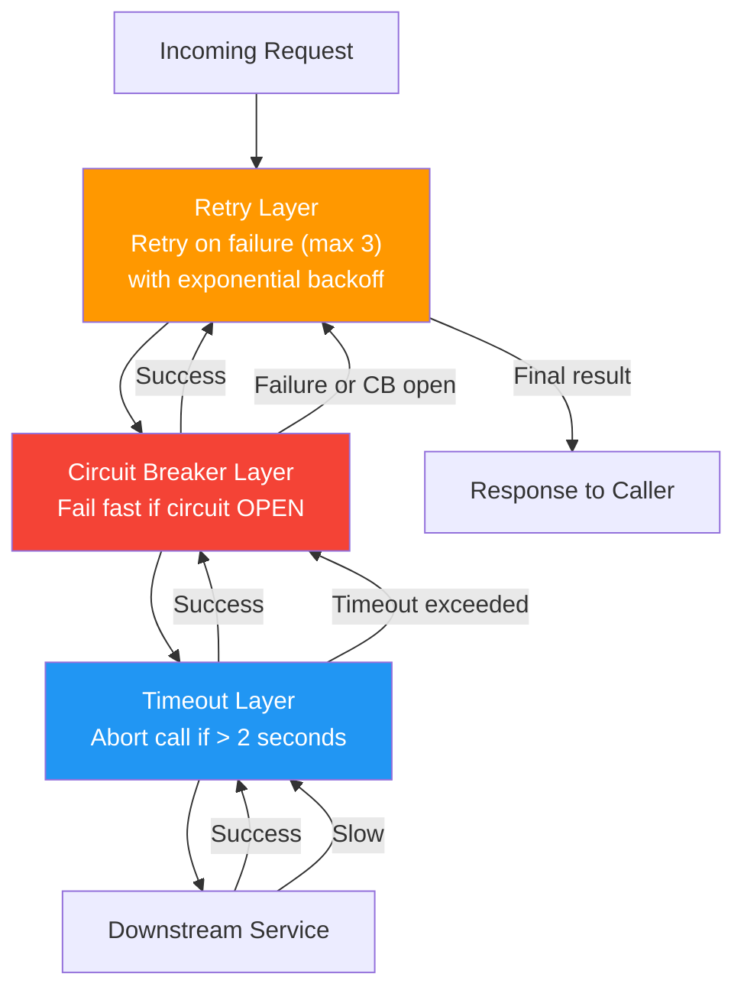

**Layering order:** Retry wraps Circuit Breaker wraps Timeout

```java
// Resilience4j — Decorator Composition (Java)
Supplier<Response> decoratedSupplier = Decorators.ofSupplier(
        () -> callDownstreamService(request))
    .withTimeout(Duration.ofSeconds(2))          // innermost: abort slow calls
    .withCircuitBreaker(circuitBreaker)           // middle: fail fast if open
    .withRetry(retry)                             // outermost: retry failures
    .withFallback(List.of(
        CallNotPermittedException.class,          // CB open
        TimeoutException.class,                   // call timed out
        IOException.class                         // network error
    ), e -> fallbackResponse(e))
    .decorate();
```

### Scenario Matrix

| Scenario | Timeout | Circuit Breaker | Retry | What Happens |
|----------|---------|-----------------|-------|--------------|
| Service responds in 100ms | ✅ Pass | ✅ CLOSED, pass | Not needed | Success on first attempt |
| Service responds in 5s | ❌ Timeout at 2s | Records failure | ⚠️ Retries (up to 3x) | May succeed on retry, or all retries timeout |
| Service returns 500 | ✅ Pass | Records failure | ⚠️ Retries | May succeed on retry if transient |
| CB is OPEN | N/A | ❌ Rejected immediately | ⚠️ Retries hit CB again | All retries rejected by CB, fallback returned |
| Service is down | ❌ Connection refused | Records failure | ⚠️ Retries | All retries fail, CB eventually trips OPEN |
| Service is slow, CB trips | ❌ Timeout | 🔴 Trips OPEN | Stops retrying | Fast failure, fallback returned |

---

## Fallback Strategies

When the circuit breaker is open, you must decide what to return to the caller. The right fallback depends on the use case.

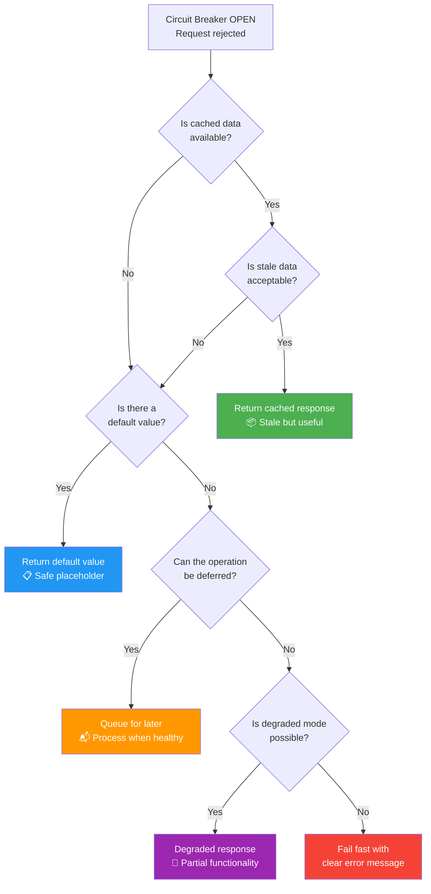

### Fallback Strategy Selection

| Strategy | Description | Example | Best For |
|----------|-------------|---------|----------|
| **Cached response** | Return last known good response | Product catalog from cache | Read-heavy, infrequently changing data |
| **Default value** | Return a safe static value | Empty recommendations list, default config | Non-critical features |
| **Degraded mode** | Return partial data or reduced functionality | Show product without reviews, disable suggestions | Composite pages with optional sections |
| **Queue for later** | Accept the request and process asynchronously | Queue order for processing when service recovers | Write operations that can tolerate delay |
| **Fail fast** | Return a clear error immediately | 503 with retry-after header | Operations where partial data is worse than no data |
| **Alternative service** | Route to a backup or secondary service | Failover to secondary payment processor | Mission-critical operations with redundancy |

---

## Bulkhead + Circuit Breaker

The **bulkhead pattern** isolates resources (thread pools, connection pools) per downstream dependency. Combined with circuit breakers, this prevents a slow dependency from consuming resources shared by other dependencies.

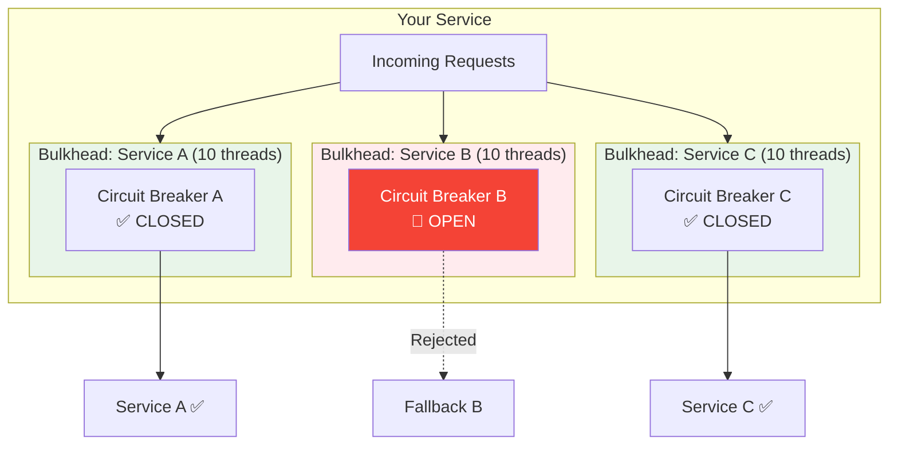

**Without bulkhead:** Service B's slowness exhausts the shared thread pool, blocking calls to healthy Services A and C.

**With bulkhead:** Service B can only consume its allocated 10 threads. Services A and C are unaffected. The circuit breaker on B trips open, failing fast so even those 10 threads are freed.

| Aspect | Without Bulkhead | With Bulkhead |
|--------|-----------------|---------------|
| **Resource isolation** | Shared pool — one bad dependency starves others | Dedicated pools — failures are contained |
| **Blast radius** | Entire service | Only the affected dependency |
| **Thread utilization** | Slow dependency hogs all threads | Slow dependency limited to its allocation |
| **Circuit breaker synergy** | CB trips too late (threads already exhausted) | CB trips per-pool, freed threads serve other traffic |
| **Complexity** | Simple | Must size each pool correctly |

---

## Monitoring & Observability

A circuit breaker you cannot observe is a circuit breaker that will surprise you in production. Every state transition, every rejection, every fallback should be a metric, a log, and potentially an alert.

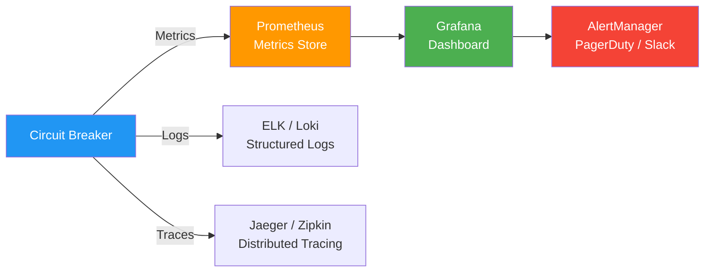

### Metrics to Emit

| Metric | Type | Labels | Purpose |
|--------|------|--------|---------|
| `circuit_breaker_state` | Gauge | service, endpoint | Current state (0=CLOSED, 1=OPEN, 2=HALF_OPEN) |
| `circuit_breaker_calls_total` | Counter | service, endpoint, result | Total calls (success, failure, rejected) |
| `circuit_breaker_failure_rate` | Gauge | service, endpoint | Current failure rate percentage |
| `circuit_breaker_state_transitions_total` | Counter | service, endpoint, from, to | State transition count |
| `circuit_breaker_slow_calls_total` | Counter | service, endpoint | Calls exceeding duration threshold |
| `circuit_breaker_not_permitted_calls_total` | Counter | service, endpoint | Calls rejected while OPEN |
| `circuit_breaker_call_duration_seconds` | Histogram | service, endpoint | Call latency distribution |

### Prometheus Alert Rule

```yaml
# Alert when a circuit breaker is OPEN for more than 5 minutes
groups:
  - name: circuit_breaker_alerts
    rules:
      - alert: CircuitBreakerOpen
        expr: circuit_breaker_state == 1
        for: 5m
        labels:
          severity: critical
        annotations:
          summary: "Circuit breaker OPEN for {{ $labels.service }}/{{ $labels.endpoint }}"
          description: "CB has been open for 5+ minutes. Downstream service may be down."
          runbook: "https://wiki.internal/runbooks/circuit-breaker-open"

      - alert: CircuitBreakerHighFailureRate
        expr: circuit_breaker_failure_rate > 30
        for: 2m
        labels:
          severity: warning
        annotations:
          summary: "High failure rate ({{ $value }}%) for {{ $labels.service }}"
          description: "Failure rate exceeds 30%. Circuit breaker may trip soon."
```

---

## Common Pitfalls

### ❌ Wrong Granularity

```
❌ Single circuit breaker for ALL downstream calls
   → One slow endpoint trips the breaker for healthy endpoints

✅ Per-endpoint or per-host circuit breakers
   → Failures are isolated to the affected endpoint
```

### ❌ No Fallback Strategy

```
❌ Circuit breaker trips → 500 error to user
   → Same user experience as having no circuit breaker

✅ Circuit breaker trips → cached/degraded/default response
   → User sees reduced but functional experience
```

### ❌ Timeout Misconfiguration

```
❌ CB timeout: 30s, downstream SLA: 200ms
   → Threads blocked for 30s before CB even counts it as failure

✅ CB timeout: 2s (10x the P99 latency)
   → Fast failure detection, resources freed quickly
```

### ❌ Shared State in Distributed Circuit Breaker

```
❌ Each instance has its own CB → Instance A's circuit open, Instance B still sending traffic
   → Inconsistent behavior, delayed protection

✅ Understand the trade-off: local CBs are simpler, distributed CBs are more consistent
   → Choose based on your failure patterns
```

### ❌ Not Monitoring State Transitions

```
❌ CB silently trips and recovers — no one knows
   → Intermittent failures go undetected, capacity issues hidden

✅ Alert on every OPEN transition, dashboard shows CB state history
   → Team investigates root cause, not just symptoms
```

### ❌ Half-Open Trial Count Too Low

```
❌ permittedCallsInHalfOpen = 1 → single request decides fate
   → One lucky/unlucky request opens or closes the circuit incorrectly

✅ permittedCallsInHalfOpen = 5-10 → statistically meaningful sample
   → Confident recovery or confirmed continued failure
```

---

## Distributed Circuit Breaker

In a standard deployment, each service instance maintains its own circuit breaker state. This works well when all instances see similar failure rates, but causes problems when failures are unevenly distributed.

### The Problem

```
Instance 1: 100 calls → 60 failures → CB OPEN  ✅ Protected
Instance 2: 100 calls → 60 failures → CB OPEN  ✅ Protected
Instance 3:   5 calls →  2 failures → CB CLOSED ❌ Still sending traffic!
Instance 4:   3 calls →  0 failures → CB CLOSED ❌ Still sending traffic!
```

Instances 3 and 4 have too few calls to trip their local circuit breakers, so they keep sending traffic to the failing service. Meanwhile, Instances 1 and 2 have already detected the problem.

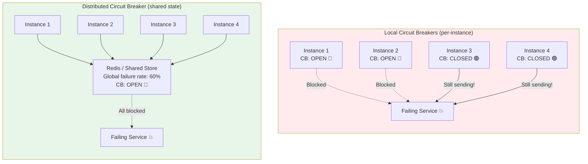

### Local vs. Distributed Trade-offs

| Aspect | Local CB | Distributed CB |
|--------|----------|----------------|
| **Consistency** | Each instance independent — may disagree | All instances share same state |
| **Latency** | Zero overhead (in-process) | Extra round-trip to shared store |
| **Complexity** | Simple, no external dependencies | Requires Redis/ZooKeeper + consensus |
| **Failure of CB store** | N/A | CB itself becomes a dependency — fallback to local |
| **Detection speed** | Fast for high-traffic instances, slow for low-traffic | Fast — aggregated view across all instances |
| **Best for** | Most services, homogeneous traffic distribution | Critical paths, heterogeneous traffic, low-traffic instances |

---

## Real-World Implementations

| Library / Platform | Language / Layer | CB Model | Notable Features |
|--------------------|-----------------|----------|------------------|
| **Netflix Hystrix** | Java | Client-side (deprecated) | Pioneered the pattern; thread pool isolation, dashboard |
| **Resilience4j** | Java | Client-side | Hystrix successor; lightweight, functional, modular |
| **Polly** | .NET | Client-side | Fluent API, policy composition, async support |
| **Envoy / Istio** | Service mesh | Sidecar proxy | Outlier detection, automatic ejection, no code changes |
| **Linkerd** | Service mesh | Sidecar proxy | Success-rate based failure detection |
| **AWS App Mesh** | Service mesh | Managed mesh | Envoy-based, integrated with AWS services |
| **Spring Cloud CB** | Java | Client-side | Resilience4j integration with Spring Boot auto-config |
| **Sentinel (Alibaba)** | Java | Client-side | Flow control + circuit breaking + system load protection |
| **Opossum** | Node.js | Client-side | Event-driven, Prometheus metrics built-in |
| **gRPC** | Multi-language | Built-in | Client-side load balancing with health checking |

---

## Pros and Cons

### Pros

| Advantage | Detail |
|-----------|--------|
| **Prevents cascading failures** | Stops a single failing service from taking down the entire system |
| **Fails fast** | Returns errors in milliseconds instead of waiting for timeouts (seconds) |
| **Automatic recovery** | HALF_OPEN state probes the downstream service, closing the circuit when it recovers |
| **Resource protection** | Frees threads, connections, and memory that would otherwise be blocked |
| **Load shedding** | Stops traffic to a struggling service, giving it time to recover |
| **Improved user experience** | Fallback responses (cached data, defaults) are better than hanging requests |
| **Observable** | State transitions and rejection counts provide clear signals for monitoring and alerting |
| **Composable** | Layers cleanly with retry, timeout, bulkhead, and fallback patterns |

### Cons

| Disadvantage | Detail |
|--------------|--------|
| **False positives** | Misconfigured thresholds trip the circuit on transient errors, rejecting valid requests |
| **Configuration complexity** | Many parameters to tune (thresholds, windows, timers) — poor defaults cause harm |
| **Testing difficulty** | Hard to simulate realistic failure scenarios; CB behavior depends on timing and state |
| **Partial outage risk** | OPEN circuit rejects all requests to a service, even if only one endpoint is failing |
| **Fallback staleness** | Cached fallback data may be outdated, leading to incorrect results |
| **Cold start issues** | After deployment, CB has no data — `minimumNumberOfCalls` prevents premature tripping but delays detection |
| **Distributed state challenge** | Per-instance CBs may disagree; shared-state CBs add infrastructure complexity |
| **Hidden failures** | If fallbacks mask failures transparently, real problems may go unnoticed without monitoring |

---

## When to Use

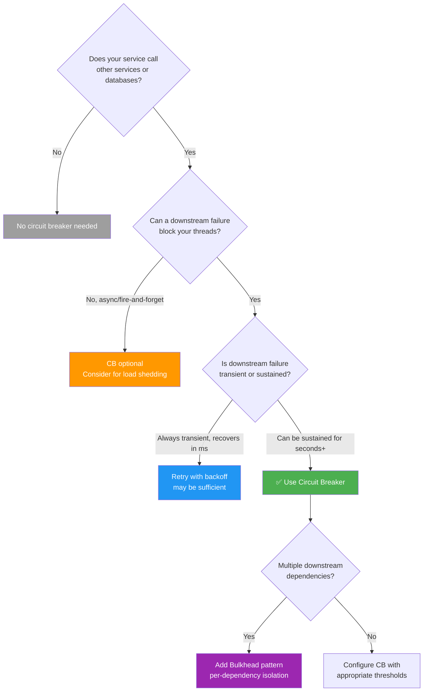

### Use Circuit Breaker When

- **Synchronous service-to-service calls** where downstream failure blocks threads
- **Database calls** to databases that may become overloaded or unreachable
- **Third-party API calls** with unpredictable availability (payment gateways, email services)
- **Any call where timeout > 1 second** and thread pool is finite
- **Microservices architectures** where cascading failures are a realistic threat
- **Services with SLA requirements** that cannot afford propagated downtime
- **Load-sensitive downstream services** that need back-pressure to recover

### Do NOT Use Circuit Breaker When

- **Fire-and-forget async messaging** — message broker handles retries and backpressure
- **In-process function calls** — no network failure, no thread blocking
- **Static resource loading** — file reads, config loading (retry is sufficient)
- **Human-initiated retries** — user can click again, no thread exhaustion risk
- **Event-driven architectures with dead letter queues** — messages are retried from the queue
- **Extremely low-traffic services** — not enough calls to build meaningful failure statistics

---

## Key Takeaways for System Design Interviews

1. **Circuit breaker prevents cascading failures** — mention it whenever the interviewer introduces a synchronous service dependency. It is the first line of defense against thread pool exhaustion and system-wide outages.

2. **Know the three states cold: CLOSED → OPEN → HALF_OPEN** — draw the state machine, explain transitions, and describe what happens to requests in each state. This demonstrates depth.

3. **Fail fast is the core principle** — a rejected request in 1ms is better than a timed-out request in 30s. Fast failure frees threads, reduces memory pressure, and enables fallbacks.

4. **Always pair circuit breakers with fallbacks** — a circuit breaker without a fallback just converts a slow failure into a fast error. The real value comes from cached responses, default values, or graceful degradation.

5. **The Timeout → CB → Retry layering order matters** — timeout is innermost (abort slow calls), circuit breaker is middle (fail fast if service is down), retry is outermost (retry transient failures). Getting this wrong causes retry storms or ignored circuit breakers.

6. **Combine with bulkhead for multi-dependency isolation** — circuit breaker detects failure; bulkhead prevents resource contamination across dependencies. Together they contain blast radius.

7. **Failure rate % with a sliding window is the production-grade detection strategy** — consecutive failure counting is too naive for real traffic. Mention `slidingWindowSize`, `failureRateThreshold`, and `minimumNumberOfCalls`.

8. **Per-instance vs. distributed circuit breaker is a real trade-off** — local CBs are simpler but may disagree; distributed CBs (Redis-backed) are consistent but add a dependency. Know when each is appropriate.

9. **Monitoring is mandatory, not optional** — every CB state transition should emit a metric and trigger an alert. Without observability, circuit breakers silently mask failures.

10. **Mention real implementations** — Resilience4j for Java, Polly for .NET, Envoy/Istio for service mesh. This shows you've worked with these patterns, not just read about them.

11. **Circuit breaker is for synchronous calls** — in event-driven architectures with message brokers, back-pressure and dead letter queues serve a similar role. Don't blindly apply CBs to async messaging.

12. **Configuration is where most teams get it wrong** — thresholds too high miss real failures, too low cause false positives. Slow-call detection catches degradation before hard failures. Stress that tuning requires production traffic analysis.

---

## Related Concepts

- **[SAGA Pattern](./saga-pattern.md)** — Circuit breakers protect individual service calls within SAGA steps from cascading failures
- **[Idempotency](./idempotency.md)** — Retries after circuit breaker recovery require idempotent handlers to avoid duplicate processing
- **[Kafka Communication Patterns](./kafka-communication-patterns.md)** — Async messaging reduces the need for circuit breakers by decoupling producers and consumers
- **[Wallet & Ledger System](./wallet-ledger-system.md)** — Financial systems use circuit breakers to protect payment processing from downstream failures
- **Retry Pattern** — Complements circuit breaker; retries handle transient failures while CB handles sustained ones
- **Timeout Pattern** — Innermost layer of the resilience trifecta; prevents slow calls from blocking indefinitely
- **Bulkhead Pattern** — Resource isolation that pairs with circuit breaker to contain blast radius
- **Rate Limiting** — Controls inbound traffic volume; circuit breaker controls outbound call volume to failing services
- **Service Mesh** — Infrastructure-level circuit breaking via sidecar proxies (Envoy, Linkerd) without code changes
- **Chaos Engineering** — Validates circuit breaker behavior by injecting controlled failures (Netflix Chaos Monkey)
