# Database Partitioning & Sharding — Deep Dive

Every database hits a wall — storage, throughput, or latency. **Partitioning** splits data within a single engine; **sharding** distributes across multiple engines. Most engineers conflate them. Getting the distinction wrong costs interviews; getting the shard key wrong costs millions.

---

## The Distinction That Matters

Partitioning and sharding both divide data into subsets, but they operate at fundamentally different levels. **Partitioning** is a single database engine managing multiple storage units — the query planner knows about all partitions and can prune, join, and transact across them transparently. **Sharding** is multiple independent database engines, each owning a disjoint subset of data — there is no shared query planner, no free cross-shard joins, and no single-engine transactions.

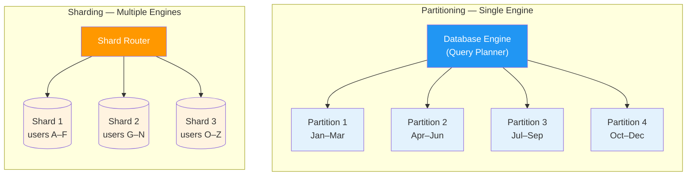

The progression from a single node to a globally distributed system is a spectrum, not a binary choice:

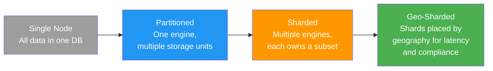

### Head-to-Head Comparison

| Aspect | Partitioning | Sharding |
|--------|-------------|----------|
| **Engines** | Single database engine | Multiple independent engines |
| **Query planner** | Unified — sees all partitions, prunes automatically | None — application or router must target the correct shard |
| **Joins** | Transparent across partitions | Expensive scatter-gather or app-level join |
| **Transactions** | Normal ACID within the engine | Distributed transactions (2PC/SAGA) required |
| **Schema changes** | Single `ALTER TABLE` propagates to all partitions | Must coordinate schema migration across every shard |
| **Storage limit** | Bounded by single node disk | Horizontally scalable — add more nodes |
| **Write throughput** | Bounded by single engine's I/O | Scales linearly with shard count |
| **Operational complexity** | Low — managed by the DB engine | High — routing, rebalancing, monitoring per shard |
| **When to use** | Query acceleration, maintenance windows, data lifecycle | When single-node capacity is exhausted |

---

## Partitioning Strategies — Within a Single Database

Partitioning divides a table's data into smaller, more manageable pieces while the database engine maintains a unified view. The two major categories are **horizontal** (splitting rows) and **vertical** (splitting columns).

### Horizontal Partitioning

Horizontal partitioning distributes rows across partitions based on a partition key. The four common methods:

- **Range**: Rows assigned by key ranges (e.g., date intervals). Excellent for time-series, but prone to hot partitions on recent data.
- **List**: Rows assigned by explicit value lists (e.g., country codes). Good for known, fixed categories.
- **Hash**: Rows assigned by `hash(key) % N`. Even distribution, but no range query pruning.
- **Composite**: Combines methods — e.g., range by year, then hash by user_id within each year.

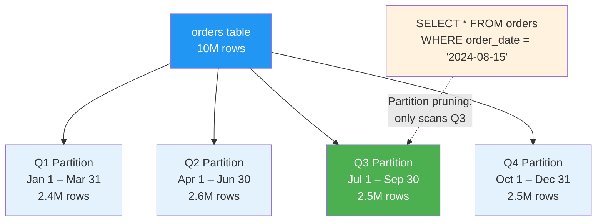

### Vertical Partitioning

Vertical partitioning splits columns into separate tables — keeping frequently accessed "hot" columns together and pushing rarely accessed "cold" columns elsewhere. This improves cache efficiency because rows in the hot table are smaller, so more fit per page.

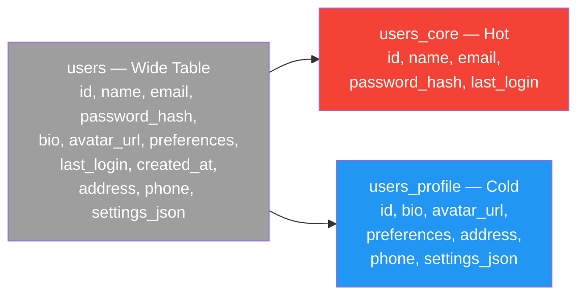

### Horizontal Partitioning Methods Comparison

| Method | Key Example | Distribution Logic | Range Query Pruning | Best For |
|--------|-------------|-------------------|---------------------|----------|
| **Range** | `order_date` | Rows fall into contiguous key ranges | ✅ Excellent | Time-series, date-based analytics |
| **List** | `country_code` | Rows assigned by explicit value sets | ✅ On list values | Regional data, known categories |
| **Hash** | `user_id` | `hash(key) % N` assigns partition | ❌ None | Even distribution, point lookups |
| **Composite** | `(year, user_id)` | Range first, then hash within range | ✅ On outer key | Large multi-dimensional datasets |

### When to Use Each Strategy

| Strategy | When to Use | When NOT to Use |
|----------|-------------|-----------------|
| **Range partitioning** | Time-series data, archival/purge by date, queries filter by range | Data is not naturally ordered; risk of hot partition on recent data |
| **List partitioning** | Fixed categories (regions, tenants, product types) | Categories change frequently or have skewed sizes |
| **Hash partitioning** | Need even distribution; point lookups dominate | Range queries are primary access pattern |
| **Vertical partitioning** | Wide tables with clear hot/cold column split | All columns are accessed together in most queries |
| **Composite** | Multi-dimensional access patterns, petabyte-scale | Over-engineering for tables under 100M rows |

### PostgreSQL Range Partitioning

```sql
CREATE TABLE orders (
    id          BIGSERIAL,
    user_id     BIGINT NOT NULL,
    amount      DECIMAL(12,2) NOT NULL,
    order_date  DATE NOT NULL,
    status      VARCHAR(20)
) PARTITION BY RANGE (order_date);

CREATE TABLE orders_2024_q1 PARTITION OF orders
    FOR VALUES FROM ('2024-01-01') TO ('2024-04-01');
CREATE TABLE orders_2024_q2 PARTITION OF orders
    FOR VALUES FROM ('2024-04-01') TO ('2024-07-01');
CREATE TABLE orders_2024_q3 PARTITION OF orders
    FOR VALUES FROM ('2024-07-01') TO ('2024-10-01');
CREATE TABLE orders_2024_q4 PARTITION OF orders
    FOR VALUES FROM ('2024-10-01') TO ('2025-01-01');
```

### MySQL Hash Partitioning

```sql
CREATE TABLE sessions (
    id          BIGINT AUTO_INCREMENT,
    user_id     BIGINT NOT NULL,
    session_data JSON,
    created_at  TIMESTAMP DEFAULT CURRENT_TIMESTAMP,
    PRIMARY KEY (id, user_id)
) PARTITION BY HASH(user_id) PARTITIONS 16;
```

---

## Sharding Strategies — Across Multiple Nodes

When a single database engine cannot handle the load — storage exceeds single-node disk, write throughput saturates I/O, or backup/recovery windows become unacceptable — you distribute data across multiple engines. Each engine (shard) owns a disjoint subset of data and operates independently.

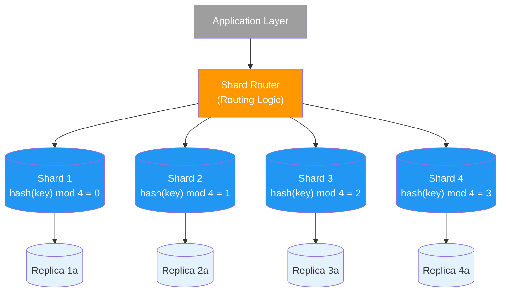

### The Modulo Problem

Hash-modulo sharding (`hash(key) % N`) is simple but brittle. When you add a shard (4 → 5), approximately 80% of keys remap to different shards, triggering massive data movement:

```mermaid
flowchart LR
    subgraph before ["4 Shards — hash mod 4"]
        direction TB
        B0["Shard 0<br/>keys: 0,4,8,12,16,20"]
        B1["Shard 1<br/>keys: 1,5,9,13,17,21"]
        B2["Shard 2<br/>keys: 2,6,10,14,18,22"]
        B3["Shard 3<br/>keys: 3,7,11,15,19,23"]
    end

    subgraph after ["5 Shards — hash mod 5"]
        direction TB
        A0["Shard 0<br/>keys: 0,5,10,15,20"]
        A1["Shard 1<br/>keys: 1,6,11,16,21"]
        A2["Shard 2<br/>keys: 2,7,12,17,22"]
        A3["Shard 3<br/>keys: 3,8,13,18,23"]
        A4["Shard 4<br/>keys: 4,9,14,19"]
    end

    before -->|"~80% keys move<br/>massive redistribution"| after

    style B0 fill:#e3f2fd
    style B1 fill:#e3f2fd
    style B2 fill:#e3f2fd
    style B3 fill:#e3f2fd
    style A0 fill:#ffebee
    style A1 fill:#ffebee
    style A2 fill:#ffebee
    style A3 fill:#ffebee
    style A4 fill:#ffebee
```

### Sharding Strategies Comparison

| Strategy | Routing Logic | Data Distribution | Resharding Cost | Best For |
|----------|--------------|-------------------|-----------------|----------|
| **Hash modulo** | `hash(key) % N` | Even if hash is uniform | ❌ ~80% keys move on resize | Fixed-size clusters that never grow |
| **Consistent hashing** | Hash ring with virtual nodes | Even with sufficient vnodes | ✅ ~1/N keys move | Dynamic clusters, auto-scaling |
| **Range-based** | Key ranges per shard (A–F, G–N, ...) | Uneven if data is skewed | ⚠️ Range splits required | Naturally ordered data, range scans |
| **Directory-based** | Lookup table maps key → shard | Controlled — any distribution | ⚠️ Directory is bottleneck | Complex routing rules, small key space |
| **Geo-based** | Region determines shard | By geography | ⚠️ Depends on user mobility | Latency-sensitive, data residency compliance |

---

## Shard Key Selection — The Most Critical Decision

The shard key determines how data is distributed, which queries are efficient, and whether you'll face operational nightmares at scale. A good shard key has four properties:

1. **High cardinality** — many distinct values to ensure fine-grained distribution
2. **Even distribution** — no single value dominates traffic
3. **Query isolation** — most queries target a single shard (no scatter-gather)
4. **Future-proofing** — the key remains effective as data and traffic grow

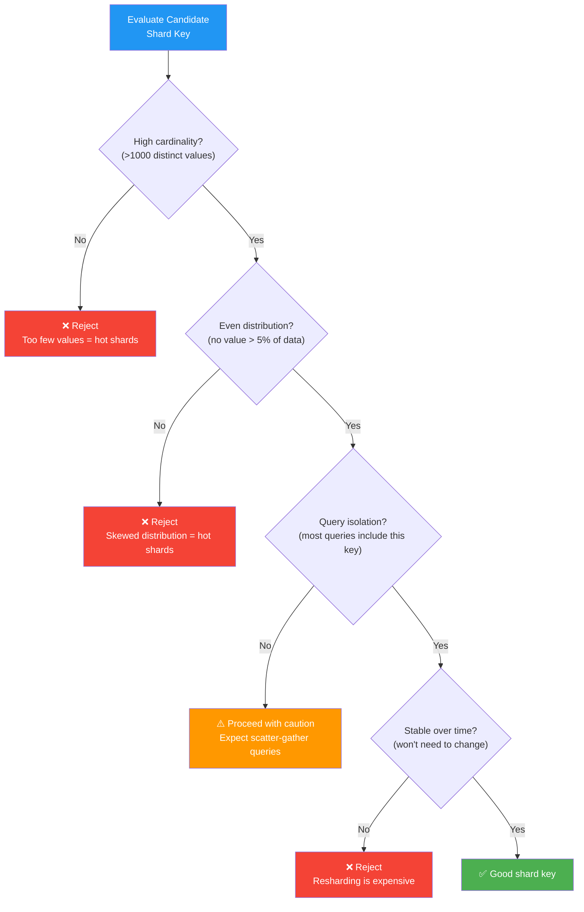

### The Hot Shard Problem

A bad shard key concentrates traffic on a few shards while others sit idle. The system's throughput is limited by the hottest shard, regardless of how many shards you add.

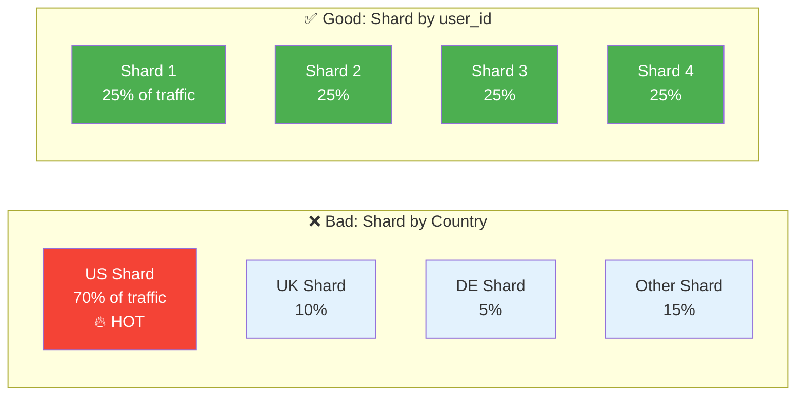

### Shard Key Evaluation for Common Systems

| System | Candidate Shard Key | Cardinality | Distribution | Query Isolation | Verdict |
|--------|-------------------|-------------|--------------|-----------------|---------|
| **Social media** | `user_id` | ✅ High | ✅ Even (with hash) | ✅ Most queries per-user | ✅ Good |
| **E-commerce** | `order_id` | ✅ High | ✅ Even | ⚠️ Customer queries scatter | ⚠️ OK for orders, bad for customer views |
| **Chat / messaging** | `conversation_id` | ✅ High | ⚠️ Group chats skew large | ✅ Messages per conversation | ✅ Good |
| **Analytics platform** | `timestamp` | ✅ High | ❌ Recent data is hot | ✅ Time-range queries | ⚠️ Hot partition on latest shard |
| **Multi-tenant SaaS** | `tenant_id` | ⚠️ Medium | ❌ Enterprise tenants dominate | ✅ Tenant isolation | ⚠️ Needs large-tenant splitting |
| **Ride-sharing** | `city_id` | ⚠️ Low-medium | ❌ NYC ≫ Omaha | ✅ Queries scoped to city | ⚠️ Hot cities need sub-sharding |

### Hot Shard Scenarios and Mitigations

| Scenario | Why It's Hot | Mitigation |
|----------|-------------|------------|
| **Celebrity user** | Single user_id generates millions of reads (fan-out) | Read replicas for hot accounts; cache celebrity profiles |
| **Flash sale** | Single product_id gets all writes for a short burst | Write buffer + async drain; pre-split the shard |
| **Time-based key** | Newest partition absorbs all writes | Composite key: `(user_id, timestamp)` distributes writes |
| **Large tenant** | One tenant has 100x more data than others | Dedicated shard for large tenants; sub-shard within tenant |
| **Geographic skew** | US shard has 10x traffic vs other regions | Sub-shard large regions by user_id hash |

> **Cross-reference:** The [Wallet & Ledger System](./wallet-ledger-system.md) discusses the hot account problem where a single treasury account participates in every transaction, requiring dedicated sharding strategies.

---

## Consistent Hashing — Deep Dive

Consistent hashing solves the fundamental problem of hash-modulo sharding: when you add or remove nodes, almost every key remaps. With consistent hashing, only `~1/N` keys move (where N is the number of nodes).

### Why Modulo Fails

With modulo hashing (`hash(key) % N`), changing N from 4 to 5 moves approximately 80% of keys. At petabyte scale with billions of keys, this means terabytes of data migration — potentially hours or days of reduced availability.

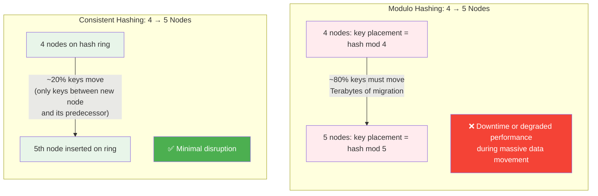

### The Hash Ring

Both nodes and keys are hashed onto a circular space (0 to 2^32 - 1). Each key is assigned to the first node encountered moving clockwise from the key's position on the ring.

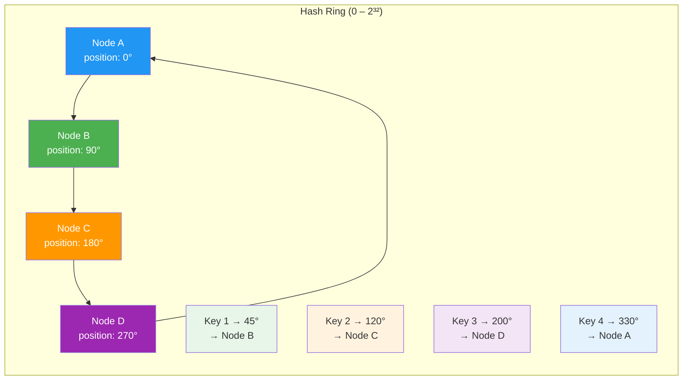

When a node is added, only the keys between the new node and its predecessor (counterclockwise neighbor) need to move. When a node is removed, only its keys move to the next clockwise node.

### Virtual Nodes

With only physical nodes on the ring, distribution is uneven — some nodes own larger arc segments than others. **Virtual nodes** (vnodes) solve this: each physical node maps to many positions on the ring. With 150+ vnodes per node, the standard deviation of load drops below 5%.

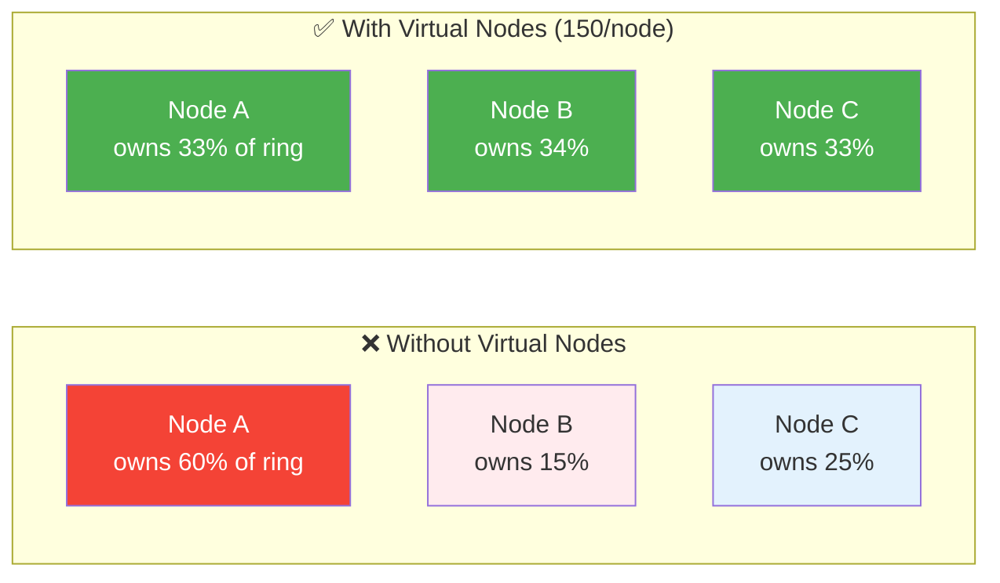

### Configuration Parameters

| Parameter | Typical Value | Impact |
|-----------|--------------|--------|
| **Vnodes per node** | 150–256 | More vnodes = more even distribution, but higher memory for ring metadata |
| **Hash function** | MD5, MurmurHash3, xxHash | Must be fast and uniformly distributed; cryptographic strength not needed |
| **Replication factor** | 3 | Each key stored on N successive nodes clockwise; trades storage for availability |
| **Token range** | 0 to 2^64 - 1 | Larger range = fewer collisions with more nodes |

### Data Movement Comparison

| Approach | Nodes: 4 → 5 | Nodes: 100 → 101 | Data Moved (1 PB total) |
|----------|--------------|-------------------|------------------------|
| **Modulo hashing** | ~80% keys move | ~99% keys move | ~800 TB – 990 TB |
| **Consistent hashing (no vnodes)** | ~25% keys move (uneven) | ~1% keys move (uneven) | Varies wildly by node |
| **Consistent hashing + vnodes** | ~20% keys move (even) | ~1% keys move (even) | ~200 TB evenly from all nodes |

---

## Cross-Shard Operations — The Hard Problems

Sharding buys you horizontal scalability, but every cross-shard operation is a tax you pay for that scalability. The four hardest problems: scatter-gather queries, cross-shard joins, distributed transactions, and global secondary indexes.

### Scatter-Gather Queries

When a query cannot be routed to a single shard (e.g., "find all orders over $1000"), the router must fan out to every shard, collect results, merge, sort, and return. Latency is determined by the slowest shard.

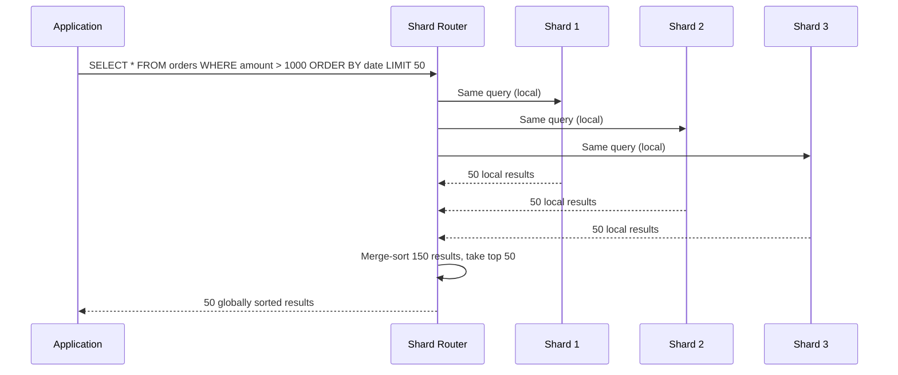

### Cross-Shard Transaction Decision Tree

When a business operation spans multiple shards, you must choose how to handle atomicity:

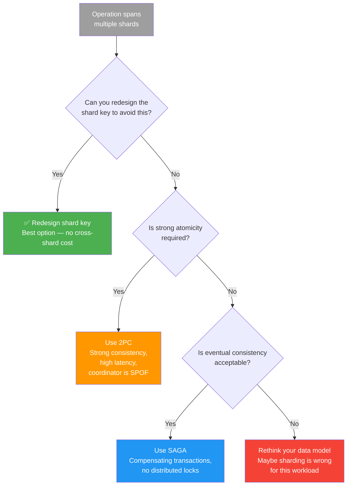

> **Cross-references:** See [Two-Phase Commit](./two-phase-commit.md) for coordinator-based atomic commits and [SAGA Pattern](./saga-pattern.md) for compensation-based eventual consistency.

### Cross-Shard Join Strategies

| Strategy | How It Works | Latency | Data Freshness | Best For |
|----------|-------------|---------|----------------|----------|
| **Denormalization** | Duplicate data into each shard so joins are local | ✅ Low | ⚠️ May be stale | Read-heavy, infrequently changing reference data |
| **Application-level join** | Query each shard, join in application code | ❌ High (N round trips) | ✅ Always fresh | Low-frequency ad-hoc queries |
| **Broadcast join** | Send small table to all shards, join locally | ⚠️ Medium | ✅ Fresh at query time | Small dimension table joined with large fact table |
| **Reference table replication** | Copy reference tables to every shard (async) | ✅ Low | ⚠️ Eventual consistency | Country codes, currency rates, config tables |

### Local vs Global Secondary Indexes

| Aspect | Local Secondary Index | Global Secondary Index |
|--------|----------------------|----------------------|
| **Scope** | Index within one shard | Index spanning all shards |
| **Write cost** | ✅ Low — only update local index | ❌ High — must update the global index (cross-shard write) |
| **Read cost for non-shard-key queries** | ❌ Scatter-gather across all shards | ✅ Single lookup in the global index |
| **Consistency** | ✅ Strongly consistent with local data | ⚠️ Eventually consistent (async updates) |
| **Storage** | ✅ Distributed across shards | ❌ Separate infrastructure (often a search engine) |
| **Example** | Each shard indexes its own `email` column | Elasticsearch indexes all emails across all shards |
| **Use when** | Queries always include the shard key | Queries frequently search by non-shard-key columns |

---

## Resharding and Rebalancing

Resharding is the process of changing the number of shards or redistributing data across them. It's one of the most operationally dangerous procedures in distributed systems. **Plan for resharding from day one** — it's not a question of if, but when.

### Online Resharding Pipeline

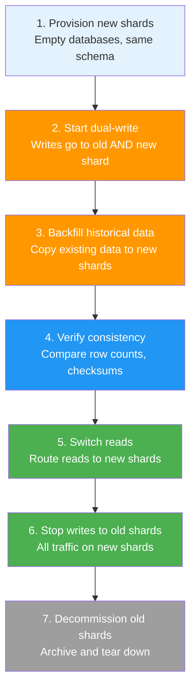

### Resharding Approaches

| Approach | How It Works | Downtime | Risk | Best For |
|----------|-------------|----------|------|----------|
| **Stop-the-world** | Take system offline, migrate data, bring back up | ❌ Hours to days | Low (simple) | Small datasets, batch systems with maintenance windows |
| **Dual-write** | Write to old and new shards simultaneously, backfill, cut over | ✅ Zero (if done right) | ⚠️ Consistency during transition | Production systems requiring zero downtime |
| **Logical replication / CDC** | Stream changes from old to new shards via change data capture | ✅ Near-zero | ⚠️ Lag during high write volume | Large datasets, can tolerate brief switchover |
| **Virtual sharding** | Over-provision logical shards, remap to physical nodes | ✅ Zero | ✅ Low — only metadata changes | Systems that plan ahead (Cassandra vnodes) |
| **Auto range splitting** | Database automatically splits ranges when they grow too large | ✅ Zero | ✅ Low — automated | Managed databases (Spanner, CockroachDB, TiDB) |

> **Cross-reference:** Change data capture (CDC) for resharding pipelines is covered in [Kafka Communication Patterns](./kafka-communication-patterns.md).

---

## Petabyte-Scale Considerations

At petabyte scale, problems that are invisible at gigabyte scale become existential. A full table scan that took 2 seconds at 100 GB takes 5.5 hours at 1 PB. Backup that took 10 minutes now takes a week. The rules change.

### When Partitioning Alone Is Insufficient

| Constraint | Single-Node Limit | Petabyte Reality | Forces Sharding? |
|------------|-------------------|------------------|-------------------|
| **Disk capacity** | 16–64 TB per server (NVMe) | 1 PB = 16–64 servers minimum | ✅ Yes |
| **IOPS** | 500K–1M random IOPS (NVMe) | 10M+ IOPS needed for concurrent workloads | ✅ Yes |
| **Memory** | 512 GB – 2 TB RAM | Working set exceeds single-node RAM | ✅ Yes |
| **Backup time** | 10 TB/hr with parallel dump | 1 PB backup = 100 hours | ✅ Yes |
| **Migration / upgrade** | Hours for schema change on 10 TB | Days for `ALTER TABLE` on 1 PB | ✅ Yes |
| **Recovery (MTTR)** | 30 min for 1 TB from backup | 4+ days for 1 PB from backup | ✅ Yes |

### Storage Engine Choice: B-Tree vs LSM-Tree

At petabyte scale, the storage engine fundamentally affects write throughput, space amplification, and compaction overhead.

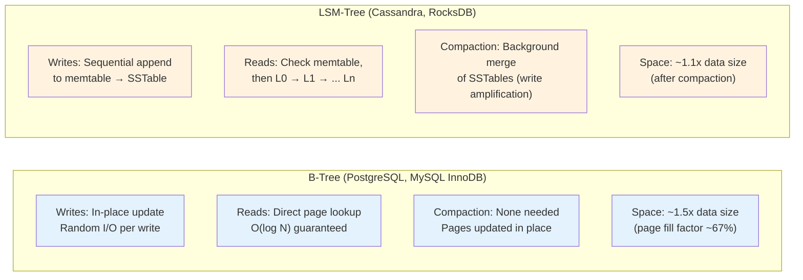

### B-Tree vs LSM-Tree at Petabyte Scale

| Dimension | B-Tree | LSM-Tree |
|-----------|--------|----------|
| **Write throughput** | ⚠️ Limited by random I/O | ✅ High — sequential writes |
| **Read latency (point)** | ✅ Predictable — single page read | ⚠️ May check multiple levels |
| **Read latency (range)** | ✅ Pages are sorted, sequential scan | ⚠️ May span multiple SSTables |
| **Space amplification** | ⚠️ ~1.5x (unfilled pages) | ✅ ~1.1x (compacted) |
| **Write amplification** | ✅ 1x (in-place update) | ❌ 10–30x (compaction rewrites) |
| **Compaction impact** | ✅ None | ⚠️ CPU/IO spikes during compaction |
| **Best for** | Read-heavy OLTP, complex queries | Write-heavy, time-series, append workloads |
| **Examples** | PostgreSQL, MySQL, Oracle | Cassandra, RocksDB, LevelDB, ScyllaDB |

### Tiered Storage

At petabyte scale, not all data deserves NVMe. Tiered storage places data on the appropriate medium based on access frequency:

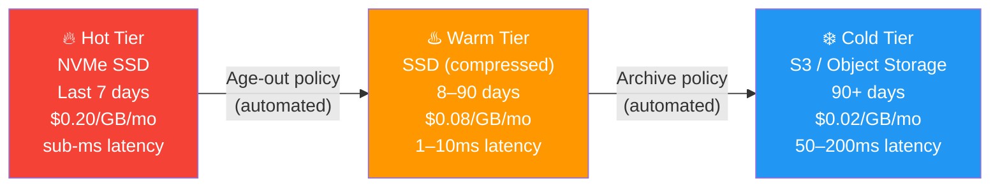

At 1 PB, tiered storage can reduce costs from $200K/mo (all NVMe) to ~$40K/mo (5% hot, 20% warm, 75% cold) — an 80% reduction.

---

## Real-World Implementations

### MongoDB Sharding Architecture

MongoDB uses a router-based sharding architecture with config servers that store chunk-to-shard mappings:

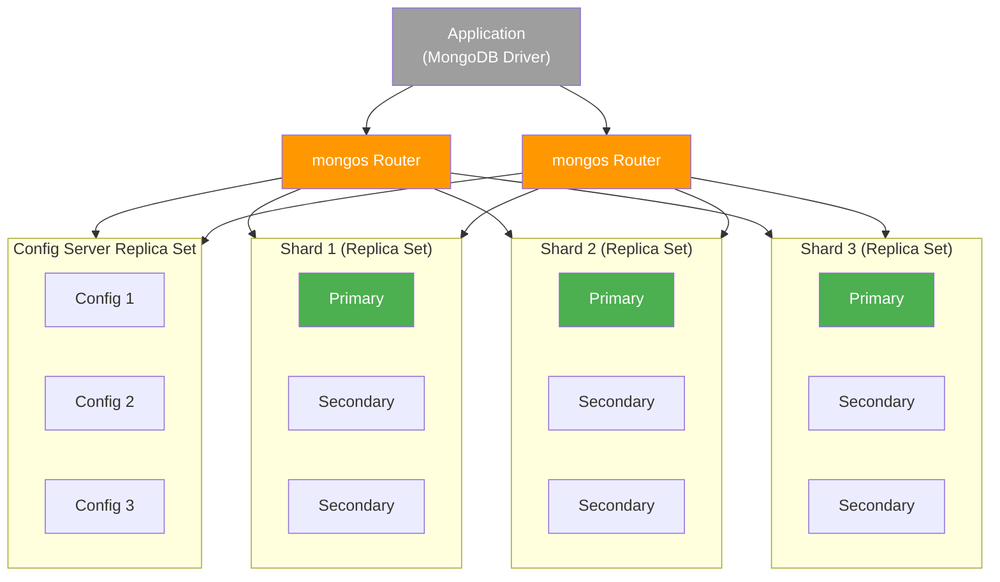

### Vitess Architecture (MySQL Sharding)

Vitess, originally built by YouTube, adds horizontal sharding to MySQL without application changes:

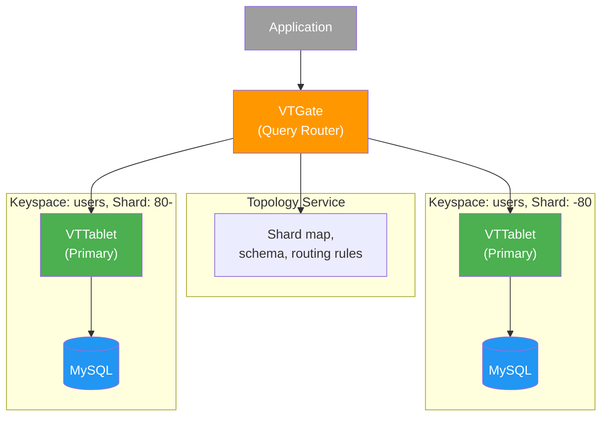

### Real-World Systems Comparison

| System | Sharding Approach | Shard Key | Rebalancing | Scale |
|--------|------------------|-----------|-------------|-------|
| **YouTube / Vitess** | Hash-based via Vitess, MySQL underneath | `video_id`, `user_id` | Manual shard splitting via VTTablet | Billions of videos |
| **Instagram** | Hash-based, PostgreSQL shards | `user_id` | Logical sharding with pgbouncer routing | 2B+ monthly users |
| **Uber** | Geo + hash, custom Schemaless on MySQL | `city_id` + `entity_id` | Custom tooling for city-level isolation | Millions of trips/day |
| **Cassandra** | Consistent hashing with vnodes | Partition key (configurable) | Automatic with virtual nodes | Multi-PB deployments |
| **CockroachDB** | Auto range splitting | Any column (automatic) | Fully automatic range rebalancing | Multi-TB, auto-sharded |
| **MongoDB** | Hash or range sharding | User-defined shard key | Automatic chunk migration via balancer | Multi-PB collections |
| **Google Spanner** | Auto range splitting, globally distributed | Primary key prefix | Fully automatic, split/merge ranges | Exabyte-scale, global |
| **TiDB** | Auto range splitting, MySQL-compatible | Primary key (automatic) | Automatic via PD (Placement Driver) | Multi-PB, auto-sharded |

---

## Partitioning vs Sharding — Decision Matrix

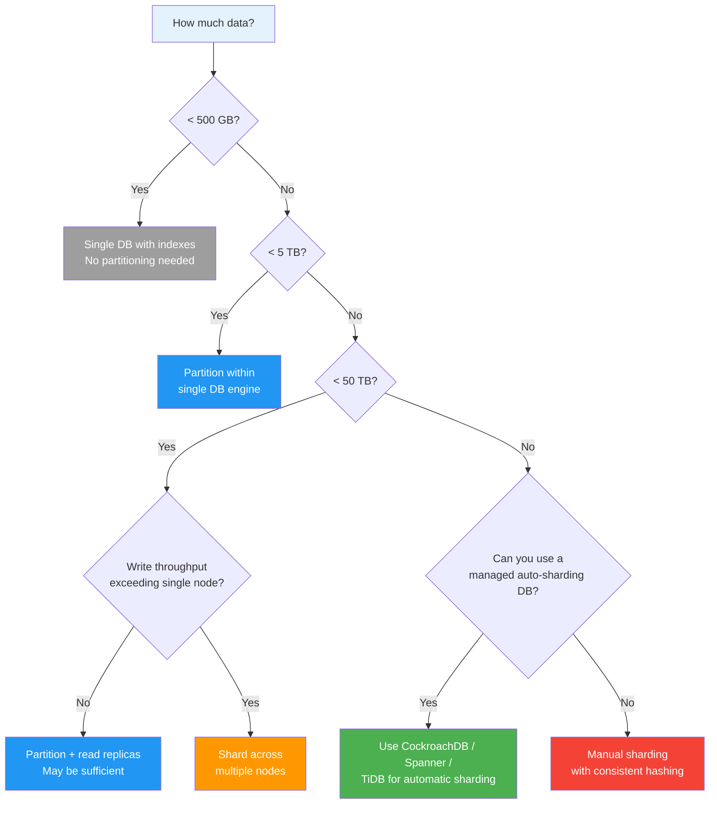

### Complete Decision Matrix

| Dimension | Partitioning | Sharding | Auto-Sharding DB |
|-----------|-------------|----------|-------------------|
| **Data volume** | 100 GB – 10 TB | 10 TB – Petabytes | Any — scales automatically |
| **Write throughput** | Bounded by single engine | Linear scaling with shard count | Linear scaling, managed |
| **Query patterns** | Complex joins, aggregations OK | Best for shard-key lookups | Complex queries supported |
| **Team size** | Any — DB manages partitions | Large — need DBA expertise | Medium — managed complexity |
| **Budget** | Low — single server | High — N servers + operations | Medium-High — managed service fees |
| **Cross-partition joins** | ✅ Transparent | ❌ Scatter-gather or app-level | ✅ Transparent (with cost) |
| **Transactions** | ✅ Normal ACID | ❌ 2PC / SAGA required | ✅ Distributed ACID (Spanner, CRDB) |
| **Examples** | PostgreSQL, MySQL, Oracle | Vitess, custom sharding, MongoDB | CockroachDB, Spanner, TiDB, YugabyteDB |

---

## Common Pitfalls

### ❌ Pitfall 1: Sharding Too Early

**Mistake:** Introducing sharding at 100 GB because "we'll need it eventually."

**Reality:** Sharding adds operational complexity that dwarfs the benefit at small scale. Partitioning, read replicas, and better indexing handle most workloads up to several terabytes. Premature sharding means paying the full distributed systems tax — cross-shard joins, distributed transactions, schema coordination — for a problem you don't have yet.

✅ **Do this instead:** Start with partitioning. Add read replicas for read scaling. Shard only when single-node limits are genuinely exhausted.

### ❌ Pitfall 2: Low-Cardinality Shard Key

**Mistake:** Sharding by `country_code` (200 values) or `status` (5 values).

**Reality:** Low cardinality means you can't distribute beyond the number of distinct values. Five status values = five shards maximum, and one status ("active") holds 90% of data. You're stuck with a hot shard and no way to sub-divide.

✅ **Do this instead:** Use high-cardinality keys like `user_id` or compound keys like `(tenant_id, user_id)`.

### ❌ Pitfall 3: Ignoring Cross-Shard Query Patterns

**Mistake:** Choosing `order_id` as the shard key without considering that the dashboard shows "all orders for customer X."

**Reality:** Every customer query becomes a scatter-gather across all shards. At 100 shards, that's 100 parallel queries merged in the application — latency is bound by the slowest shard, and throughput collapses under load.

✅ **Do this instead:** Profile your query patterns before choosing a shard key. If 80% of queries are by `customer_id`, shard by `customer_id`.

### ❌ Pitfall 4: No Resharding Plan

**Mistake:** Deploying with 8 shards and no plan for what happens when they fill up.

**Reality:** Resharding without a plan means stop-the-world migration, data loss risk, or weeks of dual-write complexity built under pressure. By the time you need to reshard, you're already in a capacity crisis.

✅ **Do this instead:** Use consistent hashing with virtual nodes from day one. Over-provision logical shards (e.g., 256 logical shards mapped to 8 physical nodes, so you can remap without data movement).

### ❌ Pitfall 5: Schema Drift Across Shards

**Mistake:** Treating shards as independent databases and running migrations manually per shard.

**Reality:** Shard 7 has a column that shard 12 doesn't. Application code crashes on queries to shard 12. Schema drift is insidious — it doesn't cause errors until a query hits the wrong shard.

✅ **Do this instead:** Automate schema migrations with tools like Vitess `ApplySchema`, pt-online-schema-change, or gh-ost across all shards atomically.

### ❌ Pitfall 6: No Per-Shard Backup/Recovery Strategy

**Mistake:** Backing up shards as if they were independent — no coordination, no point-in-time consistency across shards.

**Reality:** Restoring shard 3 from a backup 6 hours old while shard 4 is current creates data inconsistencies across shards. Cross-shard references break. Distributed transactions partially applied.

✅ **Do this instead:** Coordinate backup timestamps across shards. Use consistent snapshots (e.g., Percona XtraBackup with GTID) and validate cross-shard integrity after restoration.

---

## Pros and Cons

### Pros of Sharding

| Advantage | Description |
|-----------|-------------|
| **Horizontal scalability** | Add nodes to increase storage and throughput linearly — no single-node ceiling |
| **Fault isolation** | A shard failure affects only a fraction of users; other shards continue serving |
| **Reduced index size** | Each shard's indexes are smaller, fitting in RAM for faster queries |
| **Geographic locality** | Geo-sharding places data near users, reducing latency and meeting data residency laws |
| **Independent scaling** | Hot shards can be given more resources without affecting cold shards |
| **Petabyte capable** | The only practical way to handle petabyte-scale OLTP workloads |
| **Linear write throughput** | Total write throughput scales with shard count — no single-writer bottleneck |
| **Compliance (data residency)** | EU data stays in EU shards, US data in US shards — satisfies GDPR and similar regulations |

### Cons of Sharding

| Disadvantage | Description |
|--------------|-------------|
| **Operational complexity** | Monitoring, alerting, patching, and upgrading N independent databases instead of one |
| **Cross-shard queries** | Scatter-gather is slow, pagination is complex, and global aggregations are expensive |
| **Distributed transactions** | 2PC or SAGA required for cross-shard atomicity — adds latency and failure modes |
| **Resharding risk** | Changing shard count or key is one of the most dangerous operations in production |
| **Application complexity** | Routing logic, connection management, shard-aware query building leak into application code |
| **Schema management** | Coordinating DDL across N shards without drift requires specialized tooling |
| **Infrastructure cost** | N shards × replication factor × monitoring = significantly higher infrastructure spend |
| **Testing difficulty** | Must test with realistic shard counts; single-shard dev environments hide cross-shard bugs |

---

## When to Use

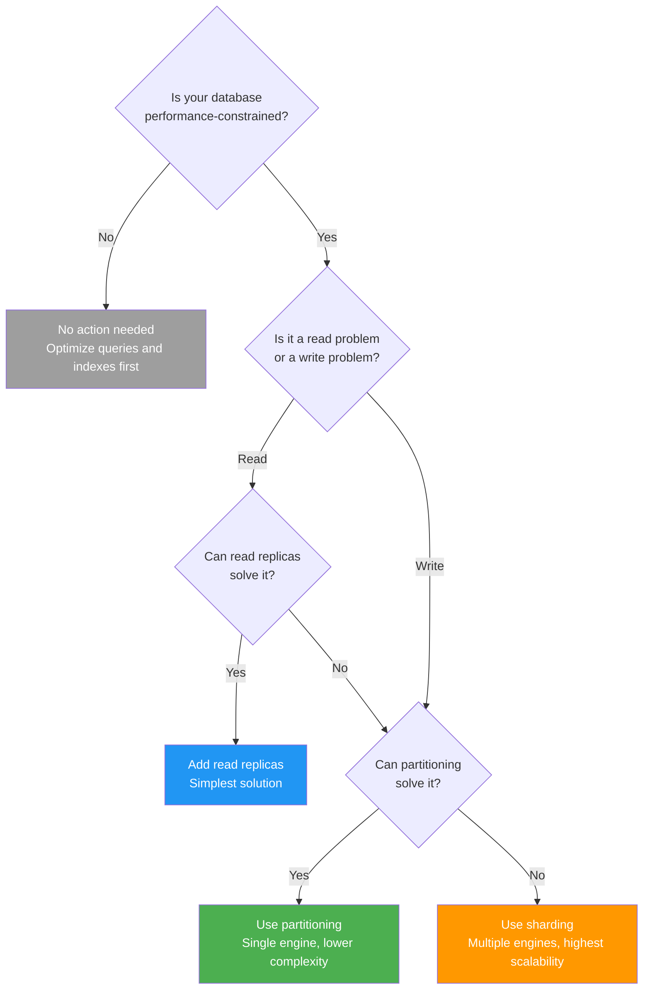

### Use Sharding When

- **Single-node storage is exhausted** — data exceeds practical disk capacity (10+ TB OLTP)
- **Write throughput exceeds single-engine capacity** — single-writer bottleneck cannot be solved by better hardware
- **Recovery time is unacceptable** — restoring a 10 TB database takes hours; restoring a 1 TB shard takes minutes
- **Workload is naturally partitionable** — queries are scoped to a key (user_id, tenant_id, region)
- **Geographic latency matters** — users on different continents need sub-50ms response times
- **Data residency laws require it** — GDPR, CCPA, or similar regulations mandate data stays in specific regions
- **Fault isolation is critical** — a failure should affect 1/N of users, not all users

### Do NOT Use Sharding When

- **Data fits on a single node** — don't shard a 500 GB database; partition it
- **Read scaling is the problem** — add read replicas instead; they're simpler than sharding
- **Most queries require cross-shard joins** — sharding will make things worse, not better
- **Team lacks distributed systems expertise** — sharding without expertise leads to data loss and outages
- **An auto-sharding database fits** — CockroachDB, Spanner, and TiDB handle sharding automatically
- **The workload is primarily analytical** — use a columnar store (ClickHouse, BigQuery) instead of sharding an OLTP database

---

## Key Takeaways for System Design Interviews

1. **Partitioning ≠ Sharding — know the distinction** — Partitioning is one engine, multiple storage units (query planner handles it). Sharding is multiple engines, each independent. The interviewer will test if you conflate them.

2. **Shard key is the most important decision** — A bad shard key causes hot shards, cross-shard queries, and resharding nightmares. Evaluate cardinality, distribution, query isolation, and stability before committing.

3. **Consistent hashing with virtual nodes is the standard** — Modulo hashing moves ~80% of keys on resize. Consistent hashing moves ~1/N. Virtual nodes (150+) ensure even distribution. Know this cold.

4. **Hot shard problem is an interview favorite** — Celebrity users, flash sales, time-based keys, and large tenants all cause hot shards. Know the scenarios and mitigations (sub-sharding, dedicated shards, write buffers).

5. **Cross-shard operations are the cost of sharding** — Every scatter-gather query, distributed transaction, and global secondary index is a tax. If your workload requires frequent cross-shard operations, reconsider your shard key or whether sharding is appropriate.

6. **Start with partitioning, shard when forced** — Partitioning gives you query pruning, easier maintenance windows, and data lifecycle management without the distributed systems tax. Only shard when single-node limits are genuinely exhausted.

7. **Resharding is operationally dangerous — plan from day one** — Use consistent hashing with virtual shards so you can remap logical shards to physical nodes without massive data movement. Never assume your initial shard count is final.

8. **Denormalize to avoid cross-shard joins** — In a sharded system, data duplication is cheaper than cross-shard queries. Replicate reference tables to every shard. Accept eventual consistency where possible.

9. **Know real-world examples** — Vitess (YouTube/MySQL sharding), Instagram (PostgreSQL shards by user_id), Cassandra (consistent hashing + vnodes), CockroachDB/Spanner (automatic range splitting). Mentioning these shows production experience.

10. **Tiered storage at petabyte scale** — Hot (NVMe), warm (SSD compressed), cold (S3). At 1 PB, tiered storage reduces costs by 80%. Know the access patterns that drive tier placement.

11. **Global secondary indexes are hidden complexity** — They solve non-shard-key lookups but introduce cross-shard writes, eventual consistency, and separate infrastructure. Mention the trade-off explicitly.

12. **Geo-sharding solves latency AND compliance** — Place US data in US shards, EU data in EU shards. Reduces cross-continent latency from 200ms to 20ms and satisfies GDPR data residency requirements simultaneously.

---

## Related Concepts

- **[SAGA Pattern](./saga-pattern.md)** — Compensation-based distributed transactions for cross-shard operations that tolerate eventual consistency
- **[Two-Phase Commit](./two-phase-commit.md)** — Coordinator-based atomic commits for cross-shard operations requiring strong consistency
- **[Kafka Communication Patterns](./kafka-communication-patterns.md)** — CDC-based resharding pipelines and partition key selection strategies
- **[Wallet & Ledger System](./wallet-ledger-system.md)** — Hot account sharding for treasury accounts that participate in every transaction
- **[Event Sourcing](./event-sourcing.md)** — Append-only event logs as a sharding-friendly data model; events partitioned by aggregate ID
- **[Distributed Task Scheduler](./distributed-task-scheduler.md)** — Sharded task stores distribute scheduling load across multiple databases
- **[Idempotency](./idempotency.md)** — Cross-shard retries require idempotent handlers to prevent duplicate processing during resharding
- **Consistent Hashing** — The foundational algorithm for shard placement with minimal redistribution on cluster changes
- **CAP Theorem** — Sharding forces partition tolerance; the trade-off between consistency and availability defines your cross-shard guarantees
- **Read Replicas** — Often sufficient for read scaling without the complexity of sharding; should be exhausted first
