# Distributed Task Scheduler — Deep Dive

Scheduling is a **coordination problem, not a timing problem.** Single-server cron is trivial — write a crontab entry and walk away. But distributed scheduling with exactly-once execution, high availability, missed-fire recovery, and millions of tasks across a fleet of workers is deceptively hard. When your cron server dies at 11:59 PM and end-of-day reconciliation never runs, you discover that the simplest problems in computing become the hardest when you add "distributed" in front of them.

---

## The Problem — Why Cron Breaks at Scale

A single cron server works until it doesn't. It's a single point of failure with no high availability, no horizontal scaling, no visibility into what ran or failed, no retry mechanism, and no dead letter queue for poison tasks. When the cron server goes down, tasks silently don't run — and in fintech, that means reconciliation doesn't happen, statements don't generate, and interest doesn't calculate.

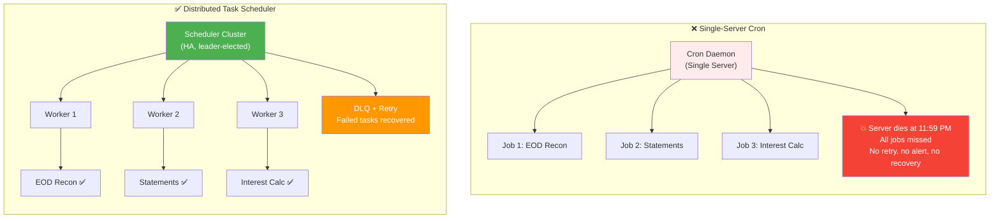

### Capability Comparison

| Capability | Single-Server Cron | Distributed Task Scheduler |
|------------|-------------------|---------------------------|
| **High availability** | ❌ SPOF — server dies, jobs stop | ✅ Leader failover, standby promotion |
| **Horizontal scaling** | ❌ One machine, limited CPU/memory | ✅ Add workers to scale throughput |
| **Exactly-once execution** | ❌ No guarantee — may run twice after restart | ✅ Distributed locks + fencing tokens |
| **Retry / DLQ** | ❌ None — failed jobs vanish | ✅ Configurable retry + dead letter queue |
| **Monitoring & alerting** | ❌ Check logs manually | ✅ Metrics, dashboards, alerts |
| **Priority scheduling** | ❌ All jobs equal | ✅ Priority lanes, preemption |
| **Multi-tenant isolation** | ❌ Not applicable | ✅ Tenant-level fairness and quotas |
| **Missed-fire recovery** | ❌ Missed jobs are gone | ✅ Configurable catch-up policies |

---

## What is a Distributed Task Scheduler?

A distributed task scheduler coordinates the execution of tasks across a cluster of machines, ensuring tasks run on time, at most once (or exactly once), with fault tolerance and visibility. It has four core components: the **Scheduler** (brain), the **Worker Pool** (muscle), the **Task Store** (memory), and the **Dead Letter Queue** (safety net).

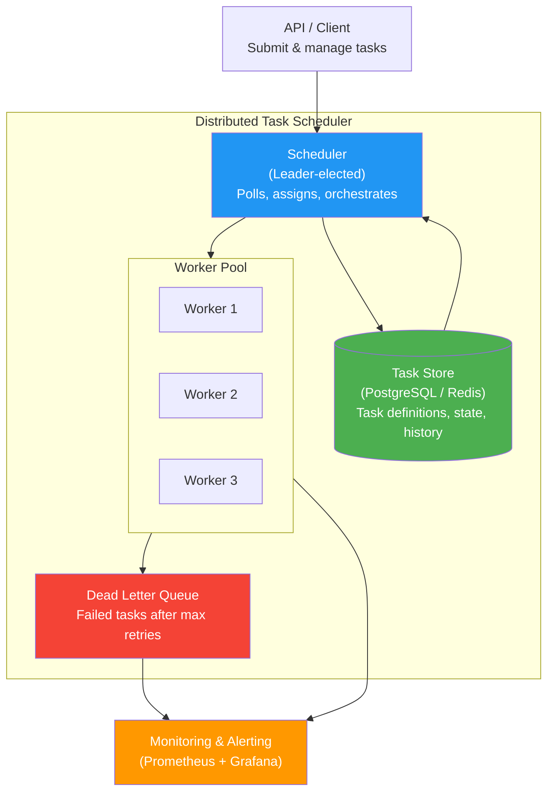

### Component Responsibilities

| Component | Responsibility | Technology Examples |
|-----------|---------------|-------------------|
| **Scheduler** | Polls task store for due tasks, assigns to workers, handles missed fires | Quartz Scheduler, Temporal Server, Airflow Scheduler |
| **Worker Pool** | Executes assigned tasks, reports status, sends heartbeats | Celery workers, Temporal workers, K8s Jobs |
| **Task Store** | Persists task definitions, schedules, state, execution history | PostgreSQL, MySQL, Redis, DynamoDB |
| **Dead Letter Queue** | Captures tasks that exceed max retries for manual investigation | Kafka DLQ topic, SQS DLQ, database table |
| **Monitoring** | Tracks queue depth, execution latency, failure rates, scheduler health | Prometheus, Grafana, PagerDuty |

---

## Task Lifecycle — State Machine

Every task moves through a well-defined set of states. Understanding this state machine is essential for reasoning about failure modes and recovery.

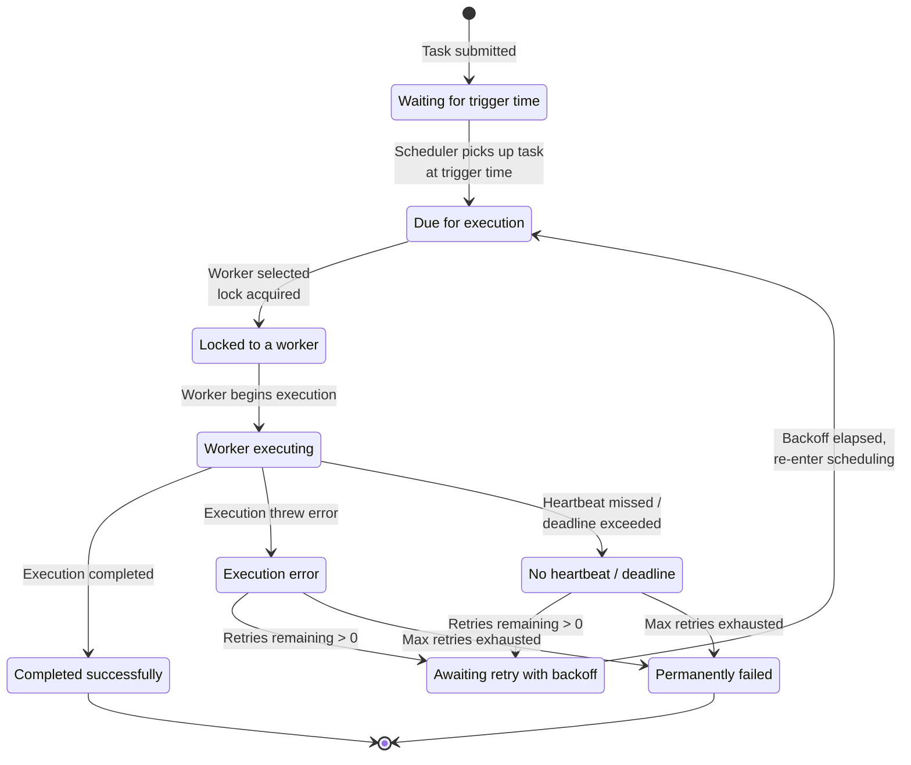

### Happy Path — Scheduler to Worker to Success

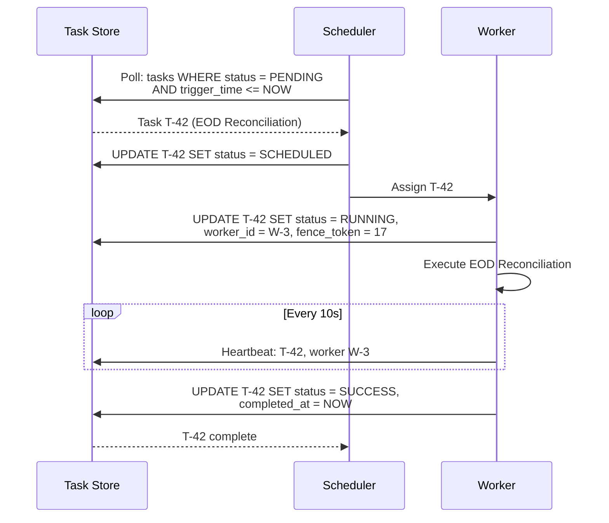

### State Descriptions

| State | Meaning | Valid Transitions | Trigger |
|-------|---------|-------------------|---------|
| **PENDING** | Task submitted, waiting for trigger time | SCHEDULED | Trigger time reached |
| **SCHEDULED** | Due for execution, awaiting worker assignment | ASSIGNED | Scheduler assigns worker |
| **ASSIGNED** | Locked to a specific worker | RUNNING | Worker begins execution |
| **RUNNING** | Worker is actively executing | SUCCESS, FAILED, TIMED_OUT | Execution result / heartbeat miss |
| **SUCCESS** | Completed successfully | Terminal | Worker reports completion |
| **FAILED** | Execution threw an error | RETRY, DEAD_LETTERED | Retry policy evaluation |
| **TIMED_OUT** | Worker missed heartbeat or exceeded deadline | RETRY, DEAD_LETTERED | Scheduler timeout detection |
| **RETRY** | Awaiting retry after backoff | SCHEDULED | Backoff timer elapsed |
| **DEAD_LETTERED** | Permanently failed, requires manual intervention | Terminal | Max retries exhausted |

---

## Scheduling Strategies

Different tasks need different scheduling strategies. A daily EOD reconciliation is time-based, while a post-deposit interest recalculation is event-driven.

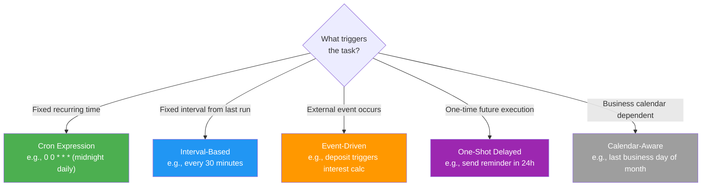

### Strategy Comparison

| Strategy | How It Works | Example | Pros | Cons |
|----------|-------------|---------|------|------|
| **Cron expression** | Fires at specific times defined by cron syntax | `0 0 * * *` — midnight daily EOD recon | Precise, well-understood, calendar-aligned | Missed fires need explicit policy |
| **Interval-based** | Fires N seconds/minutes after last completion | Every 5 min: poll payment gateway status | Prevents overlap, self-adjusting | Drift over time, no calendar alignment |
| **Event-driven** | Fires in response to an external event | Deposit webhook triggers interest recalc | Real-time, no polling waste | Requires event infrastructure |
| **One-shot delayed** | Fires once at a future timestamp | Send payment reminder in 48 hours | Simple, one-time use | No recurrence |
| **Calendar-aware** | Fires based on business calendar rules | Last business day of month: statement gen | Handles holidays, weekends | Requires business calendar data |

---

## Task Assignment Strategies

Once the scheduler determines a task is due, it must assign it to a worker. The two fundamental models are **push** (scheduler sends to worker) and **pull** (worker requests work).

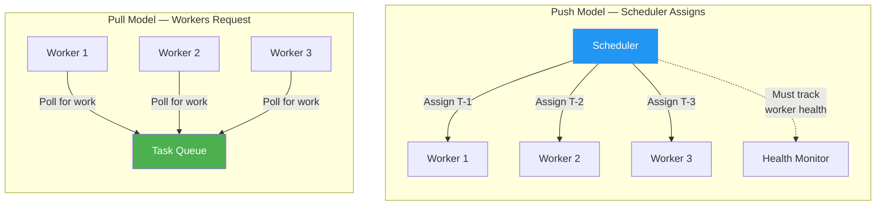

### Work Stealing

When workers have uneven load, idle workers can steal tasks from busy workers' local queues. This maximizes utilization without centralized rebalancing.

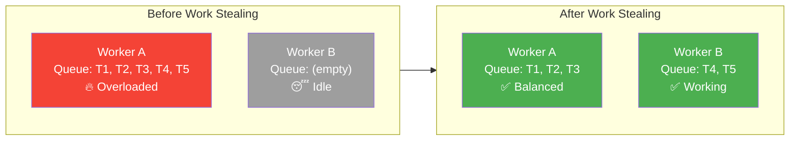

### Assignment Strategy Comparison

| Strategy | How It Works | Pros | Cons | Best For |
|----------|-------------|------|------|----------|
| **Push (round-robin)** | Scheduler cycles through healthy workers | Simple, even distribution | Doesn't account for worker load | Uniform tasks, homogeneous workers |
| **Pull (competing consumers)** | Workers poll a shared queue | Natural load balancing, no scheduler bottleneck | Polling overhead, less control over assignment | Variable task durations, elastic scaling |
| **Consistent hashing** | Task key maps to a specific worker | Data locality, cache affinity | Rebalancing on worker change | Tasks needing local state/cache |
| **Work stealing** | Idle workers steal from busy workers' queues | Maximizes utilization | Complex implementation, contention on queues | Mixed task durations, heterogeneous workers |

---

## Leader Election for Scheduler HA

A single active scheduler avoids duplicate task assignment, but introduces a SPOF. Leader election provides HA: one scheduler is active (leader), others are standby. If the leader dies, a standby is promoted.

### Active-Passive Failover

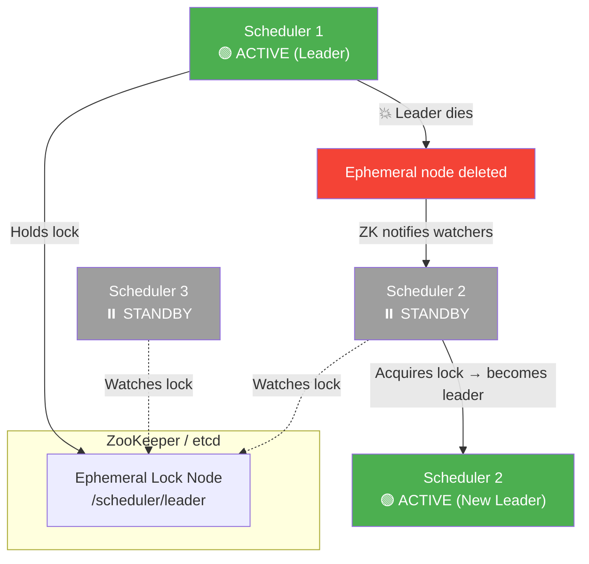

### Sharded Scheduler Model

For very high task volumes, a single scheduler becomes a bottleneck. Shard the task space across multiple active schedulers, each owning a partition.

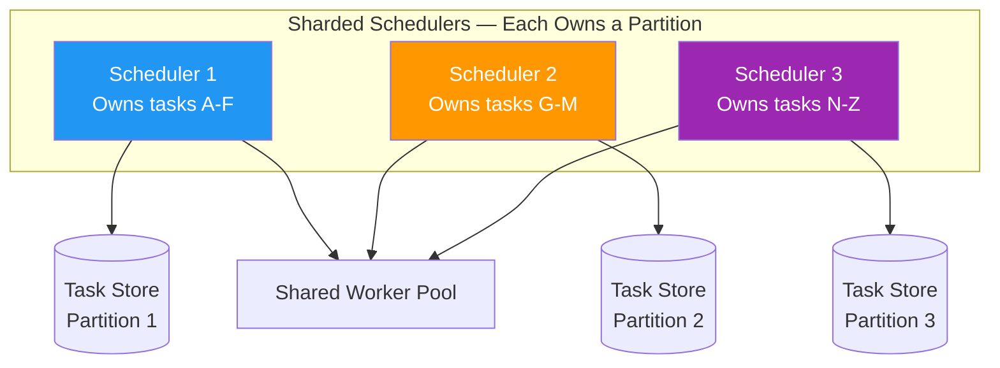

### Leader Election Approaches

| Approach | Mechanism | Failover Time | Complexity |
|----------|-----------|---------------|------------|
| **ZooKeeper ephemeral nodes** | Leader creates ephemeral znode; watchers get notified on session loss | 1-10 seconds | Medium — requires ZK cluster |
| **etcd lease** | Leader acquires a lease with TTL; lease expiry triggers re-election | 1-15 seconds | Medium — requires etcd cluster |
| **Raft consensus** | Embedded Raft library for leader election among scheduler instances | Sub-second | High — embedded consensus |
| **DB advisory locks** | `SELECT pg_try_advisory_lock(1)` — leader holds a PostgreSQL lock | 10-30 seconds | Low — uses existing database |

---

## Exactly-Once Execution — The Hard Problem

The hardest problem in distributed scheduling is ensuring a task executes **exactly once**. Network partitions make this deceptively difficult: the scheduler assigns a task to Worker A, but the network partitions. Did Worker A execute it? The scheduler can't tell, so it re-assigns to Worker B. Now both execute the same task.

### The Problem and Solution with Fencing Tokens

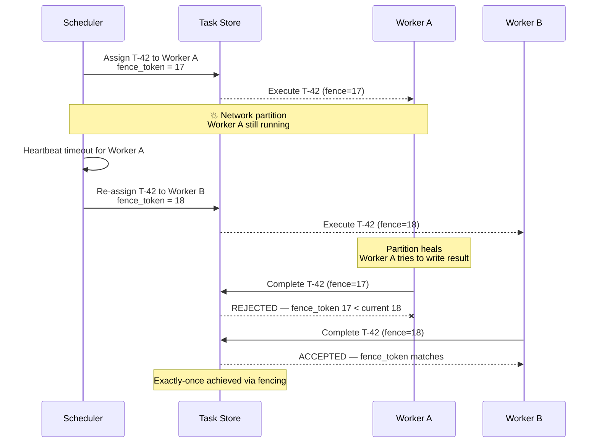

### Exactly-Once Mechanisms

| Mechanism | How It Works | Guarantees | Limitation |
|-----------|-------------|------------|------------|
| **Fencing tokens** | Monotonically increasing token assigned per assignment; store rejects stale tokens | Prevents zombie workers from writing results | Requires all downstream writes to check token |
| **Distributed lock (lease)** | Worker acquires a time-bounded lock; lock expires if worker dies | Prevents concurrent execution | Clock skew can cause dual execution during lease boundary |
| **Heartbeat + timeout** | Worker sends periodic heartbeats; scheduler re-assigns after timeout | Detects dead workers | Timeout too short = false re-assignment; too long = delayed recovery |
| **Idempotent execution** | Task handler is designed to be safely re-executed | Duplicates are harmless | Requires careful handler design — not always possible |

**Cross-reference:** [Idempotency](./idempotency.md) — idempotency is the safety net when exactly-once coordination fails.

---

## Failure Handling & Retry

Workers fail. Tasks fail. Networks fail. A robust scheduler must detect failures quickly, retry intelligently, and route poison pills to the dead letter queue.

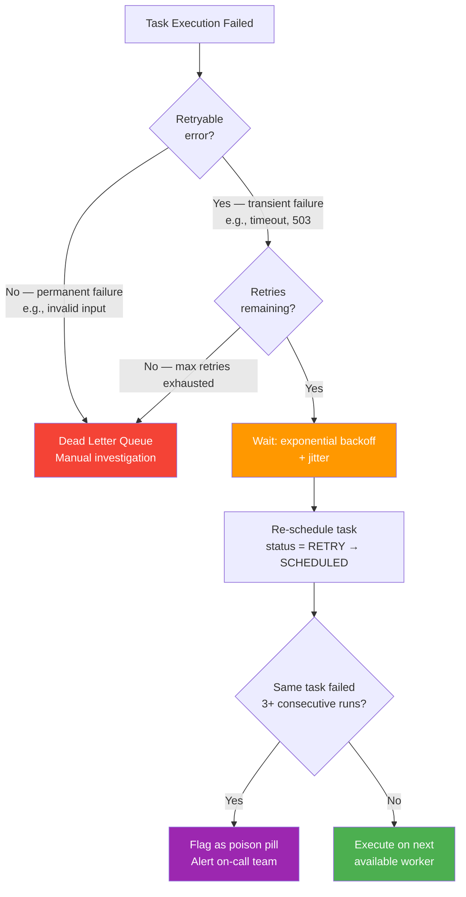

### Retry Configuration

| Parameter | Description | Fintech Example |
|-----------|-------------|-----------------|
| **maxRetries** | Maximum retry attempts before DLQ | EOD recon: 5, statement gen: 3 |
| **initialBackoff** | First retry delay | 1 second |
| **maxBackoff** | Cap on backoff growth | 5 minutes |
| **backoffMultiplier** | Exponential growth factor | 2.0 (1s → 2s → 4s → 8s → ...) |
| **jitterPercent** | Random spread to avoid thundering herd | 20% |
| **retryableErrors** | Error types eligible for retry | ConnectionTimeout, 503, 429 |
| **nonRetryableErrors** | Errors that go straight to DLQ | InvalidInput, AuthFailure, 400 |
| **deadlineTimeout** | Absolute deadline regardless of retries | EOD recon must complete by 2:00 AM |

---

## Backfill & Catch-Up — Missed Fire Policies

What if the scheduler was down from 11:00 PM to 1:00 AM and the midnight EOD reconciliation never fired? The missed-fire policy determines what happens when the scheduler recovers.

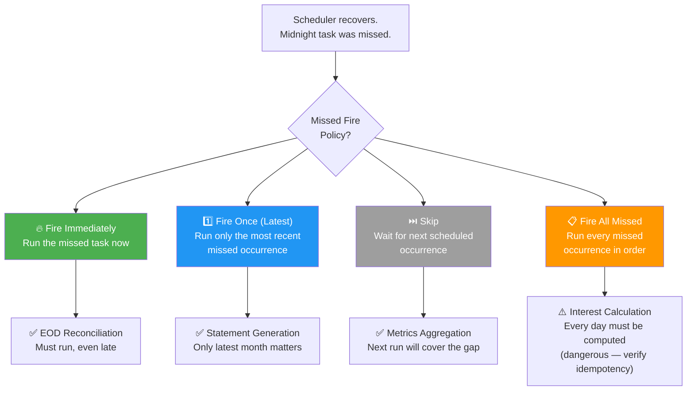

### Policy Comparison

| Policy | Behavior | Risk | Best For |
|--------|----------|------|----------|
| **Fire immediately** | Run the missed task as soon as scheduler recovers | Task runs at unexpected time; downstream may not be ready | Critical tasks that must run (EOD recon) |
| **Fire once (latest)** | Run only the most recent missed occurrence, skip older ones | Skips intermediate occurrences | Tasks where only the latest run matters (cache refresh) |
| **Skip** | Don't run the missed task; wait for the next regular occurrence | Missed work is permanently lost | Non-critical tasks, metrics aggregation |
| **Fire all missed** | Run every missed occurrence sequentially | Resource spike, potential duplicate processing | Tasks where every occurrence matters (daily interest calc) — requires idempotent handlers |

---

## Priority & Fairness

Not all tasks are equal. EOD reconciliation (critical) must run before a marketing report (low). But priority alone can cause starvation — low-priority tasks never run if the queue always has critical tasks. Aging solves this: tasks that wait too long get their priority boosted.

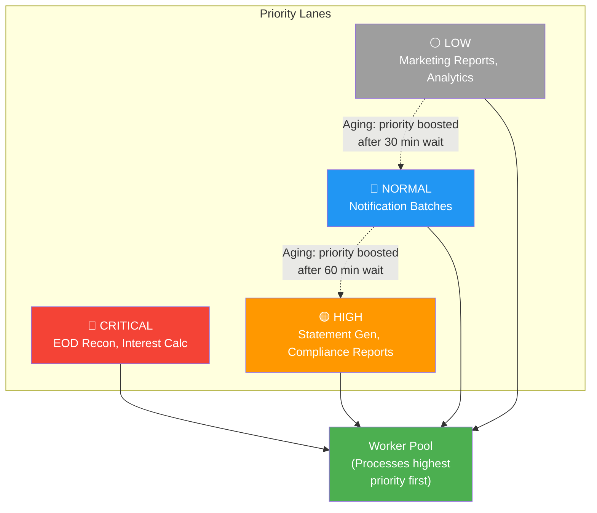

---

## The Fintech Use Cases

### Use Case 1: End-of-Day Reconciliation

Match internal ledger transactions against bank and payment provider statements. Every transaction recorded in your system must have a corresponding entry in the bank's records — and vice versa.

**Schedule:** Daily at midnight | **Scale:** Millions of transactions | **Failure impact:** Undetected fraud, regulatory violations

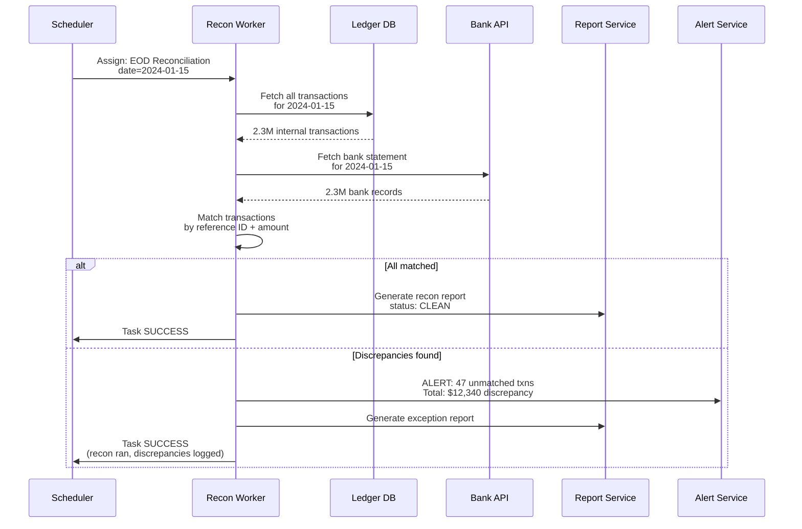

**Cross-reference:** [Wallet & Ledger System](./wallet-ledger-system.md) — the ledger reconciliation section describes the internal vs external reconciliation loops that this scheduled task automates.

### Use Case 2: Monthly Statement Generation

Generate PDF statements for millions of accounts on the 1st of every month. This is a classic **fan-out** pattern: a parent task spawns N child tasks (one per account), each generating and uploading a PDF.

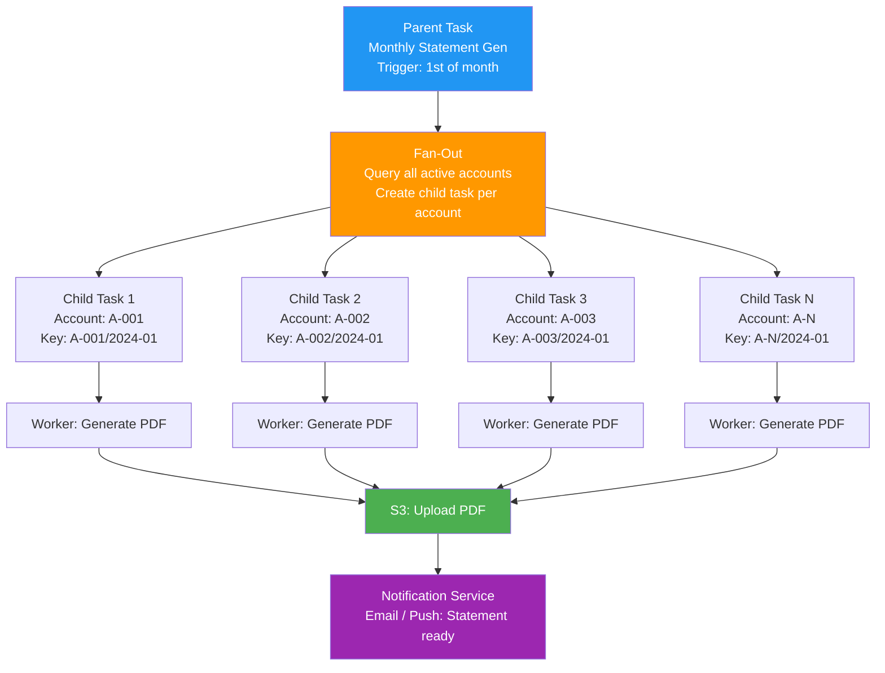

**Idempotency key:** `(account_id, year-month)` — regenerating the same statement for the same month produces the same PDF and overwrites the previous upload. No duplicate statements.

### Use Case 3: Daily Interest Calculation

Compute daily compound interest across all accounts. This task has a strict **ordering dependency**: it must run **after** EOD reconciliation completes, because interest should only be calculated on reconciled, verified balances.

**Idempotency key:** `(account_id, date)` — calculating interest twice for the same account on the same day must produce the same result. Double interest is catastrophic.

**Cross-reference:** [Idempotency](./idempotency.md) — the idempotency key pattern is essential here, as the "fire all missed" catch-up policy may re-execute past days.

### Fintech Use Case Summary

| Use Case | Schedule | Scale | Idempotency Key | Dependency | Failure Impact |
|----------|----------|-------|-----------------|------------|----------------|
| **EOD Reconciliation** | Daily midnight | Millions of txns | `(recon_type, date)` | None — runs first | Undetected fraud, regulatory breach |
| **Statement Generation** | 1st of month | Millions of accounts | `(account_id, month)` | None | Customer complaints, compliance gaps |
| **Interest Calculation** | Daily 2:00 AM | All interest-bearing accounts | `(account_id, date)` | After EOD Recon | Double interest = financial loss; missed interest = regulatory violation |

---

## Schema Design

```sql
-- Task definitions and current state
CREATE TABLE tasks (
    id                  UUID PRIMARY KEY,
    task_type           VARCHAR(100) NOT NULL,        -- 'EOD_RECON', 'STATEMENT_GEN', 'INTEREST_CALC'
    task_group          VARCHAR(100),                 -- grouping for fan-out parent/children
    parent_task_id      UUID REFERENCES tasks(id),    -- NULL for root tasks
    schedule_expr       VARCHAR(100),                 -- cron expression: '0 0 * * *'
    priority            INT NOT NULL DEFAULT 100,     -- lower = higher priority
    tenant_id           UUID,                         -- multi-tenant isolation
    payload             JSONB NOT NULL,               -- task-specific parameters
    status              VARCHAR(20) NOT NULL DEFAULT 'PENDING',
    retry_count         INT NOT NULL DEFAULT 0,
    max_retries         INT NOT NULL DEFAULT 3,
    next_trigger_time   TIMESTAMP NOT NULL,
    deadline            TIMESTAMP,                    -- absolute deadline for completion
    idempotency_key     VARCHAR(255) UNIQUE,          -- prevents duplicate execution
    missed_fire_policy  VARCHAR(20) DEFAULT 'FIRE_IMMEDIATELY',
    created_at          TIMESTAMP NOT NULL DEFAULT NOW(),
    updated_at          TIMESTAMP NOT NULL DEFAULT NOW()
);

CREATE INDEX idx_tasks_poll ON tasks (status, priority, next_trigger_time)
    WHERE status IN ('PENDING', 'RETRY');

-- Execution history (one row per attempt)
CREATE TABLE task_executions (
    id                  UUID PRIMARY KEY,
    task_id             UUID NOT NULL REFERENCES tasks(id),
    worker_id           VARCHAR(100) NOT NULL,
    fence_token         BIGINT NOT NULL,              -- monotonically increasing per task
    status              VARCHAR(20) NOT NULL,         -- 'RUNNING', 'SUCCESS', 'FAILED', 'TIMED_OUT'
    started_at          TIMESTAMP NOT NULL DEFAULT NOW(),
    completed_at        TIMESTAMP,
    last_heartbeat      TIMESTAMP NOT NULL DEFAULT NOW(),
    error_message       TEXT,
    result              JSONB,
    attempt_number      INT NOT NULL DEFAULT 1
);

CREATE INDEX idx_executions_heartbeat ON task_executions (status, last_heartbeat)
    WHERE status = 'RUNNING';

-- Distributed locks with fencing tokens
CREATE TABLE task_locks (
    task_id             UUID PRIMARY KEY REFERENCES tasks(id),
    worker_id           VARCHAR(100) NOT NULL,
    fence_token         BIGINT NOT NULL,
    acquired_at         TIMESTAMP NOT NULL DEFAULT NOW(),
    expires_at          TIMESTAMP NOT NULL,           -- lease expiry
    CONSTRAINT unique_active_lock UNIQUE (task_id)
);
```

---

## Monitoring & Observability

A distributed scheduler without observability is a ticking time bomb. You must know how deep the queue is, how fast tasks execute, and how often they fail — before users notice.

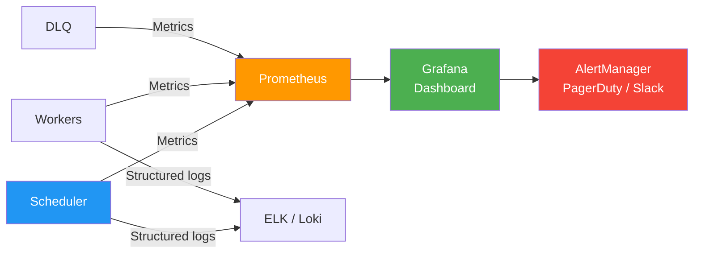

### Key Metrics

| Metric | Type | What It Tells You | Alert Threshold |
|--------|------|-------------------|-----------------|
| `task_queue_depth` | Gauge | Number of tasks waiting (PENDING + SCHEDULED) | > 1000 for > 5 min |
| `task_execution_duration_seconds` | Histogram | How long tasks take to execute | P99 > 2x normal |
| `task_failure_rate` | Gauge | Percentage of tasks failing | > 5% |
| `task_dlq_depth` | Gauge | Tasks in dead letter queue | > 0 |
| `scheduler_poll_lag_seconds` | Gauge | Delay between trigger time and poll time | > 30 seconds |
| `worker_utilization` | Gauge | Percentage of workers actively executing | > 90% sustained |
| `task_retry_count` | Counter | Total retries across all tasks | Spike detection |
| `scheduler_leader_changes` | Counter | Number of leader elections | > 2 in 10 minutes |

---

## Common Pitfalls

### ❌ No Distributed Lock

```
❌ Two scheduler instances both pick up the same task at the same time
   → Task executes twice, double-charging customers

✅ Distributed lock (or fencing token) ensures only one worker owns a task
   → Exactly-once assignment, stale workers rejected
```

### ❌ No Idempotency in Task Handlers

```
❌ Interest calculation handler: balance += daily_interest
   → Retry after transient failure = double interest applied

✅ Idempotent handler: UPSERT interest_entries WHERE (account_id, date)
   → Safe to retry — same result regardless of execution count
```

### ❌ Fixed Retry Without Backoff

```
❌ Retry immediately on failure, every 100ms, 1000 times
   → Hammers failing downstream service, delays recovery

✅ Exponential backoff with jitter: 1s → 2s → 4s → 8s (+ random jitter)
   → Gives downstream time to recover, prevents thundering herd
```

### ❌ No Missed-Fire Policy

```
❌ Scheduler restarts after 2-hour outage, no catch-up logic
   → Midnight EOD reconciliation silently skipped, nobody knows

✅ Missed-fire policy: FIRE_IMMEDIATELY for critical tasks
   → Scheduler detects missed triggers on recovery, executes them
```

### ❌ Monolithic Task — No Fan-Out

```
❌ Single task generates statements for 5 million accounts sequentially
   → Takes 8 hours, single worker bottleneck, no parallelism

✅ Fan-out: parent task spawns 5M child tasks, workers process in parallel
   → Completes in minutes, horizontally scalable
```

### ❌ Clock Skew Across Workers

```
❌ Worker A's clock is 30 seconds ahead, Worker B's is 10 seconds behind
   → Tasks fire at wrong times, lease expiry races, duplicate execution

✅ Use NTP sync, design with clock skew tolerance, server-side timestamps
   → Lease durations > expected skew, centralized time source for scheduling
```

---

## Real-World Implementations

| System | Type | Scheduling Model | Notable Features |
|--------|------|-----------------|------------------|
| **Quartz** | Java library | Cron + interval, DB-backed | Clustering support, rich trigger types, JDBC job store |
| **Apache Airflow** | Workflow orchestrator | DAG-based, cron triggers | Python DAGs, rich UI, dependency management |
| **Temporal** | Workflow engine | Durable execution, timers | Exactly-once, replay-based recovery, polyglot SDKs |
| **Celery Beat** | Python | Cron + interval, Redis/RabbitMQ | Simple, widely used, periodic task scheduling |
| **AWS EventBridge** | Managed service | Cron + rate expressions | Serverless, event-driven, SaaS integrations |
| **Google Cloud Scheduler** | Managed service | Cron expressions | HTTP/Pub/Sub targets, automatic retry |
| **Uber Cadence** | Workflow engine | Durable timers | Predecessor to Temporal, battle-tested at Uber scale |
| **LinkedIn Azkaban** | Batch workflow | DAG-based, cron triggers | Hadoop job scheduling, dependency management |
| **Kubernetes CronJob** | Container orchestrator | Cron expressions | Pod-based execution, K8s native, concurrency policies |
| **HashiCorp Nomad** | Cluster scheduler | Periodic stanza (cron) | Multi-region, batch + service scheduling, lightweight |

---

## Pros and Cons

### Pros

| Advantage | Detail |
|-----------|--------|
| **High availability** | Leader election and standby promotion ensure scheduling continues through server failures |
| **Exactly-once execution** | Fencing tokens + distributed locks prevent duplicate task execution |
| **Horizontal scaling** | Add workers to increase throughput; shard schedulers for higher task volumes |
| **Visibility & monitoring** | Centralized task state, execution history, dashboards, and alerting |
| **Retry & DLQ** | Automatic retry with backoff; permanent failures routed to DLQ for investigation |
| **Priority scheduling** | Critical tasks (EOD recon) preempt low-priority tasks (reports) |
| **Multi-tenant isolation** | Tenant-level queues, quotas, and fairness prevent noisy-neighbor problems |
| **Audit trail** | Complete execution history — who ran what, when, how long, what failed |

### Cons

| Disadvantage | Detail |
|--------------|--------|
| **Operational complexity** | ZooKeeper/etcd clusters, worker fleet management, monitoring infrastructure |
| **Coordination overhead** | Distributed locks, leader election, and heartbeats add latency and failure modes |
| **Clock synchronization** | Workers must have synchronized clocks; skew causes scheduling inaccuracies and lease races |
| **Debugging difficulty** | Task failures span multiple machines; requires centralized logging and tracing |
| **Cold start latency** | New workers need to register, connect, and begin polling before they can execute tasks |
| **Schema & migration management** | Task store schema evolves; migrations must be backward-compatible with running workers |

---

## When to Use

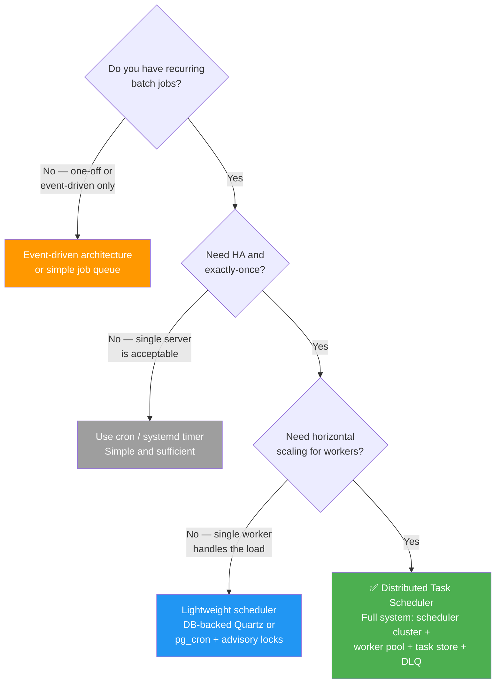

### Use When

- **Recurring fintech batch jobs** — EOD reconciliation, statement generation, interest calculation
- **High availability is mandatory** — missed execution has regulatory or financial consequences
- **Exactly-once matters** — duplicate execution causes financial loss (double interest, double charges)
- **Scale exceeds one machine** — millions of tasks, hundreds of workers
- **Task dependencies exist** — interest calc must run after reconciliation
- **Multi-tenant workloads** — different tenants have different schedules, priorities, and SLAs
- **Auditability required** — regulators need to see what ran, when, and what failed

### Do NOT Use When

- **Simple cron on a single server suffices** — if downtime is acceptable and tasks are idempotent, don't over-engineer
- **Pure event-driven workloads** — if tasks are triggered by events (not time), use a message queue instead
- **Low-stakes tasks** — if a missed cache refresh or analytics aggregation is tolerable, cron is fine
- **Serverless fits better** — for sporadic, lightweight tasks, AWS Lambda + EventBridge is simpler

---

## Key Takeaways for System Design Interviews

1. **Scheduling is coordination, not timing** — the hard problems are exactly-once execution, HA, missed-fire recovery, and scaling workers. Cron syntax is the easy part.

2. **Lead with the four components** — Scheduler (brain), Worker Pool (muscle), Task Store (memory), Dead Letter Queue (safety net). Draw this architecture first.

3. **Know the task state machine cold** — PENDING → SCHEDULED → ASSIGNED → RUNNING → SUCCESS/FAILED/TIMED_OUT → RETRY or DEAD_LETTERED. This shows you understand failure modes.

4. **Fencing tokens solve the zombie worker problem** — when a partitioned worker comes back and tries to write its result, the stale fence token causes rejection. This is how you get exactly-once.

5. **Leader election prevents duplicate scheduling** — a single active scheduler (or sharded schedulers) avoids assigning the same task to multiple workers. Mention ZooKeeper ephemeral nodes or etcd leases.

6. **Missed-fire policy is a must-mention for fintech** — what happens when the scheduler was down at midnight? Fire immediately, fire once, skip, or fire all missed. The answer depends on the use case.

7. **Fan-out for large batch jobs** — statement generation for millions of accounts should not be a single monolithic task. Parent task fans out to N child tasks processed in parallel by the worker pool.

8. **Idempotency is the safety net** — when exactly-once coordination fails (and it will), idempotent task handlers ensure duplicates are harmless. Every fintech task handler must be idempotent.

9. **Push vs Pull assignment is a real design decision** — push gives the scheduler control but requires health tracking. Pull (competing consumers) gives natural load balancing but less control. Know when to use each.

10. **Priority + aging prevents starvation** — priority queues ensure critical tasks run first, but aging (boosting priority of long-waiting tasks) prevents low-priority tasks from starving indefinitely.

11. **Monitor queue depth, execution latency, failure rate, and DLQ depth** — these four metrics tell you if the system is healthy. Alert on DLQ depth > 0 for critical task types.

12. **Task dependencies matter in fintech** — interest calculation depends on reconciliation. Express this as a DAG (directed acyclic graph) or explicit dependency in the task definition. Never calculate interest on unreconciled balances.

---

## Related Concepts

- **[Idempotency](./idempotency.md)** — Every task handler must be idempotent to survive retries and duplicate execution
- **[SAGA Pattern](./saga-pattern.md)** — Multi-step tasks (hold → execute → confirm) use SAGA orchestration with compensating actions
- **[Kafka Communication Patterns](./kafka-communication-patterns.md)** — Event-driven triggers and async result distribution via Kafka topics
- **[Wallet & Ledger System](./wallet-ledger-system.md)** — EOD reconciliation and interest calculation operate on the ledger system
- **[Event Sourcing](./event-sourcing.md)** — Task execution history as an append-only event log; replay for auditing
- **[Circuit Breaker](./circuit-breaker.md)** — Workers calling downstream services (bank APIs, payment gateways) need circuit breakers for resilience
- **Leader Election** — The mechanism ensuring a single active scheduler (ZooKeeper, etcd, Raft)
- **Distributed Locking** — Fencing tokens and leases that prevent concurrent execution of the same task
- **Outbox Pattern** — Reliable event publishing from task completion to downstream consumers
