# Event Sourcing — Deep Dive

In traditional systems, the database stores **current state**. When you update a record, the previous value is overwritten and gone forever. Event Sourcing inverts this: instead of storing what the data **is**, you store every **change that ever happened** to it. Current state is derived by replaying the history.

This distinction has profound consequences for auditability, debugging, scalability, and temporal reasoning — which is why it is the foundation of systems at LinkedIn, Netflix, Walmart, and large financial platforms.

---

## The Core Idea

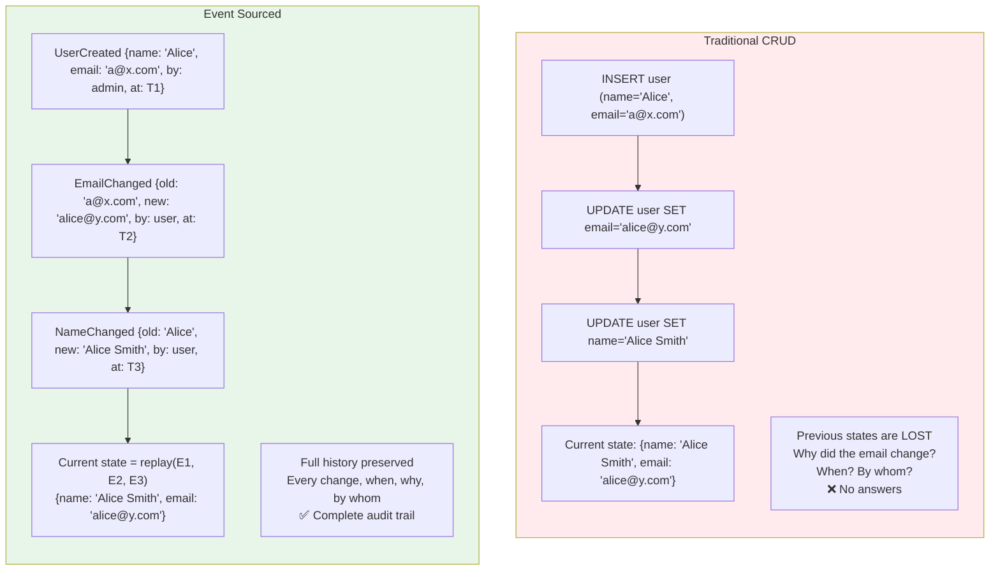

**Event Sourcing stores facts.** A fact is something that happened — it cannot be changed or deleted. The current state is just a **left fold** over the event history.

```
currentState = events.reduce(applyEvent, initialState)
```

---

## Fundamental Concepts

### The Event

An event is an **immutable record** of something that happened in the past. It is always named in **past tense** because it represents a fact that already occurred.

| Field | Description | Example |
|-------|-------------|---------|
| `event_id` | Globally unique identifier | `evt-a7f3b2c1` |
| `aggregate_id` | Entity this event belongs to | `order-12345` |
| `aggregate_type` | Type of aggregate | `Order` |
| `event_type` | What happened | `OrderPlaced` |
| `data` | Event payload | `{items: [...], total: 149.99}` |
| `metadata` | Context: who, why, correlation | `{user_id: "U1", correlation_id: "req-789"}` |
| `version` | Sequence number for this aggregate | `3` |
| `timestamp` | When it happened | `2025-01-15T10:30:00Z` |

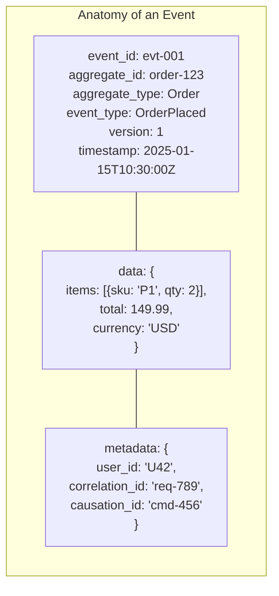

### The Aggregate

An aggregate is the **consistency boundary** — the entity whose event stream you are managing. All events for one aggregate are stored together and ordered by version.

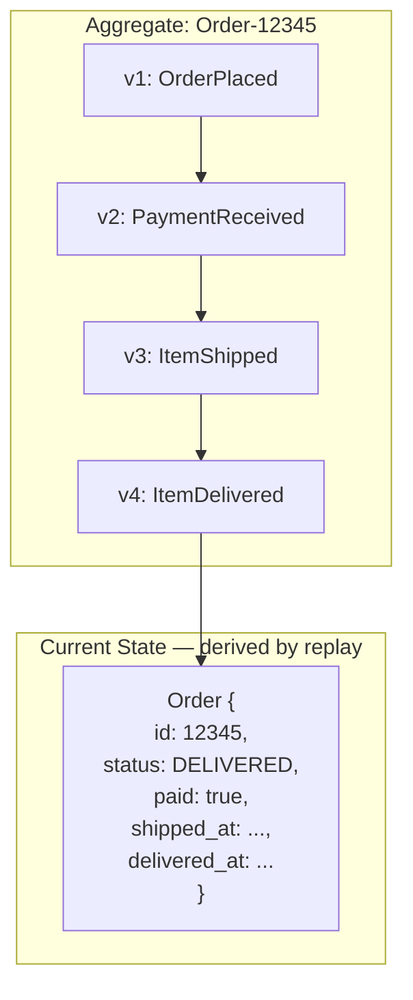

### The Event Store

The event store is the **append-only** database that holds all events. It is the single source of truth.

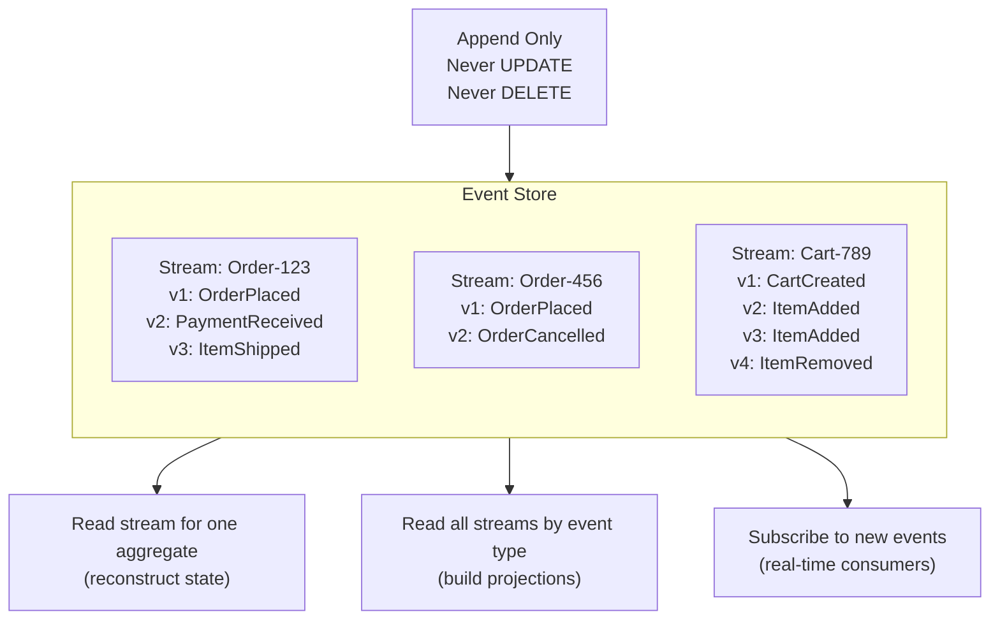

---

## Event Store Schema Design

### Relational (PostgreSQL)

```
events
├── event_id         UUID PRIMARY KEY
├── aggregate_id     VARCHAR NOT NULL
├── aggregate_type   VARCHAR NOT NULL
├── event_type       VARCHAR NOT NULL
├── version          INT NOT NULL              ← per-aggregate sequence number
├── data             JSONB NOT NULL            ← event payload
├── metadata         JSONB                     ← correlation, causation, user
├── created_at       TIMESTAMP NOT NULL
│
├── UNIQUE (aggregate_id, version)             ← optimistic concurrency guard
└── INDEX  (aggregate_type, created_at)        ← for projections / subscriptions
```

The `UNIQUE (aggregate_id, version)` constraint is critical — it prevents two concurrent writes from appending the same version number, providing **optimistic concurrency control**.

### Purpose-Built Event Stores

| Store | Type | Strengths |
|-------|------|-----------|
| **EventStoreDB** | Purpose-built | Native projections, subscriptions, built for event sourcing |
| **PostgreSQL** | Relational | Familiar, ACID, good enough for most scales |
| **DynamoDB** | NoSQL | Infinite scale, partition by aggregate_id, sort by version |
| **Kafka** | Distributed log | High throughput, natural append-only, but limited querying |
| **MongoDB** | Document | Flexible schema, good for nested event data |
| **Cassandra** | Wide-column | Write-optimized, partition by aggregate, cluster by version |

### DynamoDB Event Store Design

```
Table: events
├── PK (Partition Key):  aggregate_id        ← "Order-12345"
├── SK (Sort Key):       version             ← 1, 2, 3, ...
├── event_type:          "OrderPlaced"
├── data:                { ... }
├── metadata:            { ... }
├── created_at:          "2025-01-15T10:30:00Z"
│
└── GSI: event_type + created_at             ← query all events of a type
```

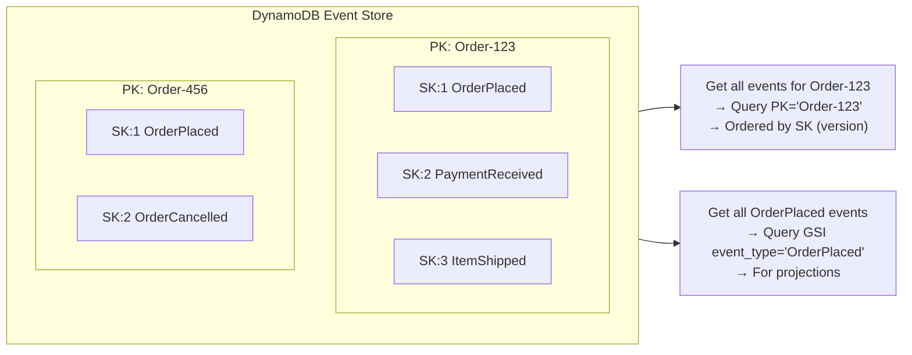

---

## State Reconstruction (Rehydration)

To get the current state of an aggregate, read all its events from the store and replay them through a state-building function.

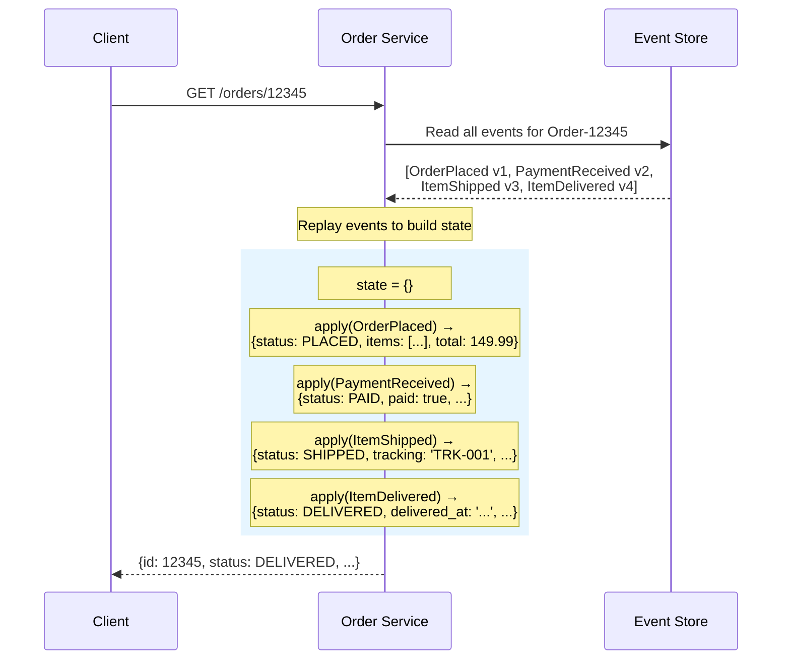

### The Apply Function (Fold)

Each event type has a pure function that takes the current state and the event, and returns the new state. No side effects. No I/O.

```
function apply(state, event):
    switch event.type:
        case "OrderPlaced":
            return { ...state,
                     id: event.data.order_id,
                     items: event.data.items,
                     total: event.data.total,
                     status: "PLACED" }

        case "PaymentReceived":
            return { ...state,
                     paid: true,
                     payment_id: event.data.payment_id,
                     status: "PAID" }

        case "ItemShipped":
            return { ...state,
                     tracking_id: event.data.tracking_id,
                     shipped_at: event.timestamp,
                     status: "SHIPPED" }

        case "OrderCancelled":
            return { ...state,
                     cancelled_reason: event.data.reason,
                     status: "CANCELLED" }
```

---

## Snapshots — Solving the Replay Performance Problem

For an aggregate with thousands of events, replaying from the beginning on every read is expensive. **Snapshots** store periodic checkpoints of the materialized state.

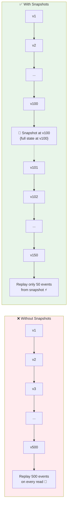

### Snapshot Strategy

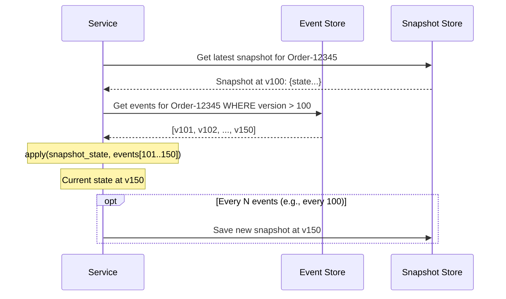

| Snapshot Strategy | When to Snapshot | Trade-off |
|------------------|-----------------|-----------|
| **Every N events** | After every 100 events | Simple, predictable |
| **Time-based** | Every hour / day | Good for infrequently updated aggregates |
| **On read** | Snapshot after rebuilding if stale | Lazy, amortizes cost |
| **On write** | Snapshot after every write | Always fresh, extra write overhead |

### Snapshot Storage

| Store | Approach |
|-------|----------|
| **Same event store** | Special `Snapshot` event type at the end of the stream |
| **Separate table** | `snapshots(aggregate_id, version, state, created_at)` |
| **Cache (Redis)** | Fast reads, rebuild from events on cache miss |
| **S3 / Blob store** | For very large aggregate states |

---

## Projections — Building Read Models

Events are optimized for writing (append-only, ordered). But reading patterns are different — you need indexes, aggregations, search, joins. **Projections** transform the event stream into read-optimized views.

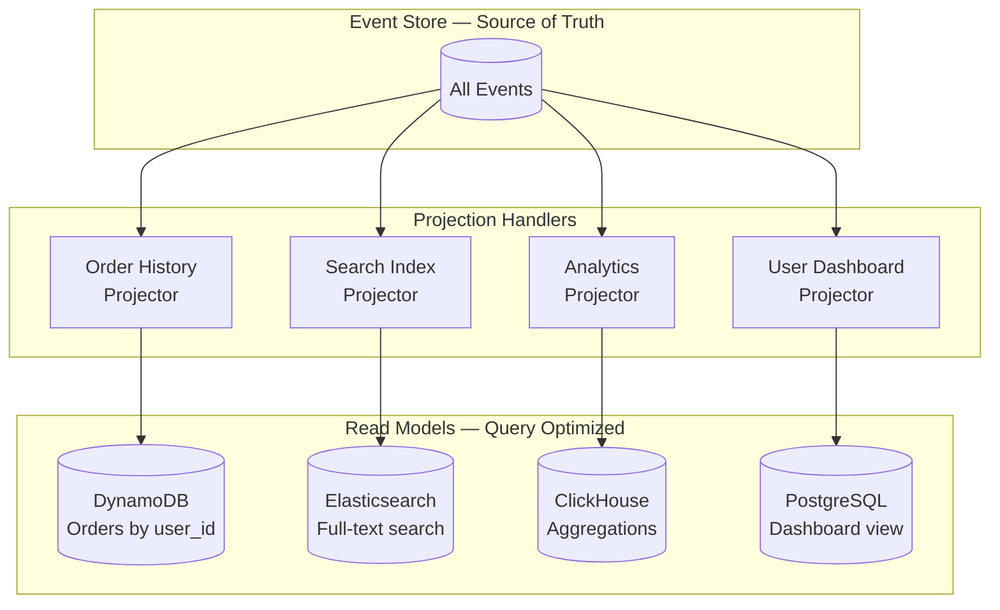

### Types of Projections

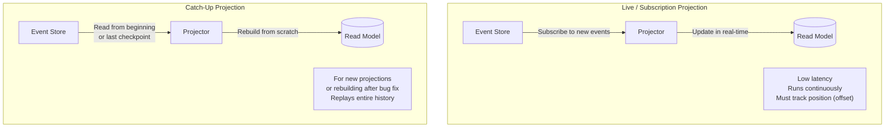

| Projection Type | When Used | Characteristics |
|----------------|-----------|-----------------|
| **Live (subscription)** | Normal operation | Real-time, low-latency, tracks offset |
| **Catch-up (replay)** | New read model, bug fix, schema change | Replays from beginning, can take hours for large stores |
| **One-time** | Analytics, reports, ad-hoc queries | Run once, no ongoing subscription |

### Projection Example: Order Dashboard

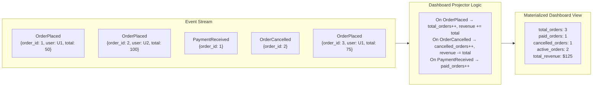

### Projection Rebuild (The Superpower)

One of the most powerful aspects of event sourcing: **you can build entirely new read models from existing events, without changing anything upstream.**

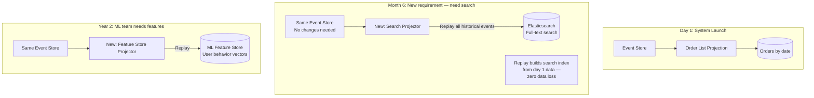

---

## Event Sourcing + CQRS — The Natural Pairing

Event Sourcing (how data is stored) and CQRS (how reads/writes are separated) complement each other perfectly.

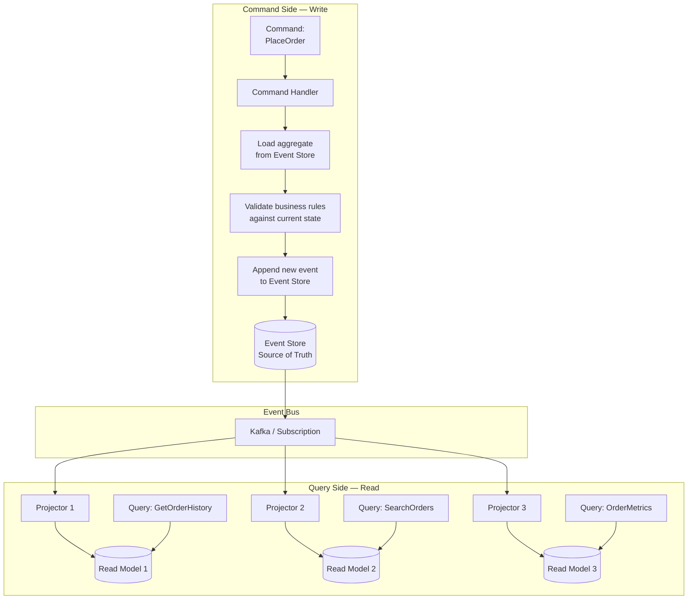

### Command Processing Flow

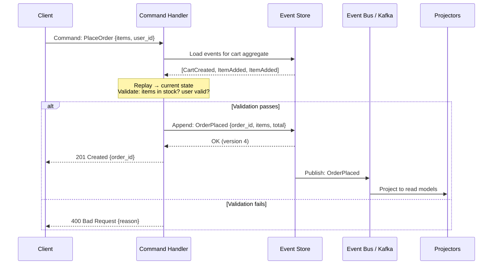

---

## Concurrency Control

What happens when two concurrent requests try to modify the same aggregate?

### Optimistic Concurrency with Version Numbers

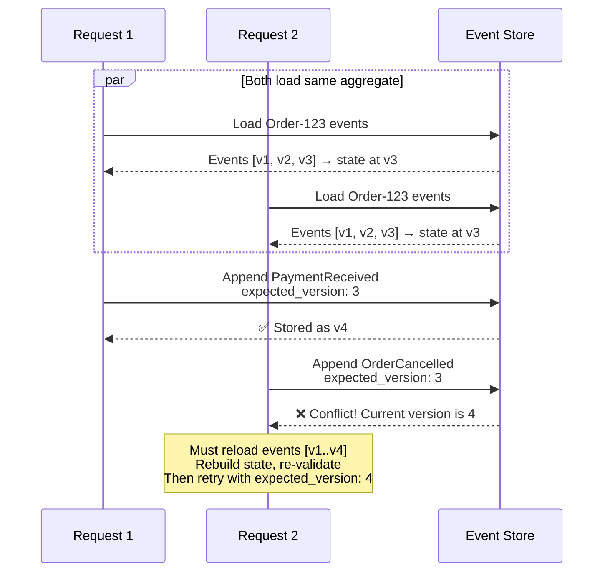

**Implementation (PostgreSQL):**

```sql
INSERT INTO events (aggregate_id, version, event_type, data, created_at)
VALUES ('Order-123', 4, 'PaymentReceived', '{"payment_id": "..."}', NOW());

-- The UNIQUE(aggregate_id, version) constraint ensures
-- only one writer can claim version 4.
-- Concurrent writer gets: ERROR: duplicate key value violates unique constraint
```

**Implementation (DynamoDB):**

```json
{
  "TableName": "events",
  "Item": { "aggregate_id": "Order-123", "version": 4, ... },
  "ConditionExpression": "attribute_not_exists(version)"
}
```

---

## Event Versioning and Schema Evolution

Events are immutable — you cannot change old events. But business requirements evolve. How do you handle schema changes?

### Strategy 1: Upcasting (Recommended)

Transform old event formats to new formats **at read time** using an upcaster pipeline.

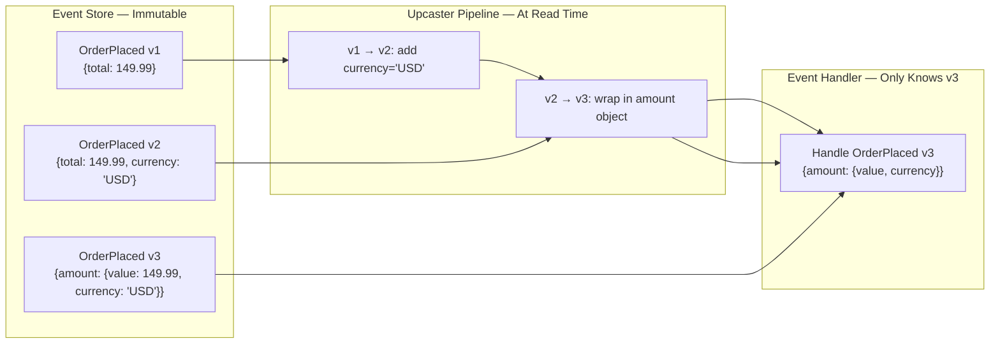

### Strategy 2: New Event Type

When the change is semantically different, introduce a new event type.

```
-- Original
OrderPlaced { items, total, shipping_address }

-- New requirement: split shipping
OrderPlacedV2 { items, total, shipping_address, billing_address }

-- Handler supports both
handle(OrderPlaced)   → use shipping_address as billing_address (backward compat)
handle(OrderPlacedV2) → use both addresses
```

### Strategy 3: Event Wrapper with Schema Version

```json
{
  "event_type": "OrderPlaced",
  "schema_version": 3,
  "data": { ... }
}
```

The consumer checks `schema_version` and routes to the appropriate handler or upcaster.

### Comparison

| Strategy | Pros | Cons | Best For |
|----------|------|------|----------|
| **Upcasting** | Old events untouched, handler only knows latest | Upcaster chain can grow long | Most cases — incremental field additions |
| **New event type** | Clean separation | Must support old + new type forever | Semantically different events |
| **Schema version field** | Explicit versioning | Handler complexity | Large-scale with many versions |
| **Copy-transform (migration)** | Clean store after migration | Breaks immutability — last resort | Major rewrites (rare) |

---

## Temporal Queries — Time Travel

Event sourcing gives you something no CRUD system can: **the ability to query the state of any entity at any point in time.**

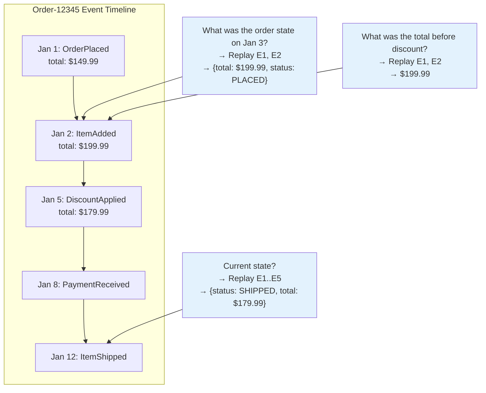

### Use Cases for Temporal Queries

| Use Case | Query | Business Value |
|----------|-------|---------------|
| **Dispute resolution** | "What was the price when the customer ordered?" | Resolve pricing complaints with facts |
| **Regulatory compliance** | "What was the account state at end-of-quarter?" | Auditable point-in-time reporting |
| **Debugging** | "What events led to this inconsistent state?" | Root cause analysis from event history |
| **Retroactive analytics** | "What would revenue be if we hadn't given discount X?" | What-if analysis by selective replay |
| **Undo / Replay** | "Rebuild state after fixing a bug in event handler" | Correct read models without data loss |

---

## Practical Example: E-Commerce Order Lifecycle

### Event Stream for a Complete Order

```mermaid
flowchart TB
    subgraph stream [Event Stream: Order-7890]
        E1["v1: OrderPlaced<br/>{user: U42, items: [{sku: P1, qty: 2, price: 29.99},<br/>{sku: P2, qty: 1, price: 89.99}], total: 149.97}"]
        E2["v2: InventoryReserved<br/>{items: [{sku: P1, qty: 2}, {sku: P2, qty: 1}]}"]
        E3["v3: PaymentAuthorized<br/>{payment_id: PAY-001, amount: 149.97, method: 'VISA ****4242'}"]
        E4["v4: PaymentCaptured<br/>{payment_id: PAY-001, captured_amount: 149.97}"]
        E5["v5: OrderConfirmed<br/>{estimated_delivery: '2025-01-22'}"]
        E6["v6: ShipmentCreated<br/>{shipment_id: SHP-001, carrier: 'FedEx', tracking: 'TRK123'}"]
        E7["v7: ItemShipped<br/>{shipment_id: SHP-001, shipped_at: '2025-01-18T14:00:00Z'}"]
        E8["v8: ItemDelivered<br/>{shipment_id: SHP-001, delivered_at: '2025-01-21T09:30:00Z',<br/>signed_by: 'Alice Smith'}"]

        E1 --> E2 --> E3 --> E4 --> E5 --> E6 --> E7 --> E8
    end
```

### Multiple Projections from Same Events

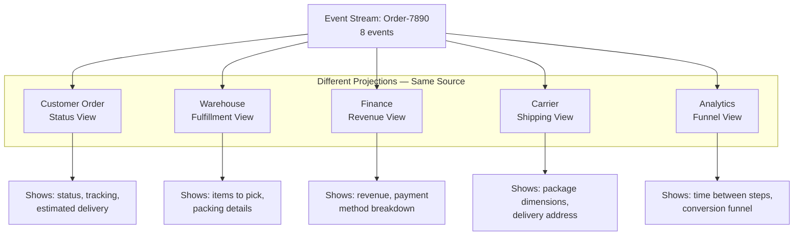

---

## Practical Example: Bank Account

Banking is one of the most natural fits for event sourcing — regulators literally require a complete, immutable audit trail.

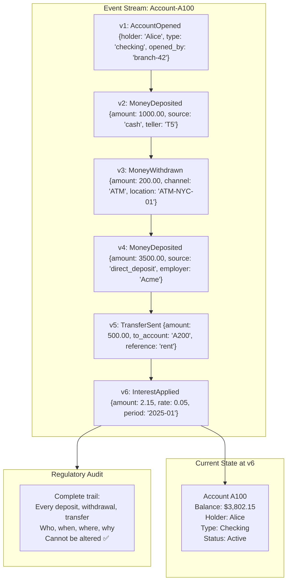

**State derivation:**

```
v1: balance = 0         (account opened)
v2: balance = 1000      (+1000 deposit)
v3: balance = 800       (-200 withdrawal)
v4: balance = 4300      (+3500 deposit)
v5: balance = 3800      (-500 transfer)
v6: balance = 3802.15   (+2.15 interest)
```

---

## Event Sourcing with Kafka

Kafka's append-only, immutable log is architecturally similar to an event store, making it a common infrastructure choice.

```mermaid
flowchart TB
    subgraph write [Write Path]
        SVC[Service] -->|Append events| KAFKA[Kafka Topic:<br/>order-events<br/>Key: order_id]
    end

    subgraph kafka_internals [Kafka — Acts as Event Store]
        KAFKA --> PART0["Partition 0<br/>Order-1 events<br/>Order-7 events"]
        KAFKA --> PART1["Partition 1<br/>Order-2 events<br/>Order-8 events"]
        KAFKA --> PART2["Partition 2<br/>Order-3 events<br/>Order-9 events"]
    end

    subgraph consumers [Read Path — Projections]
        PART0 & PART1 & PART2 --> CG1[Consumer Group:<br/>Search Projector]
        PART0 & PART1 & PART2 --> CG2[Consumer Group:<br/>Analytics Projector]
        PART0 & PART1 & PART2 --> CG3[Consumer Group:<br/>State Rebuilder]
    end

    CG1 --> ES[(Elasticsearch)]
    CG2 --> CH[(ClickHouse)]
    CG3 --> CACHE[(Redis State Cache)]
```

### Kafka as Event Store — Limitations

| Capability | Dedicated Event Store | Kafka |
|-----------|----------------------|-------|
| Append events | ✅ | ✅ |
| Read single aggregate's stream | ✅ Efficient (by aggregate_id) | ❌ Must scan partition — events for many aggregates mixed |
| Optimistic concurrency (version check) | ✅ Native | ❌ Not supported — no conditional append |
| Infinite retention | ✅ Designed for it | ⚠️ Possible but expensive — Kafka optimized for throughput, not storage |
| Subscriptions / projections | ✅ Native | ✅ Consumer groups |
| Global ordering | ✅ Per-stream | ✅ Per-partition only |
| Event replay | ✅ By stream | ✅ By resetting consumer offset |

**Verdict:** Use Kafka as the **event bus** (publishing events to consumers/projections), but use a **dedicated event store** (EventStoreDB, PostgreSQL, DynamoDB) as the source-of-truth write store — especially if you need per-aggregate reads and optimistic concurrency.

```mermaid
flowchart LR
    SVC[Service] -->|1. Append| ES[(Event Store<br/>PostgreSQL / EventStoreDB<br/>Source of Truth)]
    ES -->|2. Publish via CDC<br/>or outbox| KAFKA[Kafka<br/>Distribution Bus]
    KAFKA --> P1[Projector 1]
    KAFKA --> P2[Projector 2]
    KAFKA --> P3[Projector 3]

    style ES fill:#4CAF50,color:#fff
    style KAFKA fill:#2196F3,color:#fff
```

---

## Event Sourcing in SAGA

Event sourcing provides a natural audit trail for every SAGA step, and the event store acts as the SAGA log.

```mermaid
sequenceDiagram
    participant ORCH as SAGA Orchestrator
    participant ES as Event Store
    participant OS as Order Service
    participant PS as Payment Service

    ORCH->>ES: Append: SagaStarted {saga_id, order_id}

    ORCH->>OS: CreateOrder
    OS-->>ORCH: OrderCreated
    ORCH->>ES: Append: OrderStepCompleted {saga_id}

    ORCH->>PS: ChargePayment
    PS-->>ORCH: PaymentFailed

    ORCH->>ES: Append: PaymentStepFailed {saga_id, reason}
    ORCH->>ES: Append: CompensationStarted {saga_id}

    ORCH->>OS: CancelOrder (compensate)
    OS-->>ORCH: OrderCancelled
    ORCH->>ES: Append: CompensationCompleted {saga_id}
    ORCH->>ES: Append: SagaFailed {saga_id}

    Note over ES: Complete SAGA history<br/>available for debugging,<br/>replay, and audit
```

---

## Common Pitfalls

### Pitfall 1: Treating the Event Store as a Database

```mermaid
flowchart LR
    subgraph wrong [❌ Querying the Event Store Directly]
        CLIENT1[Client] -->|"Find all orders > $100<br/>placed in January"| ES1[Event Store]
        Note1["Event stores are not query engines<br/>This is slow and painful"]
    end

    subgraph right [✅ Query the Projection]
        ES2[Event Store] --> PROJ[Projector]
        PROJ --> RM[(Read Model<br/>indexed, optimized)]
        CLIENT2[Client] -->|"SELECT * WHERE total > 100<br/>AND placed_at >= '2025-01-01'"| RM
    end

    style wrong fill:#ffebee
    style right fill:#e8f5e9
```

### Pitfall 2: Enormous Aggregates

An aggregate with millions of events is unmanageable even with snapshots.

**Fix:** Model smaller aggregates. Instead of one `User` aggregate with every event, use `UserProfile`, `UserPreferences`, `UserOrderHistory` as separate aggregates.

### Pitfall 3: Events Containing Derived Data

```mermaid
flowchart LR
    subgraph bad [❌ Derived Data in Event]
        E1["OrderPlaced {<br/>  items: [...],<br/>  subtotal: 120.00,<br/>  tax: 10.80,<br/>  total: 130.80<br/>}"]
        Note1["If tax rate changes,<br/>historical replay gives<br/>wrong totals"]
    end

    subgraph good [✅ Only Source Data in Event]
        E2["OrderPlaced {<br/>  items: [...],<br/>  tax_rate_id: 'TX-CA-2025'<br/>}"]
        Note2["Compute subtotal, tax, total<br/>at projection time with<br/>correct historical rate"]
    end

    style bad fill:#ffebee
    style good fill:#e8f5e9
```

### Pitfall 4: Not Handling Projection Failure

Projections can fail or fall behind. You need:

| Mechanism | Purpose |
|-----------|---------|
| **Checkpoint / offset tracking** | Resume from where projection stopped |
| **Rebuild capability** | Drop and rebuild projection from scratch |
| **Monitoring / alerting** | Alert when projection lag exceeds threshold |
| **Idempotent projectors** | Handle redelivered events without corruption |

### Pitfall 5: Exposing Internal Events to External Consumers

Internal events leak domain internals. Expose **integration events** instead.

```mermaid
flowchart LR
    subgraph internal [Internal Events — Private]
        IE1[OrderValidationPassed]
        IE2[InventoryLockAcquired]
        IE3[PaymentGatewayResponseReceived]
        IE4[FraudScoreCalculated]
    end

    subgraph transform [Event Transformer]
        T[Map internal → integration]
    end

    subgraph external [Integration Events — Public API]
        EE1[OrderConfirmed]
        EE2[OrderShipped]
    end

    internal --> transform --> external

    style internal fill:#ffebee
    style external fill:#e8f5e9
```

---

## Pros and Cons

### Pros

| Advantage | Detail |
|-----------|--------|
| **Complete audit trail** | Every change is recorded — who, when, what, why |
| **Temporal queries** | Query state at any point in time |
| **Projection rebuild** | Build new read models from existing events without data migration |
| **Debugging superpower** | Replay events to reproduce any bug |
| **No data loss** | Nothing is ever overwritten or deleted |
| **Natural fit for CQRS** | Events bridge write model to multiple read models |
| **Domain-driven** | Events capture business intent, not just data mutations |
| **Retroactive fixes** | Fix a projection bug and replay — corrected data appears automatically |
| **Decoupled consumers** | New downstream systems consume historical + live events |

### Cons

| Disadvantage | Detail |
|--------------|--------|
| **Complexity** | Fundamentally different mental model — steep learning curve |
| **Eventual consistency** | Read models lag behind the event store |
| **Event schema evolution** | Changing event schemas requires upcasting — can't ALTER old events |
| **Storage growth** | Events accumulate forever — need retention and archival strategy |
| **Replay time** | Rebuilding projections from scratch can take hours for large stores |
| **Query limitations** | Event store is not queryable — must build projections for every access pattern |
| **Framework maturity** | Fewer off-the-shelf solutions compared to CRUD frameworks |
| **GDPR / right to deletion** | Immutable events conflict with "right to be forgotten" — needs crypto-shredding |
| **Testing complexity** | Must test event handlers, projections, upcasters, and snapshot logic |

---

## When to Use Event Sourcing

```mermaid
flowchart TB
    Q1{Do you need a complete<br/>audit trail of every change?}
    Q1 -->|No| Q2{Do you need to query<br/>historical state at any<br/>point in time?}
    Q2 -->|No| Q3{Do you need to build<br/>multiple read models from<br/>the same data?}
    Q3 -->|No| CRUD[Stick with CRUD<br/>Event sourcing is overkill]
    Q3 -->|Yes| MAYBE[Consider CQRS<br/>without full event sourcing]

    Q1 -->|Yes| USE[✅ Strong candidate<br/>for Event Sourcing]
    Q2 -->|Yes| USE

    Q4{Is your domain inherently<br/>event-driven?}
    Q4 -->|Yes, e.g., trading,<br/>logistics, workflows| USE
    Q4 -->|No, simple CRUD| CRUD

    Q5{Can your team handle<br/>the complexity?}
    Q5 -->|Yes| USE
    Q5 -->|No, limited experience| START[Start with CRUD +<br/>event publishing.<br/>Migrate later if needed]

    style USE fill:#4CAF50,color:#fff
    style CRUD fill:#9E9E9E,color:#fff
    style MAYBE fill:#FF9800,color:#fff
    style START fill:#2196F3,color:#fff
```

### Use Event Sourcing When

- **Audit and compliance are mandatory** — financial systems, healthcare, regulated industries
- **The domain is inherently event-driven** — order lifecycle, supply chain, trading, IoT telemetry
- **You need temporal queries** — "what was the state on date X?"
- **Multiple teams need different views of the same data** — projection rebuild is invaluable
- **Debugging production issues** by replaying events is a priority
- **You're already using CQRS** — event sourcing is a natural complement
- **Undo/redo capabilities** are a product requirement

### Do NOT Use Event Sourcing When

- **Simple CRUD with no audit needs** — a todo app, a blog, basic settings page
- **Your team is unfamiliar** — the learning curve is real; get CRUD right first
- **Strict GDPR deletion requirements** without a crypto-shredding strategy in place
- **Low entity count, infrequent changes** — the overhead is not justified
- **You need strong consistency on reads** — eventual consistency from projections may not be acceptable
- **The domain has no meaningful events** — if "UserUpdated" is your only event, you're doing it wrong

---

## Real-World Implementations

| System | Domain | Implementation Details |
|--------|--------|----------------------|
| **LinkedIn** | Activity feed | Event-sourced user activity — replayed to build feed projections |
| **Netflix** | Content metadata | Event-sourced content catalog for multi-region consistency |
| **Walmart** | Inventory | Event-sourced stock movements across 4,700+ stores |
| **Capital One** | Banking | Transaction history as immutable event log — regulatory requirement |
| **Lego** | E-commerce | Order lifecycle event-sourced with Axon Framework |
| **EventStoreDB** | Infrastructure | Purpose-built database for event sourcing (used by many) |
| **Axon Framework** | Java framework | Full event sourcing + CQRS + SAGA support |
| **Marten** | .NET library | Event sourcing on PostgreSQL with JSONB |
| **Temporal.io** | Workflow engine | Durable execution built on event-sourced workflow state |

---

## GDPR and the Right to Be Forgotten

Immutable events conflict with GDPR's requirement to delete personal data. The solution: **crypto-shredding**.

```mermaid
flowchart TB
    subgraph write_time [At Write Time]
        EVENT["OrderPlaced {<br/>  order_id: 123,<br/>  user_pii: ENCRYPTED(name, email, address)<br/>  encryption_key_ref: 'user-U42-key'<br/>}"]
        KEYSTORE["Key Store:<br/>user-U42-key → AES-256 key"]
    end

    subgraph normal_read [Normal Read — Key Exists]
        READ1[Read event] --> DECRYPT["Decrypt user_pii<br/>with user-U42-key"]
        DECRYPT --> FULL["Full event data visible"]
    end

    subgraph gdpr_delete [GDPR Deletion Request]
        DELETE["Delete user-U42-key<br/>from Key Store"] --> READ2[Read event]
        READ2 --> UNDECRYPT["Cannot decrypt user_pii<br/>Key destroyed"]
        UNDECRYPT --> REDACTED["Event exists but PII<br/>is permanently unreadable<br/>= effectively deleted"]
    end

    style gdpr_delete fill:#e3f2fd
```

**Events remain immutable.** Only the encryption key is deleted. Without the key, the personal data in the events is cryptographically unrecoverable — satisfying GDPR without breaking the event log.

---

## Key Takeaways for System Design Interviews

1. **"Store events, derive state"** — this is the one-sentence summary. Everything else follows from this.
2. **Events are immutable facts in past tense** — `OrderPlaced`, not `PlaceOrder`. The naming matters.
3. **Current state = fold over events** — the apply function is pure, deterministic, no side effects.
4. **Projections are the read side** — you never query the event store directly for user-facing reads.
5. **Snapshots solve the replay performance problem** — without them, aggregates with thousands of events are impractical.
6. **Optimistic concurrency via version numbers** — the UNIQUE(aggregate_id, version) constraint prevents write conflicts.
7. **Event schema evolution requires upcasting** — you cannot ALTER old events. Plan for this from day one.
8. **Kafka is the bus, not the store** — use Kafka to distribute events to projections, but use a dedicated event store for the write side.
9. **Projection rebuild is the superpower** — "we can build any new read model from historical events" is a powerful interview answer.
10. **GDPR + immutability = crypto-shredding** — encrypt PII in events, delete the key on erasure request.
11. **Don't use it for everything** — event sourcing adds significant complexity. Use it where the audit trail and temporal queries justify the cost.
12. **Pair with CQRS** — event sourcing without CQRS forces you to query the event store directly, which is painful. Always pair them.

---

## Related Concepts

- **[Kafka Communication Patterns](./kafka-communication-patterns.md)** — Kafka as the event distribution bus for projections
- **[SAGA Pattern](./saga-pattern.md)** — SAGAs benefit from event-sourced step logging
- **[Idempotency](./idempotency.md)** — Projection handlers must be idempotent for replay safety
- **[Two-Phase Commit](./two-phase-commit.md)** — The transactional alternative when you need strong consistency
- **CQRS** — The natural architectural companion to event sourcing
- **Outbox Pattern** — Reliable event publishing from the event store to Kafka
- **Domain-Driven Design** — Aggregates, bounded contexts, and domain events align with event sourcing
