# Idempotency — Deep Dive

In distributed systems, **failures are not exceptions — they are the norm.** Networks drop packets, services restart, clients retry. The question is never "will this request be sent twice?" but "when it is sent twice, will the system behave correctly?" Idempotency is the property that makes the answer "yes."

---

## What is Idempotency?

An operation is **idempotent** if performing it multiple times produces the **same result** as performing it once.

Mathematically: `f(x) = f(f(x))`

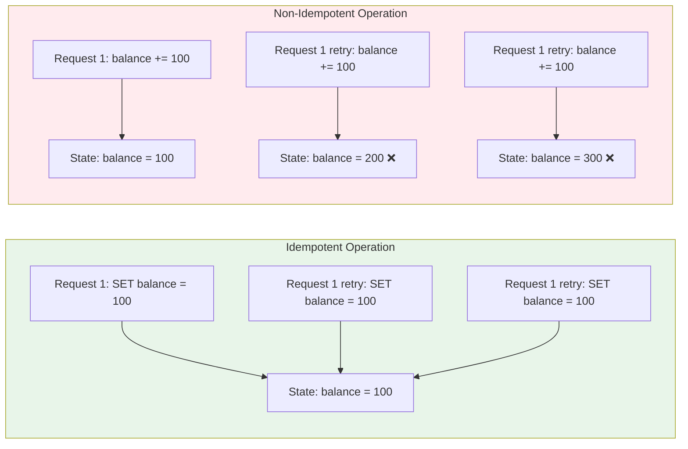

| Category | Example | Idempotent? | Why |
|----------|---------|-------------|-----|
| **Absolute write** | `SET x = 5` | ✅ Yes | Same result no matter how many times |
| **Delete** | `DELETE WHERE id = 42` | ✅ Yes | First call deletes, subsequent calls are no-ops |
| **Read** | `SELECT * FROM users WHERE id = 1` | ✅ Yes | Doesn't change state |
| **Increment** | `UPDATE SET qty = qty + 1` | ❌ No | Each call changes the result |
| **Insert** | `INSERT INTO orders (...)` | ❌ No | Creates duplicate rows |
| **Append** | `list.append(item)` | ❌ No | List grows on each call |

---

## Why Idempotency Matters in Distributed Systems

In a distributed system, there are exactly **three delivery guarantees** a message/request can have:

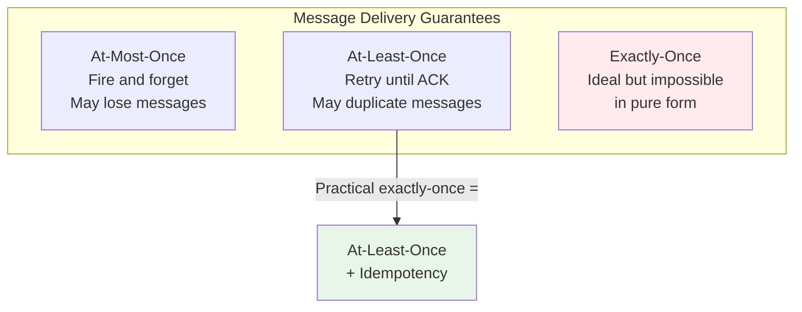

**True exactly-once delivery is impossible** in an asynchronous network (proven by the Two Generals Problem). What systems actually implement is **effectively-once processing**: deliver at-least-once, and make the handler idempotent so duplicates are harmless.

### The Retry Ambiguity Problem

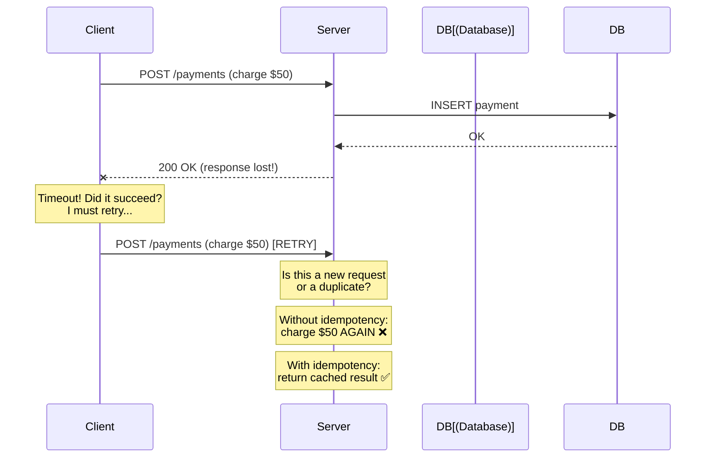

The client **cannot distinguish** between:
1. Server never received the request
2. Server processed it but the response was lost
3. Server is still processing it

Without idempotency, the only safe option is "don't retry" — which means lost requests. With idempotency, retrying is always safe.

---

## The Idempotency Key Pattern

The most widely used approach to make non-idempotent operations idempotent. The client generates a unique key for each **logical operation** and sends it with every attempt (including retries).

### How It Works

```mermaid
sequenceDiagram
    participant Client
    participant Server
    participant IdemStore[(Idempotency<br/>Key Store)]
    participant DB[(Database)]

    Note over Client: Generate UUID:<br/>idem_key = "abc-123"

    Client->>Server: POST /payments<br/>Idempotency-Key: abc-123<br/>Body: {amount: 50}

    Server->>IdemStore: Lookup "abc-123"
    IdemStore-->>Server: NOT FOUND

    Server->>IdemStore: Store "abc-123" → IN_PROGRESS
    Server->>DB: Process payment ($50)
    DB-->>Server: OK, payment_id=789
    Server->>IdemStore: Update "abc-123" → COMPLETE<br/>response: {payment_id: 789, status: 200}

    Server-->>Client: 200 OK {payment_id: 789}
```

**On retry (same idempotency key):**

```mermaid
sequenceDiagram
    participant Client
    participant Server
    participant IdemStore[(Idempotency<br/>Key Store)]

    Client->>Server: POST /payments<br/>Idempotency-Key: abc-123<br/>Body: {amount: 50}

    Server->>IdemStore: Lookup "abc-123"
    IdemStore-->>Server: FOUND → COMPLETE<br/>cached response: {payment_id: 789}

    Note over Server: Return cached response<br/>Do NOT process again

    Server-->>Client: 200 OK {payment_id: 789}
```

### Idempotency Key Store Schema

```
idempotency_keys
├── key            VARCHAR PRIMARY KEY    -- client-provided UUID
├── status         ENUM('in_progress', 'complete', 'failed')
├── request_hash   VARCHAR               -- hash of request body (detect misuse)
├── response_code  INT                   -- cached HTTP status code
├── response_body  JSONB                 -- cached response
├── created_at     TIMESTAMP
├── expires_at     TIMESTAMP             -- TTL for cleanup
└── locked_until   TIMESTAMP             -- for concurrent request handling
```

### Handling Concurrent Requests with Same Key

What if the client retries while the first request is still in progress?

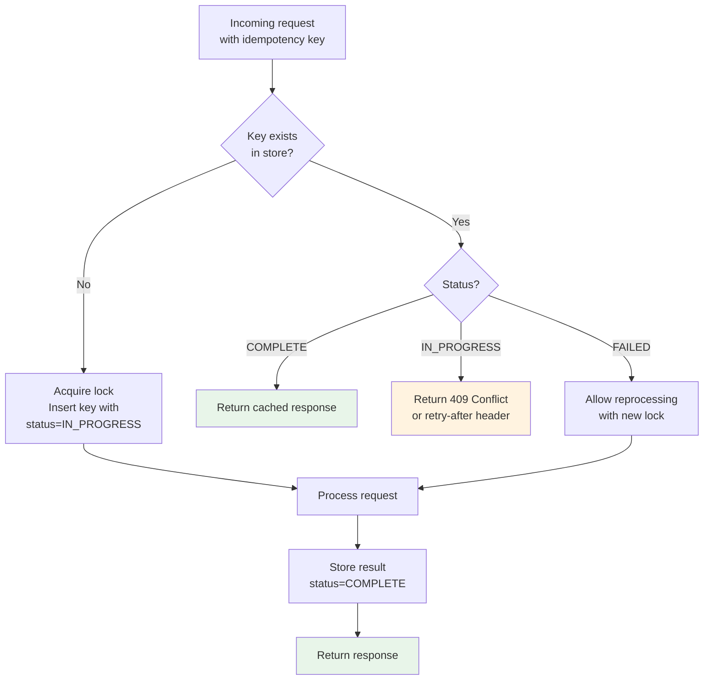

---

## Idempotency at Every Layer

Idempotency is not a single-point concern — it must be enforced at **every layer** where retries or duplicates can occur.

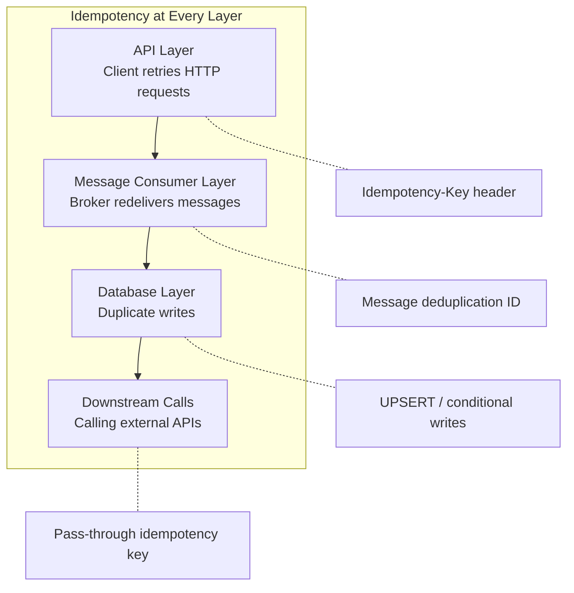

### Layer 1: API Idempotency

#### HTTP Method Idempotency (RFC 7231)

| Method | Idempotent? | Safe? | Notes |
|--------|-------------|-------|-------|
| `GET` | ✅ Yes | ✅ Yes | Read-only, no side effects |
| `HEAD` | ✅ Yes | ✅ Yes | Same as GET without body |
| `OPTIONS` | ✅ Yes | ✅ Yes | Metadata only |
| `PUT` | ✅ Yes | ❌ No | Replaces entire resource — same result on repeat |
| `DELETE` | ✅ Yes | ❌ No | First call deletes, subsequent return 404/204 |
| `POST` | ❌ No | ❌ No | Creates new resource — duplicates on retry |
| `PATCH` | ❌ No* | ❌ No | Depends on operation (see below) |

**POST is the problem child** — it's the most common method for mutations (create order, charge payment) and it's not naturally idempotent. This is where the idempotency key pattern is essential.

**PATCH nuance:**
```
PATCH: { "op": "replace", "path": "/name", "value": "Alice" }   → Idempotent ✅
PATCH: { "op": "add", "path": "/balance", "value": 100 }        → NOT Idempotent ❌
```

### Layer 2: Message Consumer Idempotency

Message brokers deliver at-least-once. Your consumer **will** see duplicates.

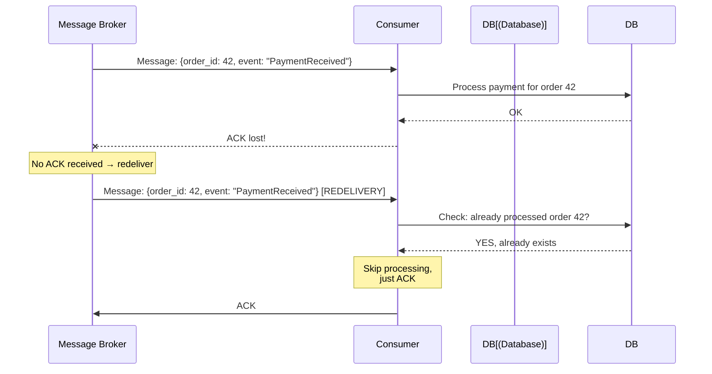

**Strategies for consumer idempotency:**

| Strategy | How | Trade-off |
|----------|-----|-----------|
| **Message ID deduplication** | Store processed message IDs, skip if seen | Need a dedup store with TTL |
| **Natural idempotency key** | Use business key (order_id) as dedup key | Not always available |
| **Idempotent operations** | Use UPSERT instead of INSERT | Only works for certain operations |
| **Outbox pattern** | Record intent in same TX as business logic | Extra table, CDC needed |

### Layer 3: Database Idempotency

Making the database layer idempotent prevents duplicates even when application-level dedup fails.

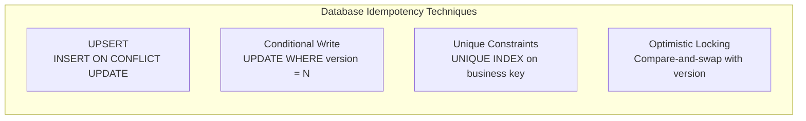

**UPSERT (PostgreSQL):**
```sql
INSERT INTO payments (idempotency_key, amount, status)
VALUES ('abc-123', 50.00, 'completed')
ON CONFLICT (idempotency_key) DO NOTHING
RETURNING *;
```

**Conditional Write (DynamoDB):**
```json
{
  "ConditionExpression": "attribute_not_exists(idempotency_key)",
  "Item": { "idempotency_key": "abc-123", "amount": 50 }
}
```

**Optimistic Locking:**
```sql
UPDATE accounts
SET balance = balance - 50, version = version + 1
WHERE id = 123 AND version = 7;
-- If 0 rows affected → concurrent modification, retry with fresh read
```

### Layer 4: Downstream Call Idempotency

When your service calls another service, propagate the idempotency key.

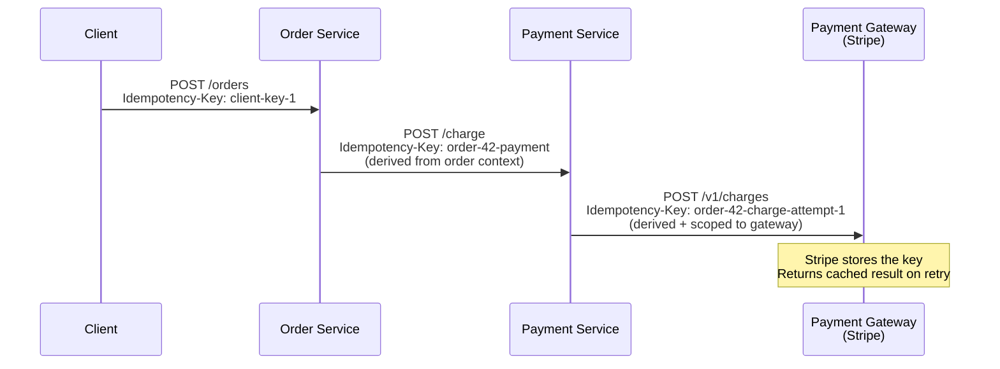

**Key derivation strategy:** Don't reuse the client's key downstream. Derive deterministic keys scoped to each downstream call:

```
downstream_key = hash(saga_id + step_name + attempt)
```

This ensures each downstream service has its own namespace and retries are correctly scoped.

---

## Implementation Patterns

### Pattern 1: Idempotency Key Table (Most Common)

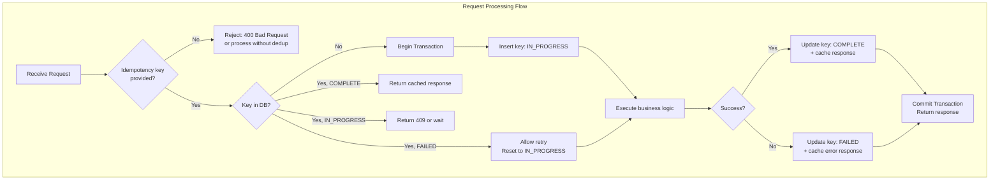

**Critical implementation detail:** The idempotency key insert and the business logic must be in the **same database transaction** (or use the outbox pattern). Otherwise, you can have the key stored but the business logic uncommitted, or vice versa.

### Pattern 2: Deterministic ID Generation

Instead of a client-provided key, derive the ID deterministically from the request content.

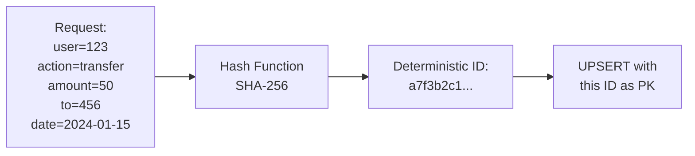

| Aspect | Client-Provided Key | Deterministic ID |
|--------|-------------------|------------------|
| Who generates? | Client | Server |
| Retry safety | Client must reuse same key | Automatic — same input = same ID |
| Different content, same key? | Possible (must validate) | Impossible by design |
| Client complexity | Must store/manage keys | None |
| Best for | APIs with diverse clients | Internal services, message consumers |

### Pattern 3: Conditional Writes (Optimistic Concurrency)

For operations that modify existing state, use version-based conditional writes.

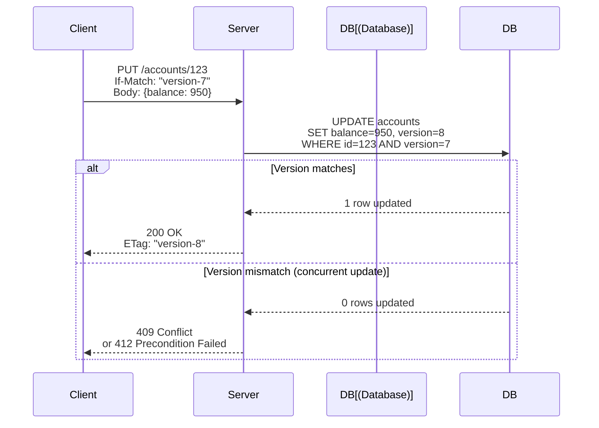

### Pattern 4: Token / Fence Pattern

For operations where you must guarantee exactly-once against an external non-idempotent system.

```mermaid
sequenceDiagram
    participant Client
    participant Server
    participant TokenStore[(Token Store)]
    participant External[External System<br/>(non-idempotent)]

    Client->>Server: Request + token "T1"

    Server->>TokenStore: Claim token "T1"<br/>(atomic: mark as used)

    alt Token valid and unclaimed
        TokenStore-->>Server: ✅ Claimed
        Server->>External: Execute operation
        External-->>Server: Result
        Server-->>Client: 200 OK + result
    else Token already used
        TokenStore-->>Server: ❌ Already claimed
        Server-->>Client: 200 OK + cached result
    end

    Note over Client: On retry: same token "T1"<br/>→ gets cached result
```

---

## Idempotency in Common Architectures

### In SAGA Pattern

Every SAGA step handler must be idempotent because the orchestrator may retry failed steps.

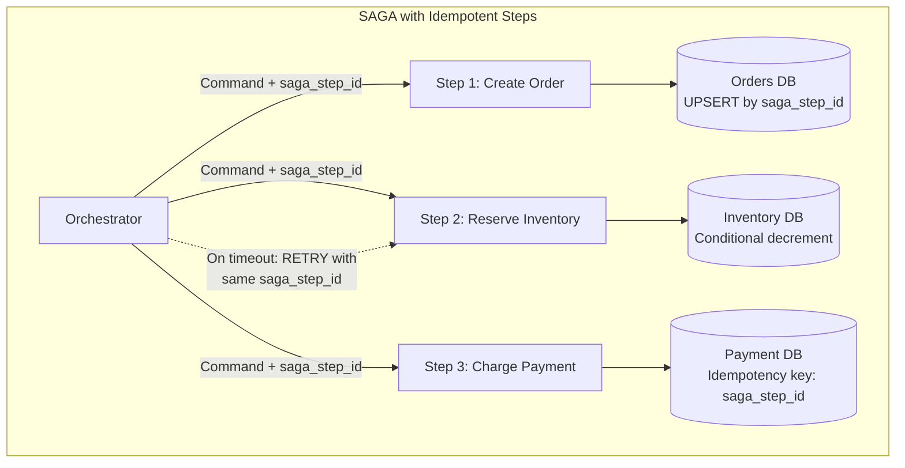

### In Event-Driven Architecture

```mermaid
flowchart TB
    subgraph event_driven [Event Consumer Idempotency]
        BROKER[Message Broker] --> CONSUMER[Consumer]
        CONSUMER --> CHECK{Seen this<br/>event_id?}
        CHECK -->|No| PROCESS[Process event]
        PROCESS --> RECORD[Record event_id<br/>in processed_events table]
        RECORD --> ACK[ACK to broker]
        CHECK -->|Yes| ACK
    end

    subgraph dedup_table [Processed Events Table]
        T[event_id PK | processed_at | result]
    end

    RECORD --> T
    CHECK --> T
```

### In Payment Systems

Payment idempotency has the highest stakes — a duplicate charge directly costs money and trust.

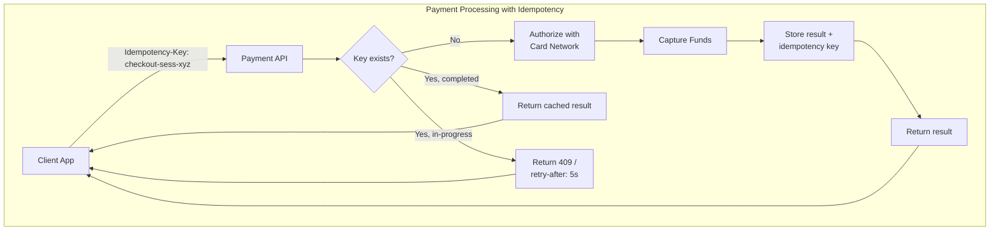

**How Stripe implements idempotency:**
- Client sends `Idempotency-Key` header
- Keys are scoped to the API key (each merchant has their own namespace)
- Results are cached for **24 hours**
- If you send the same key with **different parameters**, Stripe returns a `400` error
- If the original request is still in-progress, returns `409`

---

## Common Pitfalls and Anti-Patterns

### Pitfall 1: Idempotency Key Without Request Validation

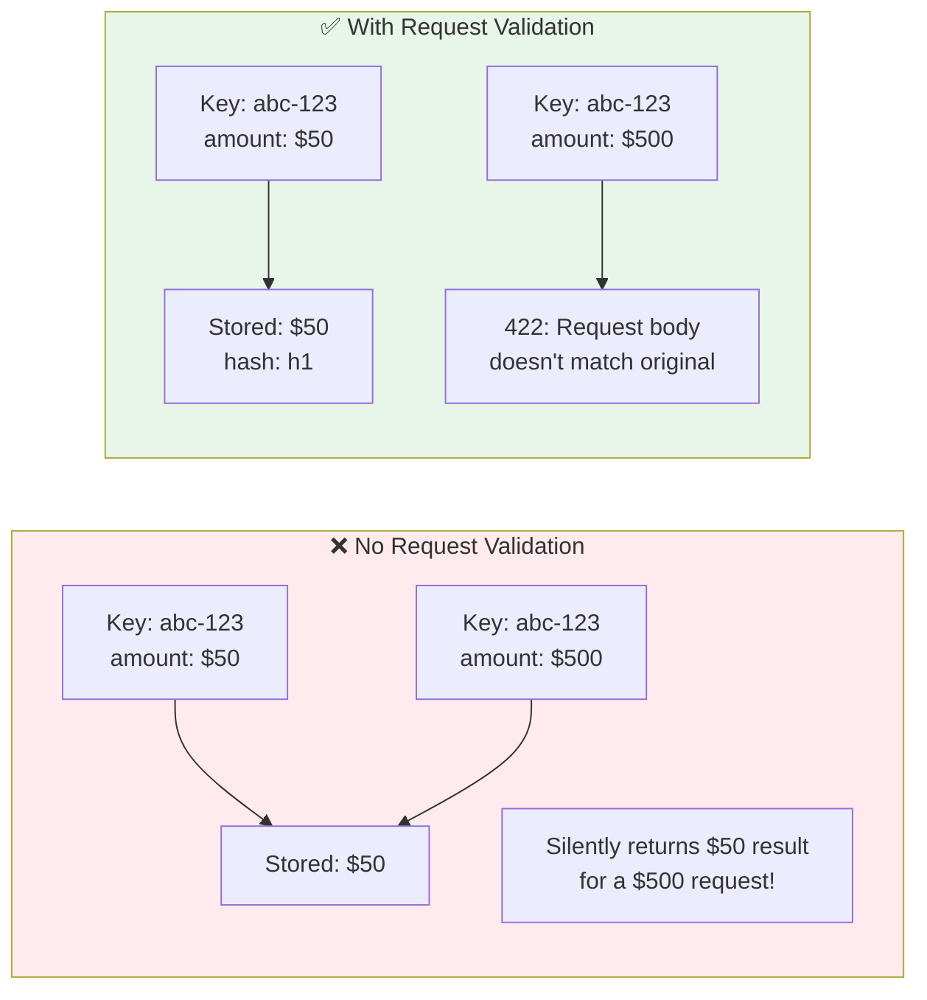

**Fix:** Store a hash of the request body alongside the idempotency key. On retry, verify the hash matches. If not, reject with an error.

### Pitfall 2: Non-Atomic Key Insert + Business Logic

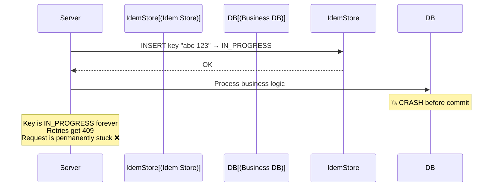

**Fix:** Either use the **same database** for the idempotency key and business data (single transaction), or implement a **TTL + reaping** mechanism for stuck IN_PROGRESS keys.

### Pitfall 3: Ignoring Side Effects

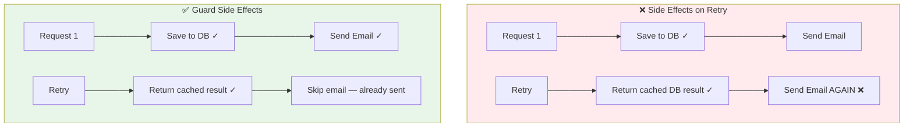

**Fix:** Track which side effects have been executed. Either include them in the idempotency record or use a separate outbox for side-effects.

### Pitfall 4: No TTL on Idempotency Keys

Keys stored forever will:
- Consume unbounded storage
- Slow down lookups
- Cause false deduplication years later (if UUIDs collide or keys are reused)

**Fix:** Set a TTL (e.g., 24-72 hours). After that, the key is purged and the same key would be treated as new.

### Pitfall 5: Making GET Requests Non-Idempotent

```
# ❌ Anti-pattern: GET with side effects
GET /messages/123    → Marks message as "read" (side effect!)

# ✅ Correct: Separate read from mutation
GET /messages/123    → Returns message (pure read)
PUT /messages/123/read-status   → Marks as read (idempotent mutation)
```

---

## Designing Idempotent APIs — Checklist

| Concern | Recommendation |
|---------|---------------|
| **Key generation** | Use UUID v4 or ULID on the client side |
| **Key header** | `Idempotency-Key` header (Stripe convention) |
| **Key scope** | Scope to authenticated user/tenant — prevent cross-tenant collisions |
| **Key TTL** | 24-72 hours. Document this for API consumers |
| **Request validation** | Hash the request body, reject mismatches on retry |
| **Concurrent requests** | Return 409 or use distributed locking for same key |
| **Failed requests** | Allow retry — reset to IN_PROGRESS (don't permanently block) |
| **Response caching** | Store the full response (status code + body) |
| **Side effects** | Guard all side effects (emails, webhooks) with dedup checks |
| **Mandatory vs optional** | Make it mandatory for POST mutations (payments, orders) |
| **Documentation** | Document idempotency behavior for each endpoint |

---

## Pros and Cons

### Pros

| Advantage | Detail |
|-----------|--------|
| **Safe retries** | Clients can retry without fear of duplicate side effects |
| **Enables at-least-once delivery** | Combined with retries, provides effectively-once semantics |
| **Network resilience** | Tolerates packet loss, timeouts, and response drops |
| **Simplifies error handling** | Client doesn't need to distinguish "already done" from "never sent" |
| **Enables SAGA pattern** | Compensating transactions can be retried safely |
| **Required for reliability** | No reliable distributed system works without it |
| **User trust** | No double charges, no duplicate orders |

### Cons

| Disadvantage | Detail |
|--------------|--------|
| **Storage overhead** | Must persist idempotency keys and cached responses |
| **Added complexity** | Every mutation endpoint needs dedup logic |
| **Stale responses** | Cached response may become outdated if underlying data changes |
| **Key management** | Clients must correctly generate and reuse keys |
| **Performance cost** | Extra DB lookup on every request to check the key store |
| **TTL trade-offs** | Too short → retries fail; too long → excessive storage |
| **Distributed key store** | In multi-region setups, key store itself needs replication |

---

## When to Use

```mermaid
flowchart TB
    Q1{Does the operation<br/>mutate state?}
    Q1 -->|No, read-only| SKIP[Already idempotent<br/>Nothing to do]
    Q1 -->|Yes| Q2{Is the operation<br/>naturally idempotent?}

    Q2 -->|Yes, e.g., PUT, DELETE,<br/>absolute SET| VERIFY[Verify and document<br/>No extra work needed]

    Q2 -->|No, e.g., POST, increment,<br/>insert, charge| Q3{Can duplicates<br/>cause harm?}

    Q3 -->|No, harmless duplication| OPTIONAL[Idempotency optional<br/>but still recommended]

    Q3 -->|Yes| REQUIRED[✅ Idempotency required]

    REQUIRED --> Q4{Client-facing API<br/>or internal service?}
    Q4 -->|Client-facing| KEY_HEADER[Use Idempotency-Key header]
    Q4 -->|Internal / message consumer| DEDUP[Use message ID dedup<br/>or deterministic ID]

    style REQUIRED fill:#4CAF50,color:#fff
    style SKIP fill:#9E9E9E,color:#fff
    style VERIFY fill:#2196F3,color:#fff
    style OPTIONAL fill:#FF9800,color:#fff
```

### Always Use Idempotency For

- **Payment processing** — double charges are unacceptable
- **Order creation** — duplicate orders frustrate users and create operational burden
- **Account mutations** — balance changes, plan upgrades, quota adjustments
- **SAGA step handlers** — orchestrator retries require idempotent steps
- **Message consumers** — brokers redeliver; consumers must dedup
- **Webhook handlers** — webhook providers retry on timeout
- **Any POST endpoint** that creates or modifies resources

### Idempotency is Less Critical For

- **Read-only operations** (GET, HEAD) — already idempotent by nature
- **Truly idempotent writes** (PUT with full replacement, DELETE) — already idempotent by HTTP semantics
- **Ephemeral/analytics events** — a duplicate page view event is usually harmless
- **Internal logging** — duplicate log entries are tolerable

---

## Real-World Implementations

| System | Approach | Details |
|--------|----------|---------|
| **Stripe** | Idempotency-Key header | 24hr TTL, scoped to API key, rejects body mismatches |
| **PayPal** | PayPal-Request-Id header | Similar to Stripe, cached for undisclosed duration |
| **AWS SQS** | MessageDeduplicationId | 5-minute dedup window for FIFO queues |
| **Kafka** | Producer idempotency | `enable.idempotence=true` with producer ID + sequence number |
| **gRPC** | Client-generated request ID | Convention: `x-request-id` metadata for dedup |
| **DynamoDB** | Conditional writes | `attribute_not_exists()` as idempotency guard |
| **Temporal.io** | Workflow ID | Starting a workflow with same ID is inherently idempotent |
| **Google Cloud Pub/Sub** | Message ordering key + dedup | Dedup within ordering scope |

---

## Key Takeaways for System Design Interviews

1. **Idempotency is non-negotiable for any mutation in a distributed system** — mention it proactively when designing APIs, consumers, or SAGA steps.
2. **"At-least-once + idempotency = effectively-once"** — this is the practical formula. True exactly-once delivery is impossible.
3. **The Idempotency-Key header pattern** is the industry standard for APIs (Stripe model). Know how to describe the full flow.
4. **Idempotency must be enforced at every layer** — API, consumer, database, downstream calls.
5. **Always hash the request body** and validate on retry — same key with different content is an error, not a retry.
6. **Natural idempotency vs. engineered idempotency** — PUT/DELETE are naturally idempotent; POST needs the idempotency key pattern.
7. **Side effects need guarding too** — don't send the email twice just because you returned a cached DB result.
8. **TTL your keys** — 24-72 hours is the sweet spot. Document it for API consumers.
9. **In SAGA, idempotency is mandatory** — every step and every compensating transaction must be idempotent.
10. **When an interviewer asks about retries, your next sentence should be about idempotency.** They are inseparable concepts.

---

## Related Concepts

- **[SAGA Pattern](./saga-pattern.md)** — Requires idempotent step handlers for safe retries
- **[Two-Phase Commit](./two-phase-commit.md)** — An alternative that avoids the need for idempotency (but has its own trade-offs)
- **Outbox Pattern** — Reliable event publishing that works alongside idempotent consumers
- **Exactly-Once Semantics** — What idempotency enables in practice
- **Optimistic Concurrency Control** — Version-based conditional writes as an idempotency mechanism
- **Deduplication** — The consumer-side counterpart to producer-side idempotency keys
