# Kafka Communication Patterns in Microservices — Deep Dive

At the scale of an Amazon-like e-commerce platform — thousands of microservices, millions of events per second, hundreds of teams — Kafka is not just a message broker. It is the **central nervous system**. Services don't call each other directly for most operations; they communicate through Kafka topics, treating events as the primary integration contract.

This guide covers every major pattern in which microservices use Kafka, why each exists, and how they combine in a real large-scale platform.

---

## Why Kafka Over Traditional Messaging?

Before diving into patterns, understand why Kafka won at this scale.

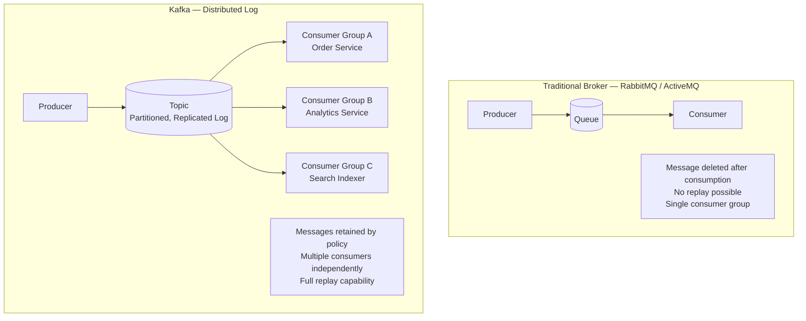

| Capability | Traditional Broker | Kafka |
|-----------|-------------------|-------|
| **Retention** | Deleted after ACK | Retained for days/weeks (configurable) |
| **Replay** | Not possible | Any consumer can rewind to any offset |
| **Fan-out** | Requires exchange/binding setup | Any number of consumer groups independently |
| **Throughput** | Thousands/sec | Millions/sec (append-only log) |
| **Ordering** | Per-queue | Per-partition (with partition key) |
| **Backpressure** | Consumer overwhelm → redelivery storm | Consumer reads at its own pace |

---

## The Big Picture: Amazon-Scale E-Commerce Event Flow

Before individual patterns, see how the entire platform connects through Kafka.

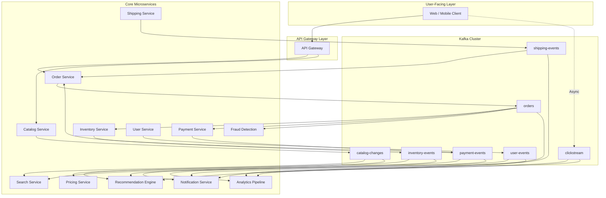

---

## Pattern 1: Event Notification (Fire-and-Forget)

The simplest and most common pattern. A service publishes a **thin event** announcing that something happened. Consumers decide independently what to do.

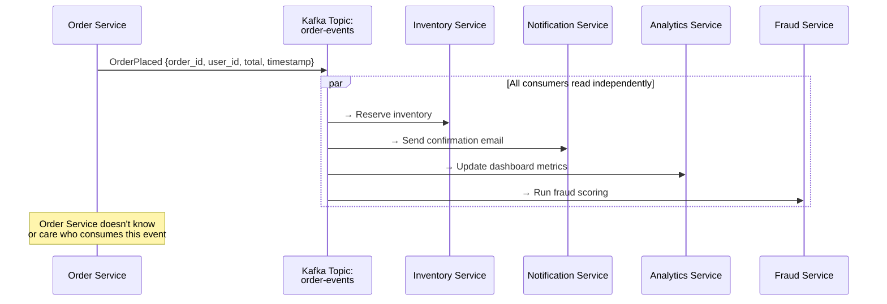

### Characteristics

| Aspect | Detail |
|--------|--------|
| **Event content** | Thin — just the fact + identifiers, not full data |
| **Coupling** | Loosest possible — producer is unaware of consumers |
| **Consumer action** | Consumer may call back to producer's API for full data |
| **Failure impact** | Consumer failure doesn't affect producer |
| **Use at Amazon** | Order placed, item shipped, payment received, user signed up |

### Thin vs. Fat Events

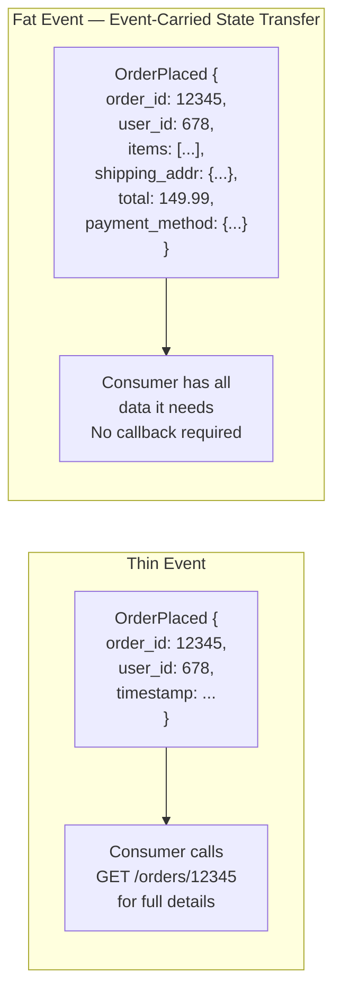

| | Thin Event | Fat Event |
|---|-----------|-----------|
| **Size** | Small (IDs + metadata) | Large (full entity state) |
| **Consumer coupling** | Must know producer's API | Self-contained |
| **Network calls** | N consumers × 1 API call each | Zero additional calls |
| **Data freshness** | Always latest (reads from source) | Point-in-time snapshot |
| **Best for** | Few consumers, small data | Many consumers, large fan-out |
| **Risk** | Chatty API calls | Stale data in event, large messages |

**Amazon-scale choice:** Fat events (event-carried state transfer) are preferred for high-fan-out topics because the producer API cannot handle N×M callback queries during peak traffic.

---

## Pattern 2: Event-Carried State Transfer (ECST)

An evolution of event notification. The event carries **enough state** that consumers can build and maintain their own **local copy** of the data they need, without ever calling back to the source service.

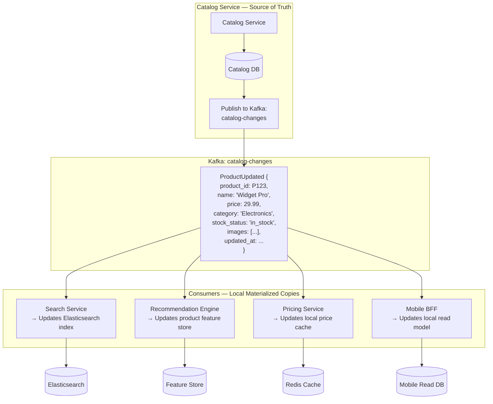

### Why This Matters at Amazon Scale

Consider the product detail page. It needs data from:
- Catalog Service (name, description, images)
- Pricing Service (current price, deals)
- Inventory Service (stock status)
- Review Service (rating, review count)
- Recommendation Service (related products)

**Without ECST:** The product page makes 5+ synchronous API calls. At 100k requests/sec, that's 500k+ internal API calls/sec — a cascading failure waiting to happen.

**With ECST:** Each service maintains a local read-optimized copy of the data it needs. The product page service reads from **its own local store** — zero cross-service calls at read time.

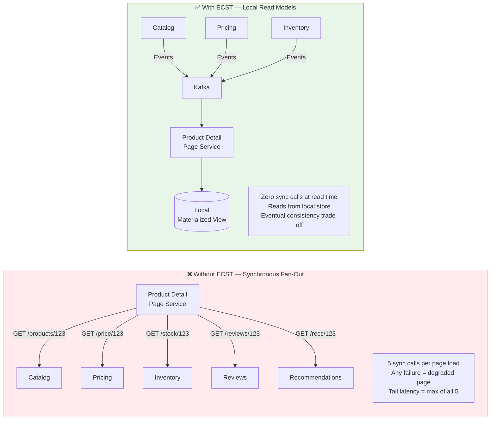

---

## Pattern 3: CQRS via Kafka

Command Query Responsibility Segregation separates write models from read models. Kafka acts as the bridge — carrying write-side events to read-side projections.

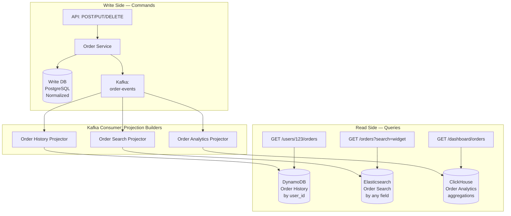

### Why Amazon Needs CQRS

| Query Pattern | Optimal Store | Why Not One DB? |
|--------------|---------------|-----------------|
| "Show my order history" | DynamoDB (key: user_id) | Need fast key-lookup, denormalized |
| "Search orders containing 'widget'" | Elasticsearch | Full-text search, facets |
| "GMV by category this hour" | ClickHouse / Druid | Columnar aggregations at speed |
| "Order status real-time" | Redis | Sub-ms reads for status polling |
| "Orders for seller dashboard" | PostgreSQL (key: seller_id) | Different partition key than customer view |

A single database cannot serve all these access patterns efficiently. Kafka allows the write model to publish once, and multiple read models to consume and project independently.

---

## Pattern 4: Change Data Capture (CDC) via Kafka

Instead of the application publishing events (dual-write risk), CDC captures changes **directly from the database transaction log** and streams them into Kafka.

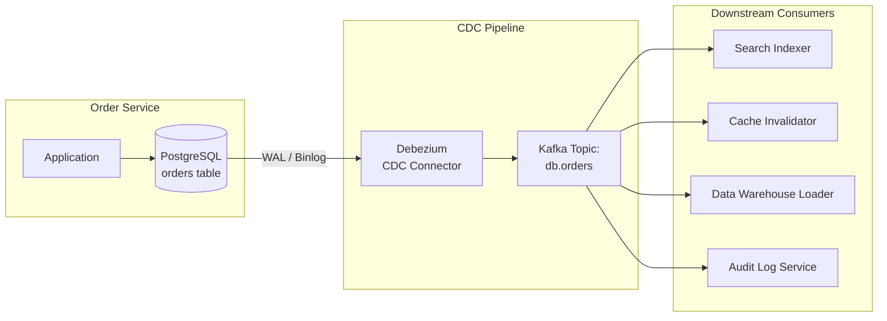

### The Dual-Write Problem CDC Solves

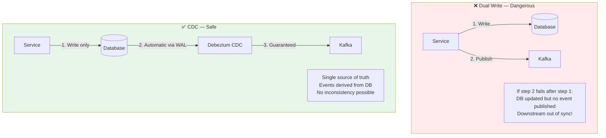

### CDC at Amazon Scale — Use Cases

| Use Case | Source | Kafka Topic | Consumer |
|----------|--------|-------------|----------|
| Search index sync | Product catalog DB | `cdc.catalog.products` | Elasticsearch indexer |
| Cache invalidation | Any service DB | `cdc.<service>.<table>` | Redis cache invalidator |
| Data warehouse ETL | All transactional DBs | `cdc.*` | S3 → Redshift / Snowflake |
| Cross-region replication | Primary region DB | `cdc.orders` | Secondary region writer |
| Audit trail | Financial DBs | `cdc.payments.*` | Immutable audit store |
| Materialized views | Multiple DBs | Multiple topics | View builder services |

### CDC Event Format (Debezium)

```
{
  "before": { "status": "pending", "amount": 49.99 },   ← previous state
  "after":  { "status": "paid",    "amount": 49.99 },   ← current state
  "source": {
    "db": "orders", "table": "payments",
    "txId": 5678, "lsn": 123456
  },
  "op": "u",          ← operation: c=create, u=update, d=delete, r=read(snapshot)
  "ts_ms": 1706000000
}
```

---

## Pattern 5: Choreography-Based SAGA via Kafka

Services coordinate a distributed transaction by reacting to each other's events on Kafka topics — no central orchestrator.

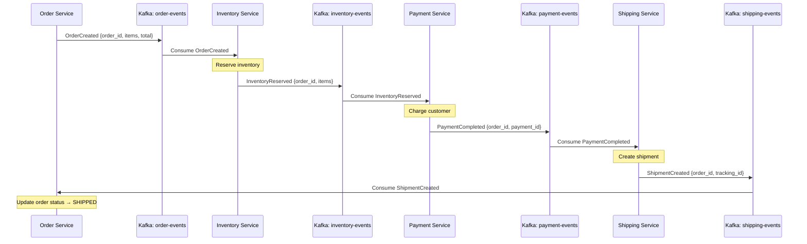

**Failure & compensation via Kafka:**

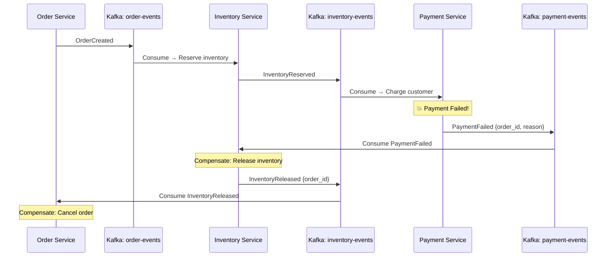

This pattern is covered in detail in [SAGA Pattern Deep Dive](./saga-pattern.md).

---

## Pattern 6: Event Sourcing with Kafka as the Log

Instead of storing current state, store the **sequence of events** that led to the current state. Kafka's immutable, append-only log is a natural fit.

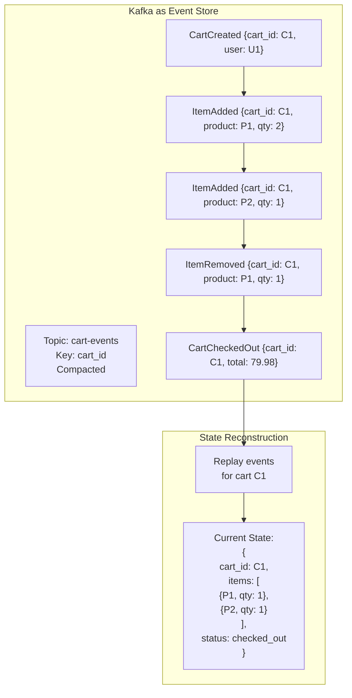

### When Amazon Uses Event Sourcing

| Domain | Why Event Sourcing | Example Events |
|--------|-------------------|----------------|
| **Shopping Cart** | Track full user journey for analytics, undo support | ItemAdded, ItemRemoved, QuantityChanged |
| **Order Lifecycle** | Audit trail, dispute resolution, compliance | OrderPlaced, PaymentCaptured, ItemShipped, Refunded |
| **Inventory Movements** | Track every stock change for reconciliation | Received, Reserved, Shipped, Returned, Adjusted |
| **Pricing History** | Regulatory requirement, price-match claims | PriceSet, DiscountApplied, DealStarted, DealEnded |

### Kafka Log Compaction for Event Sourcing

Kafka's **log compaction** retains only the **latest value** per key, which is useful for snapshot-based state reconstruction.

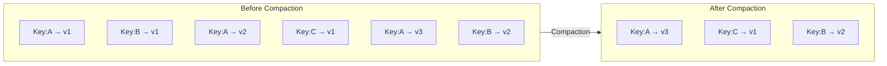

**Use retention-based topics** for full event history (audit, replay). **Use compacted topics** for latest-state snapshots (materialized views, caches).

---

## Pattern 7: Stream Processing (Kafka Streams / Flink)

Events are not just stored and consumed — they are **processed in real-time** as continuous streams. This is where Kafka goes beyond messaging into computation.

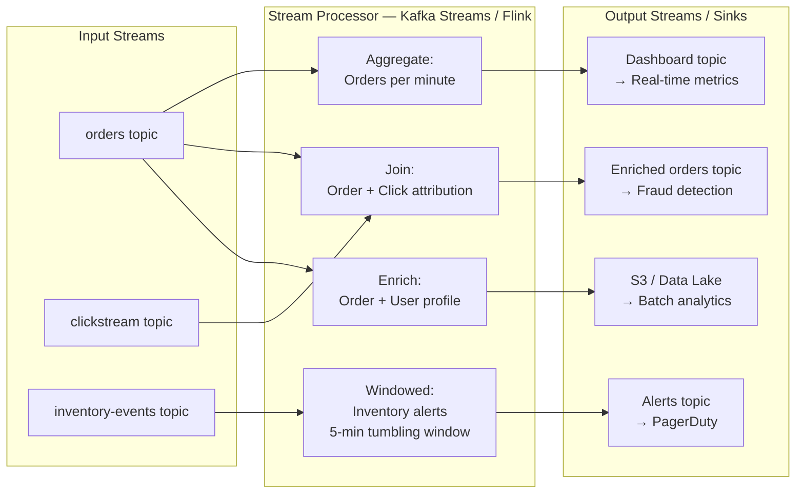

### Real-Time Processing Use Cases at Amazon Scale

| Use Case | Input Topics | Processing | Output |
|----------|-------------|------------|--------|
| **Fraud detection** | orders, payment-events, user-events | ML scoring on enriched order stream | fraud-alerts topic → block/allow |
| **Real-time recommendations** | clickstream, orders, catalog-changes | Sliding window of user behavior | user-recs topic → cache |
| **Inventory alerts** | inventory-events | Tumbling window: stock < threshold | low-stock-alerts → ops dashboard |
| **Order attribution** | orders, clickstream, ad-impressions | Stream-stream join by session_id | attribution topic → ad billing |
| **Dynamic pricing** | orders, inventory-events, competitor-prices | Supply/demand calculation | price-updates → catalog service |
| **Live dashboards** | All topics | Count, sum, avg per time window | dashboard-metrics → Grafana |

### Stream Processing Topologies

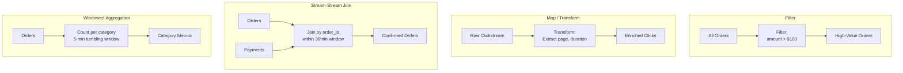

---

## Pattern 8: Outbox Pattern with Kafka Connect

Solves the dual-write problem from the application side (as opposed to CDC). The service writes both the business data and an event to an **outbox table** in the **same database transaction**. A connector polls or tails the outbox and publishes to Kafka.

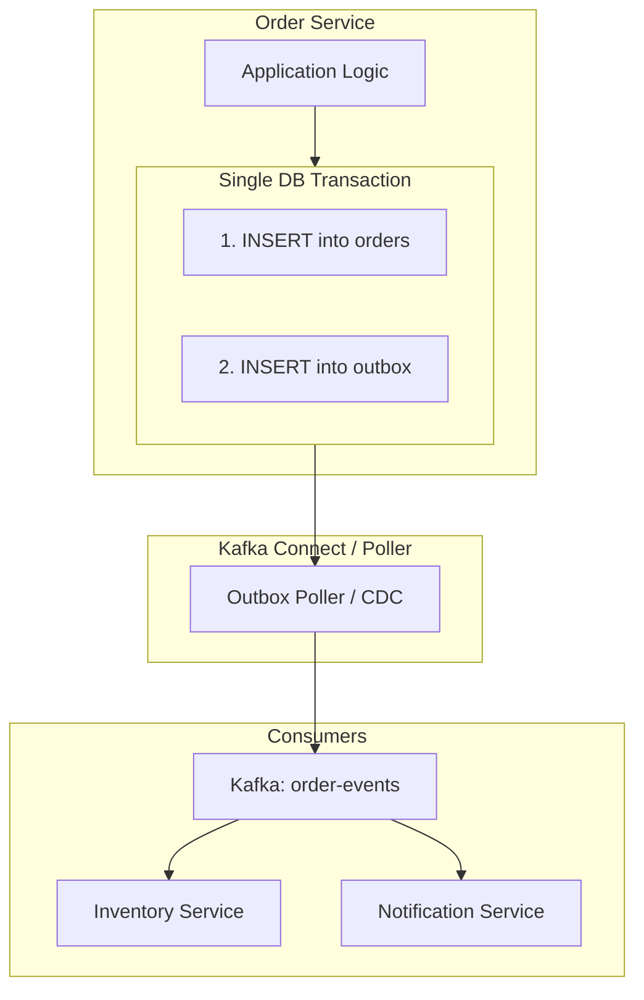

### Outbox Table Design

```
outbox
├── id              UUID PRIMARY KEY
├── aggregate_type  VARCHAR          -- e.g., "Order"
├── aggregate_id    VARCHAR          -- e.g., "order-12345"
├── event_type      VARCHAR          -- e.g., "OrderPlaced"
├── payload         JSONB            -- full event data
├── created_at      TIMESTAMP
└── published       BOOLEAN DEFAULT FALSE
```

### Outbox vs. CDC — When to Use Which

| Aspect | Outbox Pattern | CDC (Debezium) |
|--------|---------------|----------------|
| **Event format** | Application controls the schema | Raw DB row changes — may expose internals |
| **Business semantics** | Events are meaningful domain events | Events are table mutations (INSERT, UPDATE) |
| **Infrastructure** | Outbox table + poller/connector | CDC connector + WAL access |
| **Schema evolution** | Easy — app controls event schema | Hard — DB schema changes leak downstream |
| **DB coupling** | None — event is a first-class API | Consumers coupled to DB schema |
| **Best for** | Domain events, bounded context boundaries | Data replication, cache sync, warehousing |

---

## Pattern 9: Request-Reply over Kafka

Kafka is fundamentally async, but sometimes you need a synchronous-feeling request-reply. This pattern uses a **reply topic** to correlate responses.

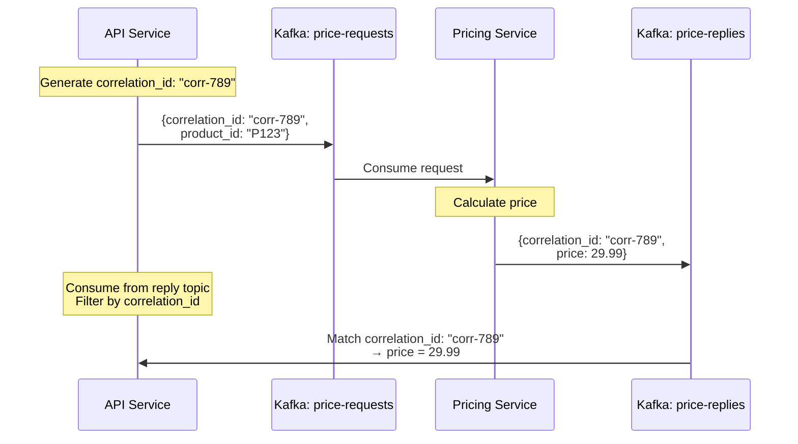

### When to Use (and When Not To)

| ✅ Use When | ❌ Avoid When |
|------------|-------------|
| Need Kafka's durability for the request | Simple low-latency call (use gRPC/HTTP) |
| Want to decouple request sender from processor | Real-time user-facing latency is critical |
| Request processing takes variable time | High request volume with tight SLAs |
| Want to buffer requests during consumer downtime | You need sub-10ms response times |

---

## Pattern 10: Dead Letter Queue (DLQ)

When a consumer fails to process a message after exhausting retries, the message is routed to a **Dead Letter Topic** for manual inspection and reprocessing.

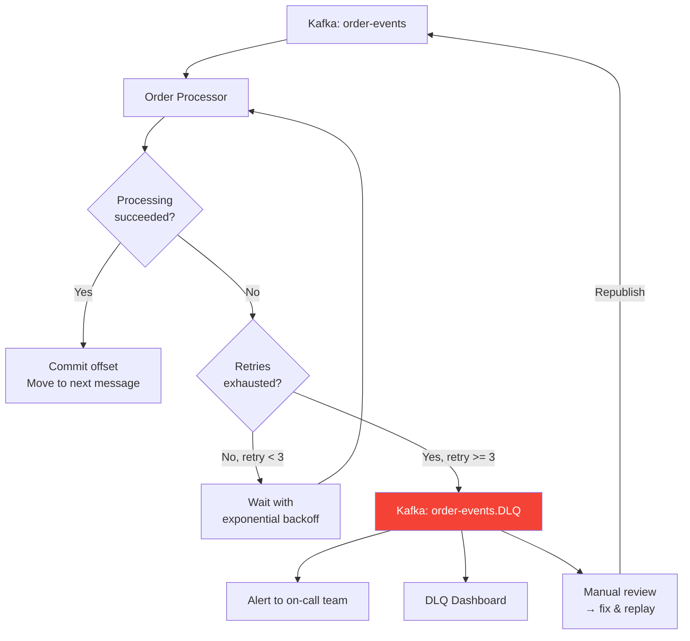

### DLQ Strategy at Scale

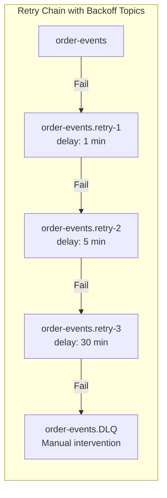

| Retry Level | Delay | Purpose |
|-------------|-------|---------|
| Retry 1 | 1 minute | Transient failure (network blip, temporary unavailability) |
| Retry 2 | 5 minutes | Service recovery (deployment in progress, brief outage) |
| Retry 3 | 30 minutes | Extended issue (downstream dependency recovering) |
| DLQ | Indefinite | Persistent failure (bug, corrupt data, manual fix needed) |

---

## Topic Design Strategies

How you structure Kafka topics determines coupling, scalability, and operational characteristics.

### Strategy 1: Topic Per Entity Type

```
orders
payments
inventory
shipments
users
```

All events for an entity type go to one topic. The event type is a field in the message.

### Strategy 2: Topic Per Event Type

```
order-created
order-cancelled
order-shipped
payment-completed
payment-refunded
```

Each event type gets its own topic. Consumers subscribe to exactly what they need.

### Strategy 3: Topic Per Bounded Context (Recommended at Scale)

```
order-service.events          ← all public events from Order BC
inventory-service.events      ← all public events from Inventory BC
payment-service.events        ← all public events from Payment BC
order-service.internal        ← internal events (not for external consumption)
```

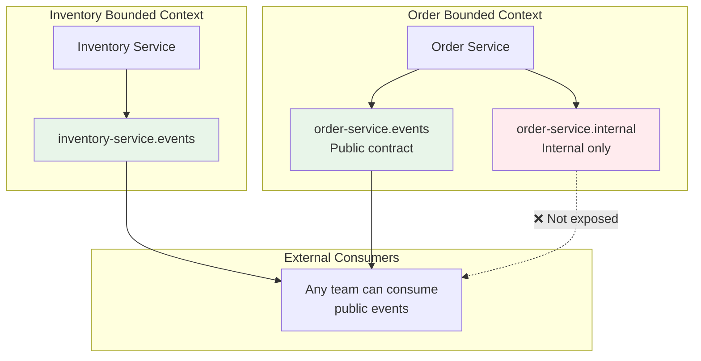

### Comparison

| Strategy | Pros | Cons | Best For |
|----------|------|------|----------|
| Per entity | Simple, few topics | Consumers get events they don't care about | Small systems |
| Per event type | Precise subscription | Topic explosion (hundreds of topics) | Event mesh platforms |
| Per bounded context | Clean ownership, public API contract | Consumers must filter event types | **Large-scale microservices** |

---

## Partitioning Strategies for Ordering Guarantees

Kafka guarantees ordering **only within a partition**. The partition key determines which messages are ordered relative to each other.

```mermaid
flowchart TB
    subgraph topic [Topic: order-events — 6 partitions]
        P0[Partition 0<br/>order-1, order-7, ...]
        P1[Partition 1<br/>order-2, order-8, ...]
        P2[Partition 2<br/>order-3, order-9, ...]
        P3[Partition 3<br/>order-4, order-10, ...]
        P4[Partition 4<br/>order-5, order-11, ...]
        P5[Partition 5<br/>order-6, order-12, ...]
    end

    KEY["Partition Key: order_id<br/>hash(order_id) % 6 = partition"] --> topic

    subgraph guarantee [Ordering Guarantee]
        G["All events for order-1<br/>(Created → Paid → Shipped → Delivered)<br/>go to Partition 0<br/>→ Processed in order ✅"]
    end
```

### Choosing the Right Partition Key

| Partition Key | Orders With Each Other | Use Case |
|--------------|----------------------|----------|
| `order_id` | All events for same order | Order lifecycle processing |
| `user_id` | All events for same user | User activity feed, session tracking |
| `product_id` | All events for same product | Inventory updates, pricing changes |
| `seller_id` | All events for same seller | Seller dashboard, payout calculation |
| `region` | All events for same region | Regional processing, compliance |

**Warning:** Choose a key with high cardinality. A low-cardinality key (e.g., `country`) creates hot partitions — one partition gets disproportionate traffic.

```mermaid
flowchart LR
    subgraph bad [❌ Hot Partition — Key: country]
        P1_BAD["Partition 'US'<br/>80% of traffic 🔥"]
        P2_BAD["Partition 'UK'<br/>5% of traffic"]
        P3_BAD["Partition 'JP'<br/>3% of traffic"]
    end

    subgraph good [✅ Even Distribution — Key: order_id]
        P1_GOOD["Partition 0<br/>~17% of traffic"]
        P2_GOOD["Partition 1<br/>~17% of traffic"]
        P3_GOOD["Partition 2<br/>~17% of traffic"]
    end

    style bad fill:#ffebee
    style good fill:#e8f5e9
```

---

## Consumer Group Patterns

### Pattern: Multiple Consumer Groups on Same Topic

```mermaid
flowchart TB
    TOPIC[Kafka: order-events]

    subgraph cg1 [Consumer Group: inventory-service]
        C1A[Instance 1]
        C1B[Instance 2]
        C1C[Instance 3]
    end

    subgraph cg2 [Consumer Group: analytics-pipeline]
        C2A[Instance 1]
        C2B[Instance 2]
    end

    subgraph cg3 [Consumer Group: notification-service]
        C3A[Instance 1]
    end

    TOPIC --> cg1
    TOPIC --> cg2
    TOPIC --> cg3

    Note1["Each group gets ALL messages<br/>Within a group, partitions are<br/>distributed across instances"]
```

| Property | Behavior |
|----------|----------|
| **Between groups** | Every group gets every message (fan-out) |
| **Within a group** | Partitions distributed among instances (load balancing) |
| **Max parallelism** | # consumers in a group ≤ # partitions |
| **Rebalancing** | Adding/removing instances triggers partition reassignment |

---

## Schema Evolution with Schema Registry

At Amazon scale, hundreds of teams produce and consume events. Schema evolution must be managed to avoid breaking consumers.

```mermaid
flowchart LR
    subgraph producer [Producer]
        APP[Service] --> SER[Serializer]
    end

    subgraph registry [Schema Registry]
        SR[(Avro / Protobuf<br/>Schema Registry)]
    end

    subgraph kafka [Kafka]
        TOPIC[Topic]
    end

    subgraph consumer [Consumer]
        DESER[Deserializer] --> CAPP[Service]
    end

    SER -->|1. Register schema<br/>or get schema_id| SR
    SER -->|2. Serialize with schema_id prefix| TOPIC
    TOPIC -->|3. Read message| DESER
    DESER -->|4. Fetch schema by id| SR
```

### Compatibility Modes

| Mode | Allowed Changes | Use Case |
|------|----------------|----------|
| **BACKWARD** | Add optional fields, remove fields | Consumer upgraded first |
| **FORWARD** | Remove optional fields, add fields | Producer upgraded first |
| **FULL** | Add/remove optional fields only | Both directions safe |
| **NONE** | Any change | Development only — never in production |

---

## Pros and Cons of Kafka-Centric Communication

### Pros

| Advantage | Detail |
|-----------|--------|
| **Temporal decoupling** | Producer and consumer don't need to be alive at the same time |
| **Replay capability** | New consumers can replay from any offset — rebuild state, fix bugs |
| **Fan-out** | One event, unlimited consumers — no producer changes needed |
| **Backpressure handling** | Consumers read at their own pace — no overwhelm |
| **Durability** | Replicated across brokers — survives node failures |
| **Ordering guarantees** | Per-partition ordering for business-critical sequencing |
| **Throughput** | Millions of messages/sec on a modest cluster |
| **Ecosystem** | Kafka Connect, Kafka Streams, ksqlDB, Schema Registry |

### Cons

| Disadvantage | Detail |
|--------------|--------|
| **Eventual consistency** | Consumers are always behind — lag is inherent |
| **Operational complexity** | Broker management, partition rebalancing, ISR monitoring |
| **Debugging difficulty** | Tracing an event across 10 consumers is non-trivial |
| **Ordering limitations** | Only per-partition — no global ordering |
| **Consumer lag risk** | Slow consumers fall behind, stale data served |
| **Schema management** | Must enforce compatibility across hundreds of topics |
| **Not ideal for request-reply** | Sync calls over Kafka add unnecessary latency |
| **Data duplication** | ECST means data exists in many places — consistency overhead |
| **Infrastructure cost** | Kafka clusters at scale require significant compute and storage |

---

## When to Use Which Pattern — Decision Matrix

```mermaid
flowchart TB
    START{What is the<br/>communication need?}

    START -->|Service A informs<br/>others something happened| P1[Pattern 1:<br/>Event Notification]

    START -->|Consumers need full<br/>data without callbacks| P2[Pattern 2:<br/>ECST]

    START -->|Read model differs<br/>from write model| P3[Pattern 3:<br/>CQRS via Kafka]

    START -->|Need reliable event<br/>publishing from DB changes| P4{Application or<br/>DB-level?}
    P4 -->|Application level| P8[Pattern 8:<br/>Outbox]
    P4 -->|DB level| P4A[Pattern 4:<br/>CDC]

    START -->|Multi-service<br/>distributed transaction| P5[Pattern 5:<br/>Choreography SAGA]

    START -->|Need full audit trail<br/>or time-travel queries| P6[Pattern 6:<br/>Event Sourcing]

    START -->|Real-time computation<br/>on event streams| P7[Pattern 7:<br/>Stream Processing]

    START -->|Need sync response<br/>but want Kafka durability| P9[Pattern 9:<br/>Request-Reply]

    START -->|Handle poison messages<br/>and retries| P10[Pattern 10:<br/>DLQ]

    style P1 fill:#4CAF50,color:#fff
    style P2 fill:#4CAF50,color:#fff
    style P3 fill:#2196F3,color:#fff
    style P4A fill:#2196F3,color:#fff
    style P5 fill:#FF9800,color:#fff
    style P6 fill:#FF9800,color:#fff
    style P7 fill:#9C27B0,color:#fff
    style P8 fill:#2196F3,color:#fff
    style P9 fill:#9E9E9E,color:#fff
    style P10 fill:#f44336,color:#fff
```

---

## Key Takeaways for System Design Interviews

1. **Kafka is a distributed log, not a queue.** Messages are retained, replayed, and consumed by multiple independent groups. Start with this distinction.
2. **Event Notification + ECST are the bread and butter.** Most inter-service communication at scale uses these two patterns.
3. **CDC eliminates the dual-write problem.** Whenever you design a system that "writes to a DB and publishes an event," mention CDC or the outbox pattern — interviewers watch for this.
4. **CQRS is why you can serve different read patterns.** One write, many read models. Kafka is the bridge.
5. **Partition key = ordering guarantee.** Always mention your partition key choice and why. Wrong key = hot partitions or broken ordering.
6. **Consumer groups = independent scaling.** Adding a new consumer group adds a new capability without touching producers.
7. **DLQ is not optional.** Any production Kafka consumer must have a DLQ strategy. Interviewers will ask "what happens when processing fails?"
8. **Schema Registry prevents breaking changes.** At scale, schema evolution without a registry is organizational chaos.
9. **Stream processing is the next level.** When the interviewer asks "how would you compute X in real-time," the answer is Kafka Streams or Flink on the event stream.
10. **Kafka does not replace synchronous calls.** User-facing reads with tight latency SLAs should still use gRPC/HTTP to a local read model. Kafka feeds the read model asynchronously.

---

## Related Concepts

- **[SAGA Pattern](./saga-pattern.md)** — Choreography-based SAGAs use Kafka for step coordination
- **[Idempotency](./idempotency.md)** — Every Kafka consumer must be idempotent (at-least-once delivery)
- **[Two-Phase Commit](./two-phase-commit.md)** — The synchronous alternative Kafka-based patterns replace
- **Event Sourcing** — Kafka as the event store for append-only event logs
- **CQRS** — Kafka as the bridge between write and read models
- **Outbox Pattern** — Application-level alternative to CDC for reliable event publishing
