# SAGA Pattern — Deep Dive

The SAGA pattern is the go-to approach for managing **distributed transactions in microservices** without the drawbacks of [Two-Phase Commit (2PC)](./two-phase-commit.md). Instead of locking resources across services, a SAGA breaks a transaction into a sequence of **local transactions**, each with a corresponding **compensating transaction** to undo its effect if something goes wrong downstream.

---

## The Problem SAGA Solves

In a microservices architecture, each service owns its database. There is **no shared transaction manager**. You cannot use `BEGIN ... COMMIT` across service boundaries.

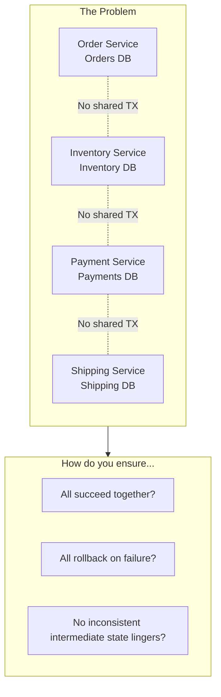

**2PC could solve this**, but it requires:
- All services to support XA
- Long-held distributed locks
- A centralized coordinator (SPOF)
- Low-latency networking (same datacenter)

**SAGA provides an alternative:** no distributed locks, no blocking, eventual consistency.

---

## What is a SAGA?

A SAGA is a sequence of **local transactions** where:

1. Each local transaction updates a single service's database and publishes an event/message
2. Each local transaction has a **compensating transaction** that semantically undoes its effect
3. If any step fails, previously completed steps are compensated **in reverse order**

### The Three Types of SAGA Steps

| Step Type | Description | Example | Can it be compensated? |
|-----------|-------------|---------|----------------------|
| **Compensatable** | Has a compensating transaction that can undo it | Reserve inventory → Release inventory | ✅ Yes |
| **Pivot** | The go/no-go decision point. If it succeeds, the SAGA will commit | Process payment | ⚠️ It's the decision boundary |
| **Retriable** | Guaranteed to eventually succeed (idempotent, retried on failure) | Send shipping notification | ❌ Not needed (always succeeds) |

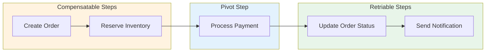

**Design rule:** Structure your SAGA so that compensatable steps come first, then the pivot, then retriable steps. This minimizes the number of compensations needed on failure.

---

## Two Coordination Approaches

### 1. Choreography (Event-Driven)

Each service listens for events and decides locally what to do next. There is **no central coordinator** — the workflow emerges from event reactions.

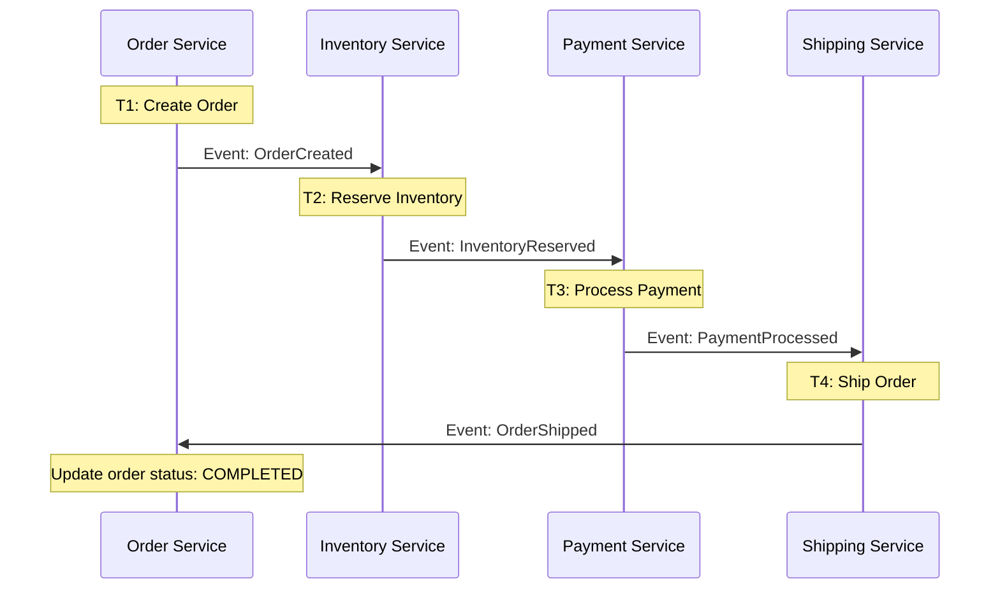

**Failure with compensation (choreography):**

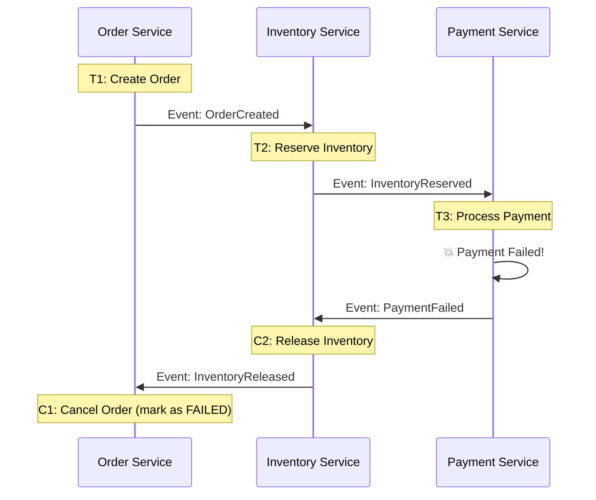

#### Choreography — Pros and Cons

| Pros | Cons |
|------|------|
| Simple for 3-4 step workflows | Hard to understand as steps grow (>5) |
| Loose coupling — services are independent | **Cyclic dependencies** — services must know about each other's events |
| No single point of failure | **Difficult to track** — no single place shows SAGA status |
| Easy to add new steps | **Testing is hard** — must simulate entire event chain |
| Good for small teams | **Risk of event storms** — cascading reactions |

---

### 2. Orchestration (Command-Driven)

A central **SAGA Orchestrator** tells each service what to do and when. The orchestrator maintains the state machine and drives the workflow.

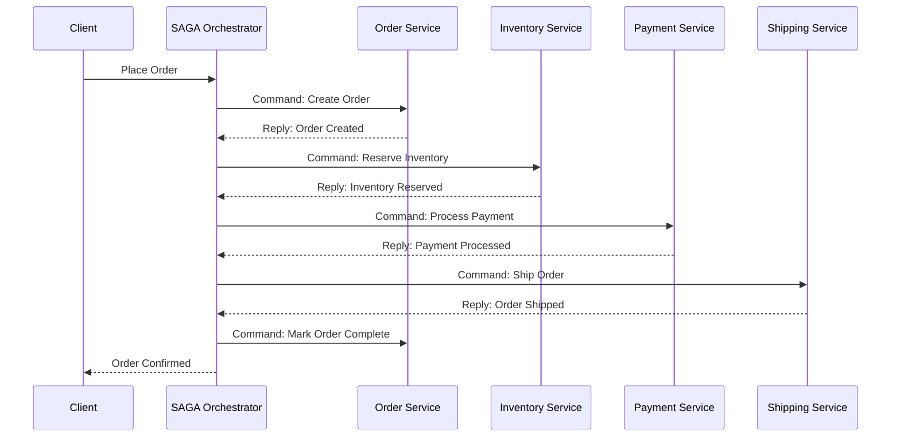

**Failure with compensation (orchestration):**

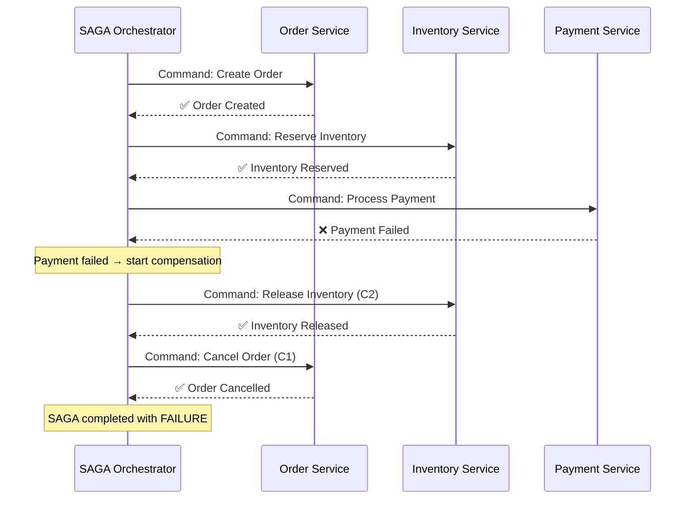

#### Orchestrator State Machine

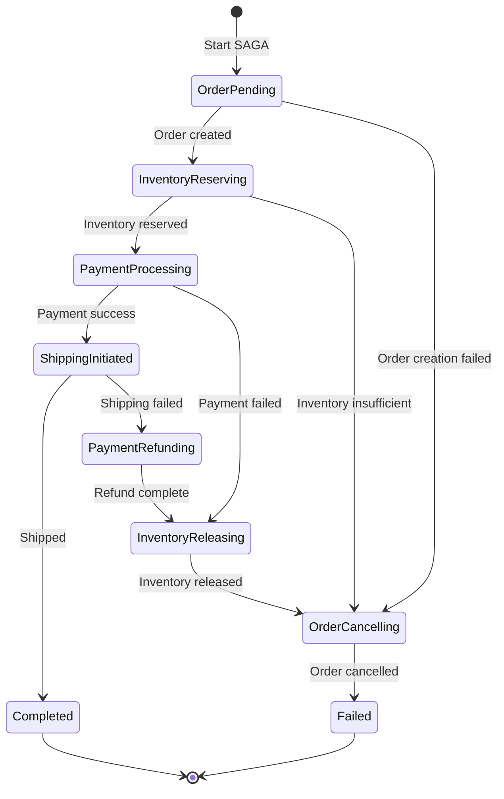

#### Orchestration — Pros and Cons

| Pros | Cons |
|------|------|
| **Easy to understand** — workflow in one place | Orchestrator can become a **single point of failure** |
| **Easy to test** — test the orchestrator's state machine | Risk of **centralizing too much logic** in orchestrator |
| No cyclic dependencies | Orchestrator must be highly available |
| Easy to add/modify steps | Additional infrastructure component to maintain |
| Good observability — track SAGA state | Slight coupling to orchestrator |
| Complex workflows manageable | Design discipline needed to keep orchestrator thin |

---

## Choreography vs. Orchestration — Decision Guide

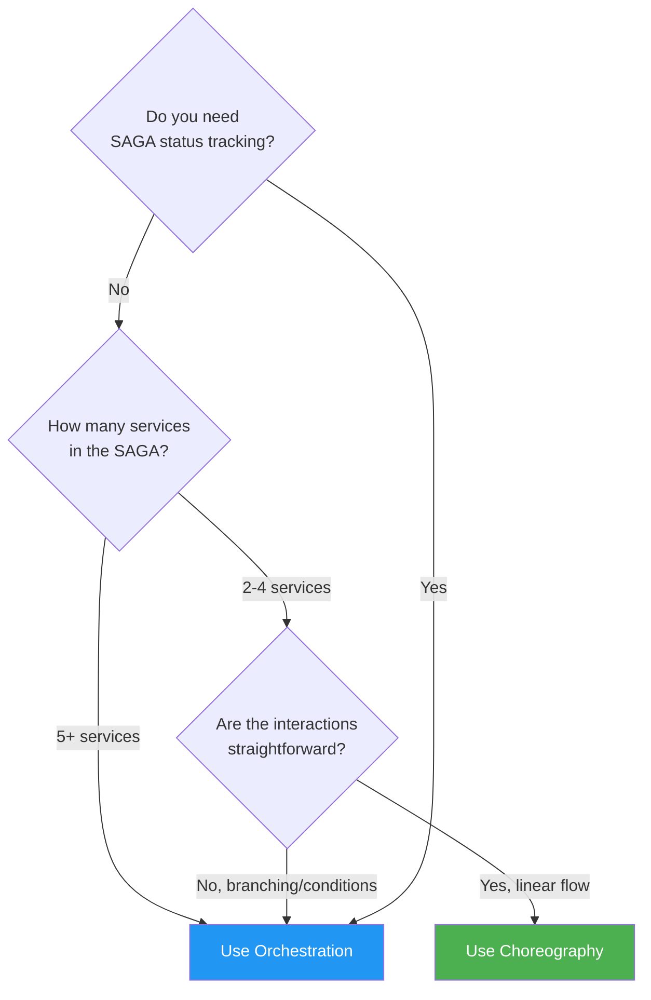

| Factor | Choreography | Orchestration |
|--------|-------------|---------------|
| **# of steps** | 2-4 | 5+ |
| **Workflow complexity** | Linear | Branching, conditions, parallel |
| **Team structure** | Independent teams per service | Central platform team |
| **Observability needs** | Low | High |
| **Coupling tolerance** | Event coupling acceptable | Prefer command coupling |
| **Failure handling** | Simple rollback | Complex compensation logic |

---

## Compensating Transactions — Design Principles

Compensating transactions are the heart of the SAGA pattern. They require careful design.

### Semantic Undo, Not Physical Undo

A compensating transaction does **not** rollback the database to a previous state. It applies a **new transaction** that semantically reverses the effect.

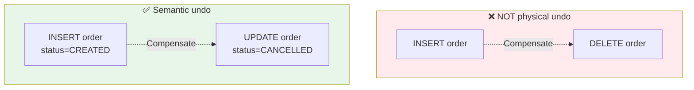

### Compensation Design Rules

| Rule | Rationale | Example |
|------|-----------|---------|
| **Compensations must be idempotent** | May be retried on failure | Refund should check if already refunded |
| **Compensations must be commutative** | Order of execution may vary | Release inventory should work regardless of current state |
| **Never delete data** | Need audit trail and debugging | Mark as CANCELLED, don't DELETE |
| **Include the SAGA ID** | For correlation and deduplication | Every event/command carries saga_id |
| **Handle the "already compensated" case** | Duplicate events are possible | Return success if already compensated |

### Example: E-Commerce Compensation Table

| Step | Forward Transaction | Compensating Transaction |
|------|-------------------|--------------------------|
| 1. Order | `INSERT order (status=PENDING)` | `UPDATE order SET status=CANCELLED` |
| 2. Inventory | `UPDATE stock SET qty = qty - N` | `UPDATE stock SET qty = qty + N` |
| 3. Payment | `POST /payments/charge` (auth + capture) | `POST /payments/refund` |
| 4. Shipping | `POST /shipments/create` | `POST /shipments/cancel` (if not yet shipped) |

---

## Handling the Lack of Isolation

Unlike 2PC, SAGA does **not** provide isolation. Intermediate states are visible to other transactions. This creates anomalies:

### Anomaly Types

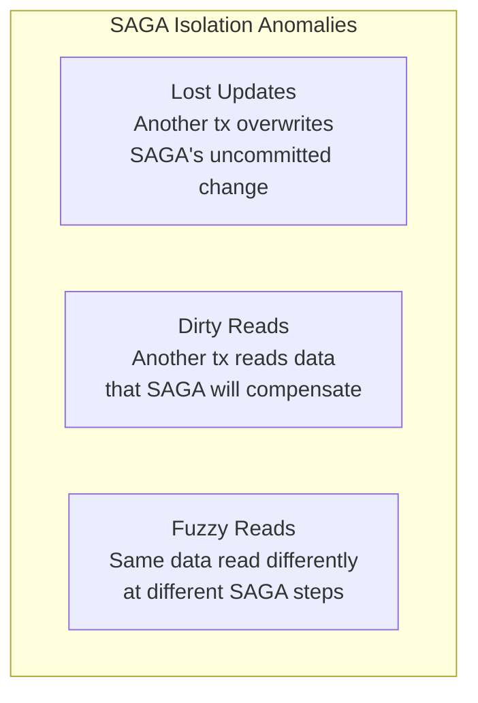

| Anomaly | Scenario | Impact |
|---------|----------|--------|
| **Lost Update** | SAGA reserves inventory, another transaction also modifies the same row | One update is silently lost |
| **Dirty Read** | Payment service reads an order that is later cancelled by compensation | Payment processed for a cancelled order |
| **Fuzzy/Non-repeatable Read** | Order service reads inventory at step 1 (available) but it changes by step 3 | Decision made on stale data |

### Countermeasures

| Countermeasure | How it Works | Trade-off |
|----------------|-------------|-----------|
| **Semantic Lock** | Set a flag (e.g., `status=PENDING`) to warn other transactions | Other txns must check the flag |
| **Commutative Updates** | Design operations so order doesn't matter (e.g., `qty += N` instead of `qty = N`) | Limits operation types |
| **Pessimistic View** | Reorder SAGA steps to minimize dirty read risk | May not always be possible |
| **Reread Value** | Re-check the value before committing a step | Extra read, possible race |
| **Version File** | Record operations, apply in correct order later | Complex bookkeeping |
| **By Value (Risk-Based)** | Use SAGA for low-risk, 2PC for high-risk transactions | Dual mechanism complexity |

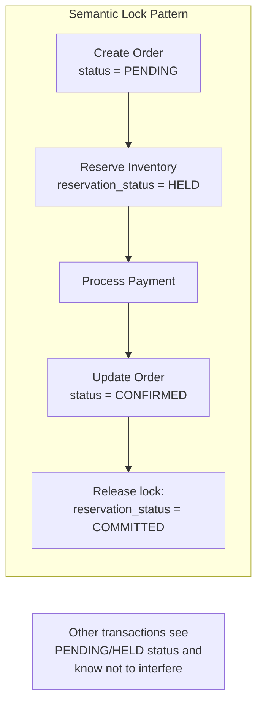

---

## Practical Architecture: Order Service SAGA (Orchestration)

A complete real-world orchestration example:

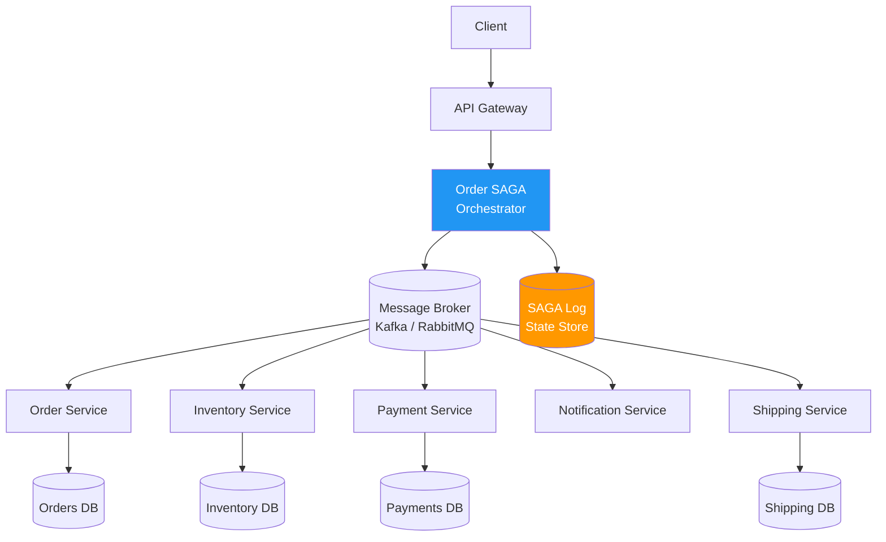

### SAGA Log — Why it Matters

The orchestrator persists its state at every step. If it crashes and restarts, it resumes from the last logged state.

| SAGA Log Entry | Fields |
|---------------|--------|
| `saga_id` | Unique identifier for the SAGA instance |
| `current_step` | Which step is currently executing |
| `status` | `RUNNING`, `COMPENSATING`, `COMPLETED`, `FAILED` |
| `step_results[]` | Success/failure of each completed step |
| `created_at` | When the SAGA started |
| `updated_at` | Last state change timestamp |

---

## SAGA with Event Sourcing and CQRS

SAGA works particularly well alongside Event Sourcing and CQRS:

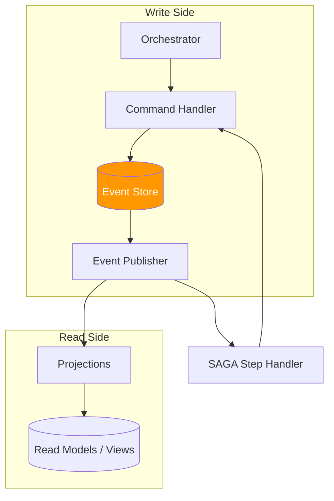

**Benefits of combining:**
- Event store provides a natural SAGA log
- Events are the source of truth — no dual-write problem
- Easy replay and debugging
- Natural fit for choreography-style SAGAs

---

## Real-World SAGA Implementations

| Company/System | Pattern | Details |
|---------------|---------|---------|
| **Netflix** | Orchestration | Custom Conductor orchestration engine for microservice workflows |
| **Uber** | Orchestration | Cadence/Temporal workflow engine — SAGAs as workflows with compensation |
| **Airbnb** | Choreography + Orchestration | Mix of event-driven and orchestrated flows for booking pipeline |
| **Amazon** | Choreography | Order pipeline uses event-driven SAGAs across 100+ services |
| **Axon Framework** | Orchestration | Java framework with built-in SAGA support and event sourcing |
| **Temporal.io** | Orchestration | Durable execution platform — models SAGAs as workflows with automatic retry |
| **MassTransit** | Both | .NET library with built-in SAGA state machines |

---

## Pros and Cons

### Pros

| Advantage | Detail |
|-----------|--------|
| **No distributed locks** | Each step uses only local transactions — no cross-service locking |
| **High availability** | No blocking; failure of one service doesn't freeze others |
| **Works across heterogeneous systems** | REST APIs, gRPC, message queues — anything can participate |
| **Scales horizontally** | Each service scales independently |
| **Resilient to network partitions** | Async communication tolerates transient failures |
| **Long-running transactions** | Can span minutes, hours, or days (e.g., travel booking) |
| **Fits microservices naturally** | Respects service autonomy and database-per-service pattern |

### Cons

| Disadvantage | Detail |
|--------------|--------|
| **No isolation** | Intermediate states are visible (dirty reads, lost updates) |
| **Eventual consistency** | System is temporarily inconsistent during SAGA execution |
| **Complex compensating logic** | Every step needs a carefully designed undo operation |
| **Difficult to debug** | Distributed tracing required to follow the flow |
| **Compensation may fail** | What if the refund API is down? Need retry + dead letter queue |
| **Ordering challenges** | Events may arrive out of order in choreography |
| **Testing complexity** | Must test every failure path and compensation chain |
| **Not suitable for all domains** | Some operations can't be compensated (e.g., sending an email) |

---

## When to Use SAGA

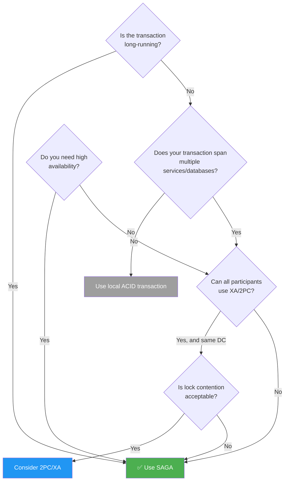

### Use SAGA When

- **Microservices architecture** with database-per-service
- **Cross-service transactions** involving heterogeneous systems (REST, gRPC, third-party APIs)
- **Long-running business processes** (travel booking, insurance claims, order fulfillment)
- **High availability is critical** — cannot afford blocking
- **Horizontal scalability** — services must scale independently
- **Eventual consistency is acceptable** — business can tolerate brief inconsistency
- **Cross-datacenter operations** — 2PC latency would be prohibitive

### Do NOT Use SAGA When

- **Strong isolation is required** — e.g., financial ledger debits/credits that must never show intermediate states
- **Operations cannot be compensated** — e.g., launching a missile, sending an irreversible physical action
- **Simple, few-service transactions** — overhead of SAGA outweighs benefits if you can use local TX or 2PC
- **Team lacks distributed systems experience** — compensating logic is hard to get right
- **Regulatory requirements demand strict ACID** — some compliance frameworks require 2PC-level guarantees

---

## SAGA vs. 2PC — Head-to-Head

| Aspect | SAGA | 2PC |
|--------|------|-----|
| **Consistency** | Eventual | Strong (atomic) |
| **Isolation** | None (anomalies possible) | Full (locks held) |
| **Availability** | High | Low (blocking on coordinator failure) |
| **Latency** | Low per step | High (2 RTT + sync) |
| **Lock duration** | Per-step only (milliseconds) | Entire transaction (can be seconds+) |
| **Scalability** | Horizontal | Limited |
| **Failure recovery** | Compensating transactions | Coordinator-driven rollback |
| **Complexity** | Business logic (compensations) | Protocol/infrastructure |
| **Long-running TX** | ✅ Supported | ❌ Impractical |
| **Heterogeneous systems** | ✅ Any service can participate | ❌ All must support XA |
| **Network partitions** | Tolerant (async messaging) | Blocking |
| **Debugging** | Harder (distributed traces) | Easier (centralized coordinator logs) |

---

## Key Takeaways for System Design Interviews

1. **SAGA is the standard answer for distributed transactions in microservices** — mention it whenever the interviewer asks about cross-service consistency.
2. **Know both choreography and orchestration** — and articulate when to use each.
3. **Compensating transactions are the hard part** — stress that designing correct compensations requires domain expertise.
4. **Lack of isolation is the main trade-off** — explain the anomalies and countermeasures (semantic locks, commutative updates).
5. **Pair SAGA with idempotency** — every handler must be idempotent because retries are inevitable.
6. **Mention real tooling** — Temporal, Conductor, Axon, MassTransit show practical depth.
7. **Distinguish step types** — compensatable → pivot → retriable. This ordering minimizes compensations.
8. **SAGA log is essential** — the orchestrator must persist its state for crash recovery.
9. **Contrast with 2PC** — always compare SAGA to [2PC](./two-phase-commit.md) and explain why SAGA is preferred for microservices.
10. **Not everything can be compensated** — know the limitations and have a plan (e.g., human intervention, circuit breakers).

---

## Related Concepts

- **[Two-Phase Commit (2PC)](./two-phase-commit.md)** — The blocking alternative that provides strong consistency
- **Event Sourcing** — Natural complement to choreography-based SAGAs
- **CQRS** — Separates read/write models, works well with SAGA's eventual consistency
- **Outbox Pattern** — Reliable event publishing to avoid dual-write problem within each SAGA step
- **Idempotency** — Critical for reliable SAGA step execution with retries
- **Dead Letter Queue** — For handling compensation failures that exhaust retries
- **Distributed Tracing** — Essential for debugging SAGAs across services (Jaeger, Zipkin)
