# Two-Phase Commit (2PC) — Deep Dive

Distributed transactions are one of the hardest problems in distributed systems. When a single business operation spans multiple databases, services, or resource managers, how do you guarantee that **either all of them commit or all of them rollback**? The Two-Phase Commit (2PC) protocol is the classical answer.

---

## The Problem: Distributed Atomicity

In a monolith, a single database transaction gives you ACID guarantees. But when data lives across multiple nodes, no single `BEGIN ... COMMIT` can span them all.

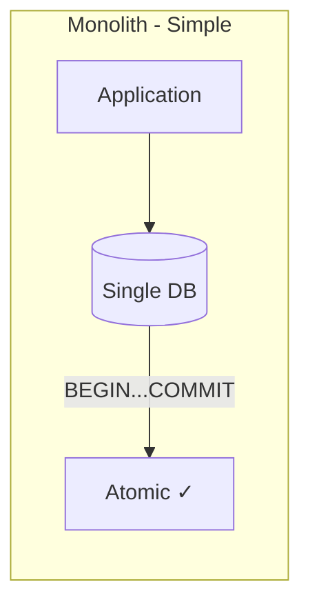
```mermaid
flowchart LR
    subgraph monolith [Monolith - Simple]
        App[Application] --> DB[(Single DB)]
        DB -->|BEGIN...COMMIT| OK[Atomic ✓]
    end
```

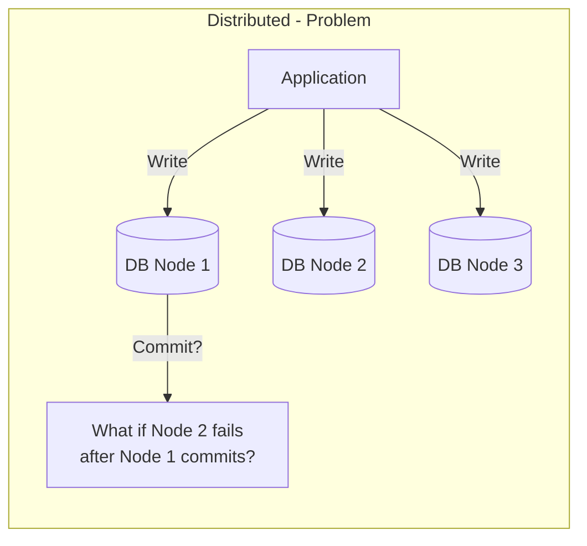
```mermaid
flowchart LR
    subgraph distributed [Distributed - Problem]
        App[Application] -->|Write| DB1[(DB Node 1)]
        App -->|Write| DB2[(DB Node 2)]
        App -->|Write| DB3[(DB Node 3)]
        DB1 -->|Commit?| Q1[What if Node 2 fails<br/>after Node 1 commits?]
    end
```

**Key question:** How do we make multiple independent nodes agree to commit or abort atomically?

---

## What is Two-Phase Commit?

2PC is a **distributed consensus protocol** that ensures atomic commitment across multiple participants. It introduces a special role — the **Coordinator** (also called Transaction Manager or TM) — that drives the protocol through two distinct phases.

### Core Roles

| Role | Responsibility | Examples |
|------|---------------|----------|
| **Coordinator (TM)** | Drives the protocol, makes the final commit/abort decision | Application server, dedicated TM (e.g., Narayana, Atomikos) |
| **Participant (RM)** | Manages a local resource, votes on commit/abort | Database, message broker, file system |

---

## Phase 1: Prepare (Voting Phase)

The coordinator asks every participant: **"Can you commit?"**

Each participant:
1. Executes the transaction locally (writes to WAL/redo log)
2. Acquires all necessary locks
3. Writes a **prepare record** to its local durable log
4. Responds with **YES** (vote-commit) or **NO** (vote-abort)

**Critical property:** Once a participant votes YES, it **promises** it can commit even after a crash and recovery. The data is durable; locks are held.

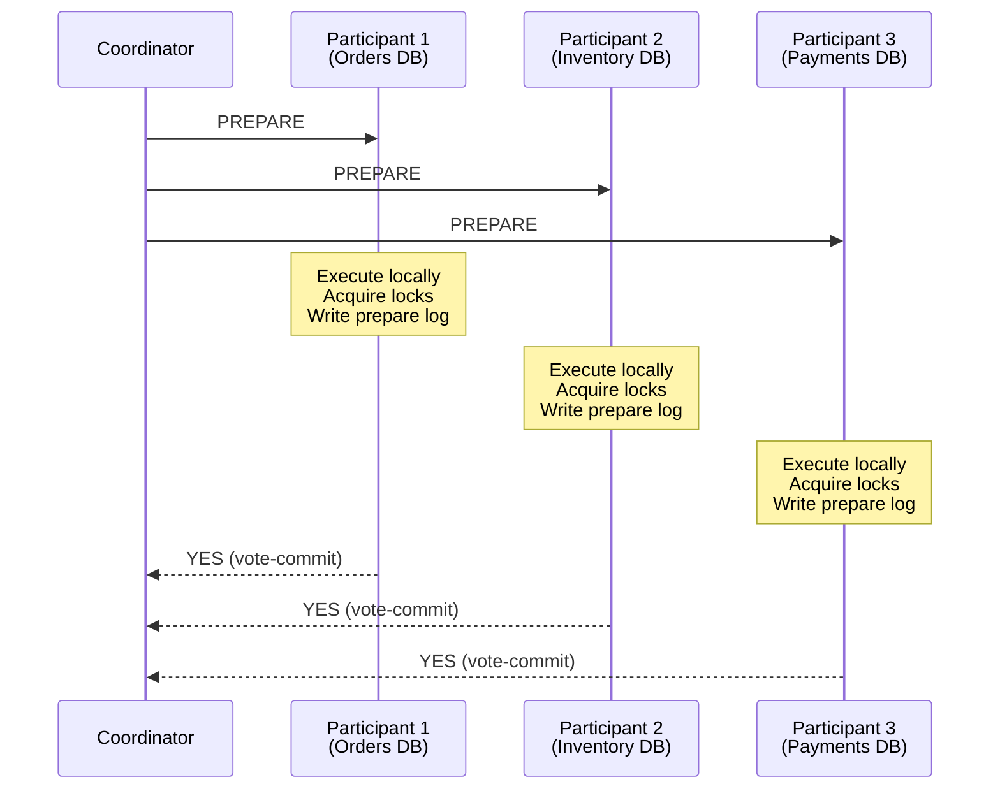
```mermaid
sequenceDiagram
    participant C as Coordinator
    participant P1 as Participant 1<br/>(Orders DB)
    participant P2 as Participant 2<br/>(Inventory DB)
    participant P3 as Participant 3<br/>(Payments DB)

    C->>P1: PREPARE
    C->>P2: PREPARE
    C->>P3: PREPARE

    Note over P1: Execute locally<br/>Acquire locks<br/>Write prepare log

    Note over P2: Execute locally<br/>Acquire locks<br/>Write prepare log

    Note over P3: Execute locally<br/>Acquire locks<br/>Write prepare log

    P1-->>C: YES (vote-commit)
    P2-->>C: YES (vote-commit)
    P3-->>C: YES (vote-commit)
```

## Phase 2: Commit (Decision Phase)

Based on the votes:

- **All voted YES** → Coordinator writes **COMMIT** to its durable log, then sends COMMIT to all participants
- **Any voted NO** (or timeout) → Coordinator writes **ABORT** to its durable log, then sends ABORT to all participants

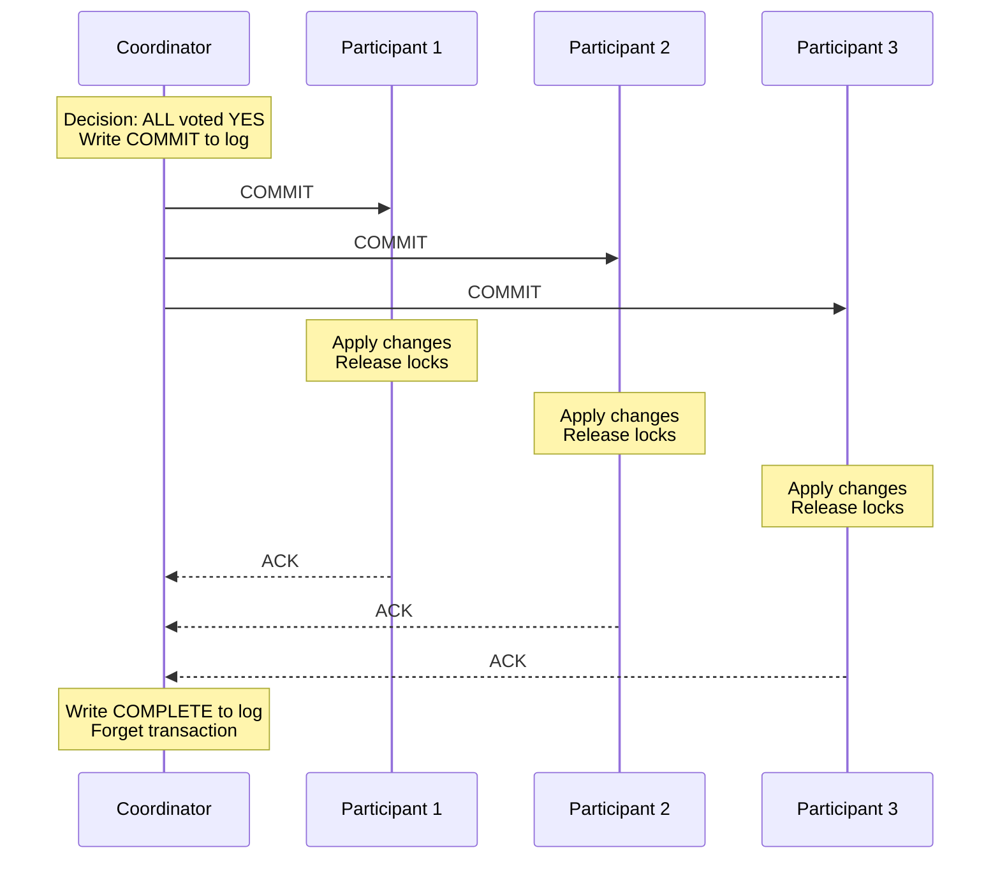
```mermaid
sequenceDiagram
    participant C as Coordinator
    participant P1 as Participant 1
    participant P2 as Participant 2
    participant P3 as Participant 3

    Note over C: Decision: ALL voted YES<br/>Write COMMIT to log

    C->>P1: COMMIT
    C->>P2: COMMIT
    C->>P3: COMMIT

    Note over P1: Apply changes<br/>Release locks
    Note over P2: Apply changes<br/>Release locks
    Note over P3: Apply changes<br/>Release locks

    P1-->>C: ACK
    P2-->>C: ACK
    P3-->>C: ACK

    Note over C: Write COMPLETE to log<br/>Forget transaction
```

---

## The Complete 2PC State Machine

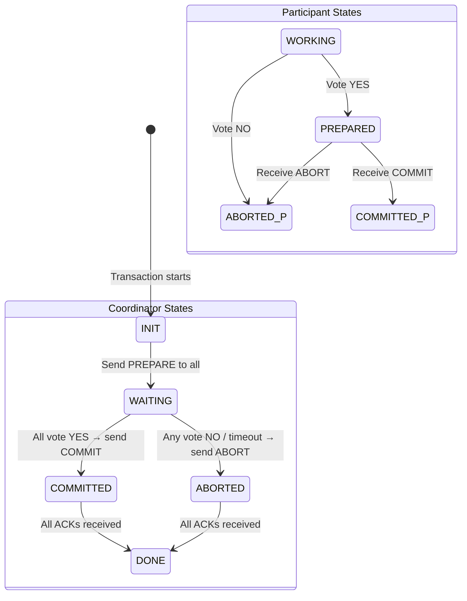
```mermaid
stateDiagram-v2
    [*] --> INIT: Transaction starts

    state "Coordinator States" as CoordStates {
        INIT --> WAITING: Send PREPARE to all
        WAITING --> COMMITTED: All vote YES → send COMMIT
        WAITING --> ABORTED: Any vote NO / timeout → send ABORT
        COMMITTED --> DONE: All ACKs received
        ABORTED --> DONE: All ACKs received
    }

    state "Participant States" as PartStates {
        WORKING --> PREPARED: Vote YES
        WORKING --> ABORTED_P: Vote NO
        PREPARED --> COMMITTED_P: Receive COMMIT
        PREPARED --> ABORTED_P: Receive ABORT
    }
```

---

## Failure Scenarios — Where 2PC Gets Hard

### Scenario 1: Participant Crashes Before Voting

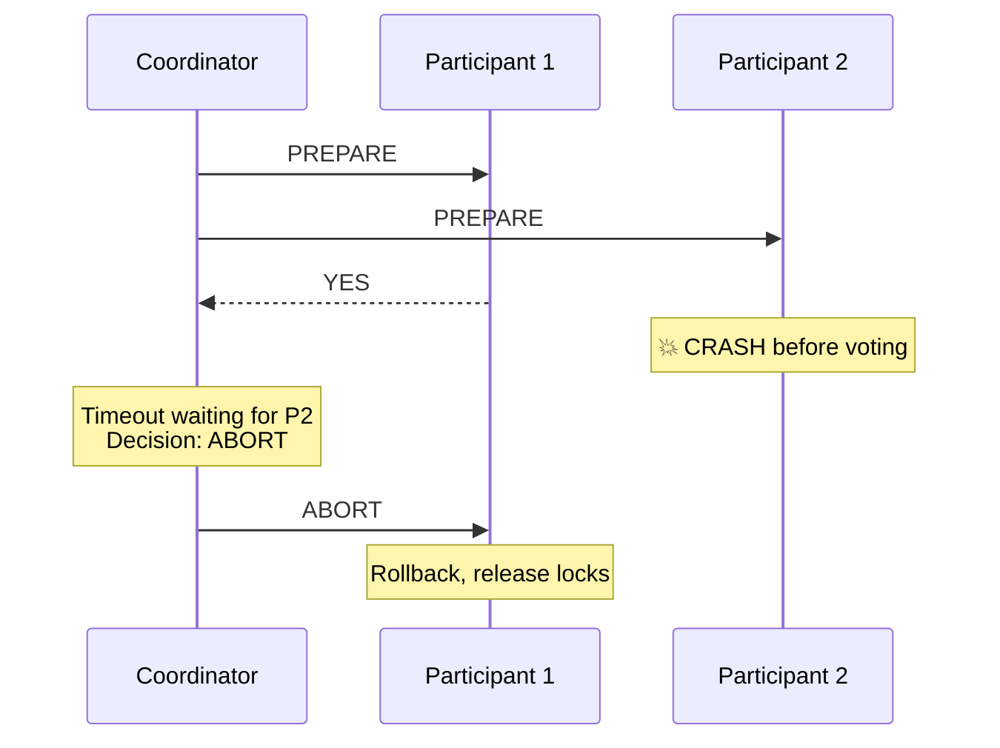
```mermaid
sequenceDiagram
    participant C as Coordinator
    participant P1 as Participant 1
    participant P2 as Participant 2

    C->>P1: PREPARE
    C->>P2: PREPARE

    P1-->>C: YES
    Note over P2: 💥 CRASH before voting

    Note over C: Timeout waiting for P2<br/>Decision: ABORT

    C->>P1: ABORT
    Note over P1: Rollback, release locks
```

**Resolution:** Coordinator times out, aborts the transaction. Straightforward.

### Scenario 2: Participant Crashes After Voting YES

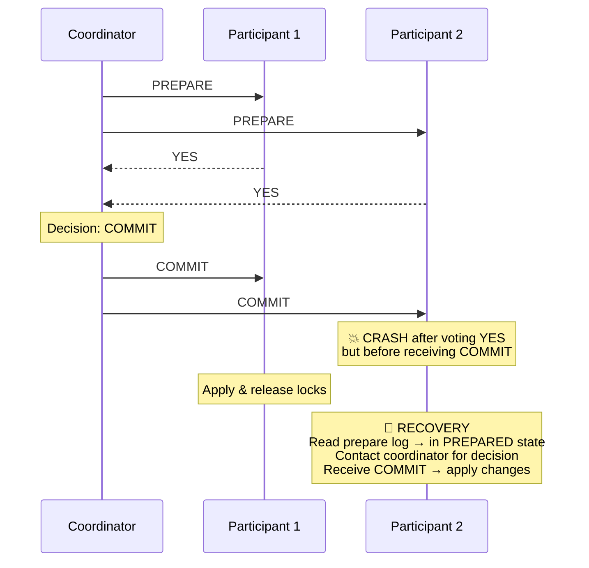
```mermaid
sequenceDiagram
    participant C as Coordinator
    participant P1 as Participant 1
    participant P2 as Participant 2

    C->>P1: PREPARE
    C->>P2: PREPARE

    P1-->>C: YES
    P2-->>C: YES

    Note over C: Decision: COMMIT

    C->>P1: COMMIT
    C->>P2: COMMIT

    Note over P2: 💥 CRASH after voting YES<br/>but before receiving COMMIT

    Note over P1: Apply & release locks

    Note over P2: 🔄 RECOVERY<br/>Read prepare log → in PREPARED state<br/>Contact coordinator for decision<br/>Receive COMMIT → apply changes
```

**Resolution:** On recovery, participant finds prepare record, contacts coordinator, and applies the decision. **Locks are held until recovery completes.**

### Scenario 3: Coordinator Crashes After Collecting Votes (The Blocking Problem)

This is the **most dangerous failure mode** of 2PC.

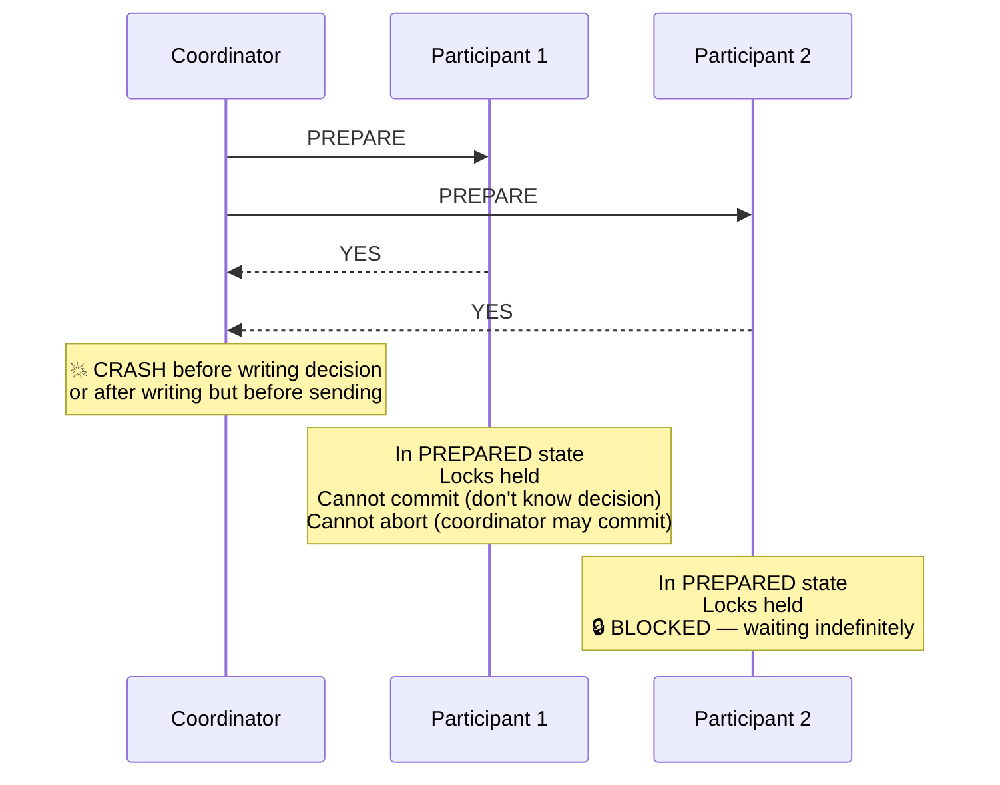
```mermaid
sequenceDiagram
    participant C as Coordinator
    participant P1 as Participant 1
    participant P2 as Participant 2

    C->>P1: PREPARE
    C->>P2: PREPARE

    P1-->>C: YES
    P2-->>C: YES

    Note over C: 💥 CRASH before writing decision<br/>or after writing but before sending

    Note over P1: In PREPARED state<br/>Locks held<br/>Cannot commit (don't know decision)<br/>Cannot abort (coordinator may commit)
    Note over P2: In PREPARED state<br/>Locks held<br/>🔒 BLOCKED — waiting indefinitely
```

**This is why 2PC is called a "blocking protocol."** Participants in the PREPARED state are stuck: they've promised to commit, but don't know the decision. They **must hold locks** and wait for the coordinator to recover.

| Failure | Impact | Resolution |
|---------|--------|------------|
| Participant crash before vote | Coordinator aborts | ✅ Non-blocking |
| Participant crash after YES vote | Recovers from log, contacts coordinator | ✅ Recoverable (but locks held during downtime) |
| Coordinator crash before decision | **All prepared participants block** | ❌ **BLOCKING** — wait for coordinator recovery |
| Coordinator crash after logging decision | Participants contact recovered coordinator | ✅ Recoverable |
| Network partition | Timeout → abort OR blocking | ⚠️ Depends on timing |

---

## The Blocking Problem — In Detail

The window of vulnerability:

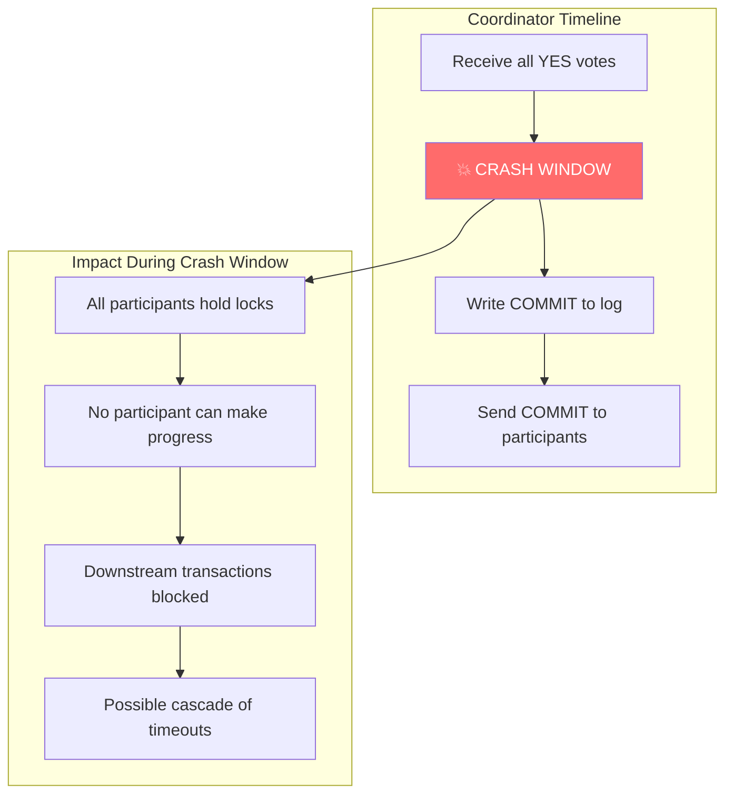
```mermaid
flowchart TB
    subgraph timeline [Coordinator Timeline]
        A[Receive all YES votes] --> B[💥 CRASH WINDOW]
        B --> C[Write COMMIT to log]
        C --> D[Send COMMIT to participants]
    end

    subgraph impact [Impact During Crash Window]
        E[All participants hold locks]
        F[No participant can make progress]
        G[Downstream transactions blocked]
        H[Possible cascade of timeouts]
    end

    B --> E
    E --> F
    F --> G
    G --> H

    style B fill:#ff6b6b,color:#fff
```

**Real-world impact:**
- A coordinator crash can hold locks for minutes to hours
- Any transaction touching the same rows is blocked
- This can cascade through the entire system
- In the worst case, manual intervention is required

---

## Three-Phase Commit (3PC) — Addressing the Blocking Problem

3PC adds an intermediate **pre-commit** phase to eliminate the blocking window.

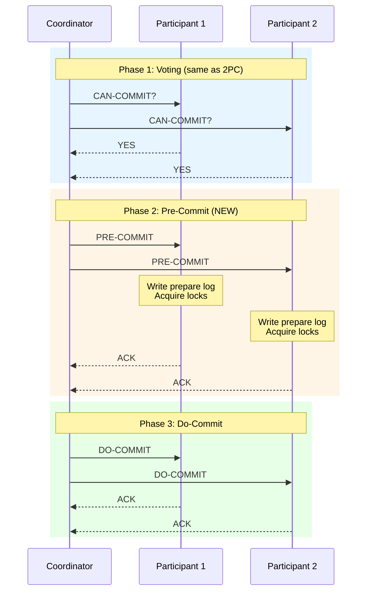
```mermaid
sequenceDiagram
    participant C as Coordinator
    participant P1 as Participant 1
    participant P2 as Participant 2

    rect rgb(230, 245, 255)
    Note over C,P2: Phase 1: Voting (same as 2PC)
    C->>P1: CAN-COMMIT?
    C->>P2: CAN-COMMIT?
    P1-->>C: YES
    P2-->>C: YES
    end

    rect rgb(255, 245, 230)
    Note over C,P2: Phase 2: Pre-Commit (NEW)
    C->>P1: PRE-COMMIT
    C->>P2: PRE-COMMIT
    Note over P1: Write prepare log<br/>Acquire locks
    Note over P2: Write prepare log<br/>Acquire locks
    P1-->>C: ACK
    P2-->>C: ACK
    end

    rect rgb(230, 255, 230)
    Note over C,P2: Phase 3: Do-Commit
    C->>P1: DO-COMMIT
    C->>P2: DO-COMMIT
    P1-->>C: ACK
    P2-->>C: ACK
    end
```

### How 3PC Resolves Blocking

In 3PC, if the coordinator crashes after Pre-Commit:
- Participants know the coordinator intended to commit (because they received PRE-COMMIT)
- A recovery protocol can elect a new coordinator
- The new coordinator can safely drive the transaction to completion

| Aspect | 2PC | 3PC |
|--------|-----|-----|
| Phases | 2 | 3 |
| Blocking? | Yes (coordinator crash) | Non-blocking under crash-stop model |
| Network partitions | Blocking | **Still problematic** (can cause inconsistency) |
| Message complexity | 3N (prepare + commit + ack) | 5N (more round trips) |
| Latency | Lower | Higher |
| Practical adoption | Widely used | Rarely used |

### Why 3PC is Rarely Used in Practice

- **Does not help with network partitions** — in an async network, you can't distinguish a slow node from a crashed one
- **Higher latency** — extra round trip
- **Complexity** — more states, more failure modes to handle
- Real-world systems prefer **2PC with timeouts + operational recovery** or **SAGA pattern** instead

---

## 2PC in Practice — Real-World Implementations

### XA Transactions (The Standard)

XA (eXtended Architecture) is the industry standard for 2PC, defined by the X/Open DTP model.

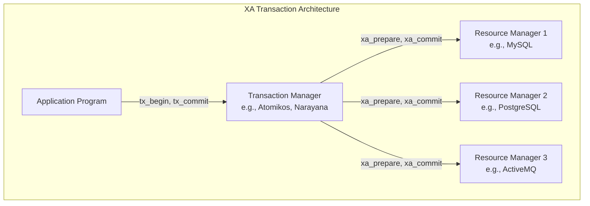
```mermaid
flowchart TB
    subgraph xa [XA Transaction Architecture]
        AP[Application Program]
        TM[Transaction Manager<br/>e.g., Atomikos, Narayana]
        RM1[Resource Manager 1<br/>e.g., MySQL]
        RM2[Resource Manager 2<br/>e.g., PostgreSQL]
        RM3[Resource Manager 3<br/>e.g., ActiveMQ]
    end

    AP -->|tx_begin, tx_commit| TM
    TM -->|xa_prepare, xa_commit| RM1
    TM -->|xa_prepare, xa_commit| RM2
    TM -->|xa_prepare, xa_commit| RM3
```

**XA Interface Methods:**

| Method | Phase | Description |
|--------|-------|-------------|
| `xa_start` | — | Associate thread with transaction |
| `xa_end` | — | Disassociate thread from transaction |
| `xa_prepare` | Phase 1 | Ask RM to prepare |
| `xa_commit` | Phase 2 | Tell RM to commit |
| `xa_rollback` | Phase 2 | Tell RM to rollback |
| `xa_recover` | Recovery | List in-doubt transactions |

**Systems supporting XA:**
- Databases: MySQL, PostgreSQL, Oracle, SQL Server
- Message Brokers: ActiveMQ, IBM MQ
- Application Servers: WildFly, WebLogic, WebSphere
- Transaction Managers: Atomikos, Narayana, Bitronix

### Google Spanner — 2PC at Scale

Google Spanner uses 2PC but solves the blocking problem through **Paxos groups** and **TrueTime**.

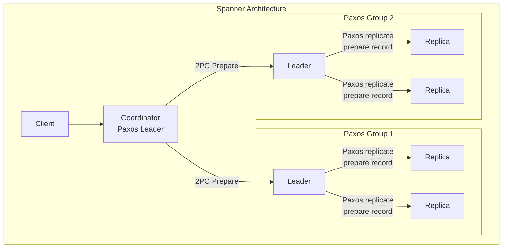
```mermaid
flowchart TB
    subgraph spanner [Spanner Architecture]
        Client[Client]
        Coord[Coordinator<br/>Paxos Leader]

        subgraph PG1 [Paxos Group 1]
            L1[Leader]
            R1a[Replica]
            R1b[Replica]
        end

        subgraph PG2 [Paxos Group 2]
            L2[Leader]
            R2a[Replica]
            R2b[Replica]
        end
    end

    Client --> Coord
    Coord -->|2PC Prepare| L1
    Coord -->|2PC Prepare| L2

    L1 -->|Paxos replicate<br/>prepare record| R1a
    L1 -->|Paxos replicate<br/>prepare record| R1b

    L2 -->|Paxos replicate<br/>prepare record| R2a
    L2 -->|Paxos replicate<br/>prepare record| R2b
```

**How Spanner avoids the blocking problem:**
- The coordinator is itself a **Paxos group** (replicated)
- If the coordinator leader dies, a new leader is elected in seconds
- Prepare records are Paxos-replicated, so no data is lost
- TrueTime provides globally consistent timestamps

---

## Performance Characteristics

### Latency Analysis

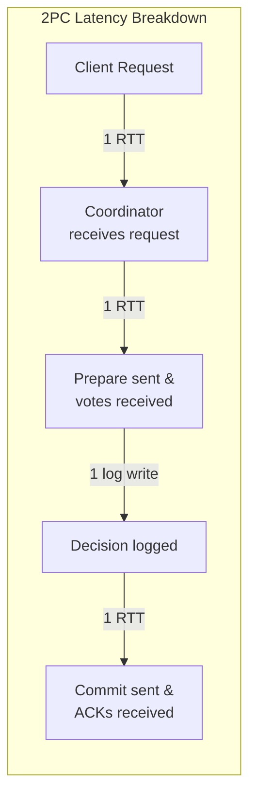
```mermaid
flowchart LR
    subgraph latency [2PC Latency Breakdown]
        A[Client Request] -->|1 RTT| B[Coordinator<br/>receives request]
        B -->|1 RTT| C[Prepare sent &<br/>votes received]
        C -->|1 log write| D[Decision logged]
        D -->|1 RTT| E[Commit sent &<br/>ACKs received]
    end
```

| Component | Latency | Notes |
|-----------|---------|-------|
| Prepare round-trip | 1 network RTT | Parallel to all participants |
| Participant log write | 1 disk fsync | Each participant writes prepare record |
| Coordinator decision log | 1 disk fsync | **Critical path — must be durable** |
| Commit round-trip | 1 network RTT | Parallel to all participants |
| **Total minimum** | **2 RTT + 2 fsync** | Plus any application processing time |

### Lock Holding Duration

This is the real cost. Locks are held from **prepare** until **commit/abort**:

```
Lock held duration = Prepare phase time
                   + Coordinator decision time
                   + Commit phase time
                   + Any failure recovery time
```

With cross-datacenter 2PC (e.g., 50ms RTT):
- Normal case: ~100-200ms lock hold time
- Coordinator failure: **minutes to hours** of lock hold time

---

## Practical Application: E-Commerce Order Placement

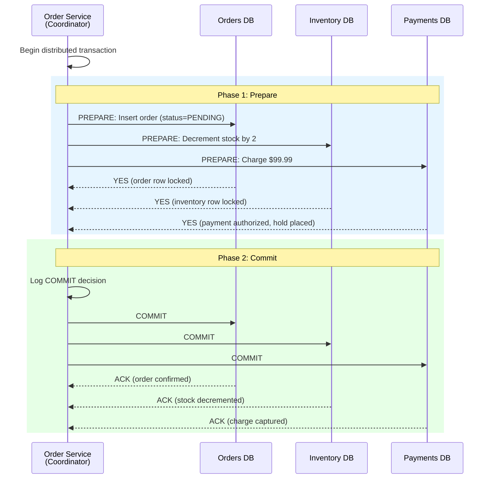
```mermaid
sequenceDiagram
    participant App as Order Service<br/>(Coordinator)
    participant Orders as Orders DB
    participant Inventory as Inventory DB
    participant Payments as Payments DB

    App->>App: Begin distributed transaction

    rect rgb(230, 245, 255)
    Note over App,Payments: Phase 1: Prepare
    App->>Orders: PREPARE: Insert order (status=PENDING)
    App->>Inventory: PREPARE: Decrement stock by 2
    App->>Payments: PREPARE: Charge $99.99

    Orders-->>App: YES (order row locked)
    Inventory-->>App: YES (inventory row locked)
    Payments-->>App: YES (payment authorized, hold placed)
    end

    rect rgb(230, 255, 230)
    Note over App,Payments: Phase 2: Commit
    App->>App: Log COMMIT decision
    App->>Orders: COMMIT
    App->>Inventory: COMMIT
    App->>Payments: COMMIT

    Orders-->>App: ACK (order confirmed)
    Inventory-->>App: ACK (stock decremented)
    Payments-->>App: ACK (charge captured)
    end
```

---

## Pros and Cons

### Pros

| Advantage | Detail |
|-----------|--------|
| **Strong consistency** | Guarantees atomicity — all-or-nothing across participants |
| **Well-understood protocol** | Decades of theory and implementation experience |
| **Standardized (XA)** | Cross-vendor interoperability via XA interface |
| **Simple mental model** | Easy to reason about correctness — either committed or aborted |
| **Mature tooling** | Supported by all major databases and app servers |
| **No compensating logic** | Unlike SAGA, you don't need to write undo operations |

### Cons

| Disadvantage | Detail |
|--------------|--------|
| **Blocking protocol** | Coordinator crash blocks all prepared participants |
| **High latency** | Minimum 2 network round-trips + 2 disk fsyncs |
| **Lock contention** | Locks held across the entire protocol duration |
| **Reduced throughput** | Long lock-hold times reduce concurrency |
| **Coordinator is SPOF** | Without replication, coordinator failure is catastrophic |
| **Not partition-tolerant** | Network partitions can cause indefinite blocking |
| **Doesn't scale horizontally** | Adding participants increases failure probability and latency |
| **Homogeneous assumption** | All participants must support the XA/2PC interface |

---

## When to Use 2PC

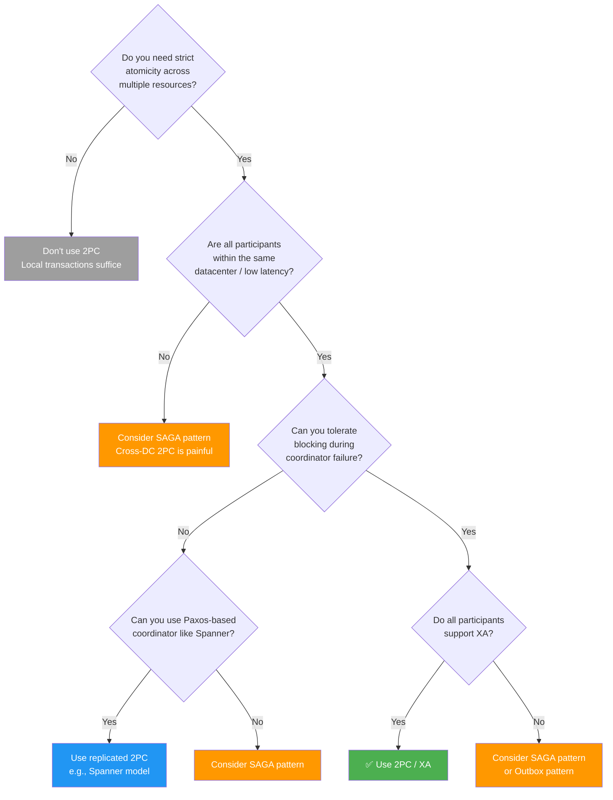
```mermaid
flowchart TB
    Q1{Do you need strict<br/>atomicity across<br/>multiple resources?}
    Q1 -->|No| SKIP[Don't use 2PC<br/>Local transactions suffice]
    Q1 -->|Yes| Q2{Are all participants<br/>within the same<br/>datacenter / low latency?}
    Q2 -->|No| SAGA[Consider SAGA pattern<br/>Cross-DC 2PC is painful]
    Q2 -->|Yes| Q3{Can you tolerate<br/>blocking during<br/>coordinator failure?}
    Q3 -->|No| Q4{Can you use Paxos-based<br/>coordinator like Spanner?}
    Q4 -->|Yes| SPANNER[Use replicated 2PC<br/>e.g., Spanner model]
    Q4 -->|No| SAGA2[Consider SAGA pattern]
    Q3 -->|Yes| Q5{Do all participants<br/>support XA?}
    Q5 -->|Yes| USE_2PC[✅ Use 2PC / XA]
    Q5 -->|No| SAGA3[Consider SAGA pattern<br/>or Outbox pattern]

    style USE_2PC fill:#4CAF50,color:#fff
    style SAGA fill:#FF9800,color:#fff
    style SAGA2 fill:#FF9800,color:#fff
    style SAGA3 fill:#FF9800,color:#fff
    style SKIP fill:#9E9E9E,color:#fff
    style SPANNER fill:#2196F3,color:#fff
```

### Use 2PC When

- **Financial transactions** requiring absolute atomicity (e.g., transferring funds between two databases)
- **Same-datacenter** operations where latency is low (< 5ms RTT)
- **All participants support XA** — homogeneous or XA-compatible infrastructure
- **Transaction volume is moderate** — high throughput systems will suffer from lock contention
- **Short-lived transactions** — the prepare-to-commit window should be milliseconds, not seconds
- **Strong consistency is non-negotiable** — e.g., regulatory requirements

### Do NOT Use 2PC When

- **Microservices across the internet** — latency makes lock holding unacceptable
- **Long-running transactions** (hours/days) — locks cannot be held that long
- **High throughput is critical** — lock contention will kill performance
- **Participants are heterogeneous** — not all services support XA (e.g., REST APIs, third-party services)
- **Cross-datacenter operations** — network partitions will cause blocking
- **You need availability over consistency** — 2PC sacrifices availability for consistency

---

## 2PC vs. Alternatives — Quick Comparison

| Aspect | 2PC | SAGA | Outbox + CDC | TCC |
|--------|-----|------|-------------|-----|
| **Consistency** | Strong (atomic) | Eventual | Eventual | Strong (if all confirm) |
| **Isolation** | Full (locks held) | None (intermediate states visible) | None | Partial (via reservations) |
| **Blocking** | Yes | No | No | No |
| **Latency** | High (2 RTT + sync) | Low per step | Low | Medium (3 phases) |
| **Complexity** | Protocol complexity | Business logic complexity | Infrastructure complexity | Business logic complexity |
| **Best for** | Same-DC, XA-compatible | Microservices, long-running | Event-driven systems | Short-lived, cross-service |

---

## Key Takeaways for System Design Interviews

1. **2PC guarantees atomicity but at the cost of availability and performance** — know the trade-off.
2. **The blocking problem is the Achilles' heel** — if the coordinator dies after prepare, participants are stuck.
3. **3PC is theoretically better but practically useless** — it doesn't help with network partitions.
4. **Google Spanner solved blocking** by making the coordinator a replicated Paxos group — mention this in interviews.
5. **2PC works well within a single datacenter** with XA-compatible databases — it's still widely used in enterprise Java (JTA/XA).
6. **For microservices, prefer SAGA** — see [SAGA Pattern Deep Dive](./saga-pattern.md).
7. **Lock holding duration is the key metric** — it determines throughput impact.
8. **Always mention the alternative** — if you discuss 2PC, mention SAGA as the alternative for microservices architectures.

---

## Related Concepts

- **[SAGA Pattern](./saga-pattern.md)** — The non-blocking alternative for distributed transactions
- **Outbox Pattern** — Reliable event publishing without 2PC
- **TCC (Try-Confirm-Cancel)** — A variant that reserves resources explicitly
- **Paxos / Raft** — Consensus protocols that can replicate the coordinator to avoid blocking
- **Idempotency** — Critical for retry-based recovery in any distributed transaction
