# Wallet & Ledger System — Deep Dive

Every financial system, from a simple peer-to-peer payments app to a global exchange, rests on one foundational guarantee: **the books must balance**. If you credit one account, you must debit another — no money is created or destroyed. This invariant, known as double-entry bookkeeping, has governed commerce for over 500 years. Designing a digital wallet and ledger system that enforces this guarantee at millions of transactions per second, across distributed infrastructure, while remaining auditable and compliant, is one of the hardest system design problems in fintech.

---

## Problem Statement & Requirements

### Functional Requirements

| Requirement | Description |
|-------------|-------------|
| **User wallets** | Each user has one or more wallets holding a balance |
| **Peer-to-peer transfers** | Move money between wallets atomically |
| **Top-ups** | Load money from external bank accounts or cards |
| **Withdrawals** | Move money out to external bank accounts |
| **Multi-currency** | Support wallets in different currencies with FX conversion |
| **Holds / authorizations** | Temporarily reserve funds (e.g., pre-auth for ride or hotel) |
| **Refunds** | Reverse a completed transaction partially or fully |
| **Transaction history** | Users view their past transactions with filtering |

### Non-Functional Requirements

| Requirement | Target |
|-------------|--------|
| **Consistency** | No money created or lost — double-entry invariant always holds |
| **Idempotency** | Every mutation is safely retryable |
| **Auditability** | Full, immutable trail of every balance change |
| **Throughput** | 10,000+ transactions per second |
| **Latency** | P99 < 200ms for wallet-to-wallet transfers |
| **Availability** | 99.99% uptime for balance reads |
| **Regulatory** | AML/KYC checks, PCI-DSS for card data, transaction limits |

---

## Core Accounting Concepts

### Double-Entry Bookkeeping

Every financial transaction is recorded as **at least two entries** that sum to zero. If Alice sends $100 to Bob, Alice's account is debited $100 and Bob's account is credited $100. The system is self-balancing: the sum of all debits must always equal the sum of all credits.

```
Debit(Alice, $100) + Credit(Bob, $100) = $0 net change
```

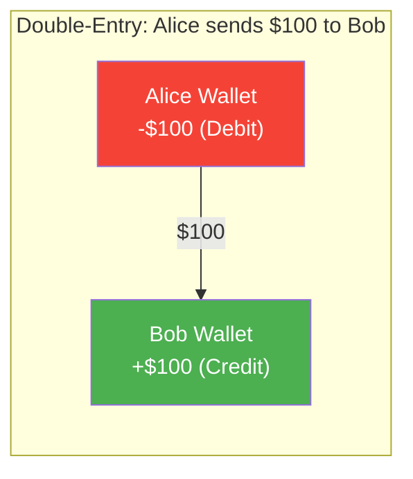

### Key Accounting Primitives

| Concept | Definition | System Design Role |
|---------|------------|-------------------|
| **Chart of Accounts** | The master list of all account types (user wallets, treasury, fees, escrow) | Schema design — every account has a type and ID |
| **Journal Entry** | A single immutable record containing one or more debit/credit line items | The atomic unit of truth in the ledger |
| **General Ledger** | The complete ordered log of all journal entries | The append-only source of truth |
| **Sub-Ledger** | A filtered view of the general ledger for one account | Per-user transaction history |
| **Trial Balance** | Sum of all debits vs all credits — must always equal zero | The invariant you validate during reconciliation |

### Why Double-Entry Matters at Scale

| Single-Entry (Naive) | Double-Entry |
|----------------------|-------------|
| Update Alice's balance: `balance -= 100` | Record journal entry with debit + credit |
| If crash after decrement, money vanishes | If crash mid-write, incomplete entry is rolled back — no partial state |
| No audit trail beyond current balance | Full history of every balance change |
| Reconciliation requires external systems | Self-balancing — `SUM(debits) = SUM(credits)` is checkable |
| Hard to detect bugs or fraud | Discrepancies surface immediately in trial balance |

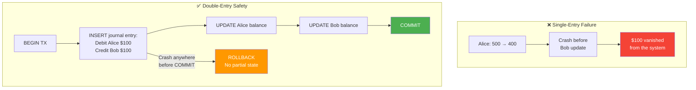

---

## Data Model Design

### Account Types

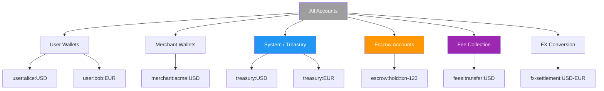

### Ledger Entry Schema

The ledger is **immutable and append-only**. You never update or delete an entry — corrections are made by appending new compensating entries.

```sql
-- The core journal entry (one per logical transaction)
CREATE TABLE journal_entries (
    id              UUID PRIMARY KEY,
    idempotency_key UUID UNIQUE NOT NULL,       -- prevents duplicate processing
    transaction_type VARCHAR(50) NOT NULL,       -- 'P2P_TRANSFER', 'TOP_UP', 'WITHDRAWAL', etc.
    description     TEXT,
    created_at      TIMESTAMP NOT NULL DEFAULT NOW(),
    metadata        JSONB                        -- FX rates, external refs, etc.
);

-- Line items within a journal entry (always sum to zero)
CREATE TABLE ledger_entries (
    id              UUID PRIMARY KEY,
    journal_entry_id UUID NOT NULL REFERENCES journal_entries(id),
    account_id      UUID NOT NULL REFERENCES accounts(id),
    amount          BIGINT NOT NULL,             -- in smallest currency unit (cents)
    direction       VARCHAR(6) NOT NULL CHECK (direction IN ('DEBIT', 'CREDIT')),
    currency        VARCHAR(3) NOT NULL,
    created_at      TIMESTAMP NOT NULL DEFAULT NOW()
);

-- Enforced via DB constraint or application logic:
-- For every journal_entry_id:
--   SUM(CASE WHEN direction='DEBIT' THEN amount ELSE 0 END) =
--   SUM(CASE WHEN direction='CREDIT' THEN amount ELSE 0 END)

-- Accounts table
CREATE TABLE accounts (
    id              UUID PRIMARY KEY,
    account_type    VARCHAR(50) NOT NULL,        -- 'USER_WALLET', 'TREASURY', 'ESCROW', etc.
    owner_id        UUID,                        -- user or merchant ID
    currency        VARCHAR(3) NOT NULL,
    status          VARCHAR(20) NOT NULL DEFAULT 'ACTIVE',
    created_at      TIMESTAMP NOT NULL DEFAULT NOW()
);

-- Materialized balance (optimization — derivable from ledger)
CREATE TABLE balances (
    account_id      UUID PRIMARY KEY REFERENCES accounts(id),
    available       BIGINT NOT NULL DEFAULT 0,   -- spendable balance
    held            BIGINT NOT NULL DEFAULT 0,   -- reserved by authorizations
    currency        VARCHAR(3) NOT NULL,
    version         BIGINT NOT NULL DEFAULT 0,   -- for optimistic locking
    updated_at      TIMESTAMP NOT NULL DEFAULT NOW()
);
```

### Balance Computation: Stored vs Derived

| Approach | How It Works | Pros | Cons |
|----------|-------------|------|------|
| **Derived balance** | `SELECT SUM(credits) - SUM(debits) FROM ledger_entries WHERE account_id = ?` | Always correct, no stale data | Slow for accounts with millions of entries |
| **Stored balance** | Maintain a `balances` table updated atomically with each journal entry | O(1) reads, fast | Can drift from ledger if bugs exist — needs reconciliation |
| **Hybrid (recommended)** | Store balance for reads, derive periodically for reconciliation | Fast reads + correctness validation | More complexity, but best of both worlds |

---

## High-Level Architecture

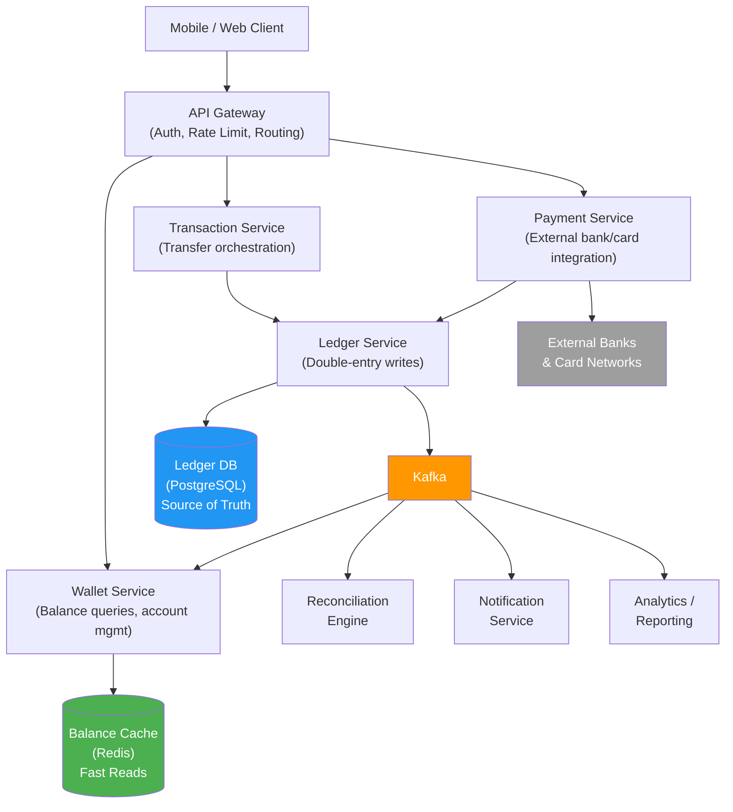

### Component Responsibilities

| Component | Responsibility |
|-----------|---------------|
| **API Gateway** | Authentication, rate limiting, request routing |
| **Wallet Service** | Balance reads from cache, account lifecycle management |
| **Transaction Service** | Orchestrates multi-step flows (P2P, top-up, withdrawal) |
| **Ledger Service** | Writes journal entries atomically, enforces double-entry invariant |
| **Payment Service** | Integrates with external banks, card networks, PSPs |
| **Kafka** | Async event distribution — balance updates, notifications, analytics |
| **Reconciliation Engine** | Validates ledger vs balance cache, ledger vs external statements |

### CQRS: Write to Ledger, Read from Cache

The system follows a CQRS pattern: all mutations go through the Ledger Service (write model), while balance queries are served from a Redis-backed cache (read model). Kafka bridges the two.

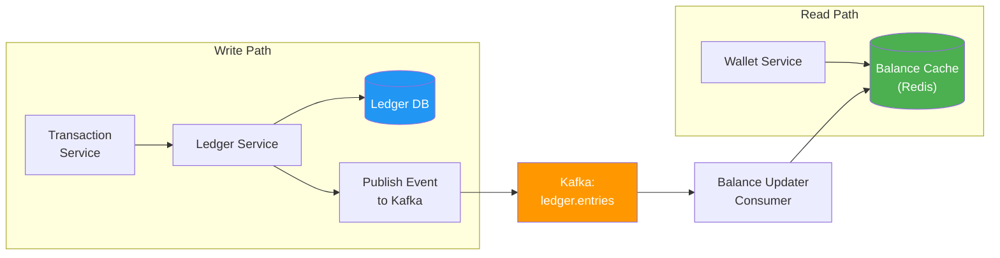

---

## Transaction Processing Flows

### Flow 1: Peer-to-Peer Transfer (Wallet to Wallet)

Alice sends $50 to Bob. Both wallets are in the same system.

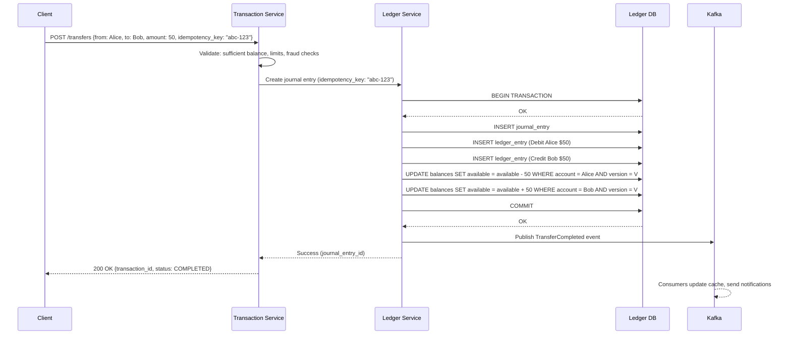

### Flow 2: Top-Up from External Bank

User loads money from their bank account into their wallet.

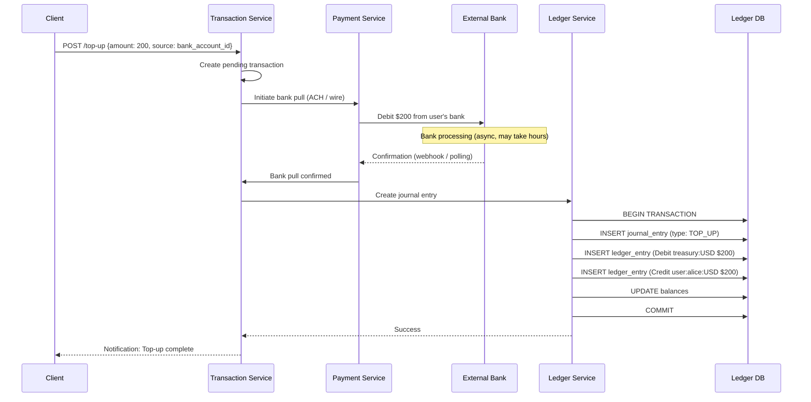

**Why debit Treasury?** The money entering the system must come from somewhere in the books. The Treasury account represents the system's liability — money owed to users. When a user tops up, the system now owes them that amount.

### Flow 3: Withdrawal to External Bank

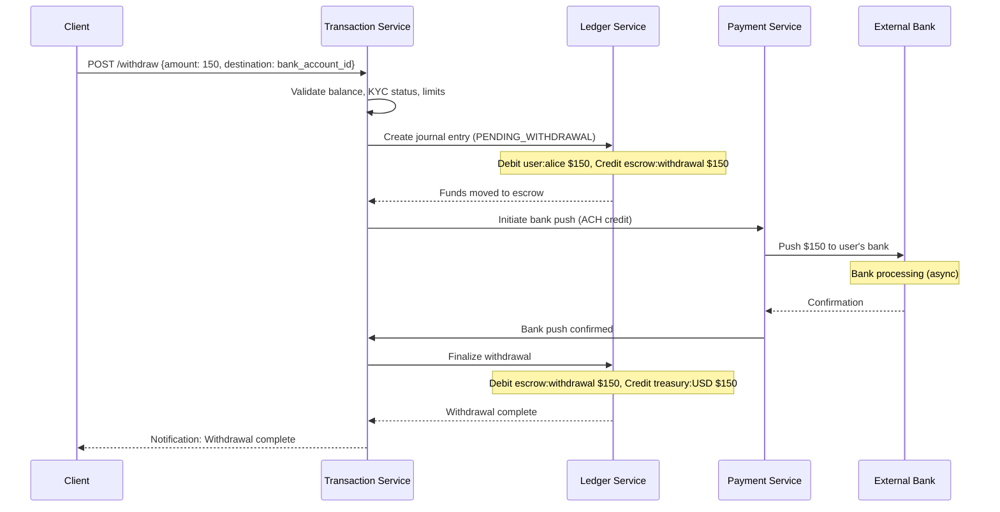

**Why use escrow?** If the bank push fails, the escrow entry makes it easy to reverse — move funds back from escrow to the user's wallet. Without escrow, you'd need to recreate the original state.

### Flow 4: Payment Authorization (Hold → Capture → Release)

A ride-share app authorizes $25 before the ride, then captures the actual fare ($18) afterward.

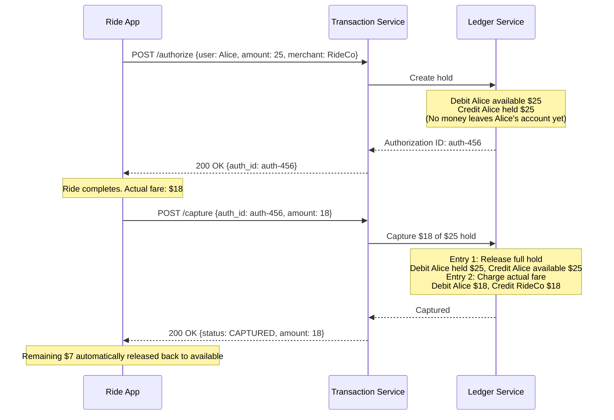

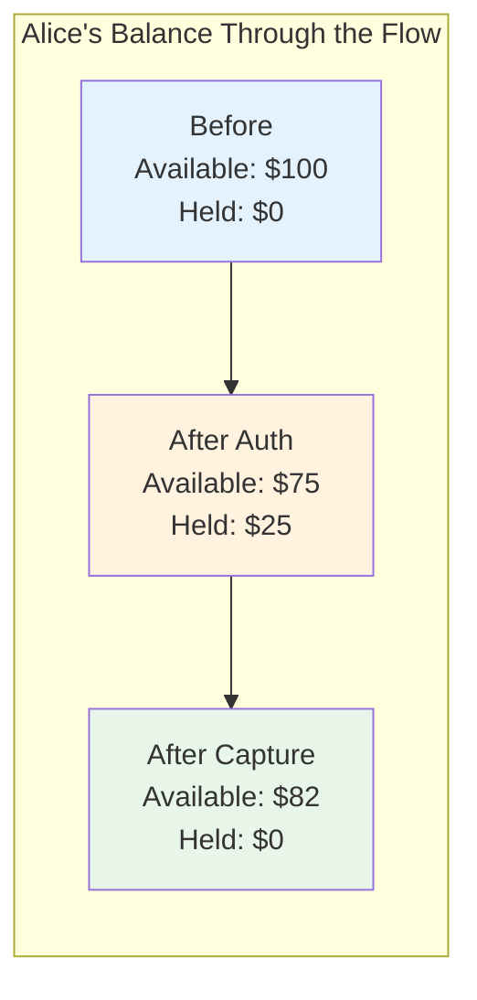

### Flow 5: Refund

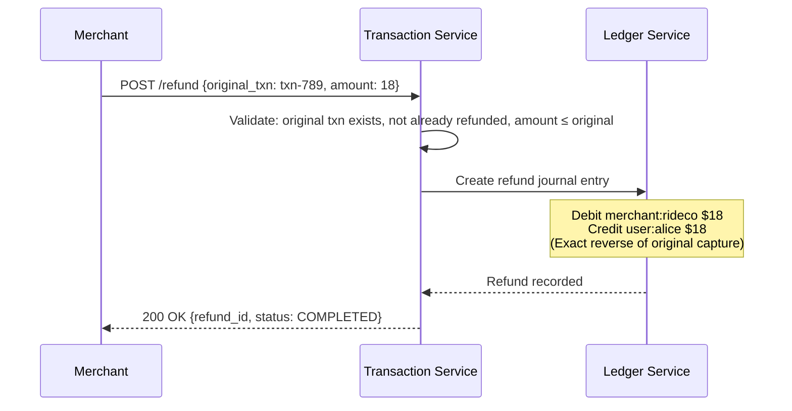

**Key point:** A refund is not a delete — it's a new journal entry that reverses the original. The original entry remains immutable in the ledger, preserving the full audit trail.

### Flow 6: Multi-Currency with FX Conversion

Alice (USD wallet) sends €45 to Bob (EUR wallet). Exchange rate: 1 USD = 0.92 EUR.

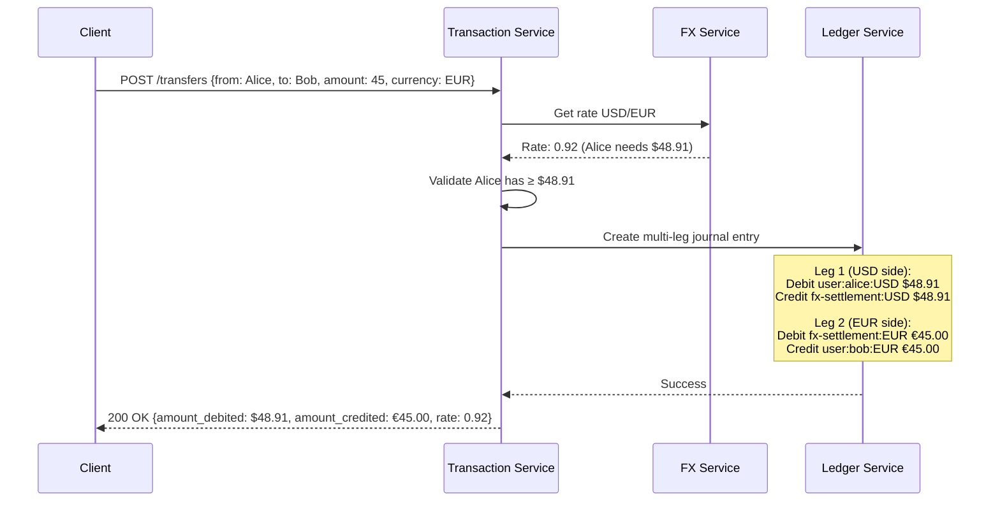

The FX settlement account acts as the bridge between currencies. The difference between what enters and exits the FX account (the spread) becomes FX revenue, tracked separately.

---

## Consistency & Correctness

### Double-Entry Invariant Enforcement

The most critical invariant: **for every journal entry, the sum of all debits must equal the sum of all credits.** This can be enforced at multiple levels:

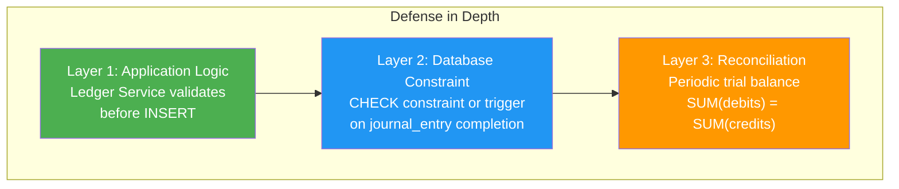

### Optimistic vs Pessimistic Locking on Balance

| Strategy | How It Works | When to Use |
|----------|-------------|-------------|
| **Optimistic (recommended)** | Read balance + version → compute new balance → `UPDATE ... WHERE version = V` → retry if version changed | Most wallet systems — low contention per user |
| **Pessimistic** | `SELECT ... FOR UPDATE` locks the row during the transaction | High-contention accounts (treasury, popular merchant) |

```sql
-- Optimistic locking: only succeeds if no concurrent update
UPDATE balances
SET available = available - 50,
    version = version + 1,
    updated_at = NOW()
WHERE account_id = 'alice-uuid'
  AND version = 42
  AND available >= 50;  -- also enforces sufficient balance

-- If 0 rows affected → concurrent modification → retry
```

### Idempotency for Every Mutation

Every write operation requires an idempotency key. The ledger service uses this to prevent duplicate processing.

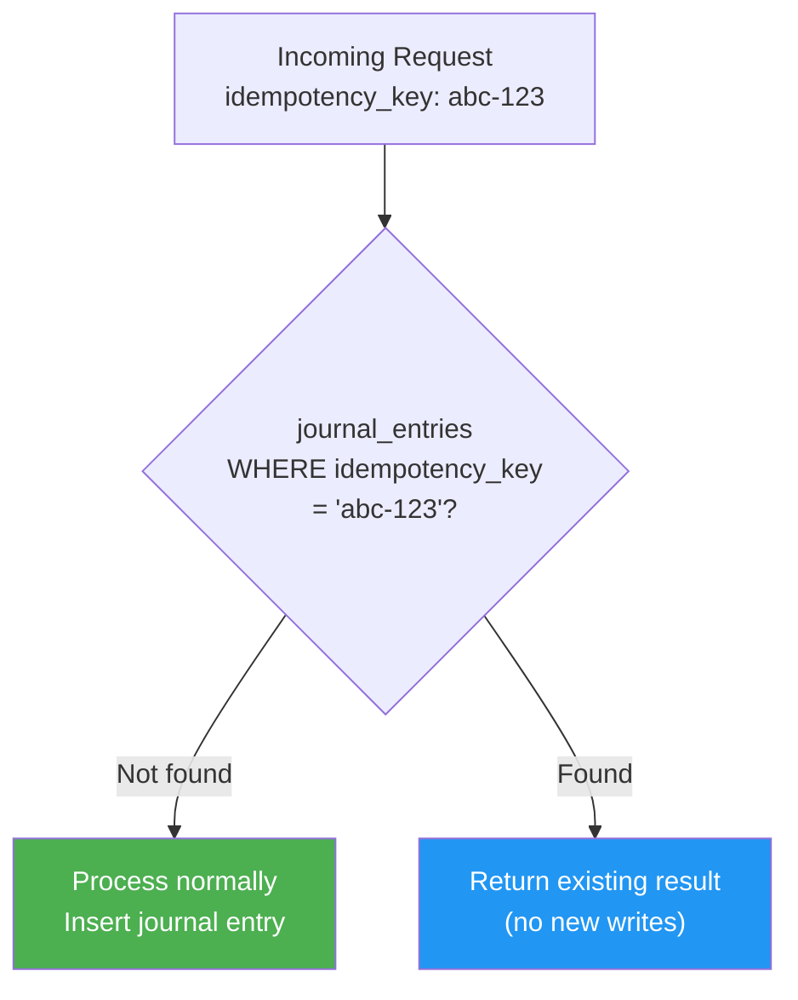

See **[Idempotency](./idempotency.md)** for a comprehensive treatment of idempotency strategies.

### Distributed Transactions: SAGA for Cross-Service, Local TX for Ledger

| Scope | Strategy | Example |
|-------|----------|---------|
| **Within ledger DB** | Local ACID transaction | Journal entry + balance updates in one `BEGIN...COMMIT` |
| **Across services** | SAGA with compensating actions | Top-up: Payment Service (bank pull) + Ledger Service (credit wallet) |
| **Across services with hold** | Orchestration SAGA | Withdrawal: hold funds → push to bank → release or reverse hold |

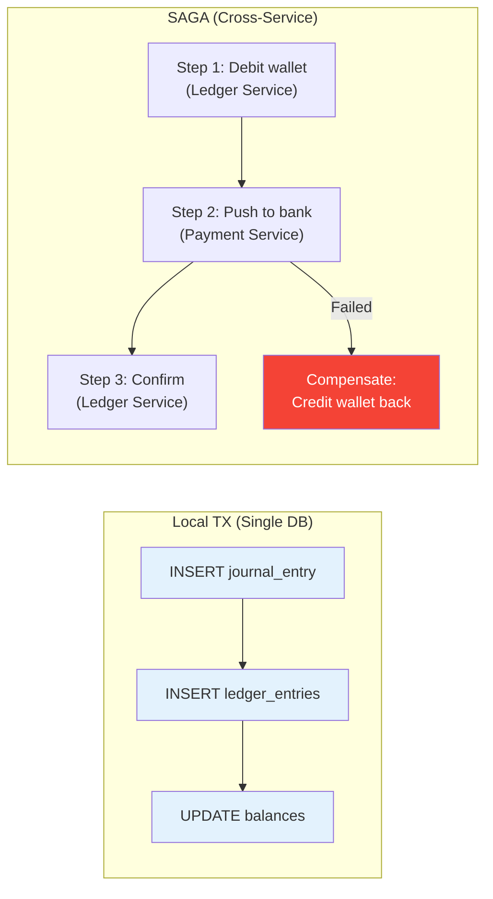

See **[SAGA Pattern](./saga-pattern.md)** and **[Two-Phase Commit](./two-phase-commit.md)** for deeper discussion on distributed transaction strategies.

---

## The Hot Account Problem

### The Problem

In a wallet system, certain accounts participate in nearly every transaction. The **Treasury account** is debited on every top-up and credited on every withdrawal. A **popular merchant** (e.g., Amazon on a payments platform) may receive thousands of credits per second. These "hot accounts" create a severe write contention bottleneck.

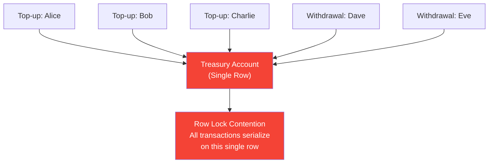

### Solution 1: Sharded Sub-Accounts

Split the hot account into N sub-accounts. Each transaction targets a random (or hashed) shard, reducing contention by N×.

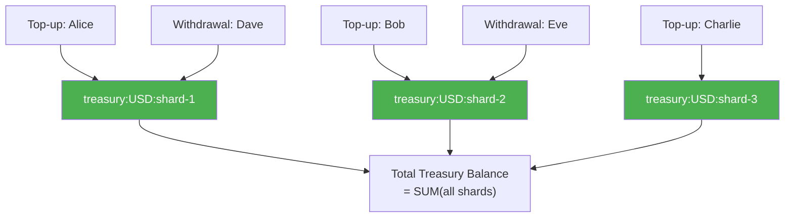

```sql
-- Instead of one treasury row, use N shards
-- Assign shard: shard_id = HASH(transaction_id) % N
UPDATE balances
SET available = available - 200,
    version = version + 1
WHERE account_id = 'treasury:USD:shard-' || (HASH(txn_id) % 16)
  AND version = V;

-- Total treasury balance = SUM across all shards
SELECT SUM(available) FROM balances
WHERE account_id LIKE 'treasury:USD:shard-%';
```

### Solution 2: Tiered Ledger with Async Settlement

Don't touch the treasury in real-time. Instead, record the intent and settle in batches.

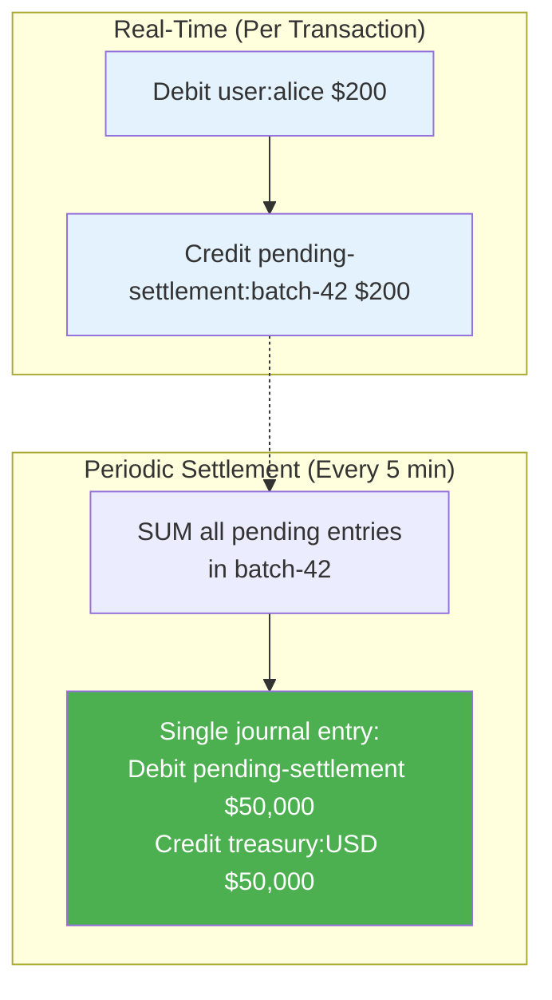

### Solution 3: Batching and Netting

For high-volume merchant accounts, instead of recording 10,000 individual credits, net them and record a single aggregated entry.

| Approach | Entries per 10K Transactions | Contention |
|----------|------------------------------|-----------|
| **Naive** | 10,000 debits + 10,000 credits | Extreme |
| **Sharded (16 shards)** | 10,000 entries across 16 rows | Moderate |
| **Netted (5-min batch)** | ~1 netted entry per batch | Minimal |

---

## Scale Architecture

### Database Sharding by Account ID

Each user's account data (ledger entries, balances) is co-located on the same shard. P2P transfers between users on the same shard execute in a single local transaction. Cross-shard transfers require a SAGA.

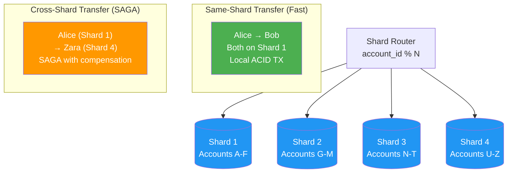

### Read Replicas for Balance Queries

Balance reads are served from Redis cache, backed by read replicas of the ledger DB. The write path goes to the primary, and Kafka propagates updates to the cache.

### Event Sourcing the Ledger

A financial ledger is a natural fit for event sourcing — ledger entries are already immutable, append-only events. The current balance is a projection (fold) over all entries for an account.

```
balance(account) = FOLD(all ledger_entries for account)
                 = SUM(credits) - SUM(debits)
```

| Event Sourcing Concept | Ledger Equivalent |
|-----------------------|-------------------|
| **Event** | Ledger entry (debit or credit) |
| **Event store** | General ledger (append-only) |
| **Projection** | Account balance |
| **Replay** | Recompute balance from all entries |

See **[Event Sourcing](./event-sourcing.md)** for the full pattern.

### Kafka for Async Event Distribution

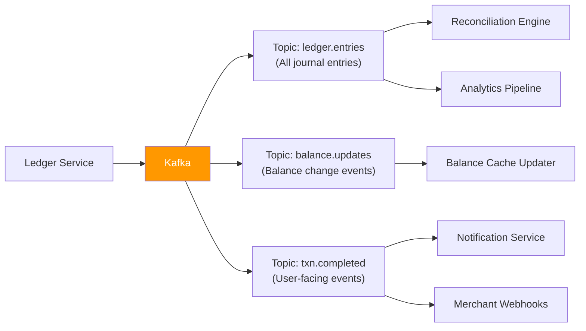

See **[Kafka Communication Patterns](./kafka-communication-patterns.md)** for topic design and consumer patterns.

---

## Reconciliation & Auditing

Reconciliation is the process of verifying that different representations of the same financial data agree. In a wallet system, there are two critical reconciliation loops.

### Internal Reconciliation (Ledger vs Balance Cache)

The stored balance in Redis/balance table must match the derived balance from ledger entries. Discrepancies indicate bugs in the write path.

```mermaid
flowchart TB
    RECON["Reconciliation Engine\n(Runs every N minutes)"]

    RECON --> STEP1["For each account:\nDerived = SUM(credits) - SUM(debits)\nfrom ledger_entries"]
    STEP1 --> STEP2["Compare:\nDerived vs Stored balance"]
    STEP2 --> MATCH{"Match?"}
    MATCH -- "Yes" --> OK["Account OK"]
    MATCH -- "No" --> ALERT["ALERT\nFreeze account\nInvestigate discrepancy"]

    style OK fill:#4CAF50,color:#fff
    style ALERT fill:#f44336,color:#fff
```

### External Reconciliation (Ledger vs Bank Statements)

The system's record of external transactions (top-ups, withdrawals) must match the bank's or payment processor's statement.

| Scenario | Meaning | Resolution |
|----------|---------|-----------|
| **In ledger, not in bank** | We recorded a top-up but bank never processed it | Reverse the ledger entry (compensating entry) |
| **In bank, not in ledger** | Bank processed a debit but we missed the webhook | Create the missing ledger entry |
| **Amount mismatch** | Partial processing, FX rounding, fees | Adjust with a correction entry |

### End-of-Day Settlement

```mermaid
flowchart LR
    EOD["End-of-Day Job"]
    EOD --> TB["Compute Trial Balance\nSUM(debits) = SUM(credits)?"]
    TB --> EXT["Match against\nbank statements"]
    EXT --> NET["Compute net settlement\npositions per bank"]
    NET --> SETTLE["Execute settlement\ntransfers"]
    SETTLE --> REPORT["Generate regulatory\nreports"]

    style EOD fill:#2196F3,color:#fff
    style REPORT fill:#9C27B0,color:#fff
```

---

## Security, Fraud & Compliance

### AML/KYC Integration Points

```mermaid
flowchart TB
    USER["User Registration"] --> KYC["KYC Verification\n(Identity check)"]
    KYC -- "Verified" --> ACTIVE["Account Active\n(Full limits)"]
    KYC -- "Pending" --> LIMITED["Account Limited\n(Low limits)"]
    KYC -- "Failed" --> BLOCKED["Account Blocked"]

    TXN["Every Transaction"] --> AML["AML Screening\n(Sanctions, PEP lists)"]
    AML -- "Clear" --> PROCESS["Process normally"]
    AML -- "Flagged" --> REVIEW["Manual Review Queue"]
    REVIEW -- "Approved" --> PROCESS
    REVIEW -- "Rejected" --> BLOCK["Block + Report to regulator"]

    style BLOCKED fill:#f44336,color:#fff
    style BLOCK fill:#f44336,color:#fff
    style ACTIVE fill:#4CAF50,color:#fff
```

### Transaction Limits and Velocity Checks

| Check | Example Rule | Action on Violation |
|-------|-------------|-------------------|
| **Per-transaction limit** | Max $10,000 per transfer | Reject transaction |
| **Daily limit** | Max $50,000 total outflow per day | Reject, suggest retry tomorrow |
| **Velocity check** | Max 20 transactions per hour | Temporary hold, require 2FA |
| **New account restriction** | Max $500 for first 30 days | Reject, prompt KYC upgrade |
| **Geographic anomaly** | Transaction from unusual country | Step-up authentication |

### Regulatory Holds and Freezes

```sql
-- Account-level freeze (legal hold, fraud investigation)
UPDATE accounts
SET status = 'FROZEN',
    freeze_reason = 'REGULATORY_HOLD',
    frozen_at = NOW(),
    frozen_by = 'compliance-team'
WHERE id = 'suspect-account-uuid';

-- When frozen: all debits blocked, credits may still be allowed
-- (depends on jurisdiction and freeze type)
```

### PCI-DSS for Card Data

Card numbers (PANs) are **never stored** in the wallet/ledger system. They live in a PCI-compliant vault (e.g., Stripe, Adyen) and are referenced by tokens.

---

## Pros and Cons

### Pros

| Advantage | Detail |
|-----------|--------|
| **Self-balancing** | Double-entry guarantees no money is created or destroyed — bugs surface as trial balance discrepancies |
| **Complete audit trail** | Append-only ledger means every balance change is traceable to a specific journal entry |
| **Regulatory readiness** | Financial regulators expect double-entry — the system speaks their language natively |
| **Flexible account model** | Escrow, holds, FX, fees — all modeled as accounts and entries, no special-case code |
| **Natural event sourcing** | Immutable entries fit event sourcing perfectly — replay to rebuild any projection |

### Cons

| Disadvantage | Detail |
|--------------|--------|
| **Write amplification** | Every logical transaction creates multiple rows (journal entry + N ledger entries + balance updates) |
| **Hot account contention** | Treasury and popular merchant accounts serialize writes — requires sharding or batching |
| **Operational complexity** | Reconciliation engines, FX settlement, compliance pipelines add significant infrastructure |
| **Cross-shard transfers** | When sender and receiver are on different DB shards, you need SAGAs instead of local transactions |
| **Balance consistency lag** | CQRS means cached balances can be briefly stale — acceptable for reads, but writes must check the source of truth |

---

## When to Use

```mermaid
flowchart TB
    START["Building a system that\nmoves money?"]
    START --> Q1{"Do you need\nauditability and\ncompliance?"}
    Q1 -- "Yes" --> Q2{"Multiple account types?\n(escrow, holds, FX)"}
    Q1 -- "No" --> SIMPLE["Simple balance field\nmay suffice\n(e.g., game currency)"]
    Q2 -- "Yes" --> FULL["Full double-entry\nledger system"]
    Q2 -- "No" --> Q3{"High throughput\n(>1K TPS)?"}
    Q3 -- "Yes" --> FULL
    Q3 -- "No" --> LIGHT["Lightweight ledger\n(double-entry without\nCQRS/sharding)"]

    style FULL fill:#4CAF50,color:#fff
    style LIGHT fill:#2196F3,color:#fff
    style SIMPLE fill:#9E9E9E,color:#fff
```

### Use a Double-Entry Ledger When

- **You handle real money** — regulatory requirements demand auditability
- **You need holds/authorizations** — the available/held balance split requires proper accounting
- **Multi-currency is required** — FX settlement accounts keep the books balanced across currencies
- **You must reconcile with external systems** — banks, card networks, payment processors
- **Scale exceeds a single database** — the append-only model shards well and supports event sourcing

### Do NOT Use a Full Ledger When

- **It's not real money** — game coins, loyalty points with no cash value can use a simpler model
- **Single-user balance** — if you're just tracking one balance with no transfers, a single column suffices
- **You control both sides** — internal service-to-service accounting may not need full double-entry

---

## Real-World Implementations

| System | Domain | Implementation Details |
|--------|--------|----------------------|
| **Stripe** | Payments | Double-entry ledger with idempotent API, immutable journal entries, Treasury API for embedded finance |
| **Square** | POS / Cash App | Sharded ledger by merchant, event-sourced transaction log, real-time balance cache |
| **Nubank** | Digital bank | Event-sourced ledger on Datomic (immutable DB), Kafka for projections, sub-second balance updates |
| **Revolut** | Multi-currency wallet | Multi-currency ledger with real-time FX, per-currency sub-accounts, automated reconciliation |
| **Uber** | Ride payments | Authorization-hold-capture pattern, sharded treasury accounts, batch settlement with drivers |
| **Airbnb** | Marketplace payments | Escrow-based model — guest funds held until check-in, then released to host minus fees |

---

## Key Takeaways for System Design Interviews

1. **Lead with double-entry** — The first thing to establish is that every transaction is a journal entry with balanced debits and credits. This shows you understand financial system fundamentals.

2. **Separate the ledger from the balance** — The ledger (append-only journal entries) is the source of truth. The balance is a derived, cached projection. Mention CQRS.

3. **Immutability is non-negotiable** — Never update or delete ledger entries. Corrections are new compensating entries. This gives you a complete audit trail.

4. **Use integer arithmetic** — Store amounts in the smallest currency unit (cents, satoshis). Floating-point math causes rounding errors that break the trial balance.

5. **Idempotency on every write** — Every mutation needs an idempotency key. In payments, duplicate processing means double-charging a customer. Reference your idempotency patterns.

6. **Address the hot account problem** — Interviewers love this. Treasury accounts create write contention. Solutions: shard the account into N sub-accounts, batch and net settlements, or use a tiered ledger with async settlement.

7. **Know your transaction boundaries** — Same-shard transfers use local ACID transactions. Cross-shard or cross-service flows use SAGAs with compensating actions. Never use 2PC across services in a wallet system.

8. **Model holds as separate balance buckets** — `available` and `held` are distinct. Authorization moves money from available to held. Capture moves it out. This is how every card network works.

9. **Reconciliation is a first-class system** — Internal (ledger vs cache), external (ledger vs bank statements), and trial balance (sum of all debits = sum of all credits). Mention this proactively.

10. **Multi-currency uses bridge accounts** — FX settlement accounts sit between currency boundaries. The spread stays in the bridge account as revenue. This keeps each currency's books balanced independently.

11. **Compliance is architectural** — AML screening, KYC tiers, transaction limits, and regulatory holds are not bolted on — they are enforcement points in the transaction pipeline.

12. **Event sourcing is a natural fit** — Ledger entries are already immutable events. The balance is a projection. Replay rebuilds state. This is one of the cleanest applications of event sourcing.

---

## Related Concepts

- **[Idempotency](./idempotency.md)** — Every ledger mutation requires idempotency keys to prevent double-processing
- **[SAGA Pattern](./saga-pattern.md)** — Cross-service transaction orchestration for top-ups, withdrawals, and cross-shard transfers
- **[Event Sourcing](./event-sourcing.md)** — The ledger is a natural event store; balances are projections over immutable entries
- **[Kafka Communication Patterns](./kafka-communication-patterns.md)** — Async event distribution for balance updates, reconciliation, and notifications
- **[Two-Phase Commit](./two-phase-commit.md)** — Why 2PC is avoided in favor of SAGAs for cross-service wallet operations
- **CQRS** — Write to the ledger, read from the balance cache — the architectural pattern underlying the system
- **Outbox Pattern** — Reliable event publishing from the ledger DB to Kafka without dual-write risk
- **Distributed Locking** — Pessimistic locking strategies for high-contention accounts
