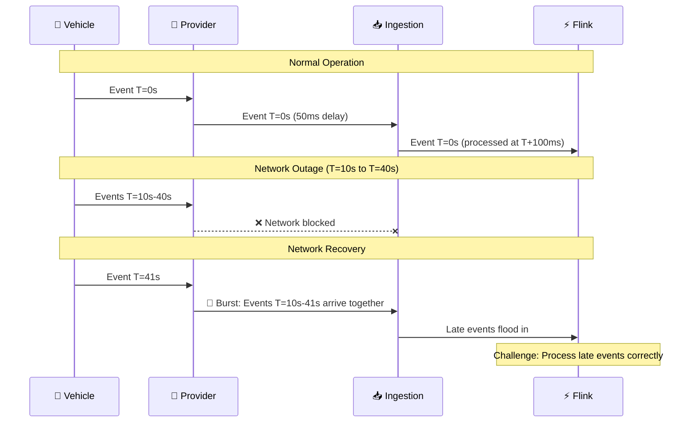
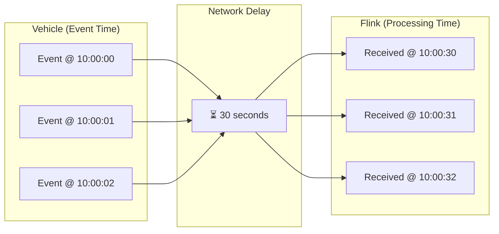
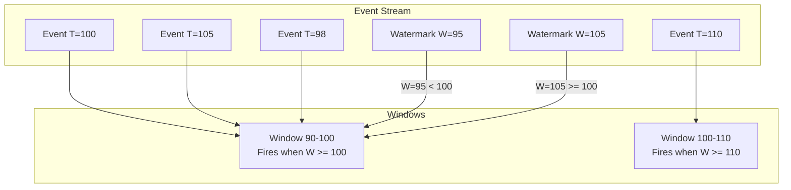
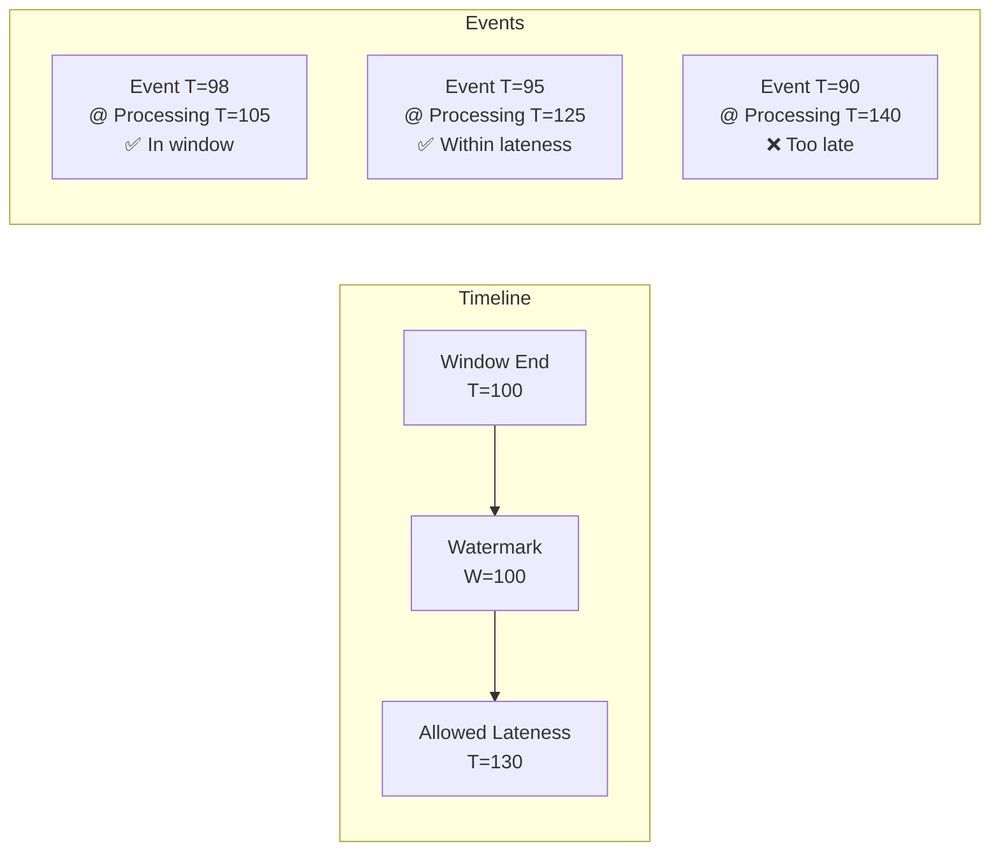
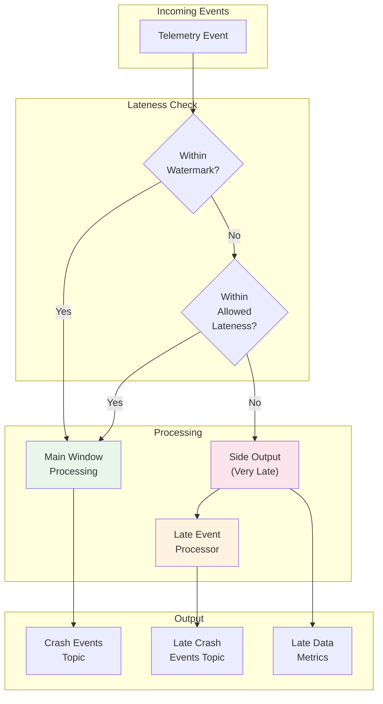
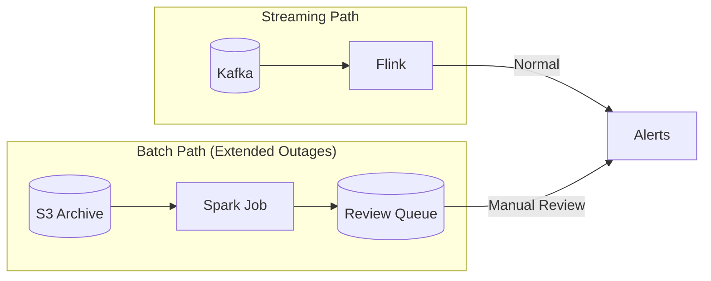
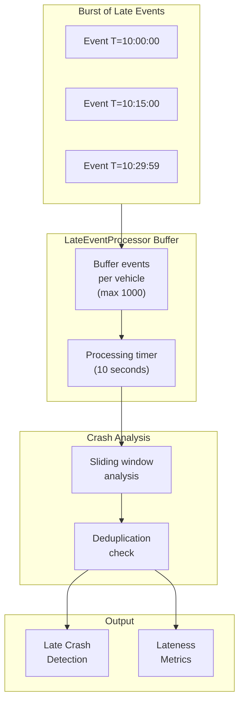
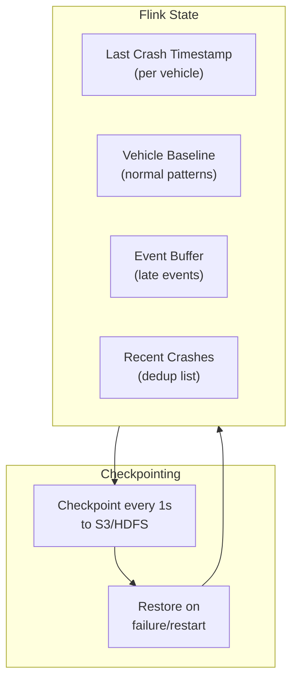

# Late Data Handling in Apache Flink

## Overview

This document explains how the Crash Detection Flink job handles scenarios where data streams are blocked due to network latency and arrive late.

---

## The Problem: Network Latency in IoT



### Scenarios That Cause Late Data

| Scenario | Typical Lateness | Handling Strategy |
|----------|------------------|-------------------|
| Network jitter | < 1 second | Watermark out-of-orderness |
| Cell coverage gaps | 1-30 seconds | Allowed lateness |
| Provider API downtime | 1-60 minutes | Side output + reprocessing |
| Extended connectivity loss | Hours | Batch reprocessing |

---

## Flink Concepts for Late Data

### 1. Event Time vs Processing Time



**Event Time**: When the event actually occurred (from sensor timestamp)
**Processing Time**: When Flink processes the event

We use **Event Time** for crash detection because we need to analyze events in the order they occurred, not when they arrived.

### 2. Watermarks

Watermarks are Flink's way of tracking progress in event time.



**Key Configuration**:
```java
WatermarkStrategy
    .forBoundedOutOfOrderness(Duration.ofSeconds(5))  // Allow 5s out-of-order
    .withTimestampAssigner((event, ts) -> event.getEventTime())
    .withIdleness(Duration.ofMinutes(1));  // Handle idle sources
```

### 3. Allowed Lateness

Events arriving after the watermark has passed the window end can still be processed if within the allowed lateness.



**Configuration**:
```java
.window(TumblingEventTimeWindows.of(Duration.ofMillis(100)))
.allowedLateness(Duration.ofSeconds(30))  // Accept events up to 30s late
.sideOutputLateData(LATE_EVENTS_TAG)       // Capture very late events
```

---

## Our Late Data Handling Strategy



### Layer 1: Watermark with Out-of-Orderness (< 5 seconds)

Handles normal network jitter and minor delays.

```java
WatermarkStrategy
    .<TelemetryEvent>forBoundedOutOfOrderness(Duration.ofSeconds(5))
```

**What happens**: Events up to 5 seconds out of order are automatically included in the correct window.

### Layer 2: Allowed Lateness (< 30 seconds)

Handles cell coverage gaps and provider delays.

```java
.allowedLateness(Duration.ofSeconds(30))
```

**What happens**:
- Window fires when watermark passes (normal output)
- Window fires again if late event arrives within 30 seconds
- Downstream must handle potential duplicate/updated results

### Layer 3: Side Output (> 30 seconds)

Handles extended delays - events are not dropped but routed separately.

```java
.sideOutputLateData(LATE_EVENTS_TAG)
```

**What happens**:
- Very late events go to `LateEventProcessor`
- Buffered and analyzed for missed crashes
- Deduplicated against already-detected crashes
- Flagged as `isLateDetection = true`

### Layer 4: Batch Reprocessing (Hours/Days)

For extended outages, data is stored and reprocessed in batch.



---

## Handling Network Recovery Bursts

When network recovers, we may receive thousands of events in a short period.

### The Challenge

```
Time: 10:00:00 - Network goes down
Time: 10:30:00 - Network recovers
Result: 30 minutes of data (~900K events for 1000 vehicles) arrives in seconds
```

### Our Solution



**Key Features**:

1. **Buffering**: Events are buffered per vehicle to maintain context
2. **Timer-based Processing**: Process buffer after 10 seconds of accumulation
3. **Immediate Processing**: High-severity signals trigger immediate analysis
4. **Deduplication**: Check against recently detected crashes to avoid duplicates

```java
// Immediate processing for high-severity signals
if (isHighSeveritySignal(event)) {
    // Don't wait for buffer timeout
    processBufferedEvents(ctx, out, true);
}
```

---

## State Management for Recovery

Flink's checkpointing ensures we don't lose state during failures.



**Configuration**:
```java
env.enableCheckpointing(1000);  // Every 1 second
checkpointConfig.setCheckpointingMode(CheckpointingMode.EXACTLY_ONCE);
checkpointConfig.setExternalizedCheckpointCleanup(
    CheckpointConfig.ExternalizedCheckpointCleanup.RETAIN_ON_CANCELLATION);
```

---

## Metrics and Monitoring

### Key Metrics for Late Data

| Metric | Description | Alert Threshold |
|--------|-------------|-----------------|
| `late_events_total` | Total late events received | N/A (informational) |
| `late_events_lateness_seconds` | How late events are | p95 > 60s |
| `late_crash_detections_total` | Crashes detected from late data | N/A |
| `side_output_events_total` | Events routed to side output | > 1000/min |
| `buffer_size` | Current buffer size per vehicle | > 500 |
| `watermark_lag_seconds` | How far behind watermark is | > 30s |

### Grafana Dashboard Query Examples

```promql
# Late event rate by provider
rate(late_events_total{job="crash-detection"}[5m]) by (provider_id)

# P95 lateness
histogram_quantile(0.95, rate(late_events_lateness_seconds_bucket[5m]))

# Late crash detection rate
rate(late_crash_detections_total[1h])
```

---

## Configuration Reference

```yaml
# flink-conf.yaml for Late Data Handling

# Watermark configuration
pipeline.time-characteristic: EventTime
pipeline.auto-watermark-interval: 200ms

# Checkpointing for fault tolerance
execution.checkpointing.interval: 1000ms
execution.checkpointing.mode: EXACTLY_ONCE
execution.checkpointing.min-pause: 500ms
execution.checkpointing.timeout: 60000ms

# State backend for large state
state.backend: rocksdb
state.backend.incremental: true
state.checkpoints.dir: s3://flink-checkpoints/crash-detection/

# Buffer timeout for low latency
execution.buffer-timeout: 10ms

# Restart strategy
restart-strategy: fixed-delay
restart-strategy.fixed-delay.attempts: 3
restart-strategy.fixed-delay.delay: 10s
```

---

## Testing Late Data Handling

### Unit Test Example

```java
@Test
public void testLateEventProcessing() throws Exception {
    // Create test harness
    KeyedOneInputStreamOperatorTestHarness<String, TelemetryEvent, CrashEvent> harness =
        createTestHarness();

    harness.open();

    // Process events in order
    harness.processElement(createEvent("vehicle-1", 1000L, 5.0), 1000L);  // Normal
    harness.processElement(createEvent("vehicle-1", 1100L, 6.0), 1100L);  // Normal

    // Advance watermark
    harness.processWatermark(2000L);

    // Process late event (should trigger late processing)
    harness.processElement(createEvent("vehicle-1", 1050L, 12.0), 3000L); // Late!

    // Verify late event was processed
    List<CrashEvent> output = extractOutput(harness);
    assertTrue(output.stream().anyMatch(e -> e.isLateDetection()));

    harness.close();
}
```

### Integration Test with Kafka

```java
@Test
public void testNetworkRecoveryBurst() throws Exception {
    // Simulate normal events
    for (int i = 0; i < 100; i++) {
        producer.send(createEvent("vehicle-1", baseTime + i * 100, normalG));
    }

    // Simulate network outage (no events for 30 seconds)
    Thread.sleep(5000);  // Wait for watermark to advance

    // Simulate burst of late events
    for (int i = 0; i < 300; i++) {
        long eventTime = baseTime + 10000 + i * 100;  // 10-40 seconds ago
        producer.send(createEvent("vehicle-1", eventTime,
            i == 150 ? crashG : normalG));  // Crash in middle
    }

    // Verify crash was detected from late data
    ConsumerRecords<String, CrashEvent> records =
        consumer.poll(Duration.ofSeconds(30));

    assertTrue(records.count() > 0);
    CrashEvent crash = records.iterator().next().value();
    assertTrue(crash.isLateDetection());
    assertTrue(crash.getLatenessDurationMs() > 10000);
}
```

---

## Summary

| Layer | Lateness | Mechanism | Use Case |
|-------|----------|-----------|----------|
| **Watermark** | < 5s | Out-of-orderness tolerance | Network jitter |
| **Allowed Lateness** | < 30s | Window late firing | Cell gaps |
| **Side Output** | < 60min | LateEventProcessor | Provider outage |
| **Batch Reprocess** | > 60min | Spark job | Extended outage |

The key principle: **Never drop data**. Late events are valuable for crash detection and should always be processed, even if with different handling paths.

