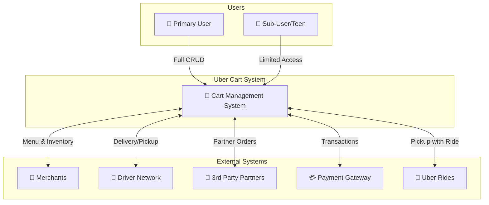
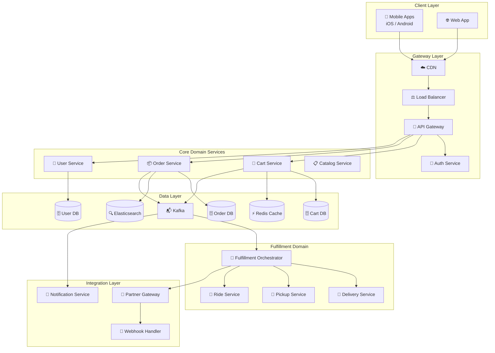
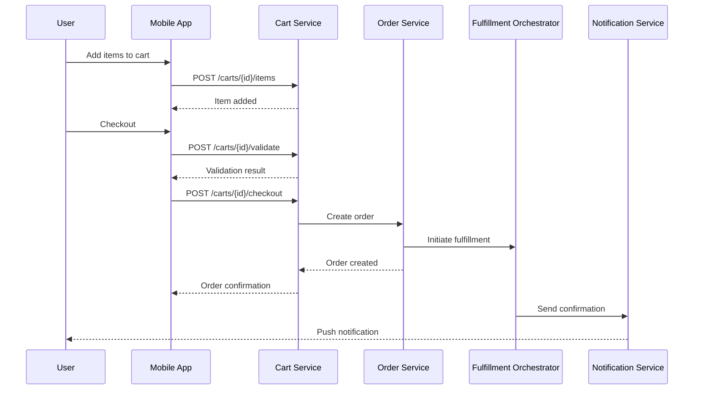
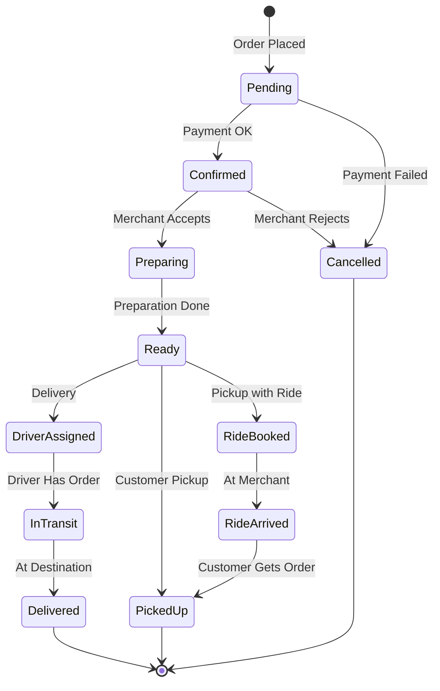
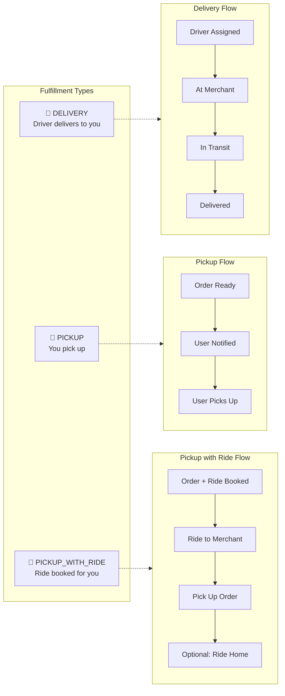
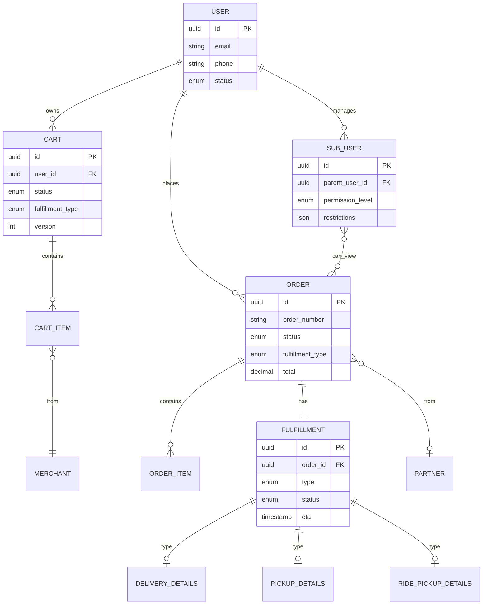
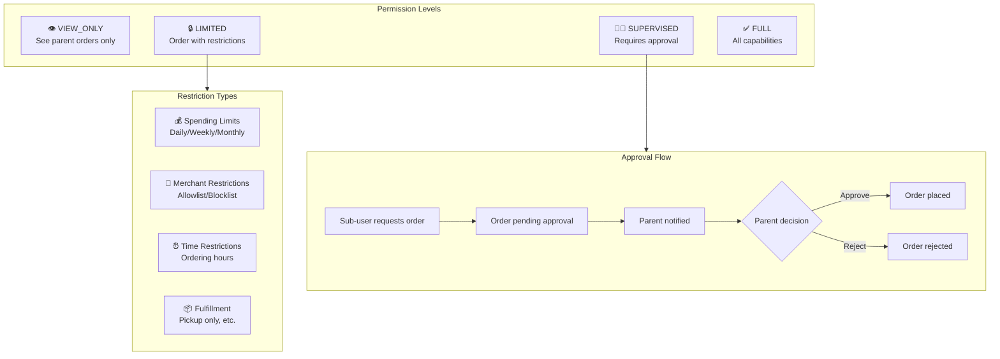
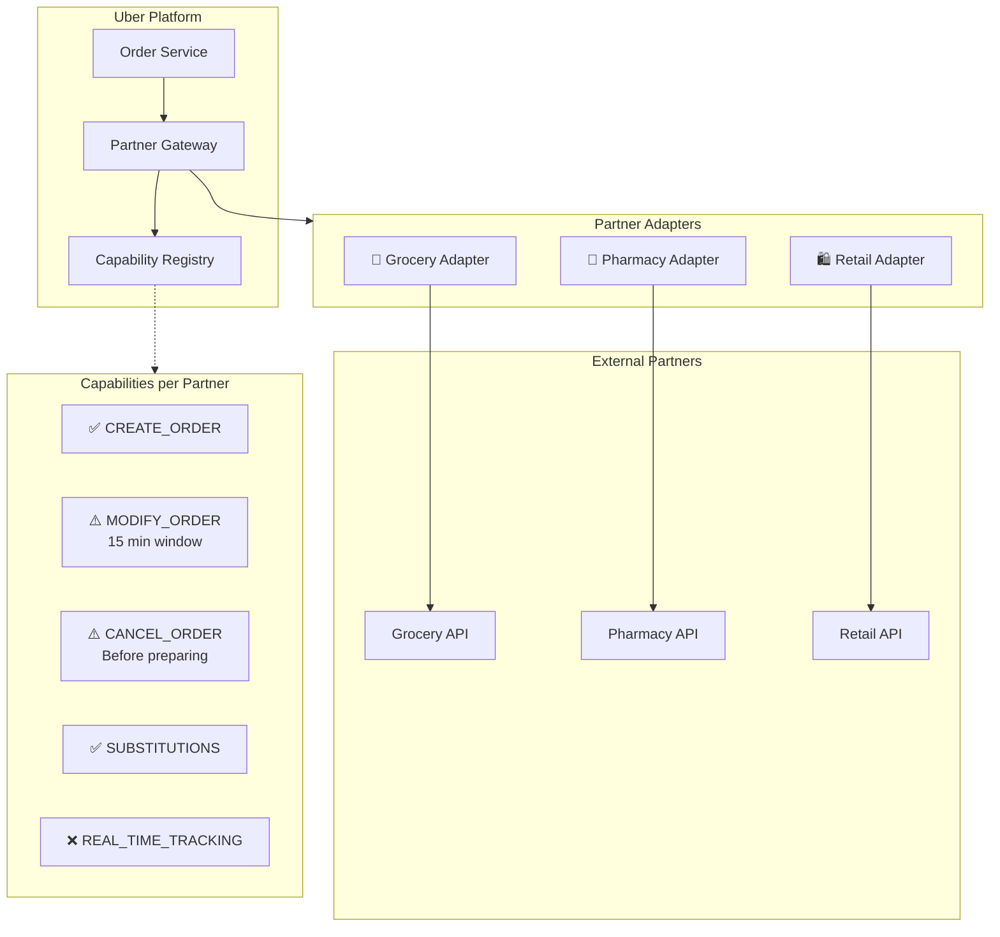
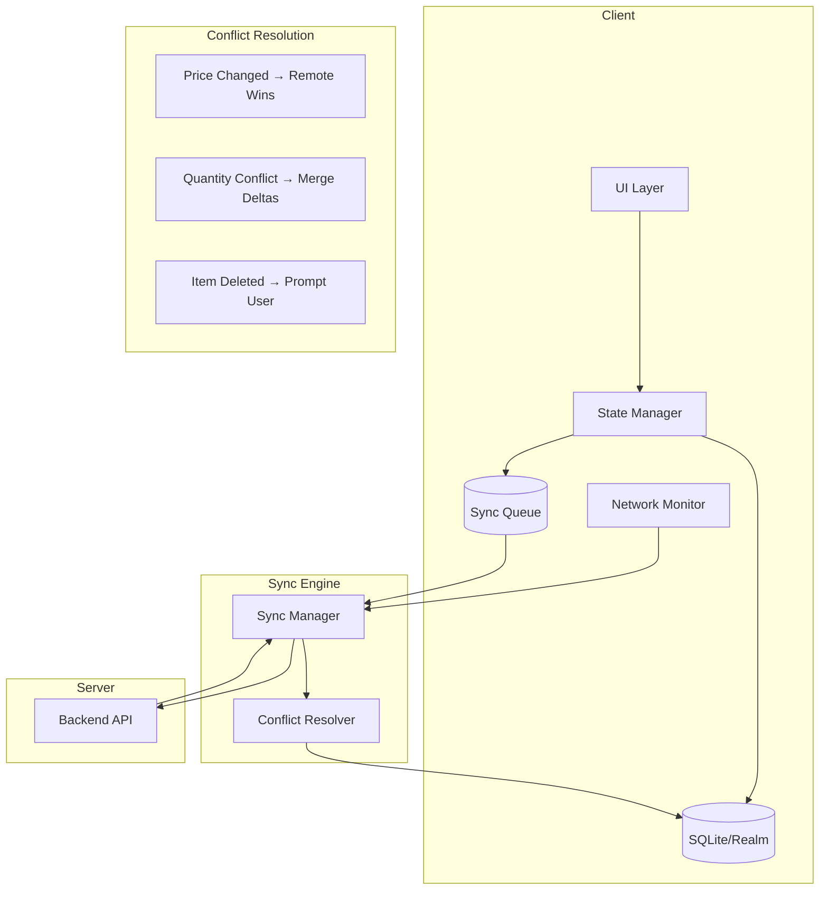

# Uber Cart Management System - Design Overview

## Executive Summary

A comprehensive Cart Management System for Uber's full ecosystem (Eats, Grocery, Rides, Package Delivery) supporting multi-merchant carts, multiple fulfillment types, family accounts with sub-user access, third-party partner integrations, and offline-first behavior.

---

## System Context Diagram



---

## End-to-End Architecture



---

## Core User Flows

### 1. Cart to Order Flow



### 2. Order Lifecycle



---

## Fulfillment Types



---

## Data Model Overview



---

## Sub-User Access Model



---

## Partner Integration Architecture



---

## Offline Architecture



---

## Technology Stack

| Layer | Technology |
|-------|------------|
| **Mobile** | React Native / Swift / Kotlin |
| **Web** | React + Redux Toolkit |
| **API Gateway** | Kong / AWS API Gateway |
| **Backend Services** | Go / Java (Spring Boot) |
| **Databases** | PostgreSQL (sharded) |
| **Cache** | Redis Cluster |
| **Message Queue** | Apache Kafka |
| **Search** | Elasticsearch |
| **Local Storage** | SQLite / Realm |
| **Container Orchestration** | Kubernetes |

---

## Key API Endpoints

| Endpoint | Method | Description |
|----------|--------|-------------|
| `/carts/current` | GET | Get user's active cart |
| `/carts/{id}/items` | POST | Add item to cart |
| `/carts/{id}/checkout` | POST | Checkout cart → create order |
| `/orders` | GET | List user's orders |
| `/orders/{id}` | GET | Get order details |
| `/orders/{id}/cancel` | POST | Cancel order |
| `/orders/family/{subUserId}` | GET | Get sub-user's orders |
| `/approvals/pending` | GET | Get pending approvals (parent) |
| `/webhooks/partners/{id}` | POST | Receive partner webhooks |

---

## Scalability Considerations

```
┌─────────────────────────────────────────────────────────────────┐
│                      SCALING STRATEGY                            │
├─────────────────────────────────────────────────────────────────┤
│                                                                  │
│  Cart Service                Order Service                       │
│  ┌─────────────┐            ┌─────────────┐                     │
│  │ Stateless   │            │ Stateless   │                     │
│  │ Horizontal  │            │ Horizontal  │                     │
│  │ Scale by    │            │ Scale by    │                     │
│  │ active users│            │ order volume│                     │
│  └─────────────┘            └─────────────┘                     │
│                                                                  │
│  Database Sharding                                               │
│  ┌─────────────────────────────────────────────┐                │
│  │ Cart DB: Shard by user_id                   │                │
│  │ Order DB: Shard by region + time partition  │                │
│  └─────────────────────────────────────────────┘                │
│                                                                  │
│  Caching                                                         │
│  ┌─────────────────────────────────────────────┐                │
│  │ Cart: Write-through, 30 min TTL             │                │
│  │ Menu: 5 min TTL, event invalidation         │                │
│  │ User: 1 hour TTL                            │                │
│  └─────────────────────────────────────────────┘                │
│                                                                  │
└─────────────────────────────────────────────────────────────────┘
```

---

## Documentation Index

| Document | Path | Description |
|----------|------|-------------|
| **System Overview** | [architecture/system-overview.md](architecture/system-overview.md) | High-level architecture, service boundaries |
| **Client Architecture** | [architecture/client-architecture.md](architecture/client-architecture.md) | Mobile/web design, state management |
| **Server Architecture** | [architecture/server-architecture.md](architecture/server-architecture.md) | Backend services, databases, events |
| **Data Models** | [data-models/data-model-design.md](data-models/data-model-design.md) | Entity schemas, relationships |
| **API Contracts** | [api-design/api-contracts.md](api-design/api-contracts.md) | REST/GraphQL APIs, SDK |
| **Sub-User Access** | [features/sub-user-access.md](features/sub-user-access.md) | Family accounts, permissions |
| **Partner Integration** | [features/third-party-integration.md](features/third-party-integration.md) | 3rd party adapters |
| **Offline Behavior** | [features/offline-behavior.md](features/offline-behavior.md) | Sync, conflict resolution |

---

## Key Design Decisions

1. **Multi-Merchant Cart**: Single cart with items grouped by merchant, each group becomes a separate order at checkout

2. **Polymorphic Fulfillment**: Base `Fulfillment` entity with type-specific data (Delivery, Pickup, Pickup with Ride)

3. **Event-Driven Architecture**: Kafka for order events enabling loose coupling between services

4. **Capability-Based Partner Integration**: Partners declare capabilities; operations are validated against these at runtime

5. **Offline-First with Optimistic UI**: All cart operations work locally first, sync in background with automatic conflict resolution

6. **Hierarchical Permissions for Sub-Users**: Four permission levels (VIEW_ONLY → LIMITED → SUPERVISED → FULL) with configurable restrictions

