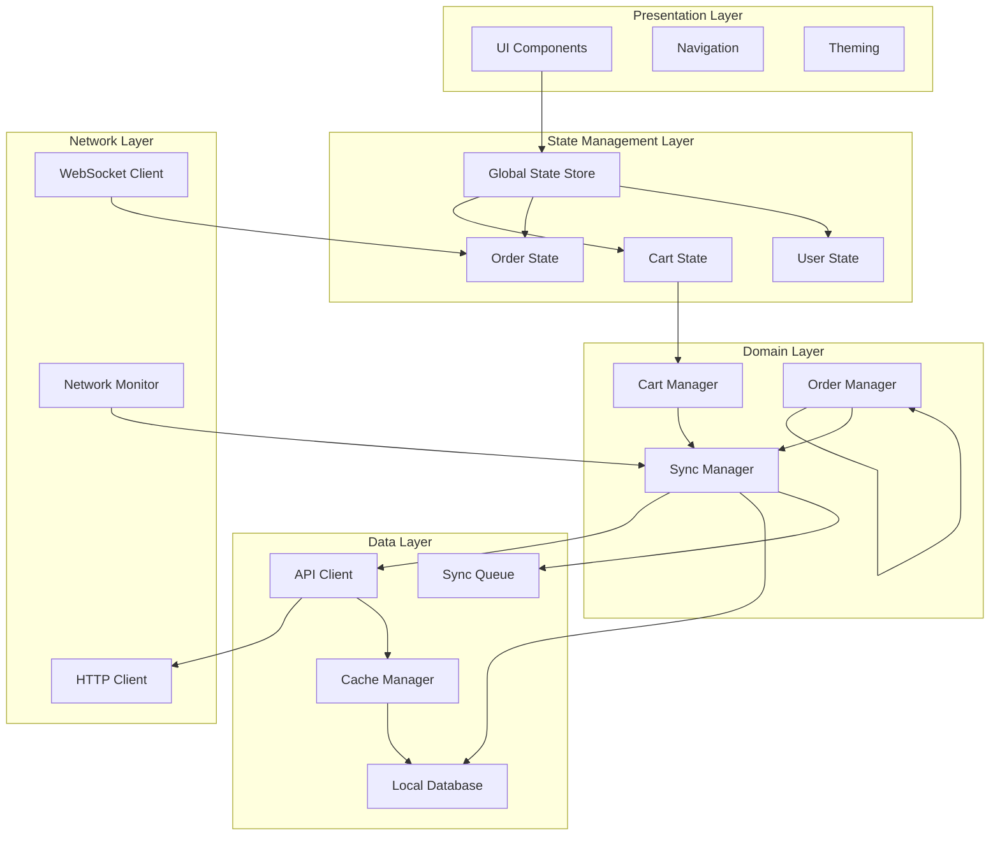
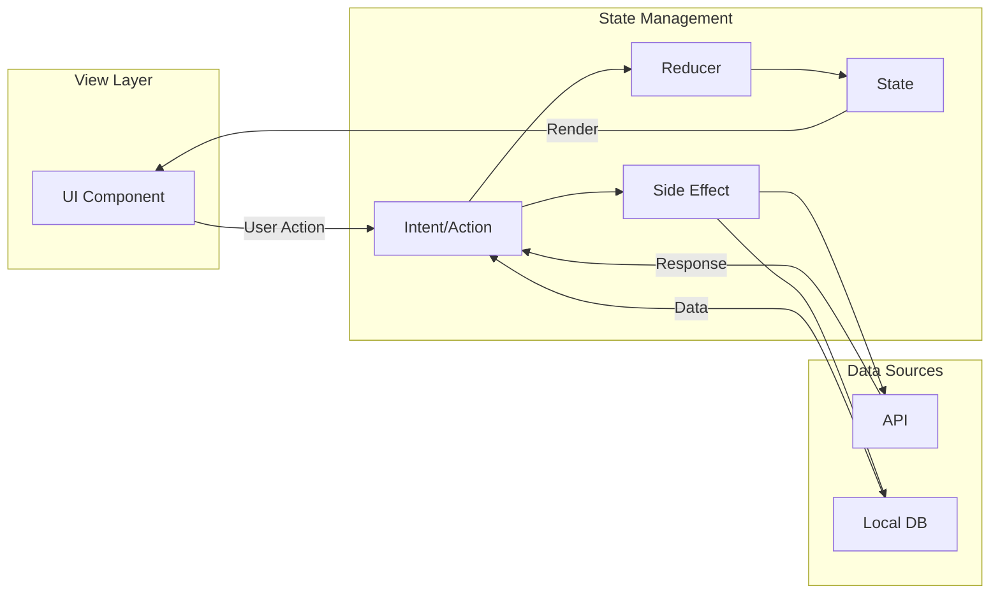
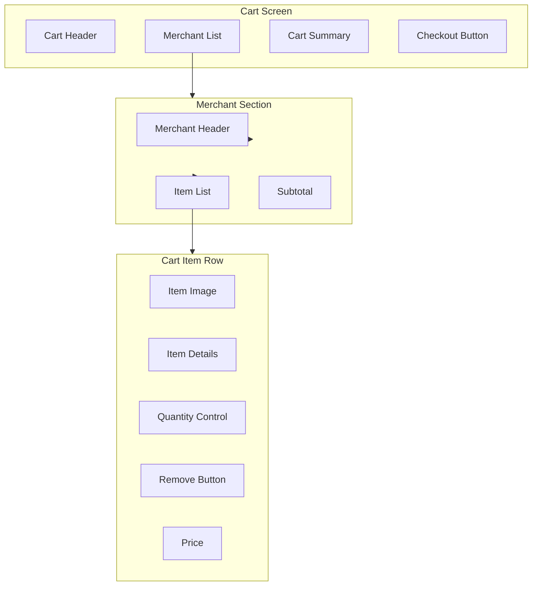
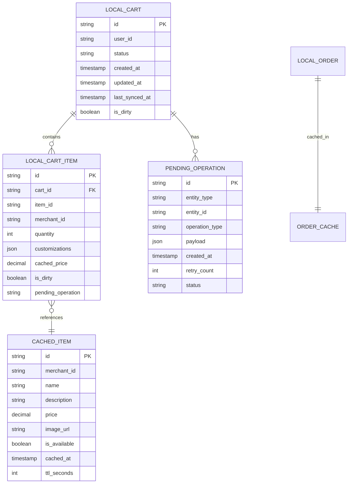
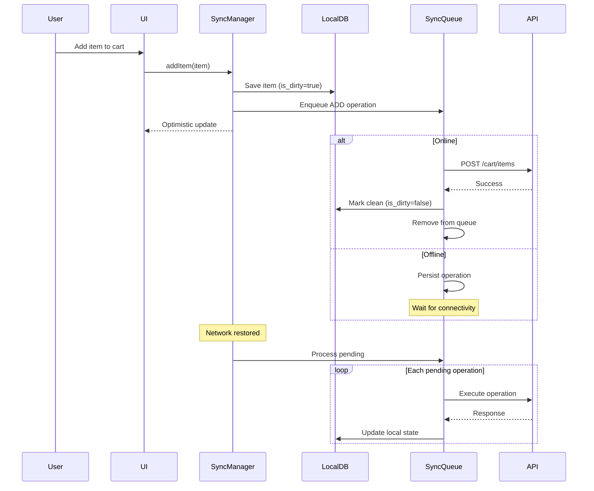

# Uber Cart System - Client Architecture

## Overview

This document details the client-side architecture for the Uber Cart Management System, covering mobile (iOS/Android) and web applications. The architecture emphasizes offline-first design, reactive state management, and seamless synchronization.

## Platform Architecture



## Technology Stack

| Platform | UI Framework | State Management | Local Storage | Networking |
|----------|--------------|------------------|---------------|------------|
| iOS | SwiftUI / UIKit | Combine + TCA | Core Data / Realm | URLSession |
| Android | Jetpack Compose | Kotlin Flow + MVI | Room / Realm | OkHttp + Retrofit |
| Web | React | Redux Toolkit + RTK Query | IndexedDB | Axios + SWR |
| Cross-Platform | React Native | Redux + Redux Saga | Realm / WatermelonDB | Axios |

## State Management Architecture

### Global State Structure

```typescript
interface AppState {
  // Authentication & User
  auth: AuthState;
  user: UserState;

  // Cart Domain
  cart: CartState;

  // Orders Domain
  orders: OrdersState;

  // UI State
  ui: UIState;

  // Sync State
  sync: SyncState;
}

interface CartState {
  activeCart: Cart | null;
  cartItems: Record<string, CartItem>;
  merchantGroups: MerchantGroup[];
  pricing: PricingDetails;
  validation: ValidationState;
  isLoading: boolean;
  error: CartError | null;
  lastSyncedAt: number;
  pendingOperations: CartOperation[];
}

interface OrdersState {
  activeOrders: Order[];
  orderHistory: Order[];
  selectedOrder: Order | null;
  subUserOrders: Record<string, Order[]>; // subUserId -> orders
  isLoading: boolean;
  error: OrderError | null;
}

interface SyncState {
  isOnline: boolean;
  isSyncing: boolean;
  pendingChanges: number;
  lastSyncTimestamp: number;
  syncErrors: SyncError[];
}
```

### State Flow Pattern (MVI/Redux)



## UI Component Architecture

### Cart UI Hierarchy



### Component Specifications

#### CartScreen
```typescript
interface CartScreenProps {
  // Data
  cart: Cart;
  merchantGroups: MerchantGroup[];
  pricing: PricingDetails;

  // Callbacks
  onUpdateQuantity: (itemId: string, quantity: number) => void;
  onRemoveItem: (itemId: string) => void;
  onCheckout: (fulfillmentType: FulfillmentType) => void;
  onClearCart: () => void;

  // State
  isLoading: boolean;
  isSyncing: boolean;
  validationErrors: ValidationError[];
}

interface MerchantGroup {
  merchantId: string;
  merchantName: string;
  merchantLogo: string;
  items: CartItem[];
  subtotal: Money;
  estimatedDeliveryTime: string;
  fulfillmentOptions: FulfillmentType[];
}
```

#### OrderListScreen
```typescript
interface OrderListScreenProps {
  // Data
  activeOrders: Order[];
  pastOrders: Order[];
  subUserOrders?: SubUserOrderGroup[]; // For parent users

  // Callbacks
  onSelectOrder: (orderId: string) => void;
  onReorder: (orderId: string) => void;
  onFilterChange: (filters: OrderFilters) => void;

  // State
  isLoading: boolean;
  selectedTab: 'active' | 'past' | 'family';
}

interface SubUserOrderGroup {
  subUser: SubUser;
  orders: Order[];
  canManage: boolean; // false for read-only access
}
```

#### OrderDetailScreen
```typescript
interface OrderDetailScreenProps {
  order: Order;
  fulfillment: FulfillmentDetails;

  // Actions (conditional based on order state & permissions)
  onCancel?: () => void;
  onModify?: () => void;
  onContactSupport: () => void;
  onTrackDelivery?: () => void;
  onRateOrder?: () => void;

  // For sub-user viewing parent's order
  isReadOnly: boolean;
}
```

## Offline Architecture

### Local Database Schema



### Sync Queue Architecture



### Conflict Resolution Strategy

```typescript
interface ConflictResolver {
  // Resolve cart item conflicts
  resolveCartItemConflict(
    local: CartItem,
    remote: CartItem,
    base: CartItem | null
  ): CartItemResolution;

  // Resolve cart-level conflicts
  resolveCartConflict(
    local: Cart,
    remote: Cart
  ): CartResolution;
}

enum ConflictResolutionStrategy {
  LOCAL_WINS = 'LOCAL_WINS',      // User's local changes take precedence
  REMOTE_WINS = 'REMOTE_WINS',    // Server state takes precedence
  MERGE = 'MERGE',                // Attempt to merge changes
  PROMPT_USER = 'PROMPT_USER'     // Ask user to resolve
}

interface CartItemResolution {
  strategy: ConflictResolutionStrategy;
  resolvedItem: CartItem;
  requiresUserAction: boolean;
  userPrompt?: string;
}

// Resolution Rules
const RESOLUTION_RULES = {
  // Quantity conflicts: sum the deltas
  quantityConflict: (local: number, remote: number, base: number) => {
    const localDelta = local - base;
    const remoteDelta = remote - base;
    return base + localDelta + remoteDelta;
  },

  // Price changed remotely: remote wins (authoritative)
  priceConflict: () => ConflictResolutionStrategy.REMOTE_WINS,

  // Item removed remotely: prompt user
  itemRemoved: () => ConflictResolutionStrategy.PROMPT_USER,

  // Customization conflict: local wins
  customizationConflict: () => ConflictResolutionStrategy.LOCAL_WINS,
};
```

## Real-Time Updates

### WebSocket Integration

```typescript
interface WebSocketManager {
  // Connection management
  connect(): Promise<void>;
  disconnect(): void;

  // Subscriptions
  subscribeToOrder(orderId: string): Observable<OrderUpdate>;
  subscribeToCart(cartId: string): Observable<CartUpdate>;

  // Connection state
  connectionState$: Observable<ConnectionState>;
}

interface OrderUpdate {
  orderId: string;
  updateType: 'STATUS_CHANGE' | 'ETA_UPDATE' | 'DRIVER_LOCATION';
  payload: StatusUpdate | ETAUpdate | LocationUpdate;
  timestamp: number;
}

// WebSocket message types
type WebSocketMessage =
  | { type: 'ORDER_STATUS'; orderId: string; status: OrderStatus; }
  | { type: 'DRIVER_LOCATION'; orderId: string; location: GeoLocation; }
  | { type: 'CART_SYNC'; cartId: string; version: number; }
  | { type: 'PRICE_UPDATE'; itemIds: string[]; }
  | { type: 'AVAILABILITY_UPDATE'; itemId: string; available: boolean; };
```

### Push Notification Handling

```typescript
interface PushNotificationHandler {
  // Order-related notifications
  handleOrderStatusUpdate(notification: OrderNotification): void;
  handleDeliveryArriving(notification: DeliveryNotification): void;

  // Cart-related notifications
  handleCartExpiring(notification: CartNotification): void;
  handlePriceChange(notification: PriceNotification): void;

  // Family/Sub-user notifications
  handleSubUserOrderPlaced(notification: FamilyNotification): void;
}

interface OrderNotification {
  orderId: string;
  newStatus: OrderStatus;
  message: string;
  actionUrl?: string;
  requiresAction: boolean;
}
```

## API Client Architecture

### Request/Response Layer

```typescript
interface APIClient {
  // Cart endpoints
  cart: {
    get(cartId: string): Promise<Cart>;
    create(userId: string): Promise<Cart>;
    addItem(cartId: string, item: CartItemInput): Promise<CartItem>;
    updateItem(cartId: string, itemId: string, update: CartItemUpdate): Promise<CartItem>;
    removeItem(cartId: string, itemId: string): Promise<void>;
    checkout(cartId: string, request: CheckoutRequest): Promise<Order>;
  };

  // Order endpoints
  orders: {
    get(orderId: string): Promise<Order>;
    list(filters?: OrderFilters): Promise<PaginatedOrders>;
    cancel(orderId: string, reason: string): Promise<Order>;
    modify(orderId: string, modification: OrderModification): Promise<Order>;
    getSubUserOrders(subUserId: string): Promise<Order[]>;
  };
}

interface APIConfig {
  baseUrl: string;
  timeout: number;
  retryConfig: RetryConfig;
  cacheConfig: CacheConfig;
}

interface RetryConfig {
  maxRetries: number;
  retryDelay: number;
  retryOn: number[]; // HTTP status codes
  exponentialBackoff: boolean;
}
```

### Caching Strategy

```typescript
interface CacheManager {
  // Cache operations
  get<T>(key: string): Promise<T | null>;
  set<T>(key: string, value: T, ttl: number): Promise<void>;
  invalidate(key: string): Promise<void>;
  invalidatePattern(pattern: string): Promise<void>;

  // Stale-while-revalidate
  getWithRevalidation<T>(
    key: string,
    fetcher: () => Promise<T>,
    options: SWROptions
  ): Promise<T>;
}

const CACHE_TTL = {
  CART: 5 * 60 * 1000,           // 5 minutes
  MENU_ITEMS: 15 * 60 * 1000,    // 15 minutes
  ORDER_ACTIVE: 30 * 1000,       // 30 seconds
  ORDER_HISTORY: 60 * 60 * 1000, // 1 hour
  USER_PREFERENCES: 24 * 60 * 60 * 1000, // 24 hours
};
```

## Error Handling

### Error Types

```typescript
enum ClientErrorType {
  // Network errors
  NETWORK_OFFLINE = 'NETWORK_OFFLINE',
  NETWORK_TIMEOUT = 'NETWORK_TIMEOUT',

  // API errors
  UNAUTHORIZED = 'UNAUTHORIZED',
  FORBIDDEN = 'FORBIDDEN',
  NOT_FOUND = 'NOT_FOUND',
  VALIDATION_ERROR = 'VALIDATION_ERROR',
  SERVER_ERROR = 'SERVER_ERROR',

  // Cart-specific errors
  CART_EXPIRED = 'CART_EXPIRED',
  ITEM_UNAVAILABLE = 'ITEM_UNAVAILABLE',
  PRICE_CHANGED = 'PRICE_CHANGED',
  MERCHANT_CLOSED = 'MERCHANT_CLOSED',

  // Order-specific errors
  ORDER_CANNOT_CANCEL = 'ORDER_CANNOT_CANCEL',
  ORDER_CANNOT_MODIFY = 'ORDER_CANNOT_MODIFY',

  // Sync errors
  SYNC_CONFLICT = 'SYNC_CONFLICT',
  SYNC_FAILED = 'SYNC_FAILED',
}

interface ClientError {
  type: ClientErrorType;
  message: string;
  userMessage: string;
  recoverable: boolean;
  retryable: boolean;
  action?: ErrorAction;
}

interface ErrorAction {
  label: string;
  handler: () => void;
}
```

### Error Recovery UI

```typescript
interface ErrorBoundaryProps {
  fallback: ReactNode;
  onError: (error: Error, errorInfo: ErrorInfo) => void;
  retryAction?: () => void;
}

// Error UI patterns
const ERROR_UI_PATTERNS = {
  [ClientErrorType.NETWORK_OFFLINE]: {
    icon: 'wifi-off',
    title: 'You\'re offline',
    message: 'Your changes are saved locally and will sync when you\'re back online.',
    showRetry: true,
  },
  [ClientErrorType.ITEM_UNAVAILABLE]: {
    icon: 'alert-circle',
    title: 'Item unavailable',
    message: 'This item is no longer available. Would you like to remove it from your cart?',
    actions: ['Remove', 'Find Similar'],
  },
  [ClientErrorType.PRICE_CHANGED]: {
    icon: 'price-tag',
    title: 'Price updated',
    message: 'The price for some items has changed since you added them.',
    showDiff: true,
    actions: ['Accept', 'Remove Items'],
  },
};
```

## Performance Optimization

### List Virtualization

```typescript
// For order history and large cart lists
interface VirtualizedListConfig {
  itemHeight: number | ((index: number) => number);
  overscan: number;
  windowSize: number;
  initialScrollOffset?: number;
}

// Implementation with react-window
const OrderHistoryList: FC<OrderListProps> = ({ orders }) => (
  <FixedSizeList
    height={SCREEN_HEIGHT}
    itemCount={orders.length}
    itemSize={ORDER_ITEM_HEIGHT}
    itemData={orders}
  >
    {OrderRow}
  </FixedSizeList>
);
```

### Image Optimization

```typescript
interface ImageLoaderConfig {
  // Progressive loading
  placeholder: 'blur' | 'shimmer' | 'thumbnail';

  // Responsive sizing
  sizes: {
    thumbnail: { width: 80, height: 80 };
    card: { width: 160, height: 160 };
    detail: { width: 320, height: 320 };
  };

  // Caching
  diskCacheSize: number;
  memoryCacheSize: number;
}
```

### Bundle Optimization

```typescript
// Code splitting by route
const CartScreen = lazy(() => import('./screens/CartScreen'));
const OrdersScreen = lazy(() => import('./screens/OrdersScreen'));
const CheckoutScreen = lazy(() => import('./screens/CheckoutScreen'));

// Feature flags for gradual rollout
interface FeatureFlags {
  enableOfflineMode: boolean;
  enableSubUserAccess: boolean;
  enableThirdPartyOrders: boolean;
  enablePickupWithRide: boolean;
}
```

## Accessibility

### Accessibility Requirements

```typescript
interface AccessibilityProps {
  // Screen reader support
  accessibilityLabel: string;
  accessibilityHint?: string;
  accessibilityRole: AccessibilityRole;

  // Focus management
  accessible: boolean;
  focusable: boolean;

  // Actions
  accessibilityActions?: AccessibilityAction[];
  onAccessibilityAction?: (action: AccessibilityAction) => void;
}

// Example: Cart item accessibility
const CartItemAccessibility = {
  accessibilityLabel: (item: CartItem) =>
    `${item.name}, quantity ${item.quantity}, price ${formatPrice(item.price)}`,
  accessibilityHint: 'Double tap to view item details. Swipe up or down for quantity controls.',
  accessibilityActions: [
    { name: 'increment', label: 'Add one' },
    { name: 'decrement', label: 'Remove one' },
    { name: 'delete', label: 'Remove from cart' },
  ],
};
```

## Testing Strategy

### Test Pyramid

| Level | Focus | Tools |
|-------|-------|-------|
| Unit | State reducers, utilities | Jest |
| Integration | Component + State | React Testing Library |
| E2E | Critical flows | Detox (Mobile), Cypress (Web) |
| Visual | UI regression | Percy, Chromatic |

### Critical Test Scenarios

```typescript
describe('Cart Operations', () => {
  it('should add item to cart optimistically');
  it('should handle offline add and sync when online');
  it('should resolve quantity conflicts correctly');
  it('should update UI when price changes remotely');
  it('should prevent checkout with unavailable items');
});

describe('Order Management', () => {
  it('should display active orders with live updates');
  it('should show sub-user orders in read-only mode');
  it('should enable cancel only for eligible orders');
  it('should handle order modification workflow');
});

describe('Offline Behavior', () => {
  it('should queue operations when offline');
  it('should sync pending operations on reconnect');
  it('should handle sync conflicts gracefully');
  it('should show appropriate offline indicators');
});
```

