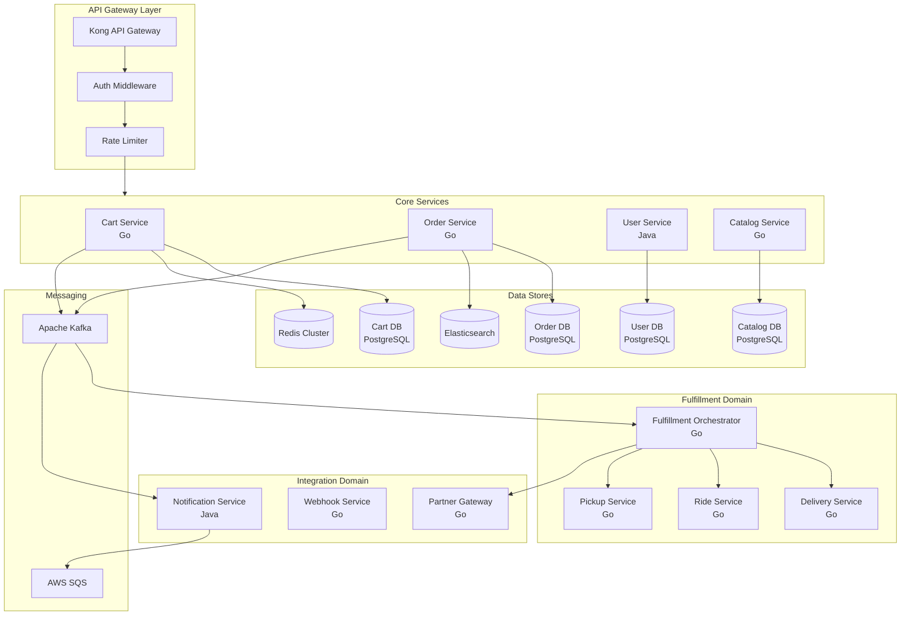
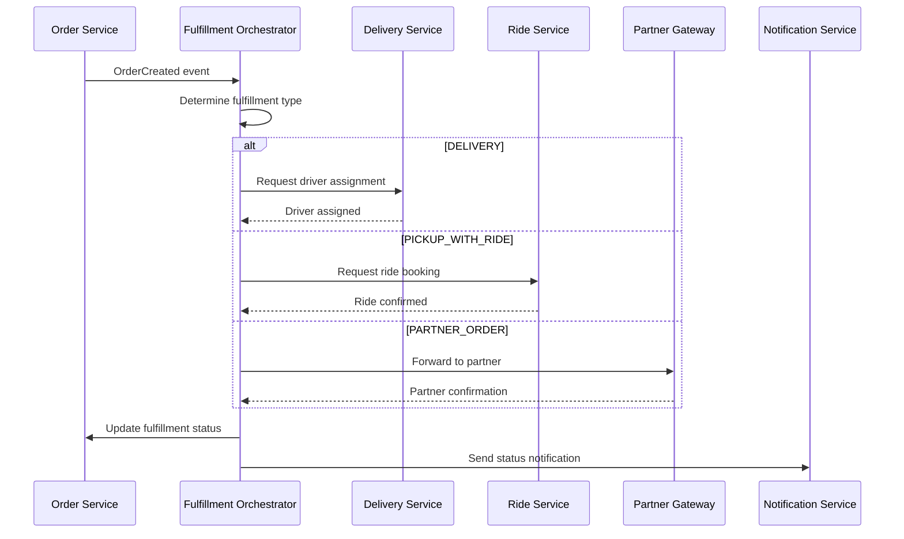
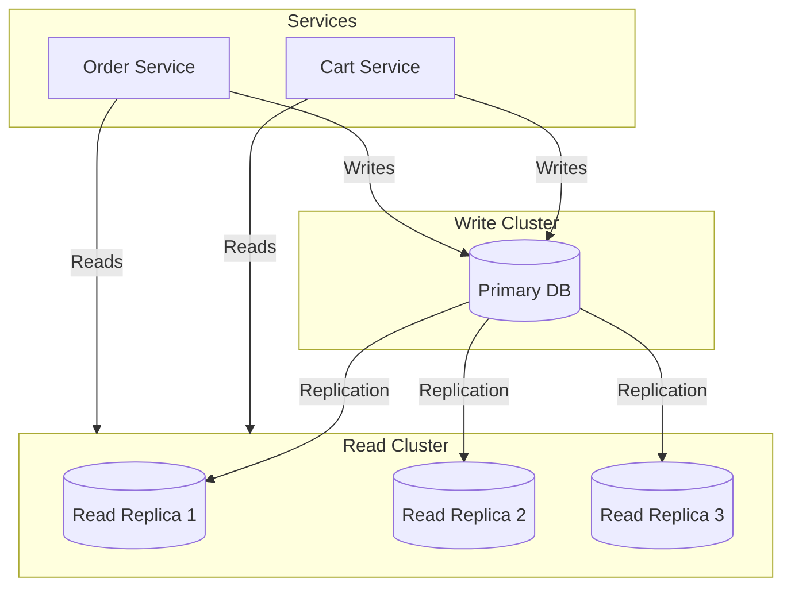

# Uber Cart System - Server Architecture

## Overview

This document details the backend architecture for the Uber Cart Management System, covering microservices design, database schemas, caching strategies, and event-driven patterns for scalable order processing.

## Technology Stack

| Component | Technology | Purpose |
|-----------|------------|---------|
| API Gateway | Kong / AWS API Gateway | Routing, auth, rate limiting |
| Services | Go / Java (Spring Boot) | Core business logic |
| Communication | gRPC (internal), REST (external) | Service-to-service, client APIs |
| Database | PostgreSQL | Primary data store |
| Cache | Redis Cluster | Session, cart caching |
| Message Queue | Apache Kafka | Event streaming |
| Task Queue | AWS SQS / RabbitMQ | Async job processing |
| Search | Elasticsearch | Order search, analytics |
| Service Mesh | Istio / Linkerd | Traffic management, observability |

## Service Architecture



## Cart Service

### Responsibilities
- Cart lifecycle management (create, update, delete)
- Cart item operations (add, update, remove)
- Multi-merchant cart handling
- Real-time price calculation
- Cart validation before checkout
- Cart expiration and cleanup

### API Endpoints

```go
// Cart Service API Routes
type CartAPI interface {
    // Cart operations
    CreateCart(ctx context.Context, req *CreateCartRequest) (*Cart, error)
    GetCart(ctx context.Context, cartID string) (*Cart, error)
    DeleteCart(ctx context.Context, cartID string) error

    // Cart item operations
    AddItem(ctx context.Context, cartID string, item *CartItemInput) (*CartItem, error)
    UpdateItem(ctx context.Context, cartID, itemID string, update *CartItemUpdate) (*CartItem, error)
    RemoveItem(ctx context.Context, cartID, itemID string) error

    // Checkout
    ValidateCart(ctx context.Context, cartID string) (*ValidationResult, error)
    Checkout(ctx context.Context, cartID string, req *CheckoutRequest) (*Order, error)
}

// Request/Response types
type CreateCartRequest struct {
    UserID       string `json:"user_id"`
    SessionID    string `json:"session_id,omitempty"`
    FulfillmentType string `json:"fulfillment_type,omitempty"`
}

type CartItemInput struct {
    ItemID         string                 `json:"item_id"`
    MerchantID     string                 `json:"merchant_id"`
    Quantity       int                    `json:"quantity"`
    Customizations map[string]interface{} `json:"customizations,omitempty"`
    SpecialNotes   string                 `json:"special_notes,omitempty"`
}

type CartItemUpdate struct {
    Quantity       *int                   `json:"quantity,omitempty"`
    Customizations map[string]interface{} `json:"customizations,omitempty"`
    SpecialNotes   *string                `json:"special_notes,omitempty"`
}
```

### Database Schema

```sql
-- Cart table
CREATE TABLE carts (
    id UUID PRIMARY KEY DEFAULT gen_random_uuid(),
    user_id UUID NOT NULL REFERENCES users(id),
    session_id VARCHAR(255),
    status VARCHAR(50) NOT NULL DEFAULT 'ACTIVE',
    fulfillment_type VARCHAR(50),
    delivery_address_id UUID REFERENCES addresses(id),
    created_at TIMESTAMP WITH TIME ZONE DEFAULT NOW(),
    updated_at TIMESTAMP WITH TIME ZONE DEFAULT NOW(),
    expires_at TIMESTAMP WITH TIME ZONE,
    version INTEGER DEFAULT 1,

    CONSTRAINT cart_status_check CHECK (status IN ('ACTIVE', 'LOCKED', 'CHECKED_OUT', 'EXPIRED', 'ABANDONED'))
);

CREATE INDEX idx_carts_user_id ON carts(user_id);
CREATE INDEX idx_carts_status ON carts(status);
CREATE INDEX idx_carts_expires_at ON carts(expires_at) WHERE status = 'ACTIVE';

-- Cart items table
CREATE TABLE cart_items (
    id UUID PRIMARY KEY DEFAULT gen_random_uuid(),
    cart_id UUID NOT NULL REFERENCES carts(id) ON DELETE CASCADE,
    item_id UUID NOT NULL,
    merchant_id UUID NOT NULL,
    quantity INTEGER NOT NULL CHECK (quantity > 0),
    unit_price DECIMAL(10, 2) NOT NULL,
    customizations JSONB DEFAULT '{}',
    special_notes TEXT,
    created_at TIMESTAMP WITH TIME ZONE DEFAULT NOW(),
    updated_at TIMESTAMP WITH TIME ZONE DEFAULT NOW(),

    CONSTRAINT unique_cart_item UNIQUE (cart_id, item_id, customizations)
);

CREATE INDEX idx_cart_items_cart_id ON cart_items(cart_id);
CREATE INDEX idx_cart_items_merchant_id ON cart_items(merchant_id);

-- Cart pricing table (denormalized for performance)
CREATE TABLE cart_pricing (
    cart_id UUID PRIMARY KEY REFERENCES carts(id) ON DELETE CASCADE,
    subtotal DECIMAL(10, 2) NOT NULL DEFAULT 0,
    delivery_fee DECIMAL(10, 2) DEFAULT 0,
    service_fee DECIMAL(10, 2) DEFAULT 0,
    tax DECIMAL(10, 2) DEFAULT 0,
    discount DECIMAL(10, 2) DEFAULT 0,
    total DECIMAL(10, 2) NOT NULL DEFAULT 0,
    currency VARCHAR(3) NOT NULL DEFAULT 'USD',
    updated_at TIMESTAMP WITH TIME ZONE DEFAULT NOW()
);
```

### Caching Strategy

```go
// Cart caching with Redis
type CartCache interface {
    GetCart(ctx context.Context, cartID string) (*Cart, error)
    SetCart(ctx context.Context, cart *Cart, ttl time.Duration) error
    InvalidateCart(ctx context.Context, cartID string) error

    // Distributed locking for concurrent updates
    AcquireLock(ctx context.Context, cartID string, ttl time.Duration) (Lock, error)
}

// Cache key patterns
const (
    CartKeyPattern     = "cart:{cart_id}"           // Full cart data
    CartItemsPattern   = "cart:{cart_id}:items"     // Cart items list
    CartPricingPattern = "cart:{cart_id}:pricing"   // Pricing details
    UserCartPattern    = "user:{user_id}:cart"      // User's active cart ID
)

// Cache TTLs
const (
    CartCacheTTL     = 30 * time.Minute
    CartItemsTTL     = 30 * time.Minute
    PricingCacheTTL  = 5 * time.Minute  // Shorter for price accuracy
)

// Write-through caching
func (s *CartService) AddItem(ctx context.Context, cartID string, item *CartItemInput) (*CartItem, error) {
    // 1. Acquire distributed lock
    lock, err := s.cache.AcquireLock(ctx, cartID, 5*time.Second)
    if err != nil {
        return nil, ErrConcurrentModification
    }
    defer lock.Release(ctx)

    // 2. Write to database
    cartItem, err := s.repo.AddItem(ctx, cartID, item)
    if err != nil {
        return nil, err
    }

    // 3. Update cache
    if err := s.cache.InvalidateCart(ctx, cartID); err != nil {
        // Log but don't fail - cache will be refreshed on next read
        log.Warn("Failed to invalidate cart cache", "cartID", cartID, "error", err)
    }

    // 4. Publish event
    s.events.Publish(ctx, &CartItemAddedEvent{
        CartID: cartID,
        Item:   cartItem,
    })

    return cartItem, nil
}
```

## Order Service

### Responsibilities
- Order creation from cart checkout
- Order lifecycle management
- Order status tracking
- Order modification handling
- Order history and search
- Sub-user order access control

### API Endpoints

```go
type OrderAPI interface {
    // Order queries
    GetOrder(ctx context.Context, orderID string) (*Order, error)
    GetOrders(ctx context.Context, userID string, filters *OrderFilters) (*OrderList, error)
    GetSubUserOrders(ctx context.Context, parentUserID, subUserID string) (*OrderList, error)
    SearchOrders(ctx context.Context, query *OrderSearchQuery) (*OrderSearchResult, error)

    // Order mutations
    CancelOrder(ctx context.Context, orderID string, reason string) (*Order, error)
    ModifyOrder(ctx context.Context, orderID string, modification *OrderModification) (*Order, error)

    // Internal (from Cart Service)
    CreateOrder(ctx context.Context, req *CreateOrderRequest) (*Order, error)
}

type OrderFilters struct {
    Status       []OrderStatus `json:"status,omitempty"`
    FulfillmentType string     `json:"fulfillment_type,omitempty"`
    MerchantID   string        `json:"merchant_id,omitempty"`
    DateFrom     *time.Time    `json:"date_from,omitempty"`
    DateTo       *time.Time    `json:"date_to,omitempty"`
    Limit        int           `json:"limit,omitempty"`
    Offset       int           `json:"offset,omitempty"`
}

type OrderModification struct {
    ItemsToAdd     []OrderItemInput `json:"items_to_add,omitempty"`
    ItemsToRemove  []string         `json:"items_to_remove,omitempty"`
    ItemsToUpdate  []OrderItemUpdate `json:"items_to_update,omitempty"`
    DeliveryAddress *Address        `json:"delivery_address,omitempty"`
    SpecialNotes   *string          `json:"special_notes,omitempty"`
}
```

### Database Schema

```sql
-- Orders table
CREATE TABLE orders (
    id UUID PRIMARY KEY DEFAULT gen_random_uuid(),
    user_id UUID NOT NULL REFERENCES users(id),
    cart_id UUID REFERENCES carts(id),
    order_number VARCHAR(50) UNIQUE NOT NULL,
    status VARCHAR(50) NOT NULL DEFAULT 'PENDING',
    fulfillment_type VARCHAR(50) NOT NULL,

    -- Pricing snapshot
    subtotal DECIMAL(10, 2) NOT NULL,
    delivery_fee DECIMAL(10, 2) DEFAULT 0,
    service_fee DECIMAL(10, 2) DEFAULT 0,
    tax DECIMAL(10, 2) DEFAULT 0,
    discount DECIMAL(10, 2) DEFAULT 0,
    tip DECIMAL(10, 2) DEFAULT 0,
    total DECIMAL(10, 2) NOT NULL,
    currency VARCHAR(3) NOT NULL DEFAULT 'USD',

    -- Fulfillment details
    delivery_address JSONB,
    pickup_location JSONB,
    scheduled_time TIMESTAMP WITH TIME ZONE,
    estimated_delivery_time TIMESTAMP WITH TIME ZONE,

    -- Metadata
    special_notes TEXT,
    metadata JSONB DEFAULT '{}',
    created_at TIMESTAMP WITH TIME ZONE DEFAULT NOW(),
    updated_at TIMESTAMP WITH TIME ZONE DEFAULT NOW(),
    completed_at TIMESTAMP WITH TIME ZONE,

    -- For 3rd party orders
    partner_id UUID REFERENCES partners(id),
    external_order_id VARCHAR(255),

    CONSTRAINT order_status_check CHECK (status IN (
        'PENDING', 'CONFIRMED', 'PREPARING', 'READY_FOR_PICKUP',
        'IN_TRANSIT', 'DELIVERED', 'PICKED_UP', 'CANCELLED', 'REFUNDED'
    )),
    CONSTRAINT fulfillment_type_check CHECK (fulfillment_type IN (
        'DELIVERY', 'PICKUP', 'PICKUP_WITH_RIDE'
    ))
);

CREATE INDEX idx_orders_user_id ON orders(user_id);
CREATE INDEX idx_orders_status ON orders(status);
CREATE INDEX idx_orders_created_at ON orders(created_at DESC);
CREATE INDEX idx_orders_partner_id ON orders(partner_id) WHERE partner_id IS NOT NULL;

-- Order items table
CREATE TABLE order_items (
    id UUID PRIMARY KEY DEFAULT gen_random_uuid(),
    order_id UUID NOT NULL REFERENCES orders(id) ON DELETE CASCADE,
    item_id UUID NOT NULL,
    merchant_id UUID NOT NULL,
    name VARCHAR(255) NOT NULL,
    description TEXT,
    quantity INTEGER NOT NULL CHECK (quantity > 0),
    unit_price DECIMAL(10, 2) NOT NULL,
    total_price DECIMAL(10, 2) NOT NULL,
    customizations JSONB DEFAULT '{}',
    special_notes TEXT,
    status VARCHAR(50) DEFAULT 'PENDING',
    created_at TIMESTAMP WITH TIME ZONE DEFAULT NOW()
);

CREATE INDEX idx_order_items_order_id ON order_items(order_id);
CREATE INDEX idx_order_items_merchant_id ON order_items(merchant_id);

-- Order status history
CREATE TABLE order_status_history (
    id UUID PRIMARY KEY DEFAULT gen_random_uuid(),
    order_id UUID NOT NULL REFERENCES orders(id) ON DELETE CASCADE,
    status VARCHAR(50) NOT NULL,
    previous_status VARCHAR(50),
    changed_by VARCHAR(100), -- user, system, merchant, driver
    reason TEXT,
    metadata JSONB DEFAULT '{}',
    created_at TIMESTAMP WITH TIME ZONE DEFAULT NOW()
);

CREATE INDEX idx_order_status_history_order_id ON order_status_history(order_id);

-- Sub-user order access
CREATE TABLE sub_user_order_access (
    sub_user_id UUID NOT NULL REFERENCES sub_users(id),
    order_id UUID NOT NULL REFERENCES orders(id),
    access_level VARCHAR(50) NOT NULL DEFAULT 'READ_ONLY',
    granted_by UUID NOT NULL REFERENCES users(id),
    granted_at TIMESTAMP WITH TIME ZONE DEFAULT NOW(),

    PRIMARY KEY (sub_user_id, order_id),
    CONSTRAINT access_level_check CHECK (access_level IN ('READ_ONLY', 'LIMITED', 'FULL'))
);
```

### Order State Machine

```go
// Order state machine
type OrderStateMachine struct {
    transitions map[OrderStatus][]OrderStatus
}

func NewOrderStateMachine() *OrderStateMachine {
    return &OrderStateMachine{
        transitions: map[OrderStatus][]OrderStatus{
            StatusPending: {StatusConfirmed, StatusCancelled},
            StatusConfirmed: {StatusPreparing, StatusCancelled},
            StatusPreparing: {StatusReadyForPickup, StatusCancelled},
            StatusReadyForPickup: {StatusInTransit, StatusPickedUp},
            StatusInTransit: {StatusDelivered},
            StatusPickedUp: {},  // Terminal state
            StatusDelivered: {}, // Terminal state
            StatusCancelled: {StatusRefunded},
            StatusRefunded: {},  // Terminal state
        },
    }
}

func (sm *OrderStateMachine) CanTransition(from, to OrderStatus) bool {
    allowedTransitions, exists := sm.transitions[from]
    if !exists {
        return false
    }
    for _, allowed := range allowedTransitions {
        if allowed == to {
            return true
        }
    }
    return false
}

func (sm *OrderStateMachine) ValidateTransition(order *Order, newStatus OrderStatus) error {
    if !sm.CanTransition(order.Status, newStatus) {
        return &InvalidTransitionError{
            From: order.Status,
            To:   newStatus,
        }
    }
    return nil
}
```

## Fulfillment Service

### Orchestrator Pattern



### Fulfillment Database Schema

```sql
-- Fulfillment records
CREATE TABLE fulfillments (
    id UUID PRIMARY KEY DEFAULT gen_random_uuid(),
    order_id UUID NOT NULL REFERENCES orders(id),
    type VARCHAR(50) NOT NULL,
    status VARCHAR(50) NOT NULL DEFAULT 'PENDING',

    -- Common fields
    estimated_time TIMESTAMP WITH TIME ZONE,
    actual_time TIMESTAMP WITH TIME ZONE,

    -- Type-specific data stored as JSONB
    delivery_data JSONB,  -- driver_id, vehicle, tracking
    pickup_data JSONB,    -- location, code, instructions
    ride_data JSONB,      -- ride_id, driver, vehicle, tracking

    created_at TIMESTAMP WITH TIME ZONE DEFAULT NOW(),
    updated_at TIMESTAMP WITH TIME ZONE DEFAULT NOW(),

    CONSTRAINT fulfillment_type_check CHECK (type IN ('DELIVERY', 'PICKUP', 'PICKUP_WITH_RIDE'))
);

CREATE INDEX idx_fulfillments_order_id ON fulfillments(order_id);
CREATE INDEX idx_fulfillments_status ON fulfillments(status);

-- Delivery-specific table
CREATE TABLE delivery_fulfillments (
    fulfillment_id UUID PRIMARY KEY REFERENCES fulfillments(id),
    driver_id UUID,
    vehicle_type VARCHAR(50),
    pickup_location JSONB NOT NULL,
    dropoff_location JSONB NOT NULL,
    route_polyline TEXT,
    distance_meters INTEGER,
    estimated_duration_seconds INTEGER,
    tracking_url TEXT,
    driver_location JSONB,
    created_at TIMESTAMP WITH TIME ZONE DEFAULT NOW()
);

-- Pickup with ride table
CREATE TABLE ride_fulfillments (
    fulfillment_id UUID PRIMARY KEY REFERENCES fulfillments(id),
    ride_id UUID, -- Reference to Uber Rides
    pickup_location JSONB NOT NULL,
    merchant_location JSONB NOT NULL,
    ride_status VARCHAR(50),
    estimated_arrival TIMESTAMP WITH TIME ZONE,
    tracking_url TEXT,
    created_at TIMESTAMP WITH TIME ZONE DEFAULT NOW()
);
```

## Event-Driven Architecture

### Event Definitions

```go
// Base event structure
type Event struct {
    ID        string                 `json:"id"`
    Type      string                 `json:"type"`
    Source    string                 `json:"source"`
    Timestamp time.Time              `json:"timestamp"`
    Data      map[string]interface{} `json:"data"`
    Metadata  EventMetadata          `json:"metadata"`
}

type EventMetadata struct {
    CorrelationID string `json:"correlation_id"`
    CausationID   string `json:"causation_id,omitempty"`
    UserID        string `json:"user_id,omitempty"`
    Version       int    `json:"version"`
}

// Cart events
type CartCreatedEvent struct {
    CartID string `json:"cart_id"`
    UserID string `json:"user_id"`
}

type CartItemAddedEvent struct {
    CartID     string    `json:"cart_id"`
    ItemID     string    `json:"item_id"`
    MerchantID string    `json:"merchant_id"`
    Quantity   int       `json:"quantity"`
    Price      float64   `json:"price"`
}

type CartCheckedOutEvent struct {
    CartID  string `json:"cart_id"`
    OrderID string `json:"order_id"`
}

// Order events
type OrderCreatedEvent struct {
    OrderID         string  `json:"order_id"`
    UserID          string  `json:"user_id"`
    FulfillmentType string  `json:"fulfillment_type"`
    Total           float64 `json:"total"`
}

type OrderStatusChangedEvent struct {
    OrderID        string `json:"order_id"`
    PreviousStatus string `json:"previous_status"`
    NewStatus      string `json:"new_status"`
    ChangedBy      string `json:"changed_by"`
    Reason         string `json:"reason,omitempty"`
}

type OrderCancelledEvent struct {
    OrderID   string `json:"order_id"`
    Reason    string `json:"reason"`
    RefundID  string `json:"refund_id,omitempty"`
}
```

### Kafka Topic Structure

```yaml
# Kafka topics configuration
topics:
  - name: cart-events
    partitions: 12
    replication: 3
    retention: 7d
    key: cart_id

  - name: order-events
    partitions: 24
    replication: 3
    retention: 30d
    key: order_id

  - name: fulfillment-events
    partitions: 12
    replication: 3
    retention: 7d
    key: order_id

  - name: notification-events
    partitions: 6
    replication: 3
    retention: 1d
    key: user_id
```

### Event Consumers

```go
// Event consumer interface
type EventConsumer interface {
    Subscribe(topics []string) error
    Consume(ctx context.Context, handler EventHandler) error
    Close() error
}

// Event handler
type EventHandler func(ctx context.Context, event *Event) error

// Order event consumer
type OrderEventConsumer struct {
    consumer     EventConsumer
    fulfillment  FulfillmentService
    notification NotificationService
}

func (c *OrderEventConsumer) HandleOrderCreated(ctx context.Context, event *Event) error {
    orderEvent := &OrderCreatedEvent{}
    if err := mapstructure.Decode(event.Data, orderEvent); err != nil {
        return err
    }

    // Initiate fulfillment
    if err := c.fulfillment.InitiateFulfillment(ctx, orderEvent.OrderID); err != nil {
        return err
    }

    // Send confirmation notification
    return c.notification.SendOrderConfirmation(ctx, orderEvent.OrderID)
}
```

## API Gateway Configuration

### Route Configuration

```yaml
# Kong API Gateway configuration
services:
  - name: cart-service
    url: http://cart-service:8080
    routes:
      - name: cart-routes
        paths:
          - /api/v1/carts
        methods:
          - GET
          - POST
          - PUT
          - DELETE
        plugins:
          - name: jwt
          - name: rate-limiting
            config:
              minute: 100
              policy: redis
          - name: request-transformer
            config:
              add:
                headers:
                  - X-Request-ID:$(uuid)

  - name: order-service
    url: http://order-service:8080
    routes:
      - name: order-routes
        paths:
          - /api/v1/orders
        methods:
          - GET
          - POST
          - PUT
          - DELETE
        plugins:
          - name: jwt
          - name: rate-limiting
            config:
              minute: 60
              policy: redis
```

### Rate Limiting Strategy

```yaml
rate_limits:
  # Per-user limits
  user:
    cart_read: 100/min
    cart_write: 30/min
    order_read: 60/min
    order_write: 10/min
    checkout: 5/min

  # Per-IP limits (unauthenticated)
  anonymous:
    global: 20/min

  # Service-to-service limits
  internal:
    default: 10000/min
```

## Database Architecture

### Read Replicas



### Sharding Strategy

```go
// Sharding configuration
type ShardConfig struct {
    // Cart DB: Shard by user_id
    CartShardKey   func(userID string) int

    // Order DB: Shard by region + date
    OrderShardKey  func(region string, date time.Time) int
}

// Consistent hashing for cart sharding
func (c *ShardConfig) GetCartShard(userID string) int {
    hash := fnv.New32a()
    hash.Write([]byte(userID))
    return int(hash.Sum32() % uint32(c.NumShards))
}

// Region-based sharding for orders
func (c *ShardConfig) GetOrderShard(region string, date time.Time) int {
    // Shard by region first, then by quarter
    regionHash := hash(region) % 4
    quarter := (date.Month()-1) / 3
    return regionHash*4 + int(quarter)
}
```

## Monitoring & Observability

### Metrics

```go
// Prometheus metrics
var (
    cartOperationsTotal = prometheus.NewCounterVec(
        prometheus.CounterOpts{
            Name: "cart_operations_total",
            Help: "Total number of cart operations",
        },
        []string{"operation", "status"},
    )

    cartOperationDuration = prometheus.NewHistogramVec(
        prometheus.HistogramOpts{
            Name:    "cart_operation_duration_seconds",
            Help:    "Duration of cart operations",
            Buckets: prometheus.ExponentialBuckets(0.001, 2, 10),
        },
        []string{"operation"},
    )

    orderStatusGauge = prometheus.NewGaugeVec(
        prometheus.GaugeOpts{
            Name: "orders_by_status",
            Help: "Number of orders by status",
        },
        []string{"status", "fulfillment_type"},
    )
)
```

### Health Checks

```go
type HealthChecker interface {
    Check(ctx context.Context) *HealthStatus
}

type HealthStatus struct {
    Status     string                    `json:"status"` // healthy, degraded, unhealthy
    Components map[string]ComponentHealth `json:"components"`
    Timestamp  time.Time                 `json:"timestamp"`
}

type ComponentHealth struct {
    Status  string        `json:"status"`
    Latency time.Duration `json:"latency"`
    Message string        `json:"message,omitempty"`
}

// Health check endpoint
func (s *CartService) HealthCheck(ctx context.Context) *HealthStatus {
    status := &HealthStatus{
        Status:     "healthy",
        Components: make(map[string]ComponentHealth),
        Timestamp:  time.Now(),
    }

    // Check database
    dbHealth := s.checkDatabase(ctx)
    status.Components["database"] = dbHealth

    // Check cache
    cacheHealth := s.checkCache(ctx)
    status.Components["cache"] = cacheHealth

    // Check Kafka
    kafkaHealth := s.checkKafka(ctx)
    status.Components["kafka"] = kafkaHealth

    // Determine overall status
    for _, comp := range status.Components {
        if comp.Status == "unhealthy" {
            status.Status = "unhealthy"
            break
        } else if comp.Status == "degraded" {
            status.Status = "degraded"
        }
    }

    return status
}
```

### Distributed Tracing

```go
// OpenTelemetry tracing setup
func InitTracer(serviceName string) (*sdktrace.TracerProvider, error) {
    exporter, err := jaeger.New(jaeger.WithCollectorEndpoint())
    if err != nil {
        return nil, err
    }

    tp := sdktrace.NewTracerProvider(
        sdktrace.WithBatcher(exporter),
        sdktrace.WithResource(resource.NewWithAttributes(
            semconv.SchemaURL,
            semconv.ServiceNameKey.String(serviceName),
        )),
    )

    otel.SetTracerProvider(tp)
    return tp, nil
}

// Tracing middleware
func TracingMiddleware(next http.Handler) http.Handler {
    return http.HandlerFunc(func(w http.ResponseWriter, r *http.Request) {
        ctx, span := tracer.Start(r.Context(), r.URL.Path)
        defer span.End()

        // Add trace attributes
        span.SetAttributes(
            attribute.String("http.method", r.Method),
            attribute.String("http.url", r.URL.String()),
        )

        next.ServeHTTP(w, r.WithContext(ctx))
    })
}
```

## Deployment Architecture

### Kubernetes Resources

```yaml
# Cart Service Deployment
apiVersion: apps/v1
kind: Deployment
metadata:
  name: cart-service
spec:
  replicas: 3
  selector:
    matchLabels:
      app: cart-service
  template:
    metadata:
      labels:
        app: cart-service
    spec:
      containers:
        - name: cart-service
          image: uber/cart-service:latest
          ports:
            - containerPort: 8080
          resources:
            requests:
              memory: "256Mi"
              cpu: "250m"
            limits:
              memory: "512Mi"
              cpu: "500m"
          env:
            - name: DATABASE_URL
              valueFrom:
                secretKeyRef:
                  name: cart-db-secret
                  key: url
            - name: REDIS_URL
              valueFrom:
                configMapKeyRef:
                  name: cart-config
                  key: redis_url
          livenessProbe:
            httpGet:
              path: /health
              port: 8080
            initialDelaySeconds: 10
            periodSeconds: 5
          readinessProbe:
            httpGet:
              path: /ready
              port: 8080
            initialDelaySeconds: 5
            periodSeconds: 3
---
apiVersion: autoscaling/v2
kind: HorizontalPodAutoscaler
metadata:
  name: cart-service-hpa
spec:
  scaleTargetRef:
    apiVersion: apps/v1
    kind: Deployment
    name: cart-service
  minReplicas: 3
  maxReplicas: 20
  metrics:
    - type: Resource
      resource:
        name: cpu
        target:
          type: Utilization
          averageUtilization: 70
    - type: Resource
      resource:
        name: memory
        target:
          type: Utilization
          averageUtilization: 80
```

