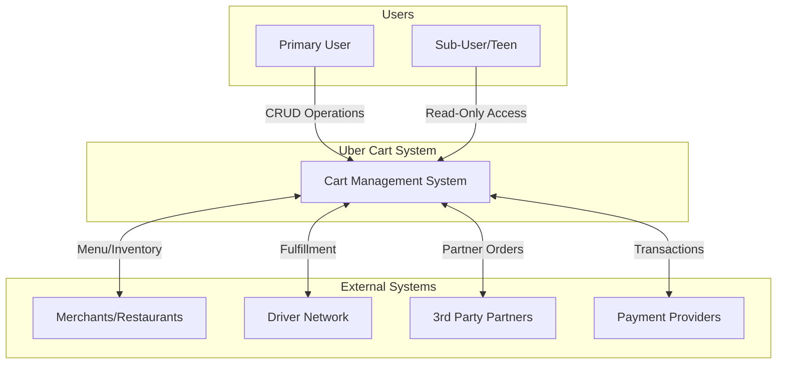
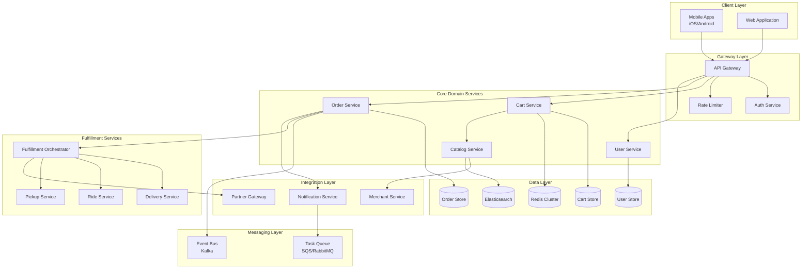
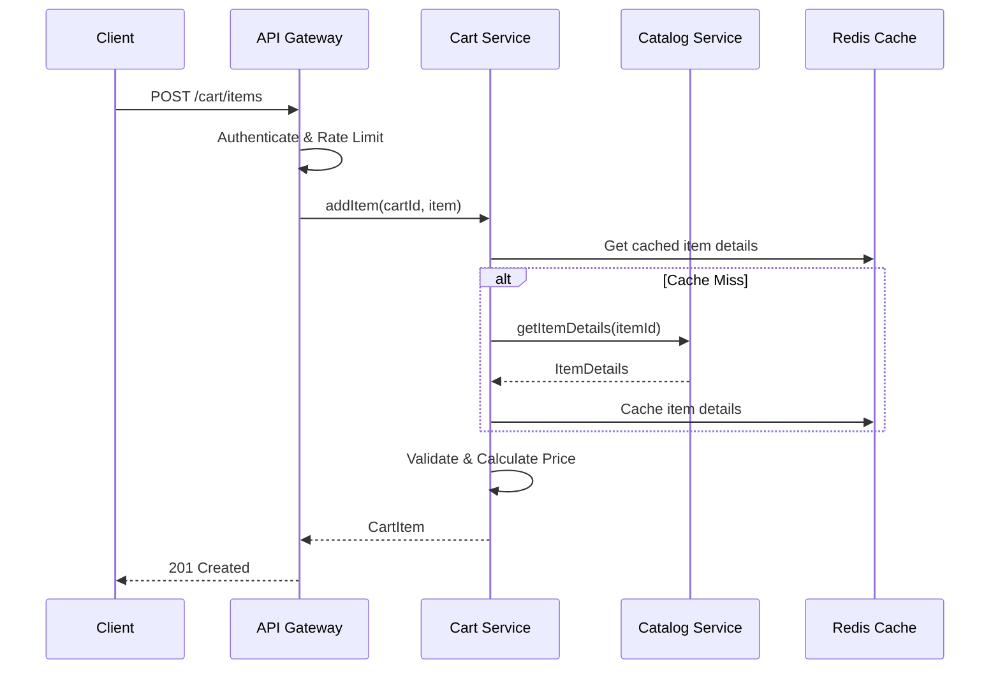
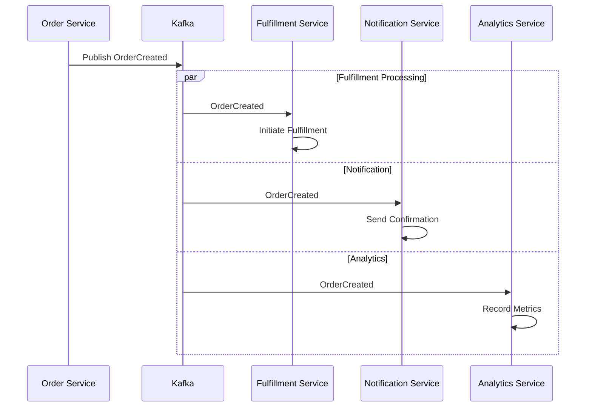
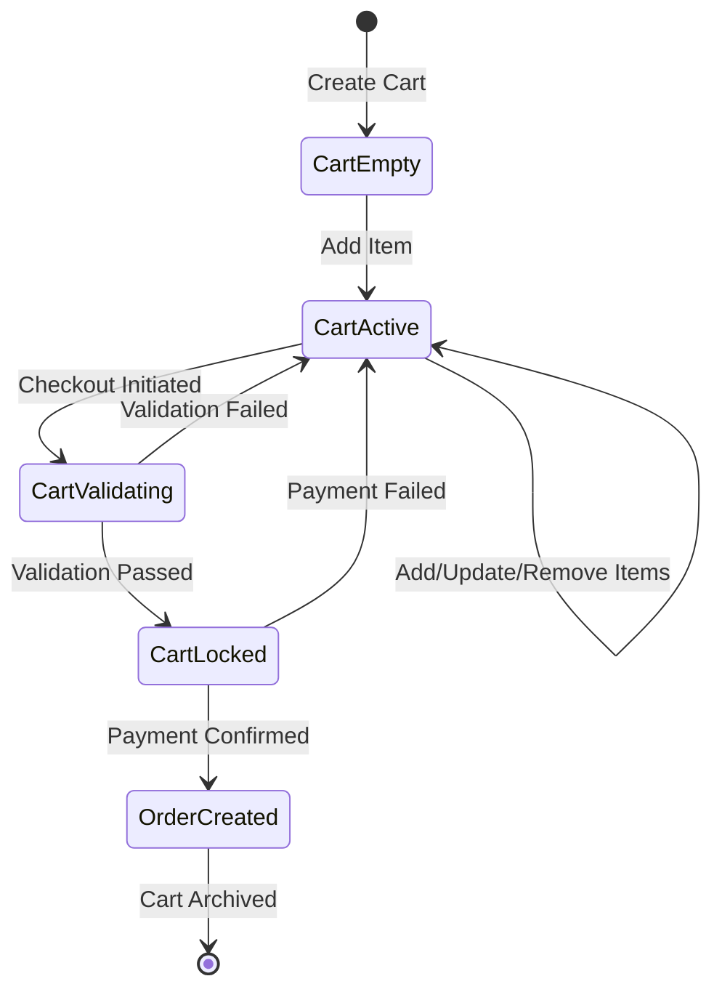
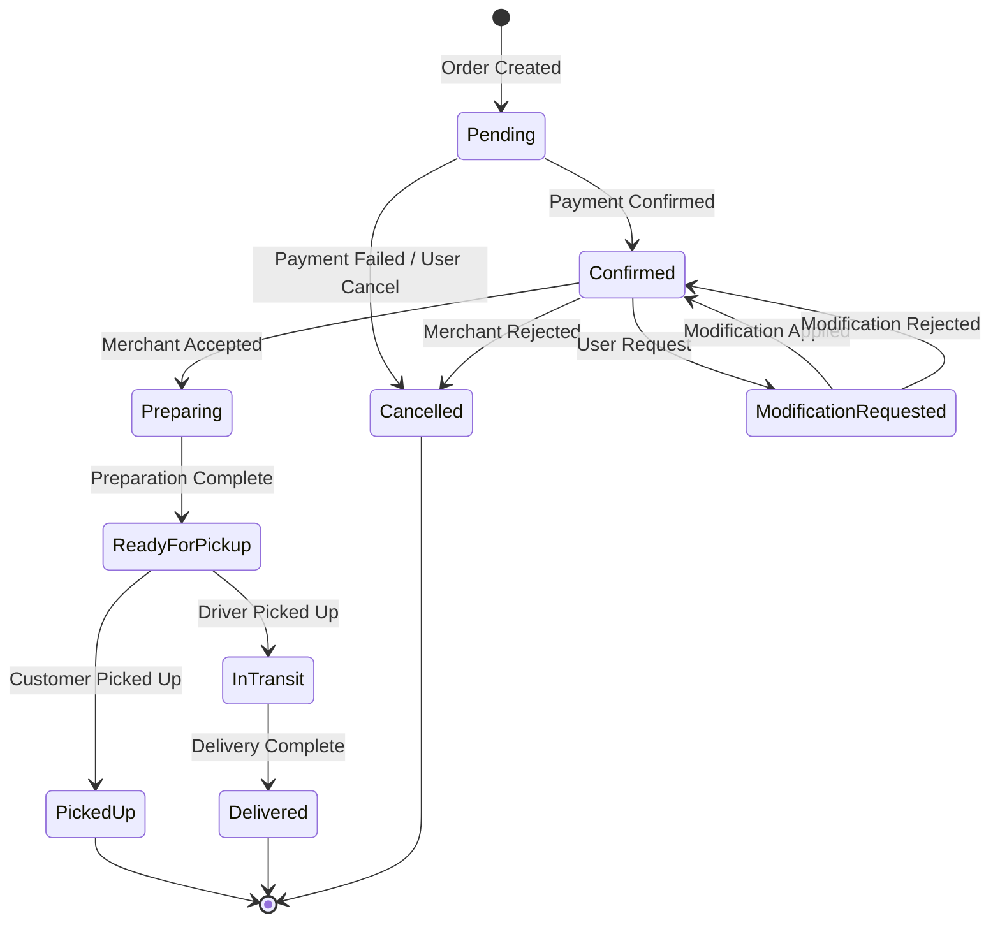
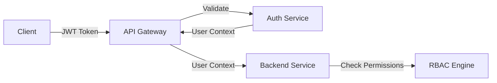

# Uber Cart System - High-Level Architecture

## Overview

The Uber Cart Management System is a unified platform that manages shopping carts and order lifecycle across Uber's full ecosystem: Uber Eats, Uber Grocery, Uber Rides, and Package Delivery. This document outlines the high-level architecture, service boundaries, and communication patterns.

## System Context



## Core Architectural Principles

### 1. Domain-Driven Design
- Clear bounded contexts for Cart, Order, User, and Fulfillment domains
- Each domain owns its data and exposes well-defined APIs
- Domain events for cross-service communication

### 2. Microservices Architecture
- Independently deployable services
- Service-specific databases (Database per Service pattern)
- API Gateway for unified client access

### 3. Event-Driven Communication
- Asynchronous processing for non-critical paths
- Event sourcing for order state changes
- Eventual consistency where appropriate

### 4. Offline-First Design
- Client-side state management with local persistence
- Conflict resolution strategies for cart merges
- Background synchronization queues

## Service Architecture



## Service Boundaries

### Cart Service
**Responsibility**: Manages active shopping carts, cart items, and cart lifecycle

| Capability | Description |
|------------|-------------|
| Cart CRUD | Create, read, update, delete carts |
| Item Management | Add, update, remove items from cart |
| Multi-Merchant | Support items from multiple merchants in one cart |
| Price Calculation | Real-time pricing with promotions |
| Cart Validation | Validate items, quantities, availability |
| Cart Expiration | TTL-based cart cleanup |

**Data Owned**: Cart, CartItem, CartMetadata

---

### Order Service
**Responsibility**: Manages order lifecycle from checkout to completion

| Capability | Description |
|------------|-------------|
| Order Creation | Convert cart to order(s) |
| Status Management | Track and update order status |
| Order Modifications | Handle cancel, modify requests |
| Order History | Query historical orders |
| Sub-User Access | Manage order visibility for sub-users |

**Data Owned**: Order, OrderItem, OrderStatusHistory

---

### User Service
**Responsibility**: User identity, relationships, and preferences

| Capability | Description |
|------------|-------------|
| User Management | User profiles and authentication |
| Sub-User Management | Parent-child relationships (teens) |
| Permissions | Role-based access control |
| Preferences | Delivery addresses, payment methods |

**Data Owned**: User, SubUser, UserPreferences, UserAddress

---

### Fulfillment Orchestrator
**Responsibility**: Coordinates order fulfillment across different fulfillment types

| Capability | Description |
|------------|-------------|
| Fulfillment Routing | Route to appropriate fulfillment service |
| Status Aggregation | Aggregate status from multiple services |
| SLA Management | Track fulfillment SLAs |
| Retry Handling | Handle fulfillment failures |

**Data Owned**: Fulfillment, FulfillmentStatus

---

### Partner Gateway
**Responsibility**: Integration with third-party partners

| Capability | Description |
|------------|-------------|
| Partner Adapters | Normalize partner APIs |
| Capability Registry | Track partner capabilities |
| Operation Filtering | Restrict operations per partner |
| Webhook Management | Handle partner callbacks |

**Data Owned**: PartnerConfig, PartnerOrder, PartnerCapability

## Communication Patterns

### Synchronous Communication (REST/gRPC)



**When to Use Synchronous:**
- User-facing read operations (get cart, get order)
- Operations requiring immediate confirmation (add to cart)
- Real-time validations (price checks, availability)

### Asynchronous Communication (Events)



**When to Use Asynchronous:**
- Order status updates
- Notification dispatch
- Analytics and reporting
- Cross-service data sync

### Event Types

| Event | Publisher | Subscribers | Purpose |
|-------|-----------|-------------|---------|
| `CartUpdated` | Cart Service | Analytics | Track cart changes |
| `OrderCreated` | Order Service | Fulfillment, Notification, Analytics | Initiate order processing |
| `OrderStatusChanged` | Order Service | Notification, Client (WebSocket) | Status updates |
| `FulfillmentUpdated` | Fulfillment Service | Order Service, Notification | Fulfillment progress |
| `PaymentProcessed` | Payment Service | Order Service | Payment confirmation |

## Data Flow Patterns

### Cart to Order Conversion



### Order State Machine



## Scalability Considerations

### Horizontal Scaling
- All services are stateless and horizontally scalable
- Cart Service scales based on active users
- Order Service scales based on order volume
- Fulfillment services scale based on geographic demand

### Caching Strategy
| Data Type | Cache TTL | Invalidation Strategy |
|-----------|-----------|----------------------|
| Cart Data | 30 min | Write-through |
| Menu Items | 5 min | Event-based |
| User Preferences | 1 hour | Write-through |
| Order Status | No cache | Real-time updates |

### Database Sharding
- Cart DB: Shard by user_id
- Order DB: Shard by region + time-based partitioning
- User DB: Shard by user_id

## Failure Handling

### Circuit Breaker Pattern
```
┌─────────────────────────────────────────────────────────┐
│                    Circuit Breaker                       │
├─────────────────────────────────────────────────────────┤
│  State: CLOSED → OPEN → HALF_OPEN → CLOSED              │
│                                                          │
│  Thresholds:                                             │
│  - Failure Rate: 50% over 10 requests                    │
│  - Open Duration: 30 seconds                             │
│  - Half-Open Requests: 3                                 │
└─────────────────────────────────────────────────────────┘
```

### Retry Strategy
| Operation | Max Retries | Backoff | Circuit Breaker |
|-----------|-------------|---------|-----------------|
| Cart Read | 3 | Exponential | Yes |
| Cart Write | 2 | Linear | Yes |
| Order Create | 0 | N/A | No (Idempotent) |
| Fulfillment Update | 5 | Exponential | Yes |

### Fallback Strategies
- **Cart Service Down**: Serve from local cache, queue writes
- **Catalog Service Down**: Serve stale menu data with warning
- **Fulfillment Service Down**: Queue orders, notify user of delay
- **Payment Service Down**: Hold order, retry with exponential backoff

## Security Architecture

### Authentication & Authorization


### Data Protection
- **In Transit**: TLS 1.3 for all communications
- **At Rest**: AES-256 encryption for sensitive data
- **PII Handling**: Data masking, audit logging
- **Token Management**: Short-lived JWTs, refresh token rotation

## Monitoring & Observability

### Key Metrics
| Metric | Target | Alert Threshold |
|--------|--------|-----------------|
| Cart Add Latency (p99) | < 100ms | > 200ms |
| Order Create Latency (p99) | < 500ms | > 1s |
| Cart Service Availability | 99.99% | < 99.9% |
| Order Service Availability | 99.99% | < 99.9% |
| Cart Conversion Rate | Baseline | -10% |

### Distributed Tracing
- Trace ID propagation across all services
- Span collection for critical paths
- Integration with Jaeger/Zipkin

### Logging Strategy
- Structured JSON logging
- Correlation IDs for request tracking
- Log levels: DEBUG (dev), INFO (prod), ERROR (alerts)

