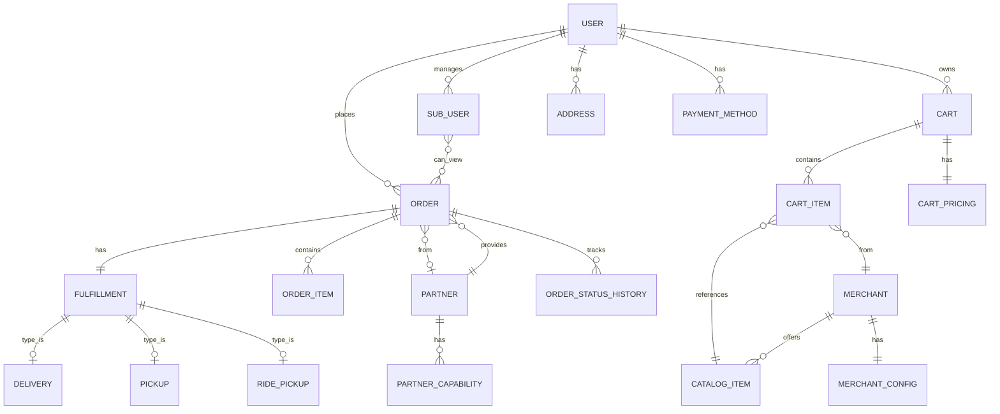

# Uber Cart System - Data Model Design

## Overview

This document provides comprehensive data model definitions for the Uber Cart Management System, covering all entities, relationships, and schemas for Cart, Order, User, and Fulfillment domains.

## Entity Relationship Diagram



## User Domain

### User Entity

```typescript
interface User {
  // Identity
  id: UUID;
  email: string;
  phone: string;

  // Profile
  firstName: string;
  lastName: string;
  displayName: string;
  avatarUrl?: string;

  // Account settings
  preferredLanguage: string;
  preferredCurrency: string;
  timezone: string;

  // Status
  status: UserStatus;
  emailVerified: boolean;
  phoneVerified: boolean;

  // Timestamps
  createdAt: DateTime;
  updatedAt: DateTime;
  lastActiveAt: DateTime;
}

enum UserStatus {
  ACTIVE = 'ACTIVE',
  SUSPENDED = 'SUSPENDED',
  DEACTIVATED = 'DEACTIVATED'
}
```

### Sub-User Entity (Family Accounts / Teens)

```typescript
interface SubUser {
  id: UUID;
  parentUserId: UUID;  // Reference to parent User

  // Profile
  firstName: string;
  lastName: string;
  displayName: string;
  avatarUrl?: string;
  dateOfBirth?: Date;

  // Permissions
  permissionLevel: SubUserPermissionLevel;
  restrictions: SubUserRestrictions;

  // Access control
  canViewParentOrders: boolean;
  canPlaceOrders: boolean;
  requiresApproval: boolean;

  // Status
  status: SubUserStatus;
  invitedAt: DateTime;
  acceptedAt?: DateTime;

  // Timestamps
  createdAt: DateTime;
  updatedAt: DateTime;
}

enum SubUserPermissionLevel {
  VIEW_ONLY = 'VIEW_ONLY',           // Can only view orders
  LIMITED = 'LIMITED',                // Can order with restrictions
  SUPERVISED = 'SUPERVISED',          // Can order, requires approval
  FULL = 'FULL'                       // Full ordering capabilities
}

interface SubUserRestrictions {
  // Spending limits
  dailySpendingLimit?: Money;
  weeklySpendingLimit?: Money;
  monthlySpendingLimit?: Money;
  perOrderLimit?: Money;

  // Merchant restrictions
  allowedMerchantCategories?: string[];
  blockedMerchantIds?: UUID[];

  // Time restrictions
  orderingHoursStart?: string;  // "09:00"
  orderingHoursEnd?: string;    // "21:00"
  allowedDays?: DayOfWeek[];

  // Fulfillment restrictions
  allowedFulfillmentTypes?: FulfillmentType[];
  deliveryAddressIds?: UUID[];  // Restricted delivery addresses
}

enum SubUserStatus {
  PENDING_INVITE = 'PENDING_INVITE',
  ACTIVE = 'ACTIVE',
  SUSPENDED = 'SUSPENDED',
  REMOVED = 'REMOVED'
}
```

### Address Entity

```typescript
interface Address {
  id: UUID;
  userId: UUID;

  // Address details
  label: string;  // "Home", "Work", etc.
  addressLine1: string;
  addressLine2?: string;
  city: string;
  state: string;
  postalCode: string;
  country: string;

  // Geolocation
  latitude: number;
  longitude: number;

  // Delivery instructions
  deliveryInstructions?: string;
  accessCode?: string;

  // Flags
  isDefault: boolean;
  isVerified: boolean;

  // Timestamps
  createdAt: DateTime;
  updatedAt: DateTime;
}
```

### Payment Method Entity

```typescript
interface PaymentMethod {
  id: UUID;
  userId: UUID;

  // Payment type
  type: PaymentMethodType;

  // Card details (masked)
  last4?: string;
  brand?: string;
  expiryMonth?: number;
  expiryYear?: number;

  // Wallet details
  walletProvider?: string;
  walletEmail?: string;

  // Billing
  billingAddressId?: UUID;

  // Flags
  isDefault: boolean;
  isVerified: boolean;

  // Tokenized reference (never store raw card data)
  paymentTokenId: string;

  // Timestamps
  createdAt: DateTime;
  updatedAt: DateTime;
}

enum PaymentMethodType {
  CREDIT_CARD = 'CREDIT_CARD',
  DEBIT_CARD = 'DEBIT_CARD',
  PAYPAL = 'PAYPAL',
  APPLE_PAY = 'APPLE_PAY',
  GOOGLE_PAY = 'GOOGLE_PAY',
  UBER_CASH = 'UBER_CASH'
}
```

## Cart Domain

### Cart Entity

```typescript
interface Cart {
  id: UUID;
  userId: UUID;

  // Session tracking
  sessionId?: string;
  deviceId?: string;

  // Cart state
  status: CartStatus;

  // Fulfillment preference
  fulfillmentType?: FulfillmentType;
  deliveryAddressId?: UUID;
  pickupLocation?: Location;
  scheduledTime?: DateTime;

  // Items (grouped by merchant)
  merchantGroups: MerchantGroup[];

  // Pricing
  pricing: CartPricing;

  // Promotions
  appliedPromoCodes: string[];
  appliedDiscounts: AppliedDiscount[];

  // Versioning for optimistic locking
  version: number;

  // Timestamps
  createdAt: DateTime;
  updatedAt: DateTime;
  expiresAt: DateTime;
  lastActivityAt: DateTime;
}

enum CartStatus {
  ACTIVE = 'ACTIVE',
  LOCKED = 'LOCKED',           // During checkout
  CHECKED_OUT = 'CHECKED_OUT',
  EXPIRED = 'EXPIRED',
  ABANDONED = 'ABANDONED'
}

enum FulfillmentType {
  DELIVERY = 'DELIVERY',
  PICKUP = 'PICKUP',
  PICKUP_WITH_RIDE = 'PICKUP_WITH_RIDE'
}
```

### Cart Item Entity

```typescript
interface CartItem {
  id: UUID;
  cartId: UUID;

  // Item reference
  itemId: UUID;
  merchantId: UUID;

  // Item snapshot
  name: string;
  description?: string;
  imageUrl?: string;

  // Quantity
  quantity: number;
  minQuantity: number;
  maxQuantity: number;

  // Pricing
  unitPrice: Money;
  totalPrice: Money;
  originalPrice?: Money;  // Before discounts

  // Customizations
  customizations: CartItemCustomization[];
  specialNotes?: string;

  // Availability
  isAvailable: boolean;
  availabilityMessage?: string;

  // For 3rd party items
  partnerId?: UUID;
  partnerItemId?: string;

  // Timestamps
  addedAt: DateTime;
  updatedAt: DateTime;
}

interface CartItemCustomization {
  groupId: string;
  groupName: string;
  selections: CustomizationSelection[];
  additionalPrice: Money;
}

interface CustomizationSelection {
  optionId: string;
  optionName: string;
  quantity: number;
  price: Money;
}
```

### Merchant Group (Cart Organization)

```typescript
interface MerchantGroup {
  merchantId: UUID;
  merchantName: string;
  merchantLogo: string;
  merchantRating: number;

  // Items from this merchant
  items: CartItem[];

  // Merchant-level pricing
  subtotal: Money;
  deliveryFee: Money;
  smallOrderFee?: Money;

  // Availability
  isOpen: boolean;
  estimatedPrepTime: number;  // minutes

  // Fulfillment options
  availableFulfillmentTypes: FulfillmentType[];
  deliveryETA?: string;
  pickupETA?: string;
}
```

### Cart Pricing Entity

```typescript
interface CartPricing {
  cartId: UUID;

  // Base pricing
  subtotal: Money;

  // Fees
  deliveryFee: Money;
  serviceFee: Money;
  smallOrderFee: Money;

  // Taxes
  taxAmount: Money;
  taxBreakdown: TaxItem[];

  // Discounts
  totalDiscount: Money;
  discountBreakdown: DiscountItem[];

  // Total
  total: Money;

  // Currency
  currency: string;

  // Last calculated
  calculatedAt: DateTime;
}

interface TaxItem {
  name: string;
  rate: number;
  amount: Money;
}

interface DiscountItem {
  type: DiscountType;
  code?: string;
  description: string;
  amount: Money;
}

enum DiscountType {
  PROMO_CODE = 'PROMO_CODE',
  MERCHANT_OFFER = 'MERCHANT_OFFER',
  UBER_PASS = 'UBER_PASS',
  FIRST_ORDER = 'FIRST_ORDER',
  LOYALTY = 'LOYALTY'
}
```

### Money Value Object

```typescript
interface Money {
  amount: number;          // In smallest currency unit (cents)
  currency: string;        // ISO 4217 code
  displayAmount: string;   // Formatted for display ("$12.99")
}

// Helper functions
function addMoney(a: Money, b: Money): Money;
function subtractMoney(a: Money, b: Money): Money;
function multiplyMoney(money: Money, factor: number): Money;
function formatMoney(money: Money, locale: string): string;
```

## Order Domain

### Order Entity

```typescript
interface Order {
  id: UUID;
  orderNumber: string;  // Human-readable order number
  userId: UUID;
  cartId?: UUID;        // Reference to original cart

  // Status
  status: OrderStatus;
  statusHistory: OrderStatusChange[];

  // Fulfillment
  fulfillmentType: FulfillmentType;
  fulfillment: Fulfillment;

  // Items
  items: OrderItem[];
  merchantGroups: OrderMerchantGroup[];

  // Pricing (snapshot at order time)
  pricing: OrderPricing;

  // Addresses
  deliveryAddress?: Address;
  pickupLocation?: Location;

  // Scheduling
  isScheduled: boolean;
  scheduledTime?: DateTime;
  estimatedDeliveryTime?: DateTime;
  actualDeliveryTime?: DateTime;

  // Payment
  paymentMethodId: UUID;
  paymentStatus: PaymentStatus;

  // Special instructions
  specialNotes?: string;

  // For 3rd party orders
  partnerId?: UUID;
  partnerOrderId?: string;
  isPartnerOrder: boolean;

  // Metadata
  metadata: Record<string, any>;

  // Timestamps
  createdAt: DateTime;
  updatedAt: DateTime;
  completedAt?: DateTime;
  cancelledAt?: DateTime;
}

enum OrderStatus {
  PENDING = 'PENDING',
  PAYMENT_PROCESSING = 'PAYMENT_PROCESSING',
  CONFIRMED = 'CONFIRMED',
  PREPARING = 'PREPARING',
  READY_FOR_PICKUP = 'READY_FOR_PICKUP',
  DRIVER_ASSIGNED = 'DRIVER_ASSIGNED',
  DRIVER_AT_MERCHANT = 'DRIVER_AT_MERCHANT',
  IN_TRANSIT = 'IN_TRANSIT',
  ARRIVING = 'ARRIVING',
  DELIVERED = 'DELIVERED',
  PICKED_UP = 'PICKED_UP',
  CANCELLED = 'CANCELLED',
  REFUNDED = 'REFUNDED'
}

enum PaymentStatus {
  PENDING = 'PENDING',
  AUTHORIZED = 'AUTHORIZED',
  CAPTURED = 'CAPTURED',
  FAILED = 'FAILED',
  REFUNDED = 'REFUNDED',
  PARTIALLY_REFUNDED = 'PARTIALLY_REFUNDED'
}
```

### Order Item Entity

```typescript
interface OrderItem {
  id: UUID;
  orderId: UUID;

  // Original item reference
  originalItemId: UUID;
  merchantId: UUID;

  // Item snapshot (immutable after order)
  name: string;
  description?: string;
  imageUrl?: string;

  // Quantity
  quantity: number;

  // Pricing snapshot
  unitPrice: Money;
  totalPrice: Money;

  // Customizations snapshot
  customizations: OrderItemCustomization[];
  specialNotes?: string;

  // Item status (for partial fulfillment)
  status: OrderItemStatus;

  // Timestamps
  createdAt: DateTime;
}

enum OrderItemStatus {
  PENDING = 'PENDING',
  PREPARING = 'PREPARING',
  READY = 'READY',
  UNAVAILABLE = 'UNAVAILABLE',
  SUBSTITUTED = 'SUBSTITUTED'
}

interface OrderItemCustomization {
  groupName: string;
  selections: string[];  // Option names
  additionalPrice: Money;
}
```

### Order Pricing Entity

```typescript
interface OrderPricing {
  orderId: UUID;

  // Snapshot of pricing at order time
  subtotal: Money;
  deliveryFee: Money;
  serviceFee: Money;
  smallOrderFee: Money;
  taxAmount: Money;
  tip: Money;
  totalDiscount: Money;
  total: Money;

  // Breakdown
  taxBreakdown: TaxItem[];
  discountBreakdown: DiscountItem[];

  // Currency
  currency: string;

  // Refund tracking
  refundedAmount: Money;
  refunds: RefundItem[];
}

interface RefundItem {
  id: UUID;
  reason: string;
  amount: Money;
  refundedAt: DateTime;
  refundedBy: string;
}
```

### Order Status History

```typescript
interface OrderStatusChange {
  id: UUID;
  orderId: UUID;

  previousStatus: OrderStatus;
  newStatus: OrderStatus;

  // Who/what made the change
  changedBy: string;  // "system", "user", "merchant", "driver"
  changedByUserId?: UUID;

  // Reason for change
  reason?: string;

  // Additional context
  metadata?: Record<string, any>;

  // Timestamp
  changedAt: DateTime;
}
```

## Fulfillment Domain

### Fulfillment Entity (Base)

```typescript
interface Fulfillment {
  id: UUID;
  orderId: UUID;

  type: FulfillmentType;
  status: FulfillmentStatus;

  // Timing
  estimatedTime: DateTime;
  actualTime?: DateTime;

  // Type-specific data
  delivery?: DeliveryFulfillment;
  pickup?: PickupFulfillment;
  ridePickup?: RidePickupFulfillment;

  // Timestamps
  createdAt: DateTime;
  updatedAt: DateTime;
}

enum FulfillmentStatus {
  PENDING = 'PENDING',
  DRIVER_ASSIGNED = 'DRIVER_ASSIGNED',
  DRIVER_EN_ROUTE_TO_PICKUP = 'DRIVER_EN_ROUTE_TO_PICKUP',
  DRIVER_AT_PICKUP = 'DRIVER_AT_PICKUP',
  PICKED_UP = 'PICKED_UP',
  IN_TRANSIT = 'IN_TRANSIT',
  ARRIVING = 'ARRIVING',
  COMPLETED = 'COMPLETED',
  FAILED = 'FAILED',
  CANCELLED = 'CANCELLED'
}
```

### Delivery Fulfillment

```typescript
interface DeliveryFulfillment {
  fulfillmentId: UUID;

  // Driver info
  driverId?: UUID;
  driverName?: string;
  driverPhoto?: string;
  driverRating?: number;

  // Vehicle info
  vehicleType: string;
  vehicleDescription?: string;
  vehicleLicensePlate?: string;

  // Locations
  pickupLocation: Location;
  dropoffLocation: Location;

  // Route
  routePolyline?: string;
  distanceMeters: number;
  estimatedDurationSeconds: number;

  // Real-time tracking
  currentLocation?: GeoLocation;
  lastLocationUpdate?: DateTime;
  trackingUrl?: string;

  // Proof of delivery
  deliveryPhoto?: string;
  signatureUrl?: string;
  deliveredTo?: string;

  // Status timestamps
  driverAssignedAt?: DateTime;
  pickedUpAt?: DateTime;
  deliveredAt?: DateTime;
}
```

### Pickup Fulfillment

```typescript
interface PickupFulfillment {
  fulfillmentId: UUID;

  // Pickup location
  pickupLocation: Location;
  merchantName: string;
  merchantAddress: string;
  merchantPhone?: string;

  // Pickup instructions
  pickupInstructions?: string;
  parkingInstructions?: string;

  // Pickup code
  pickupCode: string;  // 4-6 digit code for verification

  // Status timestamps
  readyAt?: DateTime;
  notifiedAt?: DateTime;
  pickedUpAt?: DateTime;

  // Pickup window
  pickupWindowStart?: DateTime;
  pickupWindowEnd?: DateTime;
}
```

### Ride Pickup Fulfillment (Pickup with Ride)

```typescript
interface RidePickupFulfillment {
  fulfillmentId: UUID;

  // Associated ride
  rideId: UUID;
  rideStatus: RideStatus;

  // Ride details
  pickupLocation: Location;      // User's location
  merchantLocation: Location;    // Where to pick up order
  dropoffLocation?: Location;    // Final destination (optional)

  // Driver info (from Rides)
  driverId?: UUID;
  driverName?: string;
  driverPhoto?: string;
  driverRating?: number;

  // Vehicle info
  vehicleType: string;
  vehicleDescription?: string;
  vehicleLicensePlate?: string;

  // Timing
  estimatedArrival?: DateTime;
  estimatedOrderReady?: DateTime;

  // Real-time tracking
  rideTrackingUrl?: string;
  currentLocation?: GeoLocation;

  // Pickup code (for merchant)
  orderPickupCode: string;

  // Status timestamps
  rideRequestedAt?: DateTime;
  rideAcceptedAt?: DateTime;
  arrivedAtMerchantAt?: DateTime;
  orderPickedUpAt?: DateTime;
  customerPickedUpAt?: DateTime;
}

enum RideStatus {
  REQUESTED = 'REQUESTED',
  DRIVER_ASSIGNED = 'DRIVER_ASSIGNED',
  DRIVER_EN_ROUTE = 'DRIVER_EN_ROUTE',
  DRIVER_ARRIVED = 'DRIVER_ARRIVED',
  AT_MERCHANT = 'AT_MERCHANT',
  ORDER_PICKED_UP = 'ORDER_PICKED_UP',
  EN_ROUTE_TO_CUSTOMER = 'EN_ROUTE_TO_CUSTOMER',
  CUSTOMER_PICKED_UP = 'CUSTOMER_PICKED_UP',
  COMPLETED = 'COMPLETED',
  CANCELLED = 'CANCELLED'
}
```

### Location Types

```typescript
interface Location {
  // Address
  addressLine1: string;
  addressLine2?: string;
  city: string;
  state: string;
  postalCode: string;
  country: string;

  // Coordinates
  latitude: number;
  longitude: number;

  // Place details
  placeName?: string;
  placeId?: string;  // Google Places ID

  // Access
  accessInstructions?: string;
  accessCode?: string;
}

interface GeoLocation {
  latitude: number;
  longitude: number;
  accuracy?: number;
  heading?: number;
  speed?: number;
  timestamp: DateTime;
}
```

## Partner/Integration Domain

### Partner Entity

```typescript
interface Partner {
  id: UUID;

  // Partner details
  name: string;
  displayName: string;
  logo: string;
  description?: string;

  // Integration
  apiBaseUrl: string;
  webhookUrl: string;

  // Authentication
  authType: PartnerAuthType;

  // Capabilities
  capabilities: PartnerCapability[];

  // Configuration
  config: PartnerConfig;

  // Status
  status: PartnerStatus;

  // Timestamps
  onboardedAt: DateTime;
  lastActiveAt: DateTime;
}

enum PartnerAuthType {
  API_KEY = 'API_KEY',
  OAUTH2 = 'OAUTH2',
  MUTUAL_TLS = 'MUTUAL_TLS'
}

enum PartnerStatus {
  ACTIVE = 'ACTIVE',
  INACTIVE = 'INACTIVE',
  SUSPENDED = 'SUSPENDED',
  TESTING = 'TESTING'
}
```

### Partner Capability

```typescript
interface PartnerCapability {
  partnerId: UUID;

  capability: CapabilityType;
  enabled: boolean;

  // Restrictions
  restrictions?: CapabilityRestrictions;

  // Version
  apiVersion: string;
}

enum CapabilityType {
  // Order capabilities
  CREATE_ORDER = 'CREATE_ORDER',
  MODIFY_ORDER = 'MODIFY_ORDER',
  CANCEL_ORDER = 'CANCEL_ORDER',
  TRACK_ORDER = 'TRACK_ORDER',

  // Fulfillment capabilities
  DELIVERY = 'DELIVERY',
  PICKUP = 'PICKUP',

  // Other capabilities
  REFUND = 'REFUND',
  REAL_TIME_UPDATES = 'REAL_TIME_UPDATES',
  WEBHOOKS = 'WEBHOOKS'
}

interface CapabilityRestrictions {
  // Time-based
  modificationWindowMinutes?: number;
  cancellationWindowMinutes?: number;

  // Status-based
  modifiableStatuses?: OrderStatus[];
  cancellableStatuses?: OrderStatus[];

  // Amount-based
  maxOrderAmount?: Money;
  minOrderAmount?: Money;
}
```

### Partner Config

```typescript
interface PartnerConfig {
  partnerId: UUID;

  // Order handling
  requiresOrderConfirmation: boolean;
  autoAcceptOrders: boolean;

  // Communication
  notificationPreferences: NotificationPreference[];
  webhookEvents: string[];

  // Pricing
  commissionRate?: number;
  deliveryFeeHandling: 'PARTNER' | 'UBER' | 'SPLIT';

  // Limits
  dailyOrderLimit?: number;
  concurrentOrderLimit?: number;

  // Feature flags
  features: Record<string, boolean>;
}
```

## Catalog Domain

### Catalog Item Entity

```typescript
interface CatalogItem {
  id: UUID;
  merchantId: UUID;

  // Basic info
  name: string;
  description?: string;
  imageUrl?: string;

  // Categorization
  categoryId: UUID;
  subcategoryId?: UUID;
  tags: string[];

  // Pricing
  basePrice: Money;

  // Availability
  isAvailable: boolean;
  availableFrom?: string;  // Time of day
  availableTo?: string;
  availableDays?: DayOfWeek[];

  // Customization options
  customizationGroups: CustomizationGroup[];

  // Dietary/allergen info
  dietaryInfo?: DietaryInfo;

  // For grocery/retail
  weightUnit?: string;
  pricePerUnit?: Money;
  inStock: boolean;
  stockQuantity?: number;

  // Timestamps
  createdAt: DateTime;
  updatedAt: DateTime;
}

interface CustomizationGroup {
  id: string;
  name: string;
  required: boolean;
  minSelections: number;
  maxSelections: number;
  options: CustomizationOption[];
}

interface CustomizationOption {
  id: string;
  name: string;
  price: Money;
  isDefault: boolean;
  isAvailable: boolean;
}

interface DietaryInfo {
  isVegetarian: boolean;
  isVegan: boolean;
  isGlutenFree: boolean;
  isHalal: boolean;
  isKosher: boolean;
  allergens: string[];
  calories?: number;
}
```

### Merchant Entity

```typescript
interface Merchant {
  id: UUID;

  // Basic info
  name: string;
  displayName: string;
  description?: string;
  logo: string;
  coverImage?: string;

  // Location
  address: Address;

  // Contact
  phone: string;
  email?: string;

  // Category
  category: string;
  subcategories: string[];
  cuisineTypes?: string[];

  // Rating
  rating: number;
  totalRatings: number;

  // Operating hours
  operatingHours: OperatingHours[];
  isOpen: boolean;

  // Fulfillment
  supportedFulfillmentTypes: FulfillmentType[];
  averagePrepTime: number;  // minutes
  deliveryRadius: number;   // meters

  // Fees
  deliveryFee: Money;
  minOrderAmount?: Money;
  smallOrderFee?: Money;
  smallOrderThreshold?: Money;

  // Status
  status: MerchantStatus;

  // Timestamps
  createdAt: DateTime;
  updatedAt: DateTime;
}

interface OperatingHours {
  dayOfWeek: DayOfWeek;
  openTime: string;   // "09:00"
  closeTime: string;  // "22:00"
  isClosed: boolean;
}

enum MerchantStatus {
  ACTIVE = 'ACTIVE',
  TEMPORARILY_CLOSED = 'TEMPORARILY_CLOSED',
  PERMANENTLY_CLOSED = 'PERMANENTLY_CLOSED',
  ONBOARDING = 'ONBOARDING'
}

enum DayOfWeek {
  MONDAY = 'MONDAY',
  TUESDAY = 'TUESDAY',
  WEDNESDAY = 'WEDNESDAY',
  THURSDAY = 'THURSDAY',
  FRIDAY = 'FRIDAY',
  SATURDAY = 'SATURDAY',
  SUNDAY = 'SUNDAY'
}
```

## Database Schema (PostgreSQL)

### Complete Schema

```sql
-- Enable UUID extension
CREATE EXTENSION IF NOT EXISTS "uuid-ossp";

-- Users table
CREATE TABLE users (
    id UUID PRIMARY KEY DEFAULT uuid_generate_v4(),
    email VARCHAR(255) UNIQUE NOT NULL,
    phone VARCHAR(50) UNIQUE,
    first_name VARCHAR(100) NOT NULL,
    last_name VARCHAR(100) NOT NULL,
    display_name VARCHAR(200),
    avatar_url TEXT,
    preferred_language VARCHAR(10) DEFAULT 'en',
    preferred_currency VARCHAR(3) DEFAULT 'USD',
    timezone VARCHAR(50) DEFAULT 'UTC',
    status VARCHAR(20) NOT NULL DEFAULT 'ACTIVE',
    email_verified BOOLEAN DEFAULT FALSE,
    phone_verified BOOLEAN DEFAULT FALSE,
    created_at TIMESTAMP WITH TIME ZONE DEFAULT NOW(),
    updated_at TIMESTAMP WITH TIME ZONE DEFAULT NOW(),
    last_active_at TIMESTAMP WITH TIME ZONE DEFAULT NOW()
);

-- Sub-users table
CREATE TABLE sub_users (
    id UUID PRIMARY KEY DEFAULT uuid_generate_v4(),
    parent_user_id UUID NOT NULL REFERENCES users(id) ON DELETE CASCADE,
    first_name VARCHAR(100) NOT NULL,
    last_name VARCHAR(100) NOT NULL,
    display_name VARCHAR(200),
    avatar_url TEXT,
    date_of_birth DATE,
    permission_level VARCHAR(20) NOT NULL DEFAULT 'VIEW_ONLY',
    restrictions JSONB DEFAULT '{}',
    can_view_parent_orders BOOLEAN DEFAULT TRUE,
    can_place_orders BOOLEAN DEFAULT FALSE,
    requires_approval BOOLEAN DEFAULT TRUE,
    status VARCHAR(20) NOT NULL DEFAULT 'PENDING_INVITE',
    invited_at TIMESTAMP WITH TIME ZONE DEFAULT NOW(),
    accepted_at TIMESTAMP WITH TIME ZONE,
    created_at TIMESTAMP WITH TIME ZONE DEFAULT NOW(),
    updated_at TIMESTAMP WITH TIME ZONE DEFAULT NOW()
);

CREATE INDEX idx_sub_users_parent ON sub_users(parent_user_id);

-- Addresses table
CREATE TABLE addresses (
    id UUID PRIMARY KEY DEFAULT uuid_generate_v4(),
    user_id UUID NOT NULL REFERENCES users(id) ON DELETE CASCADE,
    label VARCHAR(50),
    address_line_1 VARCHAR(255) NOT NULL,
    address_line_2 VARCHAR(255),
    city VARCHAR(100) NOT NULL,
    state VARCHAR(100) NOT NULL,
    postal_code VARCHAR(20) NOT NULL,
    country VARCHAR(3) NOT NULL,
    latitude DECIMAL(10, 8) NOT NULL,
    longitude DECIMAL(11, 8) NOT NULL,
    delivery_instructions TEXT,
    access_code VARCHAR(50),
    is_default BOOLEAN DEFAULT FALSE,
    is_verified BOOLEAN DEFAULT FALSE,
    created_at TIMESTAMP WITH TIME ZONE DEFAULT NOW(),
    updated_at TIMESTAMP WITH TIME ZONE DEFAULT NOW()
);

CREATE INDEX idx_addresses_user ON addresses(user_id);

-- Partners table
CREATE TABLE partners (
    id UUID PRIMARY KEY DEFAULT uuid_generate_v4(),
    name VARCHAR(100) NOT NULL,
    display_name VARCHAR(200) NOT NULL,
    logo TEXT,
    description TEXT,
    api_base_url TEXT NOT NULL,
    webhook_url TEXT,
    auth_type VARCHAR(20) NOT NULL,
    status VARCHAR(20) NOT NULL DEFAULT 'TESTING',
    config JSONB DEFAULT '{}',
    onboarded_at TIMESTAMP WITH TIME ZONE DEFAULT NOW(),
    last_active_at TIMESTAMP WITH TIME ZONE
);

-- Partner capabilities
CREATE TABLE partner_capabilities (
    id UUID PRIMARY KEY DEFAULT uuid_generate_v4(),
    partner_id UUID NOT NULL REFERENCES partners(id) ON DELETE CASCADE,
    capability VARCHAR(50) NOT NULL,
    enabled BOOLEAN DEFAULT TRUE,
    restrictions JSONB DEFAULT '{}',
    api_version VARCHAR(20) DEFAULT 'v1',
    UNIQUE(partner_id, capability)
);

-- Carts table (see server-architecture.md for full schema)
-- Orders table (see server-architecture.md for full schema)
-- Fulfillments table (see server-architecture.md for full schema)
```

## Indexes and Performance

### Recommended Indexes

```sql
-- User queries
CREATE INDEX idx_users_email ON users(email);
CREATE INDEX idx_users_phone ON users(phone);
CREATE INDEX idx_users_status ON users(status) WHERE status != 'ACTIVE';

-- Sub-user queries
CREATE INDEX idx_sub_users_parent_status ON sub_users(parent_user_id, status);

-- Cart queries
CREATE INDEX idx_carts_user_active ON carts(user_id) WHERE status = 'ACTIVE';
CREATE INDEX idx_carts_expiry ON carts(expires_at) WHERE status = 'ACTIVE';

-- Order queries
CREATE INDEX idx_orders_user_created ON orders(user_id, created_at DESC);
CREATE INDEX idx_orders_user_status ON orders(user_id, status);
CREATE INDEX idx_orders_merchant_created ON orders(merchant_id, created_at DESC);
CREATE INDEX idx_orders_partner ON orders(partner_id) WHERE partner_id IS NOT NULL;

-- Fulfillment queries
CREATE INDEX idx_fulfillments_order ON fulfillments(order_id);
CREATE INDEX idx_fulfillments_status ON fulfillments(status) WHERE status NOT IN ('COMPLETED', 'CANCELLED');
```

## Data Validation Rules

```typescript
// Validation schemas using Zod
const CartItemInputSchema = z.object({
  itemId: z.string().uuid(),
  merchantId: z.string().uuid(),
  quantity: z.number().int().min(1).max(99),
  customizations: z.record(z.any()).optional(),
  specialNotes: z.string().max(500).optional()
});

const OrderModificationSchema = z.object({
  itemsToAdd: z.array(CartItemInputSchema).optional(),
  itemsToRemove: z.array(z.string().uuid()).optional(),
  itemsToUpdate: z.array(z.object({
    itemId: z.string().uuid(),
    quantity: z.number().int().min(1).max(99).optional(),
    specialNotes: z.string().max(500).optional()
  })).optional(),
  specialNotes: z.string().max(1000).optional()
}).refine(data =>
  data.itemsToAdd?.length || data.itemsToRemove?.length || data.itemsToUpdate?.length || data.specialNotes,
  { message: "At least one modification is required" }
);

const SubUserRestrictionsSchema = z.object({
  dailySpendingLimit: MoneySchema.optional(),
  weeklySpendingLimit: MoneySchema.optional(),
  monthlySpendingLimit: MoneySchema.optional(),
  perOrderLimit: MoneySchema.optional(),
  allowedMerchantCategories: z.array(z.string()).optional(),
  blockedMerchantIds: z.array(z.string().uuid()).optional(),
  orderingHoursStart: z.string().regex(/^\d{2}:\d{2}$/).optional(),
  orderingHoursEnd: z.string().regex(/^\d{2}:\d{2}$/).optional(),
  allowedDays: z.array(z.nativeEnum(DayOfWeek)).optional(),
  allowedFulfillmentTypes: z.array(z.nativeEnum(FulfillmentType)).optional(),
  deliveryAddressIds: z.array(z.string().uuid()).optional()
});
```

