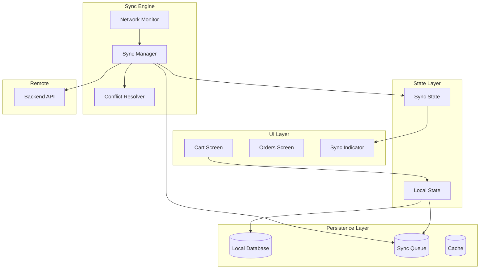
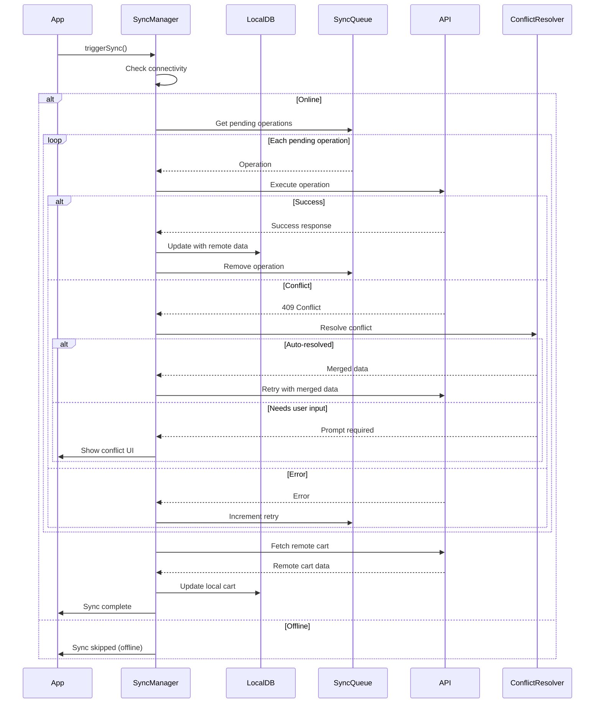

# Uber Cart System - Offline Behavior

## Overview

This document details the offline-first architecture for the Uber Cart Management System, covering local storage strategies, synchronization mechanisms, and conflict resolution patterns.

## Offline-First Principles

1. **Local-First**: All cart operations work locally first, then sync
2. **Optimistic UI**: Show changes immediately, reconcile later
3. **Graceful Degradation**: Core features work offline; enhanced features require connectivity
4. **Conflict Resolution**: Automatic resolution with user prompts for complex conflicts
5. **Transparent Sync**: Users know their sync status without cognitive overhead

## Architecture Overview



## Local Storage Design

### Database Schema (SQLite/Realm)

```typescript
// Local database entities

interface LocalCart {
  id: string;
  remoteId: string | null;  // null if not synced yet
  userId: string;
  status: CartStatus;
  fulfillmentType: FulfillmentType;
  deliveryAddressId: string | null;

  // Sync metadata
  isDirty: boolean;
  lastSyncedAt: number | null;
  localVersion: number;
  remoteVersion: number | null;

  // Timestamps
  createdAt: number;
  updatedAt: number;
}

interface LocalCartItem {
  id: string;
  remoteId: string | null;
  cartId: string;
  itemId: string;
  merchantId: string;

  // Item data
  name: string;
  description: string | null;
  imageUrl: string | null;
  quantity: number;
  unitPrice: number;
  currency: string;
  customizations: string;  // JSON
  specialNotes: string | null;

  // Sync metadata
  isDirty: boolean;
  pendingOperation: PendingOperationType | null;
  conflictData: string | null;  // JSON if conflict exists

  // Timestamps
  addedAt: number;
  updatedAt: number;
}

interface LocalOrder {
  id: string;
  orderNumber: string;
  status: OrderStatus;
  fulfillmentType: FulfillmentType;

  // Snapshot data (JSON strings for complex objects)
  merchantData: string;
  itemsData: string;
  pricingData: string;
  deliveryAddressData: string | null;
  fulfillmentData: string | null;

  // Timestamps
  createdAt: number;
  updatedAt: number;
  lastFetchedAt: number;
}

interface SyncQueueItem {
  id: string;
  entityType: 'CART' | 'CART_ITEM' | 'ORDER';
  entityId: string;
  operation: SyncOperation;
  payload: string;  // JSON

  // Retry logic
  attempts: number;
  maxAttempts: number;
  lastAttemptAt: number | null;
  nextRetryAt: number;

  // Status
  status: SyncQueueStatus;
  errorMessage: string | null;

  // Ordering
  priority: number;
  createdAt: number;
}

enum SyncOperation {
  CREATE = 'CREATE',
  UPDATE = 'UPDATE',
  DELETE = 'DELETE'
}

enum SyncQueueStatus {
  PENDING = 'PENDING',
  IN_PROGRESS = 'IN_PROGRESS',
  COMPLETED = 'COMPLETED',
  FAILED = 'FAILED',
  CONFLICT = 'CONFLICT'
}

enum PendingOperationType {
  ADD = 'ADD',
  UPDATE = 'UPDATE',
  DELETE = 'DELETE'
}
```

### Storage Implementation

```typescript
// Local storage service
class LocalStorageService {
  private db: SQLiteDatabase;

  // Cart operations
  async saveCart(cart: LocalCart): Promise<void> {
    await this.db.runAsync(
      `INSERT OR REPLACE INTO carts
       (id, remote_id, user_id, status, fulfillment_type, delivery_address_id,
        is_dirty, last_synced_at, local_version, remote_version, created_at, updated_at)
       VALUES (?, ?, ?, ?, ?, ?, ?, ?, ?, ?, ?, ?)`,
      [cart.id, cart.remoteId, cart.userId, cart.status, cart.fulfillmentType,
       cart.deliveryAddressId, cart.isDirty ? 1 : 0, cart.lastSyncedAt,
       cart.localVersion, cart.remoteVersion, cart.createdAt, cart.updatedAt]
    );
  }

  async getActiveCart(userId: string): Promise<LocalCart | null> {
    const result = await this.db.getFirstAsync<LocalCart>(
      `SELECT * FROM carts WHERE user_id = ? AND status = 'ACTIVE' LIMIT 1`,
      [userId]
    );
    return result || null;
  }

  async getCartItems(cartId: string): Promise<LocalCartItem[]> {
    return this.db.getAllAsync<LocalCartItem>(
      `SELECT * FROM cart_items WHERE cart_id = ? ORDER BY added_at`,
      [cartId]
    );
  }

  async getDirtyItems(cartId: string): Promise<LocalCartItem[]> {
    return this.db.getAllAsync<LocalCartItem>(
      `SELECT * FROM cart_items WHERE cart_id = ? AND is_dirty = 1`,
      [cartId]
    );
  }

  // Order operations
  async saveOrder(order: LocalOrder): Promise<void> {
    await this.db.runAsync(
      `INSERT OR REPLACE INTO orders
       (id, order_number, status, fulfillment_type, merchant_data, items_data,
        pricing_data, delivery_address_data, fulfillment_data, created_at, updated_at, last_fetched_at)
       VALUES (?, ?, ?, ?, ?, ?, ?, ?, ?, ?, ?, ?)`,
      [order.id, order.orderNumber, order.status, order.fulfillmentType,
       order.merchantData, order.itemsData, order.pricingData,
       order.deliveryAddressData, order.fulfillmentData,
       order.createdAt, order.updatedAt, order.lastFetchedAt]
    );
  }

  async getOrders(limit: number = 50): Promise<LocalOrder[]> {
    return this.db.getAllAsync<LocalOrder>(
      `SELECT * FROM orders ORDER BY created_at DESC LIMIT ?`,
      [limit]
    );
  }
}
```

## Sync Queue Management

### Queue Operations

```typescript
class SyncQueueManager {
  private storage: LocalStorageService;
  private api: APIClient;
  private isProcessing: boolean = false;

  // Enqueue an operation
  async enqueue(
    entityType: string,
    entityId: string,
    operation: SyncOperation,
    payload: object,
    priority: number = 5
  ): Promise<string> {
    const item: SyncQueueItem = {
      id: generateUUID(),
      entityType: entityType as any,
      entityId,
      operation,
      payload: JSON.stringify(payload),
      attempts: 0,
      maxAttempts: 3,
      lastAttemptAt: null,
      nextRetryAt: Date.now(),
      status: SyncQueueStatus.PENDING,
      errorMessage: null,
      priority,
      createdAt: Date.now(),
    };

    await this.storage.enqueueSyncItem(item);
    this.triggerProcessing();

    return item.id;
  }

  // Process queue
  async processQueue(): Promise<void> {
    if (this.isProcessing) return;

    const isOnline = await this.checkConnectivity();
    if (!isOnline) return;

    this.isProcessing = true;

    try {
      const pendingItems = await this.storage.getPendingSyncItems();

      for (const item of pendingItems) {
        if (item.attempts >= item.maxAttempts) {
          await this.markAsFailed(item, 'Max retry attempts exceeded');
          continue;
        }

        if (item.nextRetryAt > Date.now()) {
          continue;
        }

        await this.processItem(item);
      }
    } finally {
      this.isProcessing = false;
    }
  }

  private async processItem(item: SyncQueueItem): Promise<void> {
    await this.storage.updateSyncItemStatus(item.id, SyncQueueStatus.IN_PROGRESS);

    try {
      const payload = JSON.parse(item.payload);
      let result: any;

      switch (item.entityType) {
        case 'CART_ITEM':
          result = await this.syncCartItem(item.operation, payload);
          break;
        case 'CART':
          result = await this.syncCart(item.operation, payload);
          break;
      }

      await this.handleSyncSuccess(item, result);
    } catch (error) {
      await this.handleSyncError(item, error);
    }
  }

  private async syncCartItem(operation: SyncOperation, payload: any): Promise<any> {
    switch (operation) {
      case SyncOperation.CREATE:
        return this.api.cart.addItem(payload.cartId, payload.item);
      case SyncOperation.UPDATE:
        return this.api.cart.updateItem(payload.cartId, payload.itemId, payload.update);
      case SyncOperation.DELETE:
        return this.api.cart.removeItem(payload.cartId, payload.itemId);
    }
  }

  private async handleSyncSuccess(item: SyncQueueItem, result: any): Promise<void> {
    // Update local entity with remote data
    if (item.entityType === 'CART_ITEM' && result) {
      await this.storage.updateCartItemRemoteId(item.entityId, result.id);
      await this.storage.markCartItemClean(item.entityId);
    }

    // Remove from queue
    await this.storage.removeSyncItem(item.id);

    // Emit success event
    this.emit('syncSuccess', { item, result });
  }

  private async handleSyncError(item: SyncQueueItem, error: any): Promise<void> {
    const isConflict = error.code === 'CONFLICT' || error.status === 409;

    if (isConflict) {
      await this.storage.updateSyncItemStatus(item.id, SyncQueueStatus.CONFLICT, error.message);
      this.emit('syncConflict', { item, error });
      return;
    }

    // Calculate exponential backoff
    const backoffMs = Math.min(1000 * Math.pow(2, item.attempts), 60000);

    await this.storage.incrementSyncAttempt(item.id, Date.now() + backoffMs, error.message);

    this.emit('syncError', { item, error, nextRetry: Date.now() + backoffMs });
  }
}
```

## Conflict Resolution

### Conflict Types

```typescript
enum ConflictType {
  // Cart conflicts
  CART_VERSION_MISMATCH = 'CART_VERSION_MISMATCH',
  ITEM_MODIFIED_REMOTELY = 'ITEM_MODIFIED_REMOTELY',
  ITEM_DELETED_REMOTELY = 'ITEM_DELETED_REMOTELY',
  PRICE_CHANGED = 'PRICE_CHANGED',
  ITEM_UNAVAILABLE = 'ITEM_UNAVAILABLE',

  // Quantity conflicts
  QUANTITY_CONFLICT = 'QUANTITY_CONFLICT',

  // Order conflicts
  ORDER_STATUS_CHANGED = 'ORDER_STATUS_CHANGED'
}

interface ConflictData {
  type: ConflictType;
  localData: any;
  remoteData: any;
  baseData?: any;  // Last known good state
  timestamp: number;
}
```

### Resolution Strategies

```typescript
class ConflictResolver {
  // Automatic resolution rules
  private autoResolveRules: Map<ConflictType, ResolutionStrategy> = new Map([
    // Price changes: always accept remote (authoritative)
    [ConflictType.PRICE_CHANGED, ResolutionStrategy.REMOTE_WINS],

    // Item unavailable: prompt user
    [ConflictType.ITEM_UNAVAILABLE, ResolutionStrategy.PROMPT_USER],

    // Item deleted remotely: prompt user
    [ConflictType.ITEM_DELETED_REMOTELY, ResolutionStrategy.PROMPT_USER],

    // Quantity conflict: merge (sum deltas)
    [ConflictType.QUANTITY_CONFLICT, ResolutionStrategy.MERGE],

    // Version mismatch: attempt merge, fallback to prompt
    [ConflictType.CART_VERSION_MISMATCH, ResolutionStrategy.MERGE],
  ]);

  async resolve(conflict: ConflictData): Promise<ResolutionResult> {
    const strategy = this.autoResolveRules.get(conflict.type);

    switch (strategy) {
      case ResolutionStrategy.LOCAL_WINS:
        return this.applyLocalChanges(conflict);

      case ResolutionStrategy.REMOTE_WINS:
        return this.acceptRemoteChanges(conflict);

      case ResolutionStrategy.MERGE:
        return this.attemptMerge(conflict);

      case ResolutionStrategy.PROMPT_USER:
      default:
        return { requiresUserInput: true, conflict };
    }
  }

  private async attemptMerge(conflict: ConflictData): Promise<ResolutionResult> {
    if (conflict.type === ConflictType.QUANTITY_CONFLICT) {
      return this.mergeQuantities(conflict);
    }

    if (conflict.type === ConflictType.CART_VERSION_MISMATCH) {
      return this.mergeCartVersions(conflict);
    }

    // Can't auto-merge, prompt user
    return { requiresUserInput: true, conflict };
  }

  private mergeQuantities(conflict: ConflictData): ResolutionResult {
    const local = conflict.localData as { quantity: number };
    const remote = conflict.remoteData as { quantity: number };
    const base = (conflict.baseData as { quantity: number }) || { quantity: 0 };

    // Calculate deltas
    const localDelta = local.quantity - base.quantity;
    const remoteDelta = remote.quantity - base.quantity;

    // Merge: apply both deltas
    const mergedQuantity = base.quantity + localDelta + remoteDelta;

    // Ensure valid quantity
    const finalQuantity = Math.max(1, Math.min(99, mergedQuantity));

    return {
      requiresUserInput: false,
      resolved: true,
      mergedData: { quantity: finalQuantity },
      strategy: 'MERGE_QUANTITIES',
    };
  }

  private mergeCartVersions(conflict: ConflictData): ResolutionResult {
    const localItems = conflict.localData.items as LocalCartItem[];
    const remoteItems = conflict.remoteData.items as CartItem[];

    // Create lookup maps
    const remoteMap = new Map(remoteItems.map(i => [i.id, i]));
    const localMap = new Map(localItems.map(i => [i.remoteId || i.id, i]));

    const mergedItems: CartItem[] = [];
    const conflicts: ConflictData[] = [];

    // Process remote items
    for (const remoteItem of remoteItems) {
      const localItem = localMap.get(remoteItem.id);

      if (!localItem) {
        // Item only exists remotely, keep it
        mergedItems.push(remoteItem);
      } else if (!localItem.isDirty) {
        // Local not modified, use remote
        mergedItems.push(remoteItem);
      } else {
        // Both modified, need to resolve
        if (localItem.quantity !== remoteItem.quantity) {
          const itemConflict = this.mergeQuantities({
            type: ConflictType.QUANTITY_CONFLICT,
            localData: { quantity: localItem.quantity },
            remoteData: { quantity: remoteItem.quantity },
            baseData: { quantity: localItem.quantity }, // Simplified
            timestamp: Date.now(),
          });

          if (itemConflict.resolved) {
            mergedItems.push({
              ...remoteItem,
              quantity: itemConflict.mergedData.quantity,
            });
          } else {
            conflicts.push({
              type: ConflictType.ITEM_MODIFIED_REMOTELY,
              localData: localItem,
              remoteData: remoteItem,
              timestamp: Date.now(),
            });
          }
        } else {
          mergedItems.push(remoteItem);
        }
      }
    }

    // Add local-only items (not yet synced)
    for (const localItem of localItems) {
      if (!localItem.remoteId && localItem.pendingOperation === 'ADD') {
        mergedItems.push(this.localToRemoteItem(localItem));
      }
    }

    if (conflicts.length > 0) {
      return {
        requiresUserInput: true,
        partiallyResolved: true,
        mergedData: { items: mergedItems },
        remainingConflicts: conflicts,
      };
    }

    return {
      requiresUserInput: false,
      resolved: true,
      mergedData: { items: mergedItems },
      strategy: 'MERGE_CART_VERSIONS',
    };
  }
}

enum ResolutionStrategy {
  LOCAL_WINS = 'LOCAL_WINS',
  REMOTE_WINS = 'REMOTE_WINS',
  MERGE = 'MERGE',
  PROMPT_USER = 'PROMPT_USER'
}

interface ResolutionResult {
  requiresUserInput: boolean;
  resolved?: boolean;
  partiallyResolved?: boolean;
  mergedData?: any;
  remainingConflicts?: ConflictData[];
  strategy?: string;
  conflict?: ConflictData;
}
```

## Sync Manager

### Full Sync Flow



### Implementation

```typescript
class SyncManager {
  private storage: LocalStorageService;
  private queue: SyncQueueManager;
  private resolver: ConflictResolver;
  private api: APIClient;
  private networkMonitor: NetworkMonitor;

  private syncState: SyncState = {
    isOnline: true,
    isSyncing: false,
    pendingChanges: 0,
    lastSyncTimestamp: 0,
    syncErrors: [],
  };

  constructor(deps: SyncManagerDeps) {
    this.storage = deps.storage;
    this.queue = deps.queue;
    this.resolver = deps.resolver;
    this.api = deps.api;
    this.networkMonitor = deps.networkMonitor;

    // Listen for network changes
    this.networkMonitor.on('online', () => this.handleOnline());
    this.networkMonitor.on('offline', () => this.handleOffline());
  }

  async sync(): Promise<SyncResult> {
    if (this.syncState.isSyncing) {
      return { status: 'ALREADY_SYNCING' };
    }

    if (!this.syncState.isOnline) {
      return { status: 'OFFLINE' };
    }

    this.updateSyncState({ isSyncing: true });

    try {
      // 1. Push local changes
      const pushResult = await this.pushChanges();

      // 2. Pull remote changes
      const pullResult = await this.pullChanges();

      // 3. Reconcile
      const reconcileResult = await this.reconcile(pullResult);

      this.updateSyncState({
        isSyncing: false,
        lastSyncTimestamp: Date.now(),
        pendingChanges: await this.queue.getPendingCount(),
      });

      return {
        status: 'SUCCESS',
        pushed: pushResult,
        pulled: pullResult,
        conflicts: reconcileResult.conflicts,
      };
    } catch (error) {
      this.updateSyncState({
        isSyncing: false,
        syncErrors: [...this.syncState.syncErrors, error],
      });

      return { status: 'ERROR', error };
    }
  }

  private async pushChanges(): Promise<PushResult> {
    await this.queue.processQueue();

    const remaining = await this.queue.getPendingCount();
    const conflicts = await this.queue.getConflicts();

    return { remaining, conflicts };
  }

  private async pullChanges(): Promise<PullResult> {
    // Fetch current cart from server
    const remoteCart = await this.api.cart.getCurrent();

    // Fetch recent orders
    const remoteOrders = await this.api.orders.list({ limit: 20 });

    return { cart: remoteCart, orders: remoteOrders.orders };
  }

  private async reconcile(pullResult: PullResult): Promise<ReconcileResult> {
    const conflicts: ConflictData[] = [];

    // Reconcile cart
    if (pullResult.cart) {
      const localCart = await this.storage.getActiveCart(this.userId);

      if (localCart && localCart.isDirty) {
        // Local has unsaved changes, check for conflicts
        const cartConflict = await this.checkCartConflict(localCart, pullResult.cart);

        if (cartConflict) {
          const resolution = await this.resolver.resolve(cartConflict);

          if (resolution.resolved) {
            await this.applyResolution(resolution);
          } else {
            conflicts.push(cartConflict);
          }
        }
      } else {
        // No local changes, just update
        await this.updateLocalCart(pullResult.cart);
      }
    }

    // Update orders (read-only, no conflicts)
    for (const order of pullResult.orders) {
      await this.storage.saveOrder(this.remoteToLocalOrder(order));
    }

    return { conflicts };
  }

  private handleOnline(): void {
    this.updateSyncState({ isOnline: true });

    // Trigger sync after a short delay
    setTimeout(() => this.sync(), 1000);
  }

  private handleOffline(): void {
    this.updateSyncState({ isOnline: false });
  }
}
```

## UI Integration

### Sync Status Indicator

```typescript
interface SyncIndicatorProps {
  syncState: SyncState;
  onRetry: () => void;
}

const SyncIndicator: FC<SyncIndicatorProps> = ({ syncState, onRetry }) => {
  const { isOnline, isSyncing, pendingChanges, lastSyncTimestamp, syncErrors } = syncState;

  if (!isOnline) {
    return (
      <OfflineBanner>
        <OfflineIcon />
        <Text>You're offline. Changes saved locally.</Text>
      </OfflineBanner>
    );
  }

  if (isSyncing) {
    return (
      <SyncingBanner>
        <Spinner size="small" />
        <Text>Syncing...</Text>
      </SyncingBanner>
    );
  }

  if (syncErrors.length > 0) {
    return (
      <ErrorBanner>
        <ErrorIcon />
        <Text>Sync failed. {pendingChanges} changes pending.</Text>
        <RetryButton onPress={onRetry}>Retry</RetryButton>
      </ErrorBanner>
    );
  }

  if (pendingChanges > 0) {
    return (
      <PendingBanner>
        <CloudIcon />
        <Text>{pendingChanges} changes syncing...</Text>
      </PendingBanner>
    );
  }

  return null; // All synced, no indicator needed
};
```

### Conflict Resolution UI

```typescript
interface ConflictResolutionModalProps {
  conflict: ConflictData;
  onResolve: (resolution: 'LOCAL' | 'REMOTE' | 'MERGE') => void;
  onDismiss: () => void;
}

const ConflictResolutionModal: FC<ConflictResolutionModalProps> = ({
  conflict,
  onResolve,
  onDismiss,
}) => {
  const renderConflictContent = () => {
    switch (conflict.type) {
      case ConflictType.ITEM_DELETED_REMOTELY:
        return (
          <>
            <Title>Item No Longer Available</Title>
            <Description>
              {conflict.localData.name} has been removed from the menu.
            </Description>
            <Actions>
              <Button onPress={() => onResolve('REMOTE')}>
                Remove from Cart
              </Button>
              <Button variant="secondary" onPress={onDismiss}>
                Find Similar Items
              </Button>
            </Actions>
          </>
        );

      case ConflictType.PRICE_CHANGED:
        return (
          <>
            <Title>Price Updated</Title>
            <Description>
              The price for {conflict.localData.name} has changed.
            </Description>
            <PriceComparison>
              <OldPrice>{formatPrice(conflict.localData.price)}</OldPrice>
              <Arrow />
              <NewPrice>{formatPrice(conflict.remoteData.price)}</NewPrice>
            </PriceComparison>
            <Actions>
              <Button onPress={() => onResolve('REMOTE')}>
                Accept New Price
              </Button>
              <Button variant="secondary" onPress={() => onResolve('LOCAL')}>
                Remove Item
              </Button>
            </Actions>
          </>
        );

      case ConflictType.QUANTITY_CONFLICT:
        return (
          <>
            <Title>Quantity Changed</Title>
            <Description>
              {conflict.localData.name} was also modified on another device.
            </Description>
            <QuantityComparison>
              <Column>
                <Label>Your change</Label>
                <Value>{conflict.localData.quantity}</Value>
              </Column>
              <Column>
                <Label>Other device</Label>
                <Value>{conflict.remoteData.quantity}</Value>
              </Column>
            </QuantityComparison>
            <Actions>
              <Button onPress={() => onResolve('LOCAL')}>
                Use {conflict.localData.quantity}
              </Button>
              <Button onPress={() => onResolve('REMOTE')}>
                Use {conflict.remoteData.quantity}
              </Button>
            </Actions>
          </>
        );
    }
  };

  return (
    <Modal visible onDismiss={onDismiss}>
      <ModalContent>{renderConflictContent()}</ModalContent>
    </Modal>
  );
};
```

## Network Monitoring

```typescript
class NetworkMonitor extends EventEmitter {
  private isOnline: boolean = true;
  private connectionType: ConnectionType = 'unknown';

  constructor() {
    super();
    this.initializeMonitoring();
  }

  private initializeMonitoring(): void {
    // React Native NetInfo
    NetInfo.addEventListener(state => {
      const wasOnline = this.isOnline;
      this.isOnline = state.isConnected ?? false;
      this.connectionType = state.type as ConnectionType;

      if (!wasOnline && this.isOnline) {
        this.emit('online');
      } else if (wasOnline && !this.isOnline) {
        this.emit('offline');
      }

      this.emit('change', {
        isOnline: this.isOnline,
        connectionType: this.connectionType,
      });
    });
  }

  async checkConnectivity(): Promise<boolean> {
    try {
      const response = await fetch('https://api.uber.com/health', {
        method: 'HEAD',
        timeout: 5000,
      });
      return response.ok;
    } catch {
      return false;
    }
  }

  getStatus(): NetworkStatus {
    return {
      isOnline: this.isOnline,
      connectionType: this.connectionType,
      isMetered: this.connectionType === 'cellular',
    };
  }
}

type ConnectionType = 'wifi' | 'cellular' | 'ethernet' | 'unknown' | 'none';

interface NetworkStatus {
  isOnline: boolean;
  connectionType: ConnectionType;
  isMetered: boolean;
}
```

## Cache Invalidation

```typescript
class CacheManager {
  private cache: Map<string, CacheEntry> = new Map();
  private storage: AsyncStorage;

  // TTL values
  private readonly TTL = {
    CART: 30 * 60 * 1000,        // 30 minutes
    MENU_ITEMS: 15 * 60 * 1000,  // 15 minutes
    ORDERS: 5 * 60 * 1000,       // 5 minutes for active orders
    ORDER_HISTORY: 60 * 60 * 1000, // 1 hour
  };

  async get<T>(key: string): Promise<T | null> {
    // Check memory cache
    const memEntry = this.cache.get(key);
    if (memEntry && !this.isExpired(memEntry)) {
      return memEntry.data as T;
    }

    // Check persistent cache
    const stored = await this.storage.getItem(key);
    if (stored) {
      const entry = JSON.parse(stored) as CacheEntry;
      if (!this.isExpired(entry)) {
        // Restore to memory cache
        this.cache.set(key, entry);
        return entry.data as T;
      } else {
        // Expired, remove
        await this.storage.removeItem(key);
      }
    }

    return null;
  }

  async set<T>(key: string, data: T, ttlMs: number): Promise<void> {
    const entry: CacheEntry = {
      data,
      createdAt: Date.now(),
      expiresAt: Date.now() + ttlMs,
    };

    this.cache.set(key, entry);
    await this.storage.setItem(key, JSON.stringify(entry));
  }

  async invalidate(pattern: string): Promise<void> {
    // Invalidate matching keys
    for (const key of this.cache.keys()) {
      if (key.startsWith(pattern) || key.match(pattern)) {
        this.cache.delete(key);
      }
    }

    // Also invalidate from storage
    const allKeys = await this.storage.getAllKeys();
    const keysToRemove = allKeys.filter(k => k.startsWith(pattern));
    await this.storage.multiRemove(keysToRemove);
  }

  private isExpired(entry: CacheEntry): boolean {
    return Date.now() > entry.expiresAt;
  }
}

interface CacheEntry {
  data: any;
  createdAt: number;
  expiresAt: number;
}
```

## Offline Capabilities Matrix

| Feature | Offline Support | Notes |
|---------|-----------------|-------|
| View Cart | Full | Cached locally |
| Add to Cart | Full | Queued for sync |
| Update Quantity | Full | Queued for sync |
| Remove Item | Full | Queued for sync |
| View Active Orders | Partial | Stale data shown |
| View Order History | Full | Cached locally |
| Place Order (Checkout) | None | Requires connectivity |
| Track Order | None | Real-time data required |
| Cancel Order | None | Requires connectivity |
| Apply Promo | None | Validation required |

## Testing Strategies

```typescript
describe('Offline Behavior', () => {
  describe('Cart Operations', () => {
    it('should add item to local cart when offline', async () => {
      await networkMonitor.simulateOffline();

      await cartManager.addItem(testItem);

      const localCart = await storage.getActiveCart(userId);
      expect(localCart.items).toContainEqual(expect.objectContaining({
        itemId: testItem.id,
        isDirty: true,
      }));
    });

    it('should sync pending items when back online', async () => {
      await networkMonitor.simulateOffline();
      await cartManager.addItem(testItem);

      await networkMonitor.simulateOnline();
      await syncManager.sync();

      const localCart = await storage.getActiveCart(userId);
      expect(localCart.items[0].isDirty).toBe(false);
      expect(localCart.items[0].remoteId).toBeDefined();
    });
  });

  describe('Conflict Resolution', () => {
    it('should merge quantity conflicts automatically', async () => {
      const conflict: ConflictData = {
        type: ConflictType.QUANTITY_CONFLICT,
        localData: { quantity: 5 },
        remoteData: { quantity: 3 },
        baseData: { quantity: 2 },
        timestamp: Date.now(),
      };

      const result = await resolver.resolve(conflict);

      expect(result.resolved).toBe(true);
      expect(result.mergedData.quantity).toBe(6); // 2 + 3 + 1 = 6
    });

    it('should prompt user for item deletion conflicts', async () => {
      const conflict: ConflictData = {
        type: ConflictType.ITEM_DELETED_REMOTELY,
        localData: { id: 'item1', name: 'Test Item' },
        remoteData: null,
        timestamp: Date.now(),
      };

      const result = await resolver.resolve(conflict);

      expect(result.requiresUserInput).toBe(true);
    });
  });
});
```

