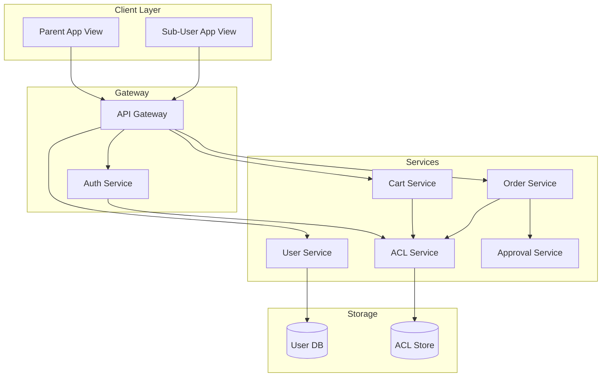
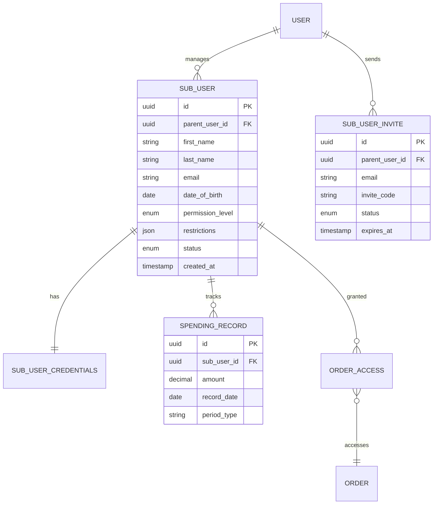
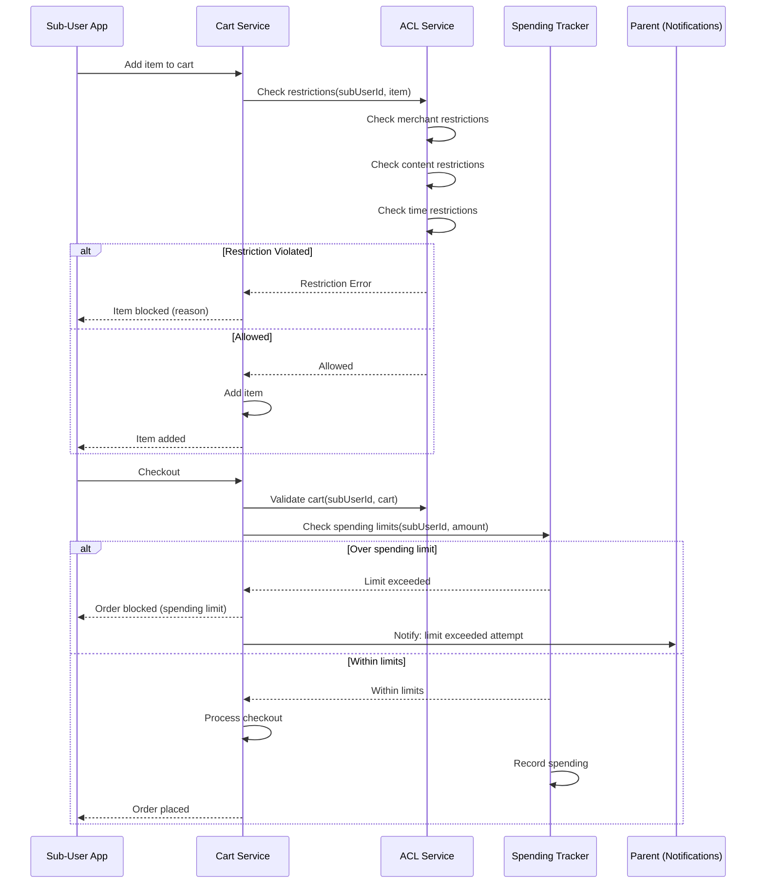
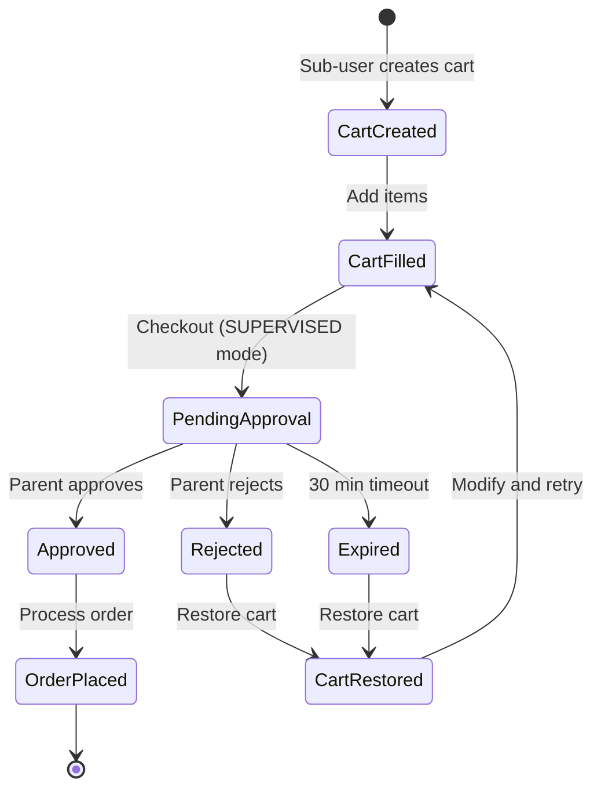

# Uber Cart System - Sub-User Access (Family Accounts)

## Overview

This document details the design for sub-user (teens/family) access patterns in the Uber Cart Management System. It covers parent-child user relationships, Access Control Lists (ACL), permission levels, and read-only order visibility.

## Use Cases

### Primary Use Cases

1. **Teen Accounts**: Parents create accounts for teenage children with spending controls
2. **Family Visibility**: Parents can view orders placed by family members
3. **Supervised Ordering**: Sub-users can place orders requiring parental approval
4. **Spending Limits**: Enforce daily/weekly/monthly spending caps
5. **Merchant Restrictions**: Limit ordering to specific merchants or categories

### User Stories

- As a **parent**, I want to create a sub-account for my teen so they can order food independently
- As a **parent**, I want to set spending limits so my teen doesn't overspend
- As a **parent**, I want to view my teen's order history for oversight
- As a **teen**, I want to place orders using my parent's payment method
- As a **parent**, I want to restrict my teen to only pickup orders (no delivery to unknown addresses)

## Architecture

### System Components



### User Relationship Model



## Permission Levels

### Permission Hierarchy

```typescript
enum SubUserPermissionLevel {
  VIEW_ONLY = 'VIEW_ONLY',     // Level 0: Can only view parent's orders
  LIMITED = 'LIMITED',          // Level 1: Can order with restrictions
  SUPERVISED = 'SUPERVISED',    // Level 2: Can order, requires approval
  FULL = 'FULL'                 // Level 3: Full ordering capabilities
}

interface PermissionCapabilities {
  [SubUserPermissionLevel.VIEW_ONLY]: {
    canViewParentOrders: true;
    canViewOwnOrders: true;
    canPlaceOrders: false;
    canModifyOrders: false;
    canCancelOrders: false;
    requiresApproval: false;
  };

  [SubUserPermissionLevel.LIMITED]: {
    canViewParentOrders: false;
    canViewOwnOrders: true;
    canPlaceOrders: true;  // Subject to restrictions
    canModifyOrders: false;
    canCancelOrders: true; // Own orders only
    requiresApproval: false;
  };

  [SubUserPermissionLevel.SUPERVISED]: {
    canViewParentOrders: false;
    canViewOwnOrders: true;
    canPlaceOrders: true;
    canModifyOrders: true;
    canCancelOrders: true;
    requiresApproval: true; // Orders need parent approval
  };

  [SubUserPermissionLevel.FULL]: {
    canViewParentOrders: true;
    canViewOwnOrders: true;
    canPlaceOrders: true;
    canModifyOrders: true;
    canCancelOrders: true;
    requiresApproval: false;
  };
}
```

### Capability Matrix

| Capability | VIEW_ONLY | LIMITED | SUPERVISED | FULL |
|------------|-----------|---------|------------|------|
| View own orders | ✓ | ✓ | ✓ | ✓ |
| View parent orders | ✓ | ✗ | ✗ | ✓ |
| Place orders | ✗ | ✓* | ✓** | ✓ |
| Modify orders | ✗ | ✗ | ✓ | ✓ |
| Cancel own orders | ✗ | ✓ | ✓ | ✓ |
| Add payment methods | ✗ | ✗ | ✗ | ✗ |
| Change addresses | ✗ | ✗ | ✗ | ✓ |

\* Subject to spending limits and restrictions
\*\* Requires parent approval before order is placed

## Restrictions System

### Restriction Types

```typescript
interface SubUserRestrictions {
  // Spending Limits
  spending: SpendingRestrictions;

  // Merchant Restrictions
  merchants: MerchantRestrictions;

  // Fulfillment Restrictions
  fulfillment: FulfillmentRestrictions;

  // Time Restrictions
  time: TimeRestrictions;

  // Content Restrictions
  content: ContentRestrictions;
}

interface SpendingRestrictions {
  perOrderLimit?: Money;
  dailyLimit?: Money;
  weeklyLimit?: Money;
  monthlyLimit?: Money;

  // Enforcement
  blockWhenExceeded: boolean;  // vs. notify parent
}

interface MerchantRestrictions {
  mode: 'ALLOWLIST' | 'BLOCKLIST';
  merchantIds?: string[];
  categoryAllowlist?: string[];  // e.g., ["restaurants", "grocery"]
  categoryBlocklist?: string[];  // e.g., ["alcohol", "tobacco"]
}

interface FulfillmentRestrictions {
  allowedTypes: FulfillmentType[];
  deliveryAddressIds?: string[];  // Specific allowed addresses
  allowNewAddresses: boolean;
  maxDeliveryRadius?: number;  // meters from home
}

interface TimeRestrictions {
  orderingHours: {
    start: string;  // "08:00"
    end: string;    // "22:00"
  };
  allowedDays: DayOfWeek[];
  timezone: string;
}

interface ContentRestrictions {
  blockAlcohol: boolean;
  blockTobacco: boolean;
  blockMatureContent: boolean;
  customBlockedKeywords?: string[];
}
```

### Restriction Enforcement Flow



## Access Control Implementation

### ACL Service

```go
type ACLService interface {
    // Check if sub-user can perform action
    CanPerformAction(ctx context.Context, subUserID, action string, resource Resource) (*ACLDecision, error)

    // Check item-level restrictions
    CanAddItem(ctx context.Context, subUserID string, item *CartItem) (*ACLDecision, error)

    // Check order visibility
    CanViewOrder(ctx context.Context, userID, orderID string) (bool, error)

    // Get accessible orders for sub-user
    GetAccessibleOrders(ctx context.Context, subUserID string) ([]string, error)

    // Grant order access
    GrantOrderAccess(ctx context.Context, parentUserID, subUserID, orderID string, level AccessLevel) error
}

type ACLDecision struct {
    Allowed bool
    Reason  string
    Details map[string]interface{}
}

type Resource struct {
    Type string // "order", "cart", "merchant", "item"
    ID   string
}

// ACL implementation
type aclServiceImpl struct {
    userRepo       UserRepository
    subUserRepo    SubUserRepository
    restrictionSvc RestrictionService
    spendingTracker SpendingTracker
}

func (s *aclServiceImpl) CanAddItem(ctx context.Context, subUserID string, item *CartItem) (*ACLDecision, error) {
    subUser, err := s.subUserRepo.GetByID(ctx, subUserID)
    if err != nil {
        return nil, err
    }

    restrictions := subUser.Restrictions

    // Check merchant restrictions
    if !s.checkMerchantAllowed(restrictions.Merchants, item.MerchantID) {
        return &ACLDecision{
            Allowed: false,
            Reason:  "MERCHANT_BLOCKED",
            Details: map[string]interface{}{"merchant_id": item.MerchantID},
        }, nil
    }

    // Check content restrictions
    if violation := s.checkContentRestrictions(restrictions.Content, item); violation != "" {
        return &ACLDecision{
            Allowed: false,
            Reason:  "CONTENT_RESTRICTED",
            Details: map[string]interface{}{"violation": violation},
        }, nil
    }

    // Check time restrictions
    if !s.checkTimeAllowed(restrictions.Time) {
        return &ACLDecision{
            Allowed: false,
            Reason:  "OUTSIDE_ALLOWED_HOURS",
            Details: map[string]interface{}{
                "allowed_start": restrictions.Time.OrderingHours.Start,
                "allowed_end":   restrictions.Time.OrderingHours.End,
            },
        }, nil
    }

    return &ACLDecision{Allowed: true}, nil
}
```

### Order Visibility Control

```go
// Order access control for sub-users
type OrderAccessController struct {
    orderRepo    OrderRepository
    subUserRepo  SubUserRepository
    accessRepo   OrderAccessRepository
}

func (c *OrderAccessController) GetOrdersForSubUser(
    ctx context.Context,
    requestingUserID string,
    subUserID string,
) ([]*Order, error) {
    // Verify requesting user is the parent
    subUser, err := c.subUserRepo.GetByID(ctx, subUserID)
    if err != nil {
        return nil, err
    }

    if subUser.ParentUserID != requestingUserID {
        return nil, ErrUnauthorized
    }

    // Get sub-user's own orders
    orders, err := c.orderRepo.GetByUserID(ctx, subUserID)
    if err != nil {
        return nil, err
    }

    return orders, nil
}

func (c *OrderAccessController) CanSubUserViewOrder(
    ctx context.Context,
    subUserID string,
    orderID string,
) (bool, AccessLevel, error) {
    subUser, err := c.subUserRepo.GetByID(ctx, subUserID)
    if err != nil {
        return false, "", err
    }

    order, err := c.orderRepo.GetByID(ctx, orderID)
    if err != nil {
        return false, "", err
    }

    // Sub-user can always view their own orders
    if order.UserID == subUserID {
        return true, AccessLevelFull, nil
    }

    // Check if sub-user has VIEW_ONLY or FULL permission for parent orders
    if subUser.CanViewParentOrders && order.UserID == subUser.ParentUserID {
        return true, AccessLevelReadOnly, nil
    }

    // Check explicit access grants
    access, err := c.accessRepo.GetAccess(ctx, subUserID, orderID)
    if err != nil && err != ErrNotFound {
        return false, "", err
    }

    if access != nil {
        return true, access.Level, nil
    }

    return false, "", nil
}
```

## Spending Tracker

### Implementation

```go
type SpendingTracker interface {
    // Check if amount is within limits
    CheckSpendingLimit(ctx context.Context, subUserID string, amount Money) (*SpendingCheckResult, error)

    // Record spending
    RecordSpending(ctx context.Context, subUserID string, orderID string, amount Money) error

    // Get spending summary
    GetSpendingSummary(ctx context.Context, subUserID string) (*SpendingSummary, error)

    // Rollback spending (for cancelled orders)
    RollbackSpending(ctx context.Context, subUserID string, orderID string) error
}

type SpendingCheckResult struct {
    Allowed           bool
    RemainingDaily    Money
    RemainingWeekly   Money
    RemainingMonthly  Money
    ExceededLimit     string  // "DAILY", "WEEKLY", "MONTHLY", "PER_ORDER"
}

type SpendingSummary struct {
    SubUserID      string
    TodaySpending  Money
    WeekSpending   Money
    MonthSpending  Money

    DailyLimit     Money
    WeeklyLimit    Money
    MonthlyLimit   Money

    RecentOrders   []SpendingRecord
}

// Redis-based spending tracker for real-time limits
type redisSpendingTracker struct {
    redis   *redis.Client
    db      SpendingRepository
}

func (t *redisSpendingTracker) CheckSpendingLimit(
    ctx context.Context,
    subUserID string,
    amount Money,
) (*SpendingCheckResult, error) {
    restrictions, err := t.getRestrictions(ctx, subUserID)
    if err != nil {
        return nil, err
    }

    result := &SpendingCheckResult{Allowed: true}

    // Check per-order limit
    if restrictions.PerOrderLimit != nil {
        if amount.Amount > restrictions.PerOrderLimit.Amount {
            result.Allowed = false
            result.ExceededLimit = "PER_ORDER"
            return result, nil
        }
    }

    // Check daily limit
    if restrictions.DailyLimit != nil {
        todayKey := fmt.Sprintf("spending:%s:daily:%s", subUserID, time.Now().Format("2006-01-02"))
        todaySpending, _ := t.redis.Get(ctx, todayKey).Int64()

        result.RemainingDaily = Money{
            Amount:   restrictions.DailyLimit.Amount - todaySpending,
            Currency: restrictions.DailyLimit.Currency,
        }

        if todaySpending+amount.Amount > restrictions.DailyLimit.Amount {
            result.Allowed = false
            result.ExceededLimit = "DAILY"
            return result, nil
        }
    }

    // Similar checks for weekly and monthly...

    return result, nil
}

func (t *redisSpendingTracker) RecordSpending(
    ctx context.Context,
    subUserID string,
    orderID string,
    amount Money,
) error {
    now := time.Now()

    pipe := t.redis.Pipeline()

    // Daily spending
    dailyKey := fmt.Sprintf("spending:%s:daily:%s", subUserID, now.Format("2006-01-02"))
    pipe.IncrBy(ctx, dailyKey, amount.Amount)
    pipe.ExpireAt(ctx, dailyKey, endOfDay(now))

    // Weekly spending
    weeklyKey := fmt.Sprintf("spending:%s:weekly:%s", subUserID, startOfWeek(now).Format("2006-01-02"))
    pipe.IncrBy(ctx, weeklyKey, amount.Amount)
    pipe.ExpireAt(ctx, weeklyKey, endOfWeek(now))

    // Monthly spending
    monthlyKey := fmt.Sprintf("spending:%s:monthly:%s", subUserID, now.Format("2006-01"))
    pipe.IncrBy(ctx, monthlyKey, amount.Amount)
    pipe.ExpireAt(ctx, monthlyKey, endOfMonth(now))

    _, err := pipe.Exec(ctx)
    if err != nil {
        return err
    }

    // Also persist to database for history
    return t.db.RecordSpending(ctx, subUserID, orderID, amount, now)
}
```

## Approval Workflow

### Supervised Order Flow



### Approval Service

```go
type ApprovalService interface {
    // Request approval for order
    RequestApproval(ctx context.Context, req *ApprovalRequest) (*PendingApproval, error)

    // Parent actions
    ApproveOrder(ctx context.Context, approvalID string, parentUserID string) (*Order, error)
    RejectOrder(ctx context.Context, approvalID string, parentUserID string, reason string) error

    // Get pending approvals for parent
    GetPendingApprovals(ctx context.Context, parentUserID string) ([]*PendingApproval, error)
}

type ApprovalRequest struct {
    SubUserID      string
    CartID         string
    PaymentMethod  PaymentMethodID
    FulfillmentReq FulfillmentRequest
}

type PendingApproval struct {
    ID           string
    SubUserID    string
    ParentUserID string
    CartSnapshot Cart
    RequestedAt  time.Time
    ExpiresAt    time.Time
    Status       ApprovalStatus
}

type ApprovalStatus string

const (
    ApprovalPending  ApprovalStatus = "PENDING"
    ApprovalApproved ApprovalStatus = "APPROVED"
    ApprovalRejected ApprovalStatus = "REJECTED"
    ApprovalExpired  ApprovalStatus = "EXPIRED"
)

// Implementation
func (s *approvalService) RequestApproval(ctx context.Context, req *ApprovalRequest) (*PendingApproval, error) {
    subUser, err := s.subUserRepo.GetByID(ctx, req.SubUserID)
    if err != nil {
        return nil, err
    }

    // Verify sub-user requires approval
    if subUser.PermissionLevel != PermissionSupervised {
        return nil, ErrApprovalNotRequired
    }

    // Get cart and create snapshot
    cart, err := s.cartService.GetCart(ctx, req.CartID)
    if err != nil {
        return nil, err
    }

    // Lock cart during approval process
    if err := s.cartService.LockCart(ctx, req.CartID); err != nil {
        return nil, err
    }

    // Create pending approval
    approval := &PendingApproval{
        ID:           uuid.New().String(),
        SubUserID:    req.SubUserID,
        ParentUserID: subUser.ParentUserID,
        CartSnapshot: *cart,
        RequestedAt:  time.Now(),
        ExpiresAt:    time.Now().Add(30 * time.Minute),
        Status:       ApprovalPending,
    }

    if err := s.approvalRepo.Create(ctx, approval); err != nil {
        return nil, err
    }

    // Notify parent
    s.notificationService.NotifyParent(ctx, subUser.ParentUserID, &NotificationRequest{
        Type:    NotificationApprovalRequest,
        Title:   fmt.Sprintf("%s wants to place an order", subUser.DisplayName),
        Body:    fmt.Sprintf("Order total: %s", cart.Pricing.Total.Display),
        Data:    map[string]string{"approval_id": approval.ID},
        Actions: []string{"Approve", "Reject"},
    })

    return approval, nil
}
```

## Parent Dashboard

### UI Components

```typescript
// Parent Dashboard Types
interface ParentDashboard {
  subUsers: SubUserSummary[];
  pendingApprovals: PendingApproval[];
  recentFamilyOrders: Order[];
  spendingSummary: FamilySpendingSummary;
}

interface SubUserSummary {
  id: string;
  displayName: string;
  avatarUrl: string;
  permissionLevel: SubUserPermissionLevel;
  status: SubUserStatus;

  // Spending
  todaySpending: Money;
  weekSpending: Money;
  monthSpending: Money;

  // Limits
  dailyLimit?: Money;
  weeklyLimit?: Money;
  monthlyLimit?: Money;

  // Recent activity
  lastOrderAt?: DateTime;
  orderCountThisWeek: number;
}

interface FamilySpendingSummary {
  totalThisMonth: Money;
  bySubUser: {
    subUserId: string;
    displayName: string;
    amount: Money;
    percentage: number;
  }[];
  trend: 'UP' | 'DOWN' | 'STABLE';
  comparedToLastMonth: number; // percentage change
}

// Parent Dashboard Screen
const ParentDashboardScreen: FC = () => {
  const { data: dashboard } = useParentDashboard();

  return (
    <Screen>
      {/* Pending Approvals Banner */}
      {dashboard.pendingApprovals.length > 0 && (
        <ApprovalsBanner
          count={dashboard.pendingApprovals.length}
          onPress={() => navigate('PendingApprovals')}
        />
      )}

      {/* Family Members */}
      <Section title="Family Members">
        {dashboard.subUsers.map(subUser => (
          <SubUserCard
            key={subUser.id}
            subUser={subUser}
            onPress={() => navigate('SubUserDetail', { id: subUser.id })}
          />
        ))}
        <AddSubUserButton onPress={() => navigate('AddSubUser')} />
      </Section>

      {/* Spending Overview */}
      <Section title="This Month's Spending">
        <SpendingChart data={dashboard.spendingSummary} />
      </Section>

      {/* Recent Family Orders */}
      <Section title="Recent Orders">
        {dashboard.recentFamilyOrders.map(order => (
          <OrderCard
            key={order.id}
            order={order}
            showSubUserName={true}
          />
        ))}
      </Section>
    </Screen>
  );
};
```

## Notifications

### Notification Types

```typescript
enum FamilyNotificationType {
  // Approval workflow
  APPROVAL_REQUESTED = 'APPROVAL_REQUESTED',
  APPROVAL_APPROVED = 'APPROVAL_APPROVED',
  APPROVAL_REJECTED = 'APPROVAL_REJECTED',
  APPROVAL_EXPIRED = 'APPROVAL_EXPIRED',

  // Spending alerts
  SPENDING_LIMIT_APPROACHING = 'SPENDING_LIMIT_APPROACHING',
  SPENDING_LIMIT_EXCEEDED = 'SPENDING_LIMIT_EXCEEDED',

  // Order updates (to parent)
  SUB_USER_ORDER_PLACED = 'SUB_USER_ORDER_PLACED',
  SUB_USER_ORDER_DELIVERED = 'SUB_USER_ORDER_DELIVERED',

  // Restriction violations
  RESTRICTION_VIOLATION_ATTEMPT = 'RESTRICTION_VIOLATION_ATTEMPT',
}

interface FamilyNotification {
  type: FamilyNotificationType;
  subUserId: string;
  subUserName: string;

  // Context
  orderId?: string;
  approvalId?: string;
  amount?: Money;

  // Display
  title: string;
  body: string;

  // Actions
  actions?: NotificationAction[];
}

const NOTIFICATION_TEMPLATES = {
  [FamilyNotificationType.APPROVAL_REQUESTED]: {
    title: (subUserName: string) => `${subUserName} wants to order`,
    body: (data: any) => `${data.merchantName} - ${data.total.display}`,
    actions: ['Approve', 'Reject', 'View Details'],
  },

  [FamilyNotificationType.SPENDING_LIMIT_APPROACHING]: {
    title: (subUserName: string) => `${subUserName} approaching spending limit`,
    body: (data: any) => `${data.percentage}% of daily limit used`,
    actions: ['Adjust Limit', 'Dismiss'],
  },
};
```

## Database Schema

```sql
-- Sub-user invites
CREATE TABLE sub_user_invites (
    id UUID PRIMARY KEY DEFAULT uuid_generate_v4(),
    parent_user_id UUID NOT NULL REFERENCES users(id),
    email VARCHAR(255) NOT NULL,
    invite_code VARCHAR(50) UNIQUE NOT NULL,
    permission_level VARCHAR(20) NOT NULL,
    restrictions JSONB DEFAULT '{}',
    status VARCHAR(20) NOT NULL DEFAULT 'PENDING',
    expires_at TIMESTAMP WITH TIME ZONE NOT NULL,
    accepted_at TIMESTAMP WITH TIME ZONE,
    created_at TIMESTAMP WITH TIME ZONE DEFAULT NOW()
);

-- Spending records
CREATE TABLE spending_records (
    id UUID PRIMARY KEY DEFAULT uuid_generate_v4(),
    sub_user_id UUID NOT NULL REFERENCES sub_users(id),
    order_id UUID REFERENCES orders(id),
    amount DECIMAL(10, 2) NOT NULL,
    currency VARCHAR(3) NOT NULL DEFAULT 'USD',
    record_date DATE NOT NULL,
    created_at TIMESTAMP WITH TIME ZONE DEFAULT NOW()
);

CREATE INDEX idx_spending_sub_user_date ON spending_records(sub_user_id, record_date);

-- Order access grants
CREATE TABLE order_access_grants (
    sub_user_id UUID NOT NULL REFERENCES sub_users(id),
    order_id UUID NOT NULL REFERENCES orders(id),
    access_level VARCHAR(20) NOT NULL DEFAULT 'READ_ONLY',
    granted_by UUID NOT NULL REFERENCES users(id),
    granted_at TIMESTAMP WITH TIME ZONE DEFAULT NOW(),
    expires_at TIMESTAMP WITH TIME ZONE,
    PRIMARY KEY (sub_user_id, order_id)
);

-- Pending approvals
CREATE TABLE pending_approvals (
    id UUID PRIMARY KEY DEFAULT uuid_generate_v4(),
    sub_user_id UUID NOT NULL REFERENCES sub_users(id),
    parent_user_id UUID NOT NULL REFERENCES users(id),
    cart_id UUID NOT NULL,
    cart_snapshot JSONB NOT NULL,
    status VARCHAR(20) NOT NULL DEFAULT 'PENDING',
    requested_at TIMESTAMP WITH TIME ZONE DEFAULT NOW(),
    expires_at TIMESTAMP WITH TIME ZONE NOT NULL,
    resolved_at TIMESTAMP WITH TIME ZONE,
    resolution_reason TEXT
);

CREATE INDEX idx_pending_approvals_parent ON pending_approvals(parent_user_id, status);
CREATE INDEX idx_pending_approvals_expiry ON pending_approvals(expires_at) WHERE status = 'PENDING';
```

## Security Considerations

### Authentication

```typescript
// Sub-user authentication flow
interface SubUserAuthFlow {
  // Option 1: Separate credentials
  loginWithCredentials(email: string, password: string): Promise<SubUserSession>;

  // Option 2: Parent-initiated session (for younger children)
  createSubUserSession(parentToken: string, subUserId: string): Promise<SubUserSession>;

  // Option 3: Device-based (teen's phone)
  loginWithDeviceAuth(deviceId: string, biometric: BiometricData): Promise<SubUserSession>;
}

interface SubUserSession {
  accessToken: string;
  refreshToken: string;
  subUserId: string;
  parentUserId: string;
  permissions: string[];
  restrictions: SubUserRestrictions;
  expiresAt: DateTime;
}

// JWT claims for sub-user
interface SubUserTokenClaims {
  sub: string;  // sub_user_id
  parent_id: string;
  permission_level: SubUserPermissionLevel;
  restrictions_hash: string;  // Hash of restrictions for quick validation
  iat: number;
  exp: number;
}
```

### Audit Logging

```go
type AuditEvent struct {
    ID          string
    EventType   string
    ActorType   string  // "PARENT", "SUB_USER", "SYSTEM"
    ActorID     string
    SubjectType string  // "SUB_USER", "ORDER", "RESTRICTION"
    SubjectID   string
    Action      string
    Details     map[string]interface{}
    Timestamp   time.Time
    IPAddress   string
    UserAgent   string
}

// Audit events to track
const (
    AuditSubUserCreated         = "SUB_USER_CREATED"
    AuditSubUserRestrictionsUpdated = "SUB_USER_RESTRICTIONS_UPDATED"
    AuditSubUserOrderPlaced     = "SUB_USER_ORDER_PLACED"
    AuditApprovalRequested      = "APPROVAL_REQUESTED"
    AuditApprovalResolved       = "APPROVAL_RESOLVED"
    AuditSpendingLimitExceeded  = "SPENDING_LIMIT_EXCEEDED"
    AuditRestrictionViolation   = "RESTRICTION_VIOLATION"
)
```

## API Endpoints

```http
# Sub-user management
POST   /users/me/sub-users
GET    /users/me/sub-users
GET    /users/me/sub-users/{sub_user_id}
PATCH  /users/me/sub-users/{sub_user_id}
DELETE /users/me/sub-users/{sub_user_id}

# Restrictions
PUT    /users/me/sub-users/{sub_user_id}/restrictions
GET    /users/me/sub-users/{sub_user_id}/spending

# Order visibility
GET    /orders/family                     # All family orders
GET    /orders/family/{sub_user_id}       # Specific sub-user's orders

# Approvals
GET    /approvals/pending
POST   /approvals/{approval_id}/approve
POST   /approvals/{approval_id}/reject

# Invites
POST   /users/me/sub-users/invite
GET    /users/me/sub-users/invites
DELETE /users/me/sub-users/invites/{invite_id}
POST   /sub-users/accept-invite           # Public endpoint for accepting
```

