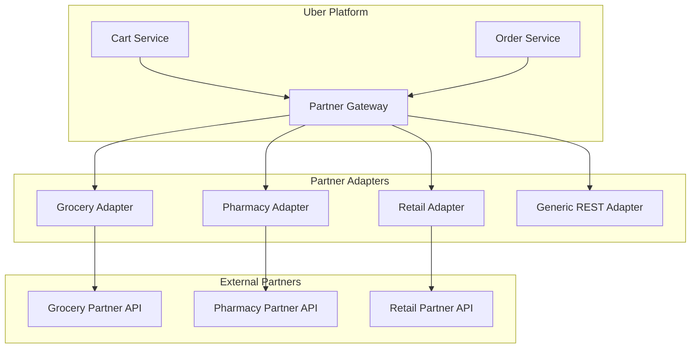
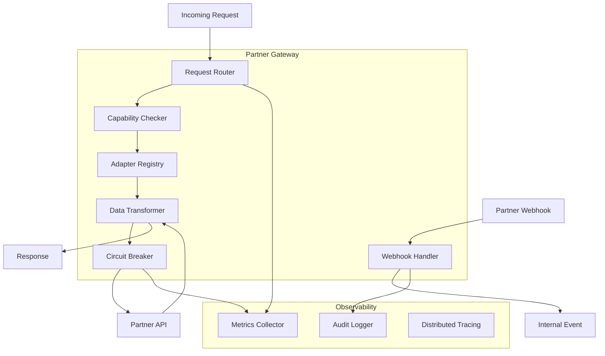
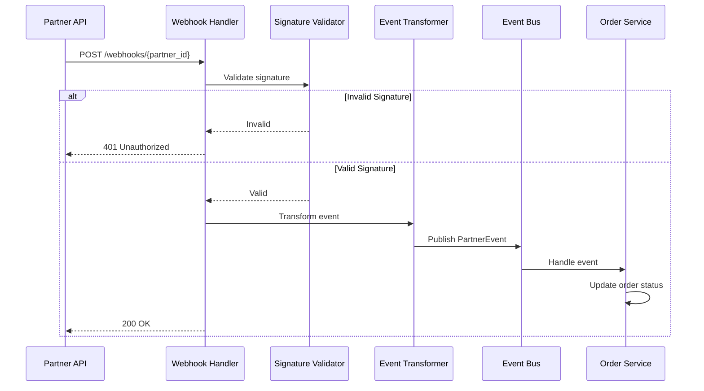

# Uber Cart System - Third-Party Integration

## Overview

This document details the design for integrating third-party partners into the Uber Cart Management System. It covers the adapter pattern for partner integrations, capability-based operation restrictions, partner-specific extensions, and webhook handling.

## Integration Use Cases

### Partner Types

| Partner Type | Examples | Integration Level |
|--------------|----------|-------------------|
| Grocery | Instacart, Cornershop | Deep Integration |
| Pharmacy | CVS, Walgreens | Medium Integration |
| Retail | Best Buy, Apple | Light Integration |
| Restaurant Aggregators | DoorDash (white-label) | API Gateway |
| Alcohol Delivery | Drizly | Regulated Integration |
| Package Delivery | UPS, FedEx | Fulfillment Only |

### Integration Patterns



## Architecture

### Partner Gateway Service



### Component Responsibilities

| Component | Responsibility |
|-----------|---------------|
| Request Router | Route requests to appropriate adapter based on partner ID |
| Capability Checker | Verify partner supports requested operation |
| Adapter Registry | Manage partner adapter instances and configuration |
| Data Transformer | Normalize data between Uber and partner formats |
| Circuit Breaker | Handle partner API failures gracefully |
| Webhook Handler | Process incoming partner notifications |

## Adapter Pattern Implementation

### Adapter Interface

```go
// PartnerAdapter defines the interface all partner adapters must implement
type PartnerAdapter interface {
    // Identity
    GetPartnerID() string
    GetCapabilities() []Capability

    // Catalog operations
    GetCatalog(ctx context.Context, req *CatalogRequest) (*Catalog, error)
    GetItem(ctx context.Context, itemID string) (*PartnerItem, error)
    CheckAvailability(ctx context.Context, items []ItemAvailabilityRequest) ([]ItemAvailability, error)

    // Order operations
    CreateOrder(ctx context.Context, order *PartnerOrderRequest) (*PartnerOrder, error)
    GetOrder(ctx context.Context, orderID string) (*PartnerOrder, error)
    UpdateOrder(ctx context.Context, orderID string, update *OrderUpdate) (*PartnerOrder, error)
    CancelOrder(ctx context.Context, orderID string, reason string) error

    // Fulfillment
    GetFulfillmentStatus(ctx context.Context, orderID string) (*FulfillmentStatus, error)
    GetTrackingInfo(ctx context.Context, orderID string) (*TrackingInfo, error)

    // Webhooks
    ParseWebhook(ctx context.Context, payload []byte, headers map[string]string) (*WebhookEvent, error)
    ValidateWebhookSignature(payload []byte, signature string) bool
}

// Capability represents a partner capability
type Capability struct {
    Name         CapabilityType
    Enabled      bool
    Restrictions CapabilityRestrictions
    APIVersion   string
}

type CapabilityType string

const (
    CapCreateOrder        CapabilityType = "CREATE_ORDER"
    CapModifyOrder        CapabilityType = "MODIFY_ORDER"
    CapCancelOrder        CapabilityType = "CANCEL_ORDER"
    CapTrackOrder         CapabilityType = "TRACK_ORDER"
    CapDelivery           CapabilityType = "DELIVERY"
    CapPickup             CapabilityType = "PICKUP"
    CapScheduledOrders    CapabilityType = "SCHEDULED_ORDERS"
    CapRealTimeInventory  CapabilityType = "REAL_TIME_INVENTORY"
    CapRefunds            CapabilityType = "REFUNDS"
    CapPartialFulfillment CapabilityType = "PARTIAL_FULFILLMENT"
    CapSubstitutions      CapabilityType = "SUBSTITUTIONS"
)
```

### Base Adapter Implementation

```go
// BaseAdapter provides common functionality for all adapters
type BaseAdapter struct {
    partnerID   string
    config      *PartnerConfig
    httpClient  *http.Client
    authHandler AuthHandler
    rateLimiter RateLimiter
    metrics     MetricsCollector
}

func (a *BaseAdapter) makeRequest(ctx context.Context, method, path string, body interface{}) (*http.Response, error) {
    // Rate limiting
    if err := a.rateLimiter.Wait(ctx); err != nil {
        return nil, ErrRateLimited
    }

    // Build request
    url := a.config.BaseURL + path
    var reqBody io.Reader
    if body != nil {
        jsonBody, _ := json.Marshal(body)
        reqBody = bytes.NewReader(jsonBody)
    }

    req, err := http.NewRequestWithContext(ctx, method, url, reqBody)
    if err != nil {
        return nil, err
    }

    // Add authentication
    if err := a.authHandler.AddAuth(req); err != nil {
        return nil, err
    }

    // Add standard headers
    req.Header.Set("Content-Type", "application/json")
    req.Header.Set("X-Request-ID", getRequestID(ctx))
    req.Header.Set("X-Partner-API-Version", a.config.APIVersion)

    // Execute with metrics
    start := time.Now()
    resp, err := a.httpClient.Do(req)
    a.metrics.RecordLatency(a.partnerID, method, path, time.Since(start))

    if err != nil {
        a.metrics.RecordError(a.partnerID, method, path, "network_error")
        return nil, err
    }

    if resp.StatusCode >= 400 {
        a.metrics.RecordError(a.partnerID, method, path, fmt.Sprintf("http_%d", resp.StatusCode))
    }

    return resp, nil
}
```

### Grocery Partner Adapter Example

```go
// GroceryPartnerAdapter implements PartnerAdapter for grocery partners
type GroceryPartnerAdapter struct {
    *BaseAdapter
    inventoryCache *InventoryCache
}

func NewGroceryPartnerAdapter(config *PartnerConfig) *GroceryPartnerAdapter {
    return &GroceryPartnerAdapter{
        BaseAdapter: &BaseAdapter{
            partnerID:  config.PartnerID,
            config:     config,
            httpClient: createHTTPClient(config),
            authHandler: NewOAuth2Handler(config.OAuth),
        },
        inventoryCache: NewInventoryCache(5 * time.Minute),
    }
}

func (a *GroceryPartnerAdapter) GetCapabilities() []Capability {
    return []Capability{
        {Name: CapCreateOrder, Enabled: true},
        {Name: CapModifyOrder, Enabled: true, Restrictions: CapabilityRestrictions{
            ModificationWindowMinutes: 15,
            ModifiableStatuses: []string{"PENDING", "ACCEPTED"},
        }},
        {Name: CapCancelOrder, Enabled: true, Restrictions: CapabilityRestrictions{
            CancellationWindowMinutes: 30,
            CancellableStatuses: []string{"PENDING", "ACCEPTED", "PICKING"},
        }},
        {Name: CapDelivery, Enabled: true},
        {Name: CapPickup, Enabled: true},
        {Name: CapScheduledOrders, Enabled: true},
        {Name: CapRealTimeInventory, Enabled: true},
        {Name: CapSubstitutions, Enabled: true},
        {Name: CapPartialFulfillment, Enabled: true},
    }
}

func (a *GroceryPartnerAdapter) CreateOrder(ctx context.Context, req *PartnerOrderRequest) (*PartnerOrder, error) {
    // Transform to partner format
    partnerReq := a.transformToPartnerOrder(req)

    resp, err := a.makeRequest(ctx, "POST", "/v2/orders", partnerReq)
    if err != nil {
        return nil, err
    }
    defer resp.Body.Close()

    if resp.StatusCode != http.StatusCreated {
        return nil, a.parseError(resp)
    }

    var partnerResp GroceryOrderResponse
    if err := json.NewDecoder(resp.Body).Decode(&partnerResp); err != nil {
        return nil, err
    }

    // Transform back to Uber format
    return a.transformToUberOrder(&partnerResp), nil
}

func (a *GroceryPartnerAdapter) CheckAvailability(ctx context.Context, items []ItemAvailabilityRequest) ([]ItemAvailability, error) {
    // Check cache first
    var uncachedItems []ItemAvailabilityRequest
    results := make([]ItemAvailability, 0, len(items))

    for _, item := range items {
        if cached, ok := a.inventoryCache.Get(item.ItemID); ok {
            results = append(results, cached)
        } else {
            uncachedItems = append(uncachedItems, item)
        }
    }

    if len(uncachedItems) == 0 {
        return results, nil
    }

    // Fetch from partner
    resp, err := a.makeRequest(ctx, "POST", "/v2/inventory/check", uncachedItems)
    if err != nil {
        return nil, err
    }
    defer resp.Body.Close()

    var inventory []GroceryInventoryItem
    if err := json.NewDecoder(resp.Body).Decode(&inventory); err != nil {
        return nil, err
    }

    // Cache and transform
    for _, inv := range inventory {
        availability := ItemAvailability{
            ItemID:       inv.SKU,
            IsAvailable:  inv.StockLevel > 0,
            Quantity:     inv.StockLevel,
            Price:        a.transformPrice(inv.Price),
            Substitutes:  a.transformSubstitutes(inv.Alternatives),
        }
        a.inventoryCache.Set(inv.SKU, availability)
        results = append(results, availability)
    }

    return results, nil
}
```

## Capability System

### Capability Registry

```go
type CapabilityRegistry struct {
    partners map[string][]Capability
    mu       sync.RWMutex
}

func (r *CapabilityRegistry) HasCapability(partnerID string, cap CapabilityType) bool {
    r.mu.RLock()
    defer r.mu.RUnlock()

    capabilities, exists := r.partners[partnerID]
    if !exists {
        return false
    }

    for _, c := range capabilities {
        if c.Name == cap && c.Enabled {
            return true
        }
    }
    return false
}

func (r *CapabilityRegistry) GetRestrictions(partnerID string, cap CapabilityType) *CapabilityRestrictions {
    r.mu.RLock()
    defer r.mu.RUnlock()

    capabilities, exists := r.partners[partnerID]
    if !exists {
        return nil
    }

    for _, c := range capabilities {
        if c.Name == cap {
            return &c.Restrictions
        }
    }
    return nil
}

// CapabilityRestrictions defines operation-specific limits
type CapabilityRestrictions struct {
    // Time-based restrictions
    ModificationWindowMinutes  int
    CancellationWindowMinutes  int

    // Status-based restrictions
    ModifiableStatuses  []string
    CancellableStatuses []string

    // Amount restrictions
    MinOrderAmount *Money
    MaxOrderAmount *Money

    // Item restrictions
    MaxItemsPerOrder int
    MaxQuantityPerItem int

    // Geographic restrictions
    SupportedRegions []string

    // Scheduling restrictions
    MinScheduleAheadMinutes int
    MaxScheduleAheadDays    int
}
```

### Operation Validation

```go
type OperationValidator struct {
    registry *CapabilityRegistry
}

func (v *OperationValidator) CanModifyOrder(partnerID string, order *Order) (*ValidationResult, error) {
    // Check base capability
    if !v.registry.HasCapability(partnerID, CapModifyOrder) {
        return &ValidationResult{
            Allowed: false,
            Reason:  "Partner does not support order modifications",
            Code:    "MODIFICATION_NOT_SUPPORTED",
        }, nil
    }

    restrictions := v.registry.GetRestrictions(partnerID, CapModifyOrder)
    if restrictions == nil {
        return &ValidationResult{Allowed: true}, nil
    }

    // Check modification window
    if restrictions.ModificationWindowMinutes > 0 {
        deadline := order.CreatedAt.Add(time.Duration(restrictions.ModificationWindowMinutes) * time.Minute)
        if time.Now().After(deadline) {
            return &ValidationResult{
                Allowed: false,
                Reason:  "Modification window has expired",
                Code:    "MODIFICATION_WINDOW_EXPIRED",
                Details: map[string]interface{}{
                    "deadline": deadline,
                    "window_minutes": restrictions.ModificationWindowMinutes,
                },
            }, nil
        }
    }

    // Check status restrictions
    if len(restrictions.ModifiableStatuses) > 0 {
        if !contains(restrictions.ModifiableStatuses, string(order.Status)) {
            return &ValidationResult{
                Allowed: false,
                Reason:  "Order cannot be modified in current status",
                Code:    "STATUS_NOT_MODIFIABLE",
                Details: map[string]interface{}{
                    "current_status": order.Status,
                    "modifiable_statuses": restrictions.ModifiableStatuses,
                },
            }, nil
        }
    }

    return &ValidationResult{Allowed: true}, nil
}

func (v *OperationValidator) CanCancelOrder(partnerID string, order *Order) (*ValidationResult, error) {
    // Similar validation logic for cancellation
    // ...
}
```

## Data Transformation

### Transformer Interface

```go
type DataTransformer interface {
    // Cart/Order transformations
    ToPartnerOrder(order *Order) (*PartnerOrderRequest, error)
    FromPartnerOrder(partnerOrder interface{}) (*Order, error)

    // Item transformations
    ToPartnerItem(item *CartItem) (*PartnerItem, error)
    FromPartnerItem(partnerItem interface{}) (*CartItem, error)

    // Status mapping
    MapPartnerStatus(partnerStatus string) OrderStatus
    MapToPartnerStatus(status OrderStatus) string

    // Error transformation
    TransformError(partnerError interface{}) error
}

// GroceryTransformer implements DataTransformer for grocery partners
type GroceryTransformer struct {
    statusMap    map[string]OrderStatus
    revStatusMap map[OrderStatus]string
}

func (t *GroceryTransformer) ToPartnerOrder(order *Order) (*PartnerOrderRequest, error) {
    partnerItems := make([]PartnerItemRequest, 0, len(order.Items))

    for _, item := range order.Items {
        partnerItem := PartnerItemRequest{
            SKU:      item.PartnerItemID,
            Quantity: item.Quantity,
            UnitPrice: PriceRequest{
                Amount:   item.UnitPrice.Amount,
                Currency: item.UnitPrice.Currency,
            },
            Notes: item.SpecialNotes,
        }

        // Transform customizations
        if len(item.Customizations) > 0 {
            partnerItem.Preferences = t.transformCustomizations(item.Customizations)
        }

        partnerItems = append(partnerItems, partnerItem)
    }

    return &PartnerOrderRequest{
        ExternalOrderID: order.ID,
        CustomerInfo: CustomerInfo{
            Name:  order.DeliveryAddress.ContactName,
            Phone: order.ContactPhone,
            Email: order.UserEmail,
        },
        DeliveryAddress: AddressRequest{
            Street1:     order.DeliveryAddress.AddressLine1,
            Street2:     order.DeliveryAddress.AddressLine2,
            City:        order.DeliveryAddress.City,
            State:       order.DeliveryAddress.State,
            PostalCode:  order.DeliveryAddress.PostalCode,
            Country:     order.DeliveryAddress.Country,
            Latitude:    order.DeliveryAddress.Latitude,
            Longitude:   order.DeliveryAddress.Longitude,
            Instructions: order.DeliveryAddress.DeliveryInstructions,
        },
        Items:         partnerItems,
        ScheduledTime: order.ScheduledTime,
        Tip:           order.Pricing.Tip.Amount,
    }, nil
}

func (t *GroceryTransformer) MapPartnerStatus(partnerStatus string) OrderStatus {
    // Partner-specific status mapping
    statusMap := map[string]OrderStatus{
        "RECEIVED":     OrderStatusPending,
        "ACCEPTED":     OrderStatusConfirmed,
        "PICKING":      OrderStatusPreparing,
        "PICKED":       OrderStatusReadyForPickup,
        "DRIVER_ASSIGNED": OrderStatusDriverAssigned,
        "IN_TRANSIT":   OrderStatusInTransit,
        "DELIVERED":    OrderStatusDelivered,
        "CANCELLED":    OrderStatusCancelled,
    }

    if status, ok := statusMap[partnerStatus]; ok {
        return status
    }
    return OrderStatusPending
}
```

## Webhook Handling

### Webhook Flow



### Webhook Handler Implementation

```go
type WebhookHandler struct {
    adapters   map[string]PartnerAdapter
    eventBus   EventBus
    auditLog   AuditLogger
}

func (h *WebhookHandler) HandleWebhook(c *gin.Context) {
    partnerID := c.Param("partner_id")

    adapter, exists := h.adapters[partnerID]
    if !exists {
        c.JSON(http.StatusNotFound, gin.H{"error": "Unknown partner"})
        return
    }

    // Read body
    body, err := io.ReadAll(c.Request.Body)
    if err != nil {
        c.JSON(http.StatusBadRequest, gin.H{"error": "Cannot read body"})
        return
    }

    // Validate signature
    signature := c.GetHeader("X-Webhook-Signature")
    if !adapter.ValidateWebhookSignature(body, signature) {
        h.auditLog.LogSecurityEvent("INVALID_WEBHOOK_SIGNATURE", partnerID, string(body))
        c.JSON(http.StatusUnauthorized, gin.H{"error": "Invalid signature"})
        return
    }

    // Parse webhook
    headers := make(map[string]string)
    for key := range c.Request.Header {
        headers[key] = c.GetHeader(key)
    }

    event, err := adapter.ParseWebhook(c, body, headers)
    if err != nil {
        c.JSON(http.StatusBadRequest, gin.H{"error": "Cannot parse webhook"})
        return
    }

    // Audit log
    h.auditLog.LogWebhookReceived(partnerID, event.Type, event.OrderID)

    // Publish to event bus
    if err := h.eventBus.Publish(c, &PartnerWebhookEvent{
        PartnerID: partnerID,
        EventType: event.Type,
        OrderID:   event.OrderID,
        Payload:   event.Payload,
        Timestamp: time.Now(),
    }); err != nil {
        // Log error but return success to partner (async processing)
        log.Error("Failed to publish webhook event", "error", err)
    }

    c.JSON(http.StatusOK, gin.H{"status": "received"})
}

// WebhookEvent represents a parsed partner webhook
type WebhookEvent struct {
    Type      WebhookEventType
    OrderID   string
    Payload   map[string]interface{}
    Timestamp time.Time
}

type WebhookEventType string

const (
    WebhookOrderStatusUpdate  WebhookEventType = "ORDER_STATUS_UPDATE"
    WebhookFulfillmentUpdate  WebhookEventType = "FULFILLMENT_UPDATE"
    WebhookItemSubstitution   WebhookEventType = "ITEM_SUBSTITUTION"
    WebhookItemUnavailable    WebhookEventType = "ITEM_UNAVAILABLE"
    WebhookRefundProcessed    WebhookEventType = "REFUND_PROCESSED"
    WebhookDeliveryUpdate     WebhookEventType = "DELIVERY_UPDATE"
)
```

## Partner Order Extensions

### Extended Order Model

```typescript
interface PartnerOrder extends Order {
  // Partner identification
  partnerId: string;
  partnerOrderId: string;
  isPartnerOrder: true;

  // Partner-specific data
  partnerMetadata: PartnerOrderMetadata;

  // Operation restrictions
  allowedOperations: OperationType[];
  restrictedOperations: RestrictedOperation[];

  // Partner contact
  partnerSupport: PartnerSupportInfo;
}

interface PartnerOrderMetadata {
  // Partner display info
  partnerName: string;
  partnerLogo: string;
  partnerOrderUrl?: string;

  // Partner-specific fields
  partnerTrackingUrl?: string;
  partnerConfirmationCode?: string;

  // Grocery-specific
  substitutePreferences?: SubstitutePreference;
  deliveryWindow?: DeliveryWindow;

  // Pharmacy-specific
  prescriptionInfo?: PrescriptionInfo;
  pharmacyLocation?: Location;

  // Custom fields per partner
  customFields: Record<string, any>;
}

interface RestrictedOperation {
  operation: OperationType;
  reason: string;
  alternativeAction?: string;
  partnerContactUrl?: string;
}

interface SubstitutePreference {
  allowSubstitutes: boolean;
  substitutePreference: 'SIMILAR' | 'CHEAPER' | 'NONE';
  specificSubstitutes: {
    originalItemId: string;
    substituteItemId: string;
  }[];
}

interface DeliveryWindow {
  startTime: DateTime;
  endTime: DateTime;
  isFlexible: boolean;
}
```

### Partner-Specific UI

```typescript
// UI components for partner orders
interface PartnerOrderCardProps {
  order: PartnerOrder;
  onAction: (action: OrderAction) => void;
}

const PartnerOrderCard: FC<PartnerOrderCardProps> = ({ order, onAction }) => {
  const { restrictedOperations, allowedOperations } = order;

  return (
    <OrderCard>
      {/* Partner branding */}
      <PartnerBadge>
        <PartnerLogo src={order.partnerMetadata.partnerLogo} />
        <PartnerName>{order.partnerMetadata.partnerName}</PartnerName>
      </PartnerBadge>

      {/* Standard order info */}
      <OrderDetails order={order} />

      {/* Partner-specific tracking */}
      {order.partnerMetadata.partnerTrackingUrl && (
        <TrackingButton
          url={order.partnerMetadata.partnerTrackingUrl}
          label="Track on Partner App"
        />
      )}

      {/* Action buttons with restrictions */}
      <ActionButtons>
        {allowedOperations.includes('CANCEL') ? (
          <CancelButton onPress={() => onAction('CANCEL')} />
        ) : (
          <DisabledAction
            label="Cancel"
            reason={getRestrictionReason(restrictedOperations, 'CANCEL')}
          />
        )}

        {allowedOperations.includes('MODIFY') ? (
          <ModifyButton onPress={() => onAction('MODIFY')} />
        ) : (
          <DisabledAction
            label="Modify"
            reason={getRestrictionReason(restrictedOperations, 'MODIFY')}
          />
        )}
      </ActionButtons>

      {/* Partner support */}
      <SupportSection>
        <Text>Need help with this order?</Text>
        <SupportButton
          partnerName={order.partnerMetadata.partnerName}
          supportInfo={order.partnerSupport}
        />
      </SupportSection>
    </OrderCard>
  );
};
```

## Circuit Breaker & Resilience

### Circuit Breaker Implementation

```go
type CircuitBreaker struct {
    name          string
    maxFailures   int
    resetTimeout  time.Duration
    halfOpenLimit int

    state         CircuitState
    failures      int
    lastFailure   time.Time
    halfOpenCalls int
    mu            sync.RWMutex
}

type CircuitState int

const (
    StateClosed CircuitState = iota
    StateOpen
    StateHalfOpen
)

func (cb *CircuitBreaker) Execute(fn func() error) error {
    if !cb.canExecute() {
        return ErrCircuitOpen
    }

    err := fn()

    cb.mu.Lock()
    defer cb.mu.Unlock()

    if err != nil {
        cb.failures++
        cb.lastFailure = time.Now()

        if cb.failures >= cb.maxFailures {
            cb.state = StateOpen
            log.Warn("Circuit breaker opened", "name", cb.name, "failures", cb.failures)
        }
        return err
    }

    // Success
    if cb.state == StateHalfOpen {
        cb.halfOpenCalls++
        if cb.halfOpenCalls >= cb.halfOpenLimit {
            cb.state = StateClosed
            cb.failures = 0
            log.Info("Circuit breaker closed", "name", cb.name)
        }
    }

    return nil
}

func (cb *CircuitBreaker) canExecute() bool {
    cb.mu.RLock()
    defer cb.mu.RUnlock()

    switch cb.state {
    case StateClosed:
        return true
    case StateOpen:
        if time.Since(cb.lastFailure) > cb.resetTimeout {
            cb.mu.RUnlock()
            cb.mu.Lock()
            cb.state = StateHalfOpen
            cb.halfOpenCalls = 0
            cb.mu.Unlock()
            cb.mu.RLock()
            return true
        }
        return false
    case StateHalfOpen:
        return cb.halfOpenCalls < cb.halfOpenLimit
    }
    return false
}
```

### Fallback Strategies

```go
type PartnerFallbackHandler struct {
    cache         *PartnerOrderCache
    notifications NotificationService
}

func (h *PartnerFallbackHandler) HandlePartnerUnavailable(
    ctx context.Context,
    partnerID string,
    operation string,
    request interface{},
) (*FallbackResult, error) {
    switch operation {
    case "GET_ORDER":
        // Try to serve from cache
        orderReq := request.(*GetOrderRequest)
        if cached, ok := h.cache.GetOrder(orderReq.OrderID); ok {
            return &FallbackResult{
                Data:     cached,
                FromCache: true,
                Warning:  "Order status may be outdated",
            }, nil
        }

    case "CREATE_ORDER":
        // Queue for retry
        if err := h.queueForRetry(partnerID, "CREATE_ORDER", request); err != nil {
            return nil, err
        }

        // Notify user
        h.notifications.Send(ctx, &Notification{
            Type:    "PARTNER_DELAY",
            Title:   "Order Processing Delayed",
            Body:    "Your order is being processed. We'll notify you when confirmed.",
        })

        return &FallbackResult{
            Queued: true,
            EstimatedRetry: time.Now().Add(5 * time.Minute),
        }, nil
    }

    return nil, ErrNoFallbackAvailable
}
```

## Configuration & Onboarding

### Partner Configuration Schema

```yaml
partner:
  id: "grocery_partner_1"
  name: "FreshMart"
  display_name: "FreshMart Grocery"

  # API Configuration
  api:
    base_url: "https://api.freshmart.com"
    version: "v2"
    timeout_seconds: 30

  # Authentication
  auth:
    type: "OAUTH2"
    token_url: "https://auth.freshmart.com/token"
    client_id: "${FRESHMART_CLIENT_ID}"
    client_secret: "${FRESHMART_CLIENT_SECRET}"
    scopes: ["orders.read", "orders.write", "inventory.read"]

  # Capabilities
  capabilities:
    - name: "CREATE_ORDER"
      enabled: true
    - name: "MODIFY_ORDER"
      enabled: true
      restrictions:
        modification_window_minutes: 15
        modifiable_statuses: ["PENDING", "ACCEPTED"]
    - name: "CANCEL_ORDER"
      enabled: true
      restrictions:
        cancellation_window_minutes: 30
        cancellable_statuses: ["PENDING", "ACCEPTED", "PICKING"]
    - name: "SUBSTITUTIONS"
      enabled: true
    - name: "SCHEDULED_ORDERS"
      enabled: true
      restrictions:
        min_schedule_ahead_minutes: 60
        max_schedule_ahead_days: 7

  # Webhooks
  webhooks:
    url: "https://api.uber.com/webhooks/partners/grocery_partner_1"
    secret: "${FRESHMART_WEBHOOK_SECRET}"
    events:
      - "ORDER_STATUS_UPDATE"
      - "FULFILLMENT_UPDATE"
      - "ITEM_SUBSTITUTION"

  # Rate Limits
  rate_limits:
    requests_per_second: 50
    burst: 100

  # Circuit Breaker
  circuit_breaker:
    max_failures: 5
    reset_timeout_seconds: 60
    half_open_limit: 3

  # Feature Flags
  features:
    real_time_inventory: true
    driver_tracking: true
    in_app_messaging: false
```

## Monitoring & Observability

### Partner Metrics

```go
var (
    partnerRequestDuration = prometheus.NewHistogramVec(
        prometheus.HistogramOpts{
            Name:    "partner_request_duration_seconds",
            Help:    "Duration of partner API requests",
            Buckets: []float64{0.1, 0.25, 0.5, 1, 2.5, 5, 10},
        },
        []string{"partner_id", "operation", "status"},
    )

    partnerRequestErrors = prometheus.NewCounterVec(
        prometheus.CounterOpts{
            Name: "partner_request_errors_total",
            Help: "Total number of partner API errors",
        },
        []string{"partner_id", "operation", "error_type"},
    )

    partnerCircuitState = prometheus.NewGaugeVec(
        prometheus.GaugeOpts{
            Name: "partner_circuit_breaker_state",
            Help: "Current state of partner circuit breaker (0=closed, 1=open, 2=half-open)",
        },
        []string{"partner_id"},
    )

    webhookProcessingDuration = prometheus.NewHistogramVec(
        prometheus.HistogramOpts{
            Name:    "webhook_processing_duration_seconds",
            Help:    "Duration of webhook processing",
            Buckets: []float64{0.01, 0.05, 0.1, 0.25, 0.5, 1},
        },
        []string{"partner_id", "event_type"},
    )
)
```

### Health Check

```go
type PartnerHealthChecker struct {
    adapters map[string]PartnerAdapter
}

func (h *PartnerHealthChecker) CheckPartnerHealth(partnerID string) *PartnerHealth {
    adapter, exists := h.adapters[partnerID]
    if !exists {
        return &PartnerHealth{
            PartnerID: partnerID,
            Status:    "UNKNOWN",
            Error:     "Adapter not found",
        }
    }

    ctx, cancel := context.WithTimeout(context.Background(), 5*time.Second)
    defer cancel()

    start := time.Now()
    err := adapter.HealthCheck(ctx)
    latency := time.Since(start)

    health := &PartnerHealth{
        PartnerID:    partnerID,
        Latency:      latency,
        CheckedAt:    time.Now(),
    }

    if err != nil {
        health.Status = "UNHEALTHY"
        health.Error = err.Error()
    } else if latency > 2*time.Second {
        health.Status = "DEGRADED"
    } else {
        health.Status = "HEALTHY"
    }

    return health
}
```

## API Endpoints

```http
# Partner Management (Admin)
POST   /admin/partners                    # Onboard new partner
GET    /admin/partners                    # List partners
GET    /admin/partners/{partner_id}       # Get partner config
PATCH  /admin/partners/{partner_id}       # Update partner config
DELETE /admin/partners/{partner_id}       # Remove partner

# Partner Catalog
GET    /partners/{partner_id}/catalog     # Get partner catalog
GET    /partners/{partner_id}/items/{item_id}  # Get item details
POST   /partners/{partner_id}/availability # Check item availability

# Partner Orders
POST   /partners/{partner_id}/orders      # Create partner order
GET    /partners/{partner_id}/orders/{order_id}  # Get partner order
PATCH  /partners/{partner_id}/orders/{order_id}  # Update partner order
DELETE /partners/{partner_id}/orders/{order_id}  # Cancel partner order

# Webhooks
POST   /webhooks/partners/{partner_id}    # Receive partner webhooks

# Health & Monitoring
GET    /partners/{partner_id}/health      # Partner health check
GET    /partners/{partner_id}/metrics     # Partner metrics
```

