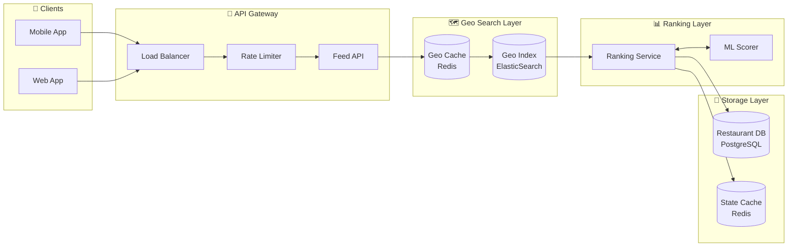
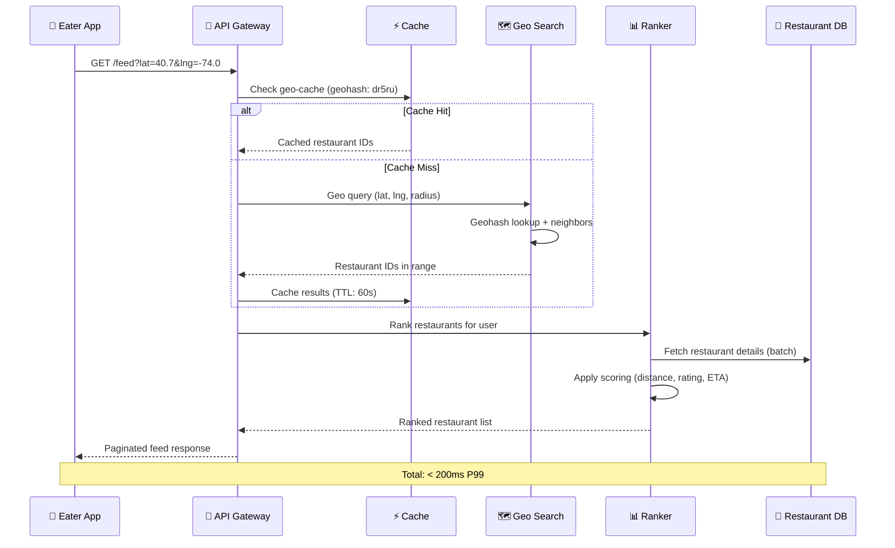

# Uber Eats Restaurant Feed System

## Overview

A high-performance backend system that delivers personalized, ranked restaurant feeds to eaters based on their delivery location. The system handles 10M+ restaurants globally with 10K+ views/second, using spatial indexing for efficient geo-queries and supporting dynamic filtering for real-time restaurant availability.

## System Architecture (High-Level)



## End-to-End Request Flow



## Business Context

### Problem Statement
- Eaters need to discover restaurants that can deliver to their location
- Restaurant availability changes dynamically (breaks, closures, geo-restrictions)
- Dense urban areas (Manhattan, Mumbai) have thousands of restaurants per square mile
- Feed must be personalized and ranked for relevance

### Goals
1. **Fast Discovery**: Return ranked feed in < 200ms P99
2. **Accurate Delivery**: Only show restaurants that can actually deliver
3. **Smart Ranking**: Personalized ordering based on relevance signals
4. **High Availability**: 99.9% uptime for read operations
5. **Scalable**: Handle traffic spikes during meal times (3-5x baseline)

## Scale Parameters

| Metric | Value |
|--------|-------|
| Total Restaurants | 10,000,000 |
| Read QPS (baseline) | 10,000 |
| Read QPS (peak) | 50,000 |
| P99 Latency Target | < 200ms |
| Avg Restaurants per Query | 50-200 |
| Restaurant Addition Rate | ~1,000/day |
| Geo Coverage | Global (200+ cities) |

## Key Design Decisions

### 1. Spatial Indexing: H3 Hexagonal Grid (Uber's Technology)

```
┌─────────────────────────────────────────────────────────────┐
│  H3 Resolution Selection                                     │
├─────────────────────────────────────────────────────────────┤
│  Resolution 6:  ~3.2km edge  → Rural areas                  │
│  Resolution 7:  ~1.2km edge  → Suburban areas               │
│  Resolution 8:  ~461m edge   → Urban areas                  │
│  Resolution 9:  ~174m edge   → Hyper-dense (Manhattan)      │
└─────────────────────────────────────────────────────────────┘
```

**Why H3 (developed by Uber):**
- Hexagons better approximate circular delivery radii
- All 6 neighbors equidistant (no corner artifacts like geohash)
- Native k-ring queries for radius search
- Battle-tested at Uber scale for ETAs and dispatch
- Geohashing kept as fallback for ElasticSearch native queries

### 2. Hybrid Sharding Strategy

| Data Type | Sharding Key | Strategy |
|-----------|--------------|----------|
| Geo Index | Geohash prefix (2-3 chars) | Location-based |
| Restaurant Details | Restaurant ID | Consistent hashing |
| User Preferences | User ID | Consistent hashing |

### 3. Caching Strategy

```
┌─────────────────────────────────────────────────────────────┐
│  Cache Layer                     TTL        Hit Rate        │
├─────────────────────────────────────────────────────────────┤
│  L1: CDN (static assets)         24h        95%            │
│  L2: Geo-cell restaurant IDs     60s        80%            │
│  L3: Restaurant details          5min       90%            │
│  L4: User preferences            30min      85%            │
└─────────────────────────────────────────────────────────────┘
```

## Documentation Structure

1. [System Architecture](./system-architecture.md) - Component design, data flow, technology choices
2. [API Contracts](./api-contracts.md) - RESTful endpoints, pagination, error handling
3. [Data Models](./data-models.md) - Restaurant, geolocation, delivery zone schemas
4. [Spatial Indexing](./spatial-indexing.md) - H3 hexagonal indexing (primary), Geohashing (alternative)
5. [Ranking System](./ranking-system.md) - Scoring factors, ML integration
6. [Scaling & Sharding](./scaling-sharding.md) - Hotspot handling, capacity planning
7. [Dynamic Filtering](./dynamic-filtering.md) - Real-time availability, geo-restrictions
8. [Architecture Diagrams](./diagrams/architecture-diagrams.md) - Visual representations

## Technology Stack

| Layer | Primary Technology | Purpose |
|-------|-------------------|---------|
| API Gateway | Kong / AWS API Gateway | Rate limiting, auth, routing |
| Geo Search | ElasticSearch | geo_point queries, geohash aggregations |
| Cache | Redis Cluster | Geo-cell cache, restaurant state |
| Primary DB | PostgreSQL | Restaurant data, delivery zones |
| Message Queue | Kafka | State change propagation |
| ML Serving | TensorFlow Serving | Real-time ranking scores |
| CDN | CloudFront | Static assets, API caching |

## Quick Links

- [API Endpoint Reference](./api-contracts.md#api-endpoints)
- [H3 Indexing Deep Dive](./spatial-indexing.md#h3-primary-approach-recommended)
- [Ranking Formula](./ranking-system.md#scoring-algorithm)
- [Hotspot Mitigation](./scaling-sharding.md#hotspot-handling)

