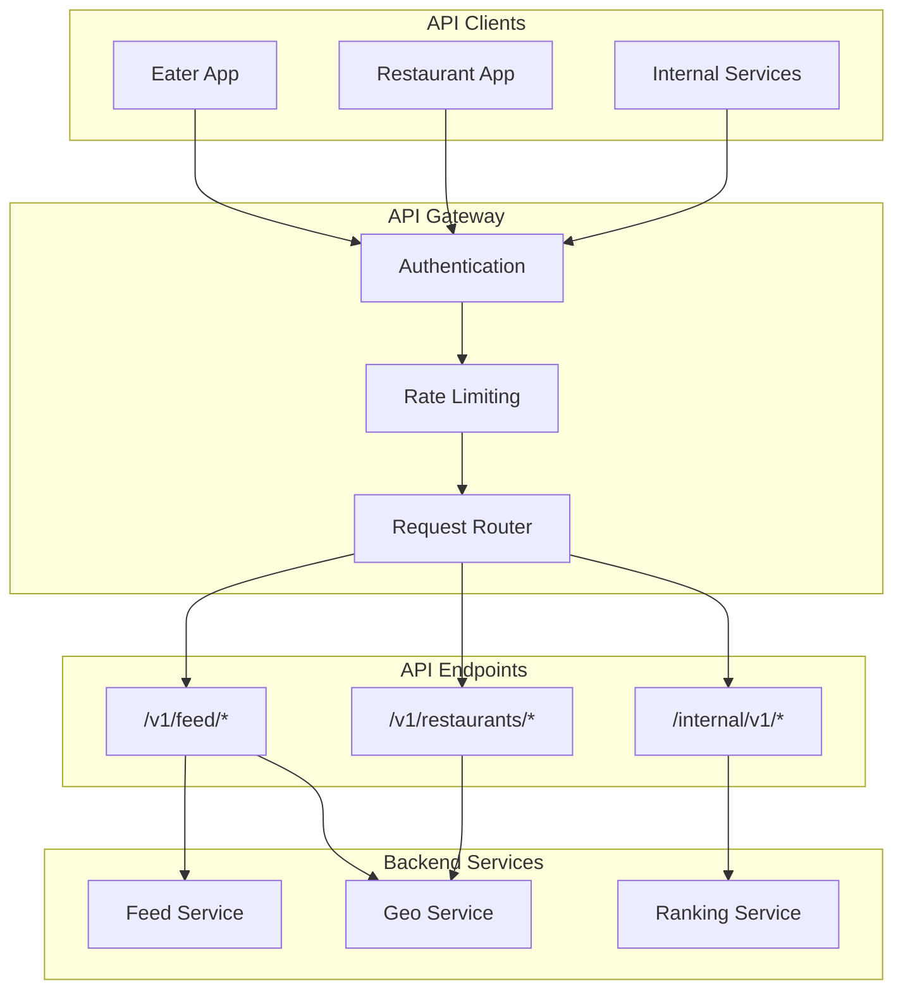
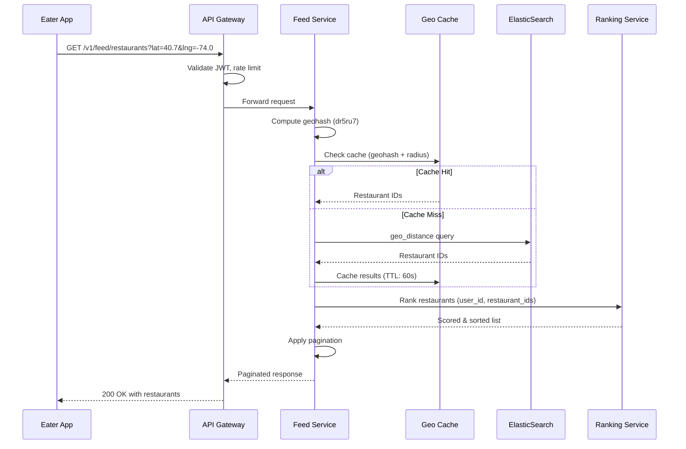
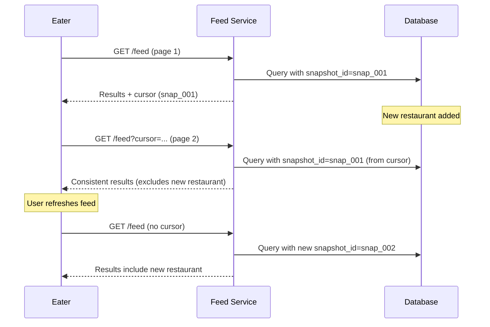

# API Contracts

This document defines the REST API specifications for the Uber Eats Feed System, including endpoints for eaters, restaurant partners, and internal services.

## API Overview



| API Group | Base Path | Purpose |
|-----------|-----------|---------|
| Feed API | `/v1/feed` | Eater-facing feed endpoints |
| Restaurant API | `/v1/restaurants` | Restaurant details and search |
| Internal API | `/internal/v1` | Service-to-service communication |

## Authentication & Authorization

### Eater API

- **Authentication**: OAuth 2.0 Bearer Token (JWT)
- **Authorization**: User-scoped data access
- **Rate Limiting**: 100 requests/minute per user

### Restaurant API

- **Authentication**: API Key + OAuth 2.0
- **Authorization**: Restaurant-scoped access
- **Rate Limiting**: 500 requests/minute per restaurant

### Internal API

- **Authentication**: mTLS (mutual TLS)
- **Authorization**: Service identity validation
- **Rate Limiting**: None (trusted services)

---

## Feed API Endpoints

### API Flow Overview



### 1. Get Restaurant Feed

Get a ranked list of restaurants that can deliver to the specified location.

```
GET /v1/feed/restaurants
```

**Query Parameters:**

| Parameter | Type | Required | Default | Description |
|-----------|------|----------|---------|-------------|
| lat | float | Yes | - | Latitude (-90 to 90) |
| lng | float | Yes | - | Longitude (-180 to 180) |
| radius | integer | No | 5000 | Search radius in meters (max: 15000) |
| cursor | string | No | - | Pagination cursor for next page |
| limit | integer | No | 20 | Results per page (max: 100) |
| cuisine | string[] | No | - | Filter by cuisine types |
| price_range | integer[] | No | - | Filter by price range (1-4) |
| sort_by | string | No | relevance | Sort order: relevance, distance, rating, eta |
| dietary | string[] | No | - | Dietary filters: vegetarian, vegan, halal, etc. |

**Request Example:**
```bash
curl -X GET "https://api.ubereats.com/v1/feed/restaurants?lat=40.7128&lng=-74.0060&radius=3000&limit=20&cuisine=italian,pizza" \
  -H "Authorization: Bearer <jwt_token>" \
  -H "X-Request-ID: req-12345"
```

**Response:** `200 OK`

```json
{
  "data": {
    "restaurants": [
      {
        "id": "rest_abc123",
        "name": "Joe's Pizza",
        "slug": "joes-pizza-nyc",
        "image_url": "https://cdn.ubereats.com/restaurants/rest_abc123/hero.jpg",
        "cuisine_types": ["Pizza", "Italian"],
        "price_range": 2,
        "rating": {
          "score": 4.7,
          "count": 2847
        },
        "distance": {
          "value": 1.2,
          "unit": "km"
        },
        "delivery": {
          "eta_minutes": {
            "min": 25,
            "max": 35
          },
          "fee": {
            "amount": 2.99,
            "currency": "USD"
          }
        },
        "status": {
          "is_open": true,
          "accepting_orders": true,
          "busy_mode": false,
          "next_open_time": null
        },
        "promotions": [
          {
            "type": "PERCENT_OFF",
            "value": 20,
            "description": "20% off your first order",
            "min_order": 15.00
          }
        ],
        "tags": ["Top Rated", "Fast Delivery"],
        "hero_image": {
          "url": "https://cdn.ubereats.com/restaurants/rest_abc123/hero.jpg",
          "blurhash": "LKO2?U%2Tw=w]~RBVZRi};RPxuwH"
        }
      }
    ],
    "pagination": {
      "cursor": "eyJvZmZzZXQiOjIwLCJzY29yZSI6MC44NX0=",
      "has_more": true,
      "total_count": 156
    },
    "metadata": {
      "search_location": {
        "lat": 40.7128,
        "lng": -74.0060,
        "formatted_address": "New York, NY 10007"
      },
      "applied_filters": {
        "cuisine": ["italian", "pizza"],
        "radius_m": 3000
      },
      "snapshot_id": "snap_20260108_143022",
      "generated_at": "2026-01-08T14:30:22Z"
    }
  }
}
```

**Error Responses:**

| Status | Code | Description |
|--------|------|-------------|
| 400 | INVALID_LOCATION | Invalid latitude or longitude |
| 400 | RADIUS_TOO_LARGE | Radius exceeds maximum (15km) |
| 401 | UNAUTHORIZED | Invalid or missing token |
| 429 | RATE_LIMITED | Too many requests |
| 503 | SERVICE_UNAVAILABLE | Feed service temporarily unavailable |

---

### 2. Get Restaurant Details

Get detailed information about a specific restaurant.

```
GET /v1/restaurants/{restaurantId}
```

**Path Parameters:**

| Parameter | Type | Required | Description |
|-----------|------|----------|-------------|
| restaurantId | string | Yes | Restaurant identifier |

**Query Parameters:**

| Parameter | Type | Required | Description |
|-----------|------|----------|-------------|
| lat | float | Yes | User's latitude (for delivery info) |
| lng | float | Yes | User's longitude (for delivery info) |
| include | string[] | No | Additional data: menu, reviews, hours |

**Response:** `200 OK`

```json
{
  "data": {
    "restaurant": {
      "id": "rest_abc123",
      "name": "Joe's Pizza",
      "slug": "joes-pizza-nyc",
      "description": "Authentic New York style pizza since 1975",
      "cuisine_types": ["Pizza", "Italian"],
      "price_range": 2,
      "rating": {
        "score": 4.7,
        "count": 2847,
        "breakdown": {
          "5": 1842,
          "4": 654,
          "3": 234,
          "2": 78,
          "1": 39
        }
      },
      "location": {
        "address": {
          "line1": "7 Carmine St",
          "line2": null,
          "city": "New York",
          "state": "NY",
          "postal_code": "10014",
          "country": "US"
        },
        "coordinates": {
          "lat": 40.7303,
          "lng": -74.0021
        }
      },
      "contact": {
        "phone": "+1-212-366-1182"
      },
      "delivery": {
        "available": true,
        "eta_minutes": {
          "min": 25,
          "max": 35
        },
        "fee": {
          "amount": 2.99,
          "currency": "USD"
        },
        "minimum_order": {
          "amount": 10.00,
          "currency": "USD"
        },
        "radius_km": 5.0
      },
      "operating_hours": {
        "timezone": "America/New_York",
        "schedule": [
          {
            "day": "monday",
            "periods": [
              { "open": "11:00", "close": "23:00" }
            ]
          },
          {
            "day": "tuesday",
            "periods": [
              { "open": "11:00", "close": "23:00" }
            ]
          }
        ],
        "special_hours": [
          {
            "date": "2026-01-01",
            "is_closed": true,
            "reason": "New Year's Day"
          }
        ]
      },
      "status": {
        "is_open": true,
        "accepting_orders": true,
        "busy_mode": false,
        "estimated_wait_minutes": 0
      },
      "images": {
        "hero": "https://cdn.ubereats.com/restaurants/rest_abc123/hero.jpg",
        "logo": "https://cdn.ubereats.com/restaurants/rest_abc123/logo.png",
        "gallery": [
          "https://cdn.ubereats.com/restaurants/rest_abc123/1.jpg",
          "https://cdn.ubereats.com/restaurants/rest_abc123/2.jpg"
        ]
      },
      "features": ["Pickup Available", "Curbside", "Contactless Delivery"],
      "badges": ["Top Rated", "Fast Delivery", "Uber One"]
    }
  }
}
```

---

### 3. Search Restaurants

Search restaurants by name or cuisine with location context.

```
GET /v1/feed/search
```

**Query Parameters:**

| Parameter | Type | Required | Description |
|-----------|------|----------|-------------|
| q | string | Yes | Search query (min 2 chars) |
| lat | float | Yes | Latitude |
| lng | float | Yes | Longitude |
| radius | integer | No | Search radius in meters (default: 5000) |
| cursor | string | No | Pagination cursor |
| limit | integer | No | Results per page (default: 20) |

**Response:** `200 OK`

```json
{
  "data": {
    "query": "pizza",
    "restaurants": [
      {
        "id": "rest_abc123",
        "name": "Joe's Pizza",
        "match_type": "name",
        "highlight": "<em>Pizza</em> by Joe",
        "relevance_score": 0.95,
        "cuisine_types": ["Pizza", "Italian"],
        "rating": { "score": 4.7, "count": 2847 },
        "distance": { "value": 1.2, "unit": "km" },
        "delivery": {
          "eta_minutes": { "min": 25, "max": 35 }
        }
      }
    ],
    "suggestions": {
      "cuisines": ["Italian", "Fast Food"],
      "related_queries": ["pepperoni pizza", "pizza near me"]
    },
    "pagination": {
      "cursor": "eyJvZmZzZXQiOjIwfQ==",
      "has_more": true
    }
  }
}
```

---

### 4. Get Feed Filters

Get available filter options for the current location.

```
GET /v1/feed/filters
```

**Query Parameters:**

| Parameter | Type | Required | Description |
|-----------|------|----------|-------------|
| lat | float | Yes | Latitude |
| lng | float | Yes | Longitude |

**Response:** `200 OK`

```json
{
  "data": {
    "filters": {
      "cuisines": [
        { "id": "pizza", "name": "Pizza", "count": 45 },
        { "id": "italian", "name": "Italian", "count": 38 },
        { "id": "chinese", "name": "Chinese", "count": 67 },
        { "id": "mexican", "name": "Mexican", "count": 32 }
      ],
      "price_ranges": [
        { "value": 1, "label": "$", "count": 89 },
        { "value": 2, "label": "$$", "count": 156 },
        { "value": 3, "label": "$$$", "count": 78 },
        { "value": 4, "label": "$$$$", "count": 23 }
      ],
      "dietary": [
        { "id": "vegetarian", "name": "Vegetarian", "count": 124 },
        { "id": "vegan", "name": "Vegan", "count": 67 },
        { "id": "halal", "name": "Halal", "count": 45 },
        { "id": "gluten_free", "name": "Gluten-Free", "count": 89 }
      ],
      "sort_options": [
        { "id": "relevance", "name": "Recommended", "default": true },
        { "id": "distance", "name": "Distance" },
        { "id": "rating", "name": "Rating" },
        { "id": "eta", "name": "Delivery Time" },
        { "id": "price_low", "name": "Price: Low to High" },
        { "id": "price_high", "name": "Price: High to Low" }
      ],
      "delivery_options": [
        { "id": "delivery", "name": "Delivery", "count": 289 },
        { "id": "pickup", "name": "Pickup", "count": 312 }
      ]
    },
    "location": {
      "lat": 40.7128,
      "lng": -74.0060,
      "formatted_address": "New York, NY 10007"
    }
  }
}
```

---

## Pagination Design

### Cursor-Based Pagination

We use **cursor-based pagination** instead of offset-based for the following reasons:

1. **Stable results**: New restaurants added won't shift pages
2. **Performance**: No OFFSET overhead for deep pagination
3. **Snapshot consistency**: Cursor encodes query state

**Cursor Structure (Base64 encoded):**
```json
{
  "offset": 20,
  "score": 0.85,
  "snapshot_id": "snap_20260108_143022",
  "sort_key": "relevance"
}
```

### Handling New Restaurants Mid-Scroll



**Snapshot Isolation:**
- Each query generates a `snapshot_id` (timestamp-based)
- Cursor includes snapshot_id for subsequent pages
- Queries filter by `created_at <= snapshot_time`
- Refresh (no cursor) gets fresh snapshot

---

## Restaurant API Endpoints

### 1. Update Restaurant Status

Allow restaurants to update their availability status.

```
PUT /v1/restaurants/{restaurantId}/status
```

**Request Body:**

```json
{
  "accepting_orders": false,
  "reason": "kitchen_closed",
  "estimated_reopen_at": "2026-01-08T18:00:00Z",
  "busy_mode": false
}
```

**Response:** `200 OK`

```json
{
  "data": {
    "restaurant_id": "rest_abc123",
    "status": {
      "accepting_orders": false,
      "reason": "kitchen_closed",
      "estimated_reopen_at": "2026-01-08T18:00:00Z",
      "updated_at": "2026-01-08T14:30:00Z"
    },
    "propagation": {
      "cache_updated": true,
      "index_update_eta_seconds": 2
    }
  }
}
```

### 2. Update Delivery Zone

Update the restaurant's delivery coverage area.

```
PUT /v1/restaurants/{restaurantId}/delivery-zone
```

**Request Body:**

```json
{
  "type": "radius",
  "radius_km": 5.0,
  "exclusions": [
    {
      "type": "polygon",
      "name": "Manhattan Bridge Area",
      "coordinates": [
        [-73.9857, 40.7074],
        [-73.9901, 40.7089],
        [-73.9912, 40.7056],
        [-73.9857, 40.7074]
      ]
    }
  ]
}
```

---

## Internal API Endpoints

### 1. Batch Get Restaurant Details

Internal endpoint for efficient batch lookups.

```
POST /internal/v1/restaurants/batch
```

**Request Body:**

```json
{
  "restaurant_ids": ["rest_abc123", "rest_def456", "rest_ghi789"],
  "fields": ["id", "name", "rating", "status", "location"]
}
```

**Response:** `200 OK`

```json
{
  "restaurants": {
    "rest_abc123": {
      "id": "rest_abc123",
      "name": "Joe's Pizza",
      "rating": { "score": 4.7, "count": 2847 },
      "status": { "is_open": true, "accepting_orders": true },
      "location": { "lat": 40.7303, "lng": -74.0021 }
    },
    "rest_def456": { ... },
    "rest_ghi789": null
  },
  "not_found": ["rest_ghi789"]
}
```

### 2. Geo Index Query

Direct geo search bypassing cache (for debugging/admin).

```
POST /internal/v1/geo/query
```

**Request Body:**

```json
{
  "center": {
    "lat": 40.7128,
    "lng": -74.0060
  },
  "radius_m": 5000,
  "filters": {
    "is_active": true,
    "cuisine_types": ["pizza"]
  },
  "limit": 100
}
```

### 3. Ranking Score Explain

Get detailed ranking score breakdown (for debugging).

```
POST /internal/v1/ranking/explain
```

**Request Body:**

```json
{
  "user_id": "user_12345",
  "restaurant_id": "rest_abc123",
  "location": {
    "lat": 40.7128,
    "lng": -74.0060
  }
}
```

**Response:** `200 OK`

```json
{
  "restaurant_id": "rest_abc123",
  "final_score": 0.872,
  "components": {
    "distance_score": {
      "value": 0.85,
      "weight": 0.25,
      "contribution": 0.2125,
      "details": {
        "distance_km": 1.2,
        "max_distance_km": 5.0
      }
    },
    "rating_score": {
      "value": 0.94,
      "weight": 0.20,
      "contribution": 0.188,
      "details": {
        "rating": 4.7,
        "review_count": 2847
      }
    },
    "eta_score": {
      "value": 0.80,
      "weight": 0.20,
      "contribution": 0.16,
      "details": {
        "eta_minutes": 30,
        "target_eta_minutes": 25
      }
    },
    "personalization_score": {
      "value": 0.75,
      "weight": 0.25,
      "contribution": 0.1875,
      "details": {
        "cuisine_affinity": 0.8,
        "price_match": 0.7,
        "order_history": true
      }
    },
    "promotion_boost": {
      "value": 0.50,
      "weight": 0.10,
      "contribution": 0.05,
      "details": {
        "has_promotion": true,
        "promotion_type": "PERCENT_OFF"
      }
    }
  }
}
```

---

## Error Response Format

All error responses follow a consistent format:

```json
{
  "error": {
    "code": "INVALID_LOCATION",
    "message": "Latitude must be between -90 and 90",
    "details": {
      "field": "lat",
      "provided_value": 91.5,
      "allowed_range": [-90, 90]
    },
    "timestamp": "2026-01-08T14:30:00Z",
    "trace_id": "abc123def456"
  }
}
```

## Common Error Codes

| Code | HTTP Status | Description |
|------|-------------|-------------|
| INVALID_LOCATION | 400 | Invalid latitude or longitude |
| INVALID_RADIUS | 400 | Radius out of allowed range |
| INVALID_CURSOR | 400 | Malformed or expired pagination cursor |
| UNAUTHORIZED | 401 | Invalid or missing authentication |
| FORBIDDEN | 403 | Insufficient permissions |
| RESTAURANT_NOT_FOUND | 404 | Restaurant does not exist |
| RATE_LIMITED | 429 | Too many requests |
| SERVICE_UNAVAILABLE | 503 | Service temporarily unavailable |
| INTERNAL_ERROR | 500 | Unexpected server error |

---

## Rate Limits

| API | Limit | Window | Burst |
|-----|-------|--------|-------|
| Feed API (authenticated) | 100 | 1 minute | 20 |
| Feed API (anonymous) | 20 | 1 minute | 5 |
| Restaurant API | 500 | 1 minute | 50 |
| Search API | 60 | 1 minute | 10 |
| Internal API | Unlimited | - | - |

---

## Versioning

- API version is included in the URL path (`/v1/`, `/v2/`)
- Breaking changes require new major version
- Deprecated endpoints include `Sunset` header with deprecation date
- Minimum 6-month deprecation notice before removal

**Headers:**
```
Sunset: Sat, 01 Jul 2026 00:00:00 GMT
Deprecation: true
Link: <https://api.ubereats.com/v2/feed/restaurants>; rel="successor-version"
```

