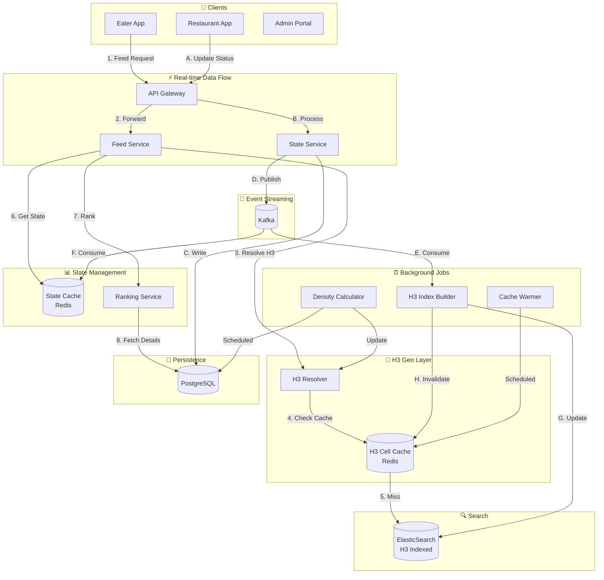
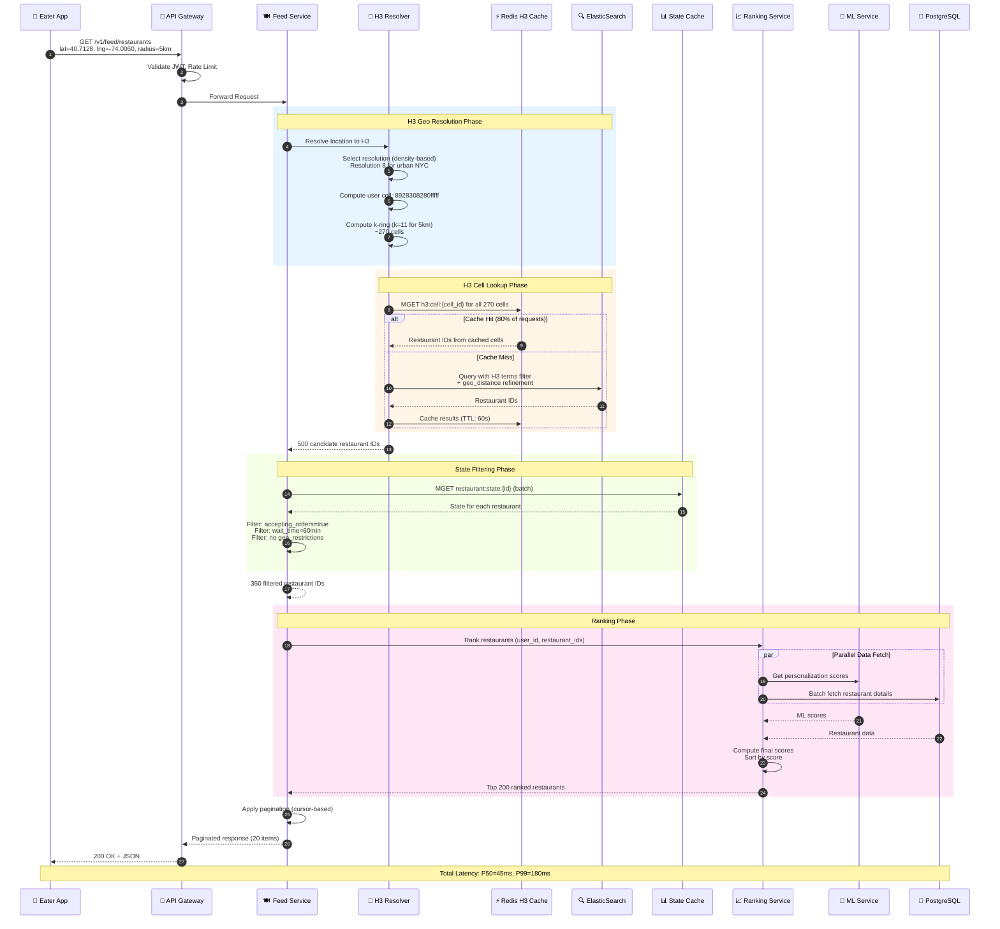
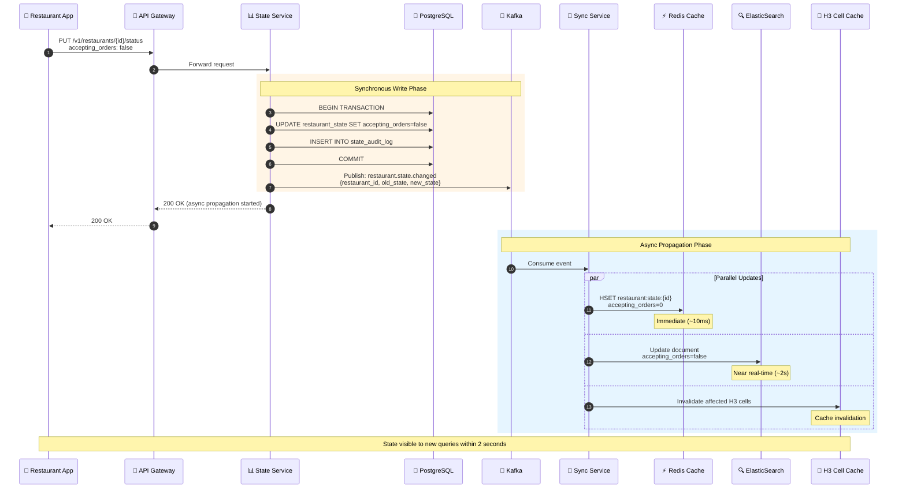
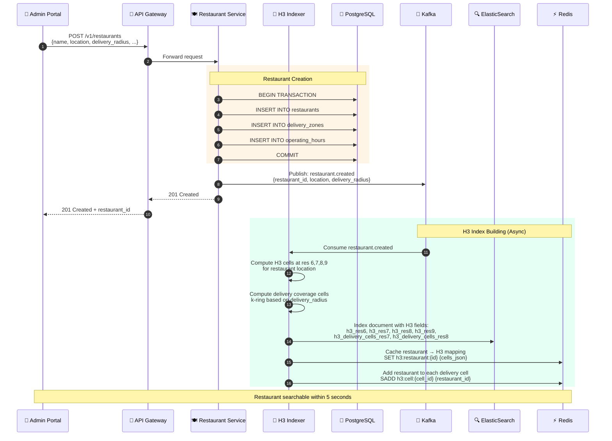
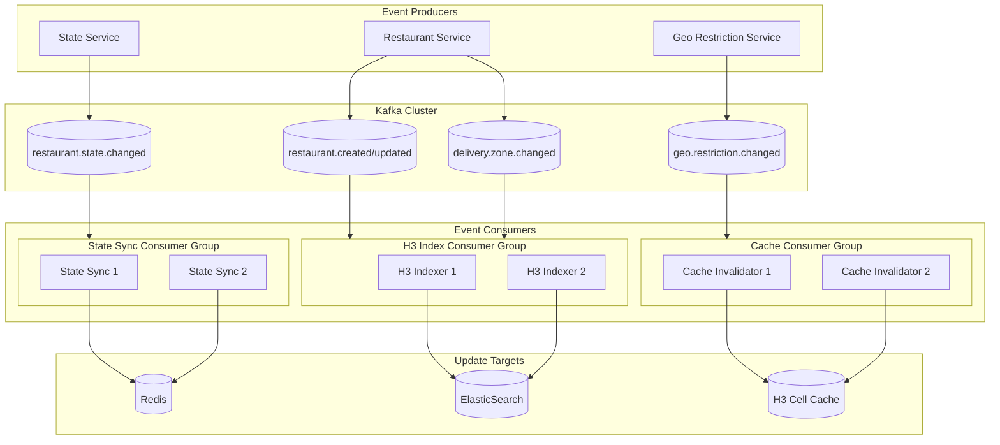
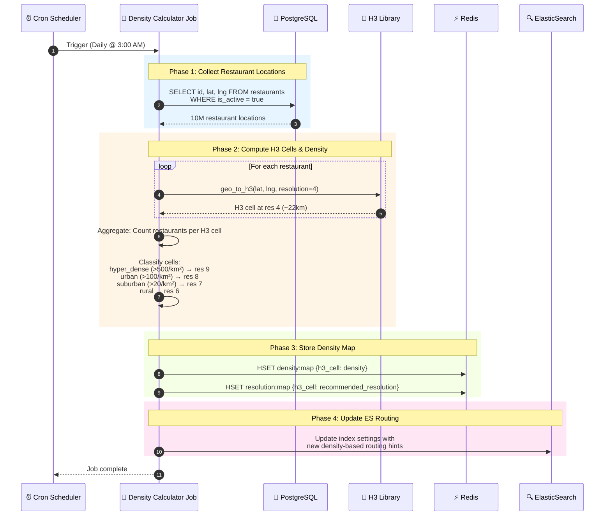
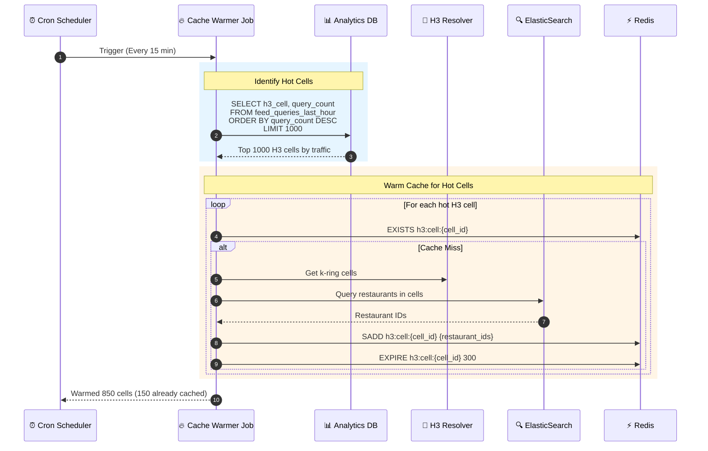
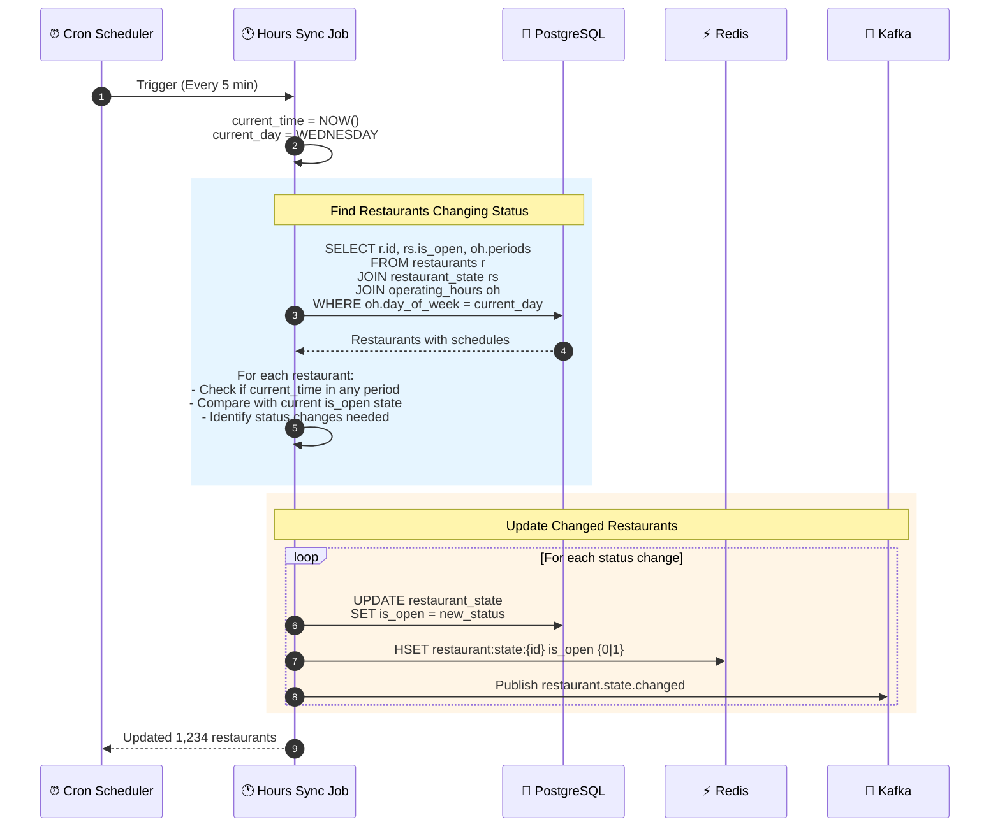
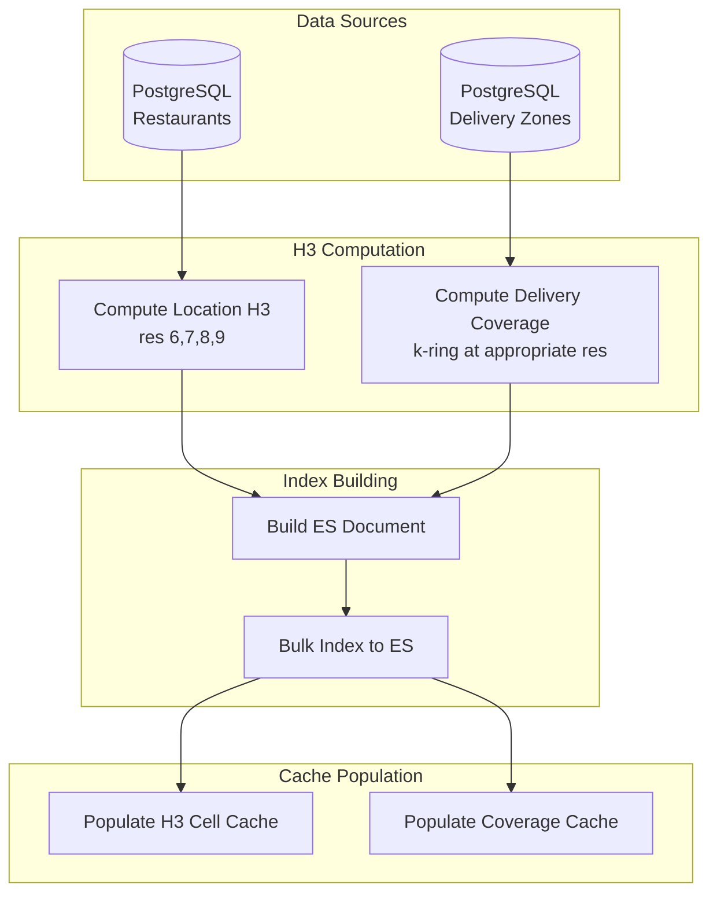
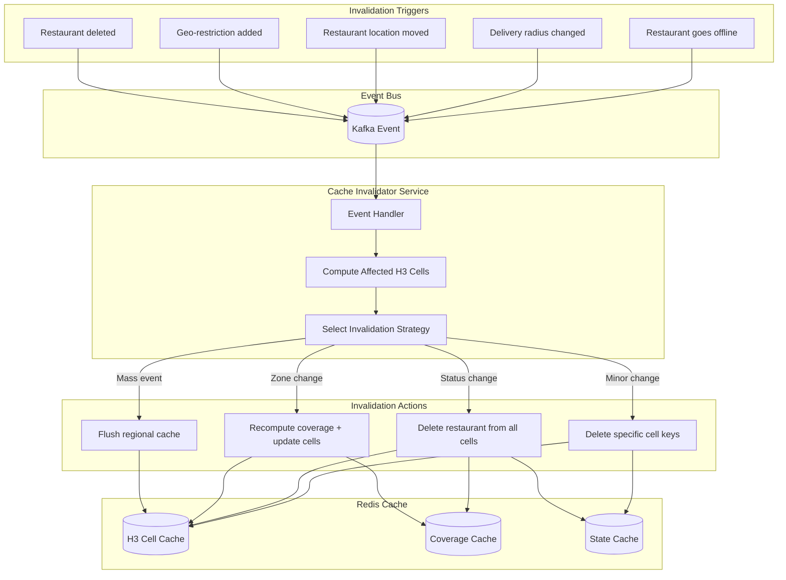

# Data Flow Diagrams

This document provides comprehensive data flow diagrams for the Uber Eats Feed System, showing how data moves between entities, events, and scheduled jobs using **H3 hexagonal indexing** as the geospatial strategy.

---

## 1. System Overview: Complete Data Flow



---

## 2. Read Path: Feed Request Flow

### Complete Read Flow with H3



### Read Flow: Latency Breakdown

```
┌─────────────────────────────────────────────────────────────────────────────┐
│                        READ PATH LATENCY BREAKDOWN                           │
├─────────────────────────────────────────────────────────────────────────────┤
│                                                                              │
│  ┌──────────────────────────────────────────────────────────────────────┐   │
│  │ PHASE                        │ P50      │ P99      │ NOTES           │   │
│  ├──────────────────────────────┼──────────┼──────────┼─────────────────┤   │
│  │ API Gateway                  │ 2ms      │ 5ms      │ Auth + routing  │   │
│  │ H3 Cell Computation          │ 0.1ms    │ 0.5ms    │ CPU-bound       │   │
│  │ K-ring Computation           │ 0.2ms    │ 1ms      │ ~270 cells      │   │
│  │ Redis H3 Cache Lookup        │ 3ms      │ 10ms     │ MGET batch      │   │
│  │ ElasticSearch (on miss)      │ 25ms     │ 80ms     │ H3 terms query  │   │
│  │ State Cache Lookup           │ 2ms      │ 8ms      │ MGET batch      │   │
│  │ Online Filtering             │ 1ms      │ 3ms      │ In-memory       │   │
│  │ Ranking + ML                 │ 15ms     │ 50ms     │ Parallel fetch  │   │
│  │ Pagination                   │ 0.5ms    │ 2ms      │ Cursor encode   │   │
│  ├──────────────────────────────┼──────────┼──────────┼─────────────────┤   │
│  │ TOTAL (Cache Hit)            │ 25ms     │ 80ms     │ 80% of traffic  │   │
│  │ TOTAL (Cache Miss)           │ 50ms     │ 180ms    │ 20% of traffic  │   │
│  └──────────────────────────────┴──────────┴──────────┴─────────────────┘   │
│                                                                              │
└─────────────────────────────────────────────────────────────────────────────┘
```

---

## 3. Write Path: Restaurant Updates

### Restaurant State Change Flow



### Restaurant Creation/Update Flow



---

## 4. Event Flow: Kafka Events

### Event Topics and Consumers

```
┌─────────────────────────────────────────────────────────────────────────────┐
│                           KAFKA EVENT TOPOLOGY                               │
├─────────────────────────────────────────────────────────────────────────────┤
│                                                                              │
│  PRODUCERS                    TOPICS                    CONSUMERS            │
│  ──────────                   ──────                    ─────────            │
│                                                                              │
│  ┌─────────────┐         ┌─────────────────────┐    ┌──────────────────┐    │
│  │ State       │────────▶│ restaurant.state    │───▶│ State Sync Svc   │    │
│  │ Service     │         │ .changed            │    │ (Redis update)   │    │
│  └─────────────┘         │                     │───▶│ ES Sync Svc      │    │
│                          │ Partitions: 16      │    │ (Index update)   │    │
│                          │ Key: restaurant_id  │───▶│ H3 Cache Svc     │    │
│                          └─────────────────────┘    │ (Invalidation)   │    │
│                                                     └──────────────────┘    │
│                                                                              │
│  ┌─────────────┐         ┌─────────────────────┐    ┌──────────────────┐    │
│  │ Restaurant  │────────▶│ restaurant.created  │───▶│ H3 Indexer       │    │
│  │ Service     │         │ restaurant.updated  │    │ (Build H3 index) │    │
│  └─────────────┘         │ restaurant.deleted  │───▶│ Search Indexer   │    │
│                          │                     │    │ (ES document)    │    │
│                          │ Partitions: 8       │───▶│ Analytics Svc    │    │
│                          │ Key: restaurant_id  │    │ (Data warehouse) │    │
│                          └─────────────────────┘    └──────────────────┘    │
│                                                                              │
│  ┌─────────────┐         ┌─────────────────────┐    ┌──────────────────┐    │
│  │ Delivery    │────────▶│ delivery.zone       │───▶│ H3 Coverage      │    │
│  │ Zone Svc    │         │ .changed            │    │ Recalculator     │    │
│  └─────────────┘         │                     │───▶│ Cache Invalidator│    │
│                          │ Partitions: 4       │    │                  │    │
│                          │ Key: restaurant_id  │    └──────────────────┘    │
│                          └─────────────────────┘                            │
│                                                                              │
│  ┌─────────────┐         ┌─────────────────────┐    ┌──────────────────┐    │
│  │ Geo         │────────▶│ geo.restriction     │───▶│ State Cache Svc  │    │
│  │ Restriction │         │ .added/.removed     │    │                  │    │
│  │ Service     │         │                     │───▶│ Feed Filter Svc  │    │
│  └─────────────┘         │ Partitions: 4       │    │                  │    │
│                          │ Key: restaurant_id  │    └──────────────────┘    │
│                          └─────────────────────┘                            │
│                                                                              │
└─────────────────────────────────────────────────────────────────────────────┘
```

### Event Schema Examples

```json
// restaurant.state.changed
{
  "event_id": "evt_20260108_001",
  "event_type": "restaurant.state.changed",
  "timestamp": "2026-01-08T14:30:00Z",
  "restaurant_id": "rest_abc123",
  "payload": {
    "field": "accepting_orders",
    "old_value": true,
    "new_value": false,
    "reason": "kitchen_closed",
    "estimated_reopen_at": "2026-01-08T18:00:00Z"
  },
  "metadata": {
    "source": "restaurant_app",
    "actor_id": "rest_admin_123",
    "correlation_id": "corr_abc123"
  }
}

// restaurant.created
{
  "event_id": "evt_20260108_002",
  "event_type": "restaurant.created",
  "timestamp": "2026-01-08T14:30:00Z",
  "restaurant_id": "rest_xyz789",
  "payload": {
    "name": "Mario's Pizza",
    "location": {
      "lat": 40.7128,
      "lng": -74.0060
    },
    "delivery_radius_km": 5.0,
    "cuisine_types": ["pizza", "italian"],
    "h3_cells": {
      "res6": "862a1070fffffff",
      "res7": "872a10706ffffff",
      "res8": "882a10706dfffff",
      "res9": "892a10706d3ffff"
    }
  }
}

// delivery.zone.changed
{
  "event_id": "evt_20260108_003",
  "event_type": "delivery.zone.changed",
  "timestamp": "2026-01-08T14:30:00Z",
  "restaurant_id": "rest_abc123",
  "payload": {
    "old_radius_km": 5.0,
    "new_radius_km": 7.0,
    "old_h3_coverage_count": 270,
    "new_h3_coverage_count": 520,
    "added_cells": ["882a10706e1ffff", "882a10706e3ffff", ...],
    "removed_cells": []
  }
}
```

### Event Processing Flow



---

## 5. Scheduled Jobs

### Job Schedule Overview

```
┌─────────────────────────────────────────────────────────────────────────────┐
│                           SCHEDULED JOBS                                     │
├─────────────────────────────────────────────────────────────────────────────┤
│                                                                              │
│  JOB NAME                 │ SCHEDULE        │ PURPOSE                       │
│  ─────────────────────────┼─────────────────┼────────────────────────────── │
│  H3 Density Calculator    │ Daily @ 3:00 AM │ Compute restaurant density    │
│                           │                 │ per H3 cell for resolution    │
│                           │                 │ selection                     │
│  ─────────────────────────┼─────────────────┼────────────────────────────── │
│  H3 Cache Warmer          │ Every 15 min    │ Pre-populate cache for        │
│                           │                 │ high-traffic H3 cells         │
│  ─────────────────────────┼─────────────────┼────────────────────────────── │
│  Operating Hours Sync     │ Every 5 min     │ Update is_open status based   │
│                           │                 │ on restaurant schedules       │
│  ─────────────────────────┼─────────────────┼────────────────────────────── │
│  ES Index Optimizer       │ Daily @ 4:00 AM │ Force merge, optimize         │
│                           │                 │ ElasticSearch segments        │
│  ─────────────────────────┼─────────────────┼────────────────────────────── │
│  Stale State Cleanup      │ Hourly          │ Remove expired geo-           │
│                           │                 │ restrictions, reset stuck     │
│                           │                 │ states                        │
│  ─────────────────────────┼─────────────────┼────────────────────────────── │
│  H3 Coverage Recompute    │ Daily @ 2:00 AM │ Recompute H3 delivery         │
│                           │                 │ coverage for all restaurants  │
│  ─────────────────────────┼─────────────────┼────────────────────────────── │
│  Analytics Aggregation    │ Hourly          │ Aggregate feed metrics        │
│                           │                 │ per H3 cell                   │
│                                                                              │
└─────────────────────────────────────────────────────────────────────────────┘
```

### H3 Density Calculator Job



### Cache Warmer Job



### Operating Hours Sync Job



---

## 6. H3 Index Management Flow

### H3 Index Build Pipeline



### H3 Cell Cache Structure

```
┌─────────────────────────────────────────────────────────────────────────────┐
│                        H3 CACHE DATA STRUCTURES                              │
├─────────────────────────────────────────────────────────────────────────────┤
│                                                                              │
│  1. H3 CELL → RESTAURANT IDs                                                │
│  ────────────────────────────────────────────────────────────────────────── │
│  Key:     h3:cell:{h3_index}                                                │
│  Type:    SET                                                               │
│  Value:   {restaurant_id_1, restaurant_id_2, ...}                           │
│  TTL:     60 seconds                                                        │
│                                                                              │
│  Example:                                                                   │
│  h3:cell:8928308280fffff → {"rest_001", "rest_002", "rest_003"}            │
│                                                                              │
│  2. RESTAURANT → H3 CELLS (Location)                                       │
│  ────────────────────────────────────────────────────────────────────────── │
│  Key:     h3:location:{restaurant_id}                                       │
│  Type:    HASH                                                              │
│  Value:   {res6: cell, res7: cell, res8: cell, res9: cell}                 │
│  TTL:     None (invalidated on update)                                      │
│                                                                              │
│  Example:                                                                   │
│  h3:location:rest_001 → {                                                   │
│    "res6": "862a1070fffffff",                                               │
│    "res7": "872a10706ffffff",                                               │
│    "res8": "882a10706dfffff",                                               │
│    "res9": "892a10706d3ffff"                                                │
│  }                                                                          │
│                                                                              │
│  3. RESTAURANT → DELIVERY COVERAGE H3 CELLS                                │
│  ────────────────────────────────────────────────────────────────────────── │
│  Key:     h3:coverage:{restaurant_id}:{resolution}                          │
│  Type:    SET                                                               │
│  Value:   {h3_cell_1, h3_cell_2, ...} (all cells restaurant delivers to)   │
│  TTL:     5 minutes                                                         │
│                                                                              │
│  Example:                                                                   │
│  h3:coverage:rest_001:8 → {"8928308280fffff", "8928308281fffff", ...}      │
│  (Contains ~270 cells for 5km delivery radius at resolution 8)              │
│                                                                              │
│  4. DENSITY MAP                                                             │
│  ────────────────────────────────────────────────────────────────────────── │
│  Key:     h3:density:map                                                    │
│  Type:    HASH                                                              │
│  Value:   {h3_cell_res4: restaurants_per_km2}                               │
│  TTL:     None (updated daily by job)                                       │
│                                                                              │
│  Example:                                                                   │
│  h3:density:map → {                                                         │
│    "842a100ffffffff": "523",  // Manhattan - hyper dense                   │
│    "842a107ffffffff": "89",   // Brooklyn - urban                          │
│    "842a10fffffffff": "12"    // Suburbs - low density                     │
│  }                                                                          │
│                                                                              │
│  5. RESOLUTION MAP                                                          │
│  ────────────────────────────────────────────────────────────────────────── │
│  Key:     h3:resolution:map                                                 │
│  Type:    HASH                                                              │
│  Value:   {h3_cell_res4: recommended_resolution}                            │
│  TTL:     None (updated daily by job)                                       │
│                                                                              │
│  Example:                                                                   │
│  h3:resolution:map → {                                                      │
│    "842a100ffffffff": "9",    // Manhattan - use res 9                     │
│    "842a107ffffffff": "8",    // Brooklyn - use res 8                      │
│    "842a10fffffffff": "7"     // Suburbs - use res 7                       │
│  }                                                                          │
│                                                                              │
└─────────────────────────────────────────────────────────────────────────────┘
```

---

## 7. Cache Invalidation Flow

### Invalidation Triggers and Propagation



### Invalidation Strategy Matrix

```
┌─────────────────────────────────────────────────────────────────────────────┐
│                      CACHE INVALIDATION STRATEGIES                           │
├─────────────────────────────────────────────────────────────────────────────┤
│                                                                              │
│  TRIGGER                   │ STRATEGY              │ AFFECTED KEYS          │
│  ──────────────────────────┼───────────────────────┼─────────────────────── │
│  Restaurant goes offline   │ State update only     │ restaurant:state:{id}  │
│                            │ No cell invalidation  │                        │
│                            │ (filtered at query)   │                        │
│  ──────────────────────────┼───────────────────────┼─────────────────────── │
│  Delivery radius increased │ Compute new cells     │ h3:coverage:{id}:*     │
│                            │ Add to new cells      │ h3:cell:{new_cells}    │
│                            │ Keep old cells        │                        │
│  ──────────────────────────┼───────────────────────┼─────────────────────── │
│  Delivery radius decreased │ Compute removed cells │ h3:coverage:{id}:*     │
│                            │ SREM from old cells   │ h3:cell:{old_cells}    │
│  ──────────────────────────┼───────────────────────┼─────────────────────── │
│  Restaurant location moved │ Full recompute        │ h3:location:{id}       │
│                            │ Remove from old cells │ h3:coverage:{id}:*     │
│                            │ Add to new cells      │ h3:cell:{all_cells}    │
│  ──────────────────────────┼───────────────────────┼─────────────────────── │
│  Restaurant deleted        │ Full removal          │ h3:location:{id}       │
│                            │                       │ h3:coverage:{id}:*     │
│                            │                       │ h3:cell:{all_cells}    │
│                            │                       │ restaurant:state:{id}  │
│  ──────────────────────────┼───────────────────────┼─────────────────────── │
│  Mass outage (>100 rest)   │ Regional flush        │ h3:cell:* (pattern)    │
│                            │                       │ (by H3 prefix)         │
│  ──────────────────────────┼───────────────────────┼─────────────────────── │
│  Index rebuild             │ Full cache flush      │ FLUSHDB                │
│                                                                              │
└─────────────────────────────────────────────────────────────────────────────┘
```

---

## 8. Complete System Data Flow Summary

```
┌─────────────────────────────────────────────────────────────────────────────┐
│                    UBER EATS FEED - COMPLETE DATA FLOW                       │
├─────────────────────────────────────────────────────────────────────────────┤
│                                                                              │
│  ┌─────────────────────────────────────────────────────────────────────────┐│
│  │                           READ PATH                                      ││
│  │                                                                          ││
│  │  📱 Eater App                                                            ││
│  │      │                                                                   ││
│  │      ▼                                                                   ││
│  │  🚪 API Gateway ──▶ 🍽️ Feed Service                                      ││
│  │                          │                                               ││
│  │                          ├──▶ 🔷 H3 Resolver ──▶ ⚡ Redis H3 Cache       ││
│  │                          │         │                    │                ││
│  │                          │         │              (miss)▼                ││
│  │                          │         └──────────▶ 🔍 ElasticSearch         ││
│  │                          │                                               ││
│  │                          ├──▶ 📊 State Cache (Redis)                     ││
│  │                          │                                               ││
│  │                          └──▶ 📈 Ranking Service ──▶ 💾 PostgreSQL       ││
│  │                                      │                                   ││
│  │                                      └──▶ 🤖 ML Service                  ││
│  │                                                                          ││
│  └─────────────────────────────────────────────────────────────────────────┘│
│                                                                              │
│  ┌─────────────────────────────────────────────────────────────────────────┐│
│  │                          WRITE PATH                                      ││
│  │                                                                          ││
│  │  🍕 Restaurant App / 👤 Admin Portal                                     ││
│  │      │                                                                   ││
│  │      ▼                                                                   ││
│  │  🚪 API Gateway ──▶ 📊 State Service / 🍽️ Restaurant Service            ││
│  │                          │                                               ││
│  │                          ├──▶ 💾 PostgreSQL (source of truth)            ││
│  │                          │                                               ││
│  │                          └──▶ 📨 Kafka (events)                          ││
│  │                                                                          ││
│  └─────────────────────────────────────────────────────────────────────────┘│
│                                                                              │
│  ┌─────────────────────────────────────────────────────────────────────────┐│
│  │                          EVENT PATH                                      ││
│  │                                                                          ││
│  │  📨 Kafka                                                                ││
│  │      │                                                                   ││
│  │      ├──▶ 🔄 State Sync ──▶ ⚡ Redis State Cache                         ││
│  │      │                                                                   ││
│  │      ├──▶ 🔷 H3 Indexer ──▶ 🔍 ElasticSearch                            ││
│  │      │         │                                                         ││
│  │      │         └──▶ ⚡ Redis H3 Cache (invalidation)                     ││
│  │      │                                                                   ││
│  │      └──▶ 📊 Analytics ──▶ 📈 Data Warehouse                            ││
│  │                                                                          ││
│  └─────────────────────────────────────────────────────────────────────────┘│
│                                                                              │
│  ┌─────────────────────────────────────────────────────────────────────────┐│
│  │                        SCHEDULED JOBS                                    ││
│  │                                                                          ││
│  │  ⏰ Cron                                                                 ││
│  │      │                                                                   ││
│  │      ├──▶ 🔷 H3 Density Calculator (daily) ──▶ ⚡ Redis density map     ││
│  │      │                                                                   ││
│  │      ├──▶ 🔥 Cache Warmer (15 min) ──▶ ⚡ Redis H3 Cache                 ││
│  │      │                                                                   ││
│  │      ├──▶ 🕐 Operating Hours Sync (5 min) ──▶ ⚡ Redis + 📨 Kafka       ││
│  │      │                                                                   ││
│  │      └──▶ 🧹 Stale State Cleanup (hourly) ──▶ ⚡ Redis + 💾 PostgreSQL  ││
│  │                                                                          ││
│  └─────────────────────────────────────────────────────────────────────────┘│
│                                                                              │
│  LEGEND:                                                                    │
│  ──────                                                                     │
│  📱 Client Apps     🚪 API Gateway    🍽️ Feed Service    🔷 H3 Components   │
│  ⚡ Redis           🔍 ElasticSearch  💾 PostgreSQL      📨 Kafka           │
│  📊 State/Analytics 📈 Ranking/ML     ⏰ Scheduled Jobs  🔄 Sync Services   │
│                                                                              │
└─────────────────────────────────────────────────────────────────────────────┘
```

