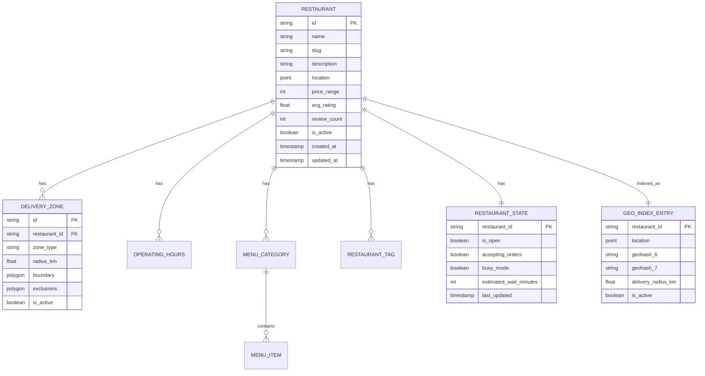
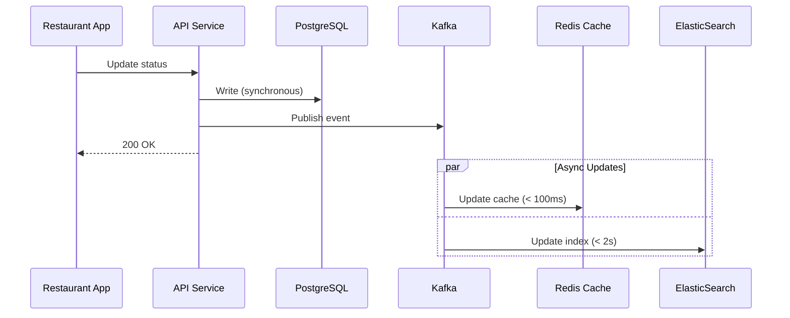

# Data Models

This document defines the data schemas for the Uber Eats Feed System, including restaurant entities, geolocation structures, and index schemas.

## Data Model Overview



---

## PostgreSQL Schemas

### 1. Restaurant Table

Primary table storing restaurant metadata.

```sql
CREATE TABLE restaurants (
    id              VARCHAR(32) PRIMARY KEY,
    name            VARCHAR(255) NOT NULL,
    slug            VARCHAR(255) UNIQUE NOT NULL,
    description     TEXT,

    -- Location
    location        GEOGRAPHY(POINT, 4326) NOT NULL,
    address_line1   VARCHAR(255) NOT NULL,
    address_line2   VARCHAR(255),
    city            VARCHAR(100) NOT NULL,
    state           VARCHAR(50),
    postal_code     VARCHAR(20),
    country         VARCHAR(2) NOT NULL DEFAULT 'US',
    timezone        VARCHAR(50) NOT NULL DEFAULT 'UTC',

    -- Business Info
    phone           VARCHAR(20),
    email           VARCHAR(255),
    website_url     VARCHAR(500),

    -- Attributes
    cuisine_types   VARCHAR(50)[] NOT NULL DEFAULT '{}',
    price_range     SMALLINT CHECK (price_range BETWEEN 1 AND 4),
    dietary_options VARCHAR(50)[] DEFAULT '{}',
    features        VARCHAR(50)[] DEFAULT '{}',

    -- Ratings
    avg_rating      DECIMAL(3, 2) DEFAULT 0.00,
    review_count    INTEGER DEFAULT 0,

    -- Media
    logo_url        VARCHAR(500),
    hero_image_url  VARCHAR(500),
    hero_blurhash   VARCHAR(100),

    -- Status
    is_active       BOOLEAN DEFAULT TRUE,
    is_verified     BOOLEAN DEFAULT FALSE,
    onboarding_status VARCHAR(20) DEFAULT 'pending',

    -- Timestamps
    created_at      TIMESTAMP WITH TIME ZONE DEFAULT NOW(),
    updated_at      TIMESTAMP WITH TIME ZONE DEFAULT NOW(),

    -- Indexes
    CONSTRAINT valid_rating CHECK (avg_rating >= 0 AND avg_rating <= 5)
);

-- Indexes
CREATE INDEX idx_restaurants_location ON restaurants USING GIST (location);
CREATE INDEX idx_restaurants_cuisine ON restaurants USING GIN (cuisine_types);
CREATE INDEX idx_restaurants_active ON restaurants (is_active) WHERE is_active = TRUE;
CREATE INDEX idx_restaurants_rating ON restaurants (avg_rating DESC) WHERE is_active = TRUE;
CREATE INDEX idx_restaurants_created ON restaurants (created_at);

-- Partitioning by country for multi-region deployment
-- (In production, would partition by country/region)
```

### 2. Delivery Zones Table

Defines where each restaurant can deliver.

```sql
CREATE TABLE delivery_zones (
    id              VARCHAR(32) PRIMARY KEY,
    restaurant_id   VARCHAR(32) NOT NULL REFERENCES restaurants(id),

    -- Zone Definition
    zone_type       VARCHAR(20) NOT NULL CHECK (zone_type IN ('radius', 'polygon', 'hybrid')),
    radius_km       DECIMAL(5, 2),
    boundary        GEOGRAPHY(POLYGON, 4326),

    -- Exclusions (areas within zone that can't be delivered to)
    exclusions      JSONB DEFAULT '[]',
    -- Example: [{"name": "Manhattan Bridge", "polygon": [[lng, lat], ...]}]

    -- Delivery Settings
    base_fee        DECIMAL(10, 2) DEFAULT 0.00,
    fee_per_km      DECIMAL(10, 2) DEFAULT 0.00,
    min_order       DECIMAL(10, 2) DEFAULT 0.00,
    max_order       DECIMAL(10, 2),

    -- Status
    is_active       BOOLEAN DEFAULT TRUE,

    -- Timestamps
    created_at      TIMESTAMP WITH TIME ZONE DEFAULT NOW(),
    updated_at      TIMESTAMP WITH TIME ZONE DEFAULT NOW(),

    CONSTRAINT valid_zone CHECK (
        (zone_type = 'radius' AND radius_km IS NOT NULL) OR
        (zone_type = 'polygon' AND boundary IS NOT NULL) OR
        (zone_type = 'hybrid' AND radius_km IS NOT NULL)
    )
);

CREATE INDEX idx_delivery_zones_restaurant ON delivery_zones (restaurant_id);
CREATE INDEX idx_delivery_zones_boundary ON delivery_zones USING GIST (boundary);
```

### 3. Operating Hours Table

Weekly schedule and special hours.

```sql
CREATE TABLE operating_hours (
    id              VARCHAR(32) PRIMARY KEY,
    restaurant_id   VARCHAR(32) NOT NULL REFERENCES restaurants(id),

    -- Day of Week (0 = Sunday, 6 = Saturday)
    day_of_week     SMALLINT NOT NULL CHECK (day_of_week BETWEEN 0 AND 6),

    -- Time Periods (multiple periods for split shifts)
    periods         JSONB NOT NULL DEFAULT '[]',
    -- Example: [{"open": "11:00", "close": "14:00"}, {"open": "17:00", "close": "22:00"}]

    is_closed       BOOLEAN DEFAULT FALSE,

    UNIQUE (restaurant_id, day_of_week)
);

CREATE TABLE special_hours (
    id              VARCHAR(32) PRIMARY KEY,
    restaurant_id   VARCHAR(32) NOT NULL REFERENCES restaurants(id),

    date            DATE NOT NULL,
    is_closed       BOOLEAN DEFAULT FALSE,
    periods         JSONB,
    reason          VARCHAR(255),

    UNIQUE (restaurant_id, date)
);

CREATE INDEX idx_operating_hours_restaurant ON operating_hours (restaurant_id);
CREATE INDEX idx_special_hours_date ON special_hours (restaurant_id, date);
```

### 4. Restaurant State Table (Hot Data)

Real-time operational state, updated frequently.

```sql
CREATE TABLE restaurant_state (
    restaurant_id       VARCHAR(32) PRIMARY KEY REFERENCES restaurants(id),

    -- Availability
    is_open             BOOLEAN DEFAULT FALSE,
    accepting_orders    BOOLEAN DEFAULT TRUE,
    busy_mode           BOOLEAN DEFAULT FALSE,

    -- Wait Times
    estimated_wait_minutes  SMALLINT DEFAULT 0,
    prep_time_minutes       SMALLINT DEFAULT 15,

    -- Capacity
    active_orders       INTEGER DEFAULT 0,
    max_concurrent_orders INTEGER DEFAULT 50,

    -- Temporary Status
    temporary_closure_reason VARCHAR(100),
    estimated_reopen_at     TIMESTAMP WITH TIME ZONE,

    -- Geo Restrictions (temporary)
    geo_restrictions    JSONB DEFAULT '[]',
    -- Example: [{"type": "exclude", "polygon": [...], "reason": "bridge closure", "expires": "..."}]

    -- Timestamps
    last_order_at       TIMESTAMP WITH TIME ZONE,
    state_updated_at    TIMESTAMP WITH TIME ZONE DEFAULT NOW(),

    -- Version for optimistic locking
    version             INTEGER DEFAULT 1
);

CREATE INDEX idx_restaurant_state_open ON restaurant_state (is_open, accepting_orders);
```

---

## Redis Schemas

### 1. Restaurant State Cache

Fast access to real-time restaurant state.

```
Key Pattern: restaurant:state:{restaurant_id}
Type: Hash
TTL: None (updated on change)

Fields:
- is_open: "1" | "0"
- accepting_orders: "1" | "0"
- busy_mode: "1" | "0"
- wait_minutes: "15"
- updated_at: "2026-01-08T14:30:00Z"
- geo_restrictions: "[{...}]" (JSON string)
```

**Example:**
```redis
HGETALL restaurant:state:rest_abc123
# Returns:
# is_open: "1"
# accepting_orders: "1"
# busy_mode: "0"
# wait_minutes: "0"
# updated_at: "2026-01-08T14:30:00Z"
```

### 2. Geo Cache

Caches restaurant IDs by geohash cell.

```
Key Pattern: geo:cell:{geohash}:{radius_bucket}
Type: Set
TTL: 60 seconds

Value: Set of restaurant IDs that can deliver to this cell
```

**Example:**
```redis
SMEMBERS geo:cell:dr5ru7:5km
# Returns: ["rest_abc123", "rest_def456", "rest_ghi789", ...]

# Radius buckets: 1km, 3km, 5km, 10km, 15km
```

### 3. Feed Result Cache

Caches fully computed feed results for common queries.

```
Key Pattern: feed:cache:{geohash}:{filters_hash}
Type: String (JSON)
TTL: 30 seconds

Value: Pre-computed feed response (first page only)
```

### 4. User Preferences Cache

Caches user preferences for personalization.

```
Key Pattern: user:prefs:{user_id}
Type: Hash
TTL: 30 minutes

Fields:
- favorite_cuisines: "italian,pizza,chinese"
- price_preference: "2,3"
- dietary: "vegetarian"
- recent_restaurants: "rest_abc123,rest_def456"
- order_history_30d: "12"
```

---

## ElasticSearch Index Schema

### Restaurant Geo Index

Primary index for geo-spatial queries.

```json
{
  "settings": {
    "number_of_shards": 10,
    "number_of_replicas": 2,
    "refresh_interval": "1s",
    "analysis": {
      "analyzer": {
        "restaurant_name_analyzer": {
          "type": "custom",
          "tokenizer": "standard",
          "filter": ["lowercase", "asciifolding", "edge_ngram_filter"]
        }
      },
      "filter": {
        "edge_ngram_filter": {
          "type": "edge_ngram",
          "min_gram": 2,
          "max_gram": 20
        }
      }
    }
  },
  "mappings": {
    "properties": {
      "restaurant_id": {
        "type": "keyword"
      },
      "name": {
        "type": "text",
        "analyzer": "restaurant_name_analyzer",
        "fields": {
          "keyword": { "type": "keyword" },
          "suggest": { "type": "completion" }
        }
      },
      "location": {
        "type": "geo_point"
      },
      "geohash_5": {
        "type": "keyword"
      },
      "geohash_6": {
        "type": "keyword"
      },
      "geohash_7": {
        "type": "keyword"
      },
      "delivery_radius_km": {
        "type": "float"
      },
      "delivery_polygon": {
        "type": "geo_shape"
      },
      "cuisine_types": {
        "type": "keyword"
      },
      "price_range": {
        "type": "integer"
      },
      "dietary_options": {
        "type": "keyword"
      },
      "avg_rating": {
        "type": "float"
      },
      "review_count": {
        "type": "integer"
      },
      "is_active": {
        "type": "boolean"
      },
      "is_open": {
        "type": "boolean"
      },
      "accepting_orders": {
        "type": "boolean"
      },
      "features": {
        "type": "keyword"
      },
      "promotion_active": {
        "type": "boolean"
      },
      "created_at": {
        "type": "date"
      },
      "updated_at": {
        "type": "date"
      }
    }
  }
}
```

### Sample Geo Query

```json
{
  "query": {
    "bool": {
      "must": [
        { "term": { "is_active": true } },
        { "term": { "accepting_orders": true } }
      ],
      "filter": [
        {
          "geo_distance": {
            "distance": "5km",
            "location": {
              "lat": 40.7128,
              "lon": -74.0060
            }
          }
        }
      ],
      "should": [
        { "terms": { "cuisine_types": ["pizza", "italian"] } }
      ]
    }
  },
  "sort": [
    {
      "_geo_distance": {
        "location": { "lat": 40.7128, "lon": -74.0060 },
        "order": "asc",
        "unit": "km"
      }
    }
  ],
  "size": 100
}
```

---

## Kafka Event Schemas

### 1. Restaurant State Change Event

```json
{
  "event_id": "evt_20260108_001",
  "event_type": "RESTAURANT_STATE_CHANGED",
  "timestamp": "2026-01-08T14:30:00Z",
  "restaurant_id": "rest_abc123",
  "payload": {
    "previous_state": {
      "is_open": true,
      "accepting_orders": true,
      "busy_mode": false
    },
    "new_state": {
      "is_open": true,
      "accepting_orders": false,
      "busy_mode": false,
      "reason": "kitchen_closed",
      "estimated_reopen_at": "2026-01-08T18:00:00Z"
    }
  },
  "metadata": {
    "source": "restaurant_app",
    "actor_id": "rest_admin_123",
    "correlation_id": "corr_abc123"
  }
}
```

### 2. Restaurant Created/Updated Event

```json
{
  "event_id": "evt_20260108_002",
  "event_type": "RESTAURANT_UPDATED",
  "timestamp": "2026-01-08T14:30:00Z",
  "restaurant_id": "rest_abc123",
  "payload": {
    "fields_updated": ["delivery_radius_km", "delivery_zones"],
    "delivery_radius_km": 6.0,
    "delivery_zones": [
      {
        "zone_type": "radius",
        "radius_km": 6.0,
        "exclusions": []
      }
    ]
  },
  "metadata": {
    "source": "admin_portal",
    "actor_id": "admin_456"
  }
}
```

### 3. Geo Restriction Event

```json
{
  "event_id": "evt_20260108_003",
  "event_type": "GEO_RESTRICTION_ADDED",
  "timestamp": "2026-01-08T14:30:00Z",
  "restaurant_id": "rest_abc123",
  "payload": {
    "restriction": {
      "type": "exclude_polygon",
      "name": "Manhattan Bridge Area",
      "polygon": [
        [-73.9857, 40.7074],
        [-73.9901, 40.7089],
        [-73.9912, 40.7056],
        [-73.9857, 40.7074]
      ],
      "reason": "delivery_time_too_long",
      "expires_at": null
    }
  }
}
```

---

## Data Type Definitions

### Restaurant Entity (Application Layer)

```typescript
interface Restaurant {
  id: string;
  name: string;
  slug: string;
  description?: string;

  location: {
    lat: number;
    lng: number;
    address: Address;
    timezone: string;
  };

  cuisineTypes: string[];
  priceRange: 1 | 2 | 3 | 4;
  dietaryOptions: DietaryOption[];
  features: Feature[];

  rating: {
    score: number;
    count: number;
  };

  media: {
    logoUrl?: string;
    heroImageUrl?: string;
    heroBlurhash?: string;
    galleryUrls: string[];
  };

  delivery: {
    radiusKm: number;
    zones: DeliveryZone[];
    baseFee: Money;
    feePerKm: Money;
    minOrder: Money;
    estimatedMinutes: { min: number; max: number };
  };

  operatingHours: OperatingHours;

  status: RestaurantStatus;

  isActive: boolean;
  isVerified: boolean;

  createdAt: Date;
  updatedAt: Date;
}

interface Address {
  line1: string;
  line2?: string;
  city: string;
  state?: string;
  postalCode: string;
  country: string;
}

interface DeliveryZone {
  id: string;
  type: 'radius' | 'polygon' | 'hybrid';
  radiusKm?: number;
  boundary?: Polygon;
  exclusions: ExclusionZone[];
  isActive: boolean;
}

interface ExclusionZone {
  name: string;
  polygon: Polygon;
  reason?: string;
  expiresAt?: Date;
}

interface RestaurantStatus {
  isOpen: boolean;
  acceptingOrders: boolean;
  busyMode: boolean;
  estimatedWaitMinutes: number;
  temporaryClosureReason?: string;
  estimatedReopenAt?: Date;
  geoRestrictions: GeoRestriction[];
}

interface GeoRestriction {
  type: 'exclude_polygon' | 'exclude_radius';
  name: string;
  geometry: Polygon | Circle;
  reason: string;
  expiresAt?: Date;
}

type DietaryOption = 'vegetarian' | 'vegan' | 'halal' | 'kosher' | 'gluten_free';
type Feature = 'pickup' | 'curbside' | 'contactless' | 'uber_one' | 'scheduled_orders';
type Polygon = [number, number][];
type Circle = { center: [number, number]; radiusKm: number };
interface Money { amount: number; currency: string; }
```

---

## Data Consistency Model

### Consistency Guarantees

| Data Type | Consistency | Update Latency |
|-----------|-------------|----------------|
| Restaurant metadata | Strong (PostgreSQL) | N/A |
| Restaurant state | Eventual (Redis + ES) | < 2 seconds |
| Geo index | Eventual (ES) | < 5 seconds |
| Feed cache | Eventual (Redis) | TTL: 60 seconds |

### State Synchronization Flow



### Conflict Resolution

- **Last-write-wins** for state updates (timestamp-based)
- **Version vectors** for concurrent updates from multiple sources
- **Idempotency keys** for duplicate event handling

