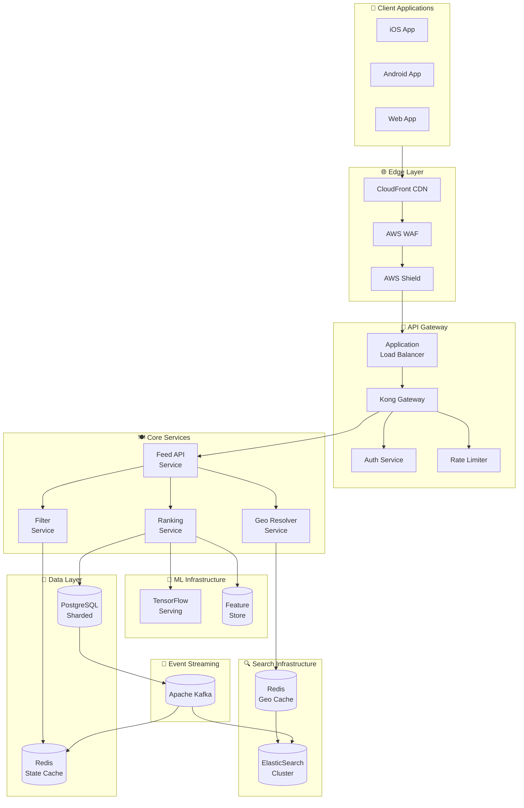
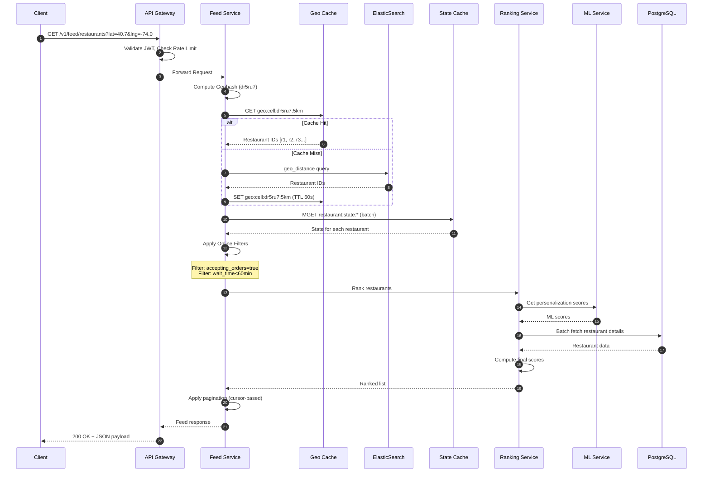
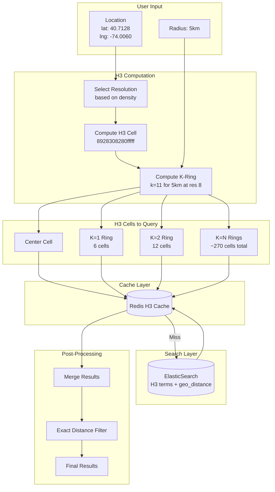
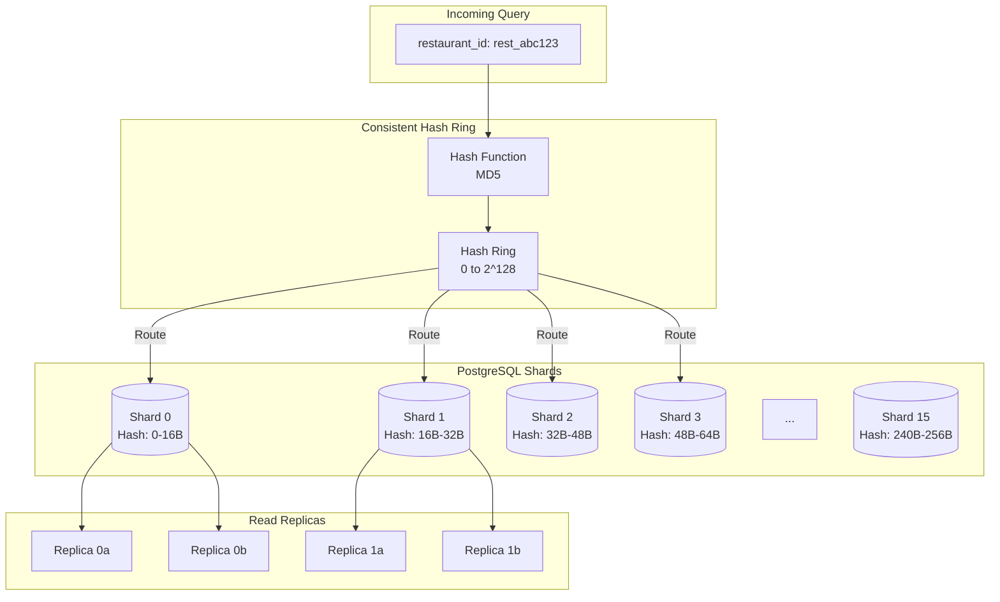
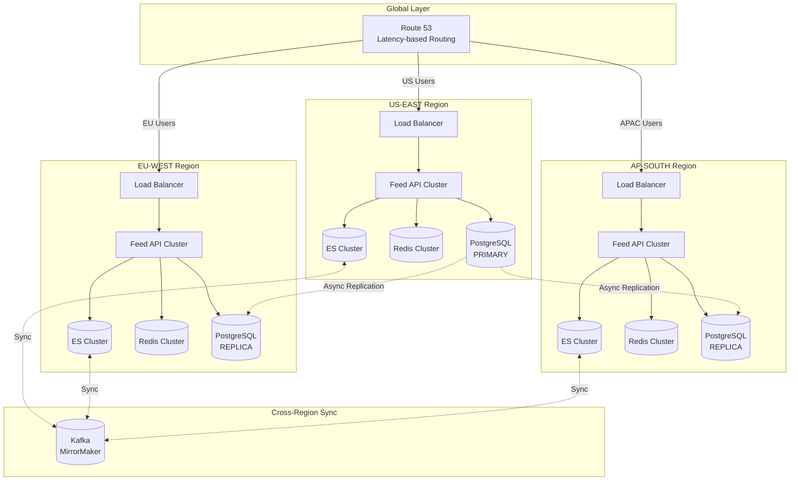
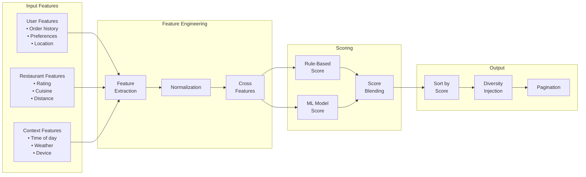
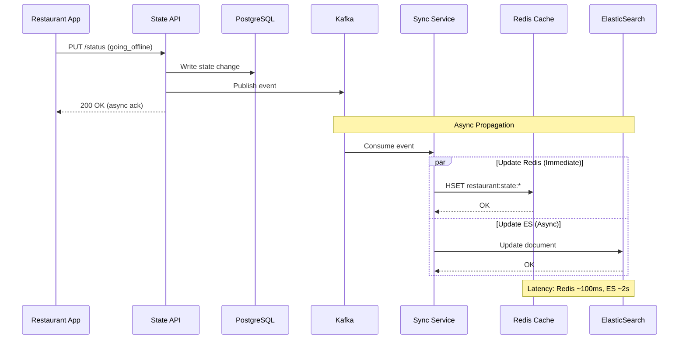

# Architecture Diagrams

This document contains detailed visual representations of the Uber Eats Feed System architecture.

## 1. High-Level System Architecture

### Mermaid Diagram



### ASCII Diagram

```
╔══════════════════════════════════════════════════════════════════════════════════╗
║                              UBER EATS FEED SYSTEM                               ║
╠══════════════════════════════════════════════════════════════════════════════════╣
║                                                                                  ║
║  ┌──────────────────────────────────────────────────────────────────────────┐    ║
║  │                           CLIENT LAYER                                    │    ║
║  │   ┌─────────┐    ┌─────────┐    ┌─────────┐                              │    ║
║  │   │   iOS   │    │ Android │    │   Web   │                              │    ║
║  │   └────┬────┘    └────┬────┘    └────┬────┘                              │    ║
║  └────────┼──────────────┼──────────────┼───────────────────────────────────┘    ║
║           └──────────────┼──────────────┘                                        ║
║                          ▼                                                       ║
║  ┌──────────────────────────────────────────────────────────────────────────┐    ║
║  │                            EDGE LAYER                                     │    ║
║  │   ┌──────────────┐    ┌──────────────┐    ┌──────────────┐               │    ║
║  │   │ CloudFront   │───▶│    WAF       │───▶│   Shield     │               │    ║
║  │   │ (CDN)        │    │ (Firewall)   │    │ (DDoS)       │               │    ║
║  │   └──────────────┘    └──────────────┘    └──────┬───────┘               │    ║
║  └──────────────────────────────────────────────────┼───────────────────────┘    ║
║                                                     ▼                            ║
║  ┌──────────────────────────────────────────────────────────────────────────┐    ║
║  │                          API GATEWAY LAYER                                │    ║
║  │   ┌─────────────────────────────────────────────────────────────────┐    │    ║
║  │   │                    Kong API Gateway                              │    │    ║
║  │   │  ┌─────────┐  ┌─────────┐  ┌─────────┐  ┌─────────┐            │    │    ║
║  │   │  │  Auth   │  │  Rate   │  │ Circuit │  │ Request │            │    │    ║
║  │   │  │ Plugin  │  │ Limiter │  │ Breaker │  │ Logger  │            │    │    ║
║  │   │  └─────────┘  └─────────┘  └─────────┘  └─────────┘            │    │    ║
║  │   └─────────────────────────────────────────────────────────────────┘    │    ║
║  └──────────────────────────────────────────────────┬───────────────────────┘    ║
║                                                     ▼                            ║
║  ┌──────────────────────────────────────────────────────────────────────────┐    ║
║  │                         CORE SERVICES LAYER                               │    ║
║  │                                                                           │    ║
║  │   ┌─────────────────┐    ┌─────────────────┐    ┌─────────────────┐      │    ║
║  │   │   Feed API      │───▶│  Geo Resolver   │───▶│   Filter        │      │    ║
║  │   │   Service       │    │  Service        │    │   Service       │      │    ║
║  │   └────────┬────────┘    └────────┬────────┘    └────────┬────────┘      │    ║
║  │            │                      │                      │                │    ║
║  │            ▼                      ▼                      ▼                │    ║
║  │   ┌─────────────────┐    ┌─────────────────┐    ┌─────────────────┐      │    ║
║  │   │   Ranking       │    │   Geo Cache     │    │   State Cache   │      │    ║
║  │   │   Service       │    │   (Redis)       │    │   (Redis)       │      │    ║
║  │   └────────┬────────┘    └────────┬────────┘    └─────────────────┘      │    ║
║  └────────────┼──────────────────────┼──────────────────────────────────────┘    ║
║               │                      │                                           ║
║               ▼                      ▼                                           ║
║  ┌────────────────────────┐    ┌────────────────────────────────────────────┐    ║
║  │     ML LAYER           │    │           SEARCH LAYER                     │    ║
║  │  ┌─────────────────┐   │    │   ┌────────────────────────────────────┐   │    ║
║  │  │ TensorFlow      │   │    │   │        ElasticSearch Cluster       │   │    ║
║  │  │ Serving         │   │    │   │   ┌──────┐ ┌──────┐ ┌──────┐      │   │    ║
║  │  └─────────────────┘   │    │   │   │Shard1│ │Shard2│ │Shard3│ ...  │   │    ║
║  │  ┌─────────────────┐   │    │   │   └──────┘ └──────┘ └──────┘      │   │    ║
║  │  │ Feature Store   │   │    │   └────────────────────────────────────┘   │    ║
║  │  └─────────────────┘   │    └────────────────────────────────────────────┘    ║
║  └────────────────────────┘                                                      ║
║               │                                                                  ║
║               ▼                                                                  ║
║  ┌──────────────────────────────────────────────────────────────────────────┐    ║
║  │                           DATA LAYER                                      │    ║
║  │   ┌──────────────────────────────────────────────────────────────────┐   │    ║
║  │   │              PostgreSQL (Sharded by Restaurant ID)                │   │    ║
║  │   │   ┌────────┐  ┌────────┐  ┌────────┐  ┌────────┐                 │   │    ║
║  │   │   │Shard 0 │  │Shard 1 │  │Shard 2 │  │  ...   │                 │   │    ║
║  │   │   └────────┘  └────────┘  └────────┘  └────────┘                 │   │    ║
║  │   └──────────────────────────────────────────────────────────────────┘   │    ║
║  └──────────────────────────────────────────────────────────────────────────┘    ║
║                                                                                  ║
╚══════════════════════════════════════════════════════════════════════════════════╝
```

---

## 2. Request Flow Sequence

### Feed Request Flow



---

## 3. Geo Search Architecture

### H3 Hexagonal Search Flow



### H3 Hexagonal Grid Visualization

```
┌─────────────────────────────────────────────────────────────────────────────┐
│                      H3 HEXAGONAL GRID (Resolution 8)                        │
├─────────────────────────────────────────────────────────────────────────────┤
│                                                                              │
│                          ╱╲     ╱╲     ╱╲                                   │
│                        ╱    ╲ ╱    ╲ ╱    ╲                                 │
│                       │  k=2 │  k=2 │  k=2 │                                │
│                        ╲    ╱ ╲    ╱ ╲    ╱                                 │
│                    ╱╲   ╲╱     ╲╱     ╲╱   ╱╲                               │
│                  ╱    ╲ ╱╲     ╱╲     ╱╲ ╱    ╲                             │
│                 │  k=2 │  k=1 │  k=1 │  k=1 │  k=2 │                        │
│                  ╲    ╱ ╲    ╱ ╲    ╱ ╲    ╱ ╲    ╱                         │
│                    ╲╱     ╲╱     ╲╱     ╲╱     ╲╱                           │
│                  ╱    ╲ ╱    ╲ ╱    ╲ ╱    ╲ ╱    ╲                         │
│                 │  k=2 │  k=1 │  ●   │  k=1 │  k=2 │  ● = User              │
│                  ╲    ╱ ╲    ╱ ╲ k=0╱ ╲    ╱ ╲    ╱                         │
│                    ╲╱     ╲╱     ╲╱     ╲╱     ╲╱                           │
│                  ╱    ╲ ╱    ╲ ╱    ╲ ╱    ╲ ╱    ╲                         │
│                 │  k=2 │  k=1 │  k=1 │  k=1 │  k=2 │                        │
│                  ╲    ╱ ╲    ╱ ╲    ╱ ╲    ╱ ╲    ╱                         │
│                    ╲╱     ╲╱     ╲╱     ╲╱     ╲╱                           │
│                        ╲    ╱ ╲    ╱ ╲    ╱                                 │
│                         │  k=2 │  k=2 │  k=2 │                              │
│                          ╲    ╱ ╲    ╱ ╲    ╱                               │
│                            ╲╱     ╲╱     ╲╱                                 │
│                                                                              │
│     Key Advantage: All 6 neighbors are EQUIDISTANT from center!             │
│     Each cell: ~461m edge at resolution 8                                   │
│     K-ring(k=11) covers ~5km radius with ~270 cells                         │
│                                                                              │
└─────────────────────────────────────────────────────────────────────────────┘
```

### Why H3 Over Geohash

```
┌────────────────────────────────┬────────────────────────────────┐
│       GEOHASH (Rectangles)     │         H3 (Hexagons)          │
├────────────────────────────────┼────────────────────────────────┤
│                                │                                │
│   ┌───┬───┬───┐                │       ╱╲     ╱╲     ╱╲        │
│   │   │   │   │     5km        │     ╱    ╲ ╱    ╲ ╱    ╲      │
│   ├───┼───┼───┤    radius      │    │      │      │      │      │
│   │   │ ● │   │      ↓         │     ╲    ╱ ╲  ● ╱ ╲    ╱      │
│   ├───┼───┼───┤   ┌─────┐      │       ╲╱     ╲╱     ╲╱        │
│   │   │   │   │   │ ○   │      │     ╱    ╲ ╱    ╲ ╱    ╲      │
│   └───┴───┴───┘   └─────┘      │    │      │      │      │      │
│                                │     ╲    ╱ ╲    ╱ ╲    ╱      │
│   ✗ Corner distance ≠ edge    │       ╲╱     ╲╱     ╲╱        │
│   ✗ Poor circular fit          │                                │
│   ✗ 8 neighbors (uneven)       │   ✓ All 6 neighbors equal     │
│                                │   ✓ Better circular fit        │
│                                │   ✓ Native k-ring queries      │
│                                │   ✓ Uber's battle-tested tech  │
└────────────────────────────────┴────────────────────────────────┘
```

---

## 4. Sharding Architecture

### PostgreSQL Sharding (Consistent Hashing)



### Hash Ring Visualization

```
                         ┌─────────────────────────────────────┐
                         │       CONSISTENT HASH RING          │
                         └─────────────────────────────────────┘

                                        0°
                                        │
                              Shard 0   │   Shard 15
                                   \    │    /
                                    \   │   /
                         45°  ───────\──┼──/─────── 315°
                              Shard 1 \ │ / Shard 14
                                       \│/
                                  ──────●──────
                                       /│\
                              Shard 2 / │ \ Shard 13
                         90°  ───────/──┼──\─────── 270°
                                    /   │   \
                              Shard 3   │   Shard 12
                                        │
                                       180°

                    ┌────────────────────────────────────────────┐
                    │  restaurant_id → MD5 → position on ring   │
                    │  → route to nearest clockwise shard        │
                    └────────────────────────────────────────────┘
```

---

## 5. Multi-Region Architecture



---

## 6. Ranking Pipeline



---

## 7. State Propagation Flow



---

## 8. Cache Architecture

```
┌─────────────────────────────────────────────────────────────────────────────┐
│                            CACHE ARCHITECTURE                                │
├─────────────────────────────────────────────────────────────────────────────┤
│                                                                              │
│  ┌────────────────────────────────────────────────────────────────────────┐ │
│  │                         L1: CDN CACHE (CloudFront)                      │ │
│  │  • Static assets (images, JS, CSS)                                      │ │
│  │  • TTL: 24 hours                                                        │ │
│  │  • Hit Rate: 95%                                                        │ │
│  └────────────────────────────────────────────────────────────────────────┘ │
│                                    │                                         │
│                                    ▼                                         │
│  ┌────────────────────────────────────────────────────────────────────────┐ │
│  │                      L2: GEO CELL CACHE (Redis)                         │ │
│  │  • Key: geo:cell:{geohash}:{radius}                                     │ │
│  │  • Value: Set of restaurant IDs                                         │ │
│  │  • TTL: 60 seconds                                                      │ │
│  │  • Hit Rate: 80%                                                        │ │
│  └────────────────────────────────────────────────────────────────────────┘ │
│                                    │                                         │
│                                    ▼                                         │
│  ┌────────────────────────────────────────────────────────────────────────┐ │
│  │                   L3: RESTAURANT DETAILS CACHE (Redis)                  │ │
│  │  • Key: restaurant:details:{id}                                         │ │
│  │  • Value: Restaurant JSON                                               │ │
│  │  • TTL: 5 minutes                                                       │ │
│  │  • Hit Rate: 90%                                                        │ │
│  └────────────────────────────────────────────────────────────────────────┘ │
│                                    │                                         │
│                                    ▼                                         │
│  ┌────────────────────────────────────────────────────────────────────────┐ │
│  │                    L4: RESTAURANT STATE CACHE (Redis)                   │ │
│  │  • Key: restaurant:state:{id}                                           │ │
│  │  • Value: Hash (is_open, accepting_orders, wait_time, etc.)            │ │
│  │  • TTL: None (event-driven invalidation)                                │ │
│  │  • Hit Rate: 99%                                                        │ │
│  └────────────────────────────────────────────────────────────────────────┘ │
│                                    │                                         │
│                                    ▼                                         │
│  ┌────────────────────────────────────────────────────────────────────────┐ │
│  │                     L5: USER PREFERENCES CACHE (Redis)                  │ │
│  │  • Key: user:prefs:{id}                                                 │ │
│  │  • Value: Hash (cuisines, price_range, dietary, history)               │ │
│  │  • TTL: 30 minutes                                                      │ │
│  │  • Hit Rate: 85%                                                        │ │
│  └────────────────────────────────────────────────────────────────────────┘ │
│                                                                              │
└─────────────────────────────────────────────────────────────────────────────┘
```

---

## 9. Monitoring Dashboard Layout

```
┌─────────────────────────────────────────────────────────────────────────────┐
│                        FEED SERVICE MONITORING DASHBOARD                     │
├─────────────────────────────────────────────────────────────────────────────┤
│                                                                              │
│  ┌─────────────────────────────┐  ┌─────────────────────────────┐           │
│  │     REQUEST RATE (QPS)      │  │      LATENCY (P99)          │           │
│  │  ┌─────────────────────┐    │  │  ┌─────────────────────┐    │           │
│  │  │    ▄▄▄▄▄▄▄▄▄▄▄▄    │    │  │  │         ▄▄▄▄▄      │    │           │
│  │  │ ▄▄█            █▄▄ │    │  │  │    ▄▄▄██     ██▄   │    │           │
│  │  │█                  █│    │  │  │▄▄██             █▄▄│    │           │
│  │  └─────────────────────┘    │  │  └─────────────────────┘    │           │
│  │  Current: 35,420 QPS        │  │  Current: 142ms             │           │
│  │  Peak: 48,000 QPS           │  │  Target: <200ms ✓           │           │
│  └─────────────────────────────┘  └─────────────────────────────┘           │
│                                                                              │
│  ┌─────────────────────────────┐  ┌─────────────────────────────┐           │
│  │     CACHE HIT RATES         │  │    ERROR RATE               │           │
│  │  ┌─────────────────────┐    │  │  ┌─────────────────────┐    │           │
│  │  │ Geo Cache:    82%   │    │  │  │    ─────────────    │    │           │
│  │  │ Details:      91%   │    │  │  │                     │    │           │
│  │  │ State:        99%   │    │  │  │                     │    │           │
│  │  │ User Prefs:   86%   │    │  │  └─────────────────────┘    │           │
│  │  └─────────────────────┘    │  │  Current: 0.02%             │           │
│  │  Overall: 89%               │  │  Target: <0.1% ✓            │           │
│  └─────────────────────────────┘  └─────────────────────────────┘           │
│                                                                              │
│  ┌───────────────────────────────────────────────────────────────────────┐  │
│  │                    REGIONAL TRAFFIC DISTRIBUTION                       │  │
│  │  ┌─────────────────────────────────────────────────────────────────┐  │  │
│  │  │  US-EAST: ████████████████████████████████████ 45%               │  │  │
│  │  │  EU-WEST: ████████████████████████ 28%                           │  │  │
│  │  │  AP-SOUTH: ██████████████████████ 27%                            │  │  │
│  │  └─────────────────────────────────────────────────────────────────┘  │  │
│  └───────────────────────────────────────────────────────────────────────┘  │
│                                                                              │
│  ┌───────────────────────────────────────────────────────────────────────┐  │
│  │                      SERVICE HEALTH STATUS                             │  │
│  │  ┌──────────────┬──────────────┬──────────────┬──────────────┐        │  │
│  │  │  Feed API    │  Geo Service │  Ranking     │  Filter      │        │  │
│  │  │  ● HEALTHY   │  ● HEALTHY   │  ● HEALTHY   │  ● HEALTHY   │        │  │
│  │  │  Pods: 42/50 │  Pods: 20/20 │  Pods: 15/15 │  Pods: 10/10 │        │  │
│  │  └──────────────┴──────────────┴──────────────┴──────────────┘        │  │
│  │  ┌──────────────┬──────────────┬──────────────┬──────────────┐        │  │
│  │  │  ElasticS    │  Redis       │  PostgreSQL  │  Kafka       │        │  │
│  │  │  ● HEALTHY   │  ● HEALTHY   │  ● HEALTHY   │  ● HEALTHY   │        │  │
│  │  │  Nodes: 15   │  Nodes: 6    │  Shards: 16  │  Brokers: 9  │        │  │
│  │  └──────────────┴──────────────┴──────────────┴──────────────┘        │  │
│  └───────────────────────────────────────────────────────────────────────┘  │
│                                                                              │
└─────────────────────────────────────────────────────────────────────────────┘
```

---

## 10. Data Flow Summary

```
                    ┌─────────────────────────────────────────────────────┐
                    │                 END-TO-END DATA FLOW                 │
                    └─────────────────────────────────────────────────────┘

┌─────────┐    ┌─────────┐    ┌─────────┐    ┌─────────┐    ┌─────────┐
│ CLIENT  │───▶│ GATEWAY │───▶│  FEED   │───▶│  GEO    │───▶│ CACHE   │
│         │    │         │    │ SERVICE │    │ SEARCH  │    │ (Redis) │
└─────────┘    └─────────┘    └─────────┘    └─────────┘    └─────────┘
                                   │              │              │
                                   │              │    ┌─────────▼─────────┐
                                   │              └───▶│   ElasticSearch   │
                                   │                   │   (geo_distance)  │
                                   │                   └───────────────────┘
                                   │
                                   ▼
                    ┌─────────────────────────────────┐
                    │         FILTER SERVICE          │
                    │   (Online state filtering)      │
                    └─────────────────┬───────────────┘
                                      │
                         ┌────────────┴────────────┐
                         ▼                         ▼
                  ┌─────────────┐           ┌─────────────┐
                  │ State Cache │           │   Ranking   │
                  │   (Redis)   │           │   Service   │
                  └─────────────┘           └──────┬──────┘
                                                   │
                              ┌────────────────────┼────────────────────┐
                              ▼                    ▼                    ▼
                       ┌─────────────┐      ┌─────────────┐      ┌─────────────┐
                       │ PostgreSQL  │      │ ML Service  │      │   Feature   │
                       │ (details)   │      │ (scoring)   │      │   Store     │
                       └─────────────┘      └─────────────┘      └─────────────┘

                    ═══════════════════════════════════════════════════════════
                    Total Latency: < 200ms P99
                    ═══════════════════════════════════════════════════════════
```

