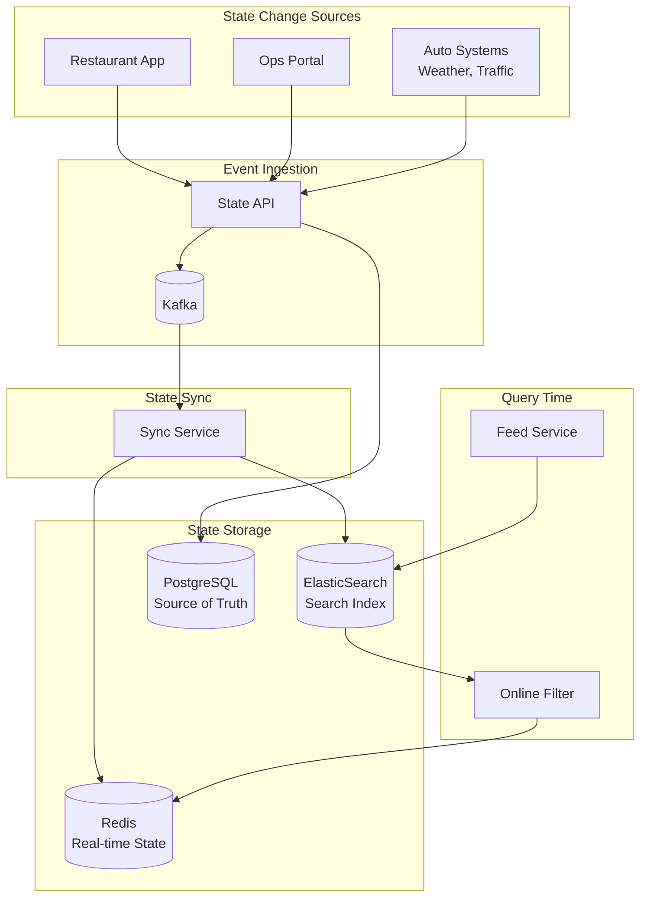
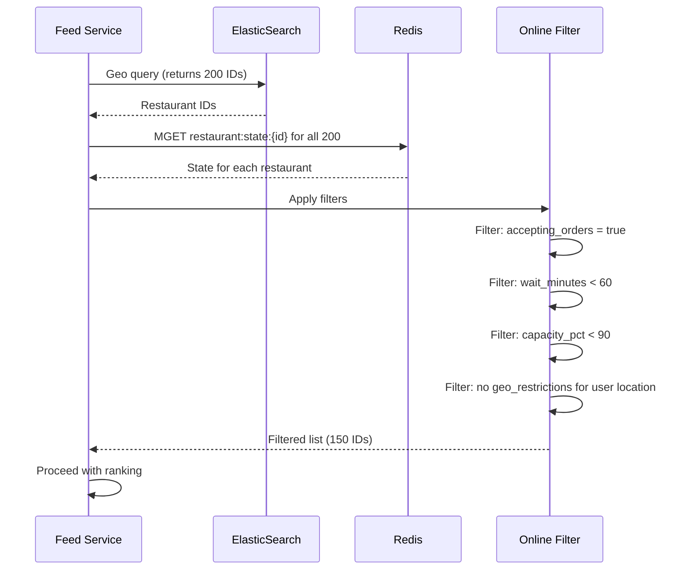

# Dynamic Filtering

This document describes how the Uber Eats Feed System handles dynamic filtering of restaurants based on real-time state changes, including restaurant breaks, geo-restrictions, and availability updates.

## Overview

Dynamic filtering ensures that eaters only see restaurants that can actually fulfill their orders. This requires handling:

- **Restaurant breaks**: Temporary closures, kitchen pauses
- **Geo-restrictions**: Areas a restaurant won't deliver to
- **Capacity limits**: Restaurants at max order capacity
- **Real-time status**: Online/offline, busy mode

The key design decision is choosing between **online filtering** (filter at query time) vs **index updates** (update the search index).

---

## Filtering Architecture



---

## Online Filtering vs Index Updates

### Comparison

| Aspect | Online Filtering | Index Updates |
|--------|-----------------|---------------|
| **Latency of Change** | Immediate (<100ms) | Eventual (1-5s) |
| **Query Overhead** | +5-10ms per query | None |
| **State Freshness** | Real-time | Near real-time |
| **Complexity** | Higher at query time | Higher at write time |
| **Best For** | Frequent changes | Rare changes |

### Our Hybrid Approach

```
┌─────────────────────────────────────────────────────────────────┐
│  Filtering Strategy by Change Type                               │
├─────────────────────────────────────────────────────────────────┤
│                                                                  │
│  ONLINE FILTERING (Real-time, Redis lookup)                     │
│  ├── Restaurant going offline/online                            │
│  ├── Busy mode toggle                                           │
│  ├── Temporary geo-restrictions                                  │
│  ├── Order capacity limits                                       │
│  └── Wait time exceeds threshold                                │
│                                                                  │
│  INDEX UPDATES (Async, ElasticSearch update)                    │
│  ├── Restaurant permanently closed                              │
│  ├── Delivery zone changes                                       │
│  ├── Operating hours changes                                     │
│  ├── Menu availability (significant)                            │
│  └── Restaurant attributes (cuisine, price)                     │
│                                                                  │
│  BOTH (Immediate Redis + Async ES)                              │
│  ├── Restaurant status changes                                   │
│  └── Major availability changes                                  │
│                                                                  │
└─────────────────────────────────────────────────────────────────┘
```

---

## Online Filtering Implementation

### State Cache Structure

```python
# Redis Hash: restaurant:state:{restaurant_id}
{
    "is_open": "1",                           # 0 or 1
    "accepting_orders": "1",                   # 0 or 1
    "busy_mode": "0",                         # 0 or 1
    "wait_minutes": "15",                     # integer
    "capacity_pct": "60",                     # 0-100
    "geo_restrictions": "[...]",              # JSON array
    "updated_at": "2026-01-08T14:30:00Z"
}

# Redis Set: filtered:area:{geohash}
# Contains restaurant IDs currently filtered out in this area
# TTL: Matches restriction duration
```

### Query-Time Filter Flow



### Filter Implementation

```python
class OnlineFilter:
    """Real-time filtering based on restaurant state."""

    def __init__(self, redis_client: Redis):
        self.redis = redis_client

    async def filter_restaurants(
        self,
        restaurant_ids: List[str],
        user_location: Tuple[float, float],
        filters: FilterConfig
    ) -> List[str]:
        """Filter restaurants based on real-time state."""

        # Batch fetch all states
        keys = [f"restaurant:state:{rid}" for rid in restaurant_ids]
        states = await self.redis.mget_hash(keys)

        filtered = []
        for rid, state in zip(restaurant_ids, states):
            if state is None:
                # No state = default to available
                filtered.append(rid)
                continue

            # Apply filters
            if not self._passes_filters(state, user_location, filters):
                continue

            filtered.append(rid)

        return filtered

    def _passes_filters(
        self,
        state: dict,
        user_location: Tuple[float, float],
        filters: FilterConfig
    ) -> bool:
        """Check if restaurant passes all filters."""

        # Must be open and accepting orders
        if state.get('is_open') != '1':
            return False
        if state.get('accepting_orders') != '1':
            return False

        # Wait time check
        wait_minutes = int(state.get('wait_minutes', 0))
        if wait_minutes > filters.max_wait_minutes:
            return False

        # Capacity check
        capacity_pct = int(state.get('capacity_pct', 0))
        if capacity_pct >= filters.max_capacity_pct:
            return False

        # Geo-restriction check
        geo_restrictions = json.loads(state.get('geo_restrictions', '[]'))
        if self._is_location_restricted(user_location, geo_restrictions):
            return False

        return True

    def _is_location_restricted(
        self,
        location: Tuple[float, float],
        restrictions: List[dict]
    ) -> bool:
        """Check if user location falls within any geo-restriction."""

        for restriction in restrictions:
            if restriction['type'] == 'exclude_polygon':
                polygon = restriction['polygon']
                if point_in_polygon(location, polygon):
                    return True
            elif restriction['type'] == 'exclude_radius':
                center = restriction['center']
                radius = restriction['radius_km']
                if haversine_distance(location, center) <= radius:
                    return True

        return False


@dataclass
class FilterConfig:
    max_wait_minutes: int = 60
    max_capacity_pct: int = 95
    include_busy_mode: bool = True
```

---

## Geo-Restrictions

### Use Case: Manhattan Bridge Problem

Restaurants in DUMBO (Brooklyn) shouldn't deliver across the Manhattan Bridge during rush hour due to unpredictable delivery times.

```
┌─────────────────────────────────────────────────────────────────┐
│                                                                  │
│     MANHATTAN                                                    │
│        │                                                         │
│        │  ← Manhattan Bridge →                                   │
│        │                                                         │
│     ───┼───────────────────────                                 │
│        │                                                         │
│        │     ┌─────────────────┐                                │
│        │     │ EXCLUSION ZONE  │ ← Users here won't see        │
│        │     │ (Rush Hours)    │   DUMBO restaurants            │
│        │     └─────────────────┘                                │
│        │                                                         │
│     DUMBO (Brooklyn)                                            │
│     • Restaurant A ←──── These restaurants won't show           │
│     • Restaurant B       for users in exclusion zone            │
│                                                                  │
└─────────────────────────────────────────────────────────────────┘
```

### Geo-Restriction Schema

```python
@dataclass
class GeoRestriction:
    id: str
    restaurant_id: str
    restriction_type: str  # 'exclude_polygon', 'exclude_radius'
    name: str
    reason: str

    # Geometry
    polygon: Optional[List[Tuple[float, float]]] = None
    center: Optional[Tuple[float, float]] = None
    radius_km: Optional[float] = None

    # Timing
    schedule: Optional[RestrictionSchedule] = None  # Recurring
    start_time: Optional[datetime] = None  # One-time
    end_time: Optional[datetime] = None

    # Metadata
    created_by: str
    created_at: datetime
    is_active: bool = True


@dataclass
class RestrictionSchedule:
    days: List[int]  # 0=Sunday, 6=Saturday
    start_hour: int
    end_hour: int
    timezone: str


# Example: Manhattan Bridge restriction
bridge_restriction = GeoRestriction(
    id="rest_dumbo_001_bridge",
    restaurant_id="rest_dumbo_001",
    restriction_type="exclude_polygon",
    name="Manhattan Bridge Area",
    reason="Rush hour delivery times unpredictable",
    polygon=[
        (-73.9857, 40.7074),
        (-73.9901, 40.7089),
        (-73.9912, 40.7056),
        (-73.9857, 40.7074)
    ],
    schedule=RestrictionSchedule(
        days=[0, 1, 2, 3, 4],  # Mon-Fri
        start_hour=7,
        end_hour=10,          # 7-10 AM
        timezone="America/New_York"
    ),
    created_by="ops_admin",
    created_at=datetime(2026, 1, 1),
    is_active=True
)
```

### Applying Geo-Restrictions at Query Time

```python
async def apply_geo_restrictions(
    restaurants: List[Restaurant],
    user_location: Tuple[float, float],
    current_time: datetime
) -> List[Restaurant]:
    """Filter out restaurants with active geo-restrictions."""

    filtered = []

    for restaurant in restaurants:
        restrictions = await get_active_restrictions(
            restaurant.id, current_time
        )

        is_restricted = False
        for restriction in restrictions:
            if is_location_in_restriction(user_location, restriction):
                is_restricted = True
                break

        if not is_restricted:
            filtered.append(restaurant)

    return filtered


async def get_active_restrictions(
    restaurant_id: str,
    current_time: datetime
) -> List[GeoRestriction]:
    """Get currently active geo-restrictions for a restaurant."""

    # Check Redis cache first
    cache_key = f"geo_restrictions:{restaurant_id}"
    cached = await redis.get(cache_key)

    if cached:
        restrictions = json.loads(cached)
    else:
        # Fetch from database
        restrictions = await db.fetch_geo_restrictions(restaurant_id)
        await redis.set(cache_key, json.dumps(restrictions), ex=300)

    # Filter to currently active
    active = []
    for r in restrictions:
        if not r['is_active']:
            continue

        if r.get('schedule'):
            if is_schedule_active(r['schedule'], current_time):
                active.append(r)
        elif r.get('start_time') and r.get('end_time'):
            if r['start_time'] <= current_time <= r['end_time']:
                active.append(r)
        else:
            # Permanent restriction
            active.append(r)

    return active
```

---

## Index Update Strategy

### When to Update the Index

```python
class IndexUpdateDecider:
    """Decide whether a state change requires index update."""

    # Changes that require index update
    INDEX_UPDATE_TRIGGERS = {
        'is_active',           # Restaurant active/inactive
        'delivery_radius_km',  # Delivery zone change
        'delivery_polygon',    # Delivery zone change
        'cuisine_types',       # Restaurant attributes
        'price_range',         # Restaurant attributes
        'operating_hours',     # Schedule change
    }

    # Changes that only need Redis update
    REDIS_ONLY_TRIGGERS = {
        'is_open',             # Computed from operating_hours
        'accepting_orders',    # Temporary state
        'busy_mode',           # Temporary state
        'wait_minutes',        # Frequently changing
        'capacity_pct',        # Frequently changing
        'geo_restrictions',    # Temporary restrictions
    }

    def should_update_index(self, field: str) -> bool:
        return field in self.INDEX_UPDATE_TRIGGERS
```

### Index Update Pipeline

```mermaid
sequenceDiagram
    participant API as State API
    participant PG as PostgreSQL
    participant K as Kafka
    participant Sync as Sync Service
    participant ES as ElasticSearch
    participant R as Redis

    API->>PG: Update state
    API->>K: Publish state_changed event
    API-->>: Return 200 OK

    K->>Sync: Consume event

    alt Index Update Required
        Sync->>ES: Update document
        ES-->>Sync: ACK
        Sync->>R: Update cache
    else Redis Only
        Sync->>R: Update cache
    end
```

### ElasticSearch Partial Update

```python
async def update_restaurant_index(
    restaurant_id: str,
    updates: dict
) -> None:
    """Update restaurant document in ElasticSearch."""

    # Build partial update
    doc_updates = {}

    if 'is_active' in updates:
        doc_updates['is_active'] = updates['is_active']

    if 'delivery_radius_km' in updates:
        doc_updates['delivery_radius_km'] = updates['delivery_radius_km']
        # Recompute geohashes for new radius
        doc_updates['delivery_geohashes'] = compute_delivery_geohashes(
            restaurant_id, updates['delivery_radius_km']
        )

    if 'cuisine_types' in updates:
        doc_updates['cuisine_types'] = updates['cuisine_types']

    # Apply update
    await es_client.update(
        index='restaurants',
        id=restaurant_id,
        body={
            'doc': doc_updates,
            'doc_as_upsert': False
        }
    )
```

---

## State Propagation Timing

### Latency Requirements

| State Change | Target Latency | Strategy |
|--------------|----------------|----------|
| Go offline | < 1 second | Redis immediate |
| Go online | < 2 seconds | Redis + ES |
| Busy mode on | < 500ms | Redis only |
| Geo-restriction add | < 2 seconds | Redis + ES |
| Delivery zone change | < 10 seconds | ES only |
| Operating hours | < 30 seconds | ES only |

### Ensuring Fast Propagation

```python
class StatePropagator:
    """Propagate state changes to all systems."""

    async def propagate_state_change(
        self,
        restaurant_id: str,
        change_type: str,
        new_state: dict
    ) -> PropagationResult:
        """Propagate state change with appropriate urgency."""

        result = PropagationResult(restaurant_id=restaurant_id)

        # Always update Redis immediately
        redis_success = await self._update_redis(restaurant_id, new_state)
        result.redis_updated = redis_success
        result.redis_latency_ms = self._measure_latency()

        # Determine if ES update needed
        if self._requires_es_update(change_type):
            if self._is_urgent(change_type):
                # Synchronous ES update
                es_success = await self._update_es_sync(restaurant_id, new_state)
                result.es_updated = es_success
                result.es_latency_ms = self._measure_latency()
            else:
                # Async ES update via Kafka
                await self._queue_es_update(restaurant_id, new_state)
                result.es_queued = True

        # Invalidate affected cache entries
        await self._invalidate_geo_cache(restaurant_id)

        return result

    def _is_urgent(self, change_type: str) -> bool:
        """Determine if change requires synchronous ES update."""
        urgent_types = {'is_active', 'accepting_orders'}
        return change_type in urgent_types
```

---

## Cache Invalidation

### Strategies

```
┌─────────────────────────────────────────────────────────────────┐
│  Cache Invalidation Patterns                                     │
├─────────────────────────────────────────────────────────────────┤
│                                                                  │
│  1. TTL-BASED (Primary)                                         │
│     • Geo-cell cache: 60 second TTL                             │
│     • Restaurant state: No TTL (event-driven invalidation)      │
│     • Feed results: 30 second TTL                               │
│                                                                  │
│  2. EVENT-DRIVEN (Targeted)                                     │
│     • Restaurant status change → Invalidate geo-cells           │
│     • Delivery zone change → Invalidate affected geo-cells      │
│                                                                  │
│  3. BROADCAST (Emergency)                                       │
│     • Mass outage recovery → Flush all geo-cells                │
│     • Index rebuild → Flush all caches                          │
│                                                                  │
└─────────────────────────────────────────────────────────────────┘
```

### Geo-Cell Cache Invalidation

```python
async def invalidate_restaurant_geo_cache(
    restaurant_id: str,
    restaurant_location: Tuple[float, float],
    delivery_radius_km: float
) -> int:
    """Invalidate all geo-cell caches affected by this restaurant."""

    # Find all geohash cells this restaurant covers
    affected_cells = get_cells_for_restaurant(
        restaurant_location[0],
        restaurant_location[1],
        delivery_radius_km
    )

    # Build cache keys for all radius buckets
    radius_buckets = ['1km', '3km', '5km', '10km', '15km']
    keys_to_delete = []

    for cell in affected_cells:
        for bucket in radius_buckets:
            keys_to_delete.append(f"geo:cell:{cell}:{bucket}")

    # Batch delete
    if keys_to_delete:
        deleted = await redis.delete(*keys_to_delete)
        return deleted

    return 0
```

---

## Handling Edge Cases

### 1. State Flapping

Restaurant rapidly toggling online/offline:

```python
class StateFlappingDetector:
    """Detect and handle state flapping."""

    async def record_state_change(
        self,
        restaurant_id: str,
        new_state: str
    ) -> FlappingStatus:
        """Record state change and detect flapping."""

        key = f"state_history:{restaurant_id}"
        now = datetime.utcnow().isoformat()

        # Add to history (keep last 10 minutes)
        await redis.zadd(key, {f"{now}:{new_state}": time.time()})
        await redis.zremrangebyscore(key, 0, time.time() - 600)

        # Count changes in last 10 minutes
        changes = await redis.zcard(key)

        if changes > 10:  # More than 10 changes in 10 min
            return FlappingStatus(
                is_flapping=True,
                action="suppress_updates",
                cooldown_seconds=300
            )

        return FlappingStatus(is_flapping=False)
```

### 2. Stale State Recovery

Redis cache becomes stale or unavailable:

```python
async def get_restaurant_state_with_fallback(
    restaurant_id: str
) -> RestaurantState:
    """Get state with fallback to database."""

    try:
        # Try Redis first
        state = await redis.hgetall(f"restaurant:state:{restaurant_id}")
        if state:
            return RestaurantState.from_redis(state)
    except RedisError:
        logger.warning(f"Redis unavailable for {restaurant_id}")

    # Fallback to database
    state = await db.get_restaurant_state(restaurant_id)

    # Async repopulate cache
    asyncio.create_task(
        repopulate_redis_cache(restaurant_id, state)
    )

    return state
```

### 3. Mass State Updates

Event causes many restaurants to change state (e.g., severe weather):

```python
async def handle_mass_state_update(
    restaurant_ids: List[str],
    new_state: dict,
    reason: str
) -> MassUpdateResult:
    """Handle mass state updates efficiently."""

    # Use pipeline for Redis updates
    pipe = redis.pipeline()
    for rid in restaurant_ids:
        key = f"restaurant:state:{rid}"
        pipe.hmset(key, new_state)
    await pipe.execute()

    # Batch ES updates
    bulk_actions = [
        {
            "_op_type": "update",
            "_index": "restaurants",
            "_id": rid,
            "doc": new_state
        }
        for rid in restaurant_ids
    ]

    await es_helpers.async_bulk(es_client, bulk_actions)

    # Clear geo-cache entirely (faster than selective invalidation)
    await redis.flushdb(async_op=True, target_db=GEO_CACHE_DB)

    return MassUpdateResult(
        updated_count=len(restaurant_ids),
        reason=reason
    )
```

---

## Monitoring and Alerting

### Key Metrics

```python
# Prometheus metrics for filtering

# Filter application latency
filter_latency = Histogram(
    'feed_filter_latency_seconds',
    'Time to apply filters',
    buckets=[0.001, 0.005, 0.01, 0.025, 0.05, 0.1]
)

# Restaurants filtered out
filtered_count = Counter(
    'feed_restaurants_filtered_total',
    'Restaurants filtered by reason',
    ['reason']  # offline, busy, capacity, geo_restricted
)

# State propagation latency
state_propagation_latency = Histogram(
    'state_propagation_latency_seconds',
    'Time for state change to propagate',
    ['destination'],  # redis, elasticsearch
    buckets=[0.1, 0.5, 1, 2, 5, 10]
)

# Cache hit rate
cache_hits = Counter('feed_cache_hits_total', 'Cache hits', ['cache_type'])
cache_misses = Counter('feed_cache_misses_total', 'Cache misses', ['cache_type'])
```

### Alerts

| Alert | Condition | Severity |
|-------|-----------|----------|
| High Filter Latency | P99 > 50ms | Warning |
| State Propagation Delay | P99 > 5s | Critical |
| High Filter Rate | > 50% filtered | Warning |
| Cache Hit Rate Drop | < 70% | Warning |
| Geo-Restriction Errors | > 100/min | Critical |

