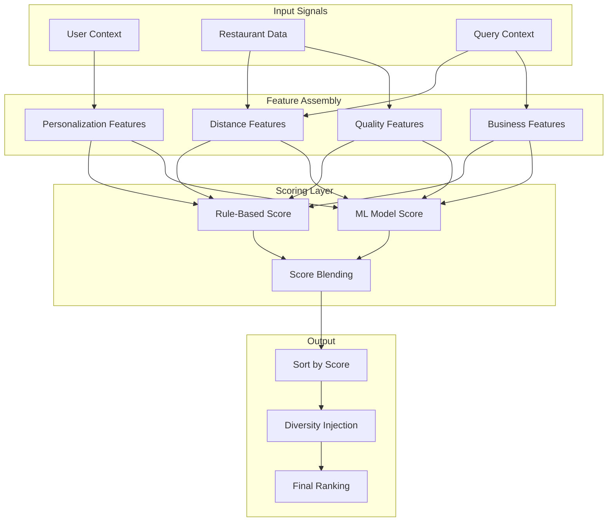
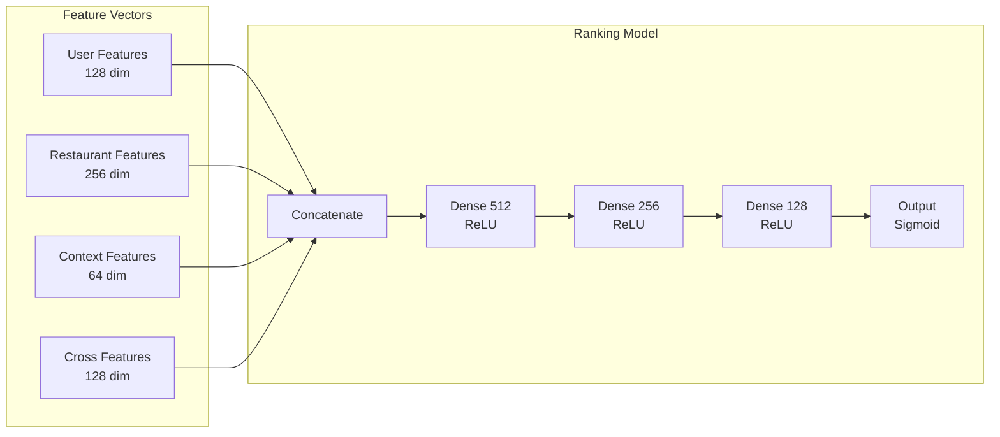

# Ranking System

This document describes the restaurant ranking and scoring algorithm used to order the feed results for maximum relevance to eaters.

## Overview

The ranking system determines the order in which restaurants appear in the feed. A well-designed ranking system balances multiple factors:

- **Relevance**: Show restaurants the eater is likely to order from
- **Fairness**: Give all restaurants reasonable visibility
- **Business Goals**: Promote strategic partnerships, new restaurants
- **User Experience**: Fast delivery, high quality

---

## Ranking Architecture



---

## Scoring Formula

### Rule-Based Scoring (V1)

For initial launch or fallback when ML is unavailable:

```
final_score = w_dist × distance_score
            + w_qual × quality_score
            + w_eta × eta_score
            + w_pers × personalization_score
            + w_biz × business_score
```

**Default Weights:**

| Component | Weight | Description |
|-----------|--------|-------------|
| Distance | 0.25 | Proximity to user |
| Quality | 0.25 | Rating and reviews |
| ETA | 0.20 | Estimated delivery time |
| Personalization | 0.20 | User preference match |
| Business | 0.10 | Promotions, partnerships |

### Score Components

#### 1. Distance Score

Closer restaurants score higher, with diminishing returns.

```python
def distance_score(distance_km: float, max_distance_km: float = 5.0) -> float:
    """
    Score based on distance. Closer = higher score.
    Uses exponential decay for smooth falloff.
    """
    if distance_km <= 0:
        return 1.0

    # Exponential decay: score = e^(-λ × distance)
    # λ chosen so score ≈ 0.5 at max_distance/2
    lambda_param = 0.693 / (max_distance_km / 2)
    score = math.exp(-lambda_param * distance_km)

    return max(0.0, min(1.0, score))

# Examples:
# 0 km  → 1.00
# 1 km  → 0.87
# 2.5 km → 0.50
# 5 km  → 0.25
```

```
Distance Score Curve:
Score
1.0 │ ●
    │  ╲
0.8 │   ╲
    │    ╲
0.6 │     ╲
    │      ╲
0.4 │       ╲
    │        ╲__
0.2 │           ╲___
    │               ╲____
0.0 └─────────────────────────
    0   1   2   3   4   5  Distance (km)
```

#### 2. Quality Score

Combines rating and review count with bayesian averaging.

```python
def quality_score(
    rating: float,
    review_count: int,
    global_avg_rating: float = 4.0,
    min_reviews: int = 50
) -> float:
    """
    Bayesian average to handle restaurants with few reviews.
    Prevents new restaurants with 1 perfect review from dominating.
    """
    # Bayesian average: (R × v + C × m) / (v + m)
    # R = restaurant rating
    # v = review count
    # C = global average rating
    # m = minimum reviews for full weight

    bayesian_rating = (rating * review_count + global_avg_rating * min_reviews) / (review_count + min_reviews)

    # Normalize to 0-1 scale (assuming 1-5 rating)
    score = (bayesian_rating - 1) / 4

    # Boost for high review volume (social proof)
    volume_boost = min(0.1, math.log10(review_count + 1) / 40)

    return min(1.0, score + volume_boost)

# Examples:
# 4.5 stars, 1000 reviews → 0.90
# 4.5 stars, 10 reviews   → 0.76 (pulled toward mean)
# 5.0 stars, 1 review     → 0.72 (heavily pulled toward mean)
# 3.5 stars, 5000 reviews → 0.67
```

#### 3. ETA Score

Faster delivery times score higher.

```python
def eta_score(
    eta_minutes: int,
    target_eta: int = 30,
    max_acceptable_eta: int = 60
) -> float:
    """
    Score based on estimated delivery time.
    Target ETA (30 min) gets score 1.0.
    """
    if eta_minutes <= target_eta:
        # Linear boost for faster than target
        return 1.0 + 0.1 * (target_eta - eta_minutes) / target_eta
    else:
        # Exponential decay for slower
        excess = eta_minutes - target_eta
        max_excess = max_acceptable_eta - target_eta
        score = 1.0 - (excess / max_excess) ** 1.5
        return max(0.0, score)

# Examples:
# 20 min → 1.03
# 30 min → 1.00
# 45 min → 0.66
# 60 min → 0.00
```

#### 4. Personalization Score

Based on user's historical preferences and behavior.

```python
def personalization_score(
    user_preferences: UserPreferences,
    restaurant: Restaurant
) -> float:
    """
    Score based on match with user preferences.
    """
    scores = []

    # Cuisine affinity (from order history)
    cuisine_match = compute_cuisine_affinity(
        user_preferences.cuisine_history,
        restaurant.cuisine_types
    )
    scores.append(cuisine_match * 0.4)

    # Price range match
    price_match = 1.0 - abs(
        user_preferences.avg_price_range - restaurant.price_range
    ) / 3
    scores.append(price_match * 0.2)

    # Previous orders from this restaurant
    if restaurant.id in user_preferences.ordered_from:
        order_recency = user_preferences.ordered_from[restaurant.id]
        recency_score = 0.8 if order_recency < 30 else 0.5  # days
        scores.append(recency_score * 0.2)
    else:
        scores.append(0.0)

    # Dietary preference match
    dietary_match = compute_dietary_match(
        user_preferences.dietary,
        restaurant.dietary_options
    )
    scores.append(dietary_match * 0.2)

    return sum(scores)


def compute_cuisine_affinity(
    user_cuisine_history: Dict[str, int],
    restaurant_cuisines: List[str]
) -> float:
    """
    Compute how well restaurant cuisines match user history.
    """
    if not user_cuisine_history:
        return 0.5  # Neutral for new users

    total_orders = sum(user_cuisine_history.values())
    affinity = 0.0

    for cuisine in restaurant_cuisines:
        if cuisine in user_cuisine_history:
            affinity += user_cuisine_history[cuisine] / total_orders

    return min(1.0, affinity)
```

#### 5. Business Score

Incorporates business considerations.

```python
def business_score(
    restaurant: Restaurant,
    promotions: List[Promotion],
    is_partner: bool,
    is_new: bool
) -> float:
    """
    Score based on business factors.
    """
    score = 0.0

    # Active promotions
    if promotions:
        best_promo = max(promotions, key=lambda p: p.value)
        if best_promo.type == 'PERCENT_OFF':
            score += min(0.3, best_promo.value / 100)
        elif best_promo.type == 'FREE_DELIVERY':
            score += 0.2
        elif best_promo.type == 'BOGO':
            score += 0.25

    # Partner restaurants (higher commission, priority placement)
    if is_partner:
        score += 0.2

    # New restaurant boost (first 30 days)
    if is_new:
        score += 0.15

    # Uber One member restaurant
    if restaurant.uber_one_enabled:
        score += 0.1

    return min(1.0, score)
```

---

## ML-Based Ranking (V2)

### Model Architecture



### Feature Engineering

```python
class RankingFeatures:
    """Feature extraction for ML ranking model."""

    # User Features (128 dim)
    user_features = [
        'user_embedding',           # 64 dim - learned from order history
        'avg_order_value',          # 1 dim
        'order_frequency',          # 1 dim
        'avg_rating_given',         # 1 dim
        'cuisine_preference_vec',   # 20 dim - one-hot for top cuisines
        'price_preference',         # 4 dim - one-hot
        'time_of_day_preference',   # 24 dim - histogram
        'day_of_week_preference',   # 7 dim - histogram
        # ... other user features
    ]

    # Restaurant Features (256 dim)
    restaurant_features = [
        'restaurant_embedding',     # 128 dim - learned from interactions
        'cuisine_vec',              # 20 dim
        'price_range_one_hot',      # 4 dim
        'avg_rating',               # 1 dim
        'rating_count_log',         # 1 dim
        'avg_prep_time',            # 1 dim
        'delivery_success_rate',    # 1 dim
        'menu_item_count',          # 1 dim
        'has_photos',               # 1 dim
        'is_chain',                 # 1 dim
        'years_on_platform',        # 1 dim
        # ... other restaurant features
    ]

    # Context Features (64 dim)
    context_features = [
        'distance_km',              # 1 dim
        'estimated_eta',            # 1 dim
        'time_of_day_one_hot',      # 24 dim
        'day_of_week_one_hot',      # 7 dim
        'is_weekend',               # 1 dim
        'is_lunch_rush',            # 1 dim
        'is_dinner_rush',           # 1 dim
        'weather_condition',        # 5 dim
        'delivery_surge_factor',    # 1 dim
        # ... other context features
    ]

    # Cross Features (128 dim)
    cross_features = [
        'user_restaurant_interact', # 64 dim - dot product of embeddings
        'cuisine_match_score',      # 1 dim
        'price_match_score',        # 1 dim
        'previous_orders_count',    # 1 dim
        'days_since_last_order',    # 1 dim
        # ... other cross features
    ]
```

### Training Pipeline

```
┌─────────────────────────────────────────────────────────────────┐
│  Training Data Collection                                        │
├─────────────────────────────────────────────────────────────────┤
│                                                                  │
│  Positive Examples:                                             │
│  • User clicked on restaurant                                    │
│  • User ordered from restaurant                                  │
│  • User favorited restaurant                                     │
│                                                                  │
│  Negative Examples:                                             │
│  • Restaurant shown but not clicked (implicit)                  │
│  • Random restaurants not shown (random negatives)              │
│                                                                  │
│  Labels:                                                        │
│  • Click-through (binary)                                       │
│  • Conversion (ordered or not)                                  │
│  • Engagement score (0-1 based on interaction depth)            │
│                                                                  │
└─────────────────────────────────────────────────────────────────┘
                              │
                              ▼
┌─────────────────────────────────────────────────────────────────┐
│  Model Training                                                  │
├─────────────────────────────────────────────────────────────────┤
│                                                                  │
│  Loss Function: Binary Cross-Entropy + Regularization           │
│                                                                  │
│  L = -Σ [y·log(ŷ) + (1-y)·log(1-ŷ)] + λ·||θ||²                 │
│                                                                  │
│  Optimization: Adam with learning rate warmup                   │
│  Batch Size: 4096                                               │
│  Training: Distributed on GPU cluster                           │
│                                                                  │
└─────────────────────────────────────────────────────────────────┘
                              │
                              ▼
┌─────────────────────────────────────────────────────────────────┐
│  Model Evaluation                                                │
├─────────────────────────────────────────────────────────────────┤
│                                                                  │
│  Offline Metrics:                                               │
│  • AUC-ROC: 0.78                                                │
│  • NDCG@10: 0.65                                                │
│  • MRR: 0.45                                                    │
│                                                                  │
│  Online Metrics (A/B Test):                                     │
│  • Click-through rate: +5.2%                                    │
│  • Conversion rate: +3.1%                                       │
│  • Average order value: +1.8%                                   │
│                                                                  │
└─────────────────────────────────────────────────────────────────┘
```

### Inference Service

```python
class RankingService:
    """Real-time ranking service."""

    def __init__(self):
        self.model = self.load_model()
        self.feature_store = FeatureStore()

    async def rank_restaurants(
        self,
        user_id: str,
        restaurant_ids: List[str],
        context: QueryContext
    ) -> List[RankedRestaurant]:
        """Rank restaurants for a user."""

        # 1. Fetch features in parallel
        user_features, restaurant_features = await asyncio.gather(
            self.feature_store.get_user_features(user_id),
            self.feature_store.get_restaurant_features(restaurant_ids)
        )

        # 2. Build feature matrix
        features = self.build_feature_matrix(
            user_features,
            restaurant_features,
            context
        )

        # 3. ML inference (batched)
        ml_scores = await self.model.predict(features)

        # 4. Blend with rule-based scores
        rule_scores = self.compute_rule_scores(
            restaurant_features, context
        )

        final_scores = self.blend_scores(ml_scores, rule_scores)

        # 5. Sort and return
        ranked = sorted(
            zip(restaurant_ids, final_scores),
            key=lambda x: x[1],
            reverse=True
        )

        return [
            RankedRestaurant(id=rid, score=score)
            for rid, score in ranked
        ]

    def blend_scores(
        self,
        ml_scores: np.ndarray,
        rule_scores: np.ndarray,
        ml_weight: float = 0.7
    ) -> np.ndarray:
        """Blend ML and rule-based scores."""
        return ml_weight * ml_scores + (1 - ml_weight) * rule_scores
```

---

## Diversity and Fairness

### Diversity Injection

Prevent feed from being dominated by similar restaurants.

```python
def inject_diversity(
    ranked_restaurants: List[RankedRestaurant],
    diversity_config: DiversityConfig
) -> List[RankedRestaurant]:
    """Inject diversity into ranked results."""

    final_list = []
    cuisine_counts = defaultdict(int)
    chain_counts = defaultdict(int)

    for restaurant in ranked_restaurants:
        # Check cuisine diversity
        primary_cuisine = restaurant.cuisine_types[0]
        if cuisine_counts[primary_cuisine] >= diversity_config.max_per_cuisine:
            continue

        # Check chain diversity
        if restaurant.is_chain:
            chain_id = restaurant.chain_id
            if chain_counts[chain_id] >= diversity_config.max_per_chain:
                continue
            chain_counts[chain_id] += 1

        cuisine_counts[primary_cuisine] += 1
        final_list.append(restaurant)

        if len(final_list) >= diversity_config.target_count:
            break

    return final_list


@dataclass
class DiversityConfig:
    max_per_cuisine: int = 5      # Max 5 Italian restaurants in top 20
    max_per_chain: int = 2        # Max 2 locations of same chain
    target_count: int = 20        # Target result count
    new_restaurant_slots: int = 2 # Reserve slots for new restaurants
```

### Fairness Considerations

```
┌─────────────────────────────────────────────────────────────────┐
│  Fairness Mechanisms                                             │
├─────────────────────────────────────────────────────────────────┤
│                                                                  │
│  1. NEW RESTAURANT BOOST                                        │
│     • First 30 days: +15% score boost                           │
│     • Guaranteed minimum impressions                             │
│     • Helps overcome cold-start problem                          │
│                                                                  │
│  2. SMALL BUSINESS VISIBILITY                                   │
│     • Independent restaurants get slight boost over chains      │
│     • Prevent chain domination in results                       │
│                                                                  │
│  3. ANTI-MONOPOLY RULES                                         │
│     • No single restaurant > 20% of impressions in area         │
│     • Rotate top positions periodically                         │
│                                                                  │
│  4. GEOGRAPHIC FAIRNESS                                         │
│     • Don't always favor same neighborhoods                     │
│     • Consider restaurants in adjacent areas                    │
│                                                                  │
└─────────────────────────────────────────────────────────────────┘
```

---

## Real-Time Signals

### Dynamic Score Adjustments

```python
def apply_realtime_adjustments(
    base_score: float,
    restaurant: Restaurant,
    realtime_state: RestaurantState
) -> float:
    """Apply real-time adjustments to base score."""

    adjusted = base_score

    # Busy mode penalty
    if realtime_state.busy_mode:
        adjusted *= 0.8  # 20% penalty

    # High wait time penalty
    if realtime_state.estimated_wait_minutes > 45:
        wait_penalty = (realtime_state.estimated_wait_minutes - 45) / 60
        adjusted *= (1 - min(0.3, wait_penalty))

    # Low stock warning
    if realtime_state.menu_items_available < 10:
        adjusted *= 0.9

    # Recent negative reviews
    if realtime_state.recent_negative_reviews > 3:
        adjusted *= 0.95

    # Surge pricing active
    if realtime_state.surge_multiplier > 1.5:
        adjusted *= 0.85

    return adjusted
```

### Time-Based Factors

```python
def get_time_factors(current_time: datetime) -> TimeFactors:
    """Get time-based ranking factors."""

    hour = current_time.hour
    day = current_time.weekday()

    return TimeFactors(
        is_breakfast=(6 <= hour < 11),
        is_lunch=(11 <= hour < 14),
        is_dinner=(17 <= hour < 21),
        is_late_night=(21 <= hour or hour < 6),
        is_weekend=(day >= 5),
        meal_boost={
            'breakfast': 1.2 if 6 <= hour < 11 else 0.8,
            'lunch': 1.2 if 11 <= hour < 14 else 0.8,
            'dinner': 1.2 if 17 <= hour < 21 else 0.8,
        }
    )
```

---

## A/B Testing Framework

### Experiment Configuration

```python
@dataclass
class RankingExperiment:
    id: str
    name: str
    traffic_percentage: float
    treatment: RankingConfig
    control: RankingConfig
    metrics: List[str]
    start_date: datetime
    end_date: datetime


# Example experiment: Testing new ML model
ml_v2_experiment = RankingExperiment(
    id="ranking_ml_v2_2026q1",
    name="ML Ranking Model V2",
    traffic_percentage=10.0,
    treatment=RankingConfig(
        ml_model_version="v2.0",
        ml_weight=0.8,
        rule_weight=0.2
    ),
    control=RankingConfig(
        ml_model_version="v1.5",
        ml_weight=0.7,
        rule_weight=0.3
    ),
    metrics=[
        "click_through_rate",
        "conversion_rate",
        "average_order_value",
        "restaurant_diversity",
        "new_restaurant_exposure"
    ],
    start_date=datetime(2026, 1, 15),
    end_date=datetime(2026, 2, 15)
)
```

### Metrics Tracking

| Metric | Definition | Target |
|--------|------------|--------|
| CTR | Clicks / Impressions | > 15% |
| Conversion | Orders / Clicks | > 25% |
| AOV | Average order value | > $30 |
| Time to Order | Session start to order | < 3 min |
| Restaurant Diversity | Unique cuisines in top 20 | > 8 |
| New Restaurant Exposure | New restaurant impressions | > 5% |

---

## Performance Optimization

### Caching Strategy

```python
class RankingCache:
    """Multi-level caching for ranking."""

    # L1: Pre-computed scores for popular user-restaurant pairs
    # TTL: 5 minutes
    async def get_precomputed_scores(
        self, user_id: str, restaurant_ids: List[str]
    ) -> Dict[str, float]:
        pass

    # L2: User feature cache
    # TTL: 30 minutes
    async def get_user_features(self, user_id: str) -> UserFeatures:
        pass

    # L3: Restaurant feature cache
    # TTL: 5 minutes
    async def get_restaurant_features(
        self, restaurant_ids: List[str]
    ) -> Dict[str, RestaurantFeatures]:
        pass
```

### Latency Budget

| Operation | Budget | Actual |
|-----------|--------|--------|
| Feature fetch | 10ms | 8ms |
| ML inference | 15ms | 12ms |
| Score blending | 2ms | 1ms |
| Diversity injection | 3ms | 2ms |
| **Total** | **30ms** | **23ms** |

