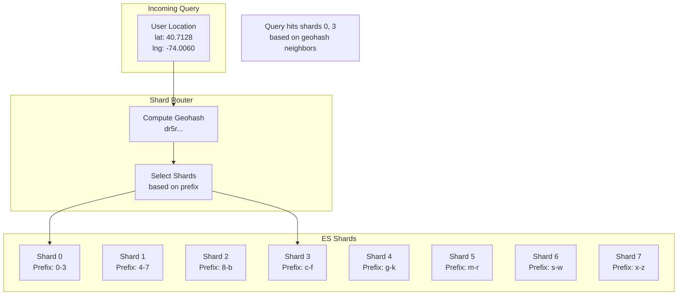
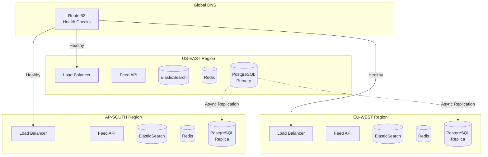

# Scaling & Sharding

This document describes the scaling strategies and sharding approaches for the Uber Eats Feed System, including handling hotspots like Manhattan and capacity planning for 10M+ restaurants.

## Overview

The system must handle:
- **10M restaurants** globally
- **10K-50K QPS** during peak hours
- **Hyper-dense areas** like Manhattan (500+ restaurants/km²)
- **Global distribution** across 200+ cities

---

## Sharding Strategy

### Hybrid Sharding Approach

We use different sharding strategies for different data types:

```
┌─────────────────────────────────────────────────────────────────┐
│  Sharding Strategy by Data Type                                  │
├─────────────────────────────────────────────────────────────────┤
│                                                                  │
│  GEO INDEX (ElasticSearch)                                      │
│  ├── Sharding Key: Geohash prefix (2-3 characters)              │
│  ├── Strategy: Location-based routing                           │
│  └── Shards: 10 (geographic distribution)                       │
│                                                                  │
│  RESTAURANT DETAILS (PostgreSQL)                                │
│  ├── Sharding Key: Restaurant ID                                │
│  ├── Strategy: Consistent hashing                               │
│  └── Shards: 16 (evenly distributed)                            │
│                                                                  │
│  RESTAURANT STATE (Redis)                                       │
│  ├── Sharding Key: Restaurant ID                                │
│  ├── Strategy: Hash slot (Redis Cluster)                        │
│  └── Nodes: 6 (2 per region)                                    │
│                                                                  │
│  GEO CACHE (Redis)                                              │
│  ├── Sharding Key: Geohash cell                                 │
│  ├── Strategy: Hash slot (Redis Cluster)                        │
│  └── Nodes: 6 (2 per region)                                    │
│                                                                  │
└─────────────────────────────────────────────────────────────────┘
```

---

## ElasticSearch Geo Index Sharding

### Location-Based Sharding



### Shard Assignment

```python
# Geohash prefix to shard mapping
GEOHASH_TO_SHARD = {
    '0': 0, '1': 0, '2': 0, '3': 0,
    '4': 1, '5': 1, '6': 1, '7': 1,
    '8': 2, '9': 2, 'b': 2, 'c': 2,
    'd': 3, 'e': 3, 'f': 3, 'g': 3,
    'h': 4, 'j': 4, 'k': 4, 'm': 4,
    'n': 5, 'p': 5, 'q': 5, 'r': 5,
    's': 6, 't': 6, 'u': 6, 'v': 6,
    'w': 7, 'x': 7, 'y': 7, 'z': 7,
}

def get_shards_for_query(
    lat: float,
    lng: float,
    radius_km: float
) -> List[int]:
    """Determine which shards to query based on location."""

    # Compute center geohash
    center_hash = encode_geohash(lat, lng, precision=1)

    # Get neighbors (for radius queries)
    neighbors = get_neighbors(center_hash)
    all_hashes = [center_hash] + list(neighbors.values())

    # Map to shards
    shards = set()
    for h in all_hashes:
        if h[0] in GEOHASH_TO_SHARD:
            shards.add(GEOHASH_TO_SHARD[h[0]])

    return list(shards)
```

### ES Index Configuration

```json
{
  "settings": {
    "number_of_shards": 10,
    "number_of_replicas": 2,
    "routing": {
      "allocation": {
        "total_shards_per_node": 2
      }
    },
    "index": {
      "routing_partition_size": 1
    }
  },
  "mappings": {
    "_routing": {
      "required": true
    },
    "properties": {
      "geohash_prefix": {
        "type": "keyword"
      }
    }
  }
}
```

### Custom Routing

```python
async def index_restaurant(restaurant: Restaurant) -> None:
    """Index restaurant with location-based routing."""

    geohash = encode_geohash(
        restaurant.location.lat,
        restaurant.location.lng,
        precision=2
    )

    await es_client.index(
        index='restaurants',
        id=restaurant.id,
        body=restaurant.to_es_doc(),
        routing=geohash[:2]  # Route by 2-char geohash prefix
    )


async def search_restaurants(
    lat: float,
    lng: float,
    radius_km: float
) -> List[str]:
    """Search with routing optimization."""

    # Compute routing values for relevant shards
    geohash = encode_geohash(lat, lng, precision=2)
    neighbors = get_neighbor_prefixes(geohash)
    routing_values = [geohash] + neighbors

    response = await es_client.search(
        index='restaurants',
        routing=','.join(routing_values),
        body={
            "query": {
                "geo_distance": {
                    "distance": f"{radius_km}km",
                    "location": {"lat": lat, "lon": lng}
                }
            }
        }
    )

    return [hit['_id'] for hit in response['hits']['hits']]
```

---

## PostgreSQL Restaurant Sharding

### Consistent Hashing

```python
import hashlib

class ConsistentHashRing:
    """Consistent hash ring for restaurant ID sharding."""

    def __init__(self, shards: int = 16, virtual_nodes: int = 150):
        self.shards = shards
        self.virtual_nodes = virtual_nodes
        self.ring = {}
        self._build_ring()

    def _build_ring(self):
        """Build the hash ring with virtual nodes."""
        for shard in range(self.shards):
            for vn in range(self.virtual_nodes):
                key = f"shard_{shard}_vn_{vn}"
                hash_val = self._hash(key)
                self.ring[hash_val] = shard

        self.sorted_keys = sorted(self.ring.keys())

    def _hash(self, key: str) -> int:
        """Compute hash for a key."""
        return int(hashlib.md5(key.encode()).hexdigest(), 16)

    def get_shard(self, restaurant_id: str) -> int:
        """Get shard for a restaurant ID."""
        hash_val = self._hash(restaurant_id)

        # Find first node >= hash_val
        for key in self.sorted_keys:
            if key >= hash_val:
                return self.ring[key]

        # Wrap around
        return self.ring[self.sorted_keys[0]]


# Usage
hash_ring = ConsistentHashRing(shards=16)
shard = hash_ring.get_shard("rest_abc123")  # Returns 0-15
```

### PostgreSQL Shard Configuration

```yaml
# Vitess or Citus configuration
sharding:
  keyspace: restaurants
  shards: 16

  vindexes:
    - name: restaurant_hash
      type: consistent_hash

  tables:
    restaurants:
      column_vindexes:
        - column: id
          vindex: restaurant_hash

    delivery_zones:
      column_vindexes:
        - column: restaurant_id
          vindex: restaurant_hash

    operating_hours:
      column_vindexes:
        - column: restaurant_id
          vindex: restaurant_hash
```

### Cross-Shard Query Handling

```python
async def batch_get_restaurants(
    restaurant_ids: List[str]
) -> Dict[str, Restaurant]:
    """Fetch restaurants from multiple shards efficiently."""

    # Group by shard
    shard_groups = defaultdict(list)
    for rid in restaurant_ids:
        shard = hash_ring.get_shard(rid)
        shard_groups[shard].append(rid)

    # Parallel queries to each shard
    async def query_shard(shard: int, ids: List[str]):
        conn = get_shard_connection(shard)
        return await conn.fetch(
            "SELECT * FROM restaurants WHERE id = ANY($1)",
            ids
        )

    tasks = [
        query_shard(shard, ids)
        for shard, ids in shard_groups.items()
    ]

    results = await asyncio.gather(*tasks)

    # Merge results
    restaurants = {}
    for result in results:
        for row in result:
            restaurants[row['id']] = Restaurant.from_row(row)

    return restaurants
```

---

## Hotspot Handling

### The Manhattan Problem

Manhattan has extreme restaurant density:

```
┌─────────────────────────────────────────────────────────────────┐
│  Restaurant Density Comparison                                   │
├─────────────────────────────────────────────────────────────────┤
│                                                                  │
│  Location              │ Restaurants/km² │ Geohash-6 Size       │
│  ──────────────────────┼─────────────────┼─────────────────────│
│  Manhattan (Midtown)   │ 800+            │ 1.2km × 0.6km        │
│  Brooklyn (Downtown)   │ 300             │ 1.2km × 0.6km        │
│  San Francisco         │ 200             │ 1.2km × 0.6km        │
│  Suburban Chicago      │ 30              │ 1.2km × 0.6km        │
│  Rural Texas           │ 2               │ 1.2km × 0.6km        │
│                                                                  │
│  Problem: A single geohash-6 cell in Manhattan contains         │
│           600+ restaurants vs 2 in rural areas                  │
│                                                                  │
└─────────────────────────────────────────────────────────────────┘
```

### Adaptive Precision Strategy

```python
class AdaptivePrecisionSelector:
    """Select geohash precision based on area density."""

    # Pre-computed density map (updated daily)
    DENSITY_MAP: Dict[str, int] = {}  # geohash-4 -> restaurants/km²

    @classmethod
    async def load_density_map(cls):
        """Load pre-computed density map."""
        cls.DENSITY_MAP = await redis.hgetall('density_map')

    @classmethod
    def get_precision(cls, lat: float, lng: float) -> int:
        """Get appropriate precision for location."""

        geohash_4 = encode_geohash(lat, lng, precision=4)
        density = cls.DENSITY_MAP.get(geohash_4, 50)  # Default moderate

        if density > 500:
            return 7  # ~150m cells for hyper-dense
        elif density > 100:
            return 6  # ~1.2km cells for urban
        elif density > 20:
            return 5  # ~4.9km cells for suburban
        else:
            return 4  # ~39km cells for rural

    @classmethod
    def get_max_results_per_cell(cls, lat: float, lng: float) -> int:
        """Get max results to fetch per geohash cell."""

        geohash_4 = encode_geohash(lat, lng, precision=4)
        density = cls.DENSITY_MAP.get(geohash_4, 50)

        if density > 500:
            return 50   # Limit per fine-grained cell
        elif density > 100:
            return 100
        else:
            return 200  # Can afford more in sparse areas
```

### Mini K-d Trees per Shard

For hyper-dense areas, we can use mini K-d trees within each shard:

```
┌─────────────────────────────────────────────────────────────────┐
│  Hybrid Approach: Geohash + Mini K-d Trees                       │
├─────────────────────────────────────────────────────────────────┤
│                                                                  │
│  Standard Areas (< 500 restaurants/geohash-6):                  │
│  └── Use geohash lookup directly                                │
│                                                                  │
│  Hyper-Dense Areas (> 500 restaurants/geohash-6):              │
│  └── Geohash identifies the cell                                │
│  └── Mini K-d tree within cell for fine-grained search          │
│  └── K-d tree fits in memory (~100KB for 500 restaurants)       │
│                                                                  │
│  ┌─────────────────┐                                            │
│  │  Geohash: dr5ru │                                            │
│  │  (Manhattan)    │                                            │
│  │                 │                                            │
│  │  ┌───────────┐  │  K-d tree subdivides                       │
│  │  │ K-d Tree  │  │  the dense cell                            │
│  │  │           │  │                                            │
│  │  │   /   \   │  │                                            │
│  │  │  ●     ●  │  │                                            │
│  │  │ /\    /\  │  │                                            │
│  │  │●  ●  ●  ● │  │                                            │
│  │  └───────────┘  │                                            │
│  └─────────────────┘                                            │
│                                                                  │
└─────────────────────────────────────────────────────────────────┘
```

```python
class HybridGeoIndex:
    """Hybrid geo index using geohash + optional K-d trees."""

    def __init__(self):
        self.kd_trees: Dict[str, KdTree] = {}
        self.dense_cells: Set[str] = set()

    async def initialize_dense_cells(self):
        """Load K-d trees for dense cells."""

        dense_geohashes = await self.identify_dense_cells()

        for geohash in dense_geohashes:
            restaurants = await self.load_cell_restaurants(geohash)
            if len(restaurants) > 500:
                self.kd_trees[geohash] = self.build_kd_tree(restaurants)
                self.dense_cells.add(geohash)

    async def search(
        self,
        lat: float,
        lng: float,
        radius_km: float
    ) -> List[str]:
        """Search using hybrid approach."""

        precision = AdaptivePrecisionSelector.get_precision(lat, lng)
        center_hash = encode_geohash(lat, lng, precision)

        if center_hash in self.dense_cells:
            # Use K-d tree for dense cell
            kd_tree = self.kd_trees[center_hash]
            results = kd_tree.range_query((lat, lng), radius_km)
        else:
            # Use standard geohash lookup
            results = await self.geohash_lookup(center_hash, radius_km)

        # Also check neighbors
        neighbors = get_neighbors(center_hash)
        for neighbor_hash in neighbors.values():
            if neighbor_hash in self.dense_cells:
                kd_tree = self.kd_trees[neighbor_hash]
                results.extend(kd_tree.range_query((lat, lng), radius_km))
            else:
                results.extend(
                    await self.geohash_lookup(neighbor_hash, radius_km)
                )

        return list(set(results))  # Deduplicate
```

---

## Fan-Out Management

### Problem: Query Explosion

```
User Query
    │
    ├── Geohash: dr5ru (center)
    ├── Geohash: dr5rk (neighbor)
    ├── Geohash: dr5rm (neighbor)
    ├── Geohash: dr5rh (neighbor)
    ├── Geohash: dr5rj (neighbor)
    ├── Geohash: dr5rn (neighbor)
    ├── Geohash: dr5rg (neighbor)
    ├── Geohash: dr5rp (neighbor)
    └── Geohash: dr5rv (neighbor)

    = 9 geohash cells
    × 2 ES shards (avg per cell)
    = 18 ES queries (worst case)
```

### Fan-Out Optimization

```python
class FanOutOptimizer:
    """Optimize fan-out for geo queries."""

    MAX_PARALLEL_QUERIES = 5
    MAX_TOTAL_RESULTS = 500

    async def optimized_search(
        self,
        lat: float,
        lng: float,
        radius_km: float
    ) -> List[str]:
        """Execute optimized geo search with controlled fan-out."""

        # 1. Start with center cell
        center_hash = encode_geohash(lat, lng, precision=6)
        center_results = await self.query_cell(center_hash, lat, lng, radius_km)

        # 2. If we have enough results, skip neighbors
        if len(center_results) >= self.MAX_TOTAL_RESULTS:
            return center_results[:self.MAX_TOTAL_RESULTS]

        # 3. Query neighbors in priority order (closest first)
        neighbors = self.get_prioritized_neighbors(center_hash, lat, lng)

        all_results = center_results
        remaining_slots = self.MAX_TOTAL_RESULTS - len(all_results)

        # Batch queries to limit concurrency
        for batch in self.batch(neighbors, self.MAX_PARALLEL_QUERIES):
            if remaining_slots <= 0:
                break

            batch_results = await asyncio.gather(*[
                self.query_cell(n, lat, lng, radius_km)
                for n in batch
            ])

            for results in batch_results:
                all_results.extend(results[:remaining_slots])
                remaining_slots = self.MAX_TOTAL_RESULTS - len(all_results)

        return all_results

    def get_prioritized_neighbors(
        self,
        center_hash: str,
        lat: float,
        lng: float
    ) -> List[str]:
        """Get neighbors sorted by distance from user."""

        neighbors = get_neighbors(center_hash)

        # Compute distance to each neighbor's center
        neighbor_distances = []
        for direction, neighbor_hash in neighbors.items():
            neighbor_center = decode_geohash(neighbor_hash)
            dist = haversine_distance((lat, lng), neighbor_center)
            neighbor_distances.append((neighbor_hash, dist))

        # Sort by distance
        neighbor_distances.sort(key=lambda x: x[1])

        return [n[0] for n in neighbor_distances]
```

---

## Capacity Planning

### Traffic Estimates

```
┌─────────────────────────────────────────────────────────────────┐
│  Traffic Model                                                   │
├─────────────────────────────────────────────────────────────────┤
│                                                                  │
│  Base Traffic:                                                  │
│  • DAU: 10 million users                                        │
│  • Sessions per user per day: 2                                 │
│  • Feed views per session: 5                                    │
│  • Total daily feed views: 100 million                          │
│                                                                  │
│  Peak Traffic (lunch/dinner):                                   │
│  • Peak hour: 12% of daily traffic                              │
│  • Peak QPS: 100M × 0.12 / 3600 = 33,333 QPS                   │
│                                                                  │
│  With 3x safety margin: 100,000 QPS target capacity             │
│                                                                  │
└─────────────────────────────────────────────────────────────────┘
```

### Infrastructure Sizing

| Component | Baseline Config | Peak Config | Scaling Strategy |
|-----------|----------------|-------------|------------------|
| **Feed API** | 20 pods (4 CPU, 8GB) | 60 pods | HPA on CPU/latency |
| **ElasticSearch** | 15 nodes (8 CPU, 64GB) | Fixed | Replicas handle read load |
| **Redis Cluster** | 6 nodes (4 CPU, 32GB) | Fixed | Pre-provisioned for peak |
| **PostgreSQL** | 16 shards, 2 replicas each | Fixed | Read replicas |

### ElasticSearch Capacity

```python
# ES sizing calculation

TOTAL_RESTAURANTS = 10_000_000
AVG_DOC_SIZE_BYTES = 2_000  # ~2KB per restaurant
REPLICATION_FACTOR = 3  # Primary + 2 replicas

# Storage
primary_storage_gb = (TOTAL_RESTAURANTS * AVG_DOC_SIZE_BYTES) / (1024**3)
# = 20 GB primary data

total_storage_gb = primary_storage_gb * REPLICATION_FACTOR
# = 60 GB total

# Memory (ES recommends 50% of data in memory for geo queries)
recommended_memory_gb = total_storage_gb * 0.5
# = 30 GB across cluster

# Nodes
MEMORY_PER_NODE_GB = 64
HEAP_SIZE_GB = 31  # Max recommended ES heap
nodes_for_memory = math.ceil(recommended_memory_gb / HEAP_SIZE_GB)
# = 2 nodes minimum

# With overhead and redundancy
RECOMMENDED_NODES = 15  # 5 per region, 3 regions
```

### Redis Capacity

```python
# Redis sizing calculation

# Geo cache
GEO_CELLS_ACTIVE = 100_000  # Active geohash cells
AVG_RESTAURANTS_PER_CELL = 100
BYTES_PER_ID = 16

geo_cache_mb = (GEO_CELLS_ACTIVE * AVG_RESTAURANTS_PER_CELL * BYTES_PER_ID) / (1024**2)
# = 152 MB

# Restaurant state cache
RESTAURANTS = 10_000_000
BYTES_PER_STATE = 200

state_cache_mb = (RESTAURANTS * BYTES_PER_STATE) / (1024**2)
# = 1,907 MB = ~2 GB

# Total with overhead
TOTAL_REDIS_GB = (geo_cache_mb + state_cache_mb) * 2 / 1024
# = ~4 GB
# With 6 nodes = ~700 MB per node (well within capacity)
```

---

## Auto-Scaling

### Horizontal Pod Autoscaler

```yaml
apiVersion: autoscaling/v2
kind: HorizontalPodAutoscaler
metadata:
  name: feed-api-hpa
spec:
  scaleTargetRef:
    apiVersion: apps/v1
    kind: Deployment
    name: feed-api
  minReplicas: 20
  maxReplicas: 100
  metrics:
    - type: Resource
      resource:
        name: cpu
        target:
          type: Utilization
          averageUtilization: 70
    - type: Pods
      pods:
        metric:
          name: http_request_latency_p99
        target:
          type: AverageValue
          averageValue: 150m  # 150ms
  behavior:
    scaleUp:
      stabilizationWindowSeconds: 60
      policies:
        - type: Percent
          value: 50
          periodSeconds: 60
    scaleDown:
      stabilizationWindowSeconds: 300
      policies:
        - type: Percent
          value: 10
          periodSeconds: 60
```

### Predictive Scaling

```python
class PredictiveScaler:
    """Scale based on predicted traffic patterns."""

    # Historical traffic pattern (hour -> multiplier)
    TRAFFIC_PATTERN = {
        0: 0.3,  1: 0.2,  2: 0.1,  3: 0.1,
        4: 0.1,  5: 0.2,  6: 0.4,  7: 0.6,
        8: 0.7,  9: 0.8,  10: 0.9, 11: 1.0,  # Lunch peak
        12: 1.0, 13: 0.9, 14: 0.7, 15: 0.6,
        16: 0.7, 17: 0.9, 18: 1.0, 19: 1.0,  # Dinner peak
        20: 0.9, 21: 0.7, 22: 0.5, 23: 0.4,
    }

    def get_target_replicas(
        self,
        current_hour: int,
        base_replicas: int = 20,
        max_replicas: int = 100
    ) -> int:
        """Get target replicas based on predicted traffic."""

        multiplier = self.TRAFFIC_PATTERN.get(current_hour, 0.5)

        # Add buffer for prediction uncertainty
        buffer = 1.2

        target = int(base_replicas + (max_replicas - base_replicas) * multiplier * buffer)

        return min(max_replicas, max(base_replicas, target))
```

---

## Disaster Recovery

### Multi-Region Failover



### Failover Procedure

```python
class FailoverManager:
    """Manage region failover for feed service."""

    REGIONS = ['us-east', 'eu-west', 'ap-south']
    PRIMARY_REGION = 'us-east'

    async def handle_region_failure(self, failed_region: str):
        """Handle failure of a region."""

        if failed_region == self.PRIMARY_REGION:
            # Promote replica to primary
            new_primary = self.select_new_primary()
            await self.promote_pg_replica(new_primary)

            # Update DNS to remove failed region
            await self.update_dns_records(exclude=[failed_region])

            # Alert operations
            await self.send_alert(
                severity='critical',
                message=f"Region {failed_region} failed. "
                        f"Promoted {new_primary} to primary."
            )
        else:
            # Secondary region failure - less critical
            await self.update_dns_records(exclude=[failed_region])

            await self.send_alert(
                severity='warning',
                message=f"Region {failed_region} failed. "
                        f"Traffic rerouted to remaining regions."
            )

    def select_new_primary(self) -> str:
        """Select new primary based on replication lag."""

        candidates = [r for r in self.REGIONS if r != self.PRIMARY_REGION]

        # Check replication lag
        lags = {}
        for region in candidates:
            lags[region] = self.get_replication_lag(region)

        # Select region with lowest lag
        return min(lags, key=lags.get)
```

### Recovery Time Objectives

| Component | RTO | RPO | Strategy |
|-----------|-----|-----|----------|
| Feed API | 30 seconds | 0 | Stateless, auto-healing |
| ElasticSearch | 5 minutes | 1 minute | Cross-region replicas |
| Redis | 30 seconds | 10 seconds | Redis Cluster failover |
| PostgreSQL | 15 minutes | 1 minute | Streaming replication |

---

## Cost Optimization

### Spot Instances for API Tier

```yaml
# EKS Node Group with Spot instances
apiVersion: eksctl.io/v1alpha5
kind: ClusterConfig
metadata:
  name: feed-cluster
  region: us-east-1

managedNodeGroups:
  - name: feed-api-spot
    instanceTypes:
      - c6i.xlarge
      - c5.xlarge
      - c5a.xlarge
    spot: true
    minSize: 10
    maxSize: 80
    desiredCapacity: 20
    labels:
      workload: feed-api
    taints:
      - key: spot
        value: "true"
        effect: PreferNoSchedule
```

### Reserved Capacity for Data Tier

```
┌─────────────────────────────────────────────────────────────────┐
│  Cost Optimization Strategy                                      │
├─────────────────────────────────────────────────────────────────┤
│                                                                  │
│  API TIER (Variable Load):                                      │
│  • 50% On-Demand (baseline)                                     │
│  • 50% Spot (scale-up capacity)                                 │
│  • Savings: ~40%                                                 │
│                                                                  │
│  DATA TIER (Stable Load):                                       │
│  • 100% Reserved Instances (3-year)                             │
│  • ElasticSearch: Reserved                                       │
│  • RDS PostgreSQL: Reserved                                      │
│  • Savings: ~60%                                                 │
│                                                                  │
│  CACHE TIER:                                                    │
│  • Redis: Reserved nodes                                         │
│  • Savings: ~50%                                                 │
│                                                                  │
│  Monthly Cost Estimate:                                         │
│  • Before optimization: $45,000                                  │
│  • After optimization: $25,000                                   │
│  • Annual savings: $240,000                                      │
│                                                                  │
└─────────────────────────────────────────────────────────────────┘
```

