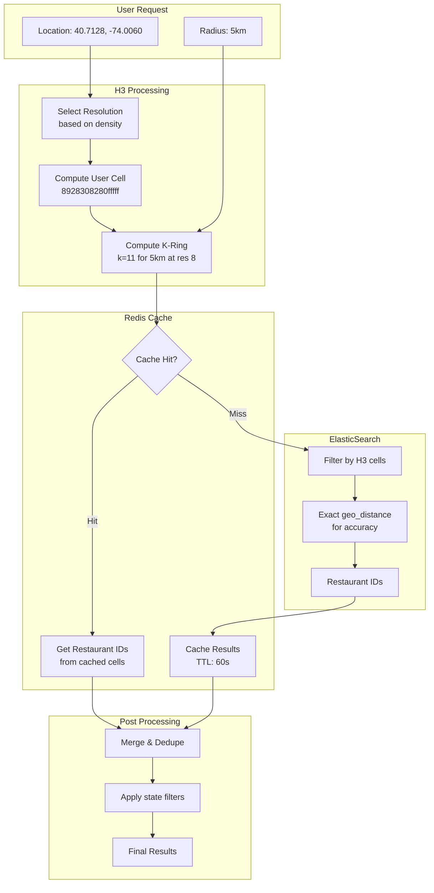

# Spatial Indexing

This document provides a deep dive into spatial indexing strategies for the Uber Eats Feed System. We cover **H3 (Uber's hexagonal hierarchical index)** as the primary approach, with **Geohashing** as an alternative, and explain how ElasticSearch implements geo queries internally.

## Overview

The core challenge: Given an eater's location, efficiently find all restaurants that can deliver to that location among 10M+ restaurants globally.

**Key Requirements:**
- Query latency: < 50ms for geo lookup
- Support radius queries (1-15km)
- Handle variable density (Manhattan vs rural Wyoming)
- Efficient updates when restaurants change

---

## H3: Primary Approach (Recommended)

### What is H3?

**H3** is a hexagonal hierarchical spatial index developed by **Uber** for geospatial use cases. It divides the world into hexagonal cells at multiple resolutions, providing a powerful alternative to traditional rectangular grid systems.

```
┌─────────────────────────────────────────────────────────────────┐
│  H3 HEXAGONAL GRID                                               │
├─────────────────────────────────────────────────────────────────┤
│                                                                  │
│           ╱╲     ╱╲     ╱╲     ╱╲     ╱╲                        │
│         ╱    ╲ ╱    ╲ ╱    ╲ ╱    ╲ ╱    ╲                      │
│        │      │      │      │      │      │                      │
│         ╲    ╱ ╲    ╱ ╲    ╱ ╲    ╱ ╲    ╱                      │
│           ╲╱     ╲╱     ╲╱     ╲╱     ╲╱                        │
│         ╱    ╲ ╱    ╲ ╱    ╲ ╱    ╲ ╱    ╲                      │
│        │      │  🍕  │   ●  │  🍔  │      │   ● = User          │
│         ╲    ╱ ╲    ╱ ╲    ╱ ╲    ╱ ╲    ╱   🍕🍔 = Restaurants │
│           ╲╱     ╲╱     ╲╱     ╲╱     ╲╱                        │
│         ╱    ╲ ╱    ╲ ╱    ╲ ╱    ╲ ╱    ╲                      │
│        │      │      │  🌮  │      │      │                      │
│         ╲    ╱ ╲    ╱ ╲    ╱ ╲    ╱ ╲    ╱                      │
│           ╲╱     ╲╱     ╲╱     ╲╱     ╲╱                        │
│                                                                  │
│  Key Insight: All 6 neighbors are equidistant from center!      │
│                                                                  │
└─────────────────────────────────────────────────────────────────┘
```

### Why H3 for Uber Eats?

1. **Built by Uber, for Uber** - Battle-tested at Uber scale for ride ETAs, surge pricing, and food delivery
2. **Hexagons approximate circles** - Delivery radii are circular; hexagons fit better than rectangles
3. **Uniform neighbor distance** - All 6 neighbors are equidistant (no corner artifacts)
4. **Hierarchical resolution** - 16 levels from ~1m to ~1,100km cells
5. **Efficient k-ring queries** - Get all cells within k steps trivially

### H3 Resolution Levels

| Resolution | Avg Edge Length | Avg Cell Area | Use Case |
|------------|-----------------|---------------|----------|
| 0 | 1,107 km | 4.25M km² | Global |
| 4 | 22.6 km | 1,770 km² | Country/State |
| 5 | 8.5 km | 252 km² | Metro Area |
| 6 | 3.2 km | 36 km² | City District |
| 7 | 1.2 km | 5.16 km² | Neighborhood |
| 8 | 461 m | 0.74 km² | Urban Block |
| 9 | 174 m | 0.1 km² | Building Cluster |
| 10 | 66 m | 0.015 km² | Building |

### H3 for Food Delivery: Resolution Selection

```python
# Resolution selection based on area density
H3_RESOLUTION_CONFIG = {
    'hyper_dense': {
        'threshold': 500,      # restaurants/km²
        'resolution': 9,       # ~174m cells
        'k_ring_for_5km': 29,  # cells to cover 5km radius
    },
    'urban': {
        'threshold': 100,
        'resolution': 8,       # ~461m cells
        'k_ring_for_5km': 11,
    },
    'suburban': {
        'threshold': 20,
        'resolution': 7,       # ~1.2km cells
        'k_ring_for_5km': 4,
    },
    'rural': {
        'threshold': 0,
        'resolution': 6,       # ~3.2km cells
        'k_ring_for_5km': 2,
    },
}
```

### H3 Index Structure

```
H3 Index: 64-bit integer encoding location + resolution

Example: 0x8928308280fffff (Resolution 9, Manhattan)

Structure:
┌────────┬────────────┬──────────────────────────────────────┐
│ Mode   │ Resolution │           Base Cell + Children       │
│ 4 bits │  4 bits    │              56 bits                 │
└────────┴────────────┴──────────────────────────────────────┘

Hierarchy:
Resolution 6:  8926a4848ffffff  (parent)
                    │
                    ├── Resolution 7:  8926a4848003fff
                    │        │
                    │        ├── Resolution 8:  8926a484800ffff
                    │        │        │
                    │        │        └── Resolution 9:  8926a4848001fff
                    ...
```

### H3 K-Ring Queries

The killer feature for delivery radius queries:

```python
import h3

def get_delivery_cells(lat: float, lng: float, radius_km: float) -> set:
    """Get all H3 cells within delivery radius."""

    # Select resolution based on area density
    resolution = get_resolution_for_location(lat, lng)

    # Get user's cell
    user_cell = h3.geo_to_h3(lat, lng, resolution)

    # Calculate k (ring distance) for radius
    # Edge length varies by resolution
    edge_km = h3.edge_length(resolution, unit='km')
    k = int(radius_km / (edge_km * 1.5)) + 1  # 1.5 factor for hex geometry

    # Get all cells within k rings
    cells = h3.k_ring(user_cell, k)

    return cells


# Example: 5km radius in Manhattan (resolution 9)
user_location = (40.7128, -74.0060)
cells = get_delivery_cells(*user_location, radius_km=5.0)
# Returns ~270 cells covering the search area
```

```
K-Ring Visualization (k=2):

                    ╱╲     ╱╲     ╱╲
                  ╱    ╲ ╱    ╲ ╱    ╲
                 │  2   │  2   │  2   │      k=2 ring (outer)
                  ╲    ╱ ╲    ╱ ╲    ╱
              ╱╲   ╲╱     ╲╱     ╲╱   ╱╲
            ╱    ╲ ╱╲     ╱╲     ╱╲ ╱    ╲
           │  2   │  1   │  1   │  1   │  2   │   k=1 ring
            ╲    ╱ ╲    ╱ ╲    ╱ ╲    ╱ ╲    ╱
              ╲╱     ╲╱     ╲╱     ╲╱     ╲╱
            ╱    ╲ ╱    ╲ ╱    ╲ ╱    ╲ ╱    ╲
           │  2   │  1   │  0   │  1   │  2   │   k=0 = center
            ╲    ╱ ╲    ╱ ╲    ╱ ╲    ╱ ╲    ╱
              ╲╱     ╲╱     ╲╱     ╲╱     ╲╱
            ╱    ╲ ╱╲     ╱╲     ╱╲ ╱    ╲
           │  2   │  1   │  1   │  1   │  2   │
            ╲    ╱ ╲    ╱ ╲    ╱ ╲    ╱ ╲    ╱
              ╲╱     ╲╱     ╲╱     ╲╱     ╲╱
                  ╱    ╲ ╱    ╲ ╱    ╲
                 │  2   │  2   │  2   │
                  ╲    ╱ ╲    ╱ ╲    ╱
                    ╲╱     ╲╱     ╲╱

k=0: 1 cell (center)
k=1: 7 cells (center + 6 neighbors)
k=2: 19 cells
k=n: 3n² + 3n + 1 cells
```

### H3 Implementation

#### Restaurant Indexing

```python
import h3
from typing import List, Dict

class H3RestaurantIndexer:
    """Index restaurants using H3 cells."""

    # Store restaurants at multiple resolutions for flexibility
    INDEXED_RESOLUTIONS = [6, 7, 8, 9]

    def index_restaurant(self, restaurant: Restaurant) -> Dict[int, str]:
        """Generate H3 cells for a restaurant at multiple resolutions."""

        lat, lng = restaurant.location.lat, restaurant.location.lng

        h3_cells = {}
        for resolution in self.INDEXED_RESOLUTIONS:
            cell = h3.geo_to_h3(lat, lng, resolution)
            h3_cells[resolution] = cell

        return h3_cells

    def get_delivery_coverage_cells(
        self,
        restaurant: Restaurant,
        resolution: int = 8
    ) -> List[str]:
        """Get all H3 cells a restaurant can deliver to."""

        lat, lng = restaurant.location.lat, restaurant.location.lng
        center_cell = h3.geo_to_h3(lat, lng, resolution)

        # Calculate k for delivery radius
        edge_km = h3.edge_length(resolution, unit='km')
        k = int(restaurant.delivery_radius_km / (edge_km * 1.5)) + 1

        # Get all cells within delivery range
        coverage_cells = h3.k_ring(center_cell, k)

        return list(coverage_cells)
```

#### Geo Search with H3

```python
class H3GeoSearch:
    """Geo search using H3 indexing."""

    def __init__(self, redis_client, es_client):
        self.redis = redis_client
        self.es = es_client

    async def find_restaurants(
        self,
        lat: float,
        lng: float,
        radius_km: float,
        filters: dict = None
    ) -> List[str]:
        """Find restaurants within radius using H3."""

        # 1. Select appropriate resolution
        resolution = self._select_resolution(lat, lng)

        # 2. Get user's H3 cell and k-ring
        user_cell = h3.geo_to_h3(lat, lng, resolution)
        k = self._calculate_k(radius_km, resolution)
        search_cells = h3.k_ring(user_cell, k)

        # 3. Check cache for each cell
        restaurant_ids = set()
        uncached_cells = []

        for cell in search_cells:
            cache_key = f"h3:cell:{cell}"
            cached = await self.redis.smembers(cache_key)

            if cached:
                restaurant_ids.update(cached)
            else:
                uncached_cells.append(cell)

        # 4. Query ES for uncached cells
        if uncached_cells:
            es_results = await self._query_elasticsearch(
                uncached_cells, resolution, filters
            )
            restaurant_ids.update(es_results)

            # Cache results
            await self._cache_results(uncached_cells, es_results)

        # 5. Filter by exact distance (H3 cells are approximate)
        filtered = await self._filter_by_exact_distance(
            list(restaurant_ids), lat, lng, radius_km
        )

        return filtered

    def _select_resolution(self, lat: float, lng: float) -> int:
        """Select H3 resolution based on area density."""

        density = self._get_area_density(lat, lng)

        if density > 500:
            return 9   # Hyper-dense (Manhattan)
        elif density > 100:
            return 8   # Urban
        elif density > 20:
            return 7   # Suburban
        else:
            return 6   # Rural

    def _calculate_k(self, radius_km: float, resolution: int) -> int:
        """Calculate k-ring distance for given radius."""

        edge_km = h3.edge_length(resolution, unit='km')
        # Hex geometry: need ~1.5x edge length per ring
        k = int(radius_km / (edge_km * 1.5)) + 1
        return k

    async def _query_elasticsearch(
        self,
        cells: List[str],
        resolution: int,
        filters: dict
    ) -> Set[str]:
        """Query ElasticSearch for restaurants in H3 cells."""

        query = {
            "bool": {
                "must": [
                    {"term": {"is_active": True}},
                    {"terms": {f"h3_res{resolution}": cells}}
                ]
            }
        }

        if filters:
            if filters.get("cuisine_types"):
                query["bool"]["must"].append({
                    "terms": {"cuisine_types": filters["cuisine_types"]}
                })

        response = await self.es.search(
            index="restaurants",
            query=query,
            size=1000,
            _source=["restaurant_id"]
        )

        return {hit["_source"]["restaurant_id"] for hit in response["hits"]["hits"]}
```

### ElasticSearch Schema with H3

```json
{
  "mappings": {
    "properties": {
      "restaurant_id": { "type": "keyword" },
      "name": { "type": "text" },
      "location": { "type": "geo_point" },

      "h3_res6": { "type": "keyword" },
      "h3_res7": { "type": "keyword" },
      "h3_res8": { "type": "keyword" },
      "h3_res9": { "type": "keyword" },

      "h3_delivery_cells_res7": { "type": "keyword" },
      "h3_delivery_cells_res8": { "type": "keyword" },

      "delivery_radius_km": { "type": "float" },
      "cuisine_types": { "type": "keyword" },
      "is_active": { "type": "boolean" }
    }
  }
}
```

### Redis Cache Structure with H3

```
# Cell-based cache (restaurants in each cell)
Key: h3:cell:{h3_index}
Type: Set
Value: Set of restaurant IDs
TTL: 60 seconds

Example:
h3:cell:8928308280fffff -> {"rest_001", "rest_002", "rest_003"}

# Restaurant's delivery coverage
Key: h3:coverage:{restaurant_id}:{resolution}
Type: Set
Value: Set of H3 cells this restaurant delivers to
TTL: 5 minutes

Example:
h3:coverage:rest_001:8 -> {"8928308280fffff", "8928308281fffff", ...}
```

---

## Geohashing: Alternative Approach

### What is Geohashing?

Geohashing encodes a geographic location (latitude/longitude) into a short alphanumeric string. The world is recursively divided into a rectangular grid, and each cell gets a unique prefix.

```
World Map with Geohash Prefixes (Precision 1):
┌───────┬───────┬───────┬───────┬───────┬───────┬───────┬───────┐
│   b   │   c   │   f   │   g   │   u   │   v   │   y   │   z   │
├───────┼───────┼───────┼───────┼───────┼───────┼───────┼───────┤
│   8   │   9   │   d   │   e   │   s   │   t   │   w   │   x   │
├───────┼───────┼───────┼───────┼───────┼───────┼───────┼───────┤
│   2   │   3   │   6   │   7   │   k   │   m   │   q   │   r   │
├───────┼───────┼───────┼───────┼───────┼───────┼───────┼───────┤
│   0   │   1   │   4   │   5   │   h   │   j   │   n   │   p   │
└───────┴───────┴───────┴───────┴───────┴───────┴───────┴───────┘

New York City: dr5r (precision 4)
Manhattan:     dr5ru (precision 5)
Specific block: dr5ru7 (precision 6)
```

### Geohash Precision Levels

| Precision | Cell Size | Use Case |
|-----------|-----------|----------|
| 4 | ~39 km × 19.5 km | Metro Area |
| 5 | ~4.9 km × 4.9 km | City District |
| 6 | ~1.2 km × 0.6 km | Neighborhood |
| 7 | ~153 m × 153 m | City Block |
| 8 | ~38 m × 19 m | Building |

### Geohash Neighbor Problem

```
Geohash Neighbor Distance Issue:

    ┌─────────┬─────────┬─────────┐
    │         │         │         │
    │  1.41d  │   1d    │  1.41d  │   d = cell width
    │   NW    │    N    │   NE    │
    ├─────────┼─────────┼─────────┤
    │         │         │         │   Corner neighbors (NW, NE, SW, SE)
    │   1d    │  USER   │   1d    │   are √2 ≈ 1.41x further than
    │    W    │    ●    │    E    │   edge neighbors (N, S, E, W)
    ├─────────┼─────────┼─────────┤
    │         │         │         │   This creates uneven coverage
    │  1.41d  │   1d    │  1.41d  │   for circular delivery radii!
    │   SW    │    S    │   SE    │
    └─────────┴─────────┴─────────┘
```

### Geohash Implementation

```python
BASE32 = '0123456789bcdefghjkmnpqrstuvwxyz'

def encode_geohash(lat: float, lng: float, precision: int = 6) -> str:
    """Encode latitude/longitude into a geohash string."""
    lat_range = (-90.0, 90.0)
    lng_range = (-180.0, 180.0)

    geohash = []
    bits = 0
    bit_count = 0
    is_lng = True

    while len(geohash) < precision:
        if is_lng:
            mid = (lng_range[0] + lng_range[1]) / 2
            if lng >= mid:
                bits = (bits << 1) | 1
                lng_range = (mid, lng_range[1])
            else:
                bits = bits << 1
                lng_range = (lng_range[0], mid)
        else:
            mid = (lat_range[0] + lat_range[1]) / 2
            if lat >= mid:
                bits = (bits << 1) | 1
                lat_range = (mid, lat_range[1])
            else:
                bits = bits << 1
                lat_range = (lat_range[0], mid)

        is_lng = not is_lng
        bit_count += 1

        if bit_count == 5:
            geohash.append(BASE32[bits])
            bits = 0
            bit_count = 0

    return ''.join(geohash)


def get_neighbors(geohash: str) -> dict:
    """Get all 8 neighboring geohash cells."""
    # Returns dict with n, s, e, w, ne, nw, se, sw
    ...
```

---

## H3 vs Geohashing: Detailed Comparison

### Visual Comparison

```
┌─────────────────────────────────────────────────────────────────┐
│                    COVERAGE COMPARISON                           │
├────────────────────────────────┬────────────────────────────────┤
│       GEOHASH (Rectangles)     │         H3 (Hexagons)          │
├────────────────────────────────┼────────────────────────────────┤
│                                │                                │
│   ┌───┬───┬───┐                │       ╱╲     ╱╲     ╱╲        │
│   │   │   │   │     5km        │     ╱    ╲ ╱    ╲ ╱    ╲      │
│   ├───┼───┼───┤    radius      │    │      │      │      │      │
│   │   │ ● │   │      ↓         │     ╲    ╱ ╲  ● ╱ ╲    ╱      │
│   ├───┼───┼───┤   ┌─────┐      │       ╲╱     ╲╱     ╲╱        │
│   │   │   │   │   │ ○   │      │     ╱    ╲ ╱    ╲ ╱    ╲      │
│   └───┴───┴───┘   └─────┘      │    │      │      │      │      │
│                                │     ╲    ╱ ╲    ╱ ╲    ╱      │
│   Poor circular fit!           │       ╲╱     ╲╱     ╲╱        │
│   Corners overshoot,           │                                │
│   edges undershoot             │   Better circular fit!         │
│                                │   More uniform coverage        │
└────────────────────────────────┴────────────────────────────────┘
```

### Feature Comparison

| Feature | H3 | Geohash |
|---------|-----|---------|
| **Cell Shape** | Hexagon | Rectangle |
| **Neighbor Count** | 6 (all equidistant) | 8 (4 edge + 4 corner, unequal) |
| **Circular Radius Fit** | Excellent | Poor |
| **Resolution Levels** | 16 (0-15) | 12 (1-12) |
| **Index Type** | 64-bit integer | String (variable length) |
| **Hierarchy** | Clean parent-child (7:1 ratio) | Prefix-based |
| **K-ring Query** | Native, O(1) | Manual neighbor computation |
| **Industry Adoption** | Uber, Lyft, Meta, Foursquare | Widely used, older standard |
| **Library Support** | Python, Java, Go, JS, etc. | Very widespread |
| **Learning Curve** | Moderate | Simple |

### Performance Comparison

| Operation | H3 | Geohash |
|-----------|-----|---------|
| Encode location | ~1μs | ~0.5μs |
| Get neighbors | ~0.1μs (k-ring) | ~0.5μs (8 neighbors) |
| Cover 5km radius | ~270 cells (res 9) | ~81 cells (prec 7) + filtering |
| Distance approximation error | < 5% | 10-40% (corners) |
| Cache key length | 16 bytes (int64) | 6-12 bytes (string) |

### When to Use Each

```
┌─────────────────────────────────────────────────────────────────┐
│  DECISION MATRIX                                                 │
├─────────────────────────────────────────────────────────────────┤
│                                                                  │
│  USE H3 WHEN:                                                   │
│  ✓ Circular coverage matters (delivery radius, ride dispatch)  │
│  ✓ You need uniform neighbor distances                         │
│  ✓ Already using Uber/Lyft-style systems                       │
│  ✓ Complex polygon operations needed                           │
│  ✓ You need hierarchical aggregation (zoom levels)             │
│                                                                  │
│  USE GEOHASH WHEN:                                              │
│  ✓ Simple prefix-based queries are sufficient                  │
│  ✓ ElasticSearch is your primary geo engine                    │
│  ✓ Team has existing geohash expertise                         │
│  ✓ You need maximum library compatibility                      │
│  ✓ Rectangular coverage is acceptable                          │
│                                                                  │
│  RECOMMENDATION FOR UBER EATS:                                  │
│  ════════════════════════════════════════════                   │
│  Use H3 as primary (Uber's own technology, battle-tested)      │
│  Keep geohash as fallback for ES native queries                │
│                                                                  │
└─────────────────────────────────────────────────────────────────┘
```

---

## K-d Trees: Background

For completeness, we briefly cover K-d trees, which are sometimes considered for geo search.

### What is a K-d Tree?

A K-d tree is a binary search tree for k-dimensional data. For geo (k=2), it alternates splitting on latitude and longitude.

```
K-d Tree Structure (2D):
                        (40.7, -74.0)
                       /              \
              lat < 40.7              lat >= 40.7
                 /                          \
        (40.6, -73.9)                  (40.8, -74.1)
        /           \                  /           \
   lng < -73.9   lng >= -73.9    lng < -74.1   lng >= -74.1
```

### Why K-d Trees Are Not Recommended Here

| Issue | Impact |
|-------|--------|
| **Memory-bound** | Tree must fit in single machine |
| **Sharding complexity** | Hard to distribute tree across nodes |
| **Rebuild on failure** | Entire tree must be reconstructed |
| **Insert/delete cost** | May require rebalancing |
| **Not cache-friendly** | Poor locality for distributed caching |

**Verdict**: For a distributed system at Uber scale, cell-based indexing (H3 or Geohash) is far superior.

---

## ElasticSearch Geo Implementation

ElasticSearch supports both approaches and uses sophisticated internal structures.

### How geo_point Works Internally

```
┌─────────────────────────────────────────────────────────────────┐
│  ElasticSearch Geo Index Architecture                           │
├─────────────────────────────────────────────────────────────────┤
│                                                                  │
│  1. STORAGE: geo_point as encoded long                          │
│     • Latitude/longitude encoded into single 64-bit value       │
│     • Morton code (Z-order curve) preserves locality            │
│                                                                  │
│  2. INDEXING: BKD Tree (Block K-D Tree)                         │
│     • Disk-friendly variant of K-d tree                         │
│     • Blocks of points sorted by Morton code                    │
│     • Efficient range queries with block-level pruning          │
│                                                                  │
│  3. QUERY: geo_distance filter                                  │
│     • BKD tree narrows candidates                               │
│     • Haversine distance computed for final filtering           │
│                                                                  │
└─────────────────────────────────────────────────────────────────┘
```

### Combining H3 with ElasticSearch

Best of both worlds approach:

```json
{
  "query": {
    "bool": {
      "must": [
        { "term": { "is_active": true } }
      ],
      "filter": [
        {
          "terms": {
            "h3_res8": ["8928308280fffff", "8928308281fffff", "..."]
          }
        },
        {
          "geo_distance": {
            "distance": "5km",
            "location": { "lat": 40.7128, "lon": -74.0060 }
          }
        }
      ]
    }
  }
}
```

**Why combine?**
1. H3 terms filter quickly narrows candidates (very fast)
2. geo_distance provides exact radius filtering (accurate)
3. Best performance with best accuracy

---

## Our Recommended Architecture

### Hybrid H3 + ElasticSearch Approach



### Performance Summary

| Stage | Latency | Notes |
|-------|---------|-------|
| H3 cell computation | 0.01ms | CPU-bound, very fast |
| K-ring computation | 0.05ms | O(k²) but small k |
| Redis cache lookup | 1-3ms | Parallel MGET |
| ElasticSearch query | 10-40ms | On cache miss |
| Post-processing | 1-2ms | Dedup, filter |
| **Total (cache hit)** | **2-5ms** | 80% of queries |
| **Total (cache miss)** | **15-50ms** | 20% of queries |

---

## Implementation Checklist

### Phase 1: H3 Indexing
- [ ] Add H3 cell fields to restaurant documents (res 6, 7, 8, 9)
- [ ] Compute delivery coverage cells for each restaurant
- [ ] Update ElasticSearch mappings

### Phase 2: Query Path
- [ ] Implement resolution selection based on density
- [ ] Implement k-ring query with caching
- [ ] Combine H3 filter with geo_distance for accuracy

### Phase 3: Caching
- [ ] Cache H3 cell → restaurant ID mappings
- [ ] Implement cache invalidation on restaurant updates
- [ ] Monitor cache hit rates by resolution

### Phase 4: Optimization
- [ ] Pre-compute popular cell combinations
- [ ] Implement adaptive resolution based on result count
- [ ] Add metrics for H3 vs direct geo_distance performance
