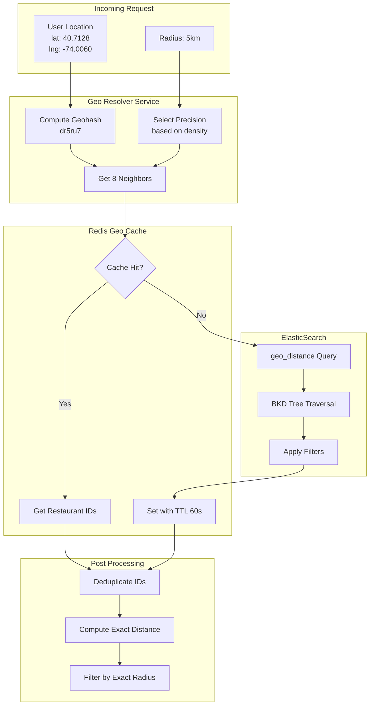

# Spatial Indexing

This document provides a deep dive into spatial indexing strategies for the Uber Eats Feed System, comparing Geohashing and K-d trees, and explaining how ElasticSearch implements geo queries internally.

## Overview

The core challenge: Given an eater's location, efficiently find all restaurants that can deliver to that location among 10M+ restaurants globally.

**Key Requirements:**
- Query latency: < 50ms for geo lookup
- Support radius queries (1-15km)
- Handle variable density (Manhattan vs rural Wyoming)
- Efficient updates when restaurants change

---

## Geohashing

### What is Geohashing?

Geohashing encodes a geographic location (latitude/longitude) into a short alphanumeric string. The world is recursively divided into a grid, and each cell gets a unique prefix.

```
World Map with Geohash Prefixes (Precision 1):
┌───────┬───────┬───────┬───────┬───────┬───────┬───────┬───────┐
│   b   │   c   │   f   │   g   │   u   │   v   │   y   │   z   │
├───────┼───────┼───────┼───────┼───────┼───────┼───────┼───────┤
│   8   │   9   │   d   │   e   │   s   │   t   │   w   │   x   │
├───────┼───────┼───────┼───────┼───────┼───────┼───────┼───────┤
│   2   │   3   │   6   │   7   │   k   │   m   │   q   │   r   │
├───────┼───────┼───────┼───────┼───────┼───────┼───────┼───────┤
│   0   │   1   │   4   │   5   │   h   │   j   │   n   │   p   │
└───────┴───────┴───────┴───────┴───────┴───────┴───────┴───────┘

New York City: dr5r (precision 4)
Manhattan:     dr5ru (precision 5)
Specific block: dr5ru7 (precision 6)
```

### Geohash Precision Levels

| Precision | Cell Size | Use Case |
|-----------|-----------|----------|
| 1 | ~5,000 km × 5,000 km | Continental |
| 2 | ~1,250 km × 625 km | Country |
| 3 | ~156 km × 156 km | State/Region |
| 4 | ~39 km × 19.5 km | Metro Area |
| 5 | ~4.9 km × 4.9 km | City District |
| 6 | ~1.2 km × 0.6 km | Neighborhood |
| 7 | ~153 m × 153 m | City Block |
| 8 | ~38 m × 19 m | Building |

### How Geohash Encoding Works

```
Latitude:  40.7128° N
Longitude: -74.0060° W

Step 1: Binary Encoding
Lat binary:  10110100011011010100... (alternating with lng)
Lng binary:  01101110001010110010...

Step 2: Interleave bits
Combined:   0110111001110001001010110110...

Step 3: Base32 Encoding (5 bits per character)
01101 11001 11000 10010 10110 110...
  d     r     5     r     u    ...

Result: dr5ru...
```

### Geohash Neighbor Computation

Critical for radius queries: a point near the edge of a cell may have nearby restaurants in adjacent cells.

```
┌─────────┬─────────┬─────────┐
│ dr5rsk  │ dr5rsm  │ dr5rsq  │
│ (NW)    │ (N)     │ (NE)    │
├─────────┼─────────┼─────────┤
│ dr5rs7  │ dr5rs8  │ dr5rsb  │
│ (W)     │ TARGET  │ (E)     │
├─────────┼─────────┼─────────┤
│ dr5rs5  │ dr5rs6  │ dr5rs9  │
│ (SW)    │ (S)     │ (SE)    │
└─────────┴─────────┴─────────┘

Query Process:
1. Compute geohash for user location: dr5rs8
2. Get 8 neighbors: [dr5rsk, dr5rsm, dr5rsq, dr5rs7, dr5rsb, dr5rs5, dr5rs6, dr5rs9]
3. Query all 9 cells for restaurants
4. Filter by exact distance from user
```

### Geohash Algorithm Implementation

```python
BASE32 = '0123456789bcdefghjkmnpqrstuvwxyz'

def encode_geohash(lat: float, lng: float, precision: int = 6) -> str:
    """Encode latitude/longitude into a geohash string."""
    lat_range = (-90.0, 90.0)
    lng_range = (-180.0, 180.0)

    geohash = []
    bits = 0
    bit_count = 0
    is_lng = True  # Start with longitude

    while len(geohash) < precision:
        if is_lng:
            mid = (lng_range[0] + lng_range[1]) / 2
            if lng >= mid:
                bits = (bits << 1) | 1
                lng_range = (mid, lng_range[1])
            else:
                bits = bits << 1
                lng_range = (lng_range[0], mid)
        else:
            mid = (lat_range[0] + lat_range[1]) / 2
            if lat >= mid:
                bits = (bits << 1) | 1
                lat_range = (mid, lat_range[1])
            else:
                bits = bits << 1
                lat_range = (lat_range[0], mid)

        is_lng = not is_lng
        bit_count += 1

        if bit_count == 5:
            geohash.append(BASE32[bits])
            bits = 0
            bit_count = 0

    return ''.join(geohash)


def get_neighbors(geohash: str) -> dict:
    """Get all 8 neighboring geohash cells."""
    # Direction deltas for neighbors
    NEIGHBORS = {
        'n':  ('p0r21436x8zb9dcf5h7kjnmqesgutwvy', 'bc01fg45238967deuvhjyznpkmstqrwx'),
        's':  ('14365h7k9dcfesgujnmqp0r2twvyx8zb', '238967debc01telecomfg45telecomhjyznpkmstqrwx'),
        'e':  ('bc01fg45238967deuvhjyznpkmstqrwx', 'p0r21436x8zb9dcf5h7kjnmqesgutwvy'),
        'w':  ('238967debc01fg4telecomtelecom5hjyznpkmstqrwx', '14365h7k9dcfesgujnmqp0r2twvyx8zb'),
    }
    # ... implementation continues
    return {
        'n': compute_neighbor(geohash, 'n'),
        's': compute_neighbor(geohash, 's'),
        'e': compute_neighbor(geohash, 'e'),
        'w': compute_neighbor(geohash, 'w'),
        'ne': compute_neighbor(compute_neighbor(geohash, 'n'), 'e'),
        'nw': compute_neighbor(compute_neighbor(geohash, 'n'), 'w'),
        'se': compute_neighbor(compute_neighbor(geohash, 's'), 'e'),
        'sw': compute_neighbor(compute_neighbor(geohash, 's'), 'w'),
    }
```

### Adaptive Precision Strategy

Different areas need different precision levels:

```
┌─────────────────────────────────────────────────────────────────┐
│  Area Density Classification                                     │
├─────────────────────────────────────────────────────────────────┤
│                                                                  │
│  HYPER-DENSE (>500 restaurants/km²)                             │
│  • Manhattan, Mumbai, Tokyo                                      │
│  • Precision: 7-8 (153m - 38m cells)                            │
│  • Strategy: Fine-grained cells, more neighbor lookups          │
│                                                                  │
│  URBAN (50-500 restaurants/km²)                                  │
│  • Brooklyn, SF, Chicago                                         │
│  • Precision: 6 (1.2km cells)                                    │
│  • Strategy: Standard approach                                   │
│                                                                  │
│  SUBURBAN (5-50 restaurants/km²)                                 │
│  • Suburbs, small towns                                          │
│  • Precision: 5 (4.9km cells)                                    │
│  • Strategy: Fewer cells, wider radius                          │
│                                                                  │
│  RURAL (<5 restaurants/km²)                                      │
│  • Rural areas                                                   │
│  • Precision: 4-5 (39km - 4.9km cells)                          │
│  • Strategy: Largest cells, may return sparse results           │
│                                                                  │
└─────────────────────────────────────────────────────────────────┘
```

**Precision Selection Algorithm:**

```python
def select_precision(lat: float, lng: float) -> int:
    """Select geohash precision based on area density."""

    # Pre-computed density map (simplified)
    density = get_restaurant_density(lat, lng)  # restaurants/km²

    if density > 500:
        return 7  # Hyper-dense: Manhattan, Mumbai
    elif density > 50:
        return 6  # Urban
    elif density > 5:
        return 5  # Suburban
    else:
        return 4  # Rural
```

---

## K-d Trees

### What is a K-d Tree?

A K-d tree (k-dimensional tree) is a binary search tree where each node represents a point in k-dimensional space. For geographic data, k=2 (latitude, longitude).

```
K-d Tree Structure (2D):
                        (40.7, -74.0)
                       /              \
              x < 40.7                 x >= 40.7
                 /                          \
        (40.6, -73.9)                  (40.8, -74.1)
        /           \                  /           \
   y < -73.9     y >= -73.9      y < -74.1     y >= -74.1
      /              \              /              \
(40.5, -74.0)  (40.65, -73.8) (40.75, -74.2) (40.85, -74.0)
```

### K-d Tree Operations

**Insertion:** O(log n) average, O(n) worst case
**Range Query:** O(√n + k) where k = results
**Nearest Neighbor:** O(log n) average

```python
class KdNode:
    def __init__(self, point, restaurant_id, left=None, right=None, axis=0):
        self.point = point  # (lat, lng)
        self.restaurant_id = restaurant_id
        self.left = left
        self.right = right
        self.axis = axis  # 0 = split on latitude, 1 = split on longitude


def range_query(node, center, radius_km, results, depth=0):
    """Find all points within radius_km of center."""
    if node is None:
        return

    # Check if current point is within radius
    dist = haversine_distance(center, node.point)
    if dist <= radius_km:
        results.append(node.restaurant_id)

    axis = depth % 2

    # Determine which subtrees to search
    diff = center[axis] - node.point[axis]

    # Convert diff to approximate km for comparison
    diff_km = lat_lng_to_km(diff, axis, center[0])

    if diff_km < 0:
        # Center is left of split, search left first
        range_query(node.left, center, radius_km, results, depth + 1)
        if abs(diff_km) <= radius_km:
            range_query(node.right, center, radius_km, results, depth + 1)
    else:
        # Center is right of split, search right first
        range_query(node.right, center, radius_km, results, depth + 1)
        if abs(diff_km) <= radius_km:
            range_query(node.left, center, radius_km, results, depth + 1)
```

### K-d Tree Challenges

```
┌─────────────────────────────────────────────────────────────────┐
│  K-d Tree Scaling Challenges                                     │
├─────────────────────────────────────────────────────────────────┤
│                                                                  │
│  1. MEMORY CONSTRAINTS                                          │
│     • 10M restaurants × ~100 bytes/node = ~1GB                  │
│     • Must fit in single machine memory                         │
│     • Tree structure not disk-friendly                          │
│                                                                  │
│  2. SHARDING COMPLEXITY                                         │
│     • Tree splits don't align with geographic boundaries        │
│     • Range query may span multiple shards                      │
│     • Rebalancing across shards is complex                      │
│                                                                  │
│  3. UPDATE OVERHEAD                                             │
│     • Insertion may cause tree imbalance                        │
│     • Periodic rebalancing required                             │
│     • Deletions leave gaps, degrade performance                 │
│                                                                  │
│  4. REBUILDING ON FAILURE                                       │
│     • Tree must be rebuilt from scratch                         │
│     • No incremental recovery                                   │
│     • Downtime during reconstruction                            │
│                                                                  │
└─────────────────────────────────────────────────────────────────┘
```

---

## Geohashing vs K-d Trees Comparison

| Aspect | Geohashing | K-d Tree |
|--------|------------|----------|
| **Lookup Complexity** | O(1) per cell | O(log n) |
| **Range Query** | O(k) cells × O(1) lookup | O(√n + k) |
| **Memory Usage** | Hash table (efficient) | Tree nodes (pointer overhead) |
| **Sharding** | Natural (prefix-based) | Complex (requires coordination) |
| **Updates** | O(1) insert/delete | O(log n) + potential rebalance |
| **Precision Control** | Variable precision easy | Fixed structure |
| **Edge Cases** | Neighbor lookup needed | Handled naturally |
| **Rebuild on Failure** | Independent cells | Full tree reconstruction |
| **Dense Areas** | Adjust precision | May become unbalanced |
| **Best For** | Distributed systems, caching | Single-node, exact queries |

### Why We Choose Geohashing

1. **Natural sharding**: Geohash prefixes map directly to shards
2. **Cache-friendly**: Cells are independent, easy to cache
3. **Fault isolation**: One cell failure doesn't affect others
4. **Predictable performance**: O(1) lookup per cell
5. **Easy updates**: No rebalancing required

---

## ElasticSearch Geo Implementation

### How ElasticSearch geo_point Works

ElasticSearch uses a combination of techniques for geo queries:

```
┌─────────────────────────────────────────────────────────────────┐
│  ElasticSearch Geo Index Architecture                           │
├─────────────────────────────────────────────────────────────────┤
│                                                                  │
│  1. STORAGE: geo_point as encoded long                          │
│     • Latitude/longitude encoded into single 64-bit value       │
│     • Morton code (Z-order curve) preserves locality            │
│                                                                  │
│  2. INDEXING: BKD Tree (Block K-D Tree)                         │
│     • Disk-friendly variant of K-d tree                         │
│     • Blocks of points sorted by Morton code                    │
│     • Efficient range queries with block-level pruning          │
│                                                                  │
│  3. QUERY: geo_distance filter                                  │
│     • BKD tree narrows candidates                               │
│     • Haversine distance computed for final filtering           │
│     • Results scored by distance if requested                   │
│                                                                  │
└─────────────────────────────────────────────────────────────────┘
```

### BKD Tree Explained

```
BKD Tree Structure:
┌───────────────────────────────────────────────────────┐
│                    Root Block                          │
│  [min_lat, max_lat, min_lng, max_lng]                 │
│  Points: 1000-4000 per leaf block                     │
└───────────────────────────────────────────────────────┘
              /                    \
┌─────────────────────────┐  ┌─────────────────────────┐
│   Inner Block (Left)    │  │   Inner Block (Right)   │
│   Split on Latitude     │  │   Split on Latitude     │
└─────────────────────────┘  └─────────────────────────┘
    /           \                  /           \
┌─────────┐ ┌─────────┐    ┌─────────┐ ┌─────────┐
│ Leaf    │ │ Leaf    │    │ Leaf    │ │ Leaf    │
│ Block 1 │ │ Block 2 │    │ Block 3 │ │ Block 4 │
│ (sorted)│ │ (sorted)│    │ (sorted)│ │ (sorted)│
└─────────┘ └─────────┘    └─────────┘ └─────────┘

Query Process:
1. Check if query box intersects block bounds → prune if not
2. If leaf block, scan all points in block
3. If inner block, recurse into intersecting children
```

### ElasticSearch Geo Query Types

```json
// 1. geo_distance: Circle query
{
  "query": {
    "bool": {
      "filter": {
        "geo_distance": {
          "distance": "5km",
          "location": { "lat": 40.7128, "lon": -74.0060 }
        }
      }
    }
  }
}

// 2. geo_bounding_box: Rectangle query (faster)
{
  "query": {
    "bool": {
      "filter": {
        "geo_bounding_box": {
          "location": {
            "top_left": { "lat": 40.8, "lon": -74.1 },
            "bottom_right": { "lat": 40.6, "lon": -73.9 }
          }
        }
      }
    }
  }
}

// 3. geo_polygon: Arbitrary polygon
{
  "query": {
    "bool": {
      "filter": {
        "geo_polygon": {
          "location": {
            "points": [
              { "lat": 40.7, "lon": -74.0 },
              { "lat": 40.8, "lon": -74.0 },
              { "lat": 40.75, "lon": -73.9 }
            ]
          }
        }
      }
    }
  }
}
```

### ElasticSearch Geohash Aggregation

Useful for heatmaps and density analysis:

```json
{
  "aggs": {
    "restaurant_clusters": {
      "geohash_grid": {
        "field": "location",
        "precision": 6
      },
      "aggs": {
        "avg_rating": { "avg": { "field": "rating" } },
        "centroid": { "geo_centroid": { "field": "location" } }
      }
    }
  }
}
```

---

## Our Geo Search Implementation

### Architecture



### Query Flow

```python
async def find_restaurants_near(
    lat: float,
    lng: float,
    radius_km: float,
    filters: dict
) -> List[str]:
    """Find restaurant IDs within radius of location."""

    # 1. Determine precision based on area density
    precision = await get_precision_for_area(lat, lng)

    # 2. Compute geohash and neighbors
    center_hash = encode_geohash(lat, lng, precision)
    neighbor_hashes = get_neighbors(center_hash)
    all_hashes = [center_hash] + list(neighbor_hashes.values())

    # 3. Check cache for each cell
    cache_keys = [f"geo:cell:{h}:{radius_km}km" for h in all_hashes]
    cached_results = await redis.mget(cache_keys)

    # 4. For cache misses, query ElasticSearch
    uncached_hashes = [
        h for h, cached in zip(all_hashes, cached_results)
        if cached is None
    ]

    if uncached_hashes:
        es_results = await query_elasticsearch(
            center=(lat, lng),
            radius_km=radius_km,
            geohashes=uncached_hashes,
            filters=filters
        )

        # Cache results
        await cache_geo_results(uncached_hashes, es_results, radius_km)

    # 5. Merge and deduplicate
    all_restaurant_ids = merge_results(cached_results, es_results)

    # 6. Filter by exact distance (geohash cells are rectangular)
    filtered_ids = await filter_by_exact_distance(
        all_restaurant_ids, lat, lng, radius_km
    )

    return filtered_ids


async def query_elasticsearch(
    center: Tuple[float, float],
    radius_km: float,
    geohashes: List[str],
    filters: dict
) -> List[str]:
    """Query ElasticSearch for restaurants."""

    query = {
        "bool": {
            "must": [
                {"term": {"is_active": True}},
                {"term": {"accepting_orders": True}}
            ],
            "filter": [
                {
                    "geo_distance": {
                        "distance": f"{radius_km}km",
                        "location": {
                            "lat": center[0],
                            "lon": center[1]
                        }
                    }
                }
            ]
        }
    }

    # Add optional filters
    if filters.get("cuisine_types"):
        query["bool"]["filter"].append({
            "terms": {"cuisine_types": filters["cuisine_types"]}
        })

    response = await es_client.search(
        index="restaurants",
        query=query,
        size=1000,
        _source=["restaurant_id"]
    )

    return [hit["_source"]["restaurant_id"] for hit in response["hits"]["hits"]]
```

---

## Performance Characteristics

### Latency Breakdown

| Operation | P50 | P99 | Notes |
|-----------|-----|-----|-------|
| Geohash computation | 0.01ms | 0.05ms | In-memory |
| Neighbor computation | 0.02ms | 0.1ms | In-memory |
| Redis cache lookup | 0.5ms | 2ms | 9 keys parallel |
| ElasticSearch query | 10ms | 50ms | BKD tree traversal |
| Distance filtering | 1ms | 5ms | In-memory |
| **Total (cache hit)** | **2ms** | **10ms** | - |
| **Total (cache miss)** | **15ms** | **60ms** | - |

### Cache Hit Rates by Area Type

| Area Type | Cache TTL | Hit Rate | Rationale |
|-----------|-----------|----------|-----------|
| Hyper-dense (Manhattan) | 30s | 95% | High traffic, frequent queries |
| Urban | 60s | 85% | Moderate traffic |
| Suburban | 120s | 70% | Lower traffic |
| Rural | 300s | 50% | Sparse queries |

---

## Edge Cases and Handling

### 1. Boundary Crossing

When user is near edge of a geohash cell:

```
User at edge of cell:
┌─────────────────┬─────────────────┐
│                 │   Restaurant B   │
│                 │        •         │
│     Cell A      ├─────────────────┤
│                 │                  │
│       • User    │     Cell C       │
│                 │                  │
└─────────────────┴─────────────────┘

Solution: Always query all 8 neighbors + center cell
```

### 2. Large Delivery Radius

Restaurant with 15km delivery radius may span many cells:

```python
def get_cells_for_restaurant(
    lat: float,
    lng: float,
    delivery_radius_km: float
) -> List[str]:
    """Get all geohash cells a restaurant can deliver to."""

    # Use lower precision for larger radius
    if delivery_radius_km > 10:
        precision = 4
    elif delivery_radius_km > 5:
        precision = 5
    else:
        precision = 6

    center = encode_geohash(lat, lng, precision)
    cells = {center}

    # BFS to find all cells within delivery radius
    queue = [center]
    visited = {center}

    while queue:
        current = queue.pop(0)
        for neighbor in get_neighbors(current).values():
            if neighbor not in visited:
                visited.add(neighbor)
                # Check if neighbor cell center is within delivery radius
                neighbor_center = decode_geohash(neighbor)
                dist = haversine_distance((lat, lng), neighbor_center)
                if dist <= delivery_radius_km + cell_diagonal(precision):
                    cells.add(neighbor)
                    queue.append(neighbor)

    return list(cells)
```

### 3. Antimeridian (180° longitude)

```python
def handle_antimeridian(lng: float) -> float:
    """Normalize longitude for antimeridian crossing."""
    while lng > 180:
        lng -= 360
    while lng < -180:
        lng += 360
    return lng
```

### 4. Polar Regions

Geohash cells become very distorted near poles:

```python
def is_polar_region(lat: float) -> bool:
    """Check if location is in polar region."""
    return abs(lat) > 85

def query_polar_region(lat: float, lng: float, radius_km: float):
    """Special handling for polar queries."""
    # Fall back to pure geo_distance query without geohash optimization
    return await query_elasticsearch_direct(lat, lng, radius_km)
```

