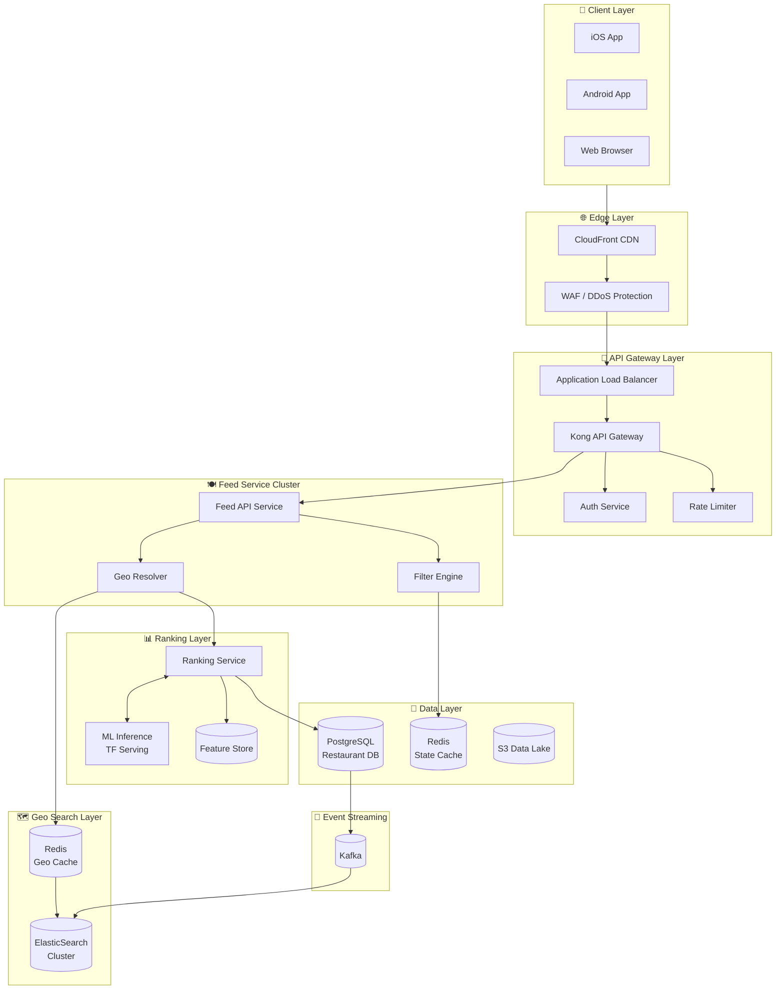
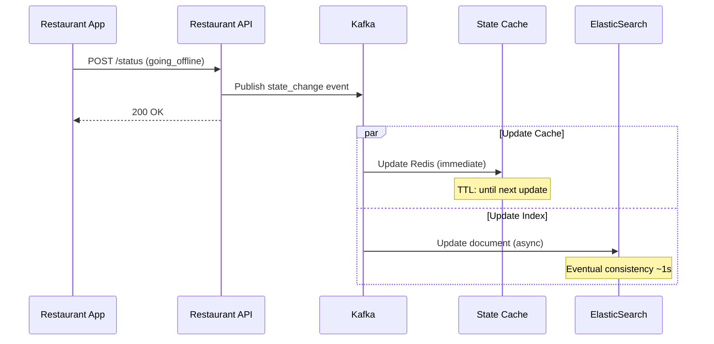

# System Architecture

## High-Level Architecture Overview

### Mermaid Diagram



### ASCII Diagram

```
┌─────────────────────────────────────────────────────────────────────────────────────────┐
│                                    CLIENT LAYER                                          │
├─────────────────────────────────────────────────────────────────────────────────────────┤
│  ┌─────────────────┐  ┌─────────────────┐  ┌─────────────────┐                          │
│  │   iOS App       │  │   Android App   │  │   Web Browser   │                          │
│  │   (Swift)       │  │   (Kotlin)      │  │   (React)       │                          │
│  └────────┬────────┘  └────────┬────────┘  └────────┬────────┘                          │
└───────────┼─────────────────────┼─────────────────────┼─────────────────────────────────┘
            │                     │                     │
            └─────────────────────┼─────────────────────┘
                                  ▼
┌─────────────────────────────────────────────────────────────────────────────────────────┐
│                               EDGE & GATEWAY LAYER                                       │
├─────────────────────────────────────────────────────────────────────────────────────────┤
│  ┌──────────────────────┐    ┌──────────────────────┐    ┌──────────────────────┐       │
│  │   CloudFront CDN     │ -> │   WAF / Shield       │ -> │   Load Balancer      │       │
│  │   (Static + API)     │    │   (DDoS Protection)  │    │   (ALB)              │       │
│  └──────────────────────┘    └──────────────────────┘    └──────────┬───────────┘       │
│                                                                      │                   │
│  ┌────────────────────────────────────────────────────────────────────────────────────┐ │
│  │                           KONG API GATEWAY                                          │ │
│  │   ┌────────────┐  ┌────────────┐  ┌────────────┐  ┌────────────┐                   │ │
│  │   │ Auth       │  │ Rate       │  │ Request    │  │ Circuit    │                   │ │
│  │   │ Plugin     │  │ Limiting   │  │ Transform  │  │ Breaker    │                   │ │
│  │   └────────────┘  └────────────┘  └────────────┘  └────────────┘                   │ │
│  └────────────────────────────────────────────────────────────────────────────────────┘ │
└─────────────────────────────────────────────────────────────────────────────────────────┘
                                          │
                                          ▼
┌─────────────────────────────────────────────────────────────────────────────────────────┐
│                               FEED SERVICE LAYER                                         │
├─────────────────────────────────────────────────────────────────────────────────────────┤
│  ┌────────────────────────────────────────────────────────────────────────────────────┐ │
│  │                         FEED API SERVICE (K8s Deployment)                           │ │
│  │  ┌───────────────────┐  ┌───────────────────┐  ┌───────────────────┐               │ │
│  │  │ Request Handler   │  │ Geo Resolver      │  │ Filter Engine     │               │ │
│  │  │ • Parse location  │  │ • Geohash compute │  │ • State filter    │               │ │
│  │  │ • Validate params │  │ • Neighbor lookup │  │ • Geo restrictions│               │ │
│  │  │ • Pagination      │  │ • Radius filter   │  │ • User preferences│               │ │
│  │  └───────────────────┘  └───────────────────┘  └───────────────────┘               │ │
│  └────────────────────────────────────────────────────────────────────────────────────┘ │
└─────────────────────────────────────────────────────────────────────────────────────────┘
                                          │
                     ┌────────────────────┼────────────────────┐
                     ▼                    ▼                    ▼
┌──────────────────────────┐  ┌──────────────────────────┐  ┌──────────────────────────┐
│    GEO SEARCH LAYER      │  │    RANKING LAYER         │  │    DATA LAYER            │
├──────────────────────────┤  ├──────────────────────────┤  ├──────────────────────────┤
│ ┌──────────────────────┐ │  │ ┌──────────────────────┐ │  │ ┌──────────────────────┐ │
│ │ Redis Geo Cache      │ │  │ │ Ranking Service      │ │  │ │ PostgreSQL           │ │
│ │ • Geohash -> IDs     │ │  │ │ • Score computation  │ │  │ │ • Restaurant data    │ │
│ │ • TTL: 60 seconds    │ │  │ │ • Feature assembly   │ │  │ │ • Delivery zones     │ │
│ │ • 80% hit rate       │ │  │ │ • Sort & paginate    │ │  │ │ • Menu items         │ │
│ └──────────────────────┘ │  │ └──────────────────────┘ │  │ └──────────────────────┘ │
│ ┌──────────────────────┐ │  │ ┌──────────────────────┐ │  │ ┌──────────────────────┐ │
│ │ ElasticSearch        │ │  │ │ ML Inference         │ │  │ │ Redis State Cache    │ │
│ │ • geo_point index    │ │  │ │ (TensorFlow Serving) │ │  │ │ • Restaurant state   │ │
│ │ • geo_distance query │ │  │ │ • Personalization    │ │  │ │ • Online/offline     │ │
│ │ • Geohash aggregation│ │  │ │ • CTR prediction     │ │  │ │ • Busy status        │ │
│ └──────────────────────┘ │  │ └──────────────────────┘ │  │ └──────────────────────┘ │
└──────────────────────────┘  └──────────────────────────┘  └──────────────────────────┘
```

---

## Core Components

### 1. API Gateway Layer

Handles authentication, rate limiting, and request routing.

**Components:**
- **Kong API Gateway**: Plugin-based request processing
- **Auth Service**: JWT validation, user context extraction
- **Rate Limiter**: Token bucket algorithm, per-user and per-IP limits

**Configuration:**
```yaml
rate_limiting:
  anonymous: 100/minute
  authenticated: 1000/minute
  burst: 50

circuit_breaker:
  threshold: 50%
  timeout: 30s
  half_open_requests: 10
```

### 2. Feed Service Layer

Core orchestration service that coordinates geo search, filtering, and ranking.

**Responsibilities:**
- Parse and validate location parameters
- Compute geohash and identify search cells
- Orchestrate parallel lookups (geo + state + details)
- Apply filters and return paginated results

**Service Configuration:**
```yaml
feed_service:
  replicas: 20
  cpu: 2 cores
  memory: 4GB

  geo_config:
    default_radius_km: 5
    max_radius_km: 15
    geohash_precision: 6

  pagination:
    default_limit: 20
    max_limit: 100
```

### 3. Geo Search Layer

Provides spatial indexing using **H3 (Uber's hexagonal grid)** combined with ElasticSearch.

**ElasticSearch Index Mapping (with H3):**
```json
{
  "mappings": {
    "properties": {
      "restaurant_id": { "type": "keyword" },
      "location": { "type": "geo_point" },
      "h3_res6": { "type": "keyword" },
      "h3_res7": { "type": "keyword" },
      "h3_res8": { "type": "keyword" },
      "h3_res9": { "type": "keyword" },
      "h3_delivery_cells": { "type": "keyword" },
      "delivery_radius_km": { "type": "float" },
      "cuisine_types": { "type": "keyword" },
      "price_range": { "type": "integer" },
      "avg_rating": { "type": "float" },
      "is_active": { "type": "boolean" }
    }
  },
  "settings": {
    "number_of_shards": 10,
    "number_of_replicas": 2
  }
}
```

**How H3 + ElasticSearch Works:**
1. User location converted to H3 cell at appropriate resolution
2. K-ring query gets all cells within delivery radius
3. ElasticSearch filters by H3 cell terms (very fast)
4. `geo_distance` refines for exact radius accuracy

### 4. Ranking Layer

Computes relevance scores for restaurant ordering.

**Scoring Components:**
```
final_score = w1 * distance_score
            + w2 * rating_score
            + w3 * eta_score
            + w4 * personalization_score
            + w5 * promotion_boost
```

**ML Inference Integration:**
- TensorFlow Serving for real-time predictions
- Feature store for user preferences and historical data
- Batch prediction for cold-start users

### 5. Data Layer

Persistent storage for restaurant data and real-time state.

**PostgreSQL Schema (Sharded by restaurant_id):**
- `restaurants`: Core restaurant metadata
- `delivery_zones`: Polygon-based delivery areas
- `menu_items`: Menu for each restaurant
- `operating_hours`: Weekly schedule

**Redis State Cache:**
- Restaurant online/offline status
- Current wait times
- Temporary closures
- Geo-restriction flags

---

## Data Flow Patterns

### Feed Request Flow (Happy Path)

```
┌───────────┐     ┌───────────┐     ┌───────────┐     ┌───────────┐     ┌───────────┐
│  Client   │────▶│  Gateway  │────▶│   Feed    │────▶│ Geo Cache │────▶│   Rank    │
│           │     │           │     │  Service  │     │           │     │  Service  │
└───────────┘     └───────────┘     └───────────┘     └───────────┘     └───────────┘
                                          │                                   │
                                          │                                   ▼
                                          │              ┌───────────────────────────────┐
                                          │              │ Parallel Fetch:               │
                                          │              │ • Restaurant details (PG)     │
                                          │              │ • State flags (Redis)         │
                                          │              │ • ML scores (TF Serving)      │
                                          │              └───────────────────────────────┘
                                          │                                   │
                                          ▼                                   ▼
                                    ┌───────────┐                       ┌───────────┐
                                    │  Filter   │◀──────────────────────│  Merge &  │
                                    │  Apply    │                       │   Sort    │
                                    └───────────┘                       └───────────┘
                                          │
                                          ▼
                                    ┌───────────┐
                                    │ Paginate  │
                                    │ & Return  │
                                    └───────────┘

Latency Breakdown:
• Gateway processing: ~10ms
• Geo cache lookup: ~5ms (hit) / ~50ms (miss → ES)
• Parallel fetch: ~30ms
• Ranking: ~20ms
• Total P99: < 200ms
```

### Restaurant State Update Flow



---

## Technology Stack

| Layer | Technology | Justification |
|-------|------------|---------------|
| **API Gateway** | Kong | Plugin ecosystem, rate limiting, observability |
| **Geo Search** | ElasticSearch + H3 | H3 hexagonal indexing, geo_point for precision, horizontal scaling |
| **Cache** | Redis Cluster | Sub-ms latency, geo commands, pub/sub for invalidation |
| **Primary DB** | PostgreSQL | ACID compliance, PostGIS for complex geo queries |
| **ML Serving** | TensorFlow Serving | Low-latency inference, model versioning |
| **Messaging** | Kafka | Event sourcing, exactly-once delivery, replay capability |
| **Container Orchestration** | Kubernetes | Auto-scaling, rolling deployments, service mesh |
| **Observability** | Prometheus + Grafana | Metrics, alerting, dashboards |
| **Tracing** | Jaeger | Distributed tracing for latency debugging |

---

## Deployment Topology

### Multi-Region Active-Active

```
                    ┌─────────────────────────┐
                    │     Global DNS (Route53)│
                    │   Latency-based routing │
                    └───────────┬─────────────┘
            ┌───────────────────┼───────────────────┐
            ▼                   ▼                   ▼
    ┌───────────────┐   ┌───────────────┐   ┌───────────────┐
    │   US-EAST     │   │   EU-WEST     │   │   AP-SOUTH    │
    │   (Virginia)  │   │   (Ireland)   │   │   (Mumbai)    │
    ├───────────────┤   ├───────────────┤   ├───────────────┤
    │ • Feed API    │   │ • Feed API    │   │ • Feed API    │
    │ • ES Cluster  │   │ • ES Cluster  │   │ • ES Cluster  │
    │ • Redis       │   │ • Redis       │   │ • Redis       │
    │ • PG Replica  │   │ • PG Replica  │   │ • PG Primary  │
    └───────────────┘   └───────────────┘   └───────────────┘
            │                   │                   │
            └───────────────────┼───────────────────┘
                                ▼
                    ┌─────────────────────────┐
                    │   Cross-Region Sync     │
                    │   (Kafka MirrorMaker)   │
                    └─────────────────────────┘
```

**Region Selection Criteria:**
- User location → nearest region (latency-based DNS)
- Restaurant data → region where restaurant operates
- Cross-region replication for disaster recovery

---

## Capacity Planning

### Traffic Estimates

| Metric | Baseline | Peak (Meal Time) |
|--------|----------|------------------|
| Read QPS | 10,000 | 50,000 |
| Avg Response Size | 15KB | 15KB |
| Bandwidth | 150 MB/s | 750 MB/s |
| Concurrent Users | 100,000 | 500,000 |

### Infrastructure Sizing

| Component | Baseline | Peak Scaling |
|-----------|----------|--------------|
| Feed API Pods | 20 | 100 (HPA) |
| ElasticSearch Nodes | 15 (5 per region) | Fixed |
| Redis Cluster | 6 nodes (2 per region) | Fixed |
| PostgreSQL | 3 replicas per region | Fixed |

### Cost Estimate (Monthly - AWS)

| Component | Specs | Estimated Cost |
|-----------|-------|----------------|
| EC2 (API) | 20 × c6i.xlarge | $2,500 |
| ElasticSearch | 15 × r6i.2xlarge | $15,000 |
| Redis | 6 × r6g.xlarge | $2,400 |
| RDS PostgreSQL | 3 × db.r6g.2xlarge | $4,500 |
| Data Transfer | ~50TB egress | $4,500 |
| **Total** | | **~$29,000/month** |

---

## Failure Modes & Mitigation

| Failure Mode | Impact | Mitigation |
|--------------|--------|------------|
| ES Cluster Down | No geo search | Fallback to cached geohash results + degraded mode |
| Redis Cache Down | Increased ES load | Circuit breaker, direct ES queries with rate limiting |
| PostgreSQL Down | No restaurant details | Serve from cache with stale marker |
| ML Service Down | No personalization | Default ranking (distance + rating) |
| Regional Outage | Regional users affected | DNS failover to nearest region (~60s) |

---

## Security Architecture

```
┌─────────────────────────────────────────────────────────────────┐
│  Layer 1: Network Security                                       │
│  • VPC isolation  • Security Groups  • WAF  • DDoS Protection   │
├─────────────────────────────────────────────────────────────────┤
│  Layer 2: Authentication                                         │
│  • JWT tokens  • OAuth 2.0  • API Keys for partners             │
├─────────────────────────────────────────────────────────────────┤
│  Layer 3: Authorization                                          │
│  • RBAC for internal services  • User-scoped data access        │
├─────────────────────────────────────────────────────────────────┤
│  Layer 4: Data Security                                          │
│  • Encryption at rest (AES-256)  • TLS 1.3 in transit          │
│  • PII masking in logs  • GDPR compliance                       │
└─────────────────────────────────────────────────────────────────┘
```

