# URL Shortener - Java Spring Boot Implementation

<p align="center">
  
  
  
</p>

A production-grade URL shortener service built with **Java 21** and **Spring Boot 3.2**. Designed to scale from local development to **500 million URLs per month** globally with multi-region active-active deployment.

---

## 📑 Table of Contents

- [Features](#-features)
- [Architecture](#-architecture)
- [Quick Start](#-quick-start)
- [API Reference](#-api-reference)
- [Configuration](#-configuration)
- [ID Generation & Range Allocation](#-id-generation--range-allocation)
- [Custom Aliases](#-custom-aliases)
- [Caching Strategy](#-caching-strategy)
- [Security](#-security)
- [Rate Limiting](#-rate-limiting)
- [Monitoring & Observability](#-monitoring--observability)
- [Database Design](#-database-design)
- [Scaling Tiers](#-scaling-tiers)
- [Docker Deployment](#-docker-deployment)
- [Testing](#-testing)
- [GDPR Compliance](#-gdpr-compliance)
- [Documentation](#-documentation)
- [Contributing](#-contributing)

---

## ✨ Features

### Core Functionality
- ✅ **URL Shortening** - Create short, memorable links
- ✅ **Custom Aliases** - User-defined vanity URLs
- ✅ **URL Expiration** - Time-based link expiration
- ✅ **Click Tracking** - Real-time analytics
- ✅ **Bulk Operations** - Create multiple URLs at once

### Technical Features
- ✅ **Base62 Encoding** - Compact 7-character codes (3.5 trillion capacity)
- ✅ **Distributed ID Generation** - Range-based allocation for horizontal scaling
- ✅ **Write-Through Caching** - Redis/Memory with 24h TTL
- ✅ **Rate Limiting** - Tier-based request throttling
- ✅ **API Key Authentication** - Secure API access
- ✅ **Prometheus Metrics** - Full observability stack
- ✅ **GDPR Compliance** - Data export and erasure

---

## 🏗️ Architecture

### High-Level Overview

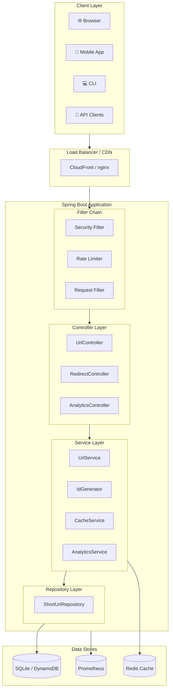

### Request Flow - URL Shortening

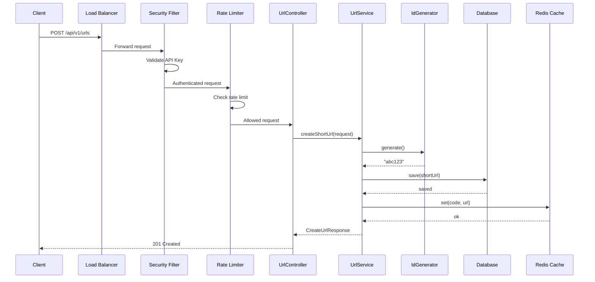

### Request Flow - URL Redirect

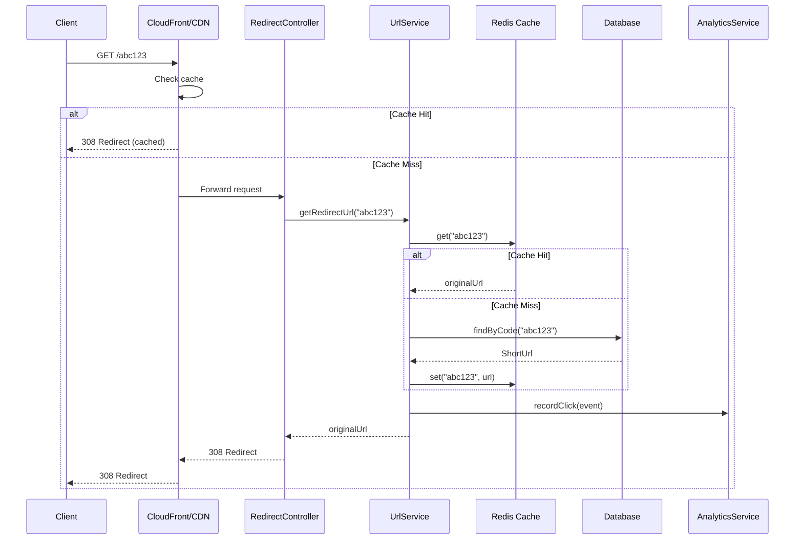

### Project Structure

```
url-shortener-java/
├── src/
│   ├── main/
│   │   ├── java/com/urlshortener/
│   │   │   ├── UrlShortenerApplication.java    # Application entry point
│   │   │   ├── controller/                     # REST API Layer
│   │   │   ├── domain/                         # Domain Models & DTOs
│   │   │   ├── service/                        # Business Logic
│   │   │   ├── repository/                     # Data Access
│   │   │   ├── security/                       # Security Layer
│   │   │   ├── config/                         # Configuration
│   │   │   └── exception/                      # Error Handling
│   │   └── resources/
│   │       └── application.yml                 # Configuration
│   └── test/java/com/urlshortener/            # Test classes
├── docker/
│   ├── Dockerfile                              # Production build
│   └── Dockerfile.dev                          # Development build
├── config/
│   └── prometheus.yml                          # Prometheus config
├── docs/                                       # Documentation
├── docker-compose.yml                          # Docker orchestration
├── pom.xml                                     # Maven dependencies
└── README.md                                   # This file
```

---

## 🚀 Quick Start

### Prerequisites

- **Java 21** or higher
- **Maven 3.9+** (or use included wrapper)
- **Docker & Docker Compose** (for containerized deployment)

### Option 1: Docker Compose (Recommended)

```bash
# Clone the repository
cd url-shortener-java

# Start the application
docker-compose up -d

# View logs
docker-compose logs -f url-shortener

# Check health
curl http://localhost:8080/health
```

### Option 2: Maven (Local Development)

```bash
# Using Maven wrapper
./mvnw spring-boot:run

# Or with installed Maven
mvn spring-boot:run
```

### Option 3: Build & Run JAR

```bash
# Build the application
./mvnw clean package -DskipTests

# Run the JAR
java -jar target/url-shortener-1.0.0.jar
```

### Verify Installation

```bash
# Health check
curl http://localhost:8080/health
# Response: {"status":"ok","timestamp":"2024-01-15T10:30:00Z"}

# Create a short URL
curl -X POST http://localhost:8080/api/v1/urls \
  -H "Content-Type: application/json" \
  -H "Authorization: Bearer test_user:free" \
  -d '{"url": "https://github.com/example/repo"}'

# Response:
# {
#   "id": "550e8400-e29b-41d4-a716-446655440000",
#   "shortCode": "0000001",
#   "shortUrl": "http://localhost:8080/0000001",
#   "originalUrl": "https://github.com/example/repo",
#   "createdAt": "2024-01-15T10:30:00Z",
#   "expiresAt": "2025-01-15T10:30:00Z"
# }

# Test redirect
curl -I http://localhost:8080/0000001
# HTTP/1.1 308 Permanent Redirect
# Location: https://github.com/example/repo
```

---

## 📚 API Reference

### Base URL

```
Local:      http://localhost:8080
Production: https://short.yourdomain.com
```

### Authentication

All API endpoints (except redirects and health checks) require authentication:

```bash
# Bearer Token (Development)
Authorization: Bearer {userId}:{tier}
# Example: Bearer user123:premium

# API Key (Production)
Authorization: ApiKey urlsh_sk_xxxxxxxxxxxxxxxxxx
```

### Endpoints

#### Create Short URL

```http
POST /api/v1/urls
```

**Request Body:**
```json
{
  "url": "https://example.com/very/long/url",
  "customAlias": "my-link",
  "ttlSeconds": 86400,
  "title": "My Link",
  "description": "Description",
  "tags": ["marketing", "2024"]
}
```

**Response (201 Created):**
```json
{
  "id": "550e8400-e29b-41d4-a716-446655440000",
  "shortCode": "my-link",
  "shortUrl": "http://localhost:8080/my-link",
  "originalUrl": "https://example.com/very/long/url",
  "createdAt": "2024-01-15T10:30:00Z",
  "expiresAt": "2024-01-16T10:30:00Z"
}
```

#### Get URL Details

```http
GET /api/v1/urls/{code}
```

#### Redirect

```http
GET /{code}
```

**Response: 308 Permanent Redirect**

#### Get Analytics

```http
GET /api/v1/analytics/{code}
```

#### Health Endpoints

```http
GET /health              # Liveness probe
GET /ready               # Readiness probe
GET /actuator/prometheus # Prometheus metrics
```

### Error Responses

| Code | HTTP Status | Description |
|------|-------------|-------------|
| `URL_NOT_FOUND` | 404 | Short URL doesn't exist |
| `URL_EXPIRED` | 410 | URL has expired |
| `URL_DISABLED` | 403 | URL has been disabled |
| `INVALID_URL` | 400 | Invalid URL format |
| `ALIAS_TAKEN` | 409 | Custom alias already exists |
| `RATE_LIMITED` | 429 | Rate limit exceeded |

---

## ⚙️ Configuration

### Environment Variables

| Variable | Default | Description |
|----------|---------|-------------|
| `SPRING_PROFILES_ACTIVE` | `local` | Active profile |
| `DATABASE_URL` | `jdbc:sqlite:./data/urls.db` | Database connection |
| `CACHE_TYPE` | `memory` | Cache type: `memory` or `redis` |
| `REDIS_HOST` | `localhost` | Redis server host |
| `BASE_URL` | `http://localhost:8080` | Public URL |
| `AWS_REGION` | `us-east-1` | AWS region |

---

## 🔢 ID Generation & Range Allocation

### Global ID Space Division

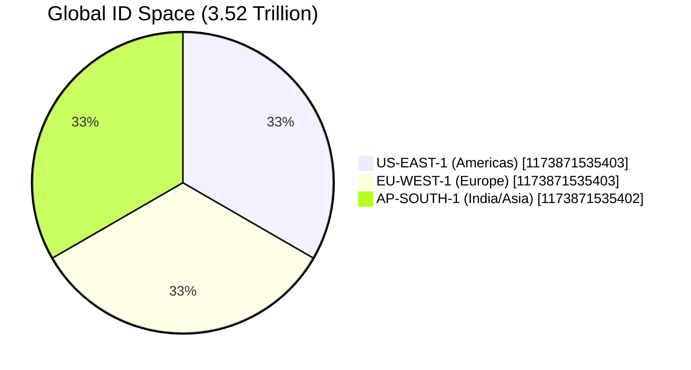

### Distributed Counter Architecture

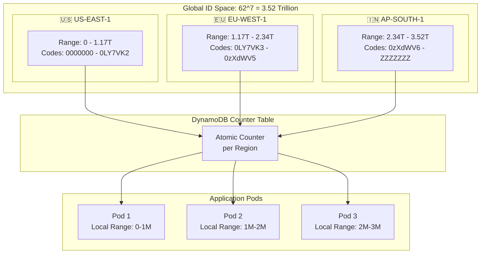

### ID Generation Flow

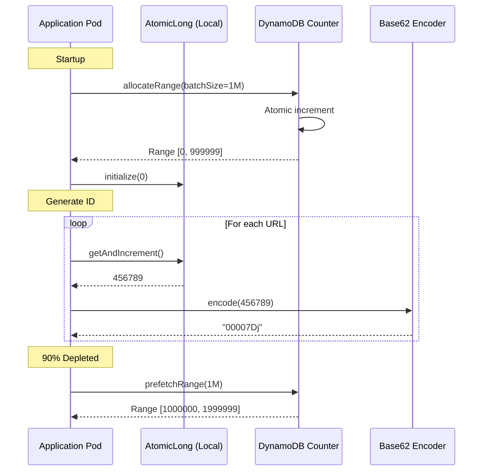

### Capacity Planning

| Region | Range Size | At 167M/month | Years |
|--------|------------|---------------|-------|
| US-EAST-1 | 1.17 trillion | 584+ years | ∞ |
| EU-WEST-1 | 1.17 trillion | 584+ years | ∞ |
| AP-SOUTH-1 | 1.17 trillion | 584+ years | ∞ |

---

## 🏷️ Custom Aliases

Custom aliases (user-defined slugs) exist in a **separate logical namespace** from auto-generated codes.

### How Custom Aliases Work

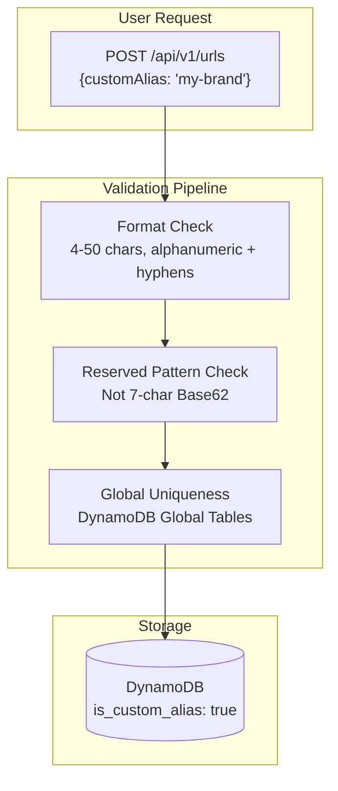

### Custom vs Auto-Generated

| Aspect | Auto-Generated | Custom Alias |
|--------|----------------|--------------|
| **Format** | 7 chars, Base62 | 4-50 chars, alphanumeric + hyphens |
| **Source** | Regional counter | User input |
| **Uniqueness** | Range-based | Global DB check |
| **Flag** | `is_custom_alias: false` | `is_custom_alias: true` |

### Cross-Region Custom Alias

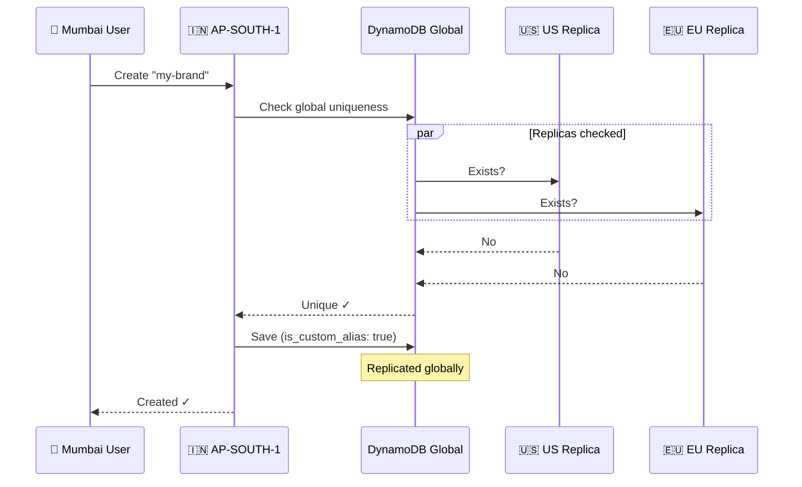

> 📖 **Full Documentation**: [docs/CUSTOM_ALIAS_HANDLING.md](docs/CUSTOM_ALIAS_HANDLING.md)

---

## 💾 Caching Strategy

### Write-Through Cache Pattern

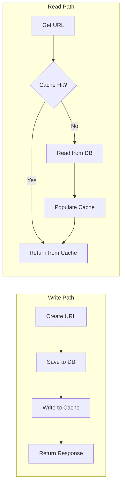

### Cache Configuration

| Setting | Value | Description |
|---------|-------|-------------|
| TTL | 24 hours | Cache entry lifetime |
| Type | Memory/Redis | Backend storage |
| Pattern | Write-through | Consistent reads |

---

## 🔒 Security

### Authentication Flow

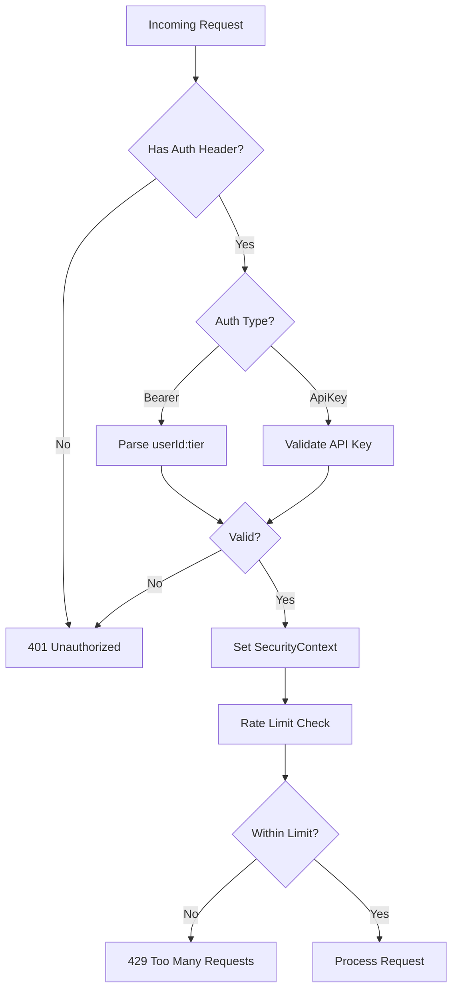

### API Key Format

```
Format: urlsh_sk_{random_base62_32_chars}
Example: urlsh_sk_7Kj9mN2pQ4rS6tU8vW0xY1zA3bC5dE
```

---

## ⏱️ Rate Limiting

### Tier-Based Limits

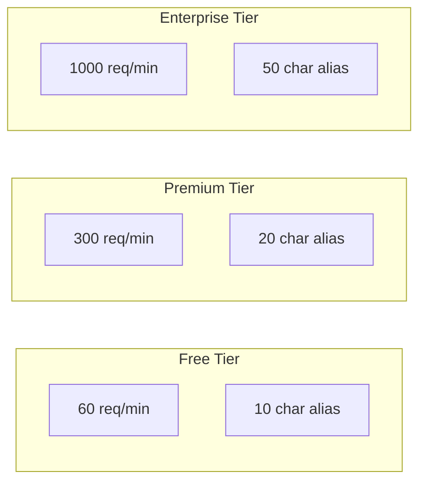

| Tier | Requests/Minute | Custom Alias Length |
|------|-----------------|---------------------|
| **Free** | 60 | 10 characters |
| **Premium** | 300 | 20 characters |
| **Enterprise** | 1000 | 50 characters |

---

## 📊 Monitoring & Observability

### Metrics Flow

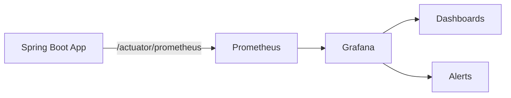

### Key Metrics

```prometheus
# HTTP Request metrics
http_server_requests_seconds_count{method="POST",uri="/api/v1/urls"}
http_server_requests_seconds_sum{method="POST",uri="/api/v1/urls"}

# Custom business metrics
url_shortener_urls_created_total
url_shortener_redirects_total
url_shortener_cache_hit_ratio
```

### Grafana Setup

```bash
# Start monitoring stack
docker-compose --profile monitoring up -d

# Access Grafana
open http://localhost:3000
# Username: admin, Password: admin
```

---

## 🗄️ Database Design

### Entity Relationship

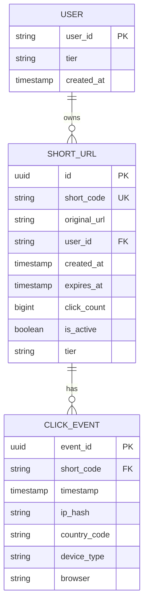

### Cleanup Policies

| Data Type | Soft Delete | Hard Delete | Archive |
|-----------|-------------|-------------|---------|
| Active URLs | - | - | - |
| Expired URLs | 30 days | 90 days | - |
| Analytics | - | 2 years | S3 Glacier |

---

## 📈 Scaling Tiers

### Evolution Path

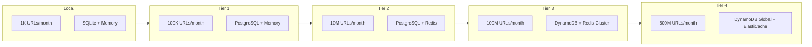

### Tier 4: Global Architecture

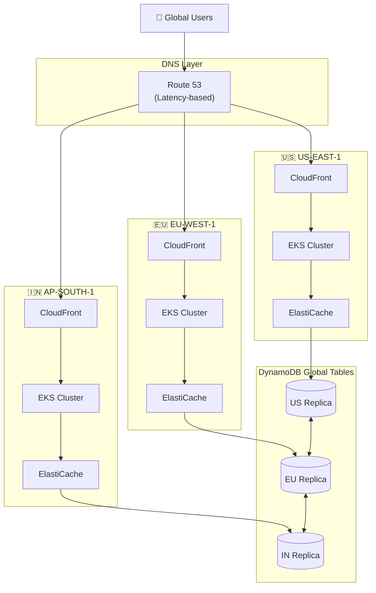

---

## 🐳 Docker Deployment

### Development

```bash
# Start application only
docker-compose up -d

# Start with Redis cache
docker-compose --profile redis up -d

# Start with monitoring
docker-compose --profile monitoring up -d

# View logs
docker-compose logs -f url-shortener
```

### Production Build

```bash
# Build production image
docker build -f docker/Dockerfile -t url-shortener:latest .

# Run with production settings
docker run -d \
  --name url-shortener \
  -p 8080:8080 \
  -e SPRING_PROFILES_ACTIVE=production \
  url-shortener:latest
```

---

## 🧪 Testing

```bash
# All tests
./mvnw test

# With coverage report
./mvnw test jacoco:report

# Integration tests
./mvnw verify -P integration-test
```

---

## 🔐 GDPR Compliance

### Data Subject Rights

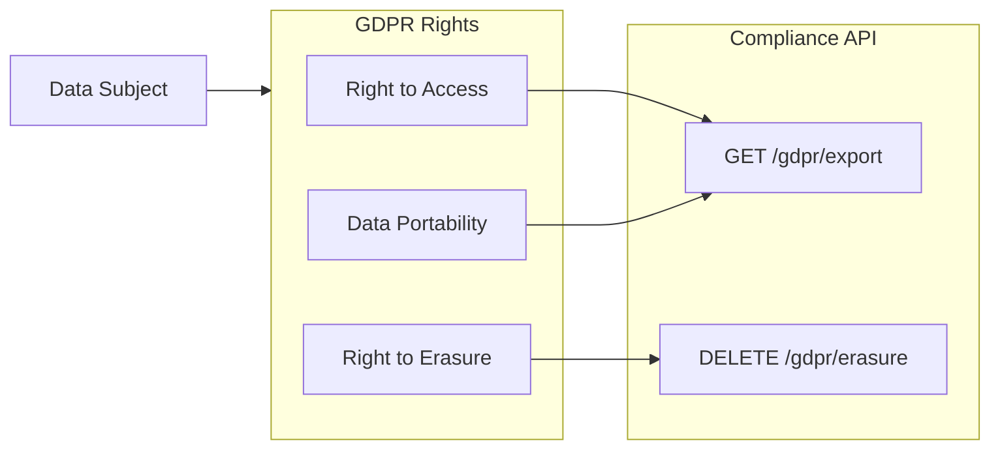

| Right | Endpoint | Description |
|-------|----------|-------------|
| Access | `GET /api/v1/compliance/gdpr/export` | Export all user data |
| Erasure | `DELETE /api/v1/compliance/gdpr/erasure` | Delete all user data |
| Portability | `GET /api/v1/compliance/gdpr/export?format=csv` | Export in portable format |

---

## 📖 Documentation

Detailed documentation is available in the `docs/` directory:

| Document | Description |
|----------|-------------|
| [GLOBAL_RANGE_ALLOCATION.md](docs/GLOBAL_RANGE_ALLOCATION.md) | How distributed ID generation works across regions |
| [CUSTOM_ALIAS_HANDLING.md](docs/CUSTOM_ALIAS_HANDLING.md) | Custom alias validation and collision prevention |
| [SCALING_GLOBAL_VALIDATION.md](docs/SCALING_GLOBAL_VALIDATION.md) | Scaling strategies for global uniqueness checks |

### Architecture Decisions

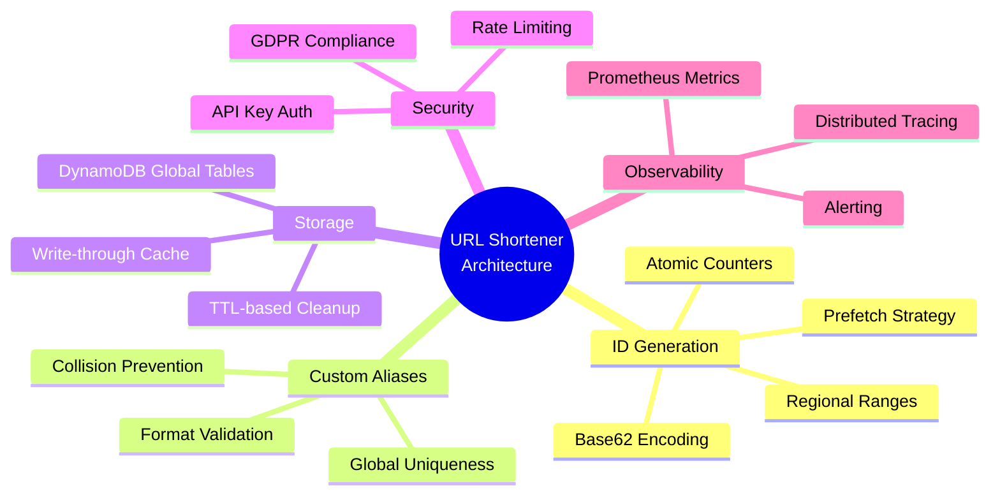

---

## 🤝 Contributing

1. Fork the repository
2. Create a feature branch (`git checkout -b feature/amazing-feature`)
3. Commit changes (`git commit -m 'Add amazing feature'`)
4. Push to branch (`git push origin feature/amazing-feature`)
5. Open a Pull Request

---

## 📄 License

This project is licensed under the MIT License - see the [LICENSE](LICENSE) file for details.

---

<p align="center">
  Built with ❤️ using Java and Spring Boot
</p>
