# Custom Alias Handling in Global Multi-Region Deployment

## Overview

This document explains how custom aliases (user-defined slugs) are handled in a globally distributed URL shortener, where auto-generated codes use region-based range allocation.

## The Challenge

When a user requests a custom alias like `my-brand` or `sale2024`, it creates a potential conflict scenario with the auto-generated codes from the distributed counter system.

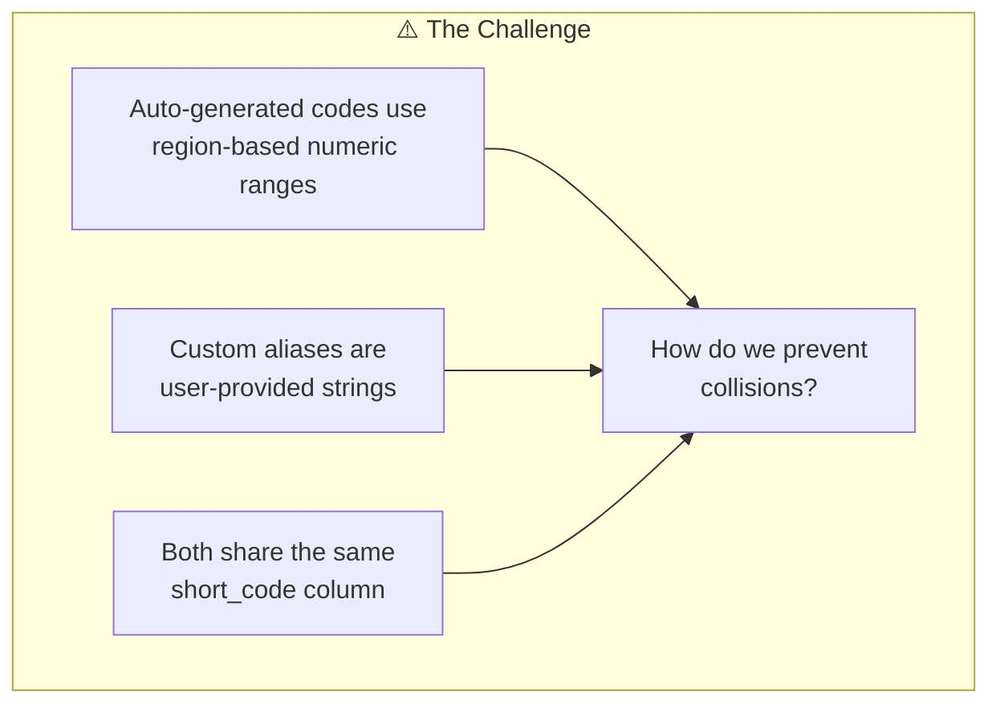
```mermaid
flowchart TD
    subgraph Challenge["⚠️ The Challenge"]
        Q1["Auto-generated codes use<br/>region-based numeric ranges"]
        Q2["Custom aliases are<br/>user-provided strings"]
        Q3["Both share the same<br/>short_code column"]
        Q4["How do we prevent<br/>collisions?"]
    end

    Q1 --> Q4
    Q2 --> Q4
    Q3 --> Q4
```

### Example Conflict Scenario

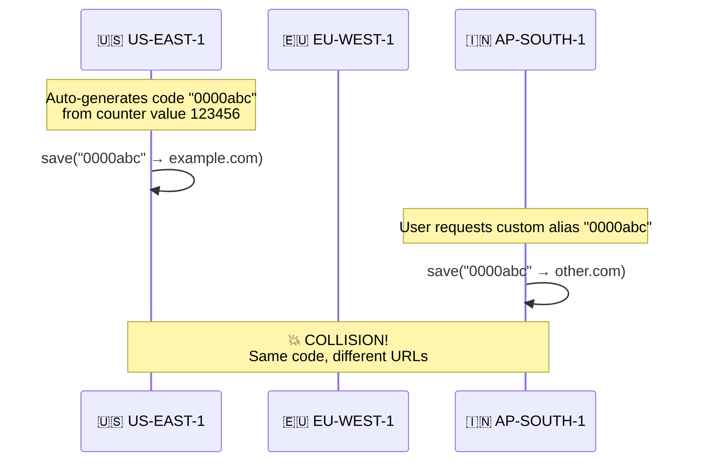
```mermaid
sequenceDiagram
    participant US as 🇺🇸 US-EAST-1
    participant EU as 🇪🇺 EU-WEST-1
    participant IN as 🇮🇳 AP-SOUTH-1

    Note over US: Auto-generates code "0000abc"<br/>from counter value 123456
    US->>US: save("0000abc" → example.com)

    Note over IN: User requests custom alias "0000abc"
    IN->>IN: save("0000abc" → other.com)

    Note over US,IN: 💥 COLLISION!<br/>Same code, different URLs
```

---

## Solution Architecture

### Two Separate Namespaces

Custom aliases and auto-generated codes are treated as **logically separate namespaces** while sharing the same storage:

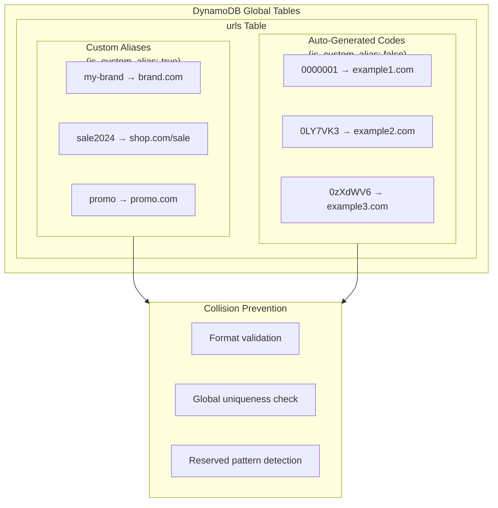
```mermaid
flowchart TB
    subgraph Database["DynamoDB Global Tables"]
        subgraph Table["urls Table"]
            subgraph AutoGen["Auto-Generated Codes<br/>(is_custom_alias: false)"]
                A1["0000001 → example1.com"]
                A2["0LY7VK3 → example2.com"]
                A3["0zXdWV6 → example3.com"]
            end

            subgraph Custom["Custom Aliases<br/>(is_custom_alias: true)"]
                C1["my-brand → brand.com"]
                C2["sale2024 → shop.com/sale"]
                C3["promo → promo.com"]
            end
        end
    end

    subgraph Validation["Collision Prevention"]
        V1["Format validation"]
        V2["Global uniqueness check"]
        V3["Reserved pattern detection"]
    end

    Custom --> Validation
    AutoGen --> Validation
```

### Key Differentiators

| Aspect | Auto-Generated | Custom Alias |
|--------|----------------|--------------|
| **Source** | Regional counter → Base62 | User input |
| **Format** | Exactly 7 Base62 chars | 4-50 alphanumeric + hyphens |
| **Uniqueness** | Guaranteed by range allocation | Global DB check required |
| **Region Binding** | Created in specific region | Region-agnostic |
| **Storage Flag** | `is_custom_alias: false` | `is_custom_alias: true` |

---

## Collision Prevention Strategies

### Strategy 1: Format Differentiation (Primary)

Auto-generated codes and custom aliases have **mutually exclusive formats**:

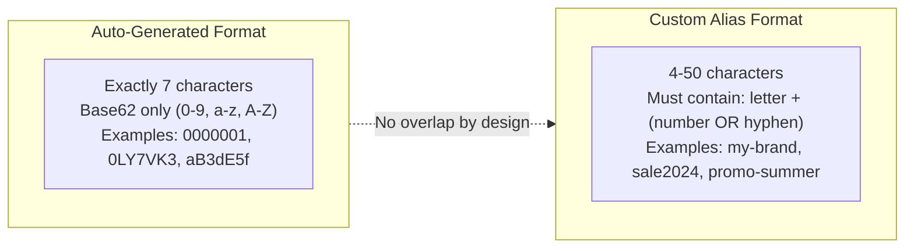
```mermaid
flowchart LR
    subgraph AutoFormat["Auto-Generated Format"]
        AF["Exactly 7 characters<br/>Base62 only (0-9, a-z, A-Z)<br/>Examples: 0000001, 0LY7VK3, aB3dE5f"]
    end

    subgraph CustomFormat["Custom Alias Format"]
        CF["4-50 characters<br/>Must contain: letter + (number OR hyphen)<br/>Examples: my-brand, sale2024, promo-summer"]
    end

    AutoFormat -.->|"No overlap by design"| CustomFormat
```

```java
public class AliasValidator {

    // Auto-generated: exactly 7 Base62 characters
    private static final Pattern AUTO_GEN_PATTERN =
        Pattern.compile("^[0-9a-zA-Z]{7}$");

    // Custom: 4-50 chars, alphanumeric + hyphens
    // Must have at least one letter AND one non-letter
    private static final Pattern CUSTOM_ALIAS_PATTERN =
        Pattern.compile("^(?=.*[a-zA-Z])(?=.*[0-9\\-])[a-zA-Z0-9\\-]{4,50}$");

    public boolean isValidCustomAlias(String alias) {
        if (alias == null || alias.isBlank()) {
            return false;
        }

        // Must match custom pattern
        if (!CUSTOM_ALIAS_PATTERN.matcher(alias).matches()) {
            return false;
        }

        // Must NOT look like an auto-generated code
        if (looksLikeAutoGenerated(alias)) {
            return false;
        }

        return true;
    }

    private boolean looksLikeAutoGenerated(String alias) {
        if (!AUTO_GEN_PATTERN.matcher(alias).matches()) {
            return false;
        }

        // If it's exactly 7 Base62 chars, check if it decodes
        // to a value within the auto-gen range
        try {
            long value = base62Decode(alias);
            return value >= 0 && value <= MAX_AUTO_GEN_VALUE;
        } catch (Exception e) {
            return false;
        }
    }
}
```

### Strategy 2: Global Uniqueness Check (Required)

Every custom alias must be checked against **all regions** before creation:

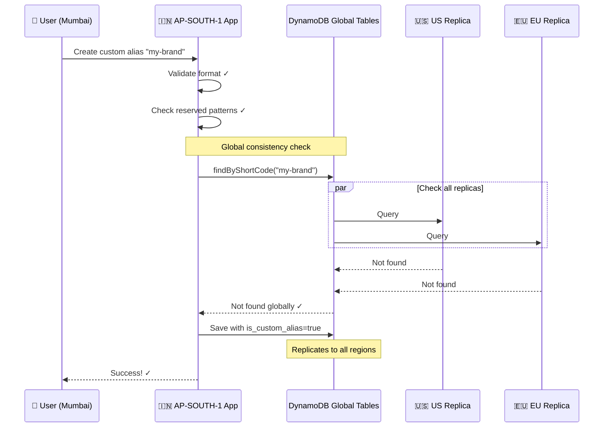
```mermaid
sequenceDiagram
    participant User as 👤 User (Mumbai)
    participant IN as 🇮🇳 AP-SOUTH-1 App
    participant DDB as DynamoDB Global Tables
    participant US_Rep as 🇺🇸 US Replica
    participant EU_Rep as 🇪🇺 EU Replica

    User->>IN: Create custom alias "my-brand"

    IN->>IN: Validate format ✓
    IN->>IN: Check reserved patterns ✓

    Note over IN,DDB: Global consistency check
    IN->>DDB: findByShortCode("my-brand")

    par Check all replicas
        DDB->>US_Rep: Query
        DDB->>EU_Rep: Query
    end

    US_Rep-->>DDB: Not found
    EU_Rep-->>DDB: Not found
    DDB-->>IN: Not found globally ✓

    IN->>DDB: Save with is_custom_alias=true
    Note over DDB: Replicates to all regions

    IN-->>User: Success! ✓
```

### Strategy 3: Reserved Pattern Detection

Certain patterns are reserved for system use:

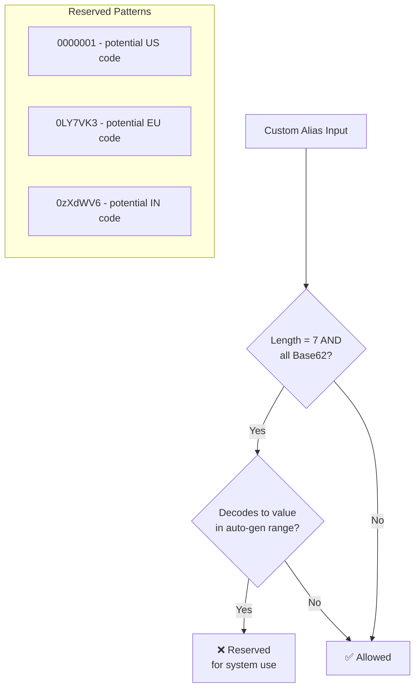
```mermaid
flowchart TD
    Input["Custom Alias Input"] --> Check1{"Length = 7 AND<br/>all Base62?"}

    Check1 -->|Yes| Check2{"Decodes to value<br/>in auto-gen range?"}
    Check1 -->|No| Valid["✅ Allowed"]

    Check2 -->|Yes| Reserved["❌ Reserved<br/>for system use"]
    Check2 -->|No| Valid

    subgraph Reserved Patterns
        R1["0000001 - potential US code"]
        R2["0LY7VK3 - potential EU code"]
        R3["0zXdWV6 - potential IN code"]
    end
```

---

## Request Flow Diagrams

### Custom Alias Creation (Happy Path)

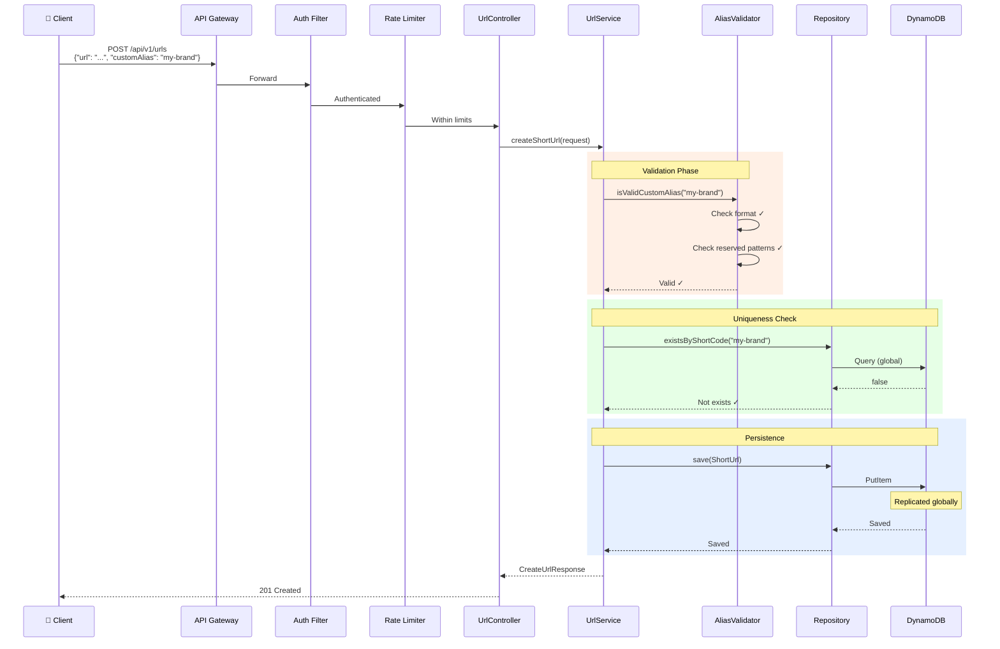
```mermaid
sequenceDiagram
    participant C as 👤 Client
    participant API as API Gateway
    participant Auth as Auth Filter
    participant Rate as Rate Limiter
    participant Ctrl as UrlController
    participant Svc as UrlService
    participant Val as AliasValidator
    participant Repo as Repository
    participant DDB as DynamoDB

    C->>API: POST /api/v1/urls<br/>{"url": "...", "customAlias": "my-brand"}
    API->>Auth: Forward
    Auth->>Rate: Authenticated
    Rate->>Ctrl: Within limits

    Ctrl->>Svc: createShortUrl(request)

    rect rgb(255, 240, 230)
        Note over Svc,Val: Validation Phase
        Svc->>Val: isValidCustomAlias("my-brand")
        Val->>Val: Check format ✓
        Val->>Val: Check reserved patterns ✓
        Val-->>Svc: Valid ✓
    end

    rect rgb(230, 255, 230)
        Note over Svc,DDB: Uniqueness Check
        Svc->>Repo: existsByShortCode("my-brand")
        Repo->>DDB: Query (global)
        DDB-->>Repo: false
        Repo-->>Svc: Not exists ✓
    end

    rect rgb(230, 240, 255)
        Note over Svc,DDB: Persistence
        Svc->>Repo: save(ShortUrl)
        Repo->>DDB: PutItem
        Note over DDB: Replicated globally
        DDB-->>Repo: Saved
        Repo-->>Svc: Saved
    end

    Svc-->>Ctrl: CreateUrlResponse
    Ctrl-->>C: 201 Created
```

### Custom Alias Creation (Conflict)

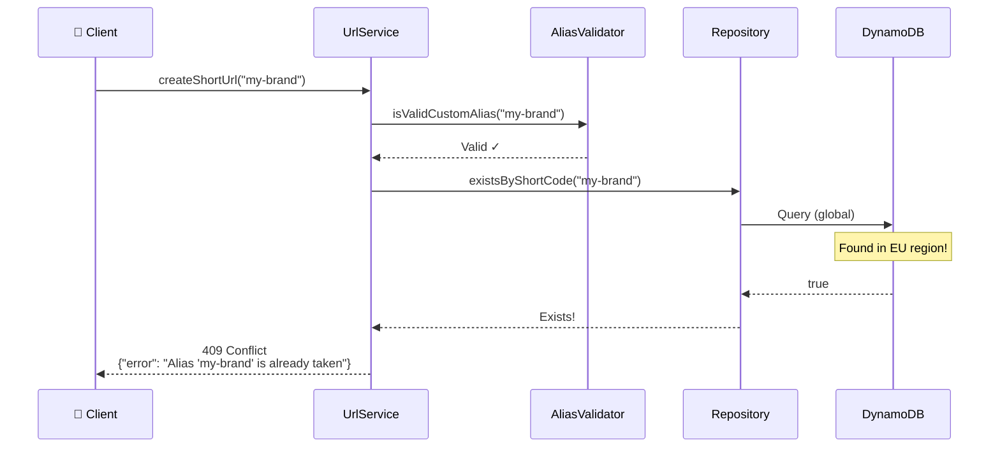
```mermaid
sequenceDiagram
    participant C as 👤 Client
    participant Svc as UrlService
    participant Val as AliasValidator
    participant Repo as Repository
    participant DDB as DynamoDB

    C->>Svc: createShortUrl("my-brand")

    Svc->>Val: isValidCustomAlias("my-brand")
    Val-->>Svc: Valid ✓

    Svc->>Repo: existsByShortCode("my-brand")
    Repo->>DDB: Query (global)

    Note over DDB: Found in EU region!
    DDB-->>Repo: true
    Repo-->>Svc: Exists!

    Svc-->>C: 409 Conflict<br/>{"error": "Alias 'my-brand' is already taken"}
```

### Custom Alias Creation (Reserved Pattern)

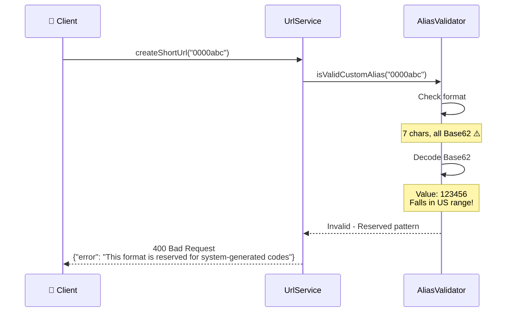
```mermaid
sequenceDiagram
    participant C as 👤 Client
    participant Svc as UrlService
    participant Val as AliasValidator

    C->>Svc: createShortUrl("0000abc")

    Svc->>Val: isValidCustomAlias("0000abc")

    Val->>Val: Check format
    Note over Val: 7 chars, all Base62 ⚠️

    Val->>Val: Decode Base62
    Note over Val: Value: 123456<br/>Falls in US range!

    Val-->>Svc: Invalid - Reserved pattern

    Svc-->>C: 400 Bad Request<br/>{"error": "This format is reserved for system-generated codes"}
```

---

## Database Schema

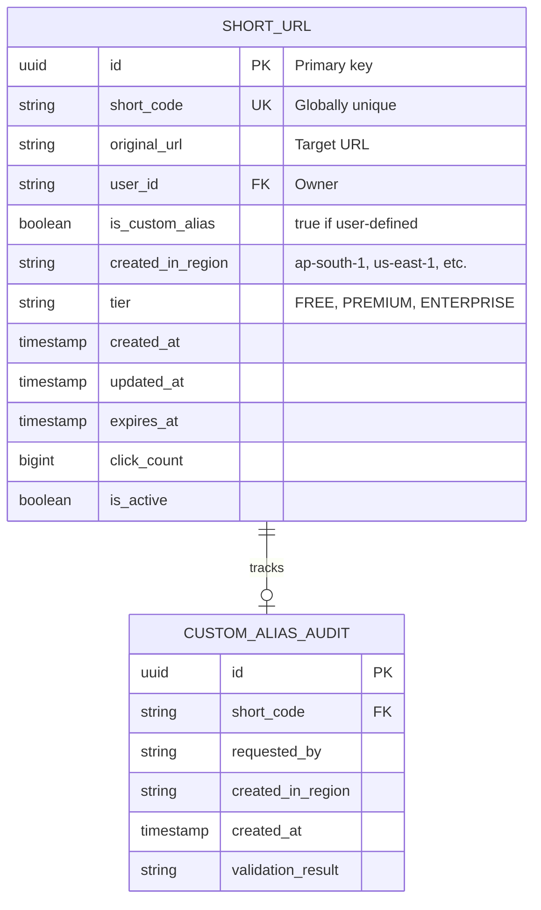
```mermaid
erDiagram
    SHORT_URL {
        uuid id PK "Primary key"
        string short_code UK "Globally unique"
        string original_url "Target URL"
        string user_id FK "Owner"
        boolean is_custom_alias "true if user-defined"
        string created_in_region "ap-south-1, us-east-1, etc."
        string tier "FREE, PREMIUM, ENTERPRISE"
        timestamp created_at
        timestamp updated_at
        timestamp expires_at
        bigint click_count
        boolean is_active
    }

    CUSTOM_ALIAS_AUDIT {
        uuid id PK
        string short_code FK
        string requested_by
        string created_in_region
        timestamp created_at
        string validation_result
    }

    SHORT_URL ||--o| CUSTOM_ALIAS_AUDIT : "tracks"
```

### DynamoDB Table Design

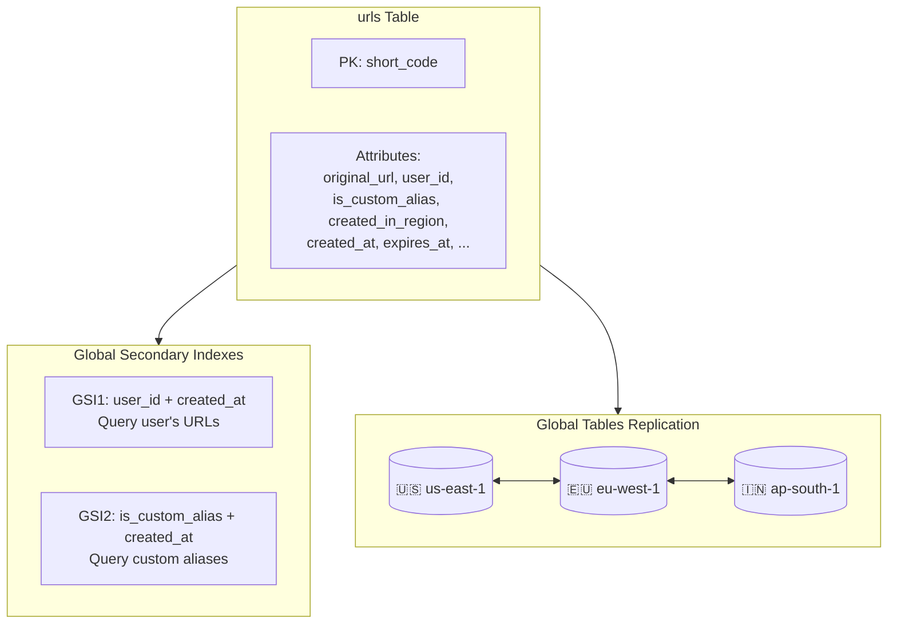
```mermaid
flowchart TB
    subgraph GSI["Global Secondary Indexes"]
        GSI1["GSI1: user_id + created_at<br/>Query user's URLs"]
        GSI2["GSI2: is_custom_alias + created_at<br/>Query custom aliases"]
    end

    subgraph Table["urls Table"]
        PK["PK: short_code"]
        Attrs["Attributes:<br/>original_url, user_id,<br/>is_custom_alias, created_in_region,<br/>created_at, expires_at, ..."]
    end

    subgraph Replication["Global Tables Replication"]
        US[("🇺🇸 us-east-1")]
        EU[("🇪🇺 eu-west-1")]
        IN[("🇮🇳 ap-south-1")]
    end

    Table --> GSI
    Table --> Replication
    US <--> EU <--> IN
```

---

## Edge Cases and Solutions

### Edge Case 1: Race Condition on Custom Alias

Two users request the same custom alias simultaneously:

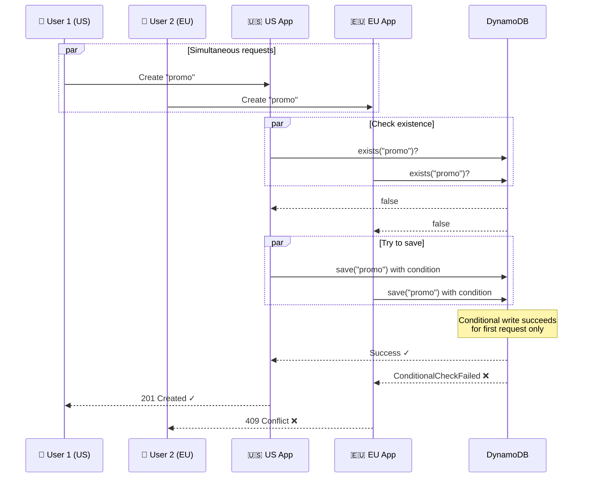
```mermaid
sequenceDiagram
    participant U1 as 👤 User 1 (US)
    participant U2 as 👤 User 2 (EU)
    participant US as 🇺🇸 US App
    participant EU as 🇪🇺 EU App
    participant DDB as DynamoDB

    par Simultaneous requests
        U1->>US: Create "promo"
        U2->>EU: Create "promo"
    end

    par Check existence
        US->>DDB: exists("promo")?
        EU->>DDB: exists("promo")?
    end

    DDB-->>US: false
    DDB-->>EU: false

    par Try to save
        US->>DDB: save("promo") with condition
        EU->>DDB: save("promo") with condition
    end

    Note over DDB: Conditional write succeeds<br/>for first request only
    DDB-->>US: Success ✓
    DDB-->>EU: ConditionalCheckFailed ❌

    US-->>U1: 201 Created ✓
    EU-->>U2: 409 Conflict ❌
```

**Solution: Conditional Writes**

```java
// DynamoDB conditional put
PutItemRequest request = PutItemRequest.builder()
    .tableName("urls")
    .item(itemMap)
    .conditionExpression("attribute_not_exists(short_code)")
    .build();

try {
    dynamoDb.putItem(request);
} catch (ConditionalCheckFailedException e) {
    throw new AliasAlreadyExistsException("Alias already taken");
}
```

### Edge Case 2: Custom Alias Matches Future Auto-Gen Code

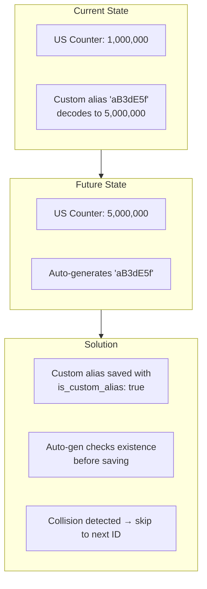
```mermaid
flowchart TD
    subgraph Now["Current State"]
        Counter["US Counter: 1,000,000"]
        Alias["Custom alias 'aB3dE5f'<br/>decodes to 5,000,000"]
    end

    subgraph Future["Future State"]
        Counter2["US Counter: 5,000,000"]
        AutoGen["Auto-generates 'aB3dE5f'"]
    end

    subgraph Solution["Solution"]
        S1["Custom alias saved with<br/>is_custom_alias: true"]
        S2["Auto-gen checks existence<br/>before saving"]
        S3["Collision detected → skip to next ID"]
    end

    Now --> Future
    Future --> Solution
```

**Solution: Auto-Gen Collision Check**

```java
public String generate() {
    while (true) {
        long value = counter.getAndIncrement();
        String code = encode(value);

        // Check if code already exists (could be custom alias)
        if (!repository.existsByShortCode(code)) {
            return code;
        }

        // Extremely rare: code exists, try next
        log.warn("Code collision detected: {}, trying next", code);
    }
}
```

### Edge Case 3: Cross-Region Redirect

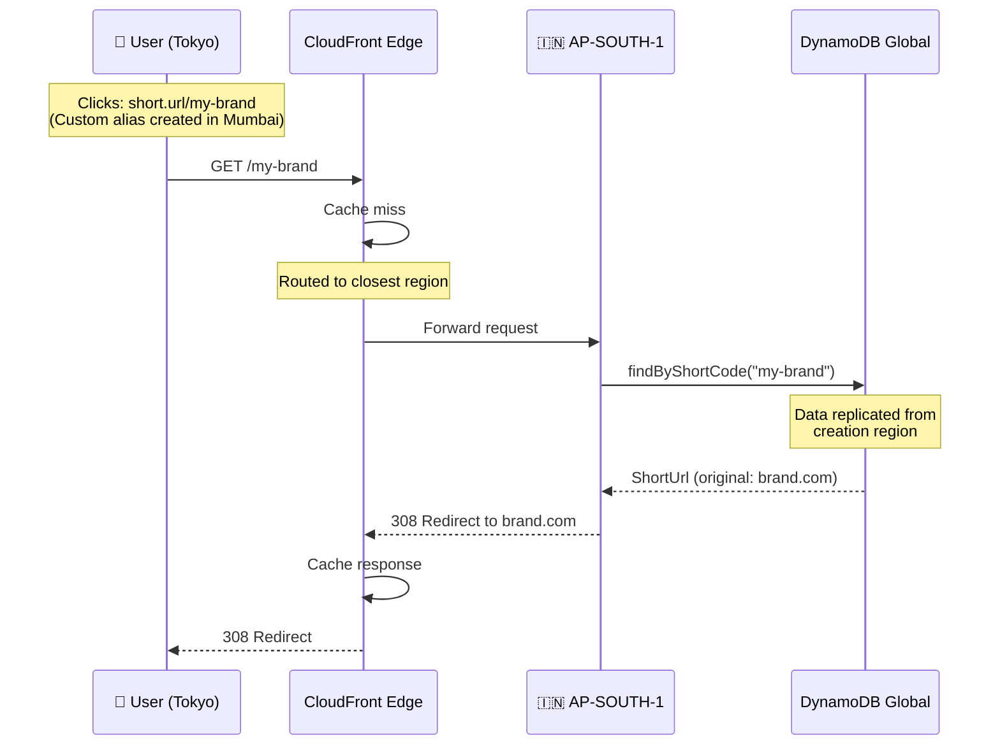
```mermaid
sequenceDiagram
    participant User as 👤 User (Tokyo)
    participant CDN as CloudFront Edge
    participant IN as 🇮🇳 AP-SOUTH-1
    participant DDB as DynamoDB Global

    Note over User: Clicks: short.url/my-brand<br/>(Custom alias created in Mumbai)

    User->>CDN: GET /my-brand
    CDN->>CDN: Cache miss

    Note over CDN: Routed to closest region
    CDN->>IN: Forward request

    IN->>DDB: findByShortCode("my-brand")
    Note over DDB: Data replicated from<br/>creation region
    DDB-->>IN: ShortUrl (original: brand.com)

    IN-->>CDN: 308 Redirect to brand.com
    CDN->>CDN: Cache response
    CDN-->>User: 308 Redirect
```

---

## Tier-Based Custom Alias Limits

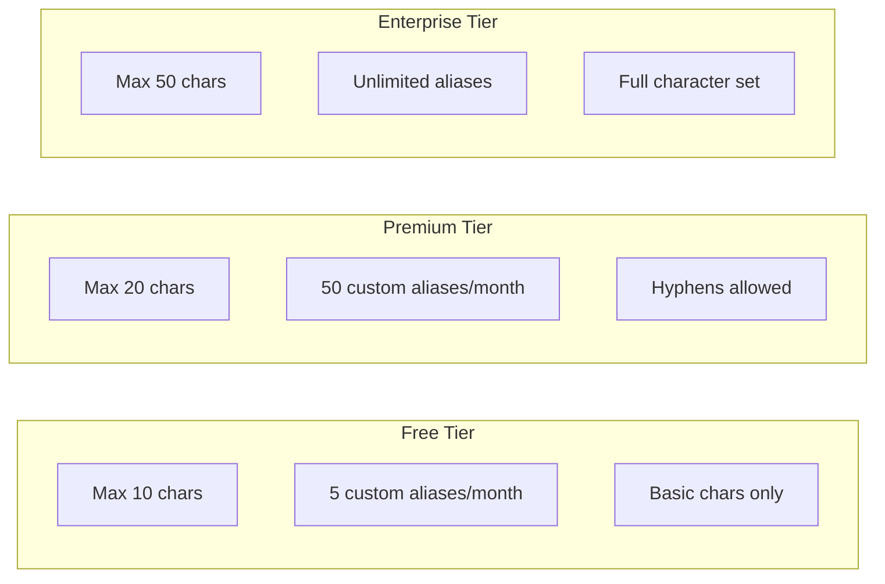
```mermaid
flowchart LR
    subgraph Free["Free Tier"]
        F1["Max 10 chars"]
        F2["5 custom aliases/month"]
        F3["Basic chars only"]
    end

    subgraph Premium["Premium Tier"]
        P1["Max 20 chars"]
        P2["50 custom aliases/month"]
        P3["Hyphens allowed"]
    end

    subgraph Enterprise["Enterprise Tier"]
        E1["Max 50 chars"]
        E2["Unlimited aliases"]
        E3["Full character set"]
    end
```

| Feature | Free | Premium | Enterprise |
|---------|------|---------|------------|
| Max alias length | 10 | 20 | 50 |
| Aliases per month | 5 | 50 | Unlimited |
| Character set | a-z, 0-9 | + hyphens | + underscores |
| Reserved words | Blocked | Blocked | Available |

---

## Monitoring and Alerting

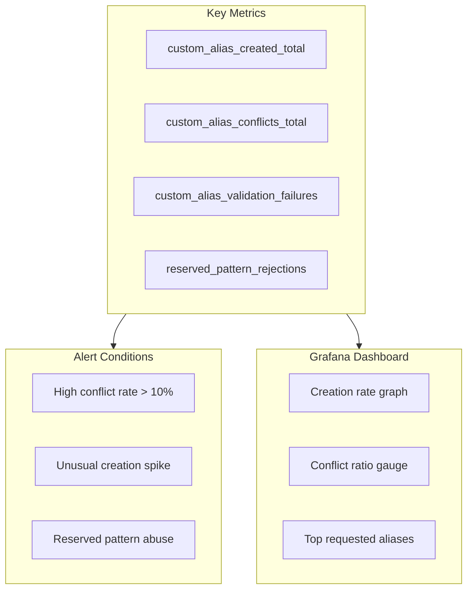
```mermaid
flowchart TB
    subgraph Metrics["Key Metrics"]
        M1["custom_alias_created_total"]
        M2["custom_alias_conflicts_total"]
        M3["custom_alias_validation_failures"]
        M4["reserved_pattern_rejections"]
    end

    subgraph Alerts["Alert Conditions"]
        A1["High conflict rate > 10%"]
        A2["Unusual creation spike"]
        A3["Reserved pattern abuse"]
    end

    subgraph Dashboard["Grafana Dashboard"]
        D1["Creation rate graph"]
        D2["Conflict ratio gauge"]
        D3["Top requested aliases"]
    end

    Metrics --> Alerts
    Metrics --> Dashboard
```

### Prometheus Metrics

```prometheus
# Custom alias metrics
url_shortener_custom_alias_created_total{region="ap-south-1"} 1234
url_shortener_custom_alias_conflicts_total{region="ap-south-1"} 45
url_shortener_custom_alias_validation_failures_total{reason="reserved_pattern"} 12
url_shortener_custom_alias_validation_failures_total{reason="invalid_format"} 89

# Latency
url_shortener_custom_alias_creation_duration_seconds_bucket{le="0.1"} 980
url_shortener_custom_alias_creation_duration_seconds_bucket{le="0.5"} 1200
```

---

## Summary

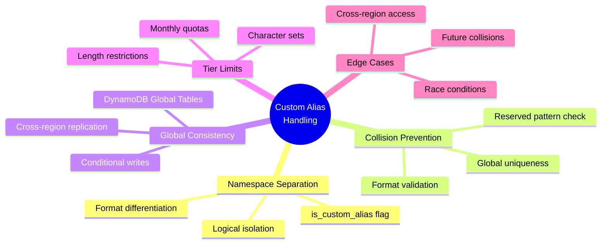
```mermaid
mindmap
  root((Custom Alias<br/>Handling))
    Namespace Separation
      is_custom_alias flag
      Format differentiation
      Logical isolation
    Collision Prevention
      Format validation
      Reserved pattern check
      Global uniqueness
    Global Consistency
      DynamoDB Global Tables
      Conditional writes
      Cross-region replication
    Tier Limits
      Length restrictions
      Monthly quotas
      Character sets
    Edge Cases
      Race conditions
      Future collisions
      Cross-region access
```

### Key Takeaways

1. **Custom aliases exist in a separate logical namespace** - differentiated by `is_custom_alias` flag
2. **Format validation prevents most collisions** - custom aliases must differ from auto-gen pattern
3. **Global uniqueness is always checked** - DynamoDB Global Tables ensure consistency
4. **Conditional writes handle race conditions** - only one concurrent request can succeed
5. **Auto-gen codes skip existing custom aliases** - collision check during generation
6. **Cross-region access works seamlessly** - data is replicated globally
