# Global Region-Based Range Allocation

## Overview

The URL shortener uses a **distributed counter with region-based range allocation** to ensure:
- **Zero cross-region coordination** for most ID generation operations
- **Guaranteed global uniqueness** across all regions
- **High throughput** (millions of IDs per second per region)
- **Predictable capacity planning** for each region

---

## Global ID Space Division

The total ID space (62^7 = 3.52 trillion unique codes) is divided equally among three primary regions:

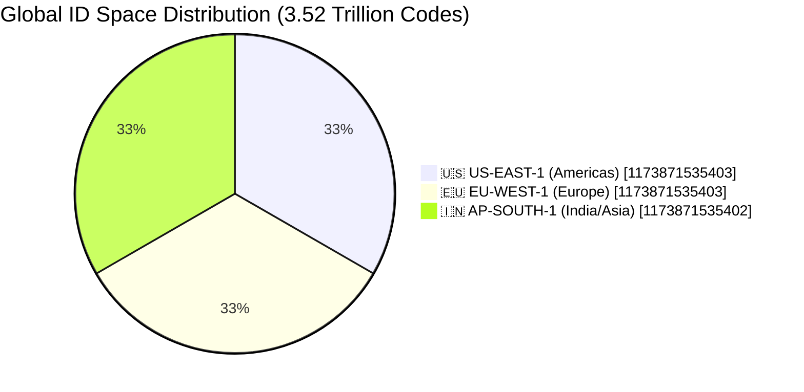

### Region Range Mapping

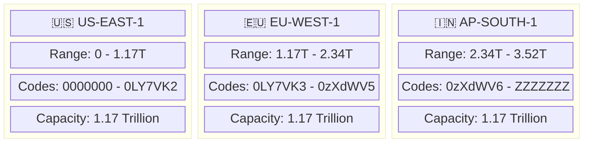

---

## How It Works

### 1. Region Assignment

When the application starts, it identifies its region from the `AWS_REGION` environment variable:

```java
@Value("${AWS_REGION:us-east-1}")
private String awsRegion;

// Maps to predefined range
RegionConfig config = RegionConfig.fromAwsRegion(awsRegion);
// US -> range 0 to 1.17T
// EU -> range 1.17T to 2.34T
// IN -> range 2.34T to 3.52T
```

### 2. Batch Allocation Architecture

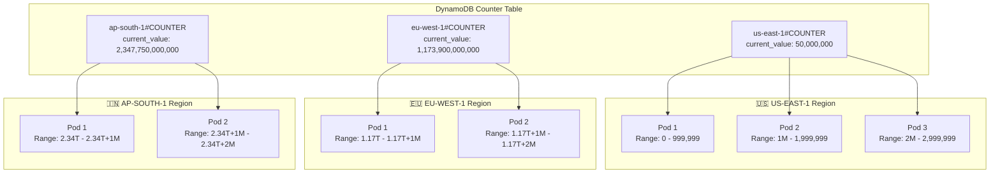

### 3. Atomic Increment

The allocation uses DynamoDB's atomic update to prevent collisions:

```java
UpdateItemRequest.builder()
    .tableName("url_shortener_counters")
    .key(Map.of("pk", AttributeValue.fromS("us-east-1#COUNTER")))
    .updateExpression(
        "SET current_value = if_not_exists(current_value, :start) + :batch, " +
        "last_allocated = :timestamp"
    )
    .conditionExpression("current_value < :max")  // Stay within region bounds
    .returnValues(ReturnValue.UPDATED_OLD)        // Return old value as our range start
    .build();
```

### 4. Local ID Generation

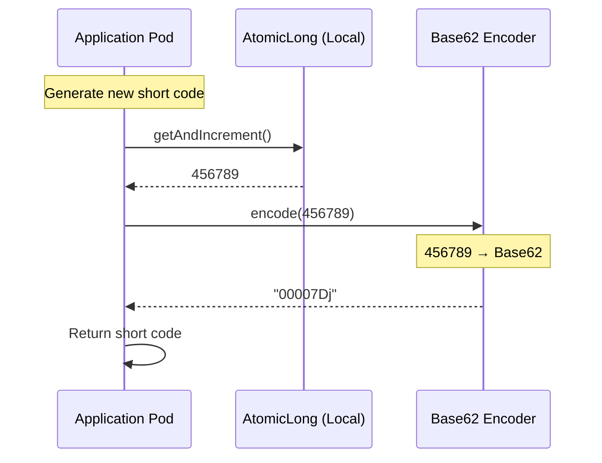

### 5. Prefetch Strategy

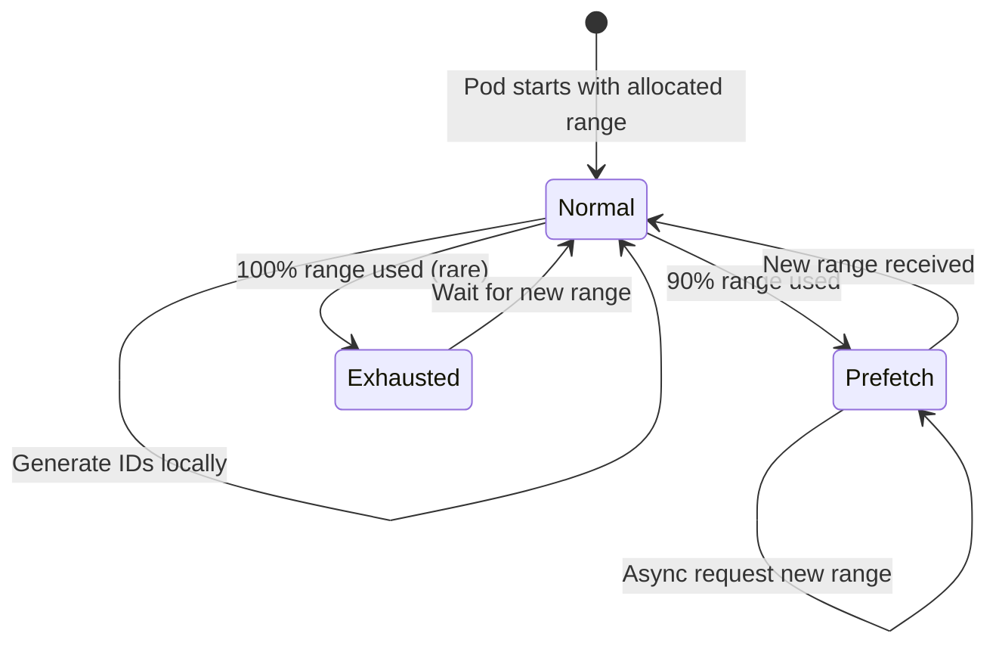

---

## Request Flow

### Create URL Request - Mumbai User

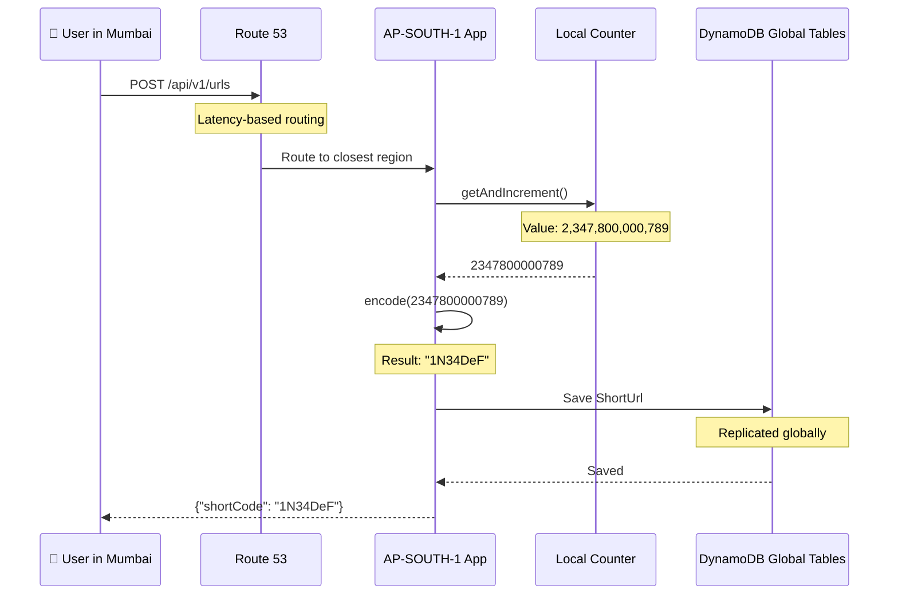

---

## Concurrent Requests - Global

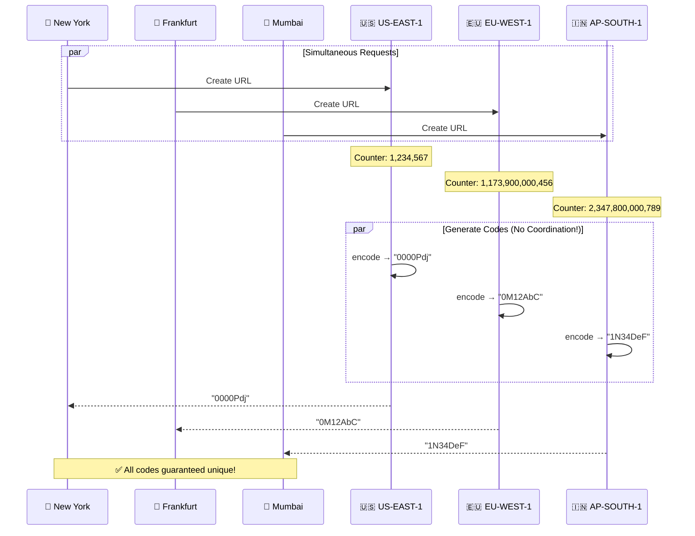

---

## Capacity Planning

### Per-Region Capacity

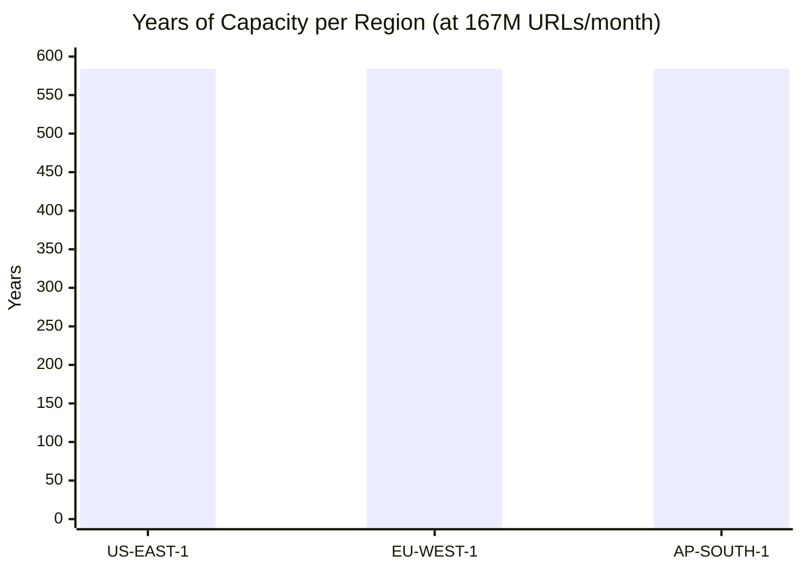

| Region | Range Size | At 167M URLs/month | Years until exhaustion |
|--------|------------|--------------------|-----------------------|
| US-EAST-1 | 1.17 trillion | 584+ years | Way beyond planning horizon |
| EU-WEST-1 | 1.17 trillion | 584+ years | Way beyond planning horizon |
| AP-SOUTH-1 | 1.17 trillion | 584+ years | Way beyond planning horizon |

### Batch Size Considerations

| Batch Size | At 1K URLs/sec | At 10K URLs/sec | Recommended For |
|------------|----------------|-----------------|-----------------|
| 10,000 | 10 seconds | 1 second | Development/Testing |
| 100,000 | 100 seconds | 10 seconds | Small deployments |
| 1,000,000 | ~17 minutes | ~100 seconds | Production (default) |
| 10,000,000 | ~2.8 hours | ~17 minutes | High-traffic production |

---

## Identifying Code Origin

Each short code can be traced back to its origin region:

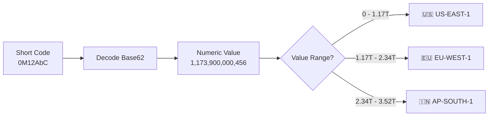

```java
// Decode and identify region
String code = "0M12AbC";
long value = idGenerator.decode(code);
// value = 1,173,900,000,456

RegionConfig region = RegionConfig.fromNumericValue(value);
// region = EU_WEST_1

// API endpoint: GET /api/v1/status/decode?code=0M12AbC
{
  "code": "0M12AbC",
  "numericValue": 1173900000456,
  "region": "eu-west-1",
  "regionCode": "EU"
}
```

---

## Monitoring

### Key Metrics

```prometheus
# Current range utilization
url_shortener_range_used{region="us-east-1"} 456789
url_shortener_range_remaining{region="us-east-1"} 543211
url_shortener_range_utilization_percent{region="us-east-1"} 45.67

# Allocation events
url_shortener_range_allocations_total{region="us-east-1"} 5
url_shortener_range_allocation_duration_seconds{region="us-east-1"} 0.023
```

### Monitoring Dashboard

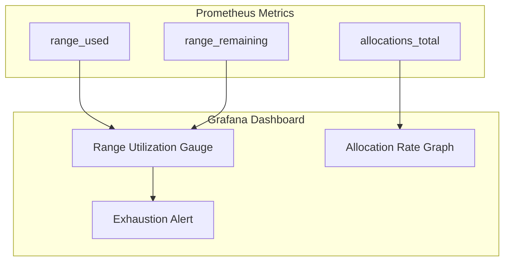

### API Endpoints

```bash
# Get current allocation status
GET /api/v1/status/allocation
{
  "region": "us-east-1",
  "rangeStart": 0,
  "rangeEnd": 999999,
  "currentValue": 456789,
  "used": 456789,
  "remaining": 543211,
  "usagePercent": 45.67
}

# Get all region configurations
GET /api/v1/status/regions
[
  {
    "awsRegion": "us-east-1",
    "shortCode": "US",
    "rangeStart": 0,
    "rangeEnd": 1173871535402,
    "capacity": 1173871535403,
    "capacityFormatted": "1.17 trillion",
    "firstCode": "0000000",
    "lastCode": "0LY7VK2"
  },
  ...
]
```

---

## Failure Scenarios

### 1. DynamoDB Unavailable

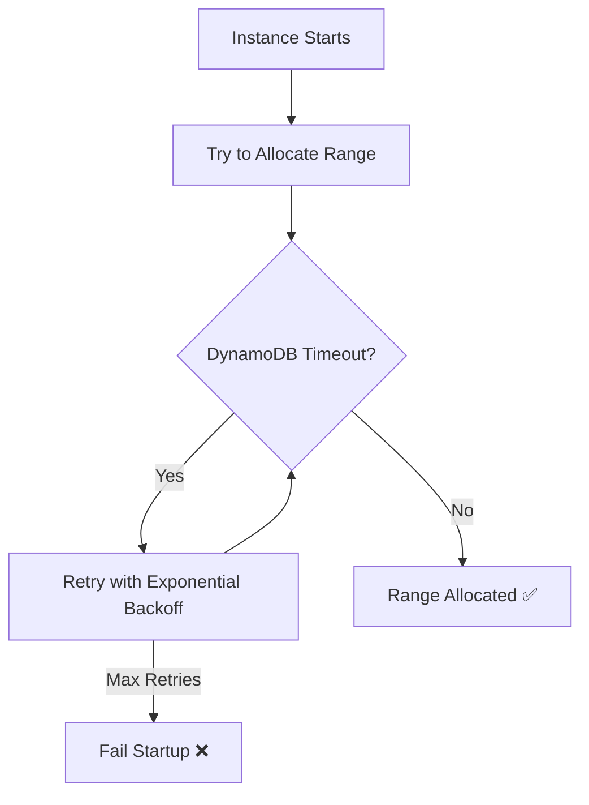

### 2. Region Exhaustion (Theoretical)

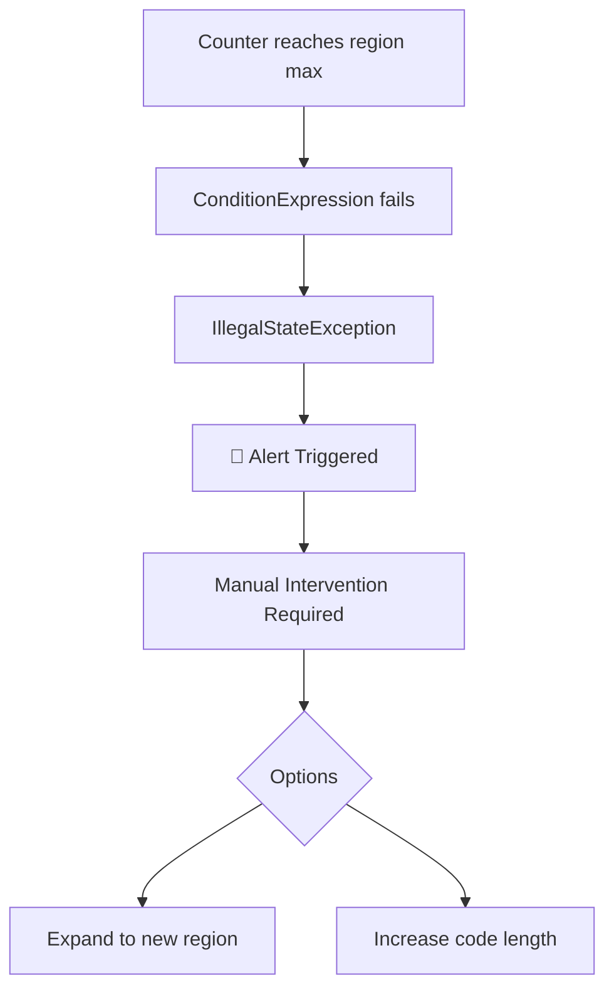

### 3. Instance Crash Mid-Range

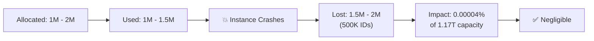

---

## DynamoDB Global Tables Architecture

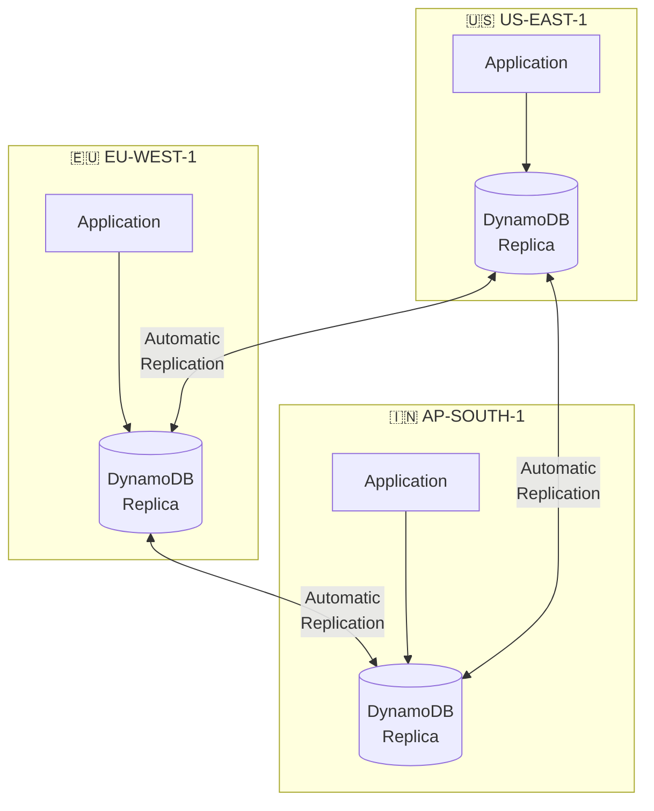

---

## Terraform Configuration

```hcl
# DynamoDB Global Table for counters
resource "aws_dynamodb_table" "counters" {
  name         = "url_shortener_counters"
  billing_mode = "PAY_PER_REQUEST"
  hash_key     = "pk"

  attribute {
    name = "pk"
    type = "S"
  }

  # Enable global tables for multi-region
  replica {
    region_name = "us-east-1"
  }

  replica {
    region_name = "eu-west-1"
  }

  replica {
    region_name = "ap-south-1"
  }

  tags = {
    Name        = "url-shortener-counters"
    Environment = "production"
  }
}

# Initialize counter values for each region
resource "aws_dynamodb_table_item" "us_counter" {
  table_name = aws_dynamodb_table.counters.name
  hash_key   = aws_dynamodb_table.counters.hash_key

  item = jsonencode({
    pk            = { S = "us-east-1#COUNTER" }
    current_value = { N = "0" }
    range_start   = { N = "0" }
    range_end     = { N = "1173871535402" }
  })
}

resource "aws_dynamodb_table_item" "eu_counter" {
  table_name = aws_dynamodb_table.counters.name
  hash_key   = aws_dynamodb_table.counters.hash_key

  item = jsonencode({
    pk            = { S = "eu-west-1#COUNTER" }
    current_value = { N = "1173871535403" }
    range_start   = { N = "1173871535403" }
    range_end     = { N = "2347743070805" }
  })
}

resource "aws_dynamodb_table_item" "ap_counter" {
  table_name = aws_dynamodb_table.counters.name
  hash_key   = aws_dynamodb_table.counters.hash_key

  item = jsonencode({
    pk            = { S = "ap-south-1#COUNTER" }
    current_value = { N = "2347743070806" }
    range_start   = { N = "2347743070806" }
    range_end     = { N = "3521614606207" }
  })
}
```

---

## Summary

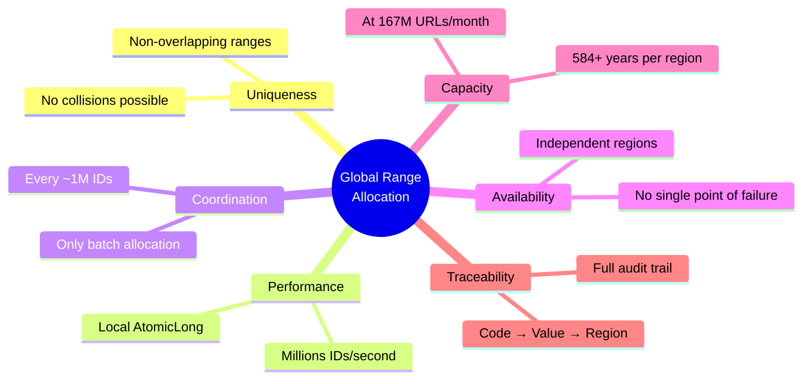

| Aspect | Implementation |
|--------|----------------|
| **Uniqueness** | Guaranteed by non-overlapping region ranges |
| **Coordination** | Only needed for batch allocation (every ~1M IDs) |
| **Throughput** | Millions of IDs/second (local AtomicLong) |
| **Availability** | Each region operates independently |
| **Capacity** | 584+ years per region at 167M URLs/month |
| **Traceability** | Code → Numeric value → Region mapping |
