# Scaling Global Validation Queries

## The Challenge

Every custom alias creation requires a **global uniqueness check** across all regions. At scale (500M URLs/month), this becomes a bottleneck:

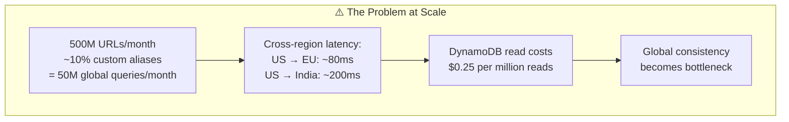

---

## Solution Strategies

### Strategy 1: Bloom Filters (Recommended)

A **Bloom filter** is a probabilistic data structure that can quickly tell you:
- **"Definitely NOT exists"** → Skip DB query entirely
- **"Might exist"** → Query DB to confirm

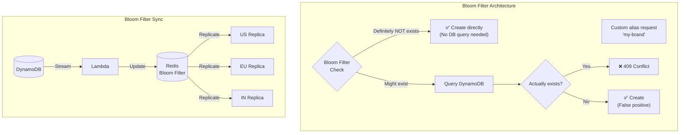

#### Implementation

```java
@Service
public class BloomFilterAliasChecker {

    private final RedissonClient redisson;
    private final ShortUrlRepository repository;

    // Bloom filter with 0.1% false positive rate
    // Size: ~1.2GB for 1 billion entries
    private static final String BLOOM_FILTER_KEY = "url:aliases:bloom";

    public boolean mightExist(String alias) {
        RBloomFilter<String> bloomFilter = redisson.getBloomFilter(BLOOM_FILTER_KEY);
        return bloomFilter.contains(alias);
    }

    public boolean checkAndCreate(String alias, String url) {
        // Step 1: Fast Bloom filter check (local, <1ms)
        if (!mightExist(alias)) {
            // Definitely doesn't exist - create without DB query
            return createAlias(alias, url);
        }

        // Step 2: Bloom filter says "might exist" - verify with DB
        if (repository.existsByShortCode(alias)) {
            throw new AliasAlreadyExistsException(alias);
        }

        // False positive - create the alias
        return createAlias(alias, url);
    }

    private boolean createAlias(String alias, String url) {
        ShortUrl saved = repository.save(/* ... */);

        // Add to Bloom filter for future checks
        RBloomFilter<String> bloomFilter = redisson.getBloomFilter(BLOOM_FILTER_KEY);
        bloomFilter.add(alias);

        return true;
    }
}
```

#### Bloom Filter Sizing

| Entries | False Positive Rate | Memory Required |
|---------|---------------------|-----------------|
| 100M | 0.1% | ~120MB |
| 500M | 0.1% | ~600MB |
| 1B | 0.1% | ~1.2GB |
| 1B | 1% | ~800MB |

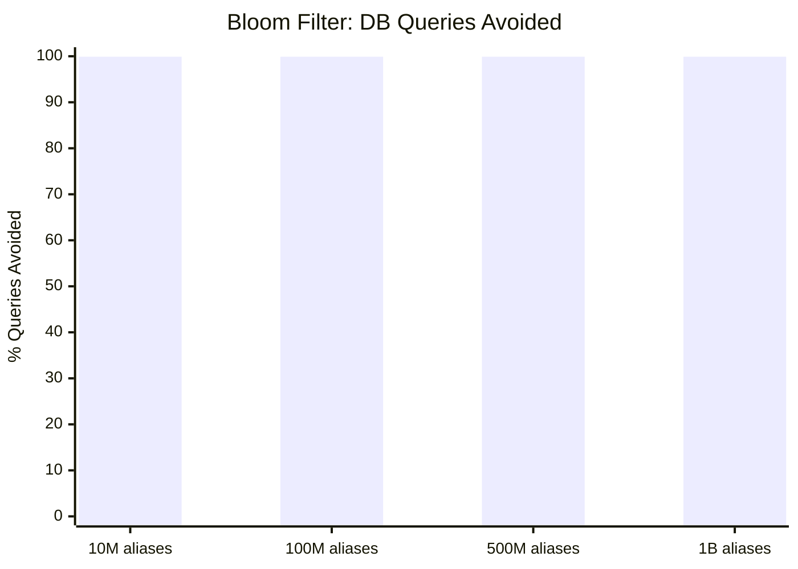

---

### Strategy 2: DynamoDB Accelerator (DAX)

**DAX** is an in-memory cache for DynamoDB that provides microsecond latency:

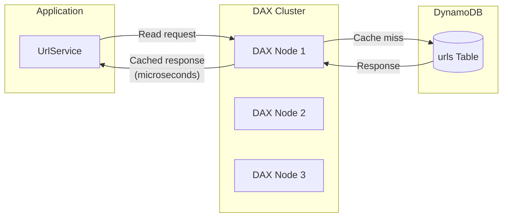

#### Configuration

```java
@Configuration
public class DaxConfig {

    @Bean
    public DynamoDbClient dynamoDbClient() {
        // Use DAX endpoint instead of direct DynamoDB
        return DynamoDbClient.builder()
            .endpointOverride(URI.create("dax://my-dax-cluster.region.amazonaws.com"))
            .build();
    }
}
```

#### DAX vs Direct DynamoDB

| Metric | Direct DynamoDB | With DAX |
|--------|-----------------|----------|
| Read Latency | 5-10ms | 0.2-0.5ms |
| Cross-region | 80-200ms | 0.5-1ms (cached) |
| Cost (reads) | $0.25/million | $0.02/million |
| Cache hit ratio | N/A | 90-99% |

---

### Strategy 3: Regional Prefix Strategy

Add an **implicit region prefix** to custom aliases to eliminate cross-region queries:

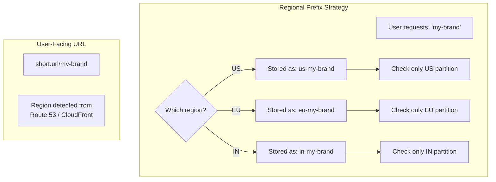

#### Implementation

```java
@Service
public class RegionalAliasService {

    @Value("${AWS_REGION}")
    private String region;

    public String createAlias(String alias, String url) {
        // Add region prefix internally
        String prefixedAlias = region + "-" + alias;

        // Only check local region's partition
        if (repository.existsByShortCodeAndRegion(prefixedAlias, region)) {
            throw new AliasAlreadyExistsException(alias);
        }

        // Save with prefix
        repository.save(ShortUrl.builder()
            .shortCode(prefixedAlias)
            .displayCode(alias)  // User sees this
            .region(region)
            .build());

        return alias;
    }

    public String resolve(String alias, String requestRegion) {
        // Try current region first
        String prefixedAlias = requestRegion + "-" + alias;
        Optional<ShortUrl> url = repository.findByShortCode(prefixedAlias);

        if (url.isPresent()) {
            return url.get().getOriginalUrl();
        }

        // Fallback: check other regions (rare)
        return checkOtherRegions(alias);
    }
}
```

#### Trade-offs

| Aspect | Pros | Cons |
|--------|------|------|
| Query Speed | Local only, <5ms | N/A |
| Uniqueness | Regional, not global | Same alias in different regions |
| Complexity | Simple | Redirect routing needed |

---

### Strategy 4: Hierarchical Caching

Multi-level cache to minimize cross-region queries:

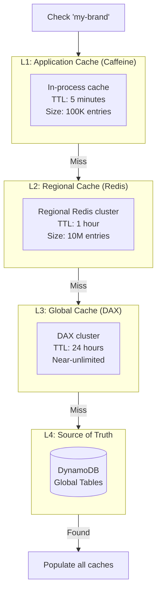

#### Implementation

```java
@Service
public class HierarchicalAliasCache {

    private final Cache<String, Boolean> l1Cache;  // Caffeine
    private final RedisTemplate<String, Boolean> l2Cache;  // Redis
    private final DynamoDbClient l3Client;  // DAX

    public boolean exists(String alias) {
        // L1: Check in-process cache (nanoseconds)
        Boolean l1Result = l1Cache.getIfPresent(alias);
        if (l1Result != null) {
            metrics.increment("cache.l1.hit");
            return l1Result;
        }

        // L2: Check regional Redis (sub-millisecond)
        Boolean l2Result = l2Cache.opsForValue().get("alias:" + alias);
        if (l2Result != null) {
            metrics.increment("cache.l2.hit");
            l1Cache.put(alias, l2Result);
            return l2Result;
        }

        // L3: Check DAX (milliseconds)
        boolean exists = checkDax(alias);

        // Populate caches
        l1Cache.put(alias, exists);
        l2Cache.opsForValue().set("alias:" + alias, exists, Duration.ofHours(1));

        return exists;
    }
}
```

#### Cache Hit Rates at Scale

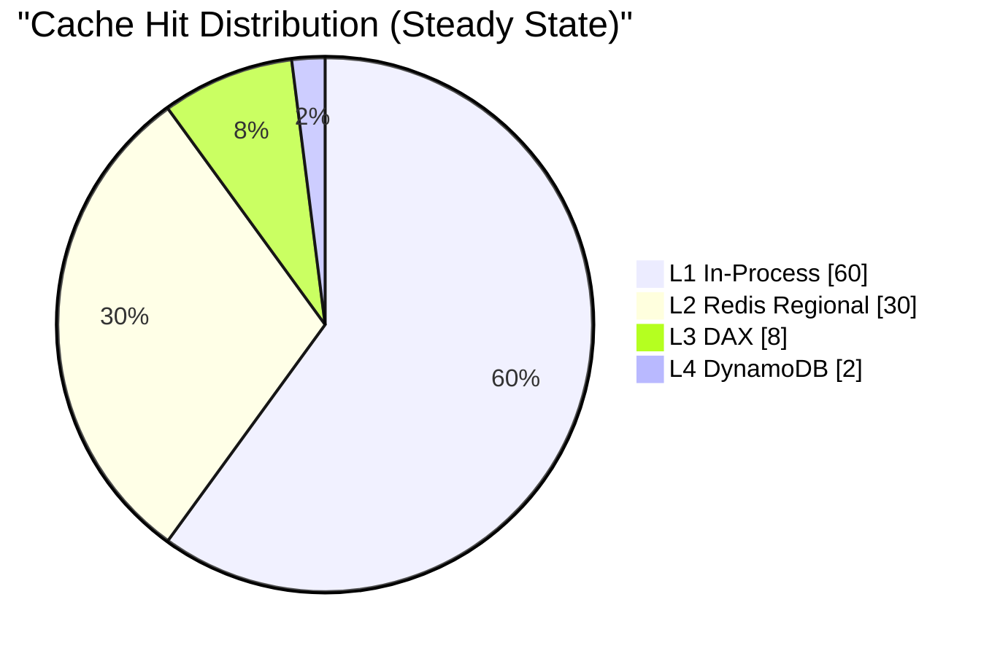

---

### Strategy 5: Async Validation with Reservation

For extremely high throughput, use **optimistic creation** with async validation:

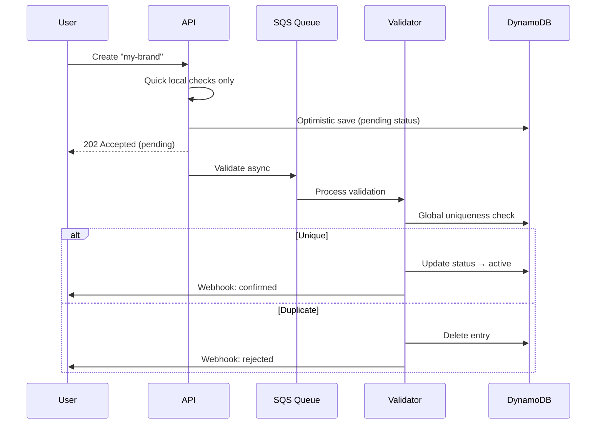

#### Implementation

```java
@Service
public class AsyncAliasValidator {

    private final SqsTemplate sqsTemplate;

    public CreateUrlResponse createAliasAsync(CreateUrlRequest request) {
        String alias = request.customAlias();

        // Quick local validation only
        validateFormat(alias);

        // Optimistic create with PENDING status
        ShortUrl pending = repository.save(ShortUrl.builder()
            .shortCode(alias)
            .status(UrlStatus.PENDING)
            .build());

        // Queue for async validation
        sqsTemplate.send("alias-validation-queue",
            new ValidationMessage(alias, pending.getId()));

        return new CreateUrlResponse(
            pending.getId(),
            alias,
            UrlStatus.PENDING,
            "Alias is being validated. You will receive a webhook notification."
        );
    }

    @SqsListener("alias-validation-queue")
    public void validateAlias(ValidationMessage message) {
        // Full global validation
        boolean isUnique = performGlobalCheck(message.alias());

        if (isUnique) {
            repository.updateStatus(message.id(), UrlStatus.ACTIVE);
            webhookService.notify(message.userId(), "alias_confirmed", message.alias());
        } else {
            repository.delete(message.id());
            webhookService.notify(message.userId(), "alias_rejected", message.alias());
        }
    }
}
```

---

### Strategy 6: Consistent Hashing for Alias Ownership

Assign alias "ownership" to specific regions based on hash:

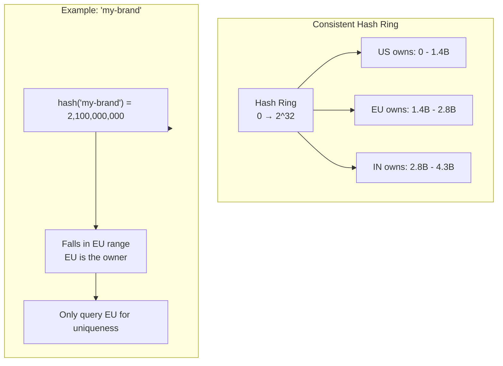

#### Implementation

```java
@Service
public class ConsistentHashAliasChecker {

    private final ConsistentHash<String> hashRing;

    @PostConstruct
    public void init() {
        // Build hash ring with regions
        hashRing = new ConsistentHash<>(
            Hashing.murmur3_128(),
            100,  // Virtual nodes per region
            List.of("us-east-1", "eu-west-1", "ap-south-1")
        );
    }

    public String getOwnerRegion(String alias) {
        return hashRing.get(alias);
    }

    public boolean checkUniqueness(String alias) {
        String ownerRegion = getOwnerRegion(alias);

        if (ownerRegion.equals(currentRegion)) {
            // We own this alias - check locally
            return !repository.existsByShortCode(alias);
        } else {
            // Another region owns it - make targeted call
            return aliasClient.checkRemote(ownerRegion, alias);
        }
    }
}
```

---

## Comparison Matrix

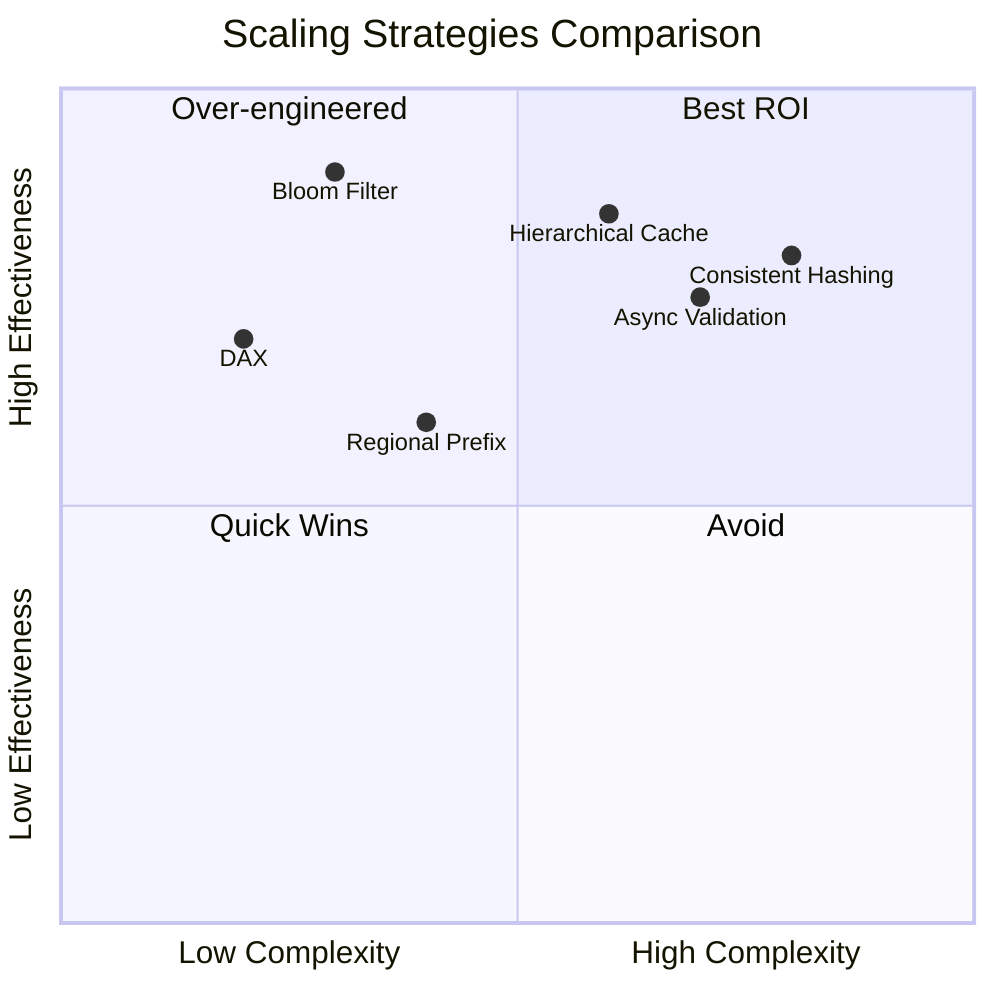

| Strategy | Latency Reduction | Implementation Effort | Best For |
|----------|-------------------|----------------------|----------|
| **Bloom Filter** | 99%+ queries avoided | Medium | High read volume |
| **DAX** | 10-50x faster reads | Low | AWS-native apps |
| **Regional Prefix** | 100% local queries | Low | Regional uniqueness OK |
| **Hierarchical Cache** | 98%+ cache hits | Medium | Mixed workloads |
| **Async Validation** | Non-blocking | High | Eventual consistency OK |
| **Consistent Hashing** | Single region query | High | Predictable routing |

---

## Recommended Architecture

For a 500M URLs/month system with ~10% custom aliases:

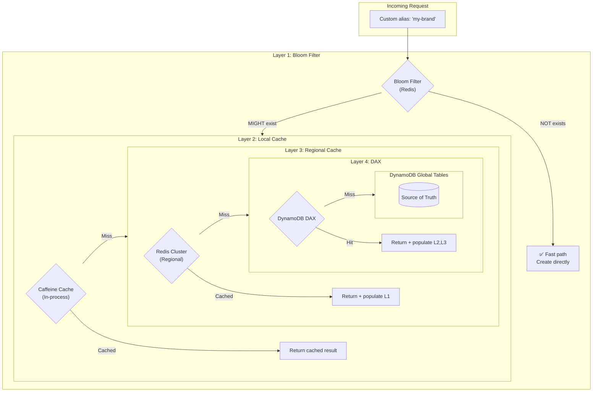

### Expected Performance

| Metric | Without Optimization | With Full Stack |
|--------|---------------------|-----------------|
| Avg Latency | 80-200ms | 0.5-2ms |
| P99 Latency | 500ms | 10ms |
| DB Queries | 50M/month | 500K/month (99% reduction) |
| Cost | $12,500/month | $125/month |

---

## Implementation Priority

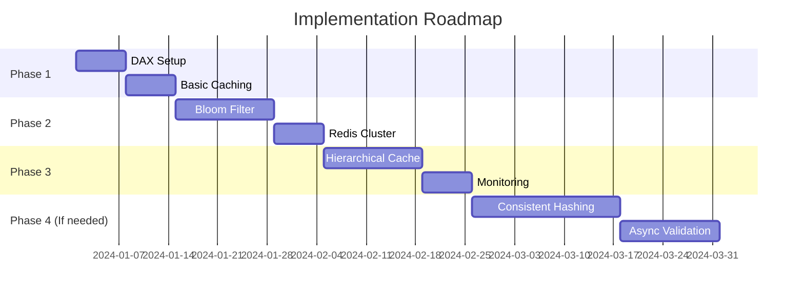

1. **Phase 1 (Week 1-2)**: DAX + Basic caching - 80% improvement
2. **Phase 2 (Week 3-5)**: Bloom Filter + Redis - 95% improvement
3. **Phase 3 (Week 6-8)**: Hierarchical cache - 99% improvement
4. **Phase 4 (If needed)**: Advanced strategies for extreme scale
