# Single Point of Failure (SPOF) Analysis

## The Concern

The DynamoDB counter table used for range allocation is a potential **Single Point of Failure**:

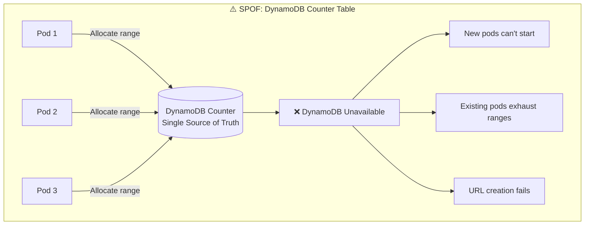

---

## Risk Assessment

### Failure Scenarios

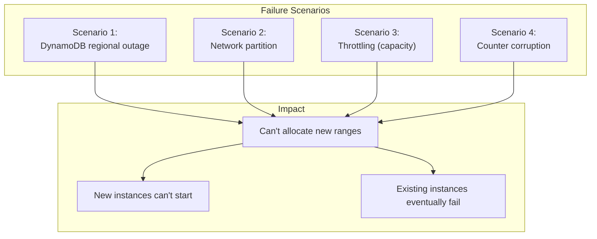

### Time to Impact

| Scenario | Buffer Time | Severity |
|----------|-------------|----------|
| **Batch Size: 1M, Rate: 100/sec** | ~2.7 hours | Low |
| **Batch Size: 1M, Rate: 1K/sec** | ~17 minutes | Medium |
| **Batch Size: 1M, Rate: 10K/sec** | ~100 seconds | High |
| **New pod starting** | 0 (immediate) | Critical |

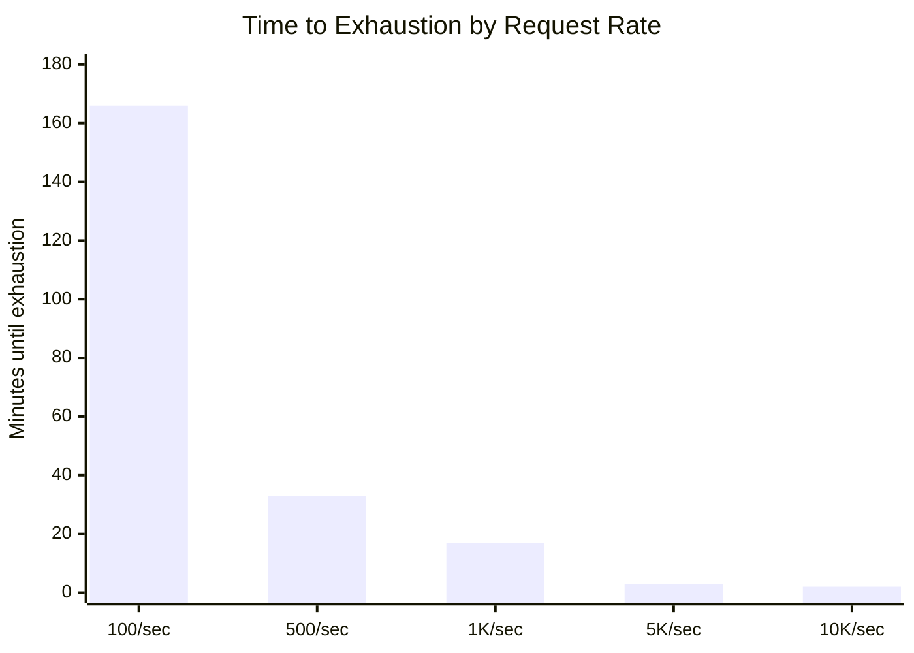

### DynamoDB Availability

| Configuration | SLA | Annual Downtime |
|---------------|-----|-----------------|
| Single Region | 99.99% | ~52 minutes |
| Global Tables | 99.999% | ~5 minutes |

---

## Mitigation Strategies

### Strategy 1: Larger Batch Sizes + Aggressive Prefetch

Increase buffer time by allocating larger batches:

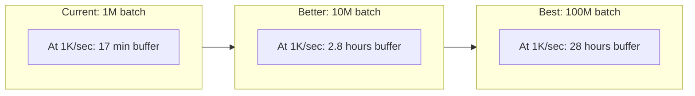

```java
@Configuration
public class IdGeneratorConfig {

    // Increase batch size based on expected load
    @Value("${id-generator.batch-size:10000000}")  // 10M default
    private long batchSize;

    // Prefetch earlier (at 80% instead of 90%)
    @Value("${id-generator.prefetch-threshold:0.8}")
    private double prefetchThreshold;

    // Keep 2 ranges ready
    @Value("${id-generator.prefetch-count:2}")
    private int prefetchCount;
}
```

```java
@Component
public class ResilientIdGenerator {

    private final Queue<RangeAllocation> prefetchedRanges = new ConcurrentLinkedQueue<>();

    @Scheduled(fixedRate = 60, timeUnit = TimeUnit.SECONDS)
    public void ensurePrefetchedRanges() {
        while (prefetchedRanges.size() < prefetchCount) {
            try {
                RangeAllocation range = counterRepository.allocateRange(region, batchSize);
                prefetchedRanges.offer(range);
                log.info("Prefetched range: [{}, {}]", range.start(), range.end());
            } catch (Exception e) {
                log.error("Failed to prefetch range", e);
                break;
            }
        }
    }

    private void switchToNextRange() {
        RangeAllocation next = prefetchedRanges.poll();
        if (next != null) {
            this.rangeStart = next.start();
            this.rangeEnd = next.end();
            this.counter.set(rangeStart);
        } else {
            // Fallback to emergency mode
            activateEmergencyMode();
        }
    }
}
```

---

### Strategy 2: Local Fallback with UUID/Snowflake

When DynamoDB is unavailable, fall back to locally generated IDs:

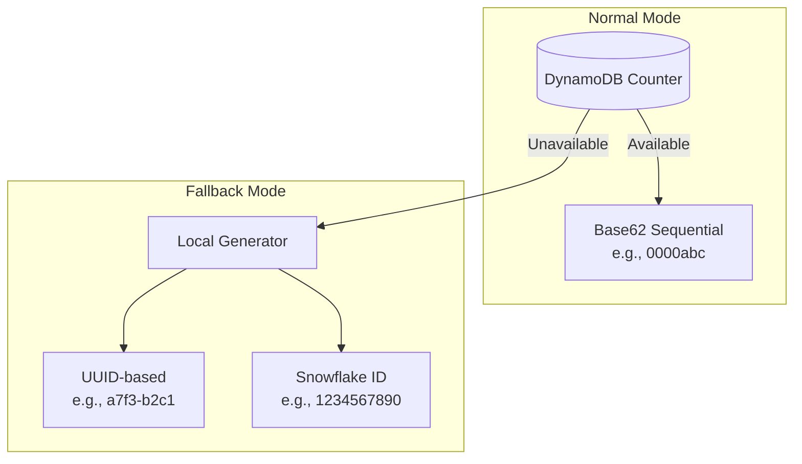

```java
@Component
public class FallbackIdGenerator {

    private final GlobalIdGenerator primaryGenerator;
    private final SnowflakeIdGenerator fallbackGenerator;
    private final CircuitBreaker circuitBreaker;

    private volatile GeneratorMode mode = GeneratorMode.PRIMARY;

    public String generate() {
        if (mode == GeneratorMode.PRIMARY) {
            try {
                return circuitBreaker.run(
                    () -> primaryGenerator.generate(),
                    throwable -> switchToFallback()
                );
            } catch (Exception e) {
                return switchToFallback();
            }
        } else {
            return fallbackGenerator.generate();
        }
    }

    private String switchToFallback() {
        mode = GeneratorMode.FALLBACK;
        log.warn("Switched to fallback ID generator");

        // Alert operations team
        alertService.sendAlert(AlertLevel.HIGH,
            "Primary ID generator unavailable, using fallback");

        return fallbackGenerator.generate();
    }

    // Snowflake-like ID: timestamp + machine_id + sequence
    @Component
    public static class SnowflakeIdGenerator {

        private final long machineId;
        private final AtomicLong sequence = new AtomicLong(0);

        public String generate() {
            long timestamp = System.currentTimeMillis();
            long seq = sequence.getAndIncrement() & 0xFFF; // 12 bits

            // 41 bits timestamp + 10 bits machine + 12 bits sequence
            long id = (timestamp << 22) | (machineId << 12) | seq;

            return encodeBase62(id);
        }
    }
}
```

#### Fallback ID Characteristics

| Aspect | Primary (DynamoDB) | Fallback (Snowflake) |
|--------|-------------------|---------------------|
| Format | Sequential Base62 | Time-based Base62 |
| Length | 7 chars | 11-12 chars |
| Ordering | Sequential | Time-ordered |
| Uniqueness | Global (range-based) | Global (machine ID) |
| Collision risk | None | None (with proper machine ID) |

---

### Strategy 3: Multi-Region Counter Redundancy

Use multiple DynamoDB regions as counter sources:

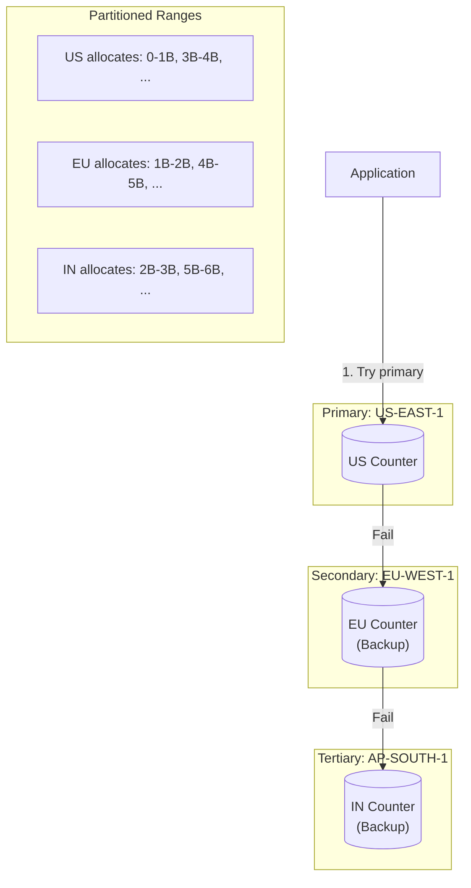

```java
@Component
public class MultiRegionCounterRepository implements CounterRepository {

    private final List<RegionalCounter> counters;

    @PostConstruct
    public void init() {
        counters = List.of(
            new RegionalCounter("us-east-1", 0, dynamoClient_US),
            new RegionalCounter("eu-west-1", 1, dynamoClient_EU),
            new RegionalCounter("ap-south-1", 2, dynamoClient_IN)
        );
    }

    @Override
    public RangeAllocation allocateRange(RegionConfig region, long batchSize) {
        Exception lastException = null;

        // Try each counter in order
        for (RegionalCounter counter : counters) {
            try {
                return counter.allocate(batchSize);
            } catch (Exception e) {
                lastException = e;
                log.warn("Counter {} failed, trying next", counter.region(), e);
            }
        }

        throw new CounterUnavailableException("All counters failed", lastException);
    }

    private static class RegionalCounter {
        private final String region;
        private final int partition;  // 0, 1, or 2
        private final DynamoDbClient client;

        public RangeAllocation allocate(long batchSize) {
            // Each region allocates from its partition
            // Partition 0: 0, 3B, 6B, ...
            // Partition 1: 1B, 4B, 7B, ...
            // Partition 2: 2B, 5B, 8B, ...

            long baseValue = atomicIncrement(batchSize);
            long partitionOffset = partition * 1_000_000_000_000L; // 1T per partition

            return new RangeAllocation(
                partitionOffset + baseValue,
                partitionOffset + baseValue + batchSize - 1
            );
        }
    }
}
```

---

### Strategy 4: Redis as Secondary Counter

Use Redis as a faster, secondary counter source:

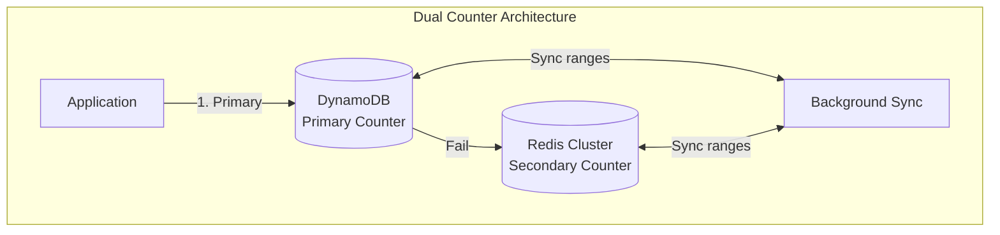

```java
@Component
public class DualCounterRepository implements CounterRepository {

    private final DynamoDbCounterRepository dynamoCounter;
    private final RedisCounterRepository redisCounter;

    // DynamoDB owns even billions, Redis owns odd billions
    // DynamoDB: 0-1B, 2B-3B, 4B-5B, ...
    // Redis: 1B-2B, 3B-4B, 5B-6B, ...

    @Override
    public RangeAllocation allocateRange(RegionConfig region, long batchSize) {
        try {
            return dynamoCounter.allocateRange(region, batchSize);
        } catch (Exception e) {
            log.warn("DynamoDB counter failed, using Redis", e);
            return redisCounter.allocateRange(region, batchSize);
        }
    }
}

@Component
public class RedisCounterRepository implements CounterRepository {

    private final RedissonClient redisson;

    @Override
    public RangeAllocation allocateRange(RegionConfig region, long batchSize) {
        String key = "counter:" + region.getAwsRegion();

        // Atomic increment in Redis
        RAtomicLong counter = redisson.getAtomicLong(key);

        // Initialize if not exists (start at odd billion for Redis)
        counter.compareAndSet(0, 1_000_000_000L);

        long start = counter.getAndAdd(batchSize);

        return new RangeAllocation(start, start + batchSize - 1);
    }
}
```

---

### Strategy 5: Pre-Allocated Emergency Reserves

Reserve ID ranges for emergency use during outages:

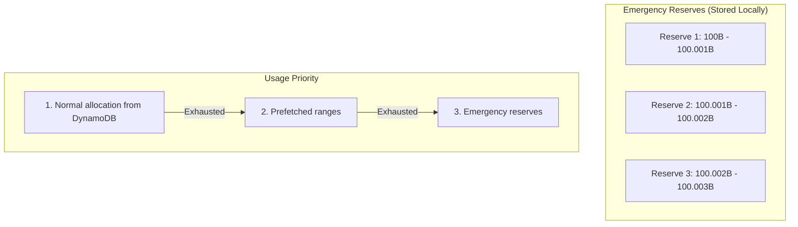

```java
@Component
public class EmergencyReserveManager {

    // Pre-allocated emergency reserves (loaded at startup)
    private final Queue<RangeAllocation> emergencyReserves = new ConcurrentLinkedQueue<>();

    // Reserve ranges are stored in a separate, highly available location
    // Could be: local file, S3, Secrets Manager, etc.

    @PostConstruct
    public void loadEmergencyReserves() {
        // Load from secure storage
        List<RangeAllocation> reserves = reserveStorage.loadReserves(instanceId);
        emergencyReserves.addAll(reserves);

        log.info("Loaded {} emergency reserve ranges", reserves.size());
    }

    public Optional<RangeAllocation> getEmergencyRange() {
        RangeAllocation reserve = emergencyReserves.poll();

        if (reserve != null) {
            log.warn("Using emergency reserve: [{}, {}]",
                reserve.start(), reserve.end());

            alertService.sendAlert(AlertLevel.CRITICAL,
                "Emergency reserve activated. " +
                emergencyReserves.size() + " reserves remaining");

            // Mark as used (prevent reuse after restart)
            reserveStorage.markUsed(reserve);
        }

        return Optional.ofNullable(reserve);
    }

    @Scheduled(cron = "0 0 0 * * *")  // Daily
    public void replenishReserves() {
        int targetReserves = 10;

        while (emergencyReserves.size() < targetReserves) {
            try {
                RangeAllocation range = counterRepository.allocateRange(
                    RegionConfig.EMERGENCY,  // Special emergency partition
                    10_000_000  // 10M IDs per reserve
                );

                emergencyReserves.offer(range);
                reserveStorage.save(range);

            } catch (Exception e) {
                log.error("Failed to replenish emergency reserves", e);
                break;
            }
        }
    }
}
```

---

### Strategy 6: Circuit Breaker + Graceful Degradation

Implement circuit breaker pattern for graceful handling:

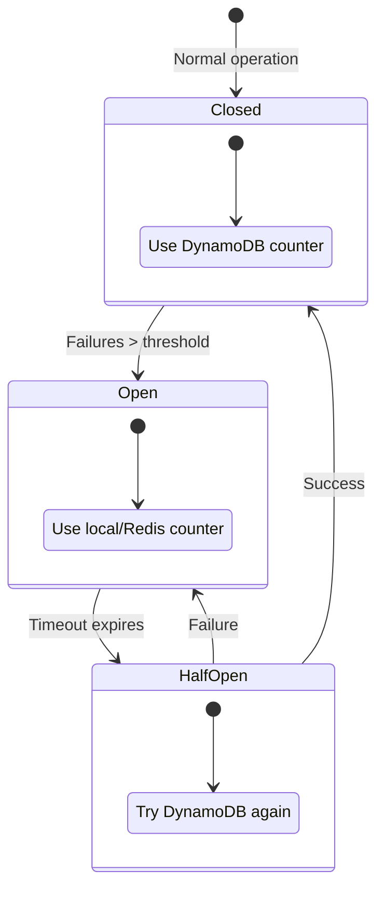

```java
@Component
public class ResilientCounterService {

    private final CircuitBreaker circuitBreaker;
    private final DynamoDbCounterRepository primaryCounter;
    private final FallbackCounterRepository fallbackCounter;

    @PostConstruct
    public void init() {
        circuitBreaker = CircuitBreaker.builder()
            .name("dynamodb-counter")
            .failureThreshold(3)
            .successThreshold(2)
            .waitDuration(Duration.ofSeconds(30))
            .build();

        circuitBreaker.getEventPublisher()
            .onStateTransition(event -> {
                log.warn("Circuit breaker state: {} -> {}",
                    event.getStateTransition().getFromState(),
                    event.getStateTransition().getToState());

                if (event.getStateTransition().getToState() == State.OPEN) {
                    alertService.sendAlert(AlertLevel.HIGH,
                        "DynamoDB counter circuit breaker opened");
                }
            });
    }

    public RangeAllocation allocateRange(RegionConfig region, long batchSize) {
        return circuitBreaker.executeSupplier(() -> {
            try {
                return primaryCounter.allocateRange(region, batchSize);
            } catch (Exception e) {
                throw new CounterException("Primary counter failed", e);
            }
        }, throwable -> {
            log.warn("Using fallback counter due to: {}", throwable.getMessage());
            return fallbackCounter.allocateRange(region, batchSize);
        });
    }
}
```

---

## Recommended Architecture

Combine multiple strategies for maximum resilience:

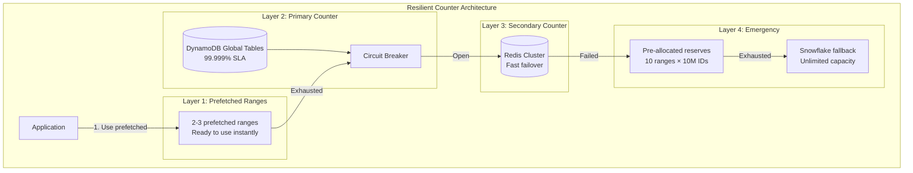

### Implementation

```java
@Component
public class UltraResilientIdGenerator {

    private final Queue<RangeAllocation> prefetchedRanges;
    private final CircuitBreaker dynamoCircuit;
    private final DynamoDbCounterRepository dynamoCounter;
    private final RedisCounterRepository redisCounter;
    private final EmergencyReserveManager emergencyReserves;
    private final SnowflakeIdGenerator snowflakeGenerator;

    private volatile RangeAllocation currentRange;
    private final AtomicLong counter = new AtomicLong(0);

    public String generate() {
        long value = counter.getAndIncrement();

        // Check if current range exhausted
        if (value > currentRange.end()) {
            switchRange();
            value = counter.getAndIncrement();
        }

        // Trigger prefetch if needed
        if (shouldPrefetch(value)) {
            triggerAsyncPrefetch();
        }

        return encode(value);
    }

    private synchronized void switchRange() {
        // 1. Try prefetched ranges
        RangeAllocation next = prefetchedRanges.poll();
        if (next != null) {
            activateRange(next);
            return;
        }

        // 2. Try DynamoDB (with circuit breaker)
        if (dynamoCircuit.getState() != State.OPEN) {
            try {
                next = dynamoCircuit.executeSupplier(
                    () -> dynamoCounter.allocateRange(region, batchSize)
                );
                activateRange(next);
                return;
            } catch (Exception e) {
                log.warn("DynamoDB allocation failed", e);
            }
        }

        // 3. Try Redis
        try {
            next = redisCounter.allocateRange(region, batchSize);
            activateRange(next);
            return;
        } catch (Exception e) {
            log.warn("Redis allocation failed", e);
        }

        // 4. Try emergency reserves
        Optional<RangeAllocation> reserve = emergencyReserves.getEmergencyRange();
        if (reserve.isPresent()) {
            activateRange(reserve.get());
            return;
        }

        // 5. Ultimate fallback: Snowflake
        activateSnowflakeMode();
    }

    private void activateSnowflakeMode() {
        log.error("All counters exhausted, switching to Snowflake mode");

        alertService.sendAlert(AlertLevel.CRITICAL,
            "ID generator in Snowflake fallback mode - investigate immediately");

        // Generate IDs using Snowflake algorithm
        this.idGenerator = snowflakeGenerator;
    }
}
```

---

## Comparison Matrix

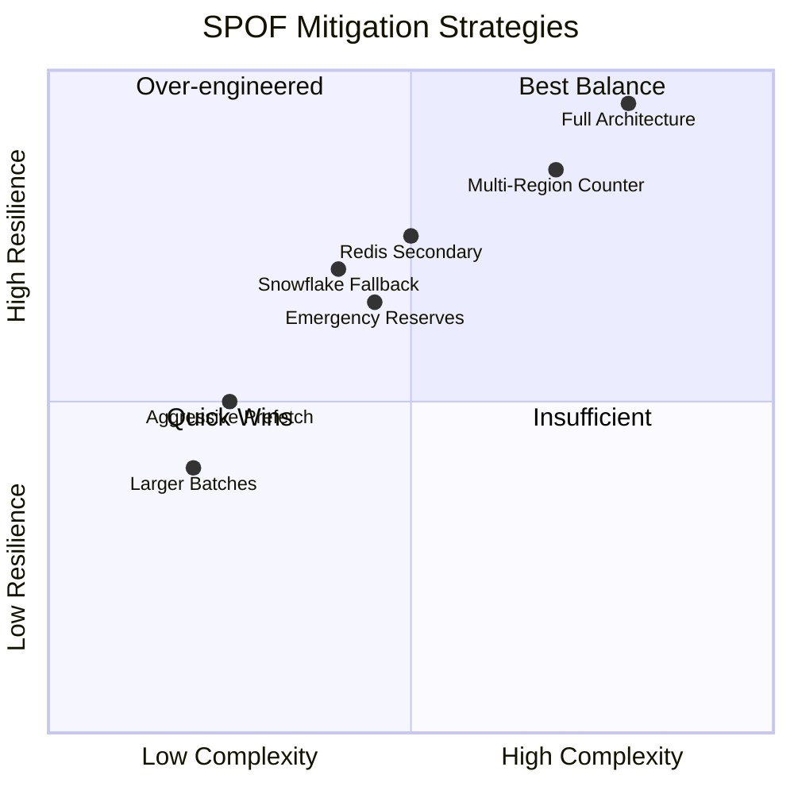

| Strategy | Complexity | Resilience | Recovery Time |
|----------|------------|------------|---------------|
| Larger batches | Low | Medium | N/A (buffer) |
| Aggressive prefetch | Low | Medium | Instant |
| Snowflake fallback | Medium | High | Instant |
| Redis secondary | Medium | High | <1 second |
| Multi-region counter | High | Very High | <1 second |
| Emergency reserves | Medium | High | Instant |
| **Full architecture** | High | **Maximum** | Instant |

---

## Summary

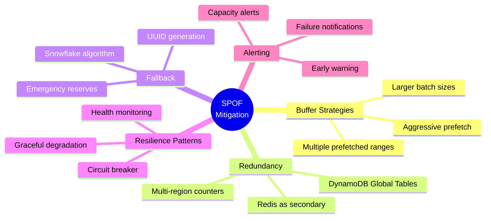

### Key Takeaways

1. **DynamoDB Global Tables already provide 99.999% availability** - but plan for the 0.001%
2. **Prefetched ranges provide instant buffer** - always have 2-3 ranges ready
3. **Layered fallback is essential** - DynamoDB → Redis → Reserves → Snowflake
4. **Circuit breaker prevents cascade failures** - fail fast, recover gracefully
5. **Emergency reserves are insurance** - pre-allocate for worst-case scenarios
6. **Snowflake is the ultimate fallback** - unlimited capacity, no dependencies
