# TTL Expiry and Slug Reuse Across Regions

## The Challenge

When a URL expires (TTL expiry), its slug becomes available for reuse. This creates cache invalidation challenges across our scaling strategies:

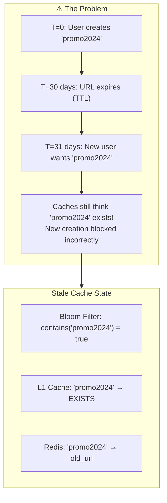

---

## Strategy Analysis

### Strategy 1: Bloom Filter

#### The Problem

**Bloom filters do NOT support deletion.** Once an alias is added, it stays forever.

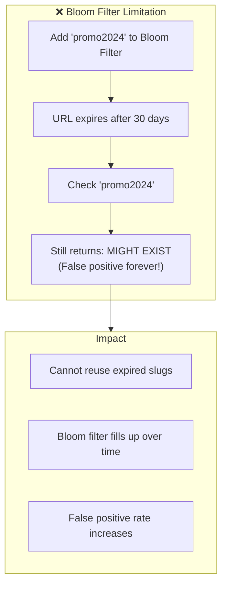

#### Solutions

##### Solution A: Counting Bloom Filter

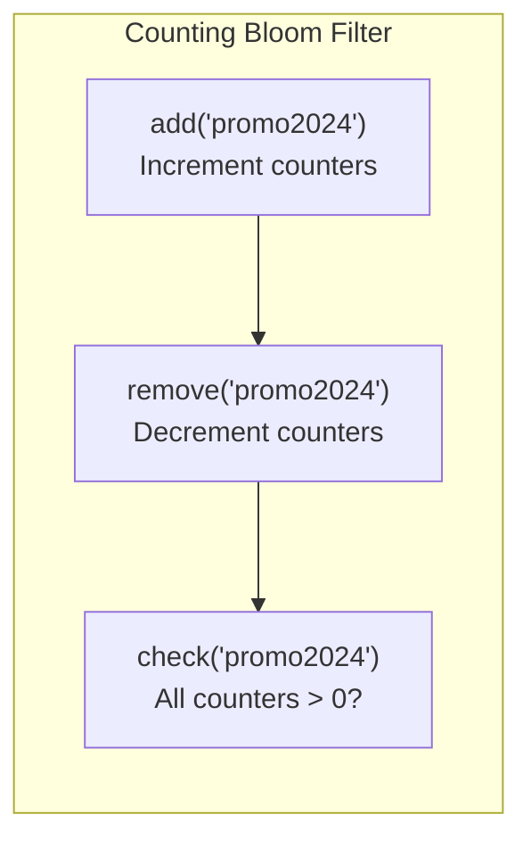

```java
@Component
public class CountingBloomFilterService {
    
    // Counting Bloom Filter using Redis
    private static final String CBF_PREFIX = "cbf:alias:";
    
    public void add(String alias) {
        byte[] hash = hashAlias(alias);
        for (int i = 0; i < NUM_HASH_FUNCTIONS; i++) {
            int position = getPosition(hash, i);
            redisTemplate.opsForValue().increment(CBF_PREFIX + position);
        }
    }
    
    public void remove(String alias) {
        byte[] hash = hashAlias(alias);
        for (int i = 0; i < NUM_HASH_FUNCTIONS; i++) {
            int position = getPosition(hash, i);
            redisTemplate.opsForValue().decrement(CBF_PREFIX + position);
        }
    }
    
    public boolean mightExist(String alias) {
        byte[] hash = hashAlias(alias);
        for (int i = 0; i < NUM_HASH_FUNCTIONS; i++) {
            int position = getPosition(hash, i);
            Long count = redisTemplate.opsForValue().get(CBF_PREFIX + position);
            if (count == null || count <= 0) {
                return false; // Definitely doesn't exist
            }
        }
        return true; // Might exist
    }
}
```

##### Solution B: Rotating Bloom Filters

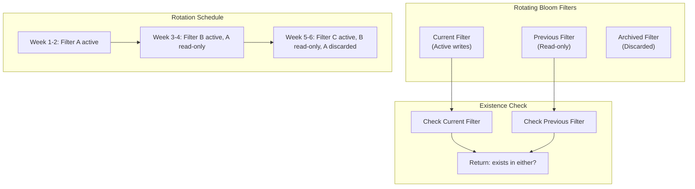

```java
@Component
public class RotatingBloomFilter {
    
    private final Duration rotationPeriod = Duration.ofDays(14);
    private RBloomFilter<String> currentFilter;
    private RBloomFilter<String> previousFilter;
    
    @Scheduled(fixedRate = 14, timeUnit = TimeUnit.DAYS)
    public void rotate() {
        // Discard old previous, current becomes previous
        redisson.getBloomFilter("bloom:archive").delete();
        previousFilter.rename("bloom:archive");
        currentFilter.rename("bloom:previous");
        
        // Create new current
        currentFilter = redisson.getBloomFilter("bloom:current");
        currentFilter.tryInit(expectedInsertions, falsePositiveRate);
        
        log.info("Rotated Bloom filters");
    }
    
    public boolean mightExist(String alias) {
        return currentFilter.contains(alias) || 
               previousFilter.contains(alias);
    }
    
    public void add(String alias) {
        currentFilter.add(alias);
    }
}
```

##### Solution C: Time-Partitioned Bloom Filters

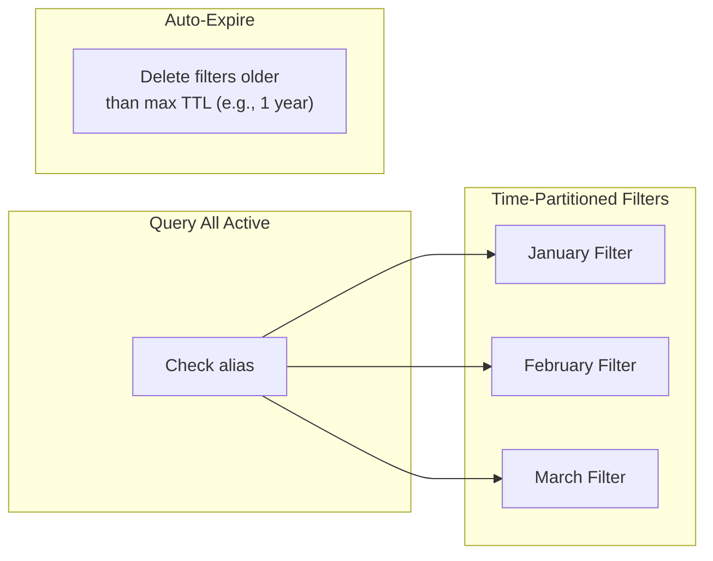

#### Bloom Filter Summary

| Solution | Pros | Cons | Recommended |
|----------|------|------|-------------|
| Counting Bloom | Supports deletion | 4x memory, counter overflow risk | ⚠️ Medium scale |
| Rotating Bloom | Simple, auto-cleanup | Brief false negatives during rotation | ✅ Large scale |
| Time-Partitioned | Precise TTL alignment | Complex query across partitions | ✅ Variable TTLs |

---

### Strategy 2: DynamoDB Accelerator (DAX)

#### How It Works with TTL

DAX automatically handles TTL because DynamoDB TTL deletes the source record:

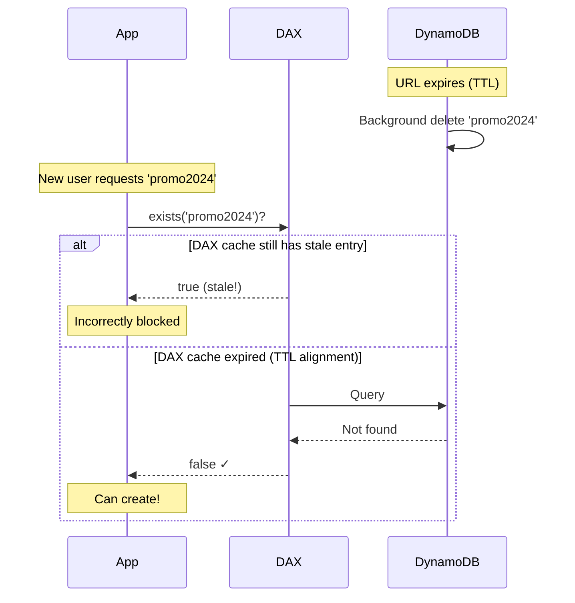

#### The Problem: TTL Misalignment

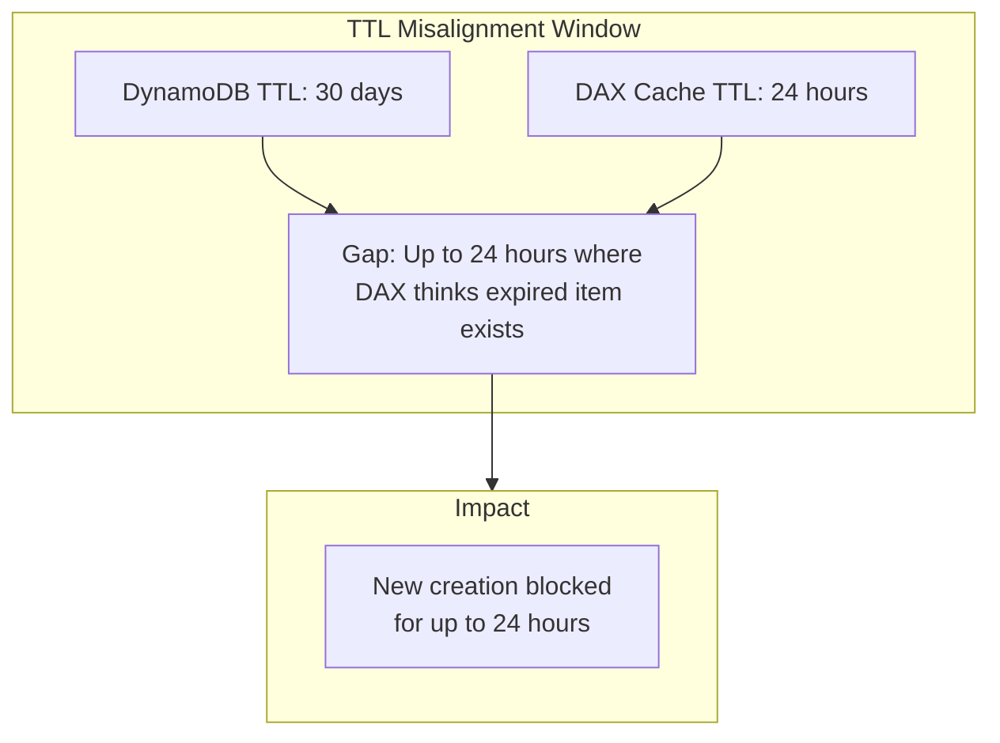

#### Solution: TTL-Aware DAX Configuration

```java
@Configuration
public class DaxTtlConfig {
    
    // Set DAX TTL shorter than minimum URL TTL
    // If min URL TTL = 1 day, set DAX TTL = 1 hour
    @Bean
    public DaxClientConfig daxConfig() {
        return DaxClientConfig.builder()
            .itemTtl(Duration.ofHours(1))  // Short TTL
            .queryTtl(Duration.ofMinutes(5))
            .build();
    }
}

@Service
public class TtlAwareAliasChecker {
    
    public boolean exists(String alias) {
        // First check DAX
        Optional<ShortUrl> cached = daxRepository.findByShortCode(alias);
        
        if (cached.isEmpty()) {
            return false;
        }
        
        // Verify not expired (DAX might have stale data)
        ShortUrl url = cached.get();
        if (url.getExpiresAt() != null && 
            url.getExpiresAt().isBefore(Instant.now())) {
            // Expired! Invalidate DAX cache
            daxRepository.evict(alias);
            return false;
        }
        
        return true;
    }
}
```

#### DAX Summary

| Aspect | Status | Mitigation |
|--------|--------|------------|
| Auto-cleanup | ✅ Works (DynamoDB TTL) | N/A |
| Cache staleness | ⚠️ Up to DAX TTL | Reduce DAX TTL |
| Cross-region | ✅ Each region has own DAX | N/A |

---

### Strategy 3: Regional Prefix Strategy

#### How TTL Works

Each region handles its own TTL independently - **no cross-region coordination needed**:

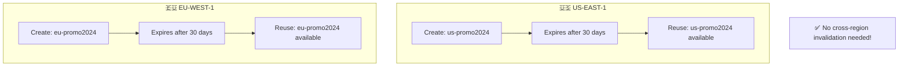

#### Why It Works

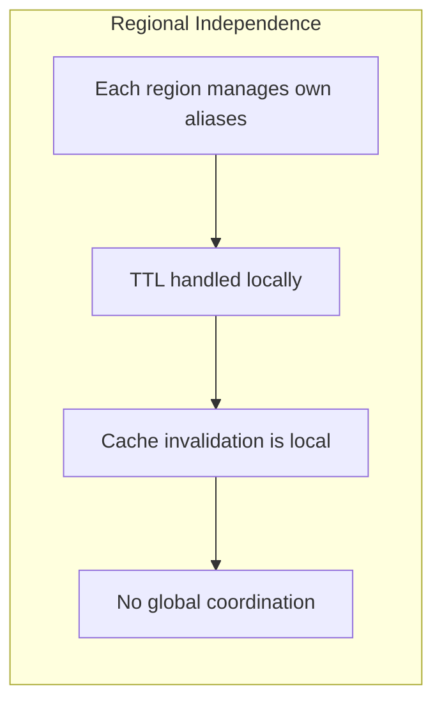

#### Regional Prefix Summary

| Aspect | Status | Notes |
|--------|--------|-------|
| TTL Handling | ✅ Perfect | Local only |
| Cache Invalidation | ✅ Simple | Local caches only |
| Slug Reuse | ✅ Immediate | No cross-region wait |
| Trade-off | ⚠️ | Same alias possible in different regions |

---

### Strategy 4: Hierarchical Caching

#### The Problem: Multi-Layer Staleness

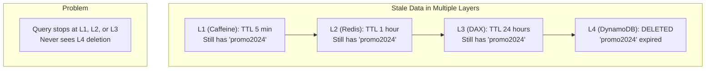

#### Solution: TTL Alignment + Active Invalidation

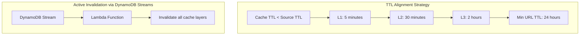

```java
// Lambda function triggered by DynamoDB Streams
public class CacheInvalidationHandler implements RequestHandler<DynamodbEvent, Void> {
    
    private final RedisTemplate<String, Object> redis;
    private final SnsClient sns;
    
    @Override
    public Void handleRequest(DynamodbEvent event, Context context) {
        for (DynamodbStreamRecord record : event.getRecords()) {
            if ("REMOVE".equals(record.getEventName())) {
                // URL was deleted (TTL or manual)
                String alias = record.getDynamodb().getKeys()
                    .get("short_code").getS();
                
                invalidateAllCaches(alias);
            }
        }
        return null;
    }
    
    private void invalidateAllCaches(String alias) {
        // L2: Redis (direct)
        redis.delete("alias:" + alias);
        
        // L1: Caffeine (via SNS to all instances)
        sns.publish(PublishRequest.builder()
            .topicArn(CACHE_INVALIDATION_TOPIC)
            .message(alias)
            .build());
        
        // L3: DAX (via DynamoDB - automatic)
        // DAX watches DynamoDB streams internally
        
        log.info("Invalidated caches for expired alias: {}", alias);
    }
}
```

```java
// Application-side SNS listener for L1 invalidation
@Component
public class L1CacheInvalidationListener {
    
    private final Cache<String, Boolean> l1Cache;
    
    @SqsListener("cache-invalidation-queue")
    public void onInvalidation(String alias) {
        l1Cache.invalidate(alias);
        log.debug("Invalidated L1 cache for: {}", alias);
    }
}
```

#### Hierarchical Cache Invalidation Flow

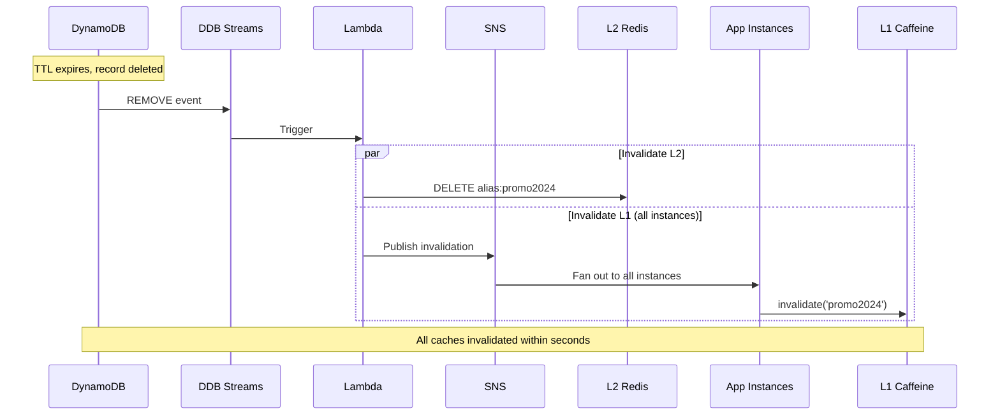

#### Hierarchical Cache Summary

| Layer | TTL | Invalidation Method |
|-------|-----|---------------------|
| L1 Caffeine | 5 min | SNS → SQS fan-out |
| L2 Redis | 30 min | Lambda direct delete |
| L3 DAX | 2 hours | DynamoDB Streams (automatic) |
| L4 DynamoDB | Source | TTL auto-delete |

---

### Strategy 5: Async Validation

#### How TTL Works

Async validation **always checks the source** eventually, so TTL works naturally:

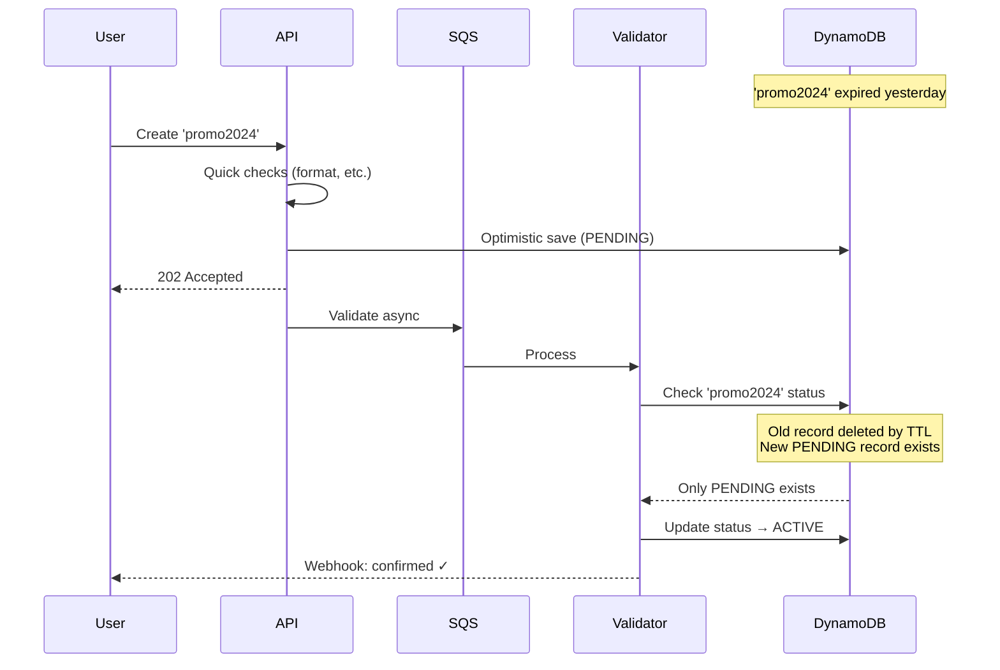

#### Edge Case: Race with TTL

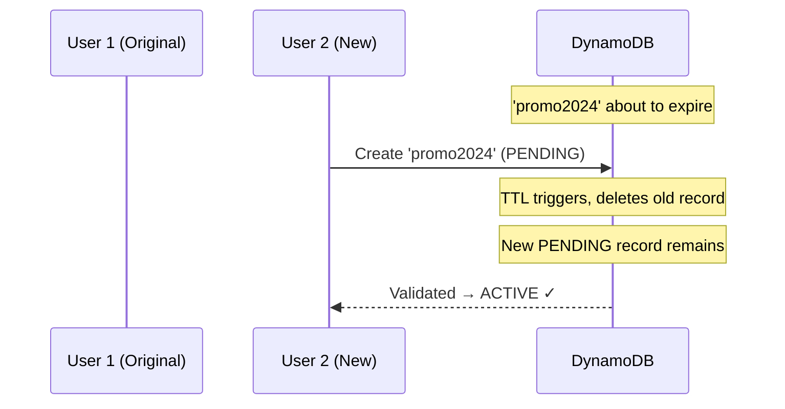

#### Async Validation Summary

| Aspect | Status | Notes |
|--------|--------|-------|
| TTL Handling | ✅ Perfect | Always checks source |
| Race Conditions | ✅ Safe | Conditional writes |
| User Experience | ⚠️ | Eventual confirmation |

---

### Strategy 6: Consistent Hashing

#### How TTL Works

The owning region handles TTL and must broadcast invalidation:

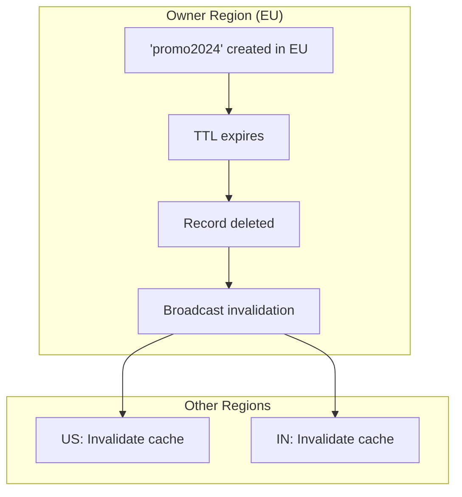

#### Implementation

```java
@Component
public class ConsistentHashTtlHandler {
    
    private final ConsistentHash<String> hashRing;
    private final SnsClient sns;
    
    // Called when DynamoDB TTL deletes a record
    @DynamoDbStreamListener
    public void onTtlExpiry(DynamodbStreamRecord record) {
        if (!"REMOVE".equals(record.getEventName())) return;
        
        String alias = record.getDynamodb().getKeys()
            .get("short_code").getS();
        String ownerRegion = hashRing.get(alias);
        
        if (currentRegion.equals(ownerRegion)) {
            // We are the owner - broadcast to other regions
            broadcastInvalidation(alias);
        }
    }
    
    private void broadcastInvalidation(String alias) {
        // SNS topic with cross-region subscriptions
        sns.publish(PublishRequest.builder()
            .topicArn(CROSS_REGION_INVALIDATION_TOPIC)
            .message(new InvalidationMessage(alias, Instant.now()).toJson())
            .build());
    }
    
    @SnsListener("invalidation-queue")
    public void onInvalidationReceived(InvalidationMessage msg) {
        // Invalidate local caches
        localCache.invalidate(msg.alias());
        redisCache.delete(msg.alias());
    }
}
```

#### Cross-Region Invalidation Flow

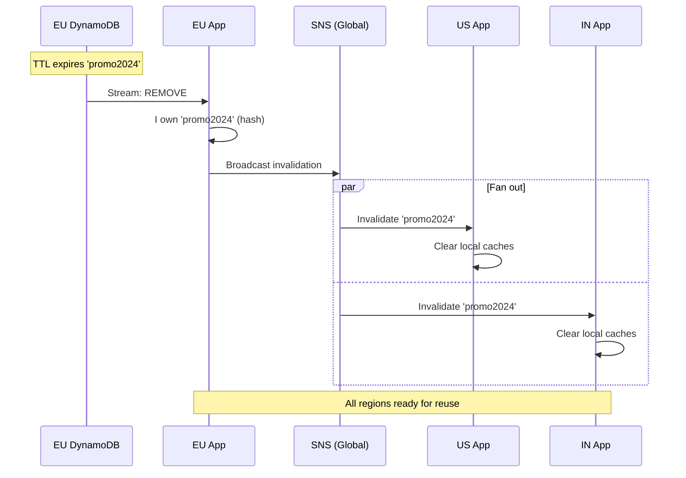

#### Consistent Hashing Summary

| Aspect | Status | Notes |
|--------|--------|-------|
| TTL Handling | ✅ Works | Owner broadcasts |
| Cross-region sync | ⚠️ Latency | SNS propagation delay |
| Failure mode | ⚠️ | If owner down, invalidation delayed |

---

## Comparison Matrix: TTL Handling

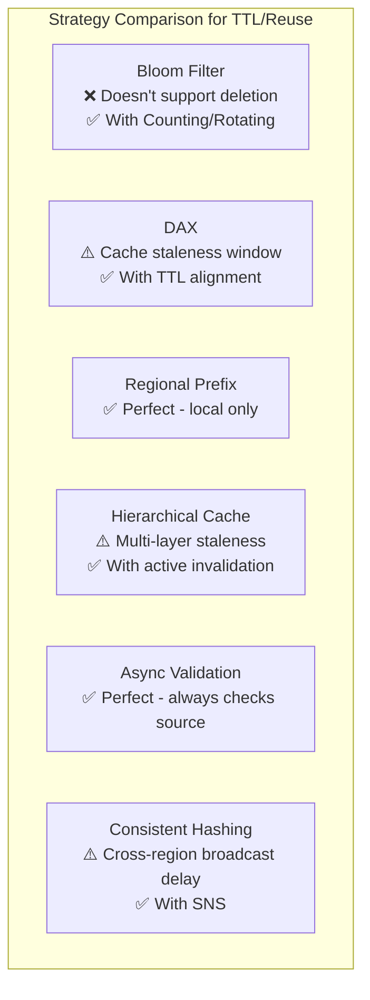

| Strategy | TTL Support | Slug Reuse | Complexity | Recommendation |
|----------|-------------|------------|------------|----------------|
| **Bloom Filter** | ❌ Native | ❌ Blocked forever | High (need variants) | Use Counting/Rotating |
| **DAX** | ✅ Auto | ⚠️ Delayed (cache TTL) | Low | Align cache TTL |
| **Regional Prefix** | ✅ Perfect | ✅ Immediate | Low | Best for TTL |
| **Hierarchical Cache** | ⚠️ Complex | ⚠️ Delayed | High | Need active invalidation |
| **Async Validation** | ✅ Perfect | ✅ Immediate | Medium | Great for TTL |
| **Consistent Hashing** | ✅ Works | ⚠️ Propagation delay | High | Good with SNS |

---

## Recommended Architecture for TTL Support

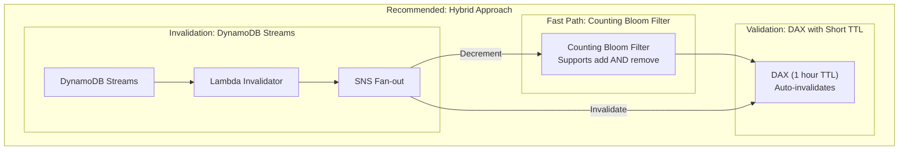

### Implementation

```java
@Service
public class TtlAwareAliasService {
    
    private final CountingBloomFilter bloomFilter;
    private final DaxRepository daxRepository;
    private final ShortUrlRepository repository;
    
    public boolean canCreate(String alias) {
        // Step 1: Counting Bloom Filter (sub-ms)
        if (!bloomFilter.mightExist(alias)) {
            return true; // Definitely available
        }
        
        // Step 2: DAX check (ms)
        Optional<ShortUrl> cached = daxRepository.findByShortCode(alias);
        if (cached.isEmpty()) {
            // Bloom filter false positive
            return true;
        }
        
        // Step 3: Check if expired
        ShortUrl url = cached.get();
        if (isExpired(url)) {
            // Expired but not yet cleaned up
            // Trigger async cleanup and allow reuse
            triggerCleanup(alias);
            return true;
        }
        
        return false; // Alias in use
    }
    
    // Called by DynamoDB Streams Lambda
    @SnsListener("alias-ttl-expired")
    public void onAliasExpired(String alias) {
        // Remove from Counting Bloom Filter
        bloomFilter.remove(alias);
        
        // DAX auto-invalidates via DynamoDB Streams
        log.info("Alias {} expired and removed from bloom filter", alias);
    }
    
    public void createAlias(String alias, String url) {
        if (!canCreate(alias)) {
            throw new AliasAlreadyExistsException(alias);
        }
        
        repository.save(/* ... */);
        
        // Add to Counting Bloom Filter
        bloomFilter.add(alias);
    }
}
```

---

## Summary

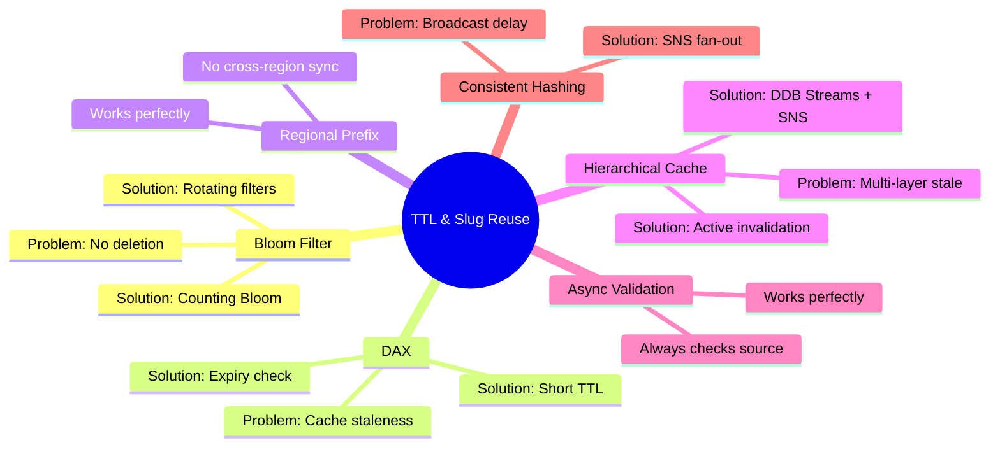

### Key Takeaways

1. **Bloom Filters need special handling** - Use Counting or Rotating variants
2. **DAX works but needs TTL alignment** - Set DAX TTL < min URL TTL
3. **Regional Prefix is best for TTL** - No cross-region coordination
4. **Hierarchical Cache needs active invalidation** - DynamoDB Streams + Lambda + SNS
5. **Async Validation handles TTL naturally** - Always eventual consistency
6. **Consistent Hashing needs broadcast** - Owner notifies other regions
