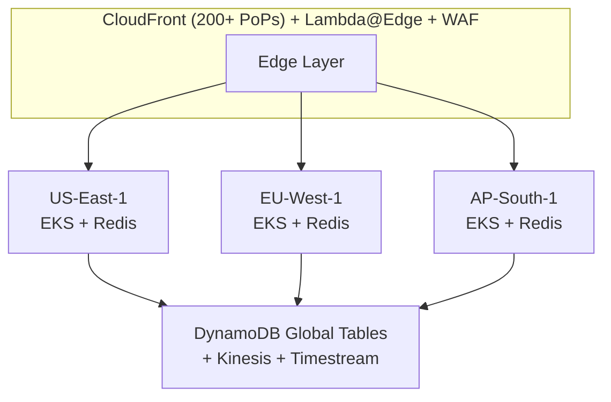
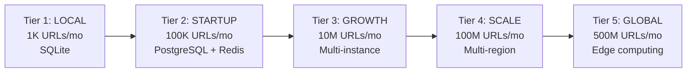
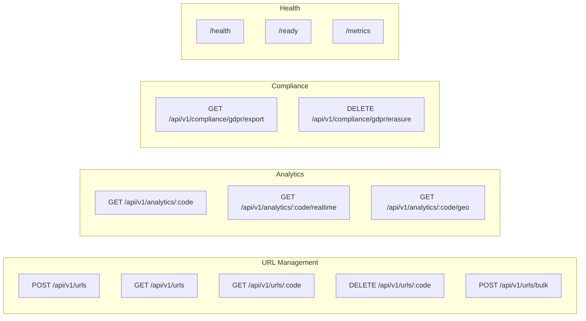
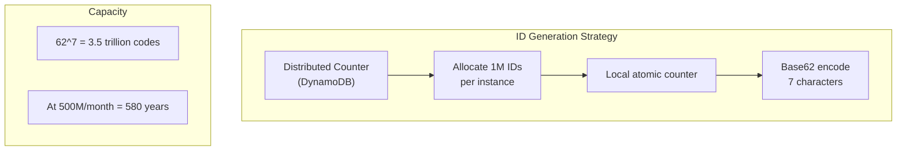
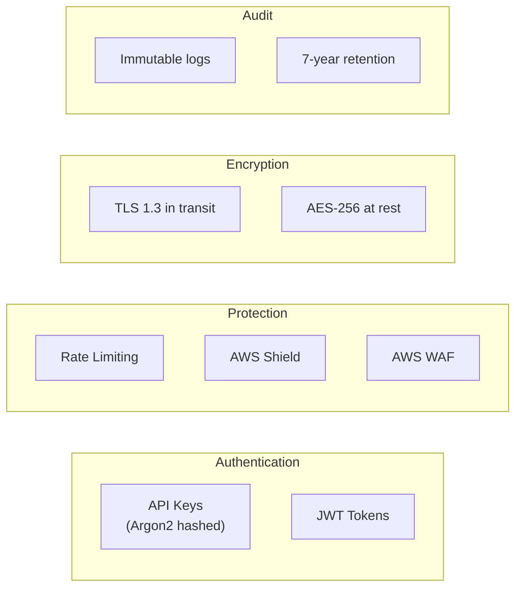
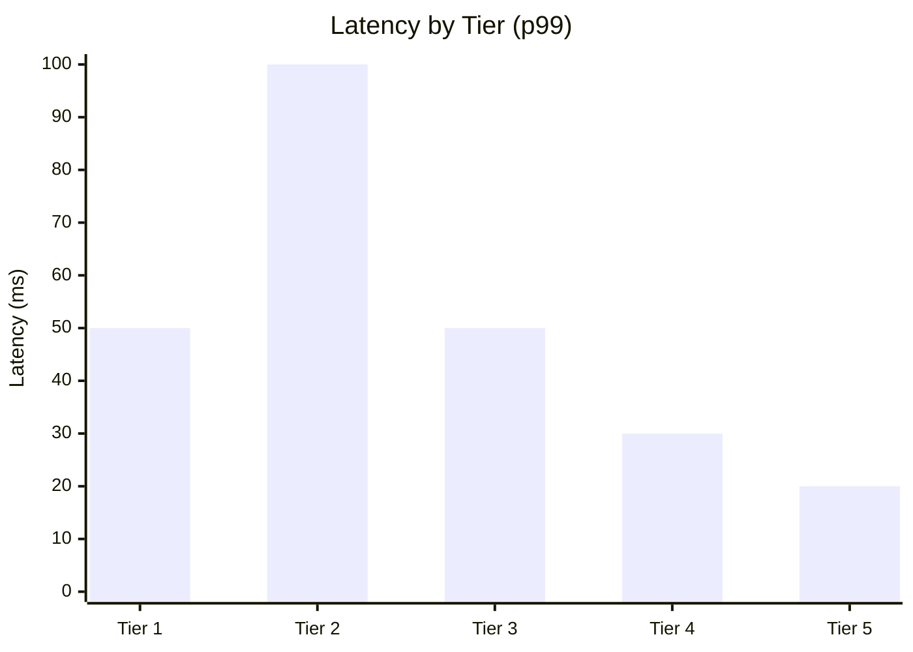

# URL Shortener - Production-Grade System Design

A comprehensive URL shortener service built with Rust, designed to scale from local development to serving **500 million new URLs per month** globally.

## Overview

This project demonstrates a complete system design implementation including:

- **5 Scaling Tiers**: From local SQLite to global DynamoDB with edge computing
- **Full Rust Implementation**: Using Axum for maximum performance
- **AWS Infrastructure**: CloudFront, EKS, DynamoDB Global Tables, ElastiCache
- **Compliance**: GDPR, CCPA, SOC 2, and HIPAA ready
- **Observability**: OpenTelemetry, CloudWatch, X-Ray integration

## Architecture



## Quick Start

### Local Development (Tier 1)

```bash
# Clone the repository
git clone https://github.com/your-org/url-shortener.git
cd url-shortener

# Run with Docker Compose
docker-compose up -d

# Or run directly with Cargo
cargo run

# The service will be available at http://localhost:8080
```

### Create a Short URL

```bash
# Create a short URL
curl -X POST http://localhost:8080/api/v1/urls \
  -H "Content-Type: application/json" \
  -d '{"url": "https://example.com/very/long/path"}'

# Response:
# {
#   "id": "uuid",
#   "short_code": "abc123X",
#   "short_url": "http://localhost:8080/abc123X",
#   "original_url": "https://example.com/very/long/path",
#   "created_at": "2024-01-15T10:30:00Z"
# }

# Use the short URL
curl -L http://localhost:8080/abc123X
# Redirects to https://example.com/very/long/path
```

## Project Structure

```
url-shortener/
├── docs/                       # Comprehensive documentation
│   ├── 01-overview.md          # System overview
│   ├── 02-requirements.md      # Requirements per tier
│   ├── 03-architecture.md      # Architecture details
│   ├── 04-database-design.md   # Schema and cleanup policies
│   ├── 05-security-compliance.md # GDPR/CCPA/SOC2/HIPAA
│   ├── 06-telemetry.md         # Observability
│   └── 07-deployment.md        # AWS deployment
├── src/                        # Rust application
│   ├── main.rs                 # Entry point
│   ├── api/                    # HTTP handlers
│   ├── domain/                 # Business logic
│   ├── infrastructure/         # External services
│   ├── telemetry/              # Observability
│   ├── compliance/             # GDPR, audit
│   └── middleware/             # Auth, rate limiting
├── terraform/                  # AWS infrastructure
│   ├── modules/                # Reusable modules
│   └── environments/           # Environment configs
├── k8s/                        # Kubernetes manifests
├── docker/                     # Docker configurations
└── migrations/                 # Database migrations
```

## Scaling Tiers



| Tier | Scale | URLs/Month | Architecture |
|------|-------|------------|--------------|
| 1 | Local | 1K | Single binary + SQLite |
| 2 | Startup | 100K | PostgreSQL + Redis |
| 3 | Growth | 10M | Multi-instance + Replicas |
| 4 | Scale | 100M | Multi-region + DynamoDB |
| 5 | Global | 500M | Edge computing + Sharded |

## API Endpoints



## Configuration

Environment variables:

```bash
# Server
PORT=8080
ENVIRONMENT=development

# Database
DATABASE_TYPE=sqlite  # or: dynamodb
DATABASE_URL=sqlite:./data/urls.db?mode=rwc

# Cache
CACHE_TYPE=memory  # or: redis
REDIS_URL=redis://localhost:6379

# AWS (for DynamoDB mode)
AWS_REGION=us-east-1
AWS_LOCAL_MODE=true  # Use LocalStack

# Telemetry
RUST_LOG=info
OTLP_ENDPOINT=http://localhost:4317

# URL Configuration
BASE_URL=http://localhost:8080
```

## ID Generation



## Deployment

### Kubernetes (EKS)

```bash
# Apply base configuration
kubectl apply -k k8s/base/

# Or use environment-specific overlay
kubectl apply -k k8s/overlays/production/
```

### Terraform

```bash
cd terraform/environments/production

terraform init
terraform plan
terraform apply
```

## Security Features



## Compliance

| Framework | Status | Features |
|-----------|--------|----------|
| GDPR | Ready | Data export, erasure (72h SLA), consent tracking |
| CCPA | Ready | Do-not-sell, disclosure, opt-out |
| SOC 2 | Ready | Access controls, audit logs, encryption |
| HIPAA | Ready | Enterprise tier with BAA |

## Performance Targets



| Metric | Target (Tier 5) |
|--------|-----------------|
| Redirect Latency (p99) | < 20ms |
| Availability | 99.99% |
| Cache Hit Rate | > 98% |
| Throughput | 50K+ RPS |

## Documentation

See the `/docs` directory for comprehensive documentation:

1. [System Overview](docs/01-overview.md)
2. [Requirements](docs/02-requirements.md)
3. [Architecture](docs/03-architecture.md)
4. [Database Design](docs/04-database-design.md)
5. [Security & Compliance](docs/05-security-compliance.md)
6. [Telemetry](docs/06-telemetry.md)
7. [Deployment](docs/07-deployment.md)

## Contributing

1. Fork the repository
2. Create a feature branch
3. Make your changes
4. Run tests: `cargo test`
5. Submit a pull request

## License

MIT License - see [LICENSE](LICENSE) for details.

## Acknowledgments

This project was designed as a comprehensive system design example, demonstrating best practices for building scalable, secure, and compliant web services.
