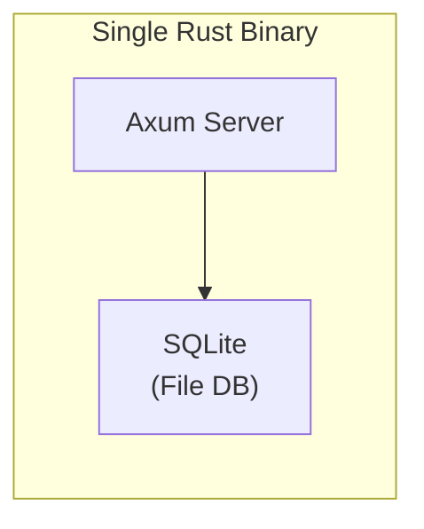
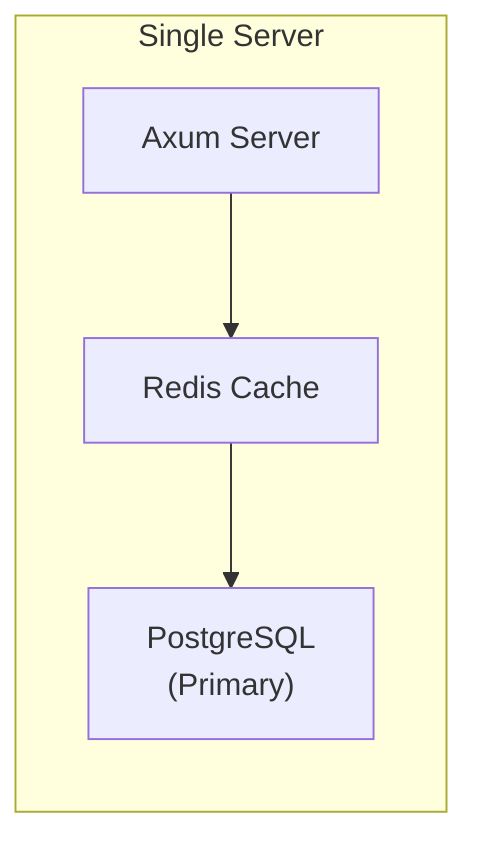
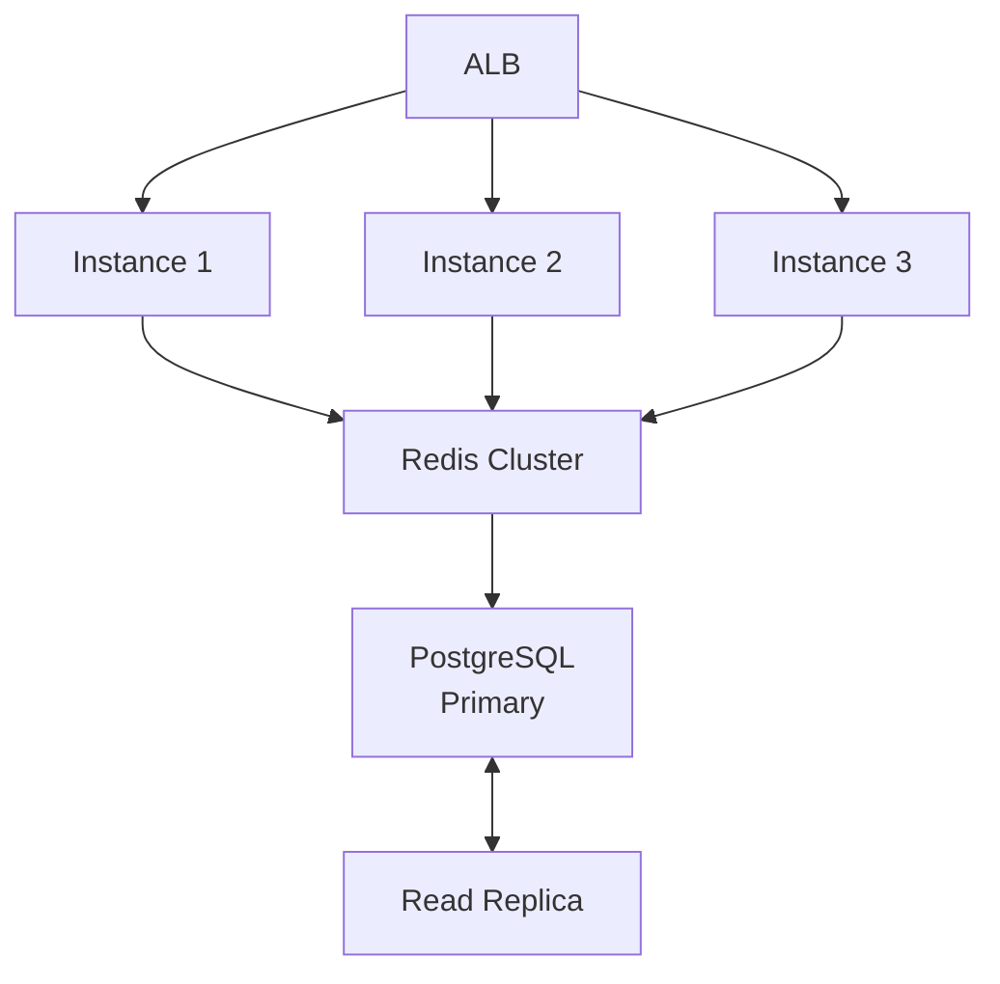
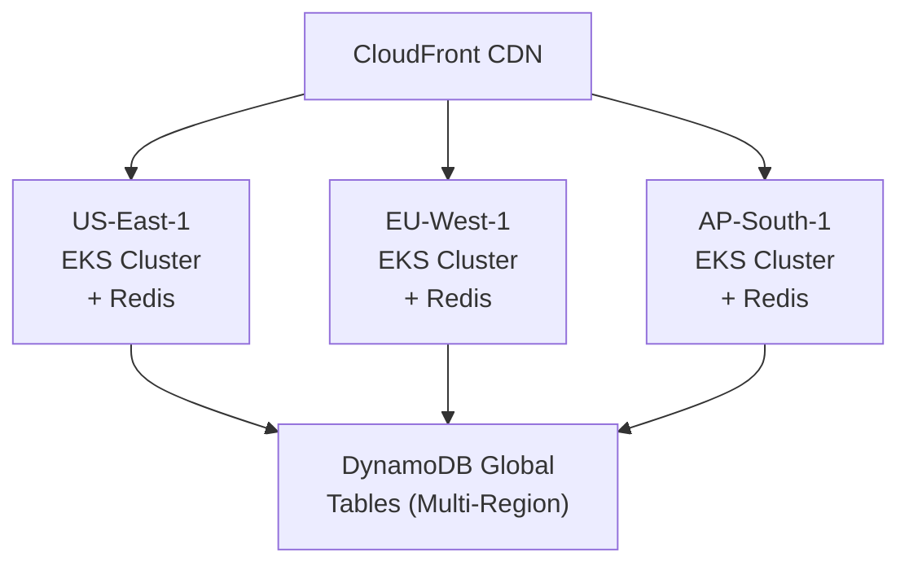
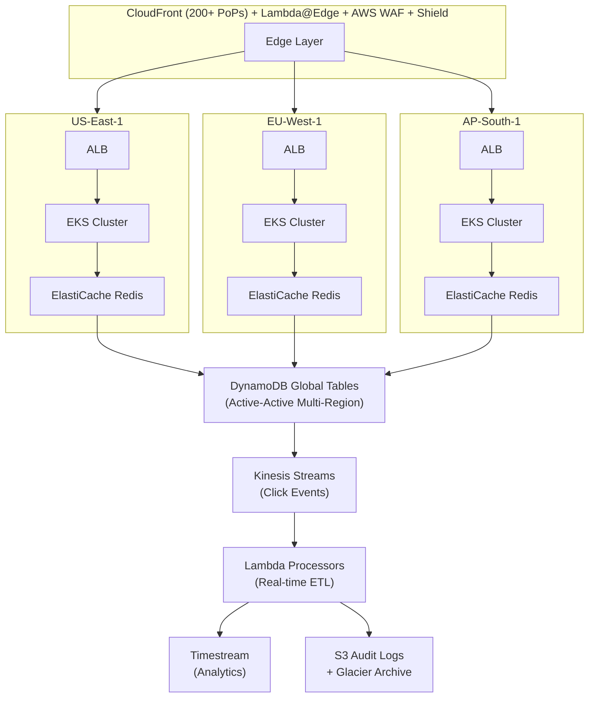
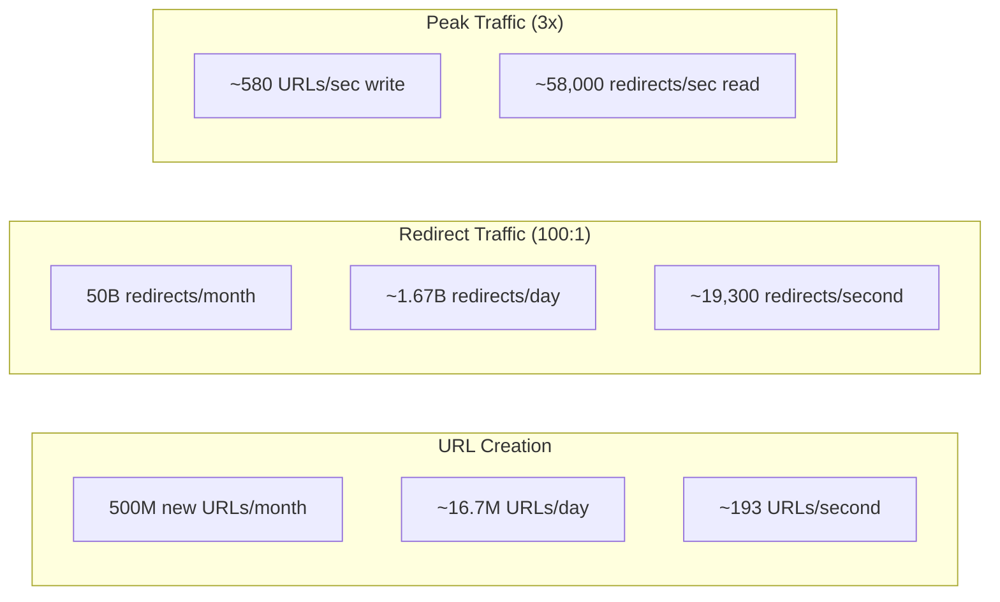
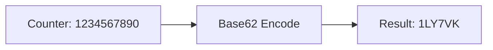
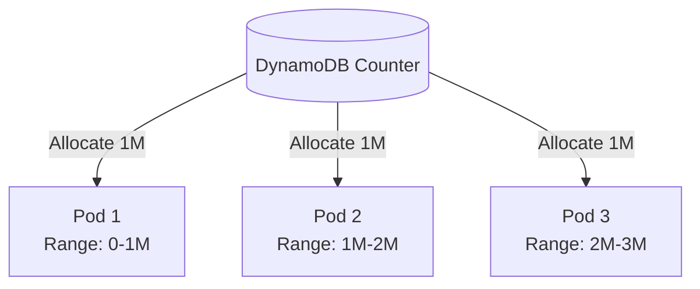

# URL Shortener System Design - Overview

## Introduction

This document describes the system design for a production-grade URL shortener service that scales from a local development environment to serving **500 million new URLs per month** across the globe. The system is built with Rust for maximum performance and deployed on AWS infrastructure.

## What is a URL Shortener?

A URL shortener is a service that converts long URLs into short, memorable links that redirect to the original destination. For example:

```
Original:  https://example.com/very/long/path/with/many/parameters?utm_source=email&campaign=summer2026
Shortened: https://short.io/abc123X
```

## Core Use Cases

1. **Social Media Sharing**: Character-limited platforms benefit from shorter URLs
2. **Marketing Campaigns**: Track click-through rates with unique short links
3. **Print Media**: QR codes and printed materials need concise URLs
4. **Analytics**: Understand user behavior through click tracking
5. **A/B Testing**: Route traffic to different destinations dynamically

---

## Scaling Tiers

The system is designed to evolve through five distinct scaling tiers, each building upon the previous one:

```mermaid
flowchart LR
    subgraph Tier1["Tier 1: LOCAL"]
        T1_scale["1K URLs/mo<br/>10 RPS"]
        T1_tech["SQLite<br/>Single Binary"]
    end
    
    subgraph Tier2["Tier 2: STARTUP"]
        T2_scale["100K URLs/mo<br/>100 RPS"]
        T2_tech["PostgreSQL<br/>+ Redis"]
    end
    
    subgraph Tier3["Tier 3: GROWTH"]
        T3_scale["10M URLs/mo<br/>1K RPS"]
        T3_tech["Multi-Instance<br/>+ Replicas"]
    end
    
    subgraph Tier4["Tier 4: SCALE"]
        T4_scale["100M URLs/mo<br/>10K RPS"]
        T4_tech["Multi-Region<br/>+ Global DB"]
    end
    
    subgraph Tier5["Tier 5: GLOBAL"]
        T5_scale["500M URLs/mo<br/>50K+ RPS"]
        T5_tech["Edge Computing"]
    end
    
    Tier1 --> Tier2 --> Tier3 --> Tier4 --> Tier5
```



### Tier 1: Local Development (1K URLs/month)

**Target**: Individual developers, prototyping, local testing

| Aspect | Details |
|--------|---------|
| Scale | ~1,000 URLs/month, ~10 reads/second |
| Infrastructure | Single binary, SQLite database |
| Deployment | Local machine or single VPS |
| Cost | $0 - $5/month |

**Architecture**:



### Tier 2: Startup (100K URLs/month)

**Target**: Early-stage startups, small teams, MVPs

| Aspect | Details |
|--------|---------|
| Scale | ~100,000 URLs/month, ~100 reads/second |
| Infrastructure | Single server, PostgreSQL, Redis cache |
| Deployment | Single EC2 instance or equivalent |
| Cost | $50 - $200/month |

**Architecture**:



### Tier 3: Growth (10M URLs/month)

**Target**: Growing companies, moderate traffic, first scale challenges

| Aspect | Details |
|--------|---------|
| Scale | ~10 million URLs/month, ~1,000 reads/second |
| Infrastructure | Load balancer, multiple instances, read replicas |
| Deployment | Kubernetes cluster (EKS) |
| Cost | $1,000 - $5,000/month |

**Architecture**:



### Tier 4: Scale (100M URLs/month)

**Target**: Large companies, multi-region requirements, compliance needs

| Aspect | Details |
|--------|---------|
| Scale | ~100 million URLs/month, ~10,000 reads/second |
| Infrastructure | Multi-region, DynamoDB Global Tables, CloudFront |
| Deployment | Multi-region EKS clusters |
| Cost | $10,000 - $50,000/month |

**Architecture**:



### Tier 5: Global (500M URLs/month)

**Target**: Internet-scale companies, global presence, real-time requirements

| Aspect | Details |
|--------|---------|
| Scale | ~500 million URLs/month, ~50,000+ reads/second |
| Infrastructure | Edge computing, sharded architecture, real-time analytics |
| Deployment | Global edge presence (50+ locations) |
| Cost | $100,000+/month |

**Architecture**:



---

## Traffic Calculations

### Tier 5 Capacity Planning (500M URLs/month)



### Storage Calculations

| Item | Calculation |
|------|-------------|
| Per URL Record | short_code (7B) + original_url (~200B) + metadata (~100B) = ~310 bytes |
| Monthly Storage | 500M URLs × 310 bytes = **155 GB/month** |
| Annual Storage | **1.86 TB/year** |
| Analytics (per click) | ~200 bytes × 50B clicks = 10 TB/month (before rollup) |
| After Daily Rollup | ~100 GB/month |

---

## Technology Stack

| Component | Technology | Rationale |
|-----------|------------|-----------|
| Language | Rust | Maximum performance, memory safety, zero-cost abstractions |
| Web Framework | Axum | Async, type-safe, excellent performance |
| Database (Local) | SQLite | Zero configuration, embedded |
| Database (Production) | DynamoDB | Global replication, auto-scaling, single-digit ms latency |
| Cache | Redis (ElastiCache) | Sub-ms latency, clustering support |
| CDN | CloudFront | Global edge network, Lambda@Edge support |
| Container Orchestration | EKS (Kubernetes) | Industry standard, auto-scaling |
| Infrastructure | Terraform | Reproducible, version-controlled infrastructure |
| Observability | OpenTelemetry | Vendor-neutral, comprehensive telemetry |
| Metrics | CloudWatch + Grafana | AWS-native + visualization |
| Tracing | AWS X-Ray | Distributed tracing across services |

---

## Key Design Decisions

### 1. Short Code Generation

Using **Base62 encoding** with 7 characters:
- Character set: `0-9`, `a-z`, `A-Z` (62 characters)
- 7 characters = 62^7 = **3.5 trillion** unique combinations
- At 500M URLs/month, this lasts ~580 years



### 2. ID Generation Strategy

**Approach**: Distributed counter with range allocation
- Each instance gets a range of IDs (e.g., 1M IDs at a time)
- No coordination needed for most writes
- DynamoDB atomic counter for range allocation



### 3. Caching Strategy

**Write-through cache** with 24-hour TTL:
- Write to both cache and database on create
- Read from cache first, fallback to database
- Popular URLs stay hot in cache
- Cache hit rate target: >95%

### 4. Collision Handling

**Check-and-retry** with exponential backoff:
- For custom aliases: immediate collision check
- For generated codes: statistically near-zero collision probability
- Retry up to 3 times with randomized suffix

---

## Document Index

| Document | Description |
|----------|-------------|
| [02-requirements.md](./02-requirements.md) | Functional and non-functional requirements per tier |
| [03-architecture.md](./03-architecture.md) | Detailed architecture and component design |
| [04-database-design.md](./04-database-design.md) | Schema, cleanup, and purge policies |
| [05-security-compliance.md](./05-security-compliance.md) | GDPR, CCPA, SOC2, HIPAA compliance |
| [06-telemetry.md](./06-telemetry.md) | Observability and monitoring strategy |
| [07-deployment.md](./07-deployment.md) | AWS infrastructure and deployment |

---

## Quick Start

```bash
# Local development (Tier 1)
cargo run

# Docker development
docker-compose up -d

# Kubernetes deployment (Tier 3+)
kubectl apply -k k8s/overlays/production/
```

---

## Repository Structure

```
url-shortener/
├── docs/                    # Documentation
├── src/                     # Rust application source
│   ├── main.rs              # Entry point
│   ├── api/                 # HTTP handlers
│   ├── domain/              # Business logic
│   ├── infrastructure/      # External services
│   ├── telemetry/           # Observability
│   └── compliance/          # Compliance modules
├── migrations/              # Database migrations
├── terraform/               # Infrastructure as Code
├── docker/                  # Container configurations
├── k8s/                     # Kubernetes manifests
├── Cargo.toml               # Rust dependencies
└── README.md                # Project README
```
